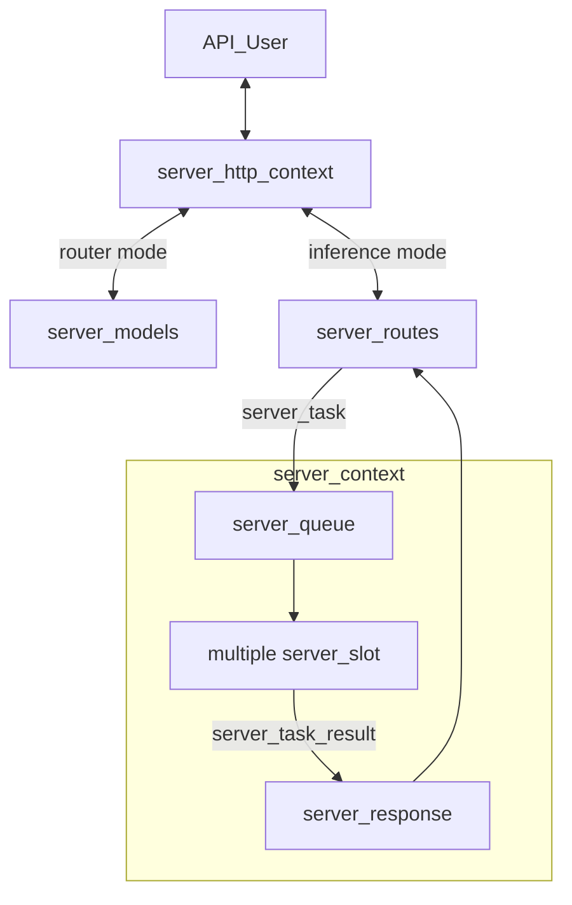
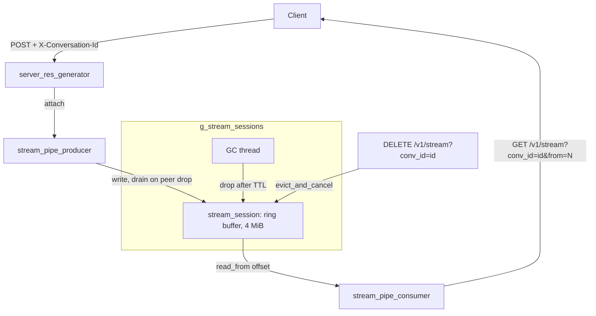

# llama.cpp llama-server web-search with WebUI options

**Session ID:** ses_f05fea3ffffe5a1tbl6tZjTc0k
**Created:** 10/2/2026, 9:26:28 AM
**Updated:** 10/2/2026, 12:08:34 PM

---

## User

I am writing about llama.cpp and llama-server. I want to verify few points with the latest web-ui shipped with llama.cpp server. I saw options for both MCP and tools. is there a way to have also web-search and web-fetch only using open-source or free resources? 

---

## Assistant (Plan · GPT-6 Luna Fast · 6.2s)

_Thinking:_

**Researching web UI resources**

I need to explore the latest web UI information because the user is looking for facts and feasibility related to free resources. I should utilize web searches via my webfetch tool, focusing on current documentation and GitHub README files. It's possible I'll also need to inspect the current repo and clarify any questions if needed. Ultimately, I'll gather researched recommendations and planning based on my findings, without making any edits to the existing content.

**Tool: webfetch**

**Input:**
```json
{
  "url": "https://github.com/ggml-org/llama.cpp/tree/master/tools/server"
}
```

**Output:**
```
                                                                                                                 llama.cpp/tools/server at master · ggml-org/llama.cpp · GitHub                                             

[Skip to content](#start-of-content)     

    

            

## Navigation Menu

[](/)

[Sign in](/login?return_to=https%3A%2F%2Fgithub.com%2Fggml-org%2Fllama.cpp%2Ftree%2Fmaster%2Ftools%2Fserver)

Appearance settings

-   Platform
    
    -   AI CODE CREATION
        
        -   [GitHub CopilotWrite better code with AI](https://github.com/features/copilot)
        -   [GitHub Copilot appDirect agents from issue to merge](https://github.com/features/ai/github-app)
        -   [MCP RegistryIntegrate external tools](https://github.com/mcp)
        
    -   DEVELOPER WORKFLOWS
        
        -   [ActionsAutomate any workflow](https://github.com/features/actions)
        -   [CodespacesInstant dev environments](https://github.com/features/codespaces)
        -   [IssuesPlan and track work](https://github.com/features/issues)
        -   [Code ReviewManage code changes](https://github.com/features/code-review)
        -   [Code QualityEnforce quality at merge](https://github.com/features/code-quality)
        
    -   APPLICATION SECURITY
        
        -   [GitHub Advanced SecurityFind and fix vulnerabilities](https://github.com/security/advanced-security)
        -   [Code securitySecure your code as you build](https://github.com/security/advanced-security/code-security)
        -   [Secret protectionStop leaks before they start](https://github.com/security/advanced-security/secret-protection)
        
    -   EXPLORE
        
        -   [Why GitHub](https://github.com/why-github)
        -   [Documentation](https://docs.github.com)
        -   [Blog](https://github.blog)
        -   [Changelog](https://github.blog/changelog)
        -   [Marketplace](https://github.com/marketplace)
        
    
    [View all features](https://github.com/features)
    
-   Solutions
    
    -   BY COMPANY SIZE
        
        -   [Enterprises](https://github.com/enterprise)
        -   [Small and medium teams](https://github.com/team)
        -   [Startups](https://github.com/enterprise/startups)
        -   [Nonprofits](https://github.com/solutions/industry/nonprofits)
        
    -   BY USE CASE
        
        -   [App Modernization](https://github.com/solutions/use-case/app-modernization)
        -   [DevSecOps](https://github.com/solutions/use-case/devsecops)
        -   [DevOps](https://github.com/solutions/use-case/devops)
        -   [CI/CD](https://github.com/solutions/use-case/ci-cd)
        -   [View all use cases](https://github.com/solutions/use-case)
        
    -   BY INDUSTRY
        
        -   [Healthcare](https://github.com/solutions/industry/healthcare)
        -   [Financial services](https://github.com/solutions/industry/financial-services)
        -   [Manufacturing](https://github.com/solutions/industry/manufacturing)
        -   [Government](https://github.com/solutions/industry/government)
        -   [View all industries](https://github.com/solutions/industry)
        
    
    [View all solutions](https://github.com/solutions)
    
-   Resources
    
    -   EXPLORE BY TOPIC
        
        -   [AI](https://github.com/resources/articles?topic=ai)
        -   [Software Development](https://github.com/resources/articles?topic=software-development)
        -   [DevOps](https://github.com/resources/articles?topic=devops)
        -   [Security](https://github.com/resources/articles?topic=security)
        -   [View all topics](https://github.com/resources/articles)
        
    -   EXPLORE BY TYPE
        
        -   [Customer stories](https://github.com/customer-stories)
        -   [Events & webinars](https://github.com/resources/events)
        -   [Ebooks & reports](https://github.com/resources/whitepapers)
        -   [Business insights](https://github.com/solutions/executive-insights)
        -   [GitHub Skills](https://skills.github.com)
        
    -   SUPPORT & SERVICES
        
        -   [Documentation](https://docs.github.com)
        -   [Customer support](https://support.github.com)
        -   [Community forum](https://github.com/orgs/community/discussions)
        -   [Trust center](https://github.com/trust-center)
        -   [Partners](https://github.com/partners)
        
    
    [View all resources](https://github.com/resources)
    
-   Open Source
    
    -   COMMUNITY
        
        -   [GitHub SponsorsFund open source developers](https://github.com/open-source/sponsors)
        
    -   PROGRAMS
        
        -   [Security Lab](https://securitylab.github.com)
        -   [Maintainer Community](https://maintainers.github.com)
        -   [GitHub Stars](https://stars.github.com)
        -   [Archive Program](https://archiveprogram.github.com)
        
    -   REPOSITORIES
        
        -   [Topics](https://github.com/topics)
        -   [Trending](https://github.com/trending)
        -   [Collections](https://github.com/collections)
        
    
-   Enterprise
    
    -   ENTERPRISE SOLUTIONS
        
        -   [Enterprise platformAI-powered developer platform](https://github.com/enterprise)
        
    -   AVAILABLE ADD-ONS
        
        -   [GitHub Advanced SecurityEnterprise-grade security features](https://github.com/security/advanced-security)
        -   [Copilot for BusinessEnterprise-grade AI features](https://github.com/features/copilot/copilot-business)
        -   [Premium SupportEnterprise-grade 24/7 support](https://github.com/enterprise/premium-support)
        
    
-   [Pricing](https://github.com/pricing)

Search/

[Sign in](/login?return_to=https%3A%2F%2Fgithub.com%2Fggml-org%2Fllama.cpp%2Ftree%2Fmaster%2Ftools%2Fserver)

[Sign up](/signup?ref_cta=Sign+up&ref_loc=header+logged+out&ref_page=%2F%3Cuser-name%3E%2F%3Crepo-name%3E%2Ffiles%2Fdisambiguate&source=header-repo&source_repo=ggml-org%2Fllama.cpp)

Appearance settings

You signed in with another tab or window. Reload to refresh your session. You signed out in another tab or window. Reload to refresh your session. You switched accounts on another tab or window. Reload to refresh your session. Dismiss alert

[ggml-org](/ggml-org) / **[llama.cpp](/ggml-org/llama.cpp)** Public

-   [Notifications](/login?return_to=%2Fggml-org%2Fllama.cpp) You must be signed in to change notification settings
-   [Fork 24k](/login?return_to=%2Fggml-org%2Fllama.cpp)
-   [Star 130k](/login?return_to=%2Fggml-org%2Fllama.cpp)
    

-   [Code](/ggml-org/llama.cpp)
-   [Issues 870](/ggml-org/llama.cpp/issues)
-   [Pull requests 1.7k](/ggml-org/llama.cpp/pulls)
-   [Discussions](/ggml-org/llama.cpp/discussions)
-   [Actions](/ggml-org/llama.cpp/actions)
-   [Projects](/ggml-org/llama.cpp/projects)
-   [Wiki](/ggml-org/llama.cpp/wiki)
-   [Security and quality 13](/ggml-org/llama.cpp/security)
-   [Insights](/ggml-org/llama.cpp/pulse)

Additional navigation options

-   [Code](/ggml-org/llama.cpp)
-   [Issues](/ggml-org/llama.cpp/issues)
-   [Pull requests](/ggml-org/llama.cpp/pulls)
-   [Discussions](/ggml-org/llama.cpp/discussions)
-   [Actions](/ggml-org/llama.cpp/actions)
-   [Projects](/ggml-org/llama.cpp/projects)
-   [Wiki](/ggml-org/llama.cpp/wiki)
-   [Security and quality](/ggml-org/llama.cpp/security)
-   [Insights](/ggml-org/llama.cpp/pulse)

 [](/ggml-org/llama.cpp)

## FilesExpand file tree

master

## Breadcrumbs

1.  [llama.cpp](/ggml-org/llama.cpp/tree/master)
2.  /[tools](/ggml-org/llama.cpp/tree/master/tools)

/

# server

/

Copy path

## Directory actions

## More options

More options

## Directory actions

## More options

More options

## Latest commit

## History

[History](/ggml-org/llama.cpp/commits/master/tools/server)

[](/ggml-org/llama.cpp/commits/master/tools/server)History

master

## Breadcrumbs

1.  [llama.cpp](/ggml-org/llama.cpp/tree/master)
2.  /[tools](/ggml-org/llama.cpp/tree/master/tools)

/

# server

/

Copy path

Top

## Folders and files

Name

Name

Last commit message

Last commit date

### parent directory

[

..

](/ggml-org/llama.cpp/tree/master/tools)

[bench](/ggml-org/llama.cpp/tree/master/tools/server/bench "bench")

[bench](/ggml-org/llama.cpp/tree/master/tools/server/bench "bench")

[tests](/ggml-org/llama.cpp/tree/master/tools/server/tests "tests")

[tests](/ggml-org/llama.cpp/tree/master/tools/server/tests "tests")

[CMakeLists.txt](/ggml-org/llama.cpp/blob/master/tools/server/CMakeLists.txt "CMakeLists.txt")

[CMakeLists.txt](/ggml-org/llama.cpp/blob/master/tools/server/CMakeLists.txt "CMakeLists.txt")

[README-dev.md](/ggml-org/llama.cpp/blob/master/tools/server/README-dev.md "README-dev.md")

[README-dev.md](/ggml-org/llama.cpp/blob/master/tools/server/README-dev.md "README-dev.md")

[README.md](/ggml-org/llama.cpp/blob/master/tools/server/README.md "README.md")

[README.md](/ggml-org/llama.cpp/blob/master/tools/server/README.md "README.md")

[main.cpp](/ggml-org/llama.cpp/blob/master/tools/server/main.cpp "main.cpp")

[main.cpp](/ggml-org/llama.cpp/blob/master/tools/server/main.cpp "main.cpp")

[server-chat.cpp](/ggml-org/llama.cpp/blob/master/tools/server/server-chat.cpp "server-chat.cpp")

[server-chat.cpp](/ggml-org/llama.cpp/blob/master/tools/server/server-chat.cpp "server-chat.cpp")

[server-chat.h](/ggml-org/llama.cpp/blob/master/tools/server/server-chat.h "server-chat.h")

[server-chat.h](/ggml-org/llama.cpp/blob/master/tools/server/server-chat.h "server-chat.h")

[server-common.cpp](/ggml-org/llama.cpp/blob/master/tools/server/server-common.cpp "server-common.cpp")

[server-common.cpp](/ggml-org/llama.cpp/blob/master/tools/server/server-common.cpp "server-common.cpp")

[server-common.h](/ggml-org/llama.cpp/blob/master/tools/server/server-common.h "server-common.h")

[server-common.h](/ggml-org/llama.cpp/blob/master/tools/server/server-common.h "server-common.h")

[server-context.cpp](/ggml-org/llama.cpp/blob/master/tools/server/server-context.cpp "server-context.cpp")

[server-context.cpp](/ggml-org/llama.cpp/blob/master/tools/server/server-context.cpp "server-context.cpp")

[server-context.h](/ggml-org/llama.cpp/blob/master/tools/server/server-context.h "server-context.h")

[server-context.h](/ggml-org/llama.cpp/blob/master/tools/server/server-context.h "server-context.h")

[server-cors-proxy.h](/ggml-org/llama.cpp/blob/master/tools/server/server-cors-proxy.h "server-cors-proxy.h")

[server-cors-proxy.h](/ggml-org/llama.cpp/blob/master/tools/server/server-cors-proxy.h "server-cors-proxy.h")

[server-http.cpp](/ggml-org/llama.cpp/blob/master/tools/server/server-http.cpp "server-http.cpp")

[server-http.cpp](/ggml-org/llama.cpp/blob/master/tools/server/server-http.cpp "server-http.cpp")

[server-http.h](/ggml-org/llama.cpp/blob/master/tools/server/server-http.h "server-http.h")

[server-http.h](/ggml-org/llama.cpp/blob/master/tools/server/server-http.h "server-http.h")

[server-mcp.cpp](/ggml-org/llama.cpp/blob/master/tools/server/server-mcp.cpp "server-mcp.cpp")

[server-mcp.cpp](/ggml-org/llama.cpp/blob/master/tools/server/server-mcp.cpp "server-mcp.cpp")

[server-mcp.h](/ggml-org/llama.cpp/blob/master/tools/server/server-mcp.h "server-mcp.h")

[server-mcp.h](/ggml-org/llama.cpp/blob/master/tools/server/server-mcp.h "server-mcp.h")

[server-models.cpp](/ggml-org/llama.cpp/blob/master/tools/server/server-models.cpp "server-models.cpp")

[server-models.cpp](/ggml-org/llama.cpp/blob/master/tools/server/server-models.cpp "server-models.cpp")

[server-models.h](/ggml-org/llama.cpp/blob/master/tools/server/server-models.h "server-models.h")

[server-models.h](/ggml-org/llama.cpp/blob/master/tools/server/server-models.h "server-models.h")

[server-queue.cpp](/ggml-org/llama.cpp/blob/master/tools/server/server-queue.cpp "server-queue.cpp")

[server-queue.cpp](/ggml-org/llama.cpp/blob/master/tools/server/server-queue.cpp "server-queue.cpp")

[server-queue.h](/ggml-org/llama.cpp/blob/master/tools/server/server-queue.h "server-queue.h")

[server-queue.h](/ggml-org/llama.cpp/blob/master/tools/server/server-queue.h "server-queue.h")

[server-schema.cpp](/ggml-org/llama.cpp/blob/master/tools/server/server-schema.cpp "server-schema.cpp")

[server-schema.cpp](/ggml-org/llama.cpp/blob/master/tools/server/server-schema.cpp "server-schema.cpp")

[server-schema.h](/ggml-org/llama.cpp/blob/master/tools/server/server-schema.h "server-schema.h")

[server-schema.h](/ggml-org/llama.cpp/blob/master/tools/server/server-schema.h "server-schema.h")

[server-stream.cpp](/ggml-org/llama.cpp/blob/master/tools/server/server-stream.cpp "server-stream.cpp")

[server-stream.cpp](/ggml-org/llama.cpp/blob/master/tools/server/server-stream.cpp "server-stream.cpp")

[server-stream.h](/ggml-org/llama.cpp/blob/master/tools/server/server-stream.h "server-stream.h")

[server-stream.h](/ggml-org/llama.cpp/blob/master/tools/server/server-stream.h "server-stream.h")

[server-task.cpp](/ggml-org/llama.cpp/blob/master/tools/server/server-task.cpp "server-task.cpp")

[server-task.cpp](/ggml-org/llama.cpp/blob/master/tools/server/server-task.cpp "server-task.cpp")

[server-task.h](/ggml-org/llama.cpp/blob/master/tools/server/server-task.h "server-task.h")

[server-task.h](/ggml-org/llama.cpp/blob/master/tools/server/server-task.h "server-task.h")

[server-tools.cpp](/ggml-org/llama.cpp/blob/master/tools/server/server-tools.cpp "server-tools.cpp")

[server-tools.cpp](/ggml-org/llama.cpp/blob/master/tools/server/server-tools.cpp "server-tools.cpp")

[server-tools.h](/ggml-org/llama.cpp/blob/master/tools/server/server-tools.h "server-tools.h")

[server-tools.h](/ggml-org/llama.cpp/blob/master/tools/server/server-tools.h "server-tools.h")

[server.cpp](/ggml-org/llama.cpp/blob/master/tools/server/server.cpp "server.cpp")

[server.cpp](/ggml-org/llama.cpp/blob/master/tools/server/server.cpp "server.cpp")

View all files

## [README.md](#readme)

Outline

# LLaMA.cpp HTTP Server

[](#llamacpp-http-server)

Fast, lightweight, pure C/C++ HTTP server based on [httplib](https://github.com/yhirose/cpp-httplib), [nlohmann::json](https://github.com/nlohmann/json) and **llama.cpp**.

Set of LLM REST APIs and a web UI to interact with llama.cpp.

**Features:**

-   LLM inference of F16 and quantized models on GPU and CPU
-   [OpenAI API](https://github.com/openai/openai-openapi) compatible chat completions, responses, and embeddings routes
-   [Anthropic Messages API](https://docs.anthropic.com/en/api/messages) compatible chat completions
-   Reranking endpoint ([#9510](https://github.com/ggml-org/llama.cpp/pull/9510))
-   Parallel decoding with multi-user support
-   Continuous batching
-   Multimodal ([documentation](/ggml-org/llama.cpp/blob/master/docs/multimodal.md)) / with OpenAI-compatible API support
-   Monitoring endpoints
-   Schema-constrained JSON response format
-   Prefilling of assistant messages similar to the Claude API
-   [Function calling](/ggml-org/llama.cpp/blob/master/docs/function-calling.md) / tool use for ~any model
-   Speculative decoding
-   Easy-to-use web UI

For the full list of features, please refer to [server's changelog](https://github.com/ggml-org/llama.cpp/issues/9291)

## Usage

[](#usage)

### Common params

[](#common-params)

Argument

Explanation

`-h, --help, --usage`

print usage and exit

`--version`

show version and build info

`-cl, --cache-list`

show list of models in cache

`--completion-bash`

print source-able bash completion script for llama.cpp

`-t, --threads N`

number of CPU threads to use during generation (default: -1)  
(env: LLAMA\_ARG\_THREADS)

`-tb, --threads-batch N`

number of threads to use during batch and prompt processing (default: same as --threads)

`-C, --cpu-mask M`

CPU affinity mask: arbitrarily long hex. Complements cpu-range (default: "")

`-Cr, --cpu-range lo-hi`

range of CPUs for affinity. Complements --cpu-mask

`--cpu-strict <0|1>`

use strict CPU placement (default: 0)

`--prio N`

set process/thread priority : low(-1), normal(0), medium(1), high(2), realtime(3) (default: 0)

`--poll <0...100>`

use polling level to wait for work (0 - no polling, default: 50)

`-Cb, --cpu-mask-batch M`

CPU affinity mask: arbitrarily long hex. Complements cpu-range-batch (default: same as --cpu-mask)

`-Crb, --cpu-range-batch lo-hi`

ranges of CPUs for affinity. Complements --cpu-mask-batch

`--cpu-strict-batch <0|1>`

use strict CPU placement (default: same as --cpu-strict)

`--prio-batch N`

set process/thread priority : 0-normal, 1-medium, 2-high, 3-realtime (default: 0)

`--poll-batch <0|1>`

use polling to wait for work (default: same as --poll)

`-c, --ctx-size N`

size of the prompt context (default: 0, 0 = loaded from model)  
(env: LLAMA\_ARG\_CTX\_SIZE)

`-n, --predict, --n-predict N`

number of tokens to predict (default: -1, -1 = infinity)  
(env: LLAMA\_ARG\_N\_PREDICT)

`-b, --batch-size N`

logical maximum batch size (default: 2048)  
(env: LLAMA\_ARG\_BATCH)

`-ub, --ubatch-size N`

physical maximum batch size (default: 512)  
(env: LLAMA\_ARG\_UBATCH)

`--keep N`

number of tokens to keep from the initial prompt (default: 0, -1 = all)

`--swa-full`

use full-size SWA cache (default: false)  
[(more info)](https://github.com/ggml-org/llama.cpp/pull/13194#issuecomment-2868343055)  
(env: LLAMA\_ARG\_SWA\_FULL)

`-fa, --flash-attn [on|off|auto]`

set Flash Attention use ('on', 'off', or 'auto', default: 'auto')  
(env: LLAMA\_ARG\_FLASH\_ATTN)

`--perf, --no-perf`

whether to enable internal libllama performance timings (default: false)  
(env: LLAMA\_ARG\_PERF)

`-e, --escape, --no-escape`

whether to process escapes sequences (\\n, \\r, \\t, ', ", \\) (default: true)

`--rope-scaling {none,linear,yarn}`

RoPE frequency scaling method, defaults to linear unless specified by the model  
(env: LLAMA\_ARG\_ROPE\_SCALING\_TYPE)

`--rope-scale N`

RoPE context scaling factor, expands context by a factor of N  
(env: LLAMA\_ARG\_ROPE\_SCALE)

`--rope-freq-base N`

RoPE base frequency, used by NTK-aware scaling (default: loaded from model)  
(env: LLAMA\_ARG\_ROPE\_FREQ\_BASE)

`--rope-freq-scale N`

RoPE frequency scaling factor, expands context by a factor of 1/N  
(env: LLAMA\_ARG\_ROPE\_FREQ\_SCALE)

`--yarn-orig-ctx N`

YaRN: original context size of model (default: 0 = model training context size)  
(env: LLAMA\_ARG\_YARN\_ORIG\_CTX)

`--yarn-ext-factor N`

YaRN: extrapolation mix factor (default: -1.00, 0.0 = full interpolation)  
(env: LLAMA\_ARG\_YARN\_EXT\_FACTOR)

`--yarn-attn-factor N`

YaRN: scale sqrt(t) or attention magnitude (default: -1.00)  
(env: LLAMA\_ARG\_YARN\_ATTN\_FACTOR)

`--yarn-beta-slow N`

YaRN: high correction dim or alpha (default: -1.00)  
(env: LLAMA\_ARG\_YARN\_BETA\_SLOW)

`--yarn-beta-fast N`

YaRN: low correction dim or beta (default: -1.00)  
(env: LLAMA\_ARG\_YARN\_BETA\_FAST)

`-kvo, --kv-offload, -nkvo, --no-kv-offload`

whether to enable KV cache offloading (default: enabled)  
(env: LLAMA\_ARG\_KV\_OFFLOAD)

`--repack, -nr, --no-repack`

whether to enable weight repacking (default: enabled)  
(env: LLAMA\_ARG\_REPACK)

`--no-host`

bypass host buffer allowing extra buffers to be used  
(env: LLAMA\_ARG\_NO\_HOST)

`-ctk, --cache-type-k TYPE`

KV cache data type for K  
allowed values: f32, f16, bf16, q8\_0, q4\_0, q4\_1, iq4\_nl, q5\_0, q5\_1  
(default: f16)  
(env: LLAMA\_ARG\_CACHE\_TYPE\_K)

`-ctv, --cache-type-v TYPE`

KV cache data type for V  
allowed values: f32, f16, bf16, q8\_0, q4\_0, q4\_1, iq4\_nl, q5\_0, q5\_1  
(default: f16)  
(env: LLAMA\_ARG\_CACHE\_TYPE\_V)

`-dt, --defrag-thold N`

KV cache defragmentation threshold (DEPRECATED)  
(env: LLAMA\_ARG\_DEFRAG\_THOLD)

`--rpc SERVERS`

comma-separated list of RPC servers (host:port)  
(env: LLAMA\_ARG\_RPC)

`-lm, --load-mode MODE`

model loading mode (default: auto)  
\- auto: mmap, unless a device does not support it  
\- none: no special loading mode  
\- mmap: memory-map model (if mmap disabled, slower load but may reduce pageouts if not using mlock)  
\- mlock: force system to keep model in RAM rather than swapping or compressing  
\- mmap+mlock: mmap + force system to keep model in RAM rather than swapping or compressing  
\- dio: use DirectIO if available  
  
(env: LLAMA\_ARG\_LOAD\_MODE)

`-lzm, --lazy-mode MODE`

on-demand reading of certain tensors, for example per-layer embeddings (default: auto)  
\- on: read the rows of such tensors from disk on demand instead of keeping them resident (requires mmap)  
\- auto: on, but only for tensors larger than 4 GiB  
\- off: always keep them resident  
(env: LLAMA\_ARG\_LAZY\_MODE)

`--numa TYPE`

attempt optimizations that help on some NUMA systems  
\- distribute: spread execution evenly over all nodes  
\- isolate: only spawn threads on CPUs on the node that execution started on  
\- numactl: use the CPU map provided by numactl  
if run without this previously, it is recommended to drop the system page cache before using this  
see [#1437](https://github.com/ggml-org/llama.cpp/issues/1437)  
(env: LLAMA\_ARG\_NUMA)

`-dev, --device <dev1,dev2,..>`

comma-separated list of devices to use for offloading (none = don't offload)  
use --list-devices to see a list of available devices  
(env: LLAMA\_ARG\_DEVICE)

`--list-devices`

print list of available devices and exit

`-ot, --override-tensor <tensor name pattern>=<buffer type>,...`

override tensor buffer type  
(env: LLAMA\_ARG\_OVERRIDE\_TENSOR)

`-cmoe, --cpu-moe`

keep all Mixture of Experts (MoE) weights in the CPU  
(env: LLAMA\_ARG\_CPU\_MOE)

`-ncmoe, --n-cpu-moe N`

keep the Mixture of Experts (MoE) weights of the first N layers in the CPU  
(env: LLAMA\_ARG\_N\_CPU\_MOE)

`-ncffn, --n-cpu-ffn N`

keep the dense FFN weights of the first N layers in the CPU  
(dense models; for MoE expert weights use --n-cpu-moe)  
(env: LLAMA\_ARG\_N\_CPU\_FFN)

`-ngl, --gpu-layers, --n-gpu-layers N`

max. number of layers to store in VRAM, either an exact number, 'auto', or 'all' (default: auto)  
(env: LLAMA\_ARG\_N\_GPU\_LAYERS)

`-sm, --split-mode {none,layer,row,tensor}`

how to split the model across multiple GPUs, one of:  
\- none: use one GPU only  
\- layer (default): split layers and KV across GPUs (pipelined)  
\- row: split weight across GPUs by rows (parallelized)  
\- tensor: split weights and KV across GPUs (parallelized, EXPERIMENTAL)  
(env: LLAMA\_ARG\_SPLIT\_MODE)

`-ts, --tensor-split N0,N1,N2,...`

fraction of the model to offload to each GPU, comma-separated list of proportions, e.g. 3,1  
(env: LLAMA\_ARG\_TENSOR\_SPLIT)

`-mg, --main-gpu INDEX`

the GPU to use for the model (with split-mode = none), or for intermediate results and KV (with split-mode = row) (default: 0)  
(env: LLAMA\_ARG\_MAIN\_GPU)

`-fit, --fit [on|off]`

whether to adjust unset arguments to fit in device memory ('on' or 'off', default: 'on')  
(env: LLAMA\_ARG\_FIT)

`-fitt, --fit-target MiB0,MiB1,MiB2,...`

target margin per device for --fit, comma-separated list of values, single value is broadcast across all devices, default: 1024  
(env: LLAMA\_ARG\_FIT\_TARGET)

`-fitc, --fit-ctx N`

minimum ctx size that can be set by --fit option, default: 4096  
(env: LLAMA\_ARG\_FIT\_CTX)

`--check-tensors`

check model tensor data for invalid values (default: false)

`--override-kv KEY=TYPE:VALUE,...`

advanced option to override model metadata by key. to specify multiple overrides, either use comma-separated values.  
types: int, float, bool, str. example: --override-kv tokenizer.ggml.add\_bos\_token=bool:false,tokenizer.ggml.add\_eos\_token=bool:false

`--op-offload, --no-op-offload`

whether to offload host tensor operations to device (default: true)

`--lora FNAME`

path to LoRA adapter (use comma-separated values to load multiple adapters)

`--lora-scaled FNAME:SCALE,...`

path to LoRA adapter with user defined scaling (format: FNAME:SCALE,...)  
note: use comma-separated values

`--control-vector FNAME`

add a control vector  
note: use comma-separated values to add multiple control vectors

`--control-vector-scaled FNAME:SCALE,...`

add a control vector with user defined scaling SCALE  
note: use comma-separated values (format: FNAME:SCALE,...)

`--control-vector-layer-range START END`

layer range to apply the control vector(s) to, start and end inclusive

`-m, --model FNAME`

model path to load  
(env: LLAMA\_ARG\_MODEL)

`-mu, --model-url MODEL_URL`

model download url (default: unused)  
(env: LLAMA\_ARG\_MODEL\_URL)

`-dr, --docker-repo [<repo>/]<model>[:quant]`

Docker Hub model repository. repo is optional, default to ai/. quant is optional, default to :latest.  
example: gemma3  
(default: unused)  
(env: LLAMA\_ARG\_DOCKER\_REPO)

`-hf, -hfr, --hf-repo <user>/<model>[:quant]`

Hugging Face model repository; quant is optional, case-insensitive, default to Q4\_K\_M, or falls back to the first file in the repo if Q4\_K\_M doesn't exist.  
mmproj is also downloaded automatically if available. to disable, add --no-mmproj  
example: ggml-org/GLM-4.7-Flash-GGUF:Q4\_K\_M  
(default: unused)  
(env: LLAMA\_ARG\_HF\_REPO)

`-hff, --hf-file FILE`

Hugging Face model file. If specified, it will override the quant in --hf-repo (default: unused)  
(env: LLAMA\_ARG\_HF\_FILE)

`-hft, --hf-token TOKEN`

Hugging Face access token (default: value from HF\_TOKEN environment variable)  
(env: HF\_TOKEN)

`--log-disable`

Log disable

`--log-file FNAME`

Log to file  
(env: LLAMA\_ARG\_LOG\_FILE)

`--log-jsonl, --no-log-jsonl`

Log as JSONL (one JSON object per line) to stdout, this also disables colored logging (default: disabled)  
(env: LLAMA\_ARG\_LOG\_JSONL)

`--log-colors [on|off|auto]`

Set colored logging ('on', 'off', or 'auto', default: 'auto')  
'auto' enables colors when output is to a terminal  
(env: LLAMA\_ARG\_LOG\_COLORS)

`-v, --verbose, --log-verbose`

Set verbosity level to infinity (i.e. log all messages, useful for debugging)

`--offline`

Offline mode: forces use of cache, prevents network access  
(env: LLAMA\_ARG\_OFFLINE)

`-lv, --verbosity, --log-verbosity N`

Set the verbosity threshold. Messages with a higher verbosity will be ignored. Values:  
\- 0: generic output  
\- 1: error  
\- 2: warning  
\- 3: info  
\- 4: trace (more info)  
\- 5: debug  
(default: 3)  
  
(env: LLAMA\_ARG\_LOG\_VERBOSITY)

`--log-prefix, --no-log-prefix`

Enable prefix in log messages  
(env: LLAMA\_ARG\_LOG\_PREFIX)

`--log-timestamps, --no-log-timestamps`

Enable timestamps in log messages  
(env: LLAMA\_ARG\_LOG\_TIMESTAMPS)

`--spec-draft-type-k, -ctkd, --cache-type-k-draft TYPE`

KV cache data type for K for the draft model  
allowed values: f32, f16, bf16, q8\_0, q4\_0, q4\_1, iq4\_nl, q5\_0, q5\_1  
(default: f16)  
(env: LLAMA\_ARG\_SPEC\_DRAFT\_CACHE\_TYPE\_K)

`--spec-draft-type-v, -ctvd, --cache-type-v-draft TYPE`

KV cache data type for V for the draft model  
allowed values: f32, f16, bf16, q8\_0, q4\_0, q4\_1, iq4\_nl, q5\_0, q5\_1  
(default: f16)  
(env: LLAMA\_ARG\_SPEC\_DRAFT\_CACHE\_TYPE\_V)

### Sampling params

[](#sampling-params)

Argument

Explanation

`--samplers SAMPLERS`

samplers that will be used for generation in the order, separated by ';'  
(default: penalties;dry;top\_n\_sigma;top\_k;typ\_p;top\_p;min\_p;xtc;temperature)

`-s, --seed SEED`

RNG seed (default: -1, use random seed for -1)

`--sampler-seq, --sampling-seq SEQUENCE`

simplified sequence for samplers that will be used (default: edskypmxt)

`--ignore-eos`

ignore end of stream token and continue generating (implies --logit-bias EOS-inf)

`--temp, --temperature N`

temperature (default: 0.80)  
(env: LLAMA\_ARG\_TEMPERATURE)

`--top-k N`

top-k sampling (default: 40, 0 = disabled)  
(env: LLAMA\_ARG\_TOP\_K)

`--top-p N`

top-p sampling (default: 0.95, 1.0 = disabled)  
(env: LLAMA\_ARG\_TOP\_P)

`--min-p N`

min-p sampling (default: 0.05, 0.0 = disabled)  
(env: LLAMA\_ARG\_MIN\_P)

`--top-nsigma, --top-n-sigma N`

top-n-sigma sampling (default: -1.00, -1.0 = disabled)

`--xtc-probability N`

xtc probability (default: 0.00, 0.0 = disabled)

`--xtc-threshold N`

xtc threshold (default: 0.10, 1.0 = disabled)

`--typical, --typical-p N`

locally typical sampling, parameter p (default: 1.00, 1.0 = disabled)

`--repeat-last-n N`

last n tokens to consider for penalize (default: 64, 0 = disabled)

`--repeat-penalty N`

penalize repeat sequence of tokens (default: 1.00, 1.0 = disabled)  
(env: LLAMA\_ARG\_REPEAT\_PENALTY)

`--presence-penalty N`

repeat alpha presence penalty (default: 0.00, 0.0 = disabled)  
(env: LLAMA\_ARG\_PRESENCE\_PENALTY)

`--frequency-penalty N`

repeat alpha frequency penalty (default: 0.00, 0.0 = disabled)  
(env: LLAMA\_ARG\_FREQUENCY\_PENALTY)

`--dry-multiplier N`

set DRY sampling multiplier (default: 0.00, 0.0 = disabled)

`--dry-base N`

set DRY sampling base value (default: 1.75)

`--dry-allowed-length N`

set allowed length for DRY sampling (default: 2)

`--dry-penalty-last-n N`

set DRY penalty for the last n tokens (default: 64, 0 = disable)

`--dry-sequence-breaker STRING`

add sequence breaker for DRY sampling, clearing out default breakers ('\\n', ':', '"', '\*') in the process; use "none" to not use any sequence breakers

`--adaptive-target N`

adaptive-p: select tokens near this probability (valid range 0.0 to 1.0; negative = disabled) (default: -1.00)  
[(more info)](https://github.com/ggml-org/llama.cpp/pull/17927)

`--adaptive-decay N`

adaptive-p: decay rate for target adaptation over time. lower values are more reactive, higher values are more stable.  
(valid range 0.0 to 0.99) (default: 0.90)

`--dynatemp-range N`

dynamic temperature range (default: 0.00, 0.0 = disabled)

`--dynatemp-exp N`

dynamic temperature exponent (default: 1.00)

`--mirostat N`

use Mirostat sampling.  
Top K, Nucleus and Locally Typical samplers are ignored if used.  
(default: 0, 0 = disabled, 1 = Mirostat, 2 = Mirostat 2.0)

`--mirostat-lr N`

Mirostat learning rate, parameter eta (default: 0.10)

`--mirostat-ent N`

Mirostat target entropy, parameter tau (default: 5.00)

`-l, --logit-bias TOKEN_ID(+/-)BIAS`

modifies the likelihood of token appearing in the completion,  
i.e. `--logit-bias 15043+1` to increase likelihood of token ' Hello',  
or `--logit-bias 15043-1` to decrease likelihood of token ' Hello'

`--grammar GRAMMAR`

BNF-like grammar to constrain generations (see samples in grammars/ dir)

`--grammar-file FNAME`

file to read grammar from

`-j, --json-schema SCHEMA`

JSON schema to constrain generations ([https://json-schema.org/](https://json-schema.org/)), e.g. `{"type": "object"}` for any JSON object

`-jf, --json-schema-file FILE`

File containing a JSON schema to constrain generations ([https://json-schema.org/](https://json-schema.org/)), e.g. `{"type": "object"}` for any JSON object

`-bs, --backend-sampling`

enable backend sampling (experimental) (default: disabled)  
(env: LLAMA\_ARG\_BACKEND\_SAMPLING)

### Server-specific params

[](#server-specific-params)

Argument

Explanation

`-lcs, --lookup-cache-static FNAME`

path to static lookup cache to use for lookup decoding (not updated by generation)

`-lcd, --lookup-cache-dynamic FNAME`

path to dynamic lookup cache to use for lookup decoding (updated by generation)

`--kv-unified-per-slot N`

context limit per parallel slot (default: unset, behavior unchanged).  
when set without -c/--ctx-size, the shared KV pool is sized to n\_parallel\*N  
(env: LLAMA\_ARG\_KV\_UNIFIED\_PER\_SLOT)

`-ctxcp, --ctx-checkpoints, --swa-checkpoints N`

max number of context checkpoints to create per slot (default: 32)[(more info)](https://github.com/ggml-org/llama.cpp/pull/15293)  
(env: LLAMA\_ARG\_CTX\_CHECKPOINTS)

`-cms, --checkpoint-min-step N`

minimum spacing between context checkpoints in tokens (default: 8192, 0 = no minimum)  
(env: LLAMA\_ARG\_CHECKPOINT\_MIN\_SPACING\_NT)

`-cram, --cache-ram N`

set the maximum cache size in MiB (default: 8192, -1 - no limit, 0 - disable)[(more info)](https://github.com/ggml-org/llama.cpp/pull/16391)  
(env: LLAMA\_ARG\_CACHE\_RAM)

`-kvu, --kv-unified, -no-kvu, --no-kv-unified`

use single unified KV buffer shared across all sequences (default: enabled if number of slots is auto)  
(env: LLAMA\_ARG\_KV\_UNIFIED)

`--cache-idle-slots, --no-cache-idle-slots`

save idle slots to the prompt cache on new task, and clear them when using unified KV (default: enabled, requires cache-ram)  
(env: LLAMA\_ARG\_CACHE\_IDLE\_SLOTS)

`--context-shift, --no-context-shift`

whether to use context shift on infinite text generation (default: disabled)  
(env: LLAMA\_ARG\_CONTEXT\_SHIFT)

`-r, --reverse-prompt PROMPT`

halt generation at PROMPT, return control in interactive mode

`-sp, --special`

special tokens output enabled (default: false)

`--warmup, --no-warmup`

whether to perform warmup with an empty run (default: enabled)

`--spm-infill`

use Suffix/Prefix/Middle pattern for infill (instead of Prefix/Suffix/Middle) as some models prefer this. (default: disabled)

`--pooling {none,mean,cls,last,rank}`

pooling type for embeddings, use model default if unspecified  
(env: LLAMA\_ARG\_POOLING)

`-np, --parallel N`

number of server slots (default: -1, -1 = auto)  
(env: LLAMA\_ARG\_N\_PARALLEL)

`-cb, --cont-batching, -nocb, --no-cont-batching`

whether to enable continuous batching (a.k.a dynamic batching) (default: enabled)  
(env: LLAMA\_ARG\_CONT\_BATCHING)

`-mm, --mmproj FILE`

path to a multimodal projector file. see tools/mtmd/README.md  
note: if -hf is used, this argument can be omitted  
(env: LLAMA\_ARG\_MMPROJ)

`-mmu, --mmproj-url URL`

URL to a multimodal projector file. see tools/mtmd/README.md  
(env: LLAMA\_ARG\_MMPROJ\_URL)

`--mmproj-auto, --no-mmproj, --no-mmproj-auto`

whether to use multimodal projector file (if available), useful when using -hf (default: enabled)  
(env: LLAMA\_ARG\_MMPROJ\_AUTO)

`--mmproj-offload, --no-mmproj-offload`

whether to enable GPU offloading for multimodal projector (default: enabled)  
(env: LLAMA\_ARG\_MMPROJ\_OFFLOAD)

`-mmdev, --mmproj-device DEVICE`

device to use for multimodal projector (none = don't offload, default: follows --device)  
use --list-devices to see a list of available devices  
(env: MTMD\_BACKEND\_DEVICE)

`--image-min-tokens N`

minimum number of tokens each image can take, only used by vision models with dynamic resolution (default: read from model)  
(env: LLAMA\_ARG\_IMAGE\_MIN\_TOKENS)

`--image-max-tokens N`

maximum number of tokens each image can take, only used by vision models with dynamic resolution (default: read from model)  
(env: LLAMA\_ARG\_IMAGE\_MAX\_TOKENS)

`--mtmd-batch-max-tokens N`

maximum number of image tokens per batch when encoding images (default: 1024)  
(env: LLAMA\_ARG\_MTMD\_BATCH\_MAX\_TOKENS)

`--video-fps N`

target video frame rate (default: 4.0)  
(env: LLAMA\_ARG\_VIDEO\_FPS)

`--video-timestamp-interval N`

interval in milliseconds between text timestamps (default: 5000)  
(env: LLAMA\_ARG\_VIDEO\_TIMESTAMP\_INTERVAL)

`--video-ffmpeg-dir DIR`

path to the directory containing ffmpeg and ffprobe (default: search in PATH)  
(env: LLAMA\_ARG\_VIDEO\_FFMPEG\_DIR)

`-a, --alias STRING`

set model name aliases, comma-separated (to be used by API)  
(env: LLAMA\_ARG\_ALIAS)

`--tags STRING`

set model tags, comma-separated (informational, not used for routing)  
(env: LLAMA\_ARG\_TAGS)

`--embd-normalize N`

normalisation for embeddings (default: 2) (-1=none, 0=max absolute int16, 1=taxicab, 2=euclidean, >2=p-norm)

`--host HOST`

IP addresses to listen on, comma-separated, or UNIX socket paths ending in .sock; with multiple TCP addresses, :: binds IPv6 only; overlapping addresses result in undefined behavior (default: 127.0.0.1)  
(env: LLAMA\_ARG\_HOST)

`--port PORT`

port to listen (default: 8080)  
(env: LLAMA\_ARG\_PORT)

`--reuse-port`

allow multiple sockets to bind to the same port (default: disabled)  
(env: LLAMA\_ARG\_REUSE\_PORT)

`--path PATH`

path to serve static files from (default: )  
(env: LLAMA\_ARG\_STATIC\_PATH)

`--cors-origins ORIGINS`

comma-separated list of allowed origins for CORS (default: \*)  
if set to special value 'localhost', reflect the Origin header only if it is localhost  
(env: LLAMA\_ARG\_CORS\_ORIGINS)

`--cors-methods METHODS`

comma-separated list of allowed methods for CORS (default: GET, POST, DELETE, OPTIONS)  
(env: LLAMA\_ARG\_CORS\_METHODS)

`--cors-headers HEADERS`

comma-separated list of allowed headers for CORS (default: \*)  
(env: LLAMA\_ARG\_CORS\_HEADERS)

`--cors-credentials, --no-cors-credentials`

whether to allow credentials for CORS (default: enabled)  
note: if this is enabled and --cors-origins is set to \* (default), the Origin header will be echoed back, and credentials will always be allowed  
(env: LLAMA\_ARG\_CORS\_CREDENTIALS)

`--api-prefix PREFIX`

prefix path the server serves from, without the trailing slash (default: )  
(env: LLAMA\_ARG\_API\_PREFIX)

`--ui-config, --webui-config JSON`

JSON that provides default UI settings (overrides UI defaults)  
(env: LLAMA\_ARG\_UI\_CONFIG)

`--ui-config-file, --webui-config-file PATH`

JSON file that provides default UI settings (overrides UI defaults)  
(env: LLAMA\_ARG\_UI\_CONFIG\_FILE)

`--ui-mcp-proxy, --webui-mcp-proxy, --no-ui-mcp-proxy, --no-webui-mcp-proxy`

experimental: whether to enable MCP CORS proxy - do not enable in untrusted environments (default: disabled)  
(env: LLAMA\_ARG\_UI\_MCP\_PROXY)

`--tools TOOL1,TOOL2,...`

experimental: whether to enable built-in tools for AI agents - do not enable in untrusted environments (default: no tools)  
specify "all" to enable all tools  
available tools: read\_file, file\_glob\_search, grep\_search, exec\_shell\_command, write\_file, edit\_file, get\_info  
note: for security reasons, this will limit --cors-origins to localhost by default  
(env: LLAMA\_ARG\_TOOLS)

`--tools-runtime OPTION`

experimental: run tools in a separate runtime environment (default: none, use host environment)  
available options:  
'docker:', 'podman:': spin up a new container and reuse it for all invocations, clean up on server exit  
'docker-container:', 'podman-container:': use an existing container by ID, won't stop on server exit  
'ssh:': run tools on a remote POSIX host over SSH, key-based auth and a trusted host key are required  
  
(env: LLAMA\_ARG\_TOOLS\_RUNTIME)

`--mcp-servers-config PATH`

experimental: path to JSON file with MCP server definitions (Cursor-compatible format) - do not enable in untrusted environments (default: none)  
note: for security reasons, this will limit --cors-origins to localhost by default  
(env: LLAMA\_ARG\_MCP\_SERVERS\_CONFIG)

`--mcp-servers-json JSON`

experimental: inline JSON with MCP server definitions (Cursor-compatible format) - do not enable in untrusted environments (default: none)  
note: for security reasons, this will limit --cors-origins to localhost by default  
(env: LLAMA\_ARG\_MCP\_SERVERS\_JSON)

`-ag, --agent, -no-ag, --no-agent`

whether to enable CORS proxy and all built-in tools - do not enable in untrusted environments (default: disabled)  
note: for security reasons, this will limit --cors-origins to localhost by default  
(env: LLAMA\_ARG\_AGENT)

`--ui, --webui, --no-ui, --no-webui`

whether to enable the Web UI (default: enabled)  
(env: LLAMA\_ARG\_UI)

`--embedding, --embeddings`

restrict to only support embedding use case; use only with dedicated embedding models (default: disabled)  
(env: LLAMA\_ARG\_EMBEDDINGS)

`--rerank, --reranking`

enable reranking endpoint on server (default: disabled)  
(env: LLAMA\_ARG\_RERANKING)

`--api-key KEY`

API key to use for authentication, multiple keys can be provided as a comma-separated list (default: none)  
(env: LLAMA\_API\_KEY)

`--api-key-file FNAME`

path to file containing API keys, one per line; lines starting with a hash are treated as comments (default: none)  
(env: LLAMA\_ARG\_API\_KEY\_FILE)

`--ssl-key-file FNAME`

path to file a PEM-encoded SSL private key  
(env: LLAMA\_ARG\_SSL\_KEY\_FILE)

`--ssl-cert-file FNAME`

path to file a PEM-encoded SSL certificate  
(env: LLAMA\_ARG\_SSL\_CERT\_FILE)

`--chat-template-kwargs STRING`

sets additional params for the json template parser, must be a valid json object string, e.g. '{"key1":"value1","key2":"value2"}'  
(env: LLAMA\_ARG\_CHAT\_TEMPLATE\_KWARGS)

`-to, --timeout N`

server read/write timeout in seconds (default: 3600)  
(env: LLAMA\_ARG\_TIMEOUT)

`--sse-ping-interval N`

server SSE ping interval in seconds (-1 = disabled, default: 30)  
(env: LLAMA\_ARG\_SSE\_PING\_INTERVAL)

`--threads-http N`

number of threads used to process HTTP requests (default: -1)  
(env: LLAMA\_ARG\_THREADS\_HTTP)

`--cache-prompt, --no-cache-prompt`

whether to enable prompt caching (default: enabled)  
(env: LLAMA\_ARG\_CACHE\_PROMPT)

`--cache-reuse N`

min chunk size to attempt reusing from the cache via KV shifting, requires prompt caching to be enabled (default: 0)  
[(card)](https://ggml.ai/f0.png)  
(env: LLAMA\_ARG\_CACHE\_REUSE)

`--metrics`

enable prometheus compatible metrics endpoint (default: disabled)  
(env: LLAMA\_ARG\_ENDPOINT\_METRICS)

`--props`

enable changing global properties via POST /props (default: disabled)  
(env: LLAMA\_ARG\_ENDPOINT\_PROPS)

`--slots, --no-slots`

expose slots monitoring endpoint (default: enabled)  
(env: LLAMA\_ARG\_ENDPOINT\_SLOTS)

`--slot-save-path PATH`

path to save slot kv cache (default: disabled)

`--media-path PATH`

directory for loading local media files; files can be accessed via file:// URLs using relative paths (default: disabled)

`--models-dir PATH`

directory containing models for the router server (default: disabled)  
(env: LLAMA\_ARG\_MODELS\_DIR)

`--models-preset PATH`

path to INI file containing model presets for the router server (default: disabled)  
(env: LLAMA\_ARG\_MODELS\_PRESET)

`--models-max N`

for router server, maximum number of models to load simultaneously (default: 4, 0 = unlimited)  
(env: LLAMA\_ARG\_MODELS\_MAX)

`--models-autoload, --no-models-autoload`

for router server, whether to automatically load models (default: enabled)  
(env: LLAMA\_ARG\_MODELS\_AUTOLOAD)

`--jinja, --no-jinja`

whether to use jinja template engine for chat (default: enabled)  
(env: LLAMA\_ARG\_JINJA)

`--reasoning-format FORMAT`

controls whether thought tags are allowed and/or extracted from the response, and in which format they're returned; one of:  
\- none: leaves thoughts unparsed in `message.content`  
\- deepseek: puts thoughts in `message.reasoning_content`  
\- deepseek-legacy: keeps `<think>` tags in `message.content` while also populating `message.reasoning_content`  
(default: auto)  
(env: LLAMA\_ARG\_THINK)

`-rea, --reasoning [on|off|auto]`

Use reasoning/thinking in the chat ('on', 'off', or 'auto', default: 'auto' (detect from template))  
(env: LLAMA\_ARG\_REASONING)

`--reasoning-effort LEVEL`

reasoning effort level given to the chat template: 'default' to keep the template default,  
or a level such as 'minimal', 'low', 'medium', 'high', 'xhigh' or 'max' (default: default)  
(env: LLAMA\_ARG\_REASONING\_EFFORT)

`--reasoning-budget N`

token budget for thinking: -1 for unrestricted, 0 for immediate end, N>0 for token budget (default: -1)  
(env: LLAMA\_ARG\_THINK\_BUDGET)

`--reasoning-budget-message MESSAGE`

message injected before the end-of-thinking tag when reasoning budget is exhausted (default: none)  
(env: LLAMA\_ARG\_THINK\_BUDGET\_MESSAGE)

`--reasoning-preserve, --no-reasoning-preserve`

preserve reasoning trace in the full history, not just the last assistant message (default: enabled)  
compatible with certain templates having 'supports\_preserve\_reasoning' capability  
example: [https://docs.z.ai/guides/capabilities/thinking-mode#preserved-thinking](https://docs.z.ai/guides/capabilities/thinking-mode#preserved-thinking)  
(env: LLAMA\_ARG\_REASONING\_PRESERVE)

`--chat-template JINJA_TEMPLATE`

set custom jinja chat template (default: template taken from model's metadata)  
if suffix/prefix are specified, template will be disabled  
only commonly used templates are accepted (unless --jinja is set before this flag):  
list of built-in templates:  
bailing, bailing-think, bailing2, chatglm3, chatglm4, chatml, command-r, deepseek, deepseek-ocr, deepseek2, deepseek3, exaone-moe, exaone3, exaone4, falcon3, gemma, gigachat, glmedge, gpt-oss, granite, granite-4.0, granite-4.1, grok-2, hunyuan-dense, hunyuan-moe, hunyuan-vl, kimi-k2, llama2, llama2-sys, llama2-sys-bos, llama2-sys-strip, llama3, llama4, megrez, minicpm, mistral-v1, mistral-v3, mistral-v3-tekken, mistral-v7, mistral-v7-tekken, monarch, openchat, orion, pangu-embedded, phi3, phi4, rwkv-world, seed\_oss, smolvlm, solar-open, vicuna, vicuna-orca, yandex, zephyr  
(env: LLAMA\_ARG\_CHAT\_TEMPLATE)

`--chat-template-file JINJA_TEMPLATE_FILE`

set custom jinja chat template file (default: template taken from model's metadata)  
if suffix/prefix are specified, template will be disabled  
only commonly used templates are accepted (unless --jinja is set before this flag):  
list of built-in templates:  
bailing, bailing-think, bailing2, chatglm3, chatglm4, chatml, command-r, deepseek, deepseek-ocr, deepseek2, deepseek3, exaone-moe, exaone3, exaone4, falcon3, gemma, gigachat, glmedge, gpt-oss, granite, granite-4.0, granite-4.1, grok-2, hunyuan-dense, hunyuan-moe, hunyuan-vl, kimi-k2, llama2, llama2-sys, llama2-sys-bos, llama2-sys-strip, llama3, llama4, megrez, minicpm, mistral-v1, mistral-v3, mistral-v3-tekken, mistral-v7, mistral-v7-tekken, monarch, openchat, orion, pangu-embedded, phi3, phi4, rwkv-world, seed\_oss, smolvlm, solar-open, vicuna, vicuna-orca, yandex, zephyr  
(env: LLAMA\_ARG\_CHAT\_TEMPLATE\_FILE)

`--skip-chat-parsing, --no-skip-chat-parsing`

force a pure content parser, even if a Jinja template is specified; model will output everything in the content section, including any reasoning and/or tool calls (default: disabled)  
(env: LLAMA\_ARG\_SKIP\_CHAT\_PARSING)

`--prefill-assistant, --no-prefill-assistant`

whether to prefill the assistant's response if the last message is an assistant message (default: prefill enabled)  
when this flag is set, if the last message is an assistant message then it will be treated as a full message and not prefilled  
  
(env: LLAMA\_ARG\_PREFILL\_ASSISTANT)

`-sps, --slot-prompt-similarity SIMILARITY`

how much the prompt of a request must match the prompt of a slot in order to use that slot (default: 0.10, 0.0 = disabled)

`--lora-init-without-apply`

load LoRA adapters without applying them (apply later via POST /lora-adapters) (default: disabled)

`--sleep-idle-seconds SECONDS`

number of seconds of idleness after which the server will sleep (default: -1; -1 = disabled)

`--log-prompts-dir PATH`

Log prompts to directory (auto-created if not present; only used for debugging, default: disabled)

`--spec-draft-hf, -hfd, -hfrd, --hf-repo-draft <user>/<model>[:quant]`

Same as --hf-repo, but for the draft model (default: unused)  
(env: LLAMA\_ARG\_SPEC\_DRAFT\_HF\_REPO)

`--spec-draft-threads, -td, --threads-draft N`

number of threads to use during generation (default: same as --threads)

`--spec-draft-threads-batch, -tbd, --threads-batch-draft N`

number of threads to use during batch and prompt processing (default: same as --threads-draft)

`--spec-draft-cpu-mask, -Cd, --cpu-mask-draft M`

Draft model CPU affinity mask. Complements cpu-range-draft (default: same as --cpu-mask)

`--spec-draft-cpu-range, -Crd, --cpu-range-draft lo-hi`

Ranges of CPUs for affinity. Complements --cpu-mask-draft

`--spec-draft-cpu-strict, --cpu-strict-draft <0|1>`

Use strict CPU placement for draft model (default: same as --cpu-strict)

`--spec-draft-prio, --prio-draft N`

set draft process/thread priority : 0-normal, 1-medium, 2-high, 3-realtime (default: 0)

`--spec-draft-poll, --poll-draft <0|1>`

Use polling to wait for draft model work (default: same as --poll)

`--spec-draft-cpu-mask-batch, -Cbd, --cpu-mask-batch-draft M`

Draft model CPU affinity mask. Complements cpu-range-draft (default: same as --cpu-mask)

`--spec-draft-cpu-strict-batch, --cpu-strict-batch-draft <0|1>`

Use strict CPU placement for draft model (default: --cpu-strict-draft)

`--spec-draft-prio-batch, --prio-batch-draft N`

set draft process/thread priority : 0-normal, 1-medium, 2-high, 3-realtime (default: 0)

`--spec-draft-poll-batch, --poll-batch-draft <0|1>`

Use polling to wait for draft model work (default: --poll-draft)

`--spec-draft-override-tensor, -otd, --override-tensor-draft <tensor name pattern>=<buffer type>,...`

override tensor buffer type for draft model

`--spec-draft-cpu-moe, -cmoed, --cpu-moe-draft`

keep all Mixture of Experts (MoE) weights in the CPU for the draft model  
(env: LLAMA\_ARG\_SPEC\_DRAFT\_CPU\_MOE)

`--spec-draft-n-cpu-moe, --spec-draft-ncmoe, -ncmoed, --n-cpu-moe-draft N`

keep the Mixture of Experts (MoE) weights of the first N layers in the CPU for the draft model  
(env: LLAMA\_ARG\_SPEC\_DRAFT\_N\_CPU\_MOE)

`--spec-draft-n-max N`

number of tokens to draft for speculative decoding (default: 3)  
(env: LLAMA\_ARG\_SPEC\_DRAFT\_N\_MAX)

`--spec-draft-n-min N`

minimum number of draft tokens to use for speculative decoding (default: 0)  
(env: LLAMA\_ARG\_SPEC\_DRAFT\_N\_MIN)

`--spec-synth-len L`

target mean synthetic acceptance length, including the target token (benchmarking only)  
(env: LLAMA\_ARG\_SPEC\_SYNTH\_LEN)

`--spec-synth-rates P0,P1,...`

comma-separated unconditional per-position synthetic acceptance probabilities (benchmarking only)  
(env: LLAMA\_ARG\_SPEC\_SYNTH\_RATES)

`--spec-draft-p-split, --draft-p-split P`

speculative decoding split probability (default: 0.10)  
(env: LLAMA\_ARG\_SPEC\_DRAFT\_P\_SPLIT)

`--spec-draft-p-min, --draft-p-min P`

minimum speculative decoding probability (greedy) (default: 0.00)  
(env: LLAMA\_ARG\_SPEC\_DRAFT\_P\_MIN)

`--spec-draft-backend-sampling, --no-spec-draft-backend-sampling`

offload draft sampling to the backend (default: enabled)  
(env: LLAMA\_ARG\_SPEC\_DRAFT\_BACKEND\_SAMPLING)

`--spec-draft-device, -devd, --device-draft <dev1,dev2,..>`

comma-separated list of devices to use for offloading the draft model (none = don't offload, default: follows --device)  
use --list-devices to see a list of available devices

`--spec-draft-ngl, -ngld, --gpu-layers-draft, --n-gpu-layers-draft N`

max. number of draft model layers to store in VRAM, either an exact number, 'auto', or 'all' (default: auto)  
(env: LLAMA\_ARG\_N\_GPU\_LAYERS\_DRAFT)

`--spec-draft-model, -md, --model-draft FNAME`

draft model for speculative decoding (default: unused)  
(env: LLAMA\_ARG\_SPEC\_DRAFT\_MODEL)

`--spec-type none,draft-simple,draft-eagle3,draft-mtp,draft-dflash,draft-dspark,ngram-simple,ngram-map-k,ngram-map-k4v,ngram-mod,ngram-cache`

comma-separated list of types of speculative decoding to use (default: none)  
  
(env: LLAMA\_ARG\_SPEC\_TYPE)

`--spec-ngram-mod-n-min N`

minimum number of ngram tokens to use for ngram-based speculative decoding (default: 48)

`--spec-ngram-mod-n-max N`


...72955 bytes truncated...

The tool call succeeded but the output was truncated. Full output saved to: C:\Users\fmatricard\.local\share\opencode\tool-output\tool_0fa01744f001bi25RRmjBy5vHJ
Use the Task tool to have explore agent process this file with Grep and Read (with offset/limit). Do NOT read the full file yourself - delegate to save context.
```

---

## Assistant (Plan · GPT-6 Luna Fast · 3.8s)

_Thinking:_


**Tool: webfetch**

**Input:**
```json
{
  "url": "https://raw.githubusercontent.com/ggml-org/llama.cpp/master/tools/server/server-mcp.cpp",
  "format": "text"
}
```

**Output:**
```
#include "server-mcp.h"

#include "common.h"
#include "subproc.h"

#include <atomic>
#include <chrono>
#include <cstdio>
#include <fstream>
#include <functional>
#include <sstream>
#include <thread>

#if defined(_WIN32)
#  include <io.h>
#  include <windows.h>
#else
#  include <errno.h>
#  include <fcntl.h>
#  include <poll.h>
#  include <unistd.h>
extern char ** environ;
#endif

// read NDJSON lines from a child pipe, calling on_line per line until `running` clears, EOF/error, or on_line returns false.
// polled, not blocking: a grandchild can inherit the pipe's write end and hold it open (terminate() kills only the direct child), so a blocking read would hang teardown on an EOF that never comes.
static void mcp_pump_ndjson(FILE * f, std::atomic<bool> & running,
                            const std::function<bool(std::string &&)> & on_line) {
    if (!f) {
        return;
    }
    const int    poll_ms  = 50;
    const size_t max_line = 8 * 1024 * 1024; // drop any single NDJSON line larger than this, so a child that never emits '\n' can't grow buf without bound
#if defined(_WIN32)
    HANDLE h = (HANDLE) _get_osfhandle(_fileno(f));
#else
    int fd = fileno(f);
    int fl = fcntl(fd, F_GETFL, 0);
    if (fl >= 0) {
        fcntl(fd, F_SETFL, fl | O_NONBLOCK);
    }
#endif
    std::string buf;
    bool        skipping = false; // discarding an over-long line until its terminating newline
    char        chunk[4096];
    while (running.load()) {
        size_t n = 0;
#if defined(_WIN32)
        DWORD avail = 0;
        if (!PeekNamedPipe(h, NULL, 0, NULL, &avail, NULL)) {
            break; // pipe broken / child gone
        }
        if (avail == 0) {
            std::this_thread::sleep_for(std::chrono::milliseconds(poll_ms));
            continue;
        }
        DWORD to_read = avail < (DWORD) sizeof(chunk) ? avail : (DWORD) sizeof(chunk);
        DWORD got     = 0;
        if (!ReadFile(h, chunk, to_read, &got, NULL) || got == 0) {
            break;
        }
        n = (size_t) got;
#else
        struct pollfd pfd;
        pfd.fd      = fd;
        pfd.events  = POLLIN;
        pfd.revents = 0;
        int pr      = poll(&pfd, 1, poll_ms);
        if (pr < 0) {
            if (errno == EINTR) {
                continue;
            }
            break;
        }
        if (pr == 0) {
            continue; // timeout -> re-check running
        }
        if (pfd.revents & (POLLERR | POLLNVAL)) {
            break;
        }
        ssize_t r = read(fd, chunk, sizeof(chunk));
        if (r < 0) {
            if (errno == EINTR || errno == EAGAIN || errno == EWOULDBLOCK) {
                continue;
            }
            break;
        }
        if (r == 0) {
            break; // EOF: child (and any pipe writers) closed the stream
        }
        n = (size_t) r;
#endif
        buf.append(chunk, n);

        // resync after an over-long, unterminated line: discard bytes until the next newline
        if (skipping) {
            size_t nl = buf.find('\n');
            if (nl == std::string::npos) {
                if (buf.size() > max_line) {
                    buf.clear(); // stay bounded while waiting for a terminator
                }
                continue;
            }
            buf.erase(0, nl + 1);
            skipping = false;
        }

        size_t pos;
        while ((pos = buf.find('\n')) != std::string::npos) {
            std::string line = buf.substr(0, pos);
            buf.erase(0, pos + 1);
            if (!line.empty() && line.back() == '\r') {
                line.pop_back();
            }
            if (line.empty()) {
                continue;
            }
            if (!on_line(std::move(line))) {
                return;
            }
        }

        // a partial line already larger than the cap and still no newline: drop it to avoid unbounded growth
        if (buf.size() > max_line) {
            SRV_WRN("MCP: dropping oversized line (> %zu bytes) from child pipe\n", max_line);
            buf.clear();
            skipping = true;
        }
    }
}

//
// server_mcp_server_config
//

std::vector<server_mcp_server_config> server_mcp_server_config::parse_from_json(const std::string & json_str) {
    return parse_cursor_format(json::parse(json_str));
}

std::vector<server_mcp_server_config> server_mcp_server_config::parse_cursor_format(const json & j) {
    std::vector<server_mcp_server_config> result;

    if (!j.contains("mcpServers") || !j.at("mcpServers").is_object()) {
        return result;
    }

    for (const auto & [name, cfg] : j.at("mcpServers").items()) {
        server_mcp_server_config sc;
        sc.name = name;
        sc.command = cfg.value("command", std::string());
        sc.cwd = cfg.value("cwd", std::string());
        sc.timeout_ms = cfg.value("timeout_ms", sc.timeout_ms);

        if (cfg.contains("args") && cfg.at("args").is_array()) {
            for (const auto & a : cfg.at("args")) {
                sc.args.push_back(a.get<std::string>());
            }
        }
        if (cfg.contains("env") && cfg.at("env").is_object()) {
            for (const auto & [k, v] : cfg.at("env").items()) {
                sc.env[k] = v.get<std::string>();
            }
        }

        if (sc.command.empty()) {
            SRV_WRN("MCP server '%s' has no command, skipping\n", name.c_str());
            continue;
        }
        result.push_back(std::move(sc));
    }

    return result;
}


//
// server_mcp_transport
//

static constexpr const char * MCP_PROTOCOL_VERSION = "2024-11-05";

static std::string rpc_error_message(const json & resp) {
    if (resp.contains("error")) {
        const json & e = resp.at("error");
        if (e.is_object()) {
            return e.value("message", "unknown error");
        }
        if (e.is_string()) {
            return e.get<std::string>();
        }
    }
    return "unknown error";
}

// normalize an MCP tools/call result to the /tools contract (see README-dev.md):
// concat text parts of result.content[], and surface an isError result
static json mcp_result_to_response(const json & result) {
    std::string text;
    if (result.contains("content") && result.at("content").is_array()) {
        for (const auto & part : result.at("content")) {
            if (part.is_object() && part.value("type", "") == "text") {
                if (!text.empty()) {
                    text += "\n";
                }
                text += part.value("text", "");
            }
        }
    }
    if (result.is_object() && result.value("isError", false)) {
        return {{"error", text.empty() ? "MCP tool returned an error" : text}};
    }
    return {{"plain_text_response", text}};
}

json server_mcp_transport::send_rpc(const json & request, const std::function<bool()> & should_stop) {
    if (!to_server.write(request.dump())) {
        return {{"error", {{"code", -32603}, {"message", "transport closed"}}}};
    }

    const bool has_id = request.contains("id");
    const auto deadline = std::chrono::steady_clock::now() + std::chrono::milliseconds(timeout_ms);
    auto stop = [&]() {
        return (should_stop && should_stop()) || std::chrono::steady_clock::now() >= deadline;
    };

    std::string frame;
    while (from_server.read(frame, stop, false)) {
        json reply;
        try {
            reply = json::parse(frame);
        } catch (...) {
            if (std::chrono::steady_clock::now() >= deadline) {
                break;
            }
            continue; // skip malformed frame
        }
        // no id: a notification. mismatched id: a stale reply from a timed-out request (ids are monotonic, never a future one)
        if (!has_id || (reply.contains("id") && reply.at("id") == request.at("id"))) {
            return reply;
        }
        if (std::chrono::steady_clock::now() >= deadline) {
            break; // a flood of notifications must not outrun the deadline
        }
    }

    if (should_stop && should_stop()) {
        return {{"error", {{"code", -32603}, {"message", "cancelled"}}}};
    }
    if (std::chrono::steady_clock::now() >= deadline) {
        return {{"error", {{"code", -32603}, {"message", "request timed out"}}}};
    }
    return {{"error", {{"code", -32603}, {"message", "transport closed"}}}};
}

bool server_mcp_transport::ensure_init(const std::function<bool()> & should_stop) {
    if (initialized) {
        return true;
    }

    json init_req = {
        {"jsonrpc", "2.0"},
        {"id", next_id++},
        {"method", "initialize"},
        {"params", {
            {"protocolVersion", MCP_PROTOCOL_VERSION},
            {"capabilities", json::object()},
            {"clientInfo", {{"name", "llama.cpp"}, {"version", "1.0"}}},
        }},
    };
    json resp = send_rpc(init_req, should_stop);
    if (!resp.contains("result")) {
        last_error = "initialize failed: " + rpc_error_message(resp);
        return false;
    }

    // notifications/initialized: no id, no reply expected
    json notif = {{"jsonrpc", "2.0"}, {"method", "notifications/initialized"}};
    to_server.write(notif.dump());

    initialized = true;
    return true;
}

std::vector<server_mcp_tool_def> server_mcp_transport::list_tools(const std::function<bool()> & should_stop) {
    std::lock_guard<std::mutex> lock(rpc_mutex);
    if (!ensure_init(should_stop)) {
        return {};
    }
    if (!tools.empty()) {
        return tools;
    }

    json req = {{"jsonrpc", "2.0"}, {"id", next_id++}, {"method", "tools/list"}};
    json resp = send_rpc(req, should_stop);
    if (!resp.contains("result")) {
        last_error = "tools/list failed: " + rpc_error_message(resp);
        return {};
    }

    const json & result = resp.at("result");
    if (result.contains("tools") && result.at("tools").is_array()) {
        for (const auto & t : result.at("tools")) {
            server_mcp_tool_def def;
            def.server_name = name;
            def.name = t.value("name", "");
            def.description = t.value("description", "");
            if (t.contains("inputSchema")) {
                def.input_schema = t.at("inputSchema");
            }
            tools.push_back(std::move(def));
        }
    }
    return tools;
}

json server_mcp_transport::call_tool(const std::string & tool_name,
                                     const json & arguments,
                                     const std::function<bool()> & should_stop) {
    std::lock_guard<std::mutex> lock(rpc_mutex);
    if (!ensure_init(should_stop)) {
        return {{"error", last_error}};
    }

    json req = {
        {"jsonrpc", "2.0"},
        {"id", next_id++},
        {"method", "tools/call"},
        {"params", {{"name", tool_name}, {"arguments", arguments}}},
    };
    json resp = send_rpc(req, should_stop);
    if (resp.contains("error")) {
        return {{"error", rpc_error_message(resp)}};
    }
    if (resp.contains("result")) {
        return mcp_result_to_response(resp.at("result"));
    }
    return {{"error", "invalid response from MCP server"}};
}

//
// server_mcp_stdio
//

struct server_mcp_stdio::process_handle {
    common_subproc sp;
    FILE * in  = nullptr; // child stdin
    FILE * out = nullptr; // child stdout
    FILE * err = nullptr; // child stderr
};

#if defined(_WIN32)
// config strings are UTF-8 (from JSON) and subprocess.h converts them with CP_UTF8, so inputs must be UTF-8, not the active code page
static std::string wide_to_utf8(const wchar_t * s, int len /* -1 for NUL-terminated */) {
    return wstring_to_utf8(len == -1 ? std::wstring(s) : std::wstring(s, s + len));
}
#endif

static std::string mcp_resolve_command(const std::string & command) {
#if defined(_WIN32)
    // For Windows: make sure we handle ".exe" correctly, as well as UTF-8
    std::wstring wcmd = utf8_to_wstring(command);
    wchar_t      buf[MAX_PATH * 4];
    const DWORD  cap = (DWORD) (sizeof(buf) / sizeof(buf[0]));

    auto search = [&](const wchar_t * ext) -> std::string {
        DWORD n = SearchPathW(NULL, wcmd.c_str(), ext, cap, buf, NULL);
        return (n > 0 && n < cap) ? wide_to_utf8(buf, (int) n) : std::string();
    };

    std::string found = search(NULL); // exact path / already-extensioned / .exe on PATH
    if (!found.empty()) {
        return found;
    }

    std::wstring pathext;
    DWORD        need = GetEnvironmentVariableW(L"PATHEXT", NULL, 0);
    if (need > 0) {
        pathext.resize(need);
        DWORD got = GetEnvironmentVariableW(L"PATHEXT", &pathext[0], need);
        pathext.resize(got);
    }
    if (pathext.empty()) {
        pathext = L".COM;.EXE;.BAT;.CMD";
    }
    for (size_t start = 0; start <= pathext.size();) {
        size_t       sep = pathext.find(L';', start);
        std::wstring ext = pathext.substr(start, sep == std::wstring::npos ? std::wstring::npos : sep - start);
        if (!ext.empty()) {
            found = search(ext.c_str());
            if (!found.empty()) {
                return found;
            }
        }
        if (sep == std::wstring::npos) {
            break;
        }
        start = sep + 1;
    }
    return command; // give up and let subprocess.h report the spawn error
#else
    return command;
#endif // _WIN32
}

static std::vector<std::string> mcp_parent_env() {
    std::vector<std::string> env;
#if defined(_WIN32)
    LPWCH block = GetEnvironmentStringsW();
    if (block) {
        for (LPWCH e = block; *e; e += wcslen(e) + 1) {
            env.emplace_back(wide_to_utf8(e, -1));
        }
        FreeEnvironmentStringsW(block);
    }
#else
    if (environ) {
        for (char ** e = environ; *e; ++e) {
            env.emplace_back(*e);
        }
    }
#endif
    return env;
}

// parent env with the config overrides applied, in "KEY=VALUE" form
static std::vector<std::string> mcp_build_env(const std::map<std::string, std::string> & overrides) {
    std::vector<std::string> env;
    for (auto & e : mcp_parent_env()) {
        size_t eq = e.find('=');
        std::string key = eq == std::string::npos ? e : e.substr(0, eq);
        if (overrides.find(key) == overrides.end()) {
            env.push_back(e);
        }
    }
    for (auto & [k, v] : overrides) {
        env.push_back(k + "=" + v);
    }
    return env;
}

server_mcp_stdio::server_mcp_stdio(const server_mcp_server_config & config) : config(config) {
    name = config.name;
    timeout_ms = config.timeout_ms;
    // bound the reply queue: send_rpc only drains during a call, so unsolicited notifications would otherwise grow it without limit
    from_server.max_size = 65536;
}

server_mcp_stdio::~server_mcp_stdio() {
    join_pumps();
}

bool server_mcp_stdio::start() {
    std::vector<std::string> argv_s;
    argv_s.push_back(mcp_resolve_command(config.command));
    argv_s.insert(argv_s.end(), config.args.begin(), config.args.end());

    int options = subprocess_option_no_window | subprocess_option_search_user_path;
    std::vector<std::string> envp_s;
    if (config.env.empty()) {
        options |= subprocess_option_inherit_environment;
    } else {
        envp_s = mcp_build_env(config.env);
    }

    auto handle = std::make_unique<process_handle>();
    bool ok = handle->sp.create(argv_s, options, envp_s, config.cwd.empty() ? nullptr : config.cwd.c_str());
    if (!ok) {
        SRV_WRN("MCP '%s': failed to spawn '%s'\n", config.name.c_str(), config.command.c_str());
        return false;
    }
    handle->in  = handle->sp.stdin_file();
    handle->out = handle->sp.stdout_file();
    handle->err = handle->sp.stderr_file();

    proc = std::move(handle);
    running.store(true);
    reader = std::thread([this] { reader_loop(); });
    writer = std::thread([this] { writer_loop(); });
    errlog = std::thread([this] { errlog_loop(); });
    return true;
}

void server_mcp_stdio::close() {
    join_pumps();
}

bool server_mcp_stdio::is_alive() const {
    return running.load();
}

std::string server_mcp_stdio::diagnostics() {
    std::string out;
    {
        std::lock_guard<std::mutex> lock(rpc_mutex); // last_error is written by send_rpc's callers
        out = last_error;
    }
    std::lock_guard<std::mutex> lk(err_mu);
    if (!err_tail.empty()) {
        if (!out.empty()) {
            out += "; ";
        }
        out += "last stderr: " + err_tail;
    }
    return out;
}

void server_mcp_stdio::reader_loop() {
    mcp_pump_ndjson(proc->out, running, [this](std::string && line) {
        return from_server.write(std::move(line)); // false => consumer gone, stop
    });
    running.store(false);
    to_server.close_write();   // stop the writer
    from_server.close_write(); // EOF to any waiting caller
}

// write all of `data` to child stdin, non-blocking and polled so teardown never hangs (a grandchild can hold the read end of a full pipe open). returns false on error/close/shutdown.
static bool mcp_write_all(FILE * f, const std::string & data, std::atomic<bool> & running) {
    if (!f) {
        return false;
    }
    size_t total = 0;
#if defined(_WIN32)
    HANDLE h      = (HANDLE) _get_osfhandle(_fileno(f));
    DWORD  nowait = PIPE_NOWAIT;
    SetNamedPipeHandleState(h, &nowait, NULL, NULL);
    while (total < data.size() && running.load()) {
        DWORD written = 0;
        BOOL  ok      = WriteFile(h, data.data() + total, (DWORD) (data.size() - total), &written, NULL);
        if (ok && written > 0) {
            total += written;
            continue;
        }
        if (!ok) {
            DWORD err = GetLastError();
            if (err != ERROR_NO_DATA && err != ERROR_PIPE_BUSY) {
                return false;
            }
        }
        // backpressure (pipe full) is rare for small JSON-RPC frames; sleep rather than spin.
        // no writable-wait exists for a PIPE_NOWAIT anonymous pipe, so this polls like the POSIX poll() path.
        std::this_thread::sleep_for(std::chrono::milliseconds(10));
    }
#else
    int fd = fileno(f);
    int fl = fcntl(fd, F_GETFL, 0);
    if (fl >= 0) {
        fcntl(fd, F_SETFL, fl | O_NONBLOCK);
    }
    while (total < data.size() && running.load()) {
        ssize_t n = write(fd, data.data() + total, data.size() - total);
        if (n > 0) {
            total += (size_t) n;
            continue;
        }
        if (n == 0) {
            return false;
        }
        if (errno == EINTR) {
            continue;
        }
        if (errno != EAGAIN && errno != EWOULDBLOCK) {
            return false;
        }
        struct pollfd pfd;
        pfd.fd      = fd;
        pfd.events  = POLLOUT;
        pfd.revents = 0;
        int pr      = poll(&pfd, 1, 50);
        if (pr < 0) {
            if (errno == EINTR) {
                continue;
            }
            return false;
        }
        if (pfd.revents & (POLLERR | POLLNVAL | POLLHUP)) {
            return false;
        }
    }
#endif
    return total == data.size();
}

void server_mcp_stdio::writer_loop() {
    auto should_stop = [this] { return !running.load(); };
    std::string msg;
    while (to_server.read(msg, should_stop)) {
        msg.push_back('\n');
        if (!mcp_write_all(proc->in, msg, running)) {
            break; // child gone or shutting down
        }
    }
    running.store(false);
    to_server.close_read();    // fail fast on any further send_rpc write
    from_server.close_write(); // wake any caller waiting for a reply
}

void server_mcp_stdio::errlog_loop() {
    static constexpr size_t ERR_TAIL_MAX = 4096;
    // drain stderr (an undrained pipe blocks the child):
    // log it, and keep a bounded tail for reporting when the server dies
    mcp_pump_ndjson(proc->err, running, [this](std::string && line) {
        SRV_DBG("MCP '%s' stderr: %s\n", name.c_str(), line.c_str());
        std::lock_guard<std::mutex> lk(err_mu);
        err_tail += line;
        err_tail += '\n';
        if (err_tail.size() > ERR_TAIL_MAX) {
            err_tail.erase(0, err_tail.size() - ERR_TAIL_MAX);
        }
        return true;
    });
}

void server_mcp_stdio::join_pumps() {
    if (!proc) {
        return;
    }
    running.store(false);
    to_server.close_write();   // wake the writer if it waits for a message
    from_server.close_write(); // wake any caller waiting for a reply

    proc->sp.terminate(); // child death unblocks the blocked fread/fwrite

    if (writer.joinable()) writer.join();
    if (reader.joinable()) reader.join();
    if (errlog.joinable()) errlog.join();

    proc->sp.join(); // reap the child: never waiting would leave the pid a zombie for the process lifetime
    proc.reset();
}


//
// server_mcp
//

static constexpr int MCP_COOLDOWN_SECONDS = 5;
static constexpr int MCP_WARMUP_TIMEOUT_SECONDS = 10; // cap per-server tool discovery at startup

server_mcp::~server_mcp() {
    shutdown();

    std::vector<std::shared_ptr<server_mcp_transport>> to_close;
    {
        std::lock_guard<std::mutex> lock(mutex);
        for (auto & [name, t] : transports) {
            to_close.push_back(std::move(t));
        }
        transports.clear();
    }
    for (auto & t : to_close) {
        t->close();
    }
}

std::shared_ptr<server_mcp_transport> server_mcp::create_transport(const server_mcp_server_config & cfg) {
    return std::make_shared<server_mcp_stdio>(cfg);
}

void server_mcp::shutdown() {
    stopping.store(true);
}

const server_mcp_server_config * server_mcp::find_config(const std::string & name) const {
    for (const auto & c : configs) {
        if (c.name == name) {
            return &c;
        }
    }
    return nullptr;
}

void server_mcp::start(const common_params & params) {
    auto append = [this](const std::string & json_str) {
        try {
            auto parsed = server_mcp_server_config::parse_from_json(json_str);
            if (parsed.empty()) {
                SRV_WRN("%s", "MCP config: no servers found in JSON\n");
            }
            for (auto & p : parsed) {
                // names must be unique across both config sources: get_or_create / find_config key on the name
                if (find_config(p.name)) {
                    SRV_WRN("MCP config: duplicate server name '%s', skipping\n", p.name.c_str());
                    continue;
                }
                configs.push_back(std::move(p));
            }
        } catch (const std::exception & e) {
            throw std::runtime_error(std::string("failed to parse MCP config JSON: ") + e.what());
        }
    };
    if (!params.mcp_servers_config.empty()) {
        std::ifstream f = fs_open_ifstream(params.mcp_servers_config, std::ios::in);
        if (!f) {
            throw std::runtime_error("failed to open MCP config file: " + params.mcp_servers_config);
        }
        std::stringstream ss;
        ss << f.rdbuf();
        append(ss.str());
    }
    if (!params.mcp_servers_json.empty()) {
        append(params.mcp_servers_json);
    }

    if (configs.empty()) {
        return;
    }

    std::vector<server_mcp_tool_def> discovered;
    for (const auto & cfg : configs) {
        auto t = create_transport(cfg);
        if (!t->start()) {
            SRV_WRN("MCP warmup: failed to spawn '%s': %s\n", cfg.name.c_str(), t->diagnostics().c_str());
            continue;
        }
        // bound warmup per server so an unresponsive one can't stall startup for the full per-call timeout
        const auto deadline = std::chrono::steady_clock::now() + std::chrono::seconds(MCP_WARMUP_TIMEOUT_SECONDS);
        auto should_stop = [this, deadline]() {
            return stopping.load() || std::chrono::steady_clock::now() >= deadline;
        };
        auto tools = t->list_tools(should_stop);
        SRV_INF("MCP warmup: '%s' discovered %zu tools\n", cfg.name.c_str(), tools.size());
        discovered.insert(discovered.end(), tools.begin(), tools.end());
        t->close();
    }

    std::lock_guard<std::mutex> lock(mutex);
    registry.swap(discovered);
}

std::vector<server_mcp_tool_def> server_mcp::list_tools() const {
    std::lock_guard<std::mutex> lock(mutex);
    return registry;
}

json server_mcp::call_tool(const std::string & server_name,
                           const std::string & tool_name,
                           const json & arguments,
                           const std::function<bool()> & should_stop) {
    auto transport = get_or_create(server_name);
    if (!transport) {
        return {{"error", "MCP server unavailable: " + server_name}};
    }

    auto stop = [this, &should_stop]() {
        return stopping.load() || (should_stop && should_stop());
    };
    return transport->call_tool(tool_name, arguments, stop);
}

std::shared_ptr<server_mcp_transport> server_mcp::get_or_create(const std::string & name) {
    std::vector<std::shared_ptr<server_mcp_transport>> to_close; // closed after unlock
    std::shared_ptr<server_mcp_transport> result;

    {
        std::lock_guard<std::mutex> lock(mutex);
        if (stopping.load()) {
            return nullptr;
        }

        auto now = std::chrono::steady_clock::now();
        auto dead_it = dead_servers.find(name);
        if (dead_it != dead_servers.end()) {
            if (now < dead_it->second) {
                return nullptr;
            }
            dead_servers.erase(dead_it);
        }

        auto it = transports.find(name);
        if (it != transports.end()) {
            if (it->second->is_alive()) {
                return it->second;
            }
            SRV_WRN("MCP '%s' is no longer alive: %s\n", name.c_str(), it->second->diagnostics().c_str());
            to_close.push_back(std::move(it->second));
            transports.erase(it);
        }

        const server_mcp_server_config * cfg = find_config(name);
        if (cfg) {
            auto fresh = create_transport(*cfg);
            if (fresh->start() && fresh->is_alive()) {
                transports[name] = fresh;
                result = fresh;
            } else {
                SRV_WRN("MCP '%s': failed to start: %s\n", name.c_str(), fresh->diagnostics().c_str());
                to_close.push_back(std::move(fresh));
                dead_servers[name] = now + std::chrono::seconds(MCP_COOLDOWN_SECONDS);
            }
        }
    }

    for (auto & t : to_close) {
        t->close(); // blocking call, no leaks
    }

    return result;
}


```

**Tool: webfetch**

**Input:**
```json
{
  "url": "https://raw.githubusercontent.com/ggml-org/llama.cpp/master/tools/server/server-tools.cpp",
  "format": "text"
}
```

**Output:**
```
#include "server-tools.h"

#include "subproc.h"
#include "base64.hpp"

#include <filesystem>
#include <fstream>
#include <regex>
#include <thread>
#include <chrono>
#include <atomic>
#include <cstring>
#include <cctype>
#include <cstdint>
#include <cstdlib>
#include <algorithm>
#include <iterator>
#include <unordered_set>
#include <tuple>
#include <functional>
#include <memory>
#include <mutex>

#if defined(_WIN32)
#   ifndef NOMINMAX
#       define NOMINMAX
#   endif
#   include <windows.h>
#   include <fcntl.h>
#   include <io.h>
#else
#   include <cerrno>
#   include <unistd.h>
#endif

namespace fs = std::filesystem;

//
// internal helpers
//

// a child process writes in the OEM code page, so accented output would reach
// the JSON layer as invalid bytes. run() spawns without a console, so the
// console code page never applies
static std::string console_output_to_utf8(const std::string & text) {
#if defined(_WIN32)
    // a chunk can end mid sequence, so the incomplete tail is dropped first
    if (text.empty() || is_valid_utf8(text.substr(0, validate_utf8(text)))) {
        // never decode twice a child that already emits UTF-8
        return text;
    }

    const UINT cp = GetOEMCP();

    // fail rather than emit replacement characters when the code page is wrong
    const int wide_len = MultiByteToWideChar(cp, MB_ERR_INVALID_CHARS, text.data(), (int) text.size(), nullptr, 0);
    if (wide_len <= 0) {
        return text;
    }
    std::wstring wide(wide_len, L'\0');
    MultiByteToWideChar(cp, MB_ERR_INVALID_CHARS, text.data(), (int) text.size(), wide.data(), wide_len);

    const int utf8_len = WideCharToMultiByte(CP_UTF8, 0, wide.data(), wide_len, nullptr, 0, nullptr, nullptr);
    if (utf8_len <= 0) {
        return text;
    }
    std::string utf8(utf8_len, '\0');
    WideCharToMultiByte(CP_UTF8, 0, wide.data(), wide_len, utf8.data(), utf8_len, nullptr, nullptr);
    return utf8;
#else
    return text;
#endif
}

json server_tool::to_json() const {
    return {
        {"display_name", display_name},
        {"tool", name},
        {"type", type()},
        {"permissions", json{
            {"write", permission_write}
        }},
        {"uses_cwd", uses_cwd},
        {"definition", get_definition()},
    };
}

static constexpr size_t SERVER_TOOL_GIT_LS_FILES_MAX_OUTPUT = 8 * 1024 * 1024; // 8 MB
// budget for one listing call, shared by the git and walker paths
static constexpr int SERVER_TOOL_LIST_ENTRIES_TIMEOUT = 15; // seconds

// entry kinds a directory listing may return
enum class list_kind {
    files, // regular files only
    dirs,  // directories only
    all,   // both
};

// a narrow path uses the active code page on Windows, so every crossing between
// a std::string (always UTF-8 here) and fs::path is converted explicitly
static fs::path path_from_utf8(const std::string & s) {
    return fs::u8path(s);
}

// '/' separators on every platform: Windows accepts them, the web UI needs them
static std::string path_to_utf8(const fs::path & p) {
    const auto s = p.generic_u8string();
    return std::string(s.begin(), s.end());
}

// home directory, read once at first use (getenv is not thread safe against setenv)
static const std::string & home_dir() {
    static const std::string home = [] {
#ifdef _WIN32
        // the narrow getenv would return the profile path in the active code page
        const wchar_t * w = _wgetenv(L"HOME");
        if (w == nullptr) w = _wgetenv(L"USERPROFILE");
        return w ? path_to_utf8(fs::path(w)) : std::string();
#else
        const char * h = getenv("HOME");
        return h ? std::string(h) : std::string();
#endif
    }();
    return home;
}

static std::string expand_home(const std::string & path) {
    if (path.empty() || path[0] != '~') return path;
    if (path.size() > 1 && path[1] != '/' && path[1] != '\\') return path;
    const std::string & home = home_dir();
    if (home.empty()) return path;
    return home + path.substr(1);
}

// depth of a '/'-separated relative path: "a/b/c" is 3
static int entry_depth(const std::string & rel) {
    return 1 + (int) std::count(rel.begin(), rel.end(), '/');
}

// directories that a listing reports but never descends into: they can be enormous
// lowercase only, the local walker case-folds a name before the lookup
static const char * const SERVER_TOOL_JUNK_DIR_NAMES[] = {
    ".git", ".svn", ".hg", "node_modules", "__pycache__",
    ".venv", "venv", "dist", "build", "target", ".cache", ".idea", ".vscode",
};

class tools_io {
public:
    struct exec_result {
        std::string output;
        int  exit_code = -1;
        bool timed_out = false;
    };

    virtual ~tools_io() = default;

    virtual bool is_directory(const std::string & path) const = 0;
    virtual bool is_regular_file(const std::string & path) const = 0;
    virtual bool file_size(const std::string & path, uintmax_t & out_size) const = 0;
    virtual bool read_file(const std::string & path, std::string & out) const = 0;
    virtual bool write_file(const std::string & path, const std::string & content) const = 0;
    // resolve `path` against the IO's working directory; absolute paths are returned unchanged
    virtual std::string resolve(const std::string & path) const = 0;
    struct list_entry {
        std::string rel; // '/'-separated, relative to `base`
        bool is_dir = false;
    };
    struct list_result {
        std::vector<list_entry> entries;
        std::string err;        // set when `base` is not a directory
        bool truncated = false; // set when the walk could not see everything
    };
    // entries relative to `base`, which must already be resolved (absolute)
    // max_depth == 0 means unlimited, 1 means direct children of `base` only
    virtual list_result list_entries(const std::string & base, int max_depth, list_kind kind) const = 0;
    // on_chunk, if set, is called with each chunk of output as it is read (before truncation cuts in);
    // returning false terminates the process early (e.g. the client disconnected)
    virtual exec_result run(
            const std::vector<std::string> & args,
            size_t max_output,
            int timeout_secs,
            const std::function<bool(const std::string &)> & on_chunk = nullptr) const = 0;
};

// shared subprocess execution helper, used by both the local and the isolate-backed tools_io implementations.
// combine_stderr=false when the raw stdout bytes must not be tainted by stderr, e.g. reading file contents.
static tools_io::exec_result run_subprocess(
        const std::vector<std::string> & args,
        size_t max_output,
        int timeout_secs,
        const std::function<bool(const std::string &)> & on_chunk,
        bool combine_stderr,
        const std::string & cwd = "",
        const std::string * stdin_data = nullptr) {
    tools_io::exec_result res;

    common_subproc proc;

    int options = subprocess_option_no_window
                | subprocess_option_inherit_environment
                | subprocess_option_search_user_path;
    if (combine_stderr) {
        options |= subprocess_option_combined_stdout_stderr;
    }

    if (!proc.create(args, options, {}, cwd.empty() ? nullptr : cwd.c_str())) {
        res.output = "failed to spawn process";
        return res;
    }

    std::atomic<bool> done{false};
    std::atomic<bool> timed_out{false};

    std::thread timeout_thread([&]() {
        auto deadline = std::chrono::steady_clock::now() + std::chrono::seconds(timeout_secs);
        while (!done.load()) {
            if (std::chrono::steady_clock::now() >= deadline) {
                timed_out.store(true);
                proc.terminate();
                return;
            }
            std::this_thread::sleep_for(std::chrono::milliseconds(100));
        }
    });

    // write stdin before reading stdout, the child drains stdin as it goes
    // always close stdin, a transport client waits forever if its stdin pipe stays open
    if (FILE * in = proc.stdin_file()) {
        if (stdin_data != nullptr && !stdin_data->empty()) {
#if defined(_WIN32)
            // pipe fds default to CRT text mode: binary keeps the bytes untranslated
            _setmode(_fileno(in), _O_BINARY);
#endif
            // a short write is not an error by itself, the exit code below decides
            fwrite(stdin_data->data(), 1, stdin_data->size(), in);
        }
        fflush(in);
    }
    proc.close_stdin();

    FILE * f = proc.stdout_file();
    std::string output;
    bool truncated = false;
    if (f) {
#if defined(_WIN32)
        // pipe fds default to CRT text mode: binary keeps the bytes untranslated
        _setmode(_fileno(f), _O_BINARY);
#endif
        // read raw bytes, not lines: the output can hold NUL and must arrive as soon as it is ready
        // keep draining past the size cap, else the child blocks on a full pipe
        char buf[4096];
        for (;;) {
#if defined(_WIN32)
            const int n = _read(_fileno(f), buf, (unsigned) sizeof(buf));
#else
            ssize_t n = read(fileno(f), buf, sizeof(buf));
            while (n < 0 && errno == EINTR) {
                n = read(fileno(f), buf, sizeof(buf));
            }
#endif
            if (n <= 0) {
                break;
            }
            if (truncated) {
                continue;
            }
            const size_t len = (size_t) n;
            if (output.size() + len <= max_output) {
                output.append(buf, len);
                if (on_chunk && !on_chunk(console_output_to_utf8(std::string(buf, len)))) {
                    proc.terminate();
                    break;
                }
            } else {
                size_t remaining = max_output - output.size();
                output.append(buf, remaining);
                if (on_chunk && remaining > 0) on_chunk(console_output_to_utf8(std::string(buf, remaining)));
                truncated = true;
            }
        }
    }

    done.store(true);
    if (timeout_thread.joinable()) {
        timeout_thread.join();
    }

    res.exit_code = proc.join();

    res.output    = console_output_to_utf8(output);
    res.timed_out = timed_out.load();
    if (truncated) {
        res.output += "\n[output truncated]";
    }
    return res;
}

class tools_io_basic : public tools_io {
public:
    // cwd, if non-empty, is used to resolve relative paths and as the working directory for run()
    explicit tools_io_basic(std::string cwd = "") : cwd(std::move(cwd)) {}

    // expands a leading `~`, then resolves `path` against `cwd` (or the server
    // working directory when `cwd` is unset); the result is always absolute
    std::string resolve(const std::string & path) const override {
        const std::string p = expand_home(path);

        fs::path full = path_from_utf8(p);
        if (!full.is_absolute()) {
            if (cwd.empty()) {
                std::error_code ec;
                const fs::path cur = fs::current_path(ec);
                if (ec) return p;
                full = cur / full;
            } else {
                full = path_from_utf8(cwd) / full;
            }
        }

        // drop "." and ".." so they never reach git or the client
        full = full.lexically_normal();
        // a trailing ".." normalizes to a path that ends with a separator
        if (!full.has_filename() && full != full.root_path()) {
            full = full.parent_path();
        }
        return path_to_utf8(full);
    }

    bool is_directory(const std::string & path) const override {
        std::error_code ec;
        return fs::is_directory(path_from_utf8(resolve(path)), ec) && !ec;
    }

    bool is_regular_file(const std::string & path) const override {
        std::error_code ec;
        return fs::is_regular_file(path_from_utf8(resolve(path)), ec) && !ec;
    }

    bool file_size(const std::string & path, uintmax_t & out_size) const override {
        std::error_code ec;
        out_size = fs::file_size(path_from_utf8(resolve(path)), ec);
        return !ec;
    }

    bool read_file(const std::string & path, std::string & out) const override {
        std::ifstream f(path_from_utf8(resolve(path)), std::ios::binary);
        if (!f) return false;
        std::ostringstream ss;
        ss << f.rdbuf();
        out = ss.str();
        return true;
    }

    bool write_file(const std::string & path, const std::string & content) const override {
        std::error_code ec;
        fs::path fpath = path_from_utf8(resolve(path));
        if (fpath.has_parent_path()) {
            fs::create_directories(fpath.parent_path(), ec);
            if (ec) return false;
        }
        std::ofstream f(fpath, std::ios::binary);
        if (!f) return false;
        f << content;
        return (bool) f;
    }

    list_result list_entries(const std::string & base, int max_depth, list_kind kind) const override {
        list_result out;

        std::error_code ec;
        if (!fs::is_directory(base, ec) || ec) {
            out.err = "path does not exist or is not a directory";
            return out;
        }

        const auto deadline = std::chrono::steady_clock::now() + std::chrono::seconds(SERVER_TOOL_LIST_ENTRIES_TIMEOUT);

        // git ls-files cannot list directories; use the walker when they are requested
        if (kind == list_kind::files) {
            auto res = run(
                {"git", "-C", base, "ls-files", "--cached", "--others", "--exclude-standard"},
                SERVER_TOOL_GIT_LS_FILES_MAX_OUTPUT, SERVER_TOOL_LIST_ENTRIES_TIMEOUT);

            if (res.exit_code == 0 && !res.timed_out) {
                std::istringstream iss(res.output);
                std::string line;
                while (std::getline(iss, line)) {
                    if (!line.empty() && line.back() == '\r') line.pop_back();
                    if (line.empty()) continue;
                    std::replace(line.begin(), line.end(), '\\', '/');
                    if (max_depth > 0 && entry_depth(line) > max_depth) continue;
                    if (is_regular_file(path_to_utf8(path_from_utf8(base) / path_from_utf8(line)))) {
                        out.entries.push_back({line, false});
                    }
                }
                return out;
            }
        }

        out.entries = list_entries_fallback(base, max_depth, kind, deadline, out.truncated);
        return out;
    }

    exec_result run(
            const std::vector<std::string> & args,
            size_t max_output,
            int timeout_secs,
            const std::function<bool(const std::string &)> & on_chunk = nullptr) const override {
        return run_subprocess(args, max_output, timeout_secs, on_chunk, /*combine_stderr=*/true, cwd);
    }

private:
    std::string cwd;

    // a link can point back to an ancestor and loop forever, so it is never walked
    static bool is_link(const fs::directory_entry & entry) {
        std::error_code ec;
        if (entry.is_symlink(ec) || ec) {
            return true;
        }
#if defined(_WIN32)
        // a junction looks like a plain directory to std::filesystem, so read the reparse tag
        WIN32_FIND_DATAW data;
        const HANDLE h = FindFirstFileW(entry.path().c_str(), &data);
        if (h == INVALID_HANDLE_VALUE) {
            return false;
        }
        FindClose(h);
        if ((data.dwFileAttributes & FILE_ATTRIBUTE_REPARSE_POINT) == 0) {
            return false;
        }
        // other reparse points (cloud placeholder, dedup stub) are real directories
        return data.dwReserved0 == IO_REPARSE_TAG_SYMLINK || data.dwReserved0 == IO_REPARSE_TAG_MOUNT_POINT;
#else
        return false;
#endif
    }

    // NTFS is case insensitive, so Build and build are the same directory
    static std::string get_effective_name(const std::string & fname) {
#if defined(_WIN32)
        std::string lowered = fname;
        std::transform(lowered.begin(), lowered.end(), lowered.begin(),
                       [](unsigned char c) { return (char) std::tolower(c); });
        return lowered;
#else
        return fname;
#endif
    }

    static const std::unordered_set<std::string> & junk_dir_names() {
        static const std::unordered_set<std::string> names(
            std::begin(SERVER_TOOL_JUNK_DIR_NAMES), std::end(SERVER_TOOL_JUNK_DIR_NAMES));
        return names;
    }

    std::vector<list_entry> list_entries_fallback(const std::string & base, int max_depth, list_kind kind,
                                                  std::chrono::steady_clock::time_point deadline, bool & truncated) const {
        std::vector<list_entry> result;

        std::vector<std::tuple<fs::path, fs::path, int>> stack;
        stack.emplace_back(path_from_utf8(base), fs::path(), 0);

        while (!stack.empty()) {
            if (std::chrono::steady_clock::now() >= deadline) {
                truncated = true;
                return result;
            }

            auto [dir, rel_dir, depth] = std::move(stack.back());
            stack.pop_back();

            std::error_code ec;
            // step the iterator by hand: the throwing increment escapes on a directory that goes away
            fs::directory_iterator it(dir, fs::directory_options::skip_permission_denied, ec);
            // permission errors are skipped above, so this is a subtree the caller never sees
            if (ec) {
                truncated = true;
                continue;
            }
            for (const fs::directory_iterator end; it != end; it.increment(ec)) {
                if (ec) {
                    truncated = true;
                    break;
                }
                if (std::chrono::steady_clock::now() >= deadline) {
                    truncated = true;
                    return result;
                }
                const fs::directory_entry & entry = *it;
                const fs::path fname = entry.path().filename();
                std::error_code tec;
                const bool is_dir = entry.is_directory(tec);
                if (tec) continue;
                if (is_dir) {
                    if (kind == list_kind::dirs || kind == list_kind::all) {
                        result.push_back({path_to_utf8(rel_dir / fname), true});
                    }
                    // junk directories stay selectable but are never walked: they can be enormous
                    if (junk_dir_names().count(get_effective_name(path_to_utf8(fname))) > 0) continue;
                    if (!is_link(entry) && (max_depth == 0 || depth + 1 < max_depth)) {
                        stack.emplace_back(entry.path(), rel_dir / fname, depth + 1);
                    }
                } else if (entry.is_regular_file(tec)) {
                    if (kind == list_kind::files || kind == list_kind::all) {
                        result.push_back({path_to_utf8(rel_dir / fname), false});
                    }
                }
            }
        }

        return result;
    }
};

// timeout for auxiliary isolate calls (stat/mkdir/ls helpers); exec_shell_command uses its own
// caller-controlled timeout instead, enforced separately in run()
static constexpr int SERVER_TOOL_ISOLATE_EXEC_TIMEOUT = 15; // seconds
static constexpr size_t SERVER_TOOL_ISOLATE_READ_FILE_MAX_SIZE = 64 * 1024 * 1024; // 64 MB

// runs every tools_io operation as a command inside an isolate: a container, a remote host, ...
// the isolate is created, mounted, and torn down externally by the caller
// it must provide a POSIX environment: sh, cat, wc, mkdir, dirname, find, timeout
class tools_io_isolate : public tools_io {
public:
    // cwd, if non-empty, is used to resolve relative paths and as the working directory for run()
    explicit tools_io_isolate(std::string cwd = "") : cwd(std::move(cwd)) {}

    // resolves `path` against `cwd` if `path` is relative and `cwd` is set; otherwise returns `path` unchanged.
    // isolate paths are always POSIX-style ('/'), regardless of host OS.
    std::string resolve(const std::string & path) const override {
        if (cwd.empty() || (!path.empty() && path[0] == '/')) {
            return path;
        }
        return cwd + "/" + path;
    }

    bool is_directory(const std::string & path) const override {
        return shell_test("-d", resolve(path));
    }

    bool is_regular_file(const std::string & path) const override {
        return shell_test("-f", resolve(path));
    }

    bool file_size(const std::string & path, uintmax_t & out_size) const override {
        auto res = exec({"sh", "-c", "wc -c < \"$1\"", "_", resolve(path)}, 64, true);
        if (res.exit_code != 0 || res.timed_out) return false;
        try {
            size_t pos;
            out_size = (uintmax_t) std::stoull(res.output, &pos);
        } catch (...) {
            return false;
        }
        return true;
    }

    bool read_file(const std::string & path, std::string & out) const override {
        // combine_stderr=false: stderr must not be spliced into raw file bytes
        auto res = exec({"cat", "--", resolve(path)}, SERVER_TOOL_ISOLATE_READ_FILE_MAX_SIZE, false);
        if (res.exit_code != 0 || res.timed_out) return false;
        out = res.output;
        return true;
    }

    bool write_file(const std::string & path, const std::string & content) const override {
        // the content travels on stdin: no argv for the far side to re-parse, no temp file on the host
        auto res = run_subprocess(
            build_argv({"sh", "-c", "mkdir -p \"$(dirname \"$1\")\" && cat > \"$1\"", "_", resolve(path)},
                       /*needs_stdin=*/true),
            4096, SERVER_TOOL_ISOLATE_EXEC_TIMEOUT, nullptr, true, "", &content);
        return res.exit_code == 0 && !res.timed_out;
    }

    list_result list_entries(const std::string & base, int max_depth, list_kind kind) const override {
        list_result out;

        const std::string abs_base = resolve(base);
        if (!is_directory(base)) {
            out.err = "path does not exist or is not a directory";
            return out;
        }

        // git ls-files cannot list directories; use the walker when they are requested
        if (kind == list_kind::files) {
            auto res = exec(
                {"sh", "-c", "cd \"$1\" && git ls-files --cached --others --exclude-standard", "_", abs_base},
                SERVER_TOOL_GIT_LS_FILES_MAX_OUTPUT, true);

            if (res.exit_code == 0 && !res.timed_out) {
                for (const auto & rel : split_lines(res.output, /*strip_dot_slash=*/false)) {
                    if (max_depth > 0 && entry_depth(rel) > max_depth) continue;
                    out.entries.push_back({rel, false});
                }
                return out;
            }
        }

        if (kind == list_kind::dirs || kind == list_kind::all) {
            for (auto & rel : find_entries(abs_base, max_depth, /*dirs=*/true, out.truncated)) {
                out.entries.push_back({std::move(rel), true});
            }
        }
        if (kind == list_kind::files || kind == list_kind::all) {
            for (auto & rel : find_entries(abs_base, max_depth, /*dirs=*/false, out.truncated)) {
                out.entries.push_back({std::move(rel), false});
            }
        }

        return out;
    }

    // wraps the command with an in-isolate `timeout`, since killing the host-side client
    // does not kill the process tree running inside the isolate
    exec_result run(
            const std::vector<std::string> & args,
            size_t max_output,
            int timeout_secs,
            const std::function<bool(const std::string &)> & on_chunk = nullptr) const override {
        std::vector<std::string> inner = {"timeout", std::to_string(timeout_secs) + "s"};
        inner.insert(inner.end(), args.begin(), args.end());
        // small buffer over timeout_secs so the in-isolate `timeout` has a chance to exit cleanly
        // before the host-side supervisory timeout forcibly kills the client
        return run_subprocess(
            build_argv(with_cwd(inner), /*needs_stdin=*/true),
            max_output, timeout_secs + 5, on_chunk, true);
    }

protected:
    // wrap `inner` (a complete POSIX argv) into the host-side argv that runs it in the isolate
    // a transport that re-parses its args in a remote shell (ssh) must join `inner` with shell_quote_join()
    virtual std::vector<std::string> build_argv(const std::vector<std::string> & inner, bool needs_stdin) const = 0;

    // quote `argv` into a single string that a POSIX shell re-parses into exactly `argv`
    static std::string shell_quote_join(const std::vector<std::string> & argv) {
        std::string out;
        for (const auto & arg : argv) {
            if (!out.empty()) out += ' ';
            out += '\'';
            for (const char c : arg) {
                // a single quote cannot be escaped inside single quotes: close, escape, reopen
                if (c == '\'') out += "'\\''";
                else           out += c;
            }
            out += '\'';
        }
        return out;
    }

private:
    std::string cwd;

    // set the working directory in the command itself, no `-w` equivalent exists on every transport
    // auxiliary calls do not need this, they use the absolute paths from resolve()
    std::vector<std::string> with_cwd(const std::vector<std::string> & inner) const {
        if (cwd.empty()) {
            return inner;
        }
        // 127 is what a shell reports for a command it could not run
        std::vector<std::string> out = {"sh", "-c", "cd \"$1\" || exit 127; shift; exec \"$@\"", "_", cwd};
        out.insert(out.end(), inner.begin(), inner.end());
        return out;
    }

    exec_result exec(const std::vector<std::string> & inner, size_t max_output, bool combine_stderr) const {
        return run_subprocess(
            build_argv(inner, /*needs_stdin=*/false),
            max_output, SERVER_TOOL_ISOLATE_EXEC_TIMEOUT, nullptr, combine_stderr);
    }

    bool shell_run(const std::vector<std::string> & inner) const {
        auto res = exec(inner, 4096, true);
        return res.exit_code == 0 && !res.timed_out;
    }

    bool shell_test(const char * flag, const std::string & path) const {
        return shell_run({"sh", "-c", std::string("[ ") + flag + " \"$1\" ]", "_", path});
    }

    static std::vector<std::string> split_lines(const std::string & text, bool strip_dot_slash) {
        std::vector<std::string> result;
        std::istringstream iss(text);
        std::string line;
        while (std::getline(iss, line)) {
            if (!line.empty() && line.back() == '\r') line.pop_back();
            if (line.empty()) continue;
            if (strip_dot_slash && line.rfind("./", 0) == 0) line = line.substr(2);
            std::replace(line.begin(), line.end(), '\\', '/');
            result.push_back(line);
        }
        return result;
    }

    // one `find` pass in the isolate. junk directories stay selectable but are never descended into,
    // and -mindepth/-maxdepth keep a busybox image working as well as a GNU one
    std::vector<std::string> find_entries(const std::string & abs_base, int max_depth, bool dirs, bool & truncated) const {
        std::string prune_expr;
        for (const char * n : SERVER_TOOL_JUNK_DIR_NAMES) {
            if (!prune_expr.empty()) prune_expr += " -o ";
            prune_expr += std::string("-name ") + n;
        }

        std::string cmd = "cd \"$1\" && find . -mindepth 1";
        if (max_depth > 0) {
            cmd += " -maxdepth " + std::to_string(max_depth);
        }
        cmd += " \\( " + prune_expr + " \\) -prune";
        cmd += dirs ? " -print -o -type d -print" : " -o -type f -print";

        auto res = exec({"sh", "-c", cmd, "_", abs_base}, SERVER_TOOL_GIT_LS_FILES_MAX_OUTPUT, true);
        truncated = truncated || res.timed_out;
        return split_lines(res.output, /*strip_dot_slash=*/true);
    }
};

// an already-running container, driven through `<engine> exec`
// docker and podman take the same verbs and the same argument order, so one class drives both
class tools_io_container : public tools_io_isolate {
public:
    tools_io_container(std::string bin, std::string container_id, std::string cwd = "")
        : tools_io_isolate(std::move(cwd)), bin(std::move(bin)), container_id(std::move(container_id)) {}

protected:
    std::vector<std::string> build_argv(const std::vector<std::string> & inner, bool needs_stdin) const override {
        std::vector<std::string> argv = {bin, "exec"};
        if (needs_stdin) {
            argv.push_back("-i");
        }
        argv.push_back(container_id);
        argv.insert(argv.end(), inner.begin(), inner.end());
        return argv;
    }

private:
    std::string bin;
    std::string container_id;
};

// a remote host reached over ssh
// this is remoting, not isolation: the tools can do anything the target account can do
class tools_io_ssh : public tools_io_isolate {
public:
    tools_io_ssh(std::string target, std::string cwd = "")
        : tools_io_isolate(std::move(cwd)), target(std::move(target)) {}

    // the target can come from a client header, and ssh reads options from its argv
    // a target starting with '-' would become one, e.g. -oProxyCommand=<anything> runs on the host
    static bool is_valid_target(const std::string & target) {
        if (target.empty() || target[0] == '-') {
            return false;
        }
        return std::all_of(target.begin(), target.end(), [](unsigned char c) {
            return std::isalnum(c) || c == '.' || c == '-' || c == '_' || c == '@';
        });
    }

protected:
    std::vector<std::string> build_argv(const std::vector<std::string> & inner, bool needs_stdin) const override {
        // the remote shell re-parses the command line, so `inner` travels as one quoted word
        std::vector<std::string> argv = ssh_argv();
        if (!needs_stdin) {
            argv.push_back("-n");
        }
        argv.push_back(target);
        argv.push_back(shell_quote_join(inner));
        return argv;
    }

private:
    std::string target;

    // there is no console here, so a prompt would hang the tool call
    // key-based auth only, and the admin must trust the host key beforehand
    static std::vector<std::string> ssh_argv() {
        return {
            "ssh",
            "-o", "BatchMode=yes",
            "-o", "PasswordAuthentication=no",
            "-o", "KbdInteractiveAuthentication=no",
            "-o", "StrictHostKeyChecking=yes",
        };
    }
};

// "<engine>:<image>" spawns a container and owns it, "<engine>-container:<id>" attaches to one
struct container_runtime_spec {
    std::string bin;
    std::string arg; // image name when spawning, container id when attaching
    bool attach = false;

    static bool parse(const std::string & spec, container_runtime_spec & out) {
        // docker and podman take the same verbs, hence a single implementation
        static const char * engines[] = {"docker", "podman"};
        for (const char * bin : engines) {
            const std::string attach_prefix = std::string(bin) + "-container:";
            if (spec.rfind(attach_prefix, 0) == 0) {
                out = {bin, spec.substr(attach_prefix.size()), true};
                return true;
            }
            const std::string spawn_prefix = std::string(bin) + ":";
            if (spec.rfind(spawn_prefix, 0) == 0) {
                out = {bin, spec.substr(spawn_prefix.size()), false};
                return true;
            }
        }
        return false;
    }

    // same risk as the ssh target: an id starting with '-' would become an engine option,
    // e.g. --privileged
    static bool is_valid_id(const std::string & id) {
        if (id.empty() || !std::isalnum((unsigned char) id[0])) {
            return false;
        }
        return std::all_of(id.begin(), id.end(), [](unsigned char c) {
            return std::isalnum(c) || c == '.' || c == '-' || c == '_';
        });
    }
};

static std::unique_ptr<tools_io> make_tools_io(const json & params) {
    std::string cwd     = json_value(params, "cwd", std::string());
    std::string runtime = json_value(params, "runtime", std::string());
    if (runtime.empty()) {
        // an empty runtime runs the tools on the host
        return std::make_unique<tools_io_basic>(cwd);
    }
    container_runtime_spec container;
    if (container_runtime_spec::parse(runtime, container)) {
        // spawning belongs to the runtime that owns the container, a tool call only attaches
        if (!container.attach) {
            throw std::runtime_error("tool runtime must name a running container: " + runtime);
        }
        if (!container_runtime_spec::is_valid_id(container.arg)) {
            throw std::runtime_error("invalid container id: " + container.arg);
        }
        return std::make_unique<tools_io_container>(container.bin, container.arg, cwd);
    }
    const std::string ssh_prefix = "ssh:";
    if (runtime.rfind(ssh_prefix, 0) == 0) {
        std::string target = runtime.substr(ssh_prefix.size());
        if (!tools_io_ssh::is_valid_target(target)) {
            throw std::runtime_error("invalid ssh target: " + target);
        }
        return std::make_unique<tools_io_ssh>(target, cwd);
    }
    // do not fall back to the host, the caller asked for an isolate
    throw std::runtime_error("unknown tool runtime: " + runtime);
}

// no '/' in pattern -> match basename at any depth; else match full relative path
static bool path_glob_match(const std::string & pattern, const std::string & rel_path) {
    if (pattern.find('/') == std::string::npos) {
        return glob_match(pattern, path_to_utf8(path_from_utf8(rel_path).filename()));
    }
    if (pattern == "**" || pattern.rfind("**/", 0) == 0 || pattern.rfind('/', 0) == 0) {
        return glob_match(pattern, rel_path);
    }
    return glob_match("**/" + pattern, rel_path);
}

//
// read_file: read a file with optional line range and line-number prefix
//

static constexpr size_t SERVER_TOOL_READ_FILE_MAX_SIZE = 16 * 1024; // 16 KB
static constexpr size_t SERVER_TOOL_READ_FILE_MAX_SIZE_BASE64 = 32 * 1024 * 1024; // 32 MB

struct server_tool_read_file : server_tool {
    server_tool_read_file() {
        name = "read_file";
        display_name = "Read file";
        uses_cwd = true;
        permission_write = false;
    }

    json get_definition() const override {
        return {
            {"type", "function"},
            {"function", {
                {"name", name},
                {"description", "Read the contents of a file. Optionally specify a 1-based line range. "
                                "If append_loc is true, each line is prefixed with its line number (e.g. \"1\u2192...\")."},
                {"parameters", {
                    {"type", "object"},
                    {"properties", {
                        {"path",       {{"type", "string"},  {"description", "Path to the file"}}},
                        {"start_line", {{"type", "integer"}, {"description", "First line to read, 1-based (default: 1)"}}},
                        {"end_line",   {{"type", "integer"}, {"description", "Last line to read, 1-based inclusive (default: end of file)"}}},
                        {"append_loc", {{"type", "boolean"}, {"description", "Prefix each line with its line number"}}},
                    }},
                    {"required", json::array({"path"})},
                }},
            }},
        };
    }

    json invoke(json params, server_tool::stream *) const override {
        std::string path  = params.at("path").get<std::string>();
        int  start_line   = json_value(params, "start_line", 1);
        int  end_line     = json_value(params, "end_line",  -1); // -1 = no limit
        bool append_loc   = json_value(params, "append_loc", false);
        // comes from the x-resp-type header, the model cannot ask for it
        bool as_base64    = json_value(params, "resp_type", std::string()) == "base64";

        auto io = make_tools_io(params);

        uintmax_t file_size = 0;
        if (!io->file_size(path, file_size)) {
            return {{"error", "cannot stat file: " + path}};
        }

        if (as_base64) {
            if (file_size > SERVER_TOOL_READ_FILE_MAX_SIZE_BASE64) {
                return {{"error", string_format(
                    "file too large (%zu bytes, max %zu)",
                    (size_t)file_size, SERVER_TOOL_READ_FILE_MAX_SIZE_BASE64)}};
            }
            std::string content;
            if (!io->read_file(path, content)) {
                return {{"error", "failed to open file: " + path}};
            }
            return {
                {"base64",     base64::encode(content.data(), content.size())},
                {"size_bytes", (size_t) content.size()},
            };
        }

        if (file_size > SERVER_TOOL_READ_FILE_MAX_SIZE && end_line == -1) {
            return {{"error", string_format(
                "file too large (%zu bytes, max %zu). Use start_line/end_line to read a portion.",
                (size_t)file_size, SERVER_TOOL_READ_FILE_MAX_SIZE)}};
        }

        std::string content;
        if (!io->read_file(path, content)) {
            return {{"error", "failed to open file: " + path}};
        }

        std::istringstream f(content);
        std::string result;
        std::string line;
        int lineno = 0;

        while (std::getline(f, line)) {
            lineno++;
            if (lineno < start_line) continue;
            if (end_line != -1 && lineno > end_line) break;

            std::string out_line;
            if (append_loc) {
                out_line = std::to_string(lineno) + "\u2192" + line + "\n";
            } else {
                out_line = line + "\n";
            }

            if (result.size() + out_line.size() > SERVER_TOOL_READ_FILE_MAX_SIZE) {
                result += "[output truncated]";
                break;
            }
            result += out_line;
        }

        return {{"plain_text_response", result}};
    }
};

//
// file_glob_search: find files matching a glob pattern under a base directory
//

static constexpr int SERVER_TOOL_FILE_SEARCH_MAX_RESULTS = 100;
static constexpr const char * SERVER_TOOL_FILE_SEARCH_TYPE_FILE = "file";
static constexpr const char * SERVER_TOOL_FILE_SEARCH_TYPE_DIR  = "dir";
static constexpr const char * SERVER_TOOL_FILE_SEARCH_TYPE_ALL  = "all";

struct server_tool_file_glob_search : server_tool {
    server_tool_file_glob_search() {
        name = "file_glob_search";
        display_name = "File search";
        uses_cwd = true;
        permission_write = false;
    }

    json get_definition() const override {
        return {
            {"type", "function"},
            {"function", {
                {"name", name},
                {"description",
                    "Recursively search for files matching a glob pattern under a directory. "
                    "Automatically skips files ignored by .gitignore (when the directory is inside a git repo) "
                    "and common junk directories (.git, node_modules, build, dist, etc.) otherwise. "
                    "A pattern with no '/' (e.g. \"*.cpp\") matches the file's basename at any depth. "
                    "A pattern containing '/' matches the full relative path; unless already anchored with "
                    "\"**/\" or a leading '/', it is automatically prefixed with \"**/\". "
                    "Use type=\"dir\" or \"all\" to also list directories; directory entries are suffixed with '/' in the output. "
                    "Note: directory listings do not apply .gitignore filtering."},
                {"parameters", {
                    {"type", "object"},
                    {"properties", {
                        {"path",      {{"type", "string"},  {"description", "Base directory to search in"}}},
                        {"include",   {{"type", "string"},  {"description", "Glob pattern for files to include (e.g. \"*.cpp\" or \"src/**/*.cpp\"). Default: **"}}},
                        {"exclude",   {{"type", "string"},  {"description", "Glob pattern for files to exclude"}}},
                        {"type",      {{"type", "string"},  {"description", "Entry type to return: \"file\" (default), \"dir\" or \"all\""}}},
                        {"max_depth", {{"type", "integer"}, {"description", "Maximum depth to descend into subdirectories (default: 0 = unlimited; 1 = direct children only)"}}},
                        {"limit",     {{"type", "integer"}, {"description", string_format("Maximum number of results to return, capped at %d (default %d)", SERVER_TOOL_FILE_SEARCH_MAX_RESULTS, SERVER_TOOL_FILE_SEARCH_MAX_RESULTS)}}},
                    }},
                    {"required", json::array({"path"})},
                }},
            }},
        };
    }

    json invoke(json params, server_tool::stream *) const override {
        auto io = make_tools_io(params);

        const std::string path = params.at("path").get<std::string>();

        std::string base      = io->resolve(path);
        std::string include   = json_value(params, "include", std::string("**"));
        std::string exclude   = json_value(params, "exclude", std::string(""));
        std::string type      = json_value(params, "type",    std::string("file"));
        int         max_depth = std::max(0, json_value(params, "max_depth", 0));
        const int   limit_req = json_value(params, "limit", SERVER_TOOL_FILE_SEARCH_MAX_RESULTS);
        if (limit_req < 1) {
            return {{"error", "invalid limit: " + std::to_string(limit_req) + " (expected 1 or more)"}};
        }
        const int   limit     = std::min(limit_req, SERVER_TOOL_FILE_SEARCH_MAX_RESULTS);

        list_kind kind;
        if (type == SERVER_TOOL_FILE_SEARCH_TYPE_FILE) {
            kind = list_kind::files;
        } else if (type == SERVER_TOOL_FILE_SEARCH_TYPE_DIR) {
            kind = list_kind::dirs;
        } else if (type == SERVER_TOOL_FILE_SEARCH_TYPE_ALL) {
            kind = list_kind::all;
        } else {
            return {{"error", "invalid type: " + type + " (expected \"file\", \"dir\" or \"all\")"}};
        }

        const auto listing = io->list_entries(base, max_depth, kind);
        if (!listing.err.empty()) {
            return {{"error", listing.err + ": " + path}};
        }

        std::vector<tools_io::list_entry> matches;
        for (const auto & entry : listing.entries) {
            if (!path_glob_match(include, entry.rel)) continue;
            if (!exclude.empty() && path_glob_match(exclude, entry.rel)) continue;
            matches.push_back(entry);
        }

        size_t total = matches.size();
        size_t shown = std::min(total, (size_t) limit);

        std::ostringstream output_text;
        json entries_json = json::array();
        for (size_t i = 0; i < shown; i++) {
            output_text << matches[i].rel << (matches[i].is_dir ? "/" : "") << "\n";
            entries_json.push_back({
                {"path", matches[i].rel},
                {"type", matches[i].is_dir ? "dir" : "file"},
            });
        }

        output_text << "\n---\nTotal matches: " << total << "\n";
        if (total > shown) {
            output_text << string_format(
                "[%zu results limit reached (%zu total matches). Refine the glob pattern to narrow the search.]\n",
                shown, total);
        }
        if (listing.truncated) {
            output_text << "[results truncated: time budget or unreadable directory]\n";
        }

        // `base` is always absolute (resolve falls back to the server cwd), so
        // API clients (e.g. the web UI picker) can join the relative entries
        // into absolute paths. `plain_text_response` is what the model sees;
        // `entries` is the same data as structured JSON for the UI picker,
        // which reads `entries`/`base` instead of re-parsing the text.
        return {{"plain_text_response", output_text.str()}, {"entries", entries_json}, {"base", base}};
    }
};

//
// grep_search: search for a regex pattern in files
//

static constexpr size_t SERVER_TOOL_GREP_SEARCH_MAX_RESULTS = 100;

struct server_tool_grep_search : server_tool {
    server_tool_grep_search() {
        name = "grep_search";
        display_name = "Grep search";
        uses_cwd = true;
        permission_write = false;
    }

    json get_definition() const override {
        return {
            {"type", "function"},
            {"function", {
                {"name", name},
                {"description",
                    "Search for a pattern in files under a path. Returns matching lines with file paths "
                    "(and, unless searching a single file, paths relative to the given directory). "
                    "Automatically skips files ignored by .gitignore (when the directory is inside a git repo) "
                    "and common junk directories (.git, node_modules, build, dist, etc.) otherwise. "
                    "include/exclude: a pattern with no '/' matches the basename at any depth; a pattern "
                    "containing '/' matches the full relative path (auto-anchored with \"**/\" unless already anchored)."},
                {"parameters", {
                    {"type", "object"},
                    {"properties", {
                        {"path",                {{"type", "string"},  {"description", "File or directory to search in"}}},
                        {"pattern",             {{"type", "string"},  {"description", "Pattern to search for (regular expression unless literal is true)"}}},
                        {"include",             {{"type", "string"},  {"description", "Glob pattern to filter files (default: **)"}}},
                        {"exclude",             {{"type", "string"},  {"description", "Glob pattern to exclude files"}}},
                        {"return_line_numbers", {{"type", "boolean"}, {"description", "If true, include line numbers in results"}}},
                        {"literal",             {{"type", "boolean"}, {"description", "Treat pattern as a literal string instead of a regular expression (default: false)"}}},
                        {"ignore_case",         {{"type", "boolean"}, {"description", "Case-insensitive search (default: false)"}}},
                        {"context_lines",       {{"type", "integer"}, {"description", "Number of lines of context to show before and after each match (default: 0)"}}},
                    }},
                    {"required", json::array({"path", "pattern"})},
                }},
            }},
        };
    }

    json invoke(json params, server_tool::stream *) const override {
        std::string path        = params.at("path").get<std::string>();
        std::string pat_str     = params.at("pattern").get<std::string>();
        std::string include     = json_value(params, "include", std::string("**"));
        std::string exclude     = json_value(params, "exclude", std::string(""));
        bool        show_lineno = json_value(params, "return_line_numbers", false);
        bool        literal     = json_value(params, "literal", false);
        bool        ignore_case = json_value(params, "ignore_case", false);
        int         ctx_lines   = std::max(0, json_value(params, "context_lines", 0));

        std::string pattern_src = pat_str;
        if (literal) {
            static const std::string specials = "\\^$.|?*+()[]{}";
            std::string escaped;
            escaped.reserve(pat_str.size() * 2);
            for (char c : pat_str) {
                if (specials.find(c) != std::string::npos) escaped += '\\';
                escaped += c;
            }
            pattern_src = escaped;
        }

        std::regex pattern;
        try {
            auto flags = std::regex::ECMAScript;
            if (ignore_case) flags |= std::regex::icase;
            pattern = std::regex(pattern_src, flags);
        } catch (const std::regex_error & e) {
            return {{"error", std::string("invalid regex: ") + e.what()}};
        }

        auto io = make_tools_io(params);

        // collect (absolute_path, display_path) pairs to search
        std::vector<std::pair<std::string, std::string>> files;

        const std::string abs_path = io->resolve(path);
        if (io->is_regular_file(abs_path)) {
            files.emplace_back(abs_path, path);
        } else if (io->is_directory(abs_path)) {
            const auto listing = io->list_entries(abs_path, 0, list_kind::files);
            if (!listing.err.empty()) {
                return {{"error", listing.err + ": " + path}};
            }
            for (const auto & entry : listing.entries) {
                if (!path_glob_match(include, entry.rel)) continue;
                if (!exclude.empty() && path_glob_match(exclude, entry.rel)) continue;
                files.emplace_back(path_to_utf8(path_from_utf8(abs_path) / path_from_utf8(entry.rel)), entry.rel);
            }
        } else {
            return {{"error", "path does not exist: " + path}};
        }

        std::ostringstream output_text;
        size_t total = 0;
        bool limit_reached = false;
        bool show_num = show_lineno || ctx_lines > 0;

        for (const auto & file_entry : files) {
            if (limit_reached) break;
            const std::string & fpath        = file_entry.first;
            const std::string & display_path = file_entry.second;

            std::string content;
            if (!io->read_file(fpath, content)) continue;
            std::vector<std::string> lines;
            {
                std::istringstream f(content);
                std::string line;
                while (std::getline(f, line)) lines.push_back(line);
            }

            for (size_t i = 0; i < lines.size(); i++) {
                if (total >= SERVER_TOOL_GREP_SEARCH_MAX_RESULTS) {
                    limit_reached = true;
                    break;
                }
                if (!std::regex_search(lines[i], pattern)) continue;

                long ctx_start = ctx_lines > 0 ? std::max<long>(0, (long) i - ctx_lines) : (long) i;
                long ctx_end   = ctx_lines > 0 ? std::min<long>((long) lines.size() - 1, (long) i + ctx_lines) : (long) i;

                for (long j = ctx_start; j <= ctx_end; j++) {
                    bool is_match = (j == (long) i);
                    output_text << display_path << (is_match ? ':' : '-');
                    if (show_num) {
                        output_text << (j + 1) << (is_match ? ':' : '-');
                    }
                    output_text << lines[j] << "\n";
                }
                if (ctx_lines > 0) {
                    output_text << "--\n";
                }
                total++;
            }
        }

        output_text << "\n---\nTotal matches: " << total << "\n";
        if (limit_reached) {
            output_text << string_format(
                "[%zu matches limit reached. Narrow the path/pattern/include to see more.]\n",

...37002 bytes truncated...

The tool call succeeded but the output was truncated. Full output saved to: C:\Users\fmatricard\.local\share\opencode\tool-output\tool_0fa018319001vXf6NeCKdmypxv
Use the Task tool to have explore agent process this file with Grep and Read (with offset/limit). Do NOT read the full file yourself - delegate to save context.
```

**Tool: webfetch**

**Input:**
```json
{
  "url": "https://api.github.com/repos/ggml-org/llama.cpp/contents/tools/server/public"
}
```

**Error:**
```
StatusCode: non 2xx status code (403 GET https://api.github.com/repos/ggml-org/llama.cpp/contents/tools/server/public)
```

---

## Assistant (Plan · GPT-6 Luna Fast · 2.4s)

_Thinking:_


**Tool: webfetch**

**Input:**
```json
{
  "url": "https://raw.githubusercontent.com/ggml-org/llama.cpp/master/tools/server/README-dev.md",
  "format": "text"
}
```

**Output:**
```
# llama-server Development Documentation

This document provides an in-depth technical overview of `llama-server`, intended for maintainers and contributors.

If you are an end user consuming `llama-server` as a product, please refer to the main [README](./README.md) instead.

## Scope of features

In-scope types of feature:

- Backend:
    - Basic inference features: text completion, embeddings output
    - Chat-oriented features: chat completion, tool calling
    - Third-party API compatibility, e.g. OAI-compat, Anthropic-compat
    - Multimodal input/output
    - Memory management: save/load state, context checkpoints
    - Model management
    - Features that are required by the Web UI
- Frontend:
    - Chat-oriented features, example: basic chat, image upload, edit messages
    - Agentic features, example: MCP
    - Model management

Note: For security reasons, features that require reading or writing external files must be **disabled by default**. This covers features like: MCP, model save/load

Out-of-scope features:

- Backend:
    - Features that require a loop of external API calls, e.g. server-side agentic loop. This is because external API calls in C++ are costly to maintain. Any complex third-party logic should be implemented outside of server code.
    - Features that expose the internal state of the model to the API, example: getting the intermediate activation from API. This is because llama.cpp doesn't support a stable API for doing this, and relying on `eval_callback` can make it complicated to maintain as this API is not intended to be used in multi-sequence setup.
    - Model-specific features. All API calls and features must remain model-agnostic.
- Frontend:
    - Third-party plugins, it is costly to maintain a public plugin API for such features. Instead, users can make their own MCP server for their needs.
    - Customizable themes, it is also costly to maintain. While we do focus on the aesthetic, we try to achieve this by perfecting a small set of themes.
    - Browser-specific features, example: [Chrome's built-in AI API](https://developer.chrome.com/docs/ai/built-in-apis).

## Backend

### Overview

The server supports two primary operating modes:

- **Inference mode**: The default mode for performing inference with a single loaded GGUF model.
- **Router mode**: Enables management of multiple inference server instances behind a single API endpoint. Requests are automatically routed to the appropriate backend instance based on the requested model.

The core architecture consists of the following components:

- `server_context`: Holds the primary inference state, including the main `llama_context` and all active slots.
- `server_slot`: An abstraction over a single “sequence” in llama.cpp, responsible for managing individual parallel inference requests.
- `server_routes`: Middleware layer between `server_context` and the HTTP interface; handles JSON parsing/formatting and request routing logic.
- `server_http_context`: Implements the HTTP server using `cpp-httplib`.
- `server_queue`: Thread-safe queue used by HTTP workers to submit new tasks to `server_context`.
- `server_response`: Thread-safe queue used by `server_context` to return results to HTTP workers.
- `server_response_reader`: Higher-level wrapper around the two queues above for cleaner code.
- `server_task`: Unit of work pushed into `server_queue`.
- `server_task_result`: Unit of result pushed into `server_response`.
- `server_tokens`: Unified representation of token sequences (supports both text and multimodal tokens); used by `server_task` and `server_slot`.
- `server_prompt_checkpoint`: For recurrent (e.g., RWKV) and SWA models, stores snapshots of KV cache state. Enables reuse when subsequent requests share the same prompt prefix, saving redundant computation.
- `server_models`: Standalone component for managing multiple backend instances (used in router mode). It is completely independent of `server_context`.
- `stream_session_manager`: process wide owner of resumable SSE stream sessions, keyed by conversation id. A file-static singleton inside `server-stream.cpp`, driven through `server_stream_session_manager_start/stop`. Backs the replay buffer that lets a client reattach to a generation after an HTTP disconnect. See the "Resumable streaming" section below.



### Batching

The server context maintains a single batch shared across all slots. When `update_slots()` is invoked, the system iterates through all active slots to populate this batch. For each slot, either a generated token from the previous decoding step or available prompt tokens are added to the batch.

Batching constraints apply: slots can only be batched together if they share compatible configurations. For instance, slots using a specific LoRA adapter can be batched with each other, but not with slots using a different LoRA adapter or no adapter at all.

Once the batch reaches capacity or all slots have been processed, `llama_decode` is called to execute the inference. This operation represents the primary computational bottleneck in `update_slots()`.

Following decoding, the system either retrieves embeddings or samples the next token using `common_sampler_sample`. If a slot has remaining prompt tokens to process, it yields until the next `update_slots()` iteration.

### Thread Management

`server_context` runs on a dedicated single thread. Because it is single-threaded, heavy post-processing (especially after token generation) should be avoided, as it directly impacts multi-sequence throughput.

Each incoming HTTP request is handled by its own thread managed by the HTTP library. The following operations are performed in HTTP worker threads:

- JSON request parsing
- Chat template application
- Tokenization
- Conversion of `server_task_result` into final JSON response
- Error formatting into JSON
- Tracking of partial/incremental responses (e.g., streaming tool calls or reasoning steps)

**Best practices to follow:**

- All JSON formatting and chat template logic must stay in the HTTP layer.
- Avoid passing raw JSON between the HTTP layer and `server_slot`. Instead, parse everything into native C++ types as early as possible.

### Example trace of a request

Here is an example trace of an API request for text completion:

- A request arrives at the HTTP layer.
- The request is routed to the corresponding handler inside `server_routes`. In this case, `handle_completions_impl` is invoked.
- The handler parses the input request, constructs a new `server_task`, and passes it to `server_res_generator`.
- `server_res_generator` creates a new `task_result_state` for each task:
    - `task_result_state` stays in the HTTP layer, responsible for keeping track of the current state of the response (e.g., parsing tool calls or thinking messages).
    - `server_task` is moved into `server_queue` inside `server_context`.
- `server_context` launches the task by moving it into an available slot (see `launch_slot_with_task()`).
- `update_slot()` processes the task as described in the "Batching" section above.
- Results may be sent using `send_partial_response` or `send_final_response`, which creates a new `server_task_result` and pushes it to the response queue.
- At the same time, `server_res_generator` listens to the response queue and retrieves this response.
- As the response is stateless, `server_res_generator` calls `response->update()` to update the response with the current state.
- `server_res_generator` then calls `response->to_json()` and passes the response to the HTTP layer.

### Resumable streaming (SSE replay buffer)

By default a streaming generation is bound to its HTTP socket: when the socket drops (refresh, tab close, mobile background, transient network) the generation aborts and the live stream is lost. This feature keeps the generation running server side and lets a client reattach.

It is opt in via the `X-Conversation-Id` header on `POST /v1/chat/completions`. Without the header the OAI strict path is unchanged. The conversation id is the only identity end to end (server map key, client localStorage key, route path), with an optional `::model` suffix for direct routing in router mode.

The feature lives entirely in `server-stream.{h,cpp}` and rests on three types:

- `stream_session`: a bounded ring buffer (4 MiB cap, oldest bytes drop first) plus a condvar. `append` pushes raw SSE bytes, `read_from` drains from any offset and blocks for live bytes or finalize, `finalize` wakes readers, `cancel` sets the flag the producer polls. One conv maps to at most one live session.
- `stream_session_manager`: a file-static singleton (`g_stream_sessions`) inside `server-stream.cpp`, owns all sessions keyed by conv id, enforces the one conv one session invariant via `create_or_replace`, and runs a GC thread that drops completed sessions past their TTL. Exposed to main only through `server_stream_session_manager_start/stop`.
- `stream_pipe_producer` / `stream_pipe_consumer`: the write and read ends. The producer owns the session lifetime and finalizes it on destruction; the consumer is read only and never finalizes, so a reader detaching cannot kill a running generation.

The implementation is hidden in `server-stream.cpp` (pimpl). The header exposes only the route handler factories, the `server_res_spipe` response base, `server_stream_conv_id_from_headers` and the GC lifecycle; the session, manager, consumer and the `server_stream_create_spipe` factory stay in the `.cpp`.

Producer side: `server_res_generator` extends `server_res_spipe`, which keeps all spipe logic out of the generic `server_http_res`. `set_req` attaches a producer when the header is present, and the wrapped `next` tees each chunk into the ring before the socket, so a chunk lost to a dead wire is already buffered. While attached, `should_stop` ignores peer disconnect: only a `DELETE` stops generation. On an early peer drop, `on_complete` drains the tail into the ring on the http worker.

Lifetime safety: the session holds no back reference to the response, so `spipe` is a plain `unique_ptr` touched only by the http worker. `cancel` raises an atomic the producer polls; the producer finalizes the session from its destructor, which also runs `~server_response_reader::stop()` to cancel the generation at the queue level. A `DELETE` stops work by raising the flag and letting the worker unwind.

Consumer side: `GET /v1/stream?conv_id=<id>&from=N` opens a `text/event-stream` that replays buffered bytes from offset `N` and blocks for live bytes, so the browser reattaches like a fresh EventSource. An offset below the dropped prefix returns 400.

Routes:

- `GET /v1/stream?conv_id=<id>&from=N`: replay or live reattach. The id travels in the query string because it can embed a model name containing slashes.
- `POST /v1/streams/lookup` with `{"conversation_ids": [...]}`: returns session status only for ids the caller already owns. There is no listing route, so live sessions cannot be enumerated (an earlier `GET /v1/streams` was removed for exactly this reason).
- `DELETE /v1/stream?conv_id=<id>`: explicit Stop, idempotent (`evict_and_cancel`).

Router mode binds the same paths to proxy handlers. A `conv_id -> child` map (`conv_models`), populated when a POST is routed, resolves the owning child in one lookup with no polling. The lookup groups ids per child; GET and DELETE proxy straight to the owner. This loopback REST hop is expected to move to a websocket IPC later, swapping only the transport.

Lifecycle: `server_stream_session_manager_start()` runs in main after common init, `server_stream_session_manager_stop()` runs first in `clean_up()` and finalizes every live session so no reader hangs. Reader blocking and the post drop drain both run on httplib worker threads, which block on a condvar rather than spin.

| Constant | Value | Role |
| --- | --- | --- |
| `STREAM_SESSION_TTL_SECONDS` | 300 | retention of a completed session before GC |
| `STREAM_SESSION_MAX_BYTES` | 4 MiB | ring cap per session |
| `STREAM_SESSION_GC_INTERVAL_SECONDS` | 60 | GC tick |
| `STREAM_READ_WAKE_INTERVAL_MS` | 200 | read_from wake to recheck should_stop |
| `STREAM_LOOKUP_TIMEOUT_MS` | 250 | router to child loopback budget |



The diagram shows the buffer touch points. The live wire (chunks streamed to the original client during a normal generation) is the producer's default output, described under "Producer side" above.

### Testing

`llama-server` includes an automated test suite based on `pytest`.

The framework automatically starts a `llama-server` instance, sends requests, and validates responses.

For detailed instructions, see the [test documentation](./tests/README.md).

### API for tools

This endpoint is intended to be used internally by the Web UI and subject to change or to be removed in the future.

**GET /tools**

Get a list of tools, each tool has these fields:
- `tool` (string): the ID name of the tool, to be used in POST call. Example: `read_file`
- `display_name` (string): the name to be displayed on UI. Example: `Read file`
- `type` (string): `"server"` for a server tool, or `"mcp"` for a tool exposed by an MCP server
- `permissions` (object): a mapping string --> boolean that indicates the permission required by this tool. This is useful for the UI to ask the user before calling the tool. For now, the only permission supported is `"write"`
- `definition` (object): the OAI-compat definition of this tool

**POST /tools**

Invoke a tool call, request body is a JSON object with:
- `tool` (string): the name of the tool
- `params` (object): a mapping from argument name (string) to argument value

Headers:
- `x-tool-cwd`: optional; if set, use as the CWD for tool; this is not part of tool's params because it's meant to be set by the runtime, not the LLM itself
- `x-tool-runtime`: optional; if set, run the tool inside this isolate instead of on the host. Either `docker-container:<id>` or `podman-container:<id>`, using an already-running container, or `ssh:<target>`, running the tool on a remote host

Returns JSON object. There are two response formats (MCP tools use the same two formats: their result content is concatenated into `plain_text_response`, and RPC or tool errors are surfaced as the `error` string):

Format 1: Plain text. The text will be placed into a field called `plain_text_response`, example:

```json
{
    "plain_text_response": "this is a text response"
}
```

The client should extract this value and place it inside message content (note: content is no longer a JSON), example

```json
{
    "role": "tool",
    "content": "this is a text response"
}
```

Format 2: Normal JSON response, example:

```json
{
    "error": "cannot open this file"
}
```

That requires `JSON.stringify` when formatted to message content:

```json
{
    "role": "tool",
    "content": "{\"error\":\"cannot open this file\"}"
}
```

Set `stream: true` in the request body to stream a tool's output as it runs, instead of waiting for it to finish. Only certain tools accept this (for ex. `exec_shell_command`);
returns 404 if tool doesn't support it.

Response is SSE stream, one `data: <json>` line per chunk:

```json
{"chunk": "hello\n"}
```

followed by a final event once the tool returns:

```json
{"done": true}
```

or, if `invoke()` threw:

```json
{"done": true, "error": "..."}
```

There is no `[DONE]` sentinel (unlike `/chat/completions`), the stream ends after the `done`

### Router mode: how child <--> router communicates

Upon spawning a new child process using `subprocess`, both child and router listen to the stdout/stderr (combined)

For the direction from child to router:
- Generic messages are logs, it will be forwarded to router's stdout
- Special state update messages are prefixed by `cmd_child_to_router:state:`, followed by a JSON. See `server_models::handle_child_state` for more

For the direction from router to child:
- When server sends `cmd_router_to_child:exit`, the child should exit gracefully --> if after `DEFAULT_STOP_TIMEOUT` and the child is still running, force-kill it

### Model management API (router mode)

Model management API was added via PR [#23976](https://github.com/ggml-org/llama.cpp/pull/23976)

The main goal of this API is to allow downloading models and/or removing models from the web UI. It relies on the model cache infrastructure under the hood to manage the list of models dynamically.

Instead of building everything from the ground up (like what most AI agents will do when you ask them to implement a similar feature), we built on top of existing, already well-engineered components inside the codebase:
- Model cache infrastructure as mentioned above (`common/download.h`)
- Server response queue (`server-queue.h`). We use this feature to broadcast events to SSE clients.
- Server router thread management (`server-models.h`). We re-use the same thread model that is used for managing subprocess life cycle, except that we don't create a new subprocess, but launch the download right inside the thread.

The flow for downloading a new model:
- POST request comes in --> `post_router_models` --> validation
- A new `llama-server` subprocess will be spawned with special `SERVER_CHILD_MODE_DOWNLOAD`
- Child process runs the download and report status back to router via stdin/out
- If a stop request comes in, the router asks the child process to stop (same mechanism as running a model in child process)
- Otherwise, upon completion, we call `load_models()` to refresh the list of models

### Sleep mode

Sleep mode was initially introduced in PR [#18228](https://github.com/ggml-org/llama.cpp/pull/18228). The main idea is to have:
- `server_queue` keeping track of the idle timeout
- When the timeout is detected, `server_queue` signals to `server_context_impl` that it should go into sleep
- `server_context_impl` frees all `llama_context` and `mtmd_context`

Compared to simply exiting the whole process, this approach allows accessing some read-only endpoints during sleep, while also handling wakeup-on-request. Any inference request will wake the server up.

Call stack on entering sleeping:
- `server_queue::start_loop` (main thread) sees no task for `idle_sleep_ms` --> `sleeping = true`
- `cb0(true)` --> `server_routes::update_cached_responses`
    - snapshots `/props`, `/models` and metrics; the model is still alive here
- `cb1(true)` --> `server_context_impl::handle_sleeping_state`
    - `callback_state(SERVER_STATE_SLEEPING)` --> reported to router in child mode
    - `destroy()` --> frees `llama_context` and `mtmd_context`
- `condition_tasks.wait` until `req_stop_sleeping`

Call stack on waking up:
- `server_res_generator` constructor (HTTP thread) --> `server_queue::wait_until_no_sleep`
    - sets `req_stop_sleeping = true`, then waits until `sleeping == false`
- `server_queue::start_loop` (main thread) wakes up
- `cb1(false)` --> `server_context_impl::handle_sleeping_state`
    - `load_model()`, which then emits `callback_state(SERVER_STATE_READY)`
- `cb0(false)` --> `server_routes::update_cached_responses`
    - nothing to do, the cache is only read during sleep
- `sleeping = false` --> `notify_all` unblocks the HTTP thread, the request is handled as usual

Endpoints created with `create_response(true)` (`/health`, `/props`, `/models`, `/metrics`) skip `wait_until_no_sleep`, so they answer from the cached responses instead of waking the server.

### Notable Related PRs

- Initial server implementation: https://github.com/ggml-org/llama.cpp/pull/1443
- Parallel decoding support: https://github.com/ggml-org/llama.cpp/pull/3228
- Refactor introducing `server_queue` and `server_response`: https://github.com/ggml-org/llama.cpp/pull/5065
- Reranking endpoint: https://github.com/ggml-org/llama.cpp/pull/9510
- Multimodal model support (`libmtmd`): https://github.com/ggml-org/llama.cpp/pull/12898
- Unified KV cache handling: https://github.com/ggml-org/llama.cpp/pull/16736
- Separation of HTTP logic into dedicated files: https://github.com/ggml-org/llama.cpp/pull/17216
- Large-scale code base split into smaller files: https://github.com/ggml-org/llama.cpp/pull/17362
- Introduction of router mode: https://github.com/ggml-org/llama.cpp/pull/17470
- Speculative decoding: https://github.com/ggml-org/llama.cpp/pull/17808 and rework in https://github.com/ggml-org/llama.cpp/pull/17808
- INI presets: https://github.com/ggml-org/llama.cpp/pull/17859 (+ refactoring: https://github.com/ggml-org/llama.cpp/pull/18169)
- Sleeping mode: https://github.com/ggml-org/llama.cpp/pull/18228
- Resumable streaming (SSE replay buffer): https://github.com/ggml-org/llama.cpp/pull/23226


## Web UI

The project includes a web-based user interface for interacting with `llama-server`. It supports both single-model (`MODEL` mode) and multi-model (`ROUTER` mode) operation.

The SvelteKit-based Web UI is introduced in this PR: https://github.com/ggml-org/llama.cpp/pull/14839

### Features

-   **Chat interface** with streaming responses
-   **Multi-model support** (ROUTER mode) - switch between models, auto-load on selection
-   **Modality validation** - ensures selected model supports conversation's attachments (images, audio)
-   **Conversation management** - branching, regeneration, editing with history preservation
-   **Attachment support** - images, audio, PDFs (with vision/text fallback)
-   **Configurable parameters** - temperature, top_p, etc. synced with server defaults
-   **Dark/light theme**

### Tech Stack

-   **SvelteKit** - frontend framework with Svelte 5 runes for reactive state
-   **TailwindCSS** + **shadcn-svelte** - styling and UI components
-   **Vite** - build tooling
-   **IndexedDB** (Dexie) - local storage for conversations
-   **LocalStorage** - user settings persistence

### Architecture

The UI follows a layered architecture:

```
Routes → Components → Hooks → Stores → Services → Storage/API
```

-   **Stores** - reactive state management (`chatStore`, `conversationsStore`, `modelsStore`, `serverStore`, `settingsStore`)
-   **Services** - stateless API/database communication (`ChatService`, `ModelsService`, `PropsService`, `DatabaseService`)
-   **Hooks** - reusable logic (`useModelChangeValidation`, `useProcessingState`)

For detailed architecture diagrams, see [`tools/ui/docs/`](../ui/docs/):

-   `high-level-architecture.mmd` - full architecture with all modules
-   `high-level-architecture-simplified.mmd` - simplified overview
-   `data-flow-simplified-model-mode.mmd` - data flow for single-model mode
-   `data-flow-simplified-router-mode.mmd` - data flow for multi-model mode
-   `flows/*.mmd` - detailed per-domain flows (chat, conversations, models, etc.)

### Development

```sh
# make sure you have Node.js installed
cd tools/ui
npm i

# run dev server (with hot reload)
npm run dev

# run tests
npm run test

# build production bundle
npm run build
```

After `public/index.html` has been generated, rebuild `llama-server` as described in the [build](#build) section to include the updated UI.

**Note:** The Vite dev server automatically proxies API requests to `http://localhost:8080`. Make sure `llama-server` is running on that port during development.

```

**Tool: webfetch**

**Input:**
```json
{
  "url": "https://raw.githubusercontent.com/ggml-org/llama.cpp/master/tools/server/server-cors-proxy.h",
  "format": "text"
}
```

**Output:**
```
#pragma once

#include "common.h"
#include "http.h"

#include <string>
#include <unordered_set>
#include <list>
#include <map>
#include <algorithm>
#include <cctype>

#include "server-http.h"

static std::string proxy_header_to_lower(std::string header) {
    std::transform(header.begin(), header.end(), header.begin(), [](unsigned char c) {
        return std::tolower(c);
    });
    return header;
}

static server_http_res_ptr proxy_request(const server_http_req & req, std::string method) {
    std::string target_url = req.get_param("url");
    common_http_url parsed_url = common_http_parse_url(target_url);

    if (parsed_url.host.empty()) {
        throw std::runtime_error("invalid target URL: missing host");
    }

    if (parsed_url.path.empty()) {
        parsed_url.path = "/";
    }

    if (!parsed_url.password.empty()) {
        throw std::runtime_error("authentication in target URL is not supported");
    }

    if (parsed_url.scheme != "http" && parsed_url.scheme != "https") {
        throw std::runtime_error("unsupported URL scheme in target URL: " + parsed_url.scheme);
    }

    SRV_INF("proxying %s request to %s://%s:%i%s\n", method.c_str(), parsed_url.scheme.c_str(), common_http_format_host(parsed_url.host).c_str(), parsed_url.port, parsed_url.path.c_str());

    std::map<std::string, std::string> headers;
    const std::string proxy_header_prefix = "x-llama-server-proxy-header-";
    for (auto [key, value] : req.headers) {
        const std::string lowered_key = proxy_header_to_lower(key);
        if (!string_starts_with(lowered_key, proxy_header_prefix)) {
            continue;
        }

        auto new_key = key.substr(proxy_header_prefix.size());
        if (new_key.empty()) {
            continue;
        }

        headers[new_key] = value;
    }

    auto proxy = std::make_unique<server_http_proxy>(
            method,
            parsed_url.scheme,
            parsed_url.host,
            parsed_url.port,
            parsed_url.path,
            headers,
            req.body,
            req.files,
            req.should_stop,
            600, // timeout_read (default to 10 minutes)
            600  // timeout_write (default to 10 minutes)
            );

    return proxy;
}

static server_http_context::handler_t proxy_handler_post = [](const server_http_req & req) -> server_http_res_ptr {
    return proxy_request(req, "POST");
};

static server_http_context::handler_t proxy_handler_get = [](const server_http_req & req) -> server_http_res_ptr {
    return proxy_request(req, "GET");
};

```

**Tool: webfetch**

**Input:**
```json
{
  "url": "https://github.com/ggml-org/llama.cpp/tree/master/tools/server/webui"
}
```

**Error:**
```
StatusCode: non 2xx status code (404 GET https://github.com/ggml-org/llama.cpp/tree/master/tools/server/webui)
```

---

## Assistant (Plan · GPT-6 Luna Fast · 3.5s)

_Thinking:_

**Clarifying layout tools**

I’m considering the current layout tools and the terms related to them. When it mentions "shipped web UI MCP support," does that mean locally configured MCP servers? I think server-side config refers to standard input/output for MCP. It seems like browser configuration may allow for adding a remote MCP URL through a proxy. I want to check if UI MCP features involve local browser indexed DB that calls the backend with `/mcp`. I should inspect the raw sources on GitHub for clarity.

**Tool: webfetch**

**Input:**
```json
{
  "url": "https://github.com/ggml-org/llama.cpp/tree/master/tools/ui",
  "format": "text"
}
```

**Output:**
```
llama.cpp/tools/ui at master · ggml-org/llama.cpp · GitHub


  
  
  
  

    
  


  


    


  
  

  
  

    


  

  


    

  

    

    

      

      

    
    
    

      
  
  


      


        


  
  
  
  

  

      

    

  

  
  


    

    
  


  


  

  
  

  
  
  


  

  

  
    
      
      

    
      Skip to content

      
    
      
      


  
  
  


      

          


  
  
  


          

                


  
  
  Navigation MenuSign inAppearance settingsPlatformAI CODE CREATIONGitHub CopilotWrite better code with AIGitHub Copilot appDirect agents from issue to mergeMCP RegistryIntegrate external toolsDEVELOPER WORKFLOWSActionsAutomate any workflowCodespacesInstant dev environmentsIssuesPlan and track workCode ReviewManage code changesCode QualityEnforce quality at mergeAPPLICATION SECURITYGitHub Advanced SecurityFind and fix vulnerabilitiesCode securitySecure your code as you buildSecret protectionStop leaks before they startEXPLOREWhy GitHubDocumentationBlogChangelogMarketplaceView all featuresSolutionsBY COMPANY SIZEEnterprisesSmall and medium teamsStartupsNonprofitsBY USE CASEApp ModernizationDevSecOpsDevOpsCI/CDView all use casesBY INDUSTRYHealthcareFinancial servicesManufacturingGovernmentView all industriesView all solutionsResourcesEXPLORE BY TOPICAISoftware DevelopmentDevOpsSecurityView all topicsEXPLORE BY TYPECustomer storiesEvents & webinarsEbooks & reportsBusiness insightsGitHub SkillsSUPPORT & SERVICESDocumentationCustomer supportCommunity forumTrust centerPartnersView all resourcesOpen SourceCOMMUNITYGitHub SponsorsFund open source developersPROGRAMSSecurity LabMaintainer CommunityGitHub StarsArchive ProgramREPOSITORIESTopicsTrendingCollectionsEnterpriseENTERPRISE SOLUTIONSEnterprise platformAI-powered developer platformAVAILABLE ADD-ONSGitHub Advanced SecurityEnterprise-grade security featuresCopilot for BusinessEnterprise-grade AI featuresPremium SupportEnterprise-grade 24/7 supportPricingSearch/Sign inSign upAppearance settings


      
  
        
    

        You signed in with another tab or window. Reload to refresh your session.
        You signed out in another tab or window. Reload to refresh your session.
        You switched accounts on another tab or window. Reload to refresh your session.

      
    

Dismiss alert


  

    

  


    


  
    

  
    
      
    

    
    
      
      {{ message }}

    
  

  


    


  
        
    
      
      
    


    


  

    

        

          
              
  
      
    

    
    
      
        ggml-org
    
    /
    
      llama.cpp
    

    Public
  


          

          
              
    
      

  
                
    
Notifications
    You must be signed in to change notification settings

  

  
              
    
Fork
    24k

  

  
        
            
    

          Star
          130k

  


          
        

          


            

  
      
  
    
              
    

        Code
          


    

      
  
    
              
    

        Issues
          870


    

      
  
    
              
    

        Pull requests
          1.7k


    

      
  
    
              
    

        Discussions
          


    

      
  
    
              
    

        Actions
          


    

      
  
    
              
    

        Projects
          


    

      
  
    
              
    

        Wiki
          


    

      
  
    
              
    

        Security and quality
          13


    

      
  
    
              
    

        Insights
          


    


          
  
      
    

Additional navigation options


  
    
                
  
    
        
    
    
    
        
          
    

        
      
        
          Code
      

  

        
    
    
    
        
          
    

        
      
        
          Issues
      

  

        
    
    
    
        
          
    

        
      
        
          Pull requests
      

  

        
    
    
    
        
          
    

        
      
        
          Discussions
      

  

        
    
    
    
        
          
    

        
      
        
          Actions
      

  

        
    
    
    
        
          
    

        
      
        
          Projects
      

  

        
    
    
    
        
          
    

        
      
        
          Wiki
      

  

        
    
    
    
        
          
    

        
      
        
          Security and quality
      

  

        
    
    
    
        
          
    

        
      
        
          Insights
      

  

    


      
  


    
  


    
    


    
      
    


  
  
     FilesExpand file treemasterBreadcrumbsllama.cpp/tools/ui/Copy pathDirectory actionsMore optionsMore optionsDirectory actionsMore optionsMore optionsLatest commit HistoryHistoryHistorymasterBreadcrumbsllama.cpp/tools/ui/Copy pathTopFolders and filesNameNameLast commit messageLast commit dateparent directory...storybook.storybook  scriptsscripts  srcsrc  static/recommended-mcpstatic/recommended-mcp  teststests  .env.example.env.example  .gitignore.gitignore  .npmrc.npmrc  .prettierignore.prettierignore  .prettierrc.prettierrc  CMakeLists.txtCMakeLists.txt  README.mdREADME.md  components.jsoncomponents.json  eslint.config.jseslint.config.js  package-lock.jsonpackage-lock.json  package.jsonpackage.json  playwright.config.tsplaywright.config.ts  pwa-assets-dark.config.tspwa-assets-dark.config.ts  pwa-assets.config.tspwa-assets.config.ts  sources.cmakesources.cmake  svelte.config.jssvelte.config.js  tsconfig.jsontsconfig.json  ui.cpp.inui.cpp.in  ui.h.inui.h.in  vite.config.tsvite.config.ts  vitest-setup-client.tsvitest-setup-client.ts  vitest.shims.d.tsvitest.shims.d.ts  View all filesREADME.mdOutlinellama-ui
A modern, feature-rich web interface for llama-server built with SvelteKit. This UI provides an intuitive chat interface with advanced file handling, conversation management, and comprehensive model interaction capabilities.
Llama UI supports two server operation modes:

MODEL mode - Single model operation (standard llama-server)
ROUTER mode - Multi-model operation with dynamic model loading/unloading


Table of Contents

Features
Getting Started
Tech Stack
Build Pipeline
Architecture
Data Flows
Architectural Patterns
Testing


Features
Chat Interface

Streaming responses with real-time updates
Reasoning content - Support for models with thinking/reasoning blocks
Dark/light theme with system preference detection
Responsive design for desktop and mobile

File Attachments

Images - JPEG, PNG, GIF, WebP, SVG (with PNG conversion)
Documents - PDF (text extraction or image conversion for vision models)
Audio - MP3, WAV for audio-capable models
Text files - Source code, markdown, and other text formats
Drag-and-drop and paste support with rich previews

Conversation Management

Branching - Branch messages conversations at any point by editing messages or regenerating responses, navigate between branches
Regeneration - Regenerate responses with optional model switching (ROUTER mode)
Import/Export - JSON format for backup and sharing
Search - Find conversations by title or content

Advanced Rendering

Syntax highlighting - Code blocks with language detection
Math formulas - KaTeX rendering for LaTeX expressions
Markdown - Full GFM support with tables, lists, and more

Multi-Model Support (ROUTER mode)

Model selector with Loaded/Available groups
Automatic loading - Models load on selection
Modality validation - Prevents sending images to non-vision models
LRU unloading - Server auto-manages model cache

Keyboard Shortcuts


Shortcut
Action


Shift+Ctrl/Cmd+O
New chat


Shift+Ctrl/Cmd+E
Edit conversation


Shift+Ctrl/Cmd+D
Delete conversation


Ctrl/Cmd+K
Search conversations


Ctrl/Cmd+B
Toggle sidebar


Developer Experience

Request tracking - Monitor token generation with /slots endpoint
Storybook - Component library with visual testing
Hot reload - Instant updates during development


Getting Started
Prerequisites

Node.js 18+ (20+ recommended)
npm 9+
llama-server running locally (for API access)

1. Install Dependencies
cd tools/ui
npm ci
2. Start llama-server
In a separate terminal, start the backend server:
# Single model (MODEL mode)
./llama-server -m model.gguf

# Multi-model (ROUTER mode)
./llama-server --models-dir /path/to/models
3. Start Development Servers
npm run dev
This starts:

Vite dev server at http://localhost:5173 - The main UI frontend app
Storybook at http://localhost:6006 - Component documentation

The Vite dev server proxies API requests to SERVER_ORIGIN (with fallback to default llama-server 8080 port):
// vite.config.ts proxy configuration
proxy: {
	'/v1': SERVER_ORIGIN,
	'/props': SERVER_ORIGIN,
	'/models': SERVER_ORIGIN,
	'/tools': SERVER_ORIGIN,
	'/slots': SERVER_ORIGIN,
	'/cors-proxy': SERVER_ORIGIN
},
Development Workflow

Open http://localhost:5173 in your browser
Make changes to .svelte, .ts, or .css files
Changes hot-reload instantly
Use Storybook at http://localhost:6006 for isolated component development


Tech Stack


Layer
Technology
Purpose


Framework
SvelteKit + Svelte 5
Reactive UI with runes ($state, $derived, $effect)


UI Components
shadcn-svelte + bits-ui
Accessible, customizable component library


Styling
TailwindCSS 4
Utility-first CSS with design tokens


Database
IndexedDB (Dexie)
Client-side storage for conversations and messages


Build
Vite
Fast bundling with static adapter


Testing
Playwright + Vitest + Storybook
E2E, unit, and visual testing


Markdown
remark + rehype
Markdown processing with KaTeX and syntax highlighting


Key Dependencies
{
	"svelte": "^5.0.0",
	"bits-ui": "^2.8.11",
	"dexie": "^4.0.11",
	"pdfjs-dist": "^5.4.54",
	"highlight.js": "^11.11.1",
	"rehype-katex": "^7.0.1"
}

Build Pipeline
Development Build
npm run dev
Runs Vite in development mode with:

Hot Module Replacement (HMR)
Source maps
Proxy to llama-server

Production Build
npm run build
The build process:

Vite Build - Bundles all TypeScript, Svelte, and CSS
Static Adapter - Outputs to ../../build/tools/ui/dist (llama-server's static file directory)
Post-Build Script - Cleans up intermediate files
Custom Plugin - Creates index.html with:

Inlined favicon as base64
GZIP compression (level 9)
Deterministic output (zeroed timestamps)


tools/ui/        →  build  →  build/tools/ui/dist/
├── src/                                 ├── index.html  (served by llama-server)
├── static/                              └── (favicon inlined)
└── ...

SvelteKit Configuration
// svelte.config.js
adapter: adapter({
  pages: '../../build/tools/ui/dist',      // Output directory
  assets: '../../build/tools/ui/dist',     // Static assets
  fallback: 'index.html',  // SPA fallback
  strict: true
}),
output: {
  bundleStrategy: 'inline' // Single-file bundle
}
Integration with llama-server
llama-ui is embedded directly into the llama-server binary:

npm run build outputs index.html to build/tools/ui/dist/
llama-server compiles this into the binary at build time
When accessing /, llama-server serves the bundled HTML

This results in a single portable binary with the full Llama UI included.

Architecture
Llama UI follows a layered architecture with unidirectional data flow:
Routes → Components → Hooks → Stores → Services → Storage/API

High-Level Architecture

  
    
      flowchart TB
    subgraph Routes["📍 Routes"]
        R1["/ (Welcome)"]
        R2["/chat/[id]"]
        R3["/mcp-servers"]
        R4["/search"]
        R5["/settings"]
        RL["+layout.svelte"]
    end

    subgraph Components["🧩 Components"]
        C_Screen["ChatScreen"]
        C_Form["ChatForm"]
        C_Messages["ChatMessages"]
        C_Sidebar["ChatSidebar"]
        C_Models["ModelsSelector"]
        C_Settings["ChatSettings"]
        C_Mcp["McpServers"]
    end

    subgraph Hooks["🔌 Hooks"]
        H1["use-chat-screen-active-model"]
        H2["use-processing-state"]
        H3["use-context-gauge"]
        H4["use-models-selector"]
        H5["use-tools-panel"]
    end

    subgraph Stores["🗄️ Stores"]
        S1["chatStore"]
        S2["conversationsStore"]
        S3["modelsStore"]
        S4["mcpStore"]
        S5["agenticStore"]
        S6["serverStore"]
        S7["settingsStore"]
        S8["toolsStore"]
    end

    subgraph Services["⚙️ Services"]
        SV1["ChatService"]
        SV2["ModelsService"]
        SV3["PropsService"]
        SV4["DatabaseService"]
        SV5["MCPService"]
        SV6["ToolsService"]
        SV7["SandboxService"]
    end

    subgraph Storage["💾 Storage"]
        ST1["IndexedDB"]
        ST2["LocalStorage"]
    end

    subgraph APIs["🌐 llama-server"]
        API1["/v1/chat/completions"]
        API2["/props"]
        API3["/models/*"]
        API4["/tools"]
    end

    R1 & R2 --> C_Screen
    RL --> C_Sidebar
    C_Screen --> C_Form & C_Messages & C_Settings
    C_Screen --> H1 & H2 & H3
    C_Models --> H4
    C_Mcp --> S4
    C_Screen --> S1 & S2 & S3
    C_Models --> S3
    H1 --> S3
    S1 --> SV1 & SV4
    S2 --> SV4
    S3 --> SV2 & SV3
    S4 --> SV5
    S5 --> SV1 & SV5 & SV6 & SV7
    SV4 --> ST1
    SV1 --> API1
    SV2 --> API3
    SV3 --> API2
    SV6 --> API4

    
  
  
    
  
    
    
    Loading

  


Layer Breakdown
Routes (src/routes/)

/ - Welcome screen, creates new conversation
/chat/[id] - Active chat interface
/mcp-servers - MCP server management
/search - Conversation search
/settings - Settings (optional [[section]])
+layout.svelte - Sidebar, navigation, global initialization

Components (src/lib/components/)
Components are organized in app/ (application-specific) and ui/ (shadcn-svelte primitives).
Chat Components (app/chat/):


Component
Responsibility


ChatScreen/
Main chat container, coordinates message list, input form, and attachments


ChatForm/
Message input textarea with file upload, paste handling, keyboard shortcuts


ChatMessages/
Message list with branch navigation, regenerate/continue/edit actions


ChatAttachments/
File attachment previews, drag-and-drop, PDF/image/audio handling


ChatSettings/
Parameter sliders (temperature, top-p, etc.) with server default sync


ChatSidebar/
Conversation list, search, import/export, navigation


Dialog Components (app/dialogs/):


Component
Responsibility


DialogChatSettings
Full-screen settings configuration


DialogModelInformation
Model details (context size, modalities, parallel slots)


DialogChatAttachmentPreview
Full preview for images, PDFs (text or page view), code


DialogConfirmation
Generic confirmation for destructive actions


DialogConversationTitleUpdate
Edit conversation title


Server/Model Components (app/server/, app/models/):


Component
Responsibility


ServerErrorSplash
Error display when server is unreachable


ModelsSelector
Model dropdown with Loaded/Available groups (ROUTER mode)


Shared UI Components (app/misc/):


Component
Responsibility


MarkdownContent
Markdown rendering with KaTeX, syntax highlighting, copy buttons


SyntaxHighlightedCode
Code blocks with language detection and highlighting


ActionButton, ActionDropdown
Reusable action buttons and menus


BadgeModality, BadgeInfo
Status and capability badges


Hooks (src/lib/hooks/)
Hooks are the thin view-layer between components and stores: they own UI concerns (scroll, drag-and-drop, keyboard shortcuts, pickers, selection) and translate store state into view state.


Hook
Responsibility


use-chat-screen-active-model
Active model resolution + modality capability detection


use-processing-state
View over chatStore.processing for streaming progress/tokens


use-context-gauge
View over contextStatsStore for the context usage gauge


use-models-selector
Model selector dropdown state (loaded/available groups)


use-tools-panel
Tools panel state


use-reasoning-menu
Reasoning-effort menu state


use-attachment-menu
Attachment menu + modality flags


use-draft-messages
Per-chat draft message/files persistence


use-chat-form-pickers
Chat form pickers (commands, mentions)


use-debounced-search
Shared debounced async search for pickers


use-picker-navigation
Picker keyboard navigation


use-chat-message-edit-context
Message edit context (content + extras)


use-chat-screen-drag-and-drop
Drag-and-drop state machine


use-chat-screen-file-upload
File upload queue + capability validation


use-chat-screen-scroll
Scroll container binding + navigation guard


use-auto-scroll
Auto-scroll controller for streaming


use-marquee-selection
Shift+click / marquee range selection


use-keyboard-shortcuts
Global keyboard shortcuts


use-settings-navigation
Settings section navigation


use-pwa
PWA install/update + version mismatch detection


Stores (src/lib/stores/)
Stores own reactive application state as Svelte 5 runes. Larger stores are split into directories and compose focused sub-stores behind a narrow host interface (see Architectural Patterns).


Store
Responsibility


chatStore
Chat lifecycle, streaming, abort control, error handling; composes processing, activity, streams, flows


conversationsStore
Conversation CRUD, message branching, navigation, import/export; composes preferences


modelsStore
Model list, selection, loading/unloading (ROUTER); composes props, status


mcpStore
MCP host role: multi-server lifecycle, tool routing; composes health, resources


agenticStore
Multi-turn agentic loop orchestration, tool execution; composes gates


serverStore
Server connection state, /props, role detection, modalities


settingsStore
User preferences, theme, parameter sync with server defaults


toolsStore
Tool registry: server + MCP tools, enabled set for the LLM


permissionsStore
Persisted tool permission grants


contextStatsStore
Context window usage for the active conversation


draftMessagesStore
Per-chat draft message/files


deviceStore
Browser environment signals (mobile, OS, theme)


versionStore
Build version information


Services (src/lib/services/)
Services are a stateless protocol layer: static methods, pure I/O, no reactive state. Stores consume them for all API and storage access.


Service
Responsibility


ChatService
/v1/chat/completions streaming + SSE parsing, message format conversion


ModelsService
/models, /models/load, /models/unload


PropsService
/props, /props?model=


DatabaseService
IndexedDB operations via Dexie


MCPService
MCP protocol: transports, connect, list/execute tools, prompts, resources


ToolsService
Server tool list/execute/stream (/tools)


SandboxService
Browser JS execution in a sandboxed worker


ParameterSyncService
Syncs settings with server defaults


ConversationTransferService
Conversation import/export JSONL + ZIP format


MigrationService
Non-destructive localStorage/IndexedDB migrations


RouterService
Dynamic route URL construction


Data Flows
MODEL Mode (Single Model)

  
    
      sequenceDiagram
    participant User
    participant UI
    participant Stores
    participant DB as IndexedDB
    participant API as llama-server

    Note over User,API: Initialization
    UI->>Stores: initStores() (awaited by route loads)
    Stores->>Stores: run migrations
    Stores->>DB: load conversations (background)
    Stores->>API: GET /props
    API-->>Stores: server config
    Stores->>API: GET /v1/models
    API-->>Stores: single model (auto-selected)

    Note over User,API: Chat Flow
    User->>UI: send message
    Stores->>DB: save user message
    Stores->>API: POST /v1/chat/completions (stream)
    loop streaming
        API-->>Stores: SSE chunks
        Stores-->>UI: reactive update
    end
    Stores->>DB: save assistant message

    
  
  
    
  
    
    
    Loading

  


ROUTER Mode (Multi-Model)

  
    
      sequenceDiagram
    participant User
    participant UI
    participant Stores
    participant API as llama-server

    Note over User,API: Initialization
    Stores->>API: GET /props
    API-->>Stores: {role: "router"}
    Stores->>API: GET /models
    API-->>Stores: models[] with status

    Note over User,API: Model Selection
    User->>UI: select model
    alt model not loaded
        Stores->>API: POST /models/load
        loop poll status
            Stores->>API: GET /models
        end
        Stores->>API: GET /props?model=X
    end
    Stores->>Stores: validate modalities

    Note over User,API: Chat Flow
    Stores->>API: POST /v1/chat/completions {model: X}
    loop streaming
        API-->>Stores: SSE chunks + model info
    end

    
  
  
    
  
    
    
    Loading

  


Architectural Patterns
1. Reactive State with Svelte 5 Runes
All stores use Svelte 5's fine-grained reactivity:
// Store with reactive state
class ChatStore {
	#isLoading = $state(false);
	#currentResponse = $state('');

	// Derived values auto-update
	get isStreaming() {
		return $derived(this.#isLoading && this.#currentResponse.length > 0);
	}
}

// Exported reactive accessors
export const isLoading = () => chatStore.isLoading;
export const currentResponse = () => chatStore.currentResponse;
2. Unidirectional Data Flow
Data flows in one direction, making state predictable:

  
    
      flowchart LR
    subgraph UI["UI Layer"]
        A[User Action] --> B[Component]
    end

    subgraph State["State Layer"]
        B --> C[Store Method]
        C --> D[State Update]
    end

    subgraph IO["I/O Layer"]
        C --> E[Service]
        E --> F[API / IndexedDB]
        F -.->|Response| D
    end

    D -->|Reactive| B

    
  
  
    
  
    
    
    Loading

  


Components dispatch actions to stores, stores coordinate with services for I/O, and state updates reactively propagate back to the UI.
3. Per-Conversation State
Enables concurrent streaming across multiple conversations. Loading is tracked
per conversation by the activity ledger (chatStore.activity), while streaming
state and abort controllers live in per-conversation maps:
class ChatStore {
	chatStreamingStates = new SvelteMap<string, { response: string; messageId: string }>();
	abortControllers = new SvelteMap<string, AbortController>();
}
4. Message Branching with Tree Structure
Conversations are stored as a tree, not a linear list:
interface DatabaseMessage {
	id: string;
	parent: string | null; // Points to parent message
	children: string[]; // List of child message IDs
	// ...
}

interface DatabaseConversation {
	currentNode: string; // Currently viewed branch tip
	// ...
}
Navigation between branches updates currentNode without losing history.
5. Layered Service Architecture
Stores handle state; services handle I/O:
┌─────────────────┐
│     Stores      │  Business logic, state management
├─────────────────┤
│    Services     │  API calls, database operations
├─────────────────┤
│   Storage/API   │  IndexedDB, LocalStorage, HTTP
└─────────────────┘

6. Server Role Abstraction
Single codebase handles both MODEL and ROUTER modes:
// serverStore.ts
get isRouterMode() {
  return this.role === ServerRole.ROUTER;
}

// Components conditionally render based on mode
{#if isRouterMode()}
  <ModelsSelector />
{/if}
7. Modality Validation
Prevents sending attachments to incompatible models. The
use-chat-screen-active-model hook derives the active model's capabilities
from modelsStore.props:
// use-chat-screen-active-model hook
const hasVisionModality = $derived.by(() => modelsStore.props.modelSupportsVision(activeModelId));
const hasAudioModality = $derived.by(() => modelsStore.props.modelSupportsAudio(activeModelId));
8. Persistent Storage Strategy
Data is persisted across sessions using two storage mechanisms:

  
    
      flowchart TB
    subgraph Browser["Browser Storage"]
        subgraph IDB["IndexedDB (Dexie)"]
            C[Conversations]
            M[Messages]
        end
        subgraph LS["LocalStorage"]
            S[Settings Config]
            O[User Overrides]
            T[Theme Preference]
        end
    end

    subgraph Stores["Svelte Stores"]
        CS[conversationsStore] --> C
        CS --> M
        SS[settingsStore] --> S
        SS --> O
        SS --> T
    end

    
  
  
    
  
    
    
    Loading

  


IndexedDB: Conversations and messages (large, structured data)
LocalStorage: Settings, user parameter overrides, theme (small key-value data)
Memory only: Server props, model list (fetched fresh on each session)


Testing
Test Types


Type
Tool
Location
Command


Unit
Vitest
tests/unit/
npm run test:unit


UI/Visual
Storybook + Vitest
tests/stories/
npm run test:ui


E2E
Playwright
tests/e2e/
npm run test:e2e


Client
Vitest
tests/client/.
npm run test:unit


Running Tests
# All tests
npm run test

# Individual test suites
npm run test:e2e      # End-to-end (requires llama-server)
npm run test:client   # Client-side unit tests
npm run test:server   # Server-side unit tests
npm run test:ui       # Storybook visual tests
Storybook Development
npm run storybook     # Start Storybook dev server on :6006
npm run build-storybook  # Build static Storybook
Linting and Formatting
npm run lint          # Check code style
npm run format        # Auto-format with Prettier
npm run check         # TypeScript type checking

Project Structure
tools/ui/
├── src/
│   ├── lib/
│   │   ├── components/   # UI components (app/, ui/)
│   │   ├── hooks/        # Svelte hooks
│   │   ├── stores/       # State management
│   │   ├── services/     # API and database services
│   │   ├── types/        # TypeScript interfaces
│   │   └── utils/        # Utility functions
│   ├── routes/           # SvelteKit routes
│   └── styles/           # Global styles
├── static/               # Static assets
├── tests/                # Test files
└── .storybook/           # Storybook configuration


Related Documentation

llama.cpp Server README - Full server documentation
Multimodal Documentation - Image and audio support
Function Calling - Tool use capabilities

   


  


    
  

  

          
  Footer

  


  
    
      
        
    


      
        © 2026 GitHub, Inc.
      
    

    
      Footer navigation

      


          
            Terms
          

          
            Privacy
          


            
              Security
            

            
              Status
            

          
            Community
          

          
            Docs
          

          
            Contact
          

          

  
    
      Manage cookies
    
  


  
    
      
        Do not share my personal information
      
    
  

      
    
  


    


  
    
    

    
      
    

    
    You can’t perform that action at this time.
```

**Tool: webfetch**

**Input:**
```json
{
  "url": "https://raw.githubusercontent.com/ggml-org/llama.cpp/master/tools/server/server-http.cpp",
  "format": "text"
}
```

**Output:**
```
#include "common.h"
#include "http.h"
#include "server-http.h"
#include "server-common.h"
#include "ui.h"

#include <cpp-httplib/httplib.h>

#include <functional>
#include <future>
#include <memory>
#include <string>
#include <thread>

//
// HTTP implementation using cpp-httplib
//

class server_http_context::Impl {
public:
    std::vector<std::unique_ptr<httplib::Server>> servers;
    std::vector<std::string> hosts;
    std::vector<std::thread> threads; // one thread per listener
    std::unique_ptr<httplib::ThreadPool> pool; // single pool shared among all listeners
    int n_threads_http = 0;
};

class server_http_task_queue : public httplib::TaskQueue {
    httplib::ThreadPool & pool;
public:
    explicit server_http_task_queue(httplib::ThreadPool & pool) : pool(pool) {}
    bool enqueue(std::function<void()> fn) override { return pool.enqueue(std::move(fn)); }
    // note: must call join() to drain the pool
    void shutdown() override { /* no-op */ }
};

server_http_context::server_http_context()
    : pimpl(std::make_unique<Impl>())
{}

server_http_context::~server_http_context() {
    // just in case any exit paths that forget to call join()
    try {
        stop();
        join();
    } catch (const std::exception & e) {
        SRV_ERR("failed to stop HTTP server: %s\n", e.what());
    } catch (...) {
        SRV_ERR("%s", "failed to stop HTTP server\n");
    }
}

static void log_server_request(const httplib::Request & req, const httplib::Response & res) {
    // skip logging requests that are regularly sent, to avoid log spam
    if (req.path == "/health"
        || req.path == "/v1/health"
        || req.path == "/models"
        || req.path == "/v1/models"
        || req.path == "/props"
        || req.path == "/metrics"
    ) {
        return;
    }

    // reminder: this function is not covered by httplib's exception handler; if someone does more complicated stuff, think about wrapping it in try-catch

    SRV_TRC("done request: %s %s %s %d\n", req.method.c_str(), req.path.c_str(), req.remote_addr.c_str(), res.status);

    SRV_DBG("request:  %s\n", req.body.c_str());
    SRV_DBG("response: %s\n", res.body.c_str());
}

// returns true if the Origin header value's host is localhost / 127.0.0.1 / ::1 (any port)
static bool origin_is_localhost(const std::string & origin) {
    try {
        const std::string host = common_http_parse_url(origin).host;
        return host == "localhost" || host == "127.0.0.1" || host == "::1";
    } catch (const std::exception &) {
        return false;
    }
}

// For Google Cloud Platform deployment compatibility
struct gcp_params {
    bool enabled;
    std::string path_health;
    std::string path_predict;
    int port;

    // Ref: https://docs.cloud.google.com/vertex-ai/docs/predictions/custom-container-requirements#aip-variables
    gcp_params() {
        enabled = getenv("AIP_MODE", "") == "PREDICTION";
        path_health = getenv("AIP_HEALTH_ROUTE", "", true); // default: using the route defined in server.cpp
        path_predict = getenv("AIP_PREDICT_ROUTE", "/predict", true);
        port = std::stoi(getenv("AIP_HTTP_PORT", "8080"));
    }

    static std::string getenv(const char * name, const std::string & default_value, bool ensure_leading_slash = false) {
        const auto * value = std::getenv(name);
        if (value == nullptr || value[0] == '\0') {
            return default_value;
        }
        std::string val = value;
        if (ensure_leading_slash && !val.empty() && val[0] != '/') {
            val.insert(val.begin(), '/');
        }
        return val;
    }
};

bool server_http_context::init(const common_params & params) {
    const gcp_params gcp;

    path_prefix = params.api_prefix;
    port = params.port;

    if (gcp.enabled) {
        SRV_TRC("Google Cloud Platform compat: health route = %s, predict route = %s, port = %d\n", gcp.path_health.c_str(), gcp.path_predict.c_str(), gcp.port);

        if (port != gcp.port) {
            SRV_WRN("Google Cloud Platform compat: overriding server port %d with AIP_HTTP_PORT %d\n", port, gcp.port);
        }

        port = gcp.port;
    }

    pimpl->hosts = params.hostnames;
    size_t n_tcp_hosts = 0;
    for (const auto & host : pimpl->hosts) {
        if (!string_ends_with(host, ".sock")) {
            n_tcp_hosts++;
        }
    }
    if (port == 0 && n_tcp_hosts > 1) {
        SRV_ERR("%s", "--port 0 is not supported with multiple TCP addresses\n");
        return false;
    }
    for (size_t i = 0; i < pimpl->hosts.size(); ++i) {
        pimpl->servers.emplace_back();
        if (!init_listener(params)) {
            return false;
        }
        // with multiple TCP addresses, [::] must not also claim 0.0.0.0
        if (n_tcp_hosts > 1) {
            pimpl->servers.back()->set_ipv6_v6only(true);
        }
    }

    pimpl->n_threads_http = params.n_threads_http;
    if (pimpl->n_threads_http < 1) {
        // +4 threads for monitoring, health and MCP.
        pimpl->n_threads_http = std::max(params.n_parallel + 4, static_cast<int32_t>(std::thread::hardware_concurrency() - 1));
    }
    SRV_TRC("using %d threads for HTTP server\n", pimpl->n_threads_http);
    return true;
}

bool server_http_context::init_listener(const common_params & params) {
    auto & srv = pimpl->servers.back();

#ifdef CPPHTTPLIB_OPENSSL_SUPPORT
    if (!params.ssl_file_key.empty() && !params.ssl_file_cert.empty()) {
        SRV_TRC("running with SSL: key = %s, cert = %s\n", params.ssl_file_key.c_str(), params.ssl_file_cert.c_str());
        srv = std::make_unique<httplib::SSLServer>(
            params.ssl_file_cert.c_str(), params.ssl_file_key.c_str()
        );
        is_ssl = true;
    } else {
        SRV_TRC("%s", "running without SSL\n");
        srv = std::make_unique<httplib::Server>();
    }
#else
    if (params.ssl_file_key != "" && params.ssl_file_cert != "") {
        SRV_ERR("%s", "the server is built without SSL support\n");
        return false;
    }
    srv.reset(new httplib::Server());
#endif

    srv->set_default_headers({{"Server", "llama.cpp"}});
    // srv->set_logger(log_server_request); // TODO @ngxson : this is too spamy, no very useful; improve it in the future
    srv->set_exception_handler([](const httplib::Request &, httplib::Response & res, const std::exception_ptr & ep) {
        // this is fail-safe; exceptions should already handled by `ex_wrapper`

        std::string message;
        try {
            std::rethrow_exception(ep);
        } catch (const std::exception & e) {
            message = e.what();
        } catch (...) {
            message = "Unknown Exception";
        }

        res.status = 500;
        res.set_content(message, "text/plain");
        SRV_ERR("got exception: %s\n", message.c_str());
    });

    srv->set_error_handler([](const httplib::Request &, httplib::Response & res) {
        if (res.status == 404) {
            res.set_content(
                safe_json_to_str(json {
                    {"error", {
                        {"message", "File Not Found"},
                        {"type", "not_found_error"},
                        {"code", 404}
                    }}
                }),
                "application/json; charset=utf-8"
            );
        }
        // for other error codes, we skip processing here because it's already done by res->error()
    });

    // set timeouts and change hostname and port
    srv->set_read_timeout (params.timeout_read);
    srv->set_write_timeout(params.timeout_write);
    srv->set_socket_options([reuse_port = params.reuse_port](const socket_t sock) {
        httplib::set_socket_opt(sock, SOL_SOCKET, SO_REUSEADDR, 1);
        if (reuse_port) {
#ifdef SO_REUSEPORT
            httplib::set_socket_opt(sock, SOL_SOCKET, SO_REUSEPORT, 1);
#else
            SRV_WRN("%s", "SO_REUSEPORT is not supported\n");
#endif
        }
    });

    if (params.api_keys.size() == 1) {
        const auto key = params.api_keys[0];
        const std::string substr = key.substr(std::max(static_cast<int>(key.length() - 4), 0));
        SRV_TRC("api_keys: ****%s\n", substr.c_str());
    } else if (params.api_keys.size() > 1) {
        SRV_TRC("api_keys: %zu keys loaded\n", params.api_keys.size());
    }

    //
    // Middlewares
    //

    // Frontend paths - all embedded UI assets
    static const std::unordered_set<std::string> frontend_paths = []() {
        std::unordered_set<std::string> paths { "/" };
        for (const llama_ui_asset & a : llama_ui_get_assets()) {
            paths.insert("/" + a.name);
        }
        return paths;
    }();

    // Public endpoints - API routes plus all embedded UI assets
    static const std::unordered_set<std::string> get_public_endpoints = []() {
        std::unordered_set<std::string> endpoints {
            "/health",
            "/v1/health",
        };
        endpoints.insert(frontend_paths.begin(), frontend_paths.end());
        return endpoints;
    }();

    auto middleware_validate_api_key = [api_keys = params.api_keys](const httplib::Request & req, httplib::Response & res) {
        // If API key is not set, skip validation
        if (api_keys.empty()) {
            return true;
        }

        // If path is public or a UI asset, skip validation
        if (get_public_endpoints.count(req.path)) {
            return true;
        }

        // Check for API key in the Authorization header
        std::string req_api_key = req.get_header_value("Authorization");
        if (req_api_key.empty()) {
            // retry with anthropic header
            req_api_key = req.get_header_value("X-Api-Key");
        }

        // remove the "Bearer " prefix if needed
        static std::string prefix = "Bearer ";
        if (req_api_key.substr(0, prefix.size()) == prefix) {
            req_api_key = req_api_key.substr(prefix.size());
        }

        // validate the API key
        if (std::find(api_keys.begin(), api_keys.end(), req_api_key) != api_keys.end()) {
            return true; // API key is valid
        }

        // API key is invalid or not provided
        res.status = 401;
        res.set_content(
            safe_json_to_str(json {
                {"error", {
                    {"message", "Invalid API Key"},
                    {"type", "authentication_error"},
                    {"code", 401}
                }}
            }),
            "application/json; charset=utf-8"
        );

        SRV_WRN("%s", "unauthorized: Invalid API Key\n");

        return false;
    };

    auto middleware_server_state = [this](const httplib::Request & req, httplib::Response & res) {
        if (!is_ready.load()) {
            if (frontend_paths.count(req.path)) {
                return true; // frontend asset, allow it to load and show "loading"
            }
            // no endpoints are allowed to be accessed when the server is not ready
            // this is to prevent any data races or inconsistent states
            res.status = 503;
            res.set_content(
                safe_json_to_str(json {
                    {"error", {
                        {"message", "Loading model"},
                        {"type", "unavailable_error"},
                        {"code", 503}
                    }}
                }),
                "application/json; charset=utf-8"
            );
            return false;
        }
        return true;
    };

    // register server middlewares
    srv->set_pre_routing_handler([&params, middleware_validate_api_key, middleware_server_state](const httplib::Request & req, httplib::Response & res) {
        if (params.cors_credentials && params.cors_origins == "*") {
            // special case: echo back the Origin header to allow any origin to access the server with credentials
            res.set_header("Access-Control-Allow-Origin", req.get_header_value("Origin"));
        } else if (params.cors_origins == "localhost") {
            // special case: only reflect the Origin header if it is a localhost origin
            std::string origin = req.get_header_value("Origin");
            if (!origin.empty() && origin_is_localhost(origin)) {
                res.set_header("Access-Control-Allow-Origin", origin);
            } else if (!origin.empty()) {
                SRV_WRN("(CORS) skip non-localhost origin: %s\n", origin.c_str());
            }
        } else {
            res.set_header("Access-Control-Allow-Origin", params.cors_origins);
        }
        // If this is OPTIONS request, skip validation because browsers don't include Authorization header
        if (req.method == "OPTIONS") {
            res.set_header("Access-Control-Allow-Credentials", params.cors_credentials ? "true" : "false");
            res.set_header("Access-Control-Allow-Methods",     params.cors_methods);
            res.set_header("Access-Control-Allow-Headers",     params.cors_headers);
            res.set_content("", "text/html"); // blank response, no data
            return httplib::Server::HandlerResponse::Handled; // skip further processing
        }
        if (!middleware_server_state(req, res)) {
            return httplib::Server::HandlerResponse::Handled;
        }
        if (!middleware_validate_api_key(req, res)) {
            return httplib::Server::HandlerResponse::Handled;
        }
        return httplib::Server::HandlerResponse::Unhandled;
    });

    srv->new_task_queue = [this] {
        return new server_http_task_queue(*pimpl->pool);
    };

    //
    // Web UI setup
    //

    // Use new `params.ui` field (backed by old `params.webui` for compat)
    if (!params.ui) {
        SRV_INF("%s", "The UI is disabled\n");
        SRV_INF("%s", "Use --ui/--no-ui (or deprecated --webui/--no-webui) to enable/disable\n");
    } else {
        // register static assets routes
        if (!params.public_path.empty()) {
            // Set the base directory for serving static files
            if (const auto is_found = srv->set_mount_point(params.api_prefix + "/", params.public_path); !is_found) {
                SRV_ERR("static assets path not found: %s\n", params.public_path.c_str());
                return false;
            }
        } else {
#if defined(LLAMA_UI_HAS_ASSETS)
            static auto handle_gzip_header = [](const httplib::Request & req, httplib::Response & res) {
                if (!llama_ui_use_gzip()) {
                    // no gzip build, skip
                    return true;
                }
                if (req.get_header_value("Accept-Encoding").find("gzip") == std::string::npos) {
                    res.status = 415; // unsupported media type
                    res.set_content("Error: gzip is not supported by this browser", "text/plain");
                    return false;
                } else {
                    res.set_header("Content-Encoding", "gzip");
                }
                return true;
            };

            // Hashed assets never change under a given name, so they can be cached forever.
            // `index.html` is the exception: its name is stable while its contents change on
            // every build, and it is what names the hashed asset versions the UI loads.
            static constexpr auto cache_immutable  = "public, max-age=31536000, immutable";
            static constexpr auto cache_revalidate = "no-cache";

            // Serves an asset with ETag/304 handling, under the given caching policy.
            auto serve_asset_cached = [](const std::string & name, bool isolation, const char * cache_control) {
                return [name, isolation, cache_control](const httplib::Request & req, httplib::Response & res) {
                    if (!handle_gzip_header(req, res)) {
                        return true; // returns error message
                    }
                    const llama_ui_asset * a = llama_ui_find_asset(name);
                    if (!a) { res.status = 404; return false; }
                    res.set_header("ETag", a->etag);
                    if (const std::string & inm = req.get_header_value("If-None-Match");
                        !inm.empty() && (inm == a->etag || inm == std::string("W/") + a->etag)) {
                        res.status = 304;
                        return false;
                    }
                    if (isolation) {
                        res.set_header("Cross-Origin-Embedder-Policy", "require-corp");
                        res.set_header("Cross-Origin-Opener-Policy",   "same-origin");
                    }
                    res.set_header("Cache-Control", cache_control);
                    res.set_content(reinterpret_cast<const char*>(a->data), a->size, a->type.c_str());
                    return false;
                };
            };

            auto serve_asset_nocache = [](const std::string & name) {
                return [name](const httplib::Request & req, httplib::Response & res) {
                    if (!handle_gzip_header(req, res)) {
                        return true; // returns error message
                    }
                    const llama_ui_asset * a = llama_ui_find_asset(name);
                    if (!a) {
                        res.status = 404;
                        return false;
                    }
                    res.set_header("Cache-Control", "no-cache");
                    res.set_content(reinterpret_cast<const char*>(a->data), a->size, a->type.c_str());
                    return false;
                };
            };

            // main index file -- revalidated, so a new build is picked up on the next load
            srv->Get(params.api_prefix + "/",           serve_asset_cached("index.html", true, cache_revalidate));
            srv->Get(params.api_prefix + "/index.html", serve_asset_cached("index.html", true, cache_revalidate));

            // All remaining assets registered directly from the embedded asset table.
            // PWA revalidation files (sw.js, manifest, version.json) use no-cache;
            // everything else is immutable.
            static const std::unordered_set<std::string> no_cache_names = {
                "sw.js",
                "manifest.webmanifest",
                "_app/version.json",
                "build.json"
            };

            for (const auto & a : llama_ui_get_assets()) {
                if (a.name == "index.html") continue;  // served at "/" and "/index.html" above
                if (no_cache_names.count(a.name)) {
                    SRV_DBG("serve nocache for %s\n", a.name.c_str());
                    srv->Get(params.api_prefix + "/" + a.name, serve_asset_nocache(a.name));
                } else {
                    srv->Get(params.api_prefix + "/" + a.name, serve_asset_cached(a.name, false, cache_immutable));
                }
            }

#endif
        }
    }

    // a browser that used the built-in UI keeps its service worker, so it shows the old UI even after the UI is replaced or disabled
    // answer the worker's update check with a worker that removes itself; a sw.js in public_path is served first
    if (!params.ui || !params.public_path.empty()) {
        srv->Get(params.api_prefix + "/sw.js", [](const httplib::Request &, httplib::Response & res) {
            static constexpr const char * sw_remove_js = R"(
self.addEventListener('install', () => self.skipWaiting());
self.addEventListener('activate', (e) => e.waitUntil((async () => {
    await self.registration.unregister();
    for (const key of await caches.keys()) await caches.delete(key);
    for (const c of await self.clients.matchAll({ type: 'window' })) c.navigate(c.url);
})()));
)";
            res.set_header("Cache-Control", "no-cache");
            res.set_content(sw_remove_js, "application/javascript");
        });
    }
    return true;
}

bool server_http_context::start() {
    // Bind and listen

    listening_addresses.clear();
    for (size_t i = 0; i < pimpl->servers.size(); ++i) {
        const auto & srv = pimpl->servers[i];
        const auto & host = pimpl->hosts[i];
        const bool is_sock = string_ends_with(host, ".sock");
        bool was_bound;
        if (is_sock) {
            SRV_TRC("%s", "setting address family to AF_UNIX\n");
            srv->set_address_family(AF_UNIX);
            // AF_UNIX ignores the port, but bind_to_port requires a nonzero value.
            was_bound = srv->bind_to_port(host, 8080);
        } else if (port == 0) {
            const auto bound_port = srv->bind_to_any_port(host);
            was_bound = bound_port >= 0;
            if (was_bound) {
                port = bound_port;
            }
        } else {
            was_bound = srv->bind_to_port(host, port);
        }
        if (!was_bound) {
            SRV_ERR("couldn't bind HTTP server socket, hostname: %s, port: %d\n", host.c_str(), port);
            stop();
            listening_addresses.clear();
            return false;
        }
        listening_addresses.push_back(is_sock ? string_format("unix://%s", host.c_str())
                                              : string_format("%s://%s:%d", is_ssl ? "https" : "http", common_http_format_host(host).c_str(), port));
    }

    // n_threads_http fixed threads (always alive), plus up to 1024 dynamic threads destroyed after each request
    // ref: https://github.com/yhirose/cpp-httplib/pull/2368
    pimpl->pool = std::make_unique<httplib::ThreadPool>(pimpl->n_threads_http, pimpl->n_threads_http + 1024);
    for (size_t i = 0; i < pimpl->servers.size(); ++i) {
        const auto & srv = pimpl->servers[i];
        pimpl->threads.emplace_back([srv = srv.get(), addr = listening_addresses[i]] {
            if (!srv->listen_after_bind()) {
                SRV_ERR("listener on %s stopped unexpectedly\n", addr.c_str());
            }
        });
        srv->wait_until_ready();
        if (!srv->is_running()) {
            SRV_ERR("couldn't start HTTP listener on %s\n", listening_addresses[i].c_str());
            stop();
            join();
            listening_addresses.clear();
            return false;
        }
    }
    return true;
}

void server_http_context::stop() const {
    for (const auto & srv : pimpl->servers) {
        if (srv) {
            srv->stop();
        }
    }
}

void server_http_context::join() {
    for (auto & thread : pimpl->threads) {
        if (thread.joinable()) {
            thread.join();
        }
    }
    // Queued requests still refer to their servers until the workers finish.
    if (pimpl->pool) {
        pimpl->pool->shutdown();
        pimpl->pool.reset();
    }
}

static void set_headers(httplib::Response & res, const std::map<std::string, std::string> & headers) {
    for (const auto & [key, value] : headers) {
        res.set_header(key, value);
    }
}

// percent-decode a path component (%XX). path params arrive raw from httplib, unlike query
// params, so a conv id like "conv::model" sent as "conv%3A%3Amodel" must be decoded here to
// match the value the client put in the X-Conversation-Id header
static std::string decode_path_component(const std::string & in) {
    std::string out;
    out.reserve(in.size());
    for (size_t i = 0; i < in.size(); i++) {
        if (in[i] == '%' && i + 2 < in.size()) {
            auto hex = [](char c) -> int {
                if (c >= '0' && c <= '9') return c - '0';
                if (c >= 'a' && c <= 'f') return c - 'a' + 10;
                if (c >= 'A' && c <= 'F') return c - 'A' + 10;
                return -1;
            };
            int hi = hex(in[i + 1]);
            int lo = hex(in[i + 2]);
            if (hi >= 0 && lo >= 0) {
                out.push_back(char((hi << 4) | lo));
                i += 2;
                continue;
            }
        }
        out.push_back(in[i]);
    }
    return out;
}

static std::map<std::string, std::string> get_params(const httplib::Request & req) {
    std::map<std::string, std::string> params;
    for (const auto & [key, value] : req.params) {
        params[key] = value;
    }
    for (const auto & [key, value] : req.path_params) {
        params[key] = decode_path_component(value);
    }
    return params;
}

static std::map<std::string, std::string> get_headers(const httplib::Request & req) {
    std::map<std::string, std::string> headers;
    for (const auto & [key, value] : req.headers) {
        headers[key] = value;
    }
    return headers;
}

static std::string build_query_string(const httplib::Request & req) {
    std::string qs;
    for (const auto & [key, value] : req.params) {
        if (!qs.empty()) {
            qs += '&';
        }
        qs += httplib::encode_query_component(key) + "=" + httplib::encode_query_component(value);
    }
    return qs;
}

// using unique_ptr for request to allow safe capturing in lambdas
using server_http_req_ptr = std::unique_ptr<server_http_req>;

static void process_handler_response(server_http_req_ptr && request, server_http_res_ptr & response, httplib::Response & res) {
    if (response->is_stream()) {
        res.status = response->status;
        // Tell Nginx to not buffer any streamed response
        response->headers["X-Accel-Buffering"] = "no";
        set_headers(res, response->headers);
        const std::string content_type = response->content_type;
        // convert to shared_ptr as both chunked_content_provider() and on_complete() need to use it
        std::shared_ptr<server_http_req> q_ptr = std::move(request);
        std::shared_ptr<server_http_res> r_ptr = std::move(response);

        const auto chunked_content_provider = [response = r_ptr](size_t, httplib::DataSink & sink) -> bool {
            std::string chunk;
            const bool has_next = response->next(chunk);
            if (!chunk.empty()) {
                if (!sink.write(chunk.data(), chunk.size())) {
                    return false;
                }
                SRV_DBG("http: streamed chunk: %s\n", chunk.c_str());
            }
            if (!has_next) {
                sink.done();
                SRV_DBG("%s", "http: stream ended\n");
            }
            return has_next;
        };
        const auto on_complete = [request = q_ptr, response = r_ptr](bool) mutable {
            response->on_complete();
            response.reset();
            request.reset();
        };
        res.set_chunked_content_provider(content_type, chunked_content_provider, on_complete);
    } else {
        res.status = response->status;
        set_headers(res, response->headers);
        res.set_content(response->data, response->content_type);
        response->on_complete();
    }
}

void server_http_context::get(const std::string & path, const server_http_context::handler_t & handler) const {
    handlers.emplace(path, handler);
    auto callback = [handler](const httplib::Request & req, httplib::Response & res) {
        server_http_req_ptr request = std::make_unique<server_http_req>(server_http_req{
            get_params(req),
            get_headers(req),
            req.path,
            build_query_string(req),
            req.body,
            {},
            req.is_connection_closed
        });
        server_http_res_ptr response = handler(*request);
        process_handler_response(std::move(request), response, res);
    };
    const std::string full_path = path_prefix + path;
    for (const auto & srv : pimpl->servers) {
        srv->Get(full_path, callback);
    }
}

void server_http_context::post(const std::string & path, const server_http_context::handler_t & handler) const {
    handlers.emplace(path, handler);
    auto callback = [handler](const httplib::Request & req, httplib::Response & res) {
        std::string body = req.body;
        std::map<std::string, uploaded_file> files;

        if (req.is_multipart_form_data()) {
            // translate text fields to a JSON object and use it as the body
            json form_json = json::object();
            for (const auto & [key, field] : req.form.fields) {
                if (form_json.contains(key)) {
                    // if the key already exists, convert it to an array
                    if (!form_json[key].is_array()) {
                        json existing_value = form_json[key];
                        form_json[key] = json::array({existing_value});
                    }
                    form_json[key].push_back(field.content);
                } else {
                    form_json[key] = field.content;
                }
            }
            body = form_json.dump();

            // populate files from multipart form
            for (const auto & [key, file] : req.form.files) {
                files[key] = uploaded_file{
                    raw_buffer(file.content.begin(), file.content.end()),
                    file.filename,
                    file.content_type,
                };
            }
        }

        server_http_req_ptr request = std::make_unique<server_http_req>(server_http_req{
            get_params(req),
            get_headers(req),
            req.path,
            build_query_string(req),
            body,
            std::move(files),
            req.is_connection_closed
        });
        server_http_res_ptr response = handler(*request);
        process_handler_response(std::move(request), response, res);
    };
    const std::string full_path = path_prefix + path;
    for (const auto & srv : pimpl->servers) {
        srv->Post(full_path, callback);
    }
}

void server_http_context::del(const std::string & path, const server_http_context::handler_t & handler) const {
    handlers.emplace(path, handler);
    auto callback = [handler](const httplib::Request & req, httplib::Response & res) {
        server_http_req_ptr request = std::make_unique<server_http_req>(server_http_req{
            get_params(req),
            get_headers(req),
            req.path,
            build_query_string(req),
            req.body,
            {},
            req.is_connection_closed
        });
        server_http_res_ptr response = handler(*request);
        process_handler_response(std::move(request), response, res);
    };
    const std::string full_path = path_prefix + path;
    for (const auto & srv : pimpl->servers) {
        srv->Delete(full_path, callback);
    }
}

//
// Vertex AI Prediction protocol (AIP_PREDICT_ROUTE)
// https://cloud.google.com/vertex-ai/docs/predictions/custom-container-requirements
//

// Derives the camelCase @requestFormat alias for a registered path.
// e.g. "/v1/chat/completions" -> "chatCompletions", "/apply-template" -> "applyTemplate"
static std::string path_to_gcp_format(const std::string & path) {
    std::string s = path;
    if (s.size() > 3 && s[0] == '/' && s[1] == 'v' && s[2] == '1') {
        s = s.substr(3);
    }
    if (!s.empty() && s[0] == '/') {
        s = s.substr(1);
    }
    std::string result;
    bool cap = false;
    for (unsigned char c : s) {
        if (c == ':') break; // stop before path parameters
        if (c == '/' || c == '-' || c == '_') {
            cap = true;
        } else {
            result += static_cast<char>(cap ? std::toupper(c) : c);
            cap = false;
        }
    }
    return result;
}

static json parse_gcp_predict_response(const server_http_res_ptr & res) {
    if (res == nullptr) {
        throw std::runtime_error("empty response from internal handler");
    }
    if (res->is_stream()) {
        throw std::invalid_argument("predict route does not support streaming responses");
    }
    if (res->data.empty()) {
        return nullptr;
    }
    try {
        return json::parse(res->data);
    } catch (...) {
        return res->data;
    }
}

void server_http_context::register_gcp_compat() const {
    const gcp_params gcp;

    if (!gcp.enabled) {
        // do nothing
        return;
    }

    if (handlers.count(gcp.path_predict)) {
        SRV_ERR("AIP_PREDICT_ROUTE=%s conflicts with an existing llama-server route\n", gcp.path_predict.c_str());
        exit(1);
    }

    // camelCase alias -> canonical path (first registration wins on collision)
    // e.g. "chatCompletions" -> "/v1/chat/completions"
    std::unordered_map<std::string, std::string> alias_to_path;
    for (const auto & [path, _] : handlers) {
        alias_to_path.emplace(path_to_gcp_format(path), path);
    }

    if (!gcp.path_health.empty()) {
        const auto health_handler = handlers.find("/health");
        GGML_ASSERT(health_handler != handlers.end());
        get(gcp.path_health, health_handler->second);
    }

    post(gcp.path_predict, [this, alias_to_path = std::move(alias_to_path)](const server_http_req & req) -> server_http_res_ptr {
        static const auto build_error = [](const std::string & message, error_type type) -> json {
            return json {{"error", format_error_response(message, type)}};
        };

        json data;
        try {
            data = json::parse(req.body);
        } catch (const std::exception & e) {
            auto res = std::make_unique<server_http_res>();
            res->status = 400;
            res->data = safe_json_to_str({{"error", format_error_response(e.what(), ERROR_TYPE_INVALID_REQUEST)}});
            return res;
        }
        if (!data.is_object()) {
            auto res = std::make_unique<server_http_res>();
            res->status = 400;
            res->data = safe_json_to_str({{"error", format_error_response("request body must be a JSON object", ERROR_TYPE_INVALID_REQUEST)}});
            return res;
        }
        if (!data.contains("instances") || !data.at("instances").is_array()) {
            auto res = std::make_unique<server_http_res>();
            res->status = 400;
            res->data = safe_json_to_str({{"error", format_error_response("request body must include an array field named instances", ERROR_TYPE_INVALID_REQUEST)}});
            return res;
        }

        const json & instances = data.at("instances");
        static const size_t MAX_INSTANCES = 128;
        if (instances.size() > MAX_INSTANCES) {
            auto res = std::make_unique<server_http_res>();
            res->status = 400;
            res->data = safe_json_to_str({{"error", format_error_response("instances array exceeds maximum size of " + std::to_string(MAX_INSTANCES), ERROR_TYPE_INVALID_REQUEST)}});
            return res;
        }

        std::vector<std::future<json>> futures;
        futures.reserve(instances.size());

        for (const auto & instance : instances) {
            futures.push_back(std::async(std::launch::async, [this, &req, &alias_to_path, instance]() -> json {
                if (!instance.is_object()) {
                    return build_error("each instance must be a JSON object", ERROR_TYPE_INVALID_REQUEST);
                }
                if (!instance.contains("@requestFormat") || !instance.at("@requestFormat").is_string()) {
                    return build_error("each instance must include a string @requestFormat", ERROR_TYPE_INVALID_REQUEST);
                }

                try {
                    json payload = instance;
                    const std::string format = payload.at("@requestFormat").get<std::string>();
                    payload.erase("@requestFormat");

                    if (payload.contains("stream")) {
                        SRV_WRN("%s", "ignoring client-provided stream field in instance, streaming is not supported in predict route\n");
                        payload["stream"] = false;
                    }

                    // accept both camelCase aliases (e.g. "chatCompletions") and direct paths
                    std::string dispatch_path;
                    auto it_alias = alias_to_path.find(format);
                    if (it_alias != alias_to_path.end()) {
                        dispatch_path = it_alias->second;
                    } else if (handlers.count(format)) {
                        dispatch_path = format;
                    } else {
                        return build_error("no handler registered for @requestFormat: " + format, ERROR_TYPE_INVALID_REQUEST);
                    }

                    const server_http_req internal_req {
                        req.params,
                        req.headers,
                        path_prefix + dispatch_path,
                        req.query_string,
                        payload.dump(),
                        {},
                        req.should_stop,
                    };

                    server_http_res_ptr internal_res = handlers.at(dispatch_path)(internal_req);
                    return parse_gcp_predict_response(internal_res);
                } catch (const std::invalid_argument & e) {
                    return build_error(e.what(), ERROR_TYPE_INVALID_REQUEST);
                } catch (const std::exception & e) {
                    return build_error(e.what(), ERROR_TYPE_SERVER);
                } catch (...) {
                    return build_error("unknown error", ERROR_TYPE_SERVER);
                }
            }));
        }

        json predictions = json::array();
        for (auto & future : futures) {
            predictions.push_back(future.get());
        }

        auto res = std::make_unique<server_http_res>();
        res->data = safe_json_to_str({{"predictions", predictions}});
        return res;
    });
}

```

**Tool: webfetch**

**Input:**
```json
{
  "url": "https://raw.githubusercontent.com/ggml-org/llama.cpp/master/tools/server/README.md",
  "format": "text"
}
```

**Output:**
```
# LLaMA.cpp HTTP Server

Fast, lightweight, pure C/C++ HTTP server based on [httplib](https://github.com/yhirose/cpp-httplib), [nlohmann::json](https://github.com/nlohmann/json) and **llama.cpp**.

Set of LLM REST APIs and a web UI to interact with llama.cpp.

**Features:**
 * LLM inference of F16 and quantized models on GPU and CPU
 * [OpenAI API](https://github.com/openai/openai-openapi) compatible chat completions, responses, and embeddings routes
 * [Anthropic Messages API](https://docs.anthropic.com/en/api/messages) compatible chat completions
 * Reranking endpoint (https://github.com/ggml-org/llama.cpp/pull/9510)
 * Parallel decoding with multi-user support
 * Continuous batching
 * Multimodal ([documentation](../../docs/multimodal.md)) / with OpenAI-compatible API support
 * Monitoring endpoints
 * Schema-constrained JSON response format
 * Prefilling of assistant messages similar to the Claude API
 * [Function calling](../../docs/function-calling.md) / tool use for ~any model
 * Speculative decoding
 * Easy-to-use web UI

For the full list of features, please refer to [server's changelog](https://github.com/ggml-org/llama.cpp/issues/9291)

## Usage

<!-- HELP_START -->

<!-- IMPORTANT: The list below is auto-generated by llama-gen-docs; do NOT modify it manually -->

### Common params

| Argument | Explanation |
| -------- | ----------- |
| `-h, --help, --usage` | print usage and exit |
| `--version` | show version and build info |
| `-cl, --cache-list` | show list of models in cache |
| `--completion-bash` | print source-able bash completion script for llama.cpp |
| `-t, --threads N` | number of CPU threads to use during generation (default: -1)<br/>(env: LLAMA_ARG_THREADS) |
| `-tb, --threads-batch N` | number of threads to use during batch and prompt processing (default: same as --threads) |
| `-C, --cpu-mask M` | CPU affinity mask: arbitrarily long hex. Complements cpu-range (default: "") |
| `-Cr, --cpu-range lo-hi` | range of CPUs for affinity. Complements --cpu-mask |
| `--cpu-strict <0\|1>` | use strict CPU placement (default: 0) |
| `--prio N` | set process/thread priority : low(-1), normal(0), medium(1), high(2), realtime(3) (default: 0) |
| `--poll <0...100>` | use polling level to wait for work (0 - no polling, default: 50) |
| `-Cb, --cpu-mask-batch M` | CPU affinity mask: arbitrarily long hex. Complements cpu-range-batch (default: same as --cpu-mask) |
| `-Crb, --cpu-range-batch lo-hi` | ranges of CPUs for affinity. Complements --cpu-mask-batch |
| `--cpu-strict-batch <0\|1>` | use strict CPU placement (default: same as --cpu-strict) |
| `--prio-batch N` | set process/thread priority : 0-normal, 1-medium, 2-high, 3-realtime (default: 0) |
| `--poll-batch <0\|1>` | use polling to wait for work (default: same as --poll) |
| `-c, --ctx-size N` | size of the prompt context (default: 0, 0 = loaded from model)<br/>(env: LLAMA_ARG_CTX_SIZE) |
| `-n, --predict, --n-predict N` | number of tokens to predict (default: -1, -1 = infinity)<br/>(env: LLAMA_ARG_N_PREDICT) |
| `-b, --batch-size N` | logical maximum batch size (default: 2048)<br/>(env: LLAMA_ARG_BATCH) |
| `-ub, --ubatch-size N` | physical maximum batch size (default: 512)<br/>(env: LLAMA_ARG_UBATCH) |
| `--keep N` | number of tokens to keep from the initial prompt (default: 0, -1 = all) |
| `--swa-full` | use full-size SWA cache (default: false)<br/>[(more info)](https://github.com/ggml-org/llama.cpp/pull/13194#issuecomment-2868343055)<br/>(env: LLAMA_ARG_SWA_FULL) |
| `-fa, --flash-attn [on\|off\|auto]` | set Flash Attention use ('on', 'off', or 'auto', default: 'auto')<br/>(env: LLAMA_ARG_FLASH_ATTN) |
| `--perf, --no-perf` | whether to enable internal libllama performance timings (default: false)<br/>(env: LLAMA_ARG_PERF) |
| `-e, --escape, --no-escape` | whether to process escapes sequences (\n, \r, \t, \', \", \\) (default: true) |
| `--rope-scaling {none,linear,yarn}` | RoPE frequency scaling method, defaults to linear unless specified by the model<br/>(env: LLAMA_ARG_ROPE_SCALING_TYPE) |
| `--rope-scale N` | RoPE context scaling factor, expands context by a factor of N<br/>(env: LLAMA_ARG_ROPE_SCALE) |
| `--rope-freq-base N` | RoPE base frequency, used by NTK-aware scaling (default: loaded from model)<br/>(env: LLAMA_ARG_ROPE_FREQ_BASE) |
| `--rope-freq-scale N` | RoPE frequency scaling factor, expands context by a factor of 1/N<br/>(env: LLAMA_ARG_ROPE_FREQ_SCALE) |
| `--yarn-orig-ctx N` | YaRN: original context size of model (default: 0 = model training context size)<br/>(env: LLAMA_ARG_YARN_ORIG_CTX) |
| `--yarn-ext-factor N` | YaRN: extrapolation mix factor (default: -1.00, 0.0 = full interpolation)<br/>(env: LLAMA_ARG_YARN_EXT_FACTOR) |
| `--yarn-attn-factor N` | YaRN: scale sqrt(t) or attention magnitude (default: -1.00)<br/>(env: LLAMA_ARG_YARN_ATTN_FACTOR) |
| `--yarn-beta-slow N` | YaRN: high correction dim or alpha (default: -1.00)<br/>(env: LLAMA_ARG_YARN_BETA_SLOW) |
| `--yarn-beta-fast N` | YaRN: low correction dim or beta (default: -1.00)<br/>(env: LLAMA_ARG_YARN_BETA_FAST) |
| `-kvo, --kv-offload, -nkvo, --no-kv-offload` | whether to enable KV cache offloading (default: enabled)<br/>(env: LLAMA_ARG_KV_OFFLOAD) |
| `--repack, -nr, --no-repack` | whether to enable weight repacking (default: enabled)<br/>(env: LLAMA_ARG_REPACK) |
| `--no-host` | bypass host buffer allowing extra buffers to be used<br/>(env: LLAMA_ARG_NO_HOST) |
| `-ctk, --cache-type-k TYPE` | KV cache data type for K<br/>allowed values: f32, f16, bf16, q8_0, q4_0, q4_1, iq4_nl, q5_0, q5_1<br/>(default: f16)<br/>(env: LLAMA_ARG_CACHE_TYPE_K) |
| `-ctv, --cache-type-v TYPE` | KV cache data type for V<br/>allowed values: f32, f16, bf16, q8_0, q4_0, q4_1, iq4_nl, q5_0, q5_1<br/>(default: f16)<br/>(env: LLAMA_ARG_CACHE_TYPE_V) |
| `-dt, --defrag-thold N` | KV cache defragmentation threshold (DEPRECATED)<br/>(env: LLAMA_ARG_DEFRAG_THOLD) |
| `--rpc SERVERS` | comma-separated list of RPC servers (host:port)<br/>(env: LLAMA_ARG_RPC) |
| `-lm, --load-mode MODE` | model loading mode (default: auto)<br/>- auto: mmap, unless a device does not support it<br/>- none: no special loading mode<br/>- mmap: memory-map model (if mmap disabled, slower load but may reduce pageouts if not using mlock)<br/>- mlock: force system to keep model in RAM rather than swapping or compressing<br/>- mmap+mlock: mmap + force system to keep model in RAM rather than swapping or compressing<br/>- dio: use DirectIO if available<br/><br/>(env: LLAMA_ARG_LOAD_MODE) |
| `-lzm, --lazy-mode MODE` | on-demand reading of certain tensors, for example per-layer embeddings (default: auto)<br/>- on: read the rows of such tensors from disk on demand instead of keeping them resident (requires mmap)<br/>- auto: on, but only for tensors larger than 4 GiB<br/>- off: always keep them resident<br/>(env: LLAMA_ARG_LAZY_MODE) |
| `--numa TYPE` | attempt optimizations that help on some NUMA systems<br/>- distribute: spread execution evenly over all nodes<br/>- isolate: only spawn threads on CPUs on the node that execution started on<br/>- numactl: use the CPU map provided by numactl<br/>if run without this previously, it is recommended to drop the system page cache before using this<br/>see https://github.com/ggml-org/llama.cpp/issues/1437<br/>(env: LLAMA_ARG_NUMA) |
| `-dev, --device <dev1,dev2,..>` | comma-separated list of devices to use for offloading (none = don't offload)<br/>use --list-devices to see a list of available devices<br/>(env: LLAMA_ARG_DEVICE) |
| `--list-devices` | print list of available devices and exit |
| `-ot, --override-tensor <tensor name pattern>=<buffer type>,...` | override tensor buffer type<br/>(env: LLAMA_ARG_OVERRIDE_TENSOR) |
| `-cmoe, --cpu-moe` | keep all Mixture of Experts (MoE) weights in the CPU<br/>(env: LLAMA_ARG_CPU_MOE) |
| `-ncmoe, --n-cpu-moe N` | keep the Mixture of Experts (MoE) weights of the first N layers in the CPU<br/>(env: LLAMA_ARG_N_CPU_MOE) |
| `-ncffn, --n-cpu-ffn N` | keep the dense FFN weights of the first N layers in the CPU<br/>(dense models; for MoE expert weights use --n-cpu-moe)<br/>(env: LLAMA_ARG_N_CPU_FFN) |
| `-ngl, --gpu-layers, --n-gpu-layers N` | max. number of layers to store in VRAM, either an exact number, 'auto', or 'all' (default: auto)<br/>(env: LLAMA_ARG_N_GPU_LAYERS) |
| `-sm, --split-mode {none,layer,row,tensor}` | how to split the model across multiple GPUs, one of:<br/>- none: use one GPU only<br/>- layer (default): split layers and KV across GPUs (pipelined)<br/>- row: split weight across GPUs by rows (parallelized)<br/>- tensor: split weights and KV across GPUs (parallelized, EXPERIMENTAL)<br/>(env: LLAMA_ARG_SPLIT_MODE) |
| `-ts, --tensor-split N0,N1,N2,...` | fraction of the model to offload to each GPU, comma-separated list of proportions, e.g. 3,1<br/>(env: LLAMA_ARG_TENSOR_SPLIT) |
| `-mg, --main-gpu INDEX` | the GPU to use for the model (with split-mode = none), or for intermediate results and KV (with split-mode = row) (default: 0)<br/>(env: LLAMA_ARG_MAIN_GPU) |
| `-fit, --fit [on\|off]` | whether to adjust unset arguments to fit in device memory ('on' or 'off', default: 'on')<br/>(env: LLAMA_ARG_FIT) |
| `-fitt, --fit-target MiB0,MiB1,MiB2,...` | target margin per device for --fit, comma-separated list of values, single value is broadcast across all devices, default: 1024<br/>(env: LLAMA_ARG_FIT_TARGET) |
| `-fitc, --fit-ctx N` | minimum ctx size that can be set by --fit option, default: 4096<br/>(env: LLAMA_ARG_FIT_CTX) |
| `--check-tensors` | check model tensor data for invalid values (default: false) |
| `--override-kv KEY=TYPE:VALUE,...` | advanced option to override model metadata by key. to specify multiple overrides, either use comma-separated values.<br/>types: int, float, bool, str. example: --override-kv tokenizer.ggml.add_bos_token=bool:false,tokenizer.ggml.add_eos_token=bool:false |
| `--op-offload, --no-op-offload` | whether to offload host tensor operations to device (default: true) |
| `--lora FNAME` | path to LoRA adapter (use comma-separated values to load multiple adapters) |
| `--lora-scaled FNAME:SCALE,...` | path to LoRA adapter with user defined scaling (format: FNAME:SCALE,...)<br/>note: use comma-separated values |
| `--control-vector FNAME` | add a control vector<br/>note: use comma-separated values to add multiple control vectors |
| `--control-vector-scaled FNAME:SCALE,...` | add a control vector with user defined scaling SCALE<br/>note: use comma-separated values (format: FNAME:SCALE,...) |
| `--control-vector-layer-range START END` | layer range to apply the control vector(s) to, start and end inclusive |
| `-m, --model FNAME` | model path to load<br/>(env: LLAMA_ARG_MODEL) |
| `-mu, --model-url MODEL_URL` | model download url (default: unused)<br/>(env: LLAMA_ARG_MODEL_URL) |
| `-dr, --docker-repo [<repo>/]<model>[:quant]` | Docker Hub model repository. repo is optional, default to ai/. quant is optional, default to :latest.<br/>example: gemma3<br/>(default: unused)<br/>(env: LLAMA_ARG_DOCKER_REPO) |
| `-hf, -hfr, --hf-repo <user>/<model>[:quant]` | Hugging Face model repository; quant is optional, case-insensitive, default to Q4_K_M, or falls back to the first file in the repo if Q4_K_M doesn't exist.<br/>mmproj is also downloaded automatically if available. to disable, add --no-mmproj<br/>example: ggml-org/GLM-4.7-Flash-GGUF:Q4_K_M<br/>(default: unused)<br/>(env: LLAMA_ARG_HF_REPO) |
| `-hff, --hf-file FILE` | Hugging Face model file. If specified, it will override the quant in --hf-repo (default: unused)<br/>(env: LLAMA_ARG_HF_FILE) |
| `-hft, --hf-token TOKEN` | Hugging Face access token (default: value from HF_TOKEN environment variable)<br/>(env: HF_TOKEN) |
| `--log-disable` | Log disable |
| `--log-file FNAME` | Log to file<br/>(env: LLAMA_ARG_LOG_FILE) |
| `--log-jsonl, --no-log-jsonl` | Log as JSONL (one JSON object per line) to stdout, this also disables colored logging (default: disabled)<br/>(env: LLAMA_ARG_LOG_JSONL) |
| `--log-colors [on\|off\|auto]` | Set colored logging ('on', 'off', or 'auto', default: 'auto')<br/>'auto' enables colors when output is to a terminal<br/>(env: LLAMA_ARG_LOG_COLORS) |
| `-v, --verbose, --log-verbose` | Set verbosity level to infinity (i.e. log all messages, useful for debugging) |
| `--offline` | Offline mode: forces use of cache, prevents network access<br/>(env: LLAMA_ARG_OFFLINE) |
| `-lv, --verbosity, --log-verbosity N` | Set the verbosity threshold. Messages with a higher verbosity will be ignored. Values:<br/> - 0: generic output<br/> - 1: error<br/> - 2: warning<br/> - 3: info<br/> - 4: trace (more info)<br/> - 5: debug<br/>(default: 3)<br/><br/>(env: LLAMA_ARG_LOG_VERBOSITY) |
| `--log-prefix, --no-log-prefix` | Enable prefix in log messages<br/>(env: LLAMA_ARG_LOG_PREFIX) |
| `--log-timestamps, --no-log-timestamps` | Enable timestamps in log messages<br/>(env: LLAMA_ARG_LOG_TIMESTAMPS) |
| `--spec-draft-type-k, -ctkd, --cache-type-k-draft TYPE` | KV cache data type for K for the draft model<br/>allowed values: f32, f16, bf16, q8_0, q4_0, q4_1, iq4_nl, q5_0, q5_1<br/>(default: f16)<br/>(env: LLAMA_ARG_SPEC_DRAFT_CACHE_TYPE_K) |
| `--spec-draft-type-v, -ctvd, --cache-type-v-draft TYPE` | KV cache data type for V for the draft model<br/>allowed values: f32, f16, bf16, q8_0, q4_0, q4_1, iq4_nl, q5_0, q5_1<br/>(default: f16)<br/>(env: LLAMA_ARG_SPEC_DRAFT_CACHE_TYPE_V) |


### Sampling params

| Argument | Explanation |
| -------- | ----------- |
| `--samplers SAMPLERS` | samplers that will be used for generation in the order, separated by ';'<br/>(default: penalties;dry;top_n_sigma;top_k;typ_p;top_p;min_p;xtc;temperature) |
| `-s, --seed SEED` | RNG seed (default: -1, use random seed for -1) |
| `--sampler-seq, --sampling-seq SEQUENCE` | simplified sequence for samplers that will be used (default: edskypmxt) |
| `--ignore-eos` | ignore end of stream token and continue generating (implies --logit-bias EOS-inf) |
| `--temp, --temperature N` | temperature (default: 0.80)<br/>(env: LLAMA_ARG_TEMPERATURE) |
| `--top-k N` | top-k sampling (default: 40, 0 = disabled)<br/>(env: LLAMA_ARG_TOP_K) |
| `--top-p N` | top-p sampling (default: 0.95, 1.0 = disabled)<br/>(env: LLAMA_ARG_TOP_P) |
| `--min-p N` | min-p sampling (default: 0.05, 0.0 = disabled)<br/>(env: LLAMA_ARG_MIN_P) |
| `--top-nsigma, --top-n-sigma N` | top-n-sigma sampling (default: -1.00, -1.0 = disabled) |
| `--xtc-probability N` | xtc probability (default: 0.00, 0.0 = disabled) |
| `--xtc-threshold N` | xtc threshold (default: 0.10, 1.0 = disabled) |
| `--typical, --typical-p N` | locally typical sampling, parameter p (default: 1.00, 1.0 = disabled) |
| `--repeat-last-n N` | last n tokens to consider for penalize (default: 64, 0 = disabled) |
| `--repeat-penalty N` | penalize repeat sequence of tokens (default: 1.00, 1.0 = disabled)<br/>(env: LLAMA_ARG_REPEAT_PENALTY) |
| `--presence-penalty N` | repeat alpha presence penalty (default: 0.00, 0.0 = disabled)<br/>(env: LLAMA_ARG_PRESENCE_PENALTY) |
| `--frequency-penalty N` | repeat alpha frequency penalty (default: 0.00, 0.0 = disabled)<br/>(env: LLAMA_ARG_FREQUENCY_PENALTY) |
| `--dry-multiplier N` | set DRY sampling multiplier (default: 0.00, 0.0 = disabled) |
| `--dry-base N` | set DRY sampling base value (default: 1.75) |
| `--dry-allowed-length N` | set allowed length for DRY sampling (default: 2) |
| `--dry-penalty-last-n N` | set DRY penalty for the last n tokens (default: 64, 0 = disable) |
| `--dry-sequence-breaker STRING` | add sequence breaker for DRY sampling, clearing out default breakers ('\n', ':', '"', '*') in the process; use "none" to not use any sequence breakers |
| `--adaptive-target N` | adaptive-p: select tokens near this probability (valid range 0.0 to 1.0; negative = disabled) (default: -1.00)<br/>[(more info)](https://github.com/ggml-org/llama.cpp/pull/17927) |
| `--adaptive-decay N` | adaptive-p: decay rate for target adaptation over time. lower values are more reactive, higher values are more stable.<br/>(valid range 0.0 to 0.99) (default: 0.90) |
| `--dynatemp-range N` | dynamic temperature range (default: 0.00, 0.0 = disabled) |
| `--dynatemp-exp N` | dynamic temperature exponent (default: 1.00) |
| `--mirostat N` | use Mirostat sampling.<br/>Top K, Nucleus and Locally Typical samplers are ignored if used.<br/>(default: 0, 0 = disabled, 1 = Mirostat, 2 = Mirostat 2.0) |
| `--mirostat-lr N` | Mirostat learning rate, parameter eta (default: 0.10) |
| `--mirostat-ent N` | Mirostat target entropy, parameter tau (default: 5.00) |
| `-l, --logit-bias TOKEN_ID(+/-)BIAS` | modifies the likelihood of token appearing in the completion,<br/>i.e. `--logit-bias 15043+1` to increase likelihood of token ' Hello',<br/>or `--logit-bias 15043-1` to decrease likelihood of token ' Hello' |
| `--grammar GRAMMAR` | BNF-like grammar to constrain generations (see samples in grammars/ dir) |
| `--grammar-file FNAME` | file to read grammar from |
| `-j, --json-schema SCHEMA` | JSON schema to constrain generations (https://json-schema.org/), e.g. `{"type": "object"}` for any JSON object |
| `-jf, --json-schema-file FILE` | File containing a JSON schema to constrain generations (https://json-schema.org/), e.g. `{"type": "object"}` for any JSON object |
| `-bs, --backend-sampling` | enable backend sampling (experimental) (default: disabled)<br/>(env: LLAMA_ARG_BACKEND_SAMPLING) |


### Server-specific params

| Argument | Explanation |
| -------- | ----------- |
| `-lcs, --lookup-cache-static FNAME` | path to static lookup cache to use for lookup decoding (not updated by generation) |
| `-lcd, --lookup-cache-dynamic FNAME` | path to dynamic lookup cache to use for lookup decoding (updated by generation) |
| `--kv-unified-per-slot N` | context limit per parallel slot (default: unset, behavior unchanged).<br/>when set without -c/--ctx-size, the shared KV pool is sized to n_parallel*N<br/>(env: LLAMA_ARG_KV_UNIFIED_PER_SLOT) |
| `-ctxcp, --ctx-checkpoints, --swa-checkpoints N` | max number of context checkpoints to create per slot (default: 32)[(more info)](https://github.com/ggml-org/llama.cpp/pull/15293)<br/>(env: LLAMA_ARG_CTX_CHECKPOINTS) |
| `-cms, --checkpoint-min-step N` | minimum spacing between context checkpoints in tokens (default: 8192, 0 = no minimum)<br/>(env: LLAMA_ARG_CHECKPOINT_MIN_SPACING_NT) |
| `-cram, --cache-ram N` | set the maximum cache size in MiB (default: 8192, -1 - no limit, 0 - disable)[(more info)](https://github.com/ggml-org/llama.cpp/pull/16391)<br/>(env: LLAMA_ARG_CACHE_RAM) |
| `-kvu, --kv-unified, -no-kvu, --no-kv-unified` | use single unified KV buffer shared across all sequences (default: enabled if number of slots is auto)<br/>(env: LLAMA_ARG_KV_UNIFIED) |
| `--cache-idle-slots, --no-cache-idle-slots` | save idle slots to the prompt cache on new task, and clear them when using unified KV (default: enabled, requires cache-ram)<br/>(env: LLAMA_ARG_CACHE_IDLE_SLOTS) |
| `--context-shift, --no-context-shift` | whether to use context shift on infinite text generation (default: disabled)<br/>(env: LLAMA_ARG_CONTEXT_SHIFT) |
| `-r, --reverse-prompt PROMPT` | halt generation at PROMPT, return control in interactive mode |
| `-sp, --special` | special tokens output enabled (default: false) |
| `--warmup, --no-warmup` | whether to perform warmup with an empty run (default: enabled) |
| `--spm-infill` | use Suffix/Prefix/Middle pattern for infill (instead of Prefix/Suffix/Middle) as some models prefer this. (default: disabled) |
| `--pooling {none,mean,cls,last,rank}` | pooling type for embeddings, use model default if unspecified<br/>(env: LLAMA_ARG_POOLING) |
| `-np, --parallel N` | number of server slots (default: -1, -1 = auto)<br/>(env: LLAMA_ARG_N_PARALLEL) |
| `-cb, --cont-batching, -nocb, --no-cont-batching` | whether to enable continuous batching (a.k.a dynamic batching) (default: enabled)<br/>(env: LLAMA_ARG_CONT_BATCHING) |
| `-mm, --mmproj FILE` | path to a multimodal projector file. see tools/mtmd/README.md<br/>note: if -hf is used, this argument can be omitted<br/>(env: LLAMA_ARG_MMPROJ) |
| `-mmu, --mmproj-url URL` | URL to a multimodal projector file. see tools/mtmd/README.md<br/>(env: LLAMA_ARG_MMPROJ_URL) |
| `--mmproj-auto, --no-mmproj, --no-mmproj-auto` | whether to use multimodal projector file (if available), useful when using -hf (default: enabled)<br/>(env: LLAMA_ARG_MMPROJ_AUTO) |
| `--mmproj-offload, --no-mmproj-offload` | whether to enable GPU offloading for multimodal projector (default: enabled)<br/>(env: LLAMA_ARG_MMPROJ_OFFLOAD) |
| `-mmdev, --mmproj-device DEVICE` | device to use for multimodal projector (none = don't offload, default: follows --device)<br/>use --list-devices to see a list of available devices<br/>(env: MTMD_BACKEND_DEVICE) |
| `--image-min-tokens N` | minimum number of tokens each image can take, only used by vision models with dynamic resolution (default: read from model)<br/>(env: LLAMA_ARG_IMAGE_MIN_TOKENS) |
| `--image-max-tokens N` | maximum number of tokens each image can take, only used by vision models with dynamic resolution (default: read from model)<br/>(env: LLAMA_ARG_IMAGE_MAX_TOKENS) |
| `--mtmd-batch-max-tokens N` | maximum number of image tokens per batch when encoding images (default: 1024)<br/>(env: LLAMA_ARG_MTMD_BATCH_MAX_TOKENS) |
| `--video-fps N` | target video frame rate (default: 4.0)<br/>(env: LLAMA_ARG_VIDEO_FPS) |
| `--video-timestamp-interval N` | interval in milliseconds between text timestamps (default: 5000)<br/>(env: LLAMA_ARG_VIDEO_TIMESTAMP_INTERVAL) |
| `--video-ffmpeg-dir DIR` | path to the directory containing ffmpeg and ffprobe (default: search in PATH)<br/>(env: LLAMA_ARG_VIDEO_FFMPEG_DIR) |
| `-a, --alias STRING` | set model name aliases, comma-separated (to be used by API)<br/>(env: LLAMA_ARG_ALIAS) |
| `--tags STRING` | set model tags, comma-separated (informational, not used for routing)<br/>(env: LLAMA_ARG_TAGS) |
| `--embd-normalize N` | normalisation for embeddings (default: 2) (-1=none, 0=max absolute int16, 1=taxicab, 2=euclidean, >2=p-norm) |
| `--host HOST` | IP addresses to listen on, comma-separated, or UNIX socket paths ending in .sock; with multiple TCP addresses, :: binds IPv6 only; overlapping addresses result in undefined behavior (default: 127.0.0.1)<br/>(env: LLAMA_ARG_HOST) |
| `--port PORT` | port to listen (default: 8080)<br/>(env: LLAMA_ARG_PORT) |
| `--reuse-port` | allow multiple sockets to bind to the same port (default: disabled)<br/>(env: LLAMA_ARG_REUSE_PORT) |
| `--path PATH` | path to serve static files from (default: )<br/>(env: LLAMA_ARG_STATIC_PATH) |
| `--cors-origins ORIGINS` | comma-separated list of allowed origins for CORS (default: *)<br/>if set to special value 'localhost', reflect the Origin header only if it is localhost<br/>(env: LLAMA_ARG_CORS_ORIGINS) |
| `--cors-methods METHODS` | comma-separated list of allowed methods for CORS (default: GET, POST, DELETE, OPTIONS)<br/>(env: LLAMA_ARG_CORS_METHODS) |
| `--cors-headers HEADERS` | comma-separated list of allowed headers for CORS (default: *)<br/>(env: LLAMA_ARG_CORS_HEADERS) |
| `--cors-credentials, --no-cors-credentials` | whether to allow credentials for CORS (default: enabled)<br/>note: if this is enabled and --cors-origins is set to * (default), the Origin header will be echoed back, and credentials will always be allowed<br/>(env: LLAMA_ARG_CORS_CREDENTIALS) |
| `--api-prefix PREFIX` | prefix path the server serves from, without the trailing slash (default: )<br/>(env: LLAMA_ARG_API_PREFIX) |
| `--ui-config, --webui-config JSON` | JSON that provides default UI settings (overrides UI defaults)<br/>(env: LLAMA_ARG_UI_CONFIG) |
| `--ui-config-file, --webui-config-file PATH` | JSON file that provides default UI settings (overrides UI defaults)<br/>(env: LLAMA_ARG_UI_CONFIG_FILE) |
| `--ui-mcp-proxy, --webui-mcp-proxy, --no-ui-mcp-proxy, --no-webui-mcp-proxy` | experimental: whether to enable MCP CORS proxy - do not enable in untrusted environments (default: disabled)<br/>(env: LLAMA_ARG_UI_MCP_PROXY) |
| `--tools TOOL1,TOOL2,...` | experimental: whether to enable built-in tools for AI agents - do not enable in untrusted environments (default: no tools)<br/>specify "all" to enable all tools<br/>available tools: read_file, file_glob_search, grep_search, exec_shell_command, write_file, edit_file, get_info<br/>note: for security reasons, this will limit --cors-origins to localhost by default<br/>(env: LLAMA_ARG_TOOLS) |
| `--tools-runtime OPTION` | experimental: run tools in a separate runtime environment (default: none, use host environment)<br/>available options:<br/>  'docker:<image>', 'podman:<image>': spin up a new container and reuse it for all invocations, clean up on server exit<br/>  'docker-container:<id>', 'podman-container:<id>': use an existing container by ID, won't stop on server exit<br/>  'ssh:<target>': run tools on a remote POSIX host over SSH, key-based auth and a trusted host key are required<br/><br/>(env: LLAMA_ARG_TOOLS_RUNTIME) |
| `--mcp-servers-config PATH` | experimental: path to JSON file with MCP server definitions (Cursor-compatible format) - do not enable in untrusted environments (default: none)<br/>note: for security reasons, this will limit --cors-origins to localhost by default<br/>(env: LLAMA_ARG_MCP_SERVERS_CONFIG) |
| `--mcp-servers-json JSON` | experimental: inline JSON with MCP server definitions (Cursor-compatible format) - do not enable in untrusted environments (default: none)<br/>note: for security reasons, this will limit --cors-origins to localhost by default<br/>(env: LLAMA_ARG_MCP_SERVERS_JSON) |
| `-ag, --agent, -no-ag, --no-agent` | whether to enable CORS proxy and all built-in tools - do not enable in untrusted environments (default: disabled)<br/>note: for security reasons, this will limit --cors-origins to localhost by default<br/>(env: LLAMA_ARG_AGENT) |
| `--ui, --webui, --no-ui, --no-webui` | whether to enable the Web UI (default: enabled)<br/>(env: LLAMA_ARG_UI) |
| `--embedding, --embeddings` | restrict to only support embedding use case; use only with dedicated embedding models (default: disabled)<br/>(env: LLAMA_ARG_EMBEDDINGS) |
| `--rerank, --reranking` | enable reranking endpoint on server (default: disabled)<br/>(env: LLAMA_ARG_RERANKING) |
| `--api-key KEY` | API key to use for authentication, multiple keys can be provided as a comma-separated list (default: none)<br/>(env: LLAMA_API_KEY) |
| `--api-key-file FNAME` | path to file containing API keys, one per line; lines starting with a hash are treated as comments (default: none)<br/>(env: LLAMA_ARG_API_KEY_FILE) |
| `--ssl-key-file FNAME` | path to file a PEM-encoded SSL private key<br/>(env: LLAMA_ARG_SSL_KEY_FILE) |
| `--ssl-cert-file FNAME` | path to file a PEM-encoded SSL certificate<br/>(env: LLAMA_ARG_SSL_CERT_FILE) |
| `--chat-template-kwargs STRING` | sets additional params for the json template parser, must be a valid json object string, e.g. '{"key1":"value1","key2":"value2"}'<br/>(env: LLAMA_ARG_CHAT_TEMPLATE_KWARGS) |
| `-to, --timeout N` | server read/write timeout in seconds (default: 3600)<br/>(env: LLAMA_ARG_TIMEOUT) |
| `--sse-ping-interval N` | server SSE ping interval in seconds (-1 = disabled, default: 30)<br/>(env: LLAMA_ARG_SSE_PING_INTERVAL) |
| `--threads-http N` | number of threads used to process HTTP requests (default: -1)<br/>(env: LLAMA_ARG_THREADS_HTTP) |
| `--cache-prompt, --no-cache-prompt` | whether to enable prompt caching (default: enabled)<br/>(env: LLAMA_ARG_CACHE_PROMPT) |
| `--cache-reuse N` | min chunk size to attempt reusing from the cache via KV shifting, requires prompt caching to be enabled (default: 0)<br/>[(card)](https://ggml.ai/f0.png)<br/>(env: LLAMA_ARG_CACHE_REUSE) |
| `--metrics` | enable prometheus compatible metrics endpoint (default: disabled)<br/>(env: LLAMA_ARG_ENDPOINT_METRICS) |
| `--props` | enable changing global properties via POST /props (default: disabled)<br/>(env: LLAMA_ARG_ENDPOINT_PROPS) |
| `--slots, --no-slots` | expose slots monitoring endpoint (default: enabled)<br/>(env: LLAMA_ARG_ENDPOINT_SLOTS) |
| `--slot-save-path PATH` | path to save slot kv cache (default: disabled) |
| `--media-path PATH` | directory for loading local media files; files can be accessed via file:// URLs using relative paths (default: disabled) |
| `--models-dir PATH` | directory containing models for the router server (default: disabled)<br/>(env: LLAMA_ARG_MODELS_DIR) |
| `--models-preset PATH` | path to INI file containing model presets for the router server (default: disabled)<br/>(env: LLAMA_ARG_MODELS_PRESET) |
| `--models-max N` | for router server, maximum number of models to load simultaneously (default: 4, 0 = unlimited)<br/>(env: LLAMA_ARG_MODELS_MAX) |
| `--models-autoload, --no-models-autoload` | for router server, whether to automatically load models (default: enabled)<br/>(env: LLAMA_ARG_MODELS_AUTOLOAD) |
| `--jinja, --no-jinja` | whether to use jinja template engine for chat (default: enabled)<br/>(env: LLAMA_ARG_JINJA) |
| `--reasoning-format FORMAT` | controls whether thought tags are allowed and/or extracted from the response, and in which format they're returned; one of:<br/>- none: leaves thoughts unparsed in `message.content`<br/>- deepseek: puts thoughts in `message.reasoning_content`<br/>- deepseek-legacy: keeps `<think>` tags in `message.content` while also populating `message.reasoning_content`<br/>(default: auto)<br/>(env: LLAMA_ARG_THINK) |
| `-rea, --reasoning [on\|off\|auto]` | Use reasoning/thinking in the chat ('on', 'off', or 'auto', default: 'auto' (detect from template))<br/>(env: LLAMA_ARG_REASONING) |
| `--reasoning-effort LEVEL` | reasoning effort level given to the chat template: 'default' to keep the template default,<br/>or a level such as 'minimal', 'low', 'medium', 'high', 'xhigh' or 'max' (default: default)<br/>(env: LLAMA_ARG_REASONING_EFFORT) |
| `--reasoning-budget N` | token budget for thinking: -1 for unrestricted, 0 for immediate end, N>0 for token budget (default: -1)<br/>(env: LLAMA_ARG_THINK_BUDGET) |
| `--reasoning-budget-message MESSAGE` | message injected before the end-of-thinking tag when reasoning budget is exhausted (default: none)<br/>(env: LLAMA_ARG_THINK_BUDGET_MESSAGE) |
| `--reasoning-preserve, --no-reasoning-preserve` | preserve reasoning trace in the full history, not just the last assistant message (default: enabled)<br/>compatible with certain templates having 'supports_preserve_reasoning' capability<br/>example: https://docs.z.ai/guides/capabilities/thinking-mode#preserved-thinking<br/>(env: LLAMA_ARG_REASONING_PRESERVE) |
| `--chat-template JINJA_TEMPLATE` | set custom jinja chat template (default: template taken from model's metadata)<br/>if suffix/prefix are specified, template will be disabled<br/>only commonly used templates are accepted (unless --jinja is set before this flag):<br/>list of built-in templates:<br/>bailing, bailing-think, bailing2, chatglm3, chatglm4, chatml, command-r, deepseek, deepseek-ocr, deepseek2, deepseek3, exaone-moe, exaone3, exaone4, falcon3, gemma, gigachat, glmedge, gpt-oss, granite, granite-4.0, granite-4.1, grok-2, hunyuan-dense, hunyuan-moe, hunyuan-vl, kimi-k2, llama2, llama2-sys, llama2-sys-bos, llama2-sys-strip, llama3, llama4, megrez, minicpm, mistral-v1, mistral-v3, mistral-v3-tekken, mistral-v7, mistral-v7-tekken, monarch, openchat, orion, pangu-embedded, phi3, phi4, rwkv-world, seed_oss, smolvlm, solar-open, vicuna, vicuna-orca, yandex, zephyr<br/>(env: LLAMA_ARG_CHAT_TEMPLATE) |
| `--chat-template-file JINJA_TEMPLATE_FILE` | set custom jinja chat template file (default: template taken from model's metadata)<br/>if suffix/prefix are specified, template will be disabled<br/>only commonly used templates are accepted (unless --jinja is set before this flag):<br/>list of built-in templates:<br/>bailing, bailing-think, bailing2, chatglm3, chatglm4, chatml, command-r, deepseek, deepseek-ocr, deepseek2, deepseek3, exaone-moe, exaone3, exaone4, falcon3, gemma, gigachat, glmedge, gpt-oss, granite, granite-4.0, granite-4.1, grok-2, hunyuan-dense, hunyuan-moe, hunyuan-vl, kimi-k2, llama2, llama2-sys, llama2-sys-bos, llama2-sys-strip, llama3, llama4, megrez, minicpm, mistral-v1, mistral-v3, mistral-v3-tekken, mistral-v7, mistral-v7-tekken, monarch, openchat, orion, pangu-embedded, phi3, phi4, rwkv-world, seed_oss, smolvlm, solar-open, vicuna, vicuna-orca, yandex, zephyr<br/>(env: LLAMA_ARG_CHAT_TEMPLATE_FILE) |
| `--skip-chat-parsing, --no-skip-chat-parsing` | force a pure content parser, even if a Jinja template is specified; model will output everything in the content section, including any reasoning and/or tool calls (default: disabled)<br/>(env: LLAMA_ARG_SKIP_CHAT_PARSING) |
| `--prefill-assistant, --no-prefill-assistant` | whether to prefill the assistant's response if the last message is an assistant message (default: prefill enabled)<br/>when this flag is set, if the last message is an assistant message then it will be treated as a full message and not prefilled<br/><br/>(env: LLAMA_ARG_PREFILL_ASSISTANT) |
| `-sps, --slot-prompt-similarity SIMILARITY` | how much the prompt of a request must match the prompt of a slot in order to use that slot (default: 0.10, 0.0 = disabled) |
| `--lora-init-without-apply` | load LoRA adapters without applying them (apply later via POST /lora-adapters) (default: disabled) |
| `--sleep-idle-seconds SECONDS` | number of seconds of idleness after which the server will sleep (default: -1; -1 = disabled) |
| `--log-prompts-dir PATH` | Log prompts to directory (auto-created if not present; only used for debugging, default: disabled) |
| `--spec-draft-hf, -hfd, -hfrd, --hf-repo-draft <user>/<model>[:quant]` | Same as --hf-repo, but for the draft model (default: unused)<br/>(env: LLAMA_ARG_SPEC_DRAFT_HF_REPO) |
| `--spec-draft-threads, -td, --threads-draft N` | number of threads to use during generation (default: same as --threads) |
| `--spec-draft-threads-batch, -tbd, --threads-batch-draft N` | number of threads to use during batch and prompt processing (default: same as --threads-draft) |
| `--spec-draft-cpu-mask, -Cd, --cpu-mask-draft M` | Draft model CPU affinity mask. Complements cpu-range-draft (default: same as --cpu-mask) |
| `--spec-draft-cpu-range, -Crd, --cpu-range-draft lo-hi` | Ranges of CPUs for affinity. Complements --cpu-mask-draft |
| `--spec-draft-cpu-strict, --cpu-strict-draft <0\|1>` | Use strict CPU placement for draft model (default: same as --cpu-strict) |
| `--spec-draft-prio, --prio-draft N` | set draft process/thread priority : 0-normal, 1-medium, 2-high, 3-realtime (default: 0) |
| `--spec-draft-poll, --poll-draft <0\|1>` | Use polling to wait for draft model work (default: same as --poll) |
| `--spec-draft-cpu-mask-batch, -Cbd, --cpu-mask-batch-draft M` | Draft model CPU affinity mask. Complements cpu-range-draft (default: same as --cpu-mask) |
| `--spec-draft-cpu-strict-batch, --cpu-strict-batch-draft <0\|1>` | Use strict CPU placement for draft model (default: --cpu-strict-draft) |
| `--spec-draft-prio-batch, --prio-batch-draft N` | set draft process/thread priority : 0-normal, 1-medium, 2-high, 3-realtime (default: 0) |
| `--spec-draft-poll-batch, --poll-batch-draft <0\|1>` | Use polling to wait for draft model work (default: --poll-draft) |
| `--spec-draft-override-tensor, -otd, --override-tensor-draft <tensor name pattern>=<buffer type>,...` | override tensor buffer type for draft model |
| `--spec-draft-cpu-moe, -cmoed, --cpu-moe-draft` | keep all Mixture of Experts (MoE) weights in the CPU for the draft model<br/>(env: LLAMA_ARG_SPEC_DRAFT_CPU_MOE) |
| `--spec-draft-n-cpu-moe, --spec-draft-ncmoe, -ncmoed, --n-cpu-moe-draft N` | keep the Mixture of Experts (MoE) weights of the first N layers in the CPU for the draft model<br/>(env: LLAMA_ARG_SPEC_DRAFT_N_CPU_MOE) |
| `--spec-draft-n-max N` | number of tokens to draft for speculative decoding (default: 3)<br/>(env: LLAMA_ARG_SPEC_DRAFT_N_MAX) |
| `--spec-draft-n-min N` | minimum number of draft tokens to use for speculative decoding (default: 0)<br/>(env: LLAMA_ARG_SPEC_DRAFT_N_MIN) |
| `--spec-synth-len L` | target mean synthetic acceptance length, including the target token (benchmarking only)<br/>(env: LLAMA_ARG_SPEC_SYNTH_LEN) |
| `--spec-synth-rates P0,P1,...` | comma-separated unconditional per-position synthetic acceptance probabilities (benchmarking only)<br/>(env: LLAMA_ARG_SPEC_SYNTH_RATES) |
| `--spec-draft-p-split, --draft-p-split P` | speculative decoding split probability (default: 0.10)<br/>(env: LLAMA_ARG_SPEC_DRAFT_P_SPLIT) |
| `--spec-draft-p-min, --draft-p-min P` | minimum speculative decoding probability (greedy) (default: 0.00)<br/>(env: LLAMA_ARG_SPEC_DRAFT_P_MIN) |
| `--spec-draft-backend-sampling, --no-spec-draft-backend-sampling` | offload draft sampling to the backend (default: enabled)<br/>(env: LLAMA_ARG_SPEC_DRAFT_BACKEND_SAMPLING) |
| `--spec-draft-device, -devd, --device-draft <dev1,dev2,..>` | comma-separated list of devices to use for offloading the draft model (none = don't offload, default: follows --device)<br/>use --list-devices to see a list of available devices |
| `--spec-draft-ngl, -ngld, --gpu-layers-draft, --n-gpu-layers-draft N` | max. number of draft model layers to store in VRAM, either an exact number, 'auto', or 'all' (default: auto)<br/>(env: LLAMA_ARG_N_GPU_LAYERS_DRAFT) |
| `--spec-draft-model, -md, --model-draft FNAME` | draft model for speculative decoding (default: unused)<br/>(env: LLAMA_ARG_SPEC_DRAFT_MODEL) |
| `--spec-type none,draft-simple,draft-eagle3,draft-mtp,draft-dflash,draft-dspark,ngram-simple,ngram-map-k,ngram-map-k4v,ngram-mod,ngram-cache` | comma-separated list of types of speculative decoding to use (default: none)<br/><br/>(env: LLAMA_ARG_SPEC_TYPE) |
| `--spec-ngram-mod-n-min N` | minimum number of ngram tokens to use for ngram-based speculative decoding (default: 48) |
| `--spec-ngram-mod-n-max N` | maximum number of ngram tokens to use for ngram-based speculative decoding (default: 64) |
| `--spec-ngram-mod-n-match N` | ngram-mod lookup length (default: 24) |
| `--spec-ngram-simple-size-n N` | ngram size N for ngram-simple speculative decoding, length of lookup n-gram (default: 12) |
| `--spec-ngram-simple-size-m N` | ngram size M for ngram-simple speculative decoding, length of draft m-gram (default: 48) |
| `--spec-ngram-simple-min-hits N` | minimum hits for ngram-simple speculative decoding (default: 1) |
| `--spec-ngram-map-k-size-n N` | ngram size N for ngram-map-k speculative decoding, length of lookup n-gram (default: 12) |
| `--spec-ngram-map-k-size-m N` | ngram size M for ngram-map-k speculative decoding, length of draft m-gram (default: 48) |
| `--spec-ngram-map-k-min-hits N` | minimum hits for ngram-map-k speculative decoding (default: 1) |
| `--spec-ngram-map-k4v-size-n N` | ngram size N for ngram-map-k4v speculative decoding, length of lookup n-gram (default: 12) |
| `--spec-ngram-map-k4v-size-m N` | ngram size M for ngram-map-k4v speculative decoding, length of draft m-gram (default: 48) |
| `--spec-ngram-map-k4v-min-hits N` | minimum hits for ngram-map-k4v speculative decoding (default: 1) |
| `--draft, --draft-n, --draft-max N` | the argument has been removed. use --spec-draft-n-max or --spec-ngram-mod-n-max<br/>(env: LLAMA_ARG_DRAFT_MAX) |
| `--draft-min, --draft-n-min N` | the argument has been removed. use --spec-draft-n-min or --spec-ngram-mod-n-min<br/>(env: LLAMA_ARG_DRAFT_MIN) |
| `--spec-ngram-size-n N` | the argument has been removed. use the respective --spec-ngram-*-size-n or --spec-ngram-mod-n-match |
| `--spec-ngram-size-m N` | the argument has been removed. use the respective --spec-ngram-*-size-m |
| `--spec-ngram-min-hits N` | the argument has been removed. use the respective --spec-ngram-*-min-hits |
| `--embd-gemma-default` | use default EmbeddingGemma model (note: can download weights from the internet) |
| `--fim-qwen-1.5b-default` | use default Qwen 2.5 Coder 1.5B (note: can download weights from the internet) |
| `--fim-qwen-3b-default` | use default Qwen 2.5 Coder 3B (note: can download weights from the internet) |
| `--fim-qwen-7b-default` | use default Qwen 2.5 Coder 7B (note: can download weights from the internet) |
| `--fim-qwen-7b-spec` | use Qwen 2.5 Coder 7B + 0.5B draft for speculative decoding (note: can download weights from the internet) |
| `--fim-qwen-14b-spec` | use Qwen 2.5 Coder 14B + 0.5B draft for speculative decoding (note: can download weights from the internet) |
| `--fim-qwen-30b-default` | use default Qwen 3 Coder 30B A3B Instruct (note: can download weights from the internet) |
| `--gpt-oss-20b-default` | use gpt-oss-20b (note: can download weights from the internet) |
| `--gpt-oss-120b-default` | use gpt-oss-120b (note: can download weights from the internet) |
| `--vision-gemma-4b-default` | use Gemma 3 4B QAT (note: can download weights from the internet) |
| `--vision-gemma-12b-default` | use Gemma 3 12B QAT (note: can download weights from the internet) |
| `--spec-default` | enable default speculative decoding config |

<!-- HELP_END -->

Note: If both command line argument and environment variable are both set for the same param, the argument will take precedence over env var.

For string options like `--load-mode`, the environment variable is handled as shown in this example:
- `LLAMA_ARG_LOAD_MODE=auto` sets the loading mode to auto (default)
- `LLAMA_ARG_LOAD_MODE=none` disables special loading
- `LLAMA_ARG_LOAD_MODE=mmap` enables memory-mapping
- `LLAMA_ARG_LOAD_MODE=mlock` locks the model in RAM
- `LLAMA_ARG_LOAD_MODE=mmap+mlock` enables memory-mapping and locks in RAM
- `LLAMA_ARG_LOAD_MODE=dio` uses DirectIO if available

For boolean options like `--kv-offload`:
- `LLAMA_ARG_KV_OFFLOAD=true` means enabled, other accepted values are: `1`, `on`, `enabled`
- `LLAMA_ARG_KV_OFFLOAD=false` means disabled, other accepted values are: `0`, `off`, `disabled`

Example usage of docker compose with environment variables:

```yml
services:
  llamacpp-server:
    image: ghcr.io/ggml-org/llama.cpp:server
    ports:
      - 8080:8080
    volumes:
      - ./models:/models
    environment:
      # alternatively, you can use "LLAMA_ARG_MODEL_URL" to download the model
      LLAMA_ARG_MODEL: /models/my_model.gguf
      LLAMA_ARG_CTX_SIZE: 4096
      LLAMA_ARG_N_PARALLEL: 2
      LLAMA_ARG_ENDPOINT_METRICS: 1
      LLAMA_ARG_PORT: 8080
```

### Multimodal support

Multimodal support was added in [#12898](https://github.com/ggml-org/llama.cpp/pull/12898) and is currently an experimental feature.
It is currently available in the following endpoints:
- The OAI-compatible chat endpoint.
- The non-OAI-compatible completions endpoint.
- The non-OAI-compatible embeddings endpoint.

For more details, please refer to [multimodal documentation](../../docs/multimodal.md)

### Server tools support

The server includes a set of server tools that enable the LLM to access the local file system directly from the Web UI.

To use this feature, start the server with `--tools all`. You can also enable only specific tools by passing a comma-separated list: `--tools name1,name2,...`. Run `--help` for the full list of available tool names.

### MCP servers

Besides the built-in tools, the server can expose tools coming from MCP servers, added in [#26062](https://github.com/ggml-org/llama.cpp/pull/26062). Only the stdio transport is supported: such a server is a child process reading JSON-RPC messages on its stdin and writing replies on its stdout, so nothing has to be started or maintained outside `llama-server`.

Servers are declared in a Cursor-compatible JSON file:

```json
{
  "mcpServers": {
    "example": { "command": "/path/to/server", "args": [] }
  }
}
```

```sh
llama-server -m model.gguf --mcp-servers-config mcp.json
```

The same JSON can be passed inline with `--mcp-servers-json`. Each entry under `mcpServers` accepts:

| Key | Explanation |
| --- | ----------- |
| `command` | executable to spawn, required, entries without it are skipped |
| `args` | array of arguments |
| `env` | object merged over the parent environment |
| `cwd` | working directory of the child process |
| `timeout_ms` | per-tool-call timeout (default: 30000) |

Every server is spawned once at startup to list its tools, then stopped, and respawned on demand when one of its tools is called. Tools are exposed as `<server>_<tool>` alongside the built-in ones: they show up in the Web UI and in `GET /tools`, and the model calls them like any other tool. A name colliding with an already registered tool is skipped. This is independent of `--tools`, MCP servers can be the only tools available.

The child process runs with the same privileges as the server, so only declare commands you trust. As with `--tools`, `--cors-origins` then defaults to `localhost`.

Note: `--ui-mcp-proxy` is unrelated, it only lets the Web UI reach remote MCP servers from the browser.

Any server written against the [MCP specification](https://modelcontextprotocol.io) works as is, whether it uses an official SDK or not: the transport is one JSON-RPC message per line on stdio, so a script wrapping an existing program is a valid server too.

### CORS

By default the server reflects any `Origin` header back with credentials allowed. This matches the old, always-on `*` behavior and is fine as long as the server only exposes stateless, read-only endpoints.

Enabling `--tools` or `--agent` exposes file read/write over the API, so in that case `--cors-origins` defaults to `localhost` instead: only pages served from localhost can reach the server. Pass `--cors-origins` explicitly to override either default.

Recommended `--cors-origins` setting, depending on where the server runs:

| Deployment | Recommendation |
| ---------- | --------------- |
| Public | set an API key, put the server behind a reverse proxy, `--cors-origins` optional |
| Local network | set `--cors-origins` to your frontend's origin |
| Same machine | `--cors-origins localhost` (default once `--agent` is set) |

Related flags: `--cors-origins`, `--cors-methods`, `--cors-headers`, `--cors-credentials` / `--no-cors-credentials`. Background and rationale: [#25655](https://github.com/ggml-org/llama.cpp/pull/25655).

## Build

`llama-server` is built alongside everything else from the root of the project

- Using `CMake`:

  ```bash
  cmake -B build
  cmake --build build --config Release -t llama-server
  ```

  Binary is at `./build/bin/llama-server`

## Build with SSL

`llama-server` can also be built with SSL support using OpenSSL 3

- Using `CMake`:

  ```bash
  cmake -B build -DLLAMA_OPENSSL=ON
  cmake --build build --config Release -t llama-server
  ```

## Quick Start

To get started right away, run the following command, making sure to use the correct path for the model you have:

### Unix-based systems (Linux, macOS, etc.)

```bash
./llama-server -m models/7B/ggml-model.gguf -c 2048
```

### Windows

```powershell
llama-server.exe -m models\7B\ggml-model.gguf -c 2048
```

The above command will start a server that by default listens on `127.0.0.1:8080`.
You can consume the endpoints with Postman or NodeJS with axios library. You can visit the web front end at the same url.

### Docker

```bash
docker run -p 8080:8080 -v /path/to/models:/models ghcr.io/ggml-org/llama.cpp:server -m models/7B/ggml-model.gguf -c 512 --host 0.0.0.0 --port 8080

# or, with CUDA:
docker run -p 8080:8080 -v /path/to/models:/models --gpus all ghcr.io/ggml-org/llama.cpp:server-cuda -m models/7B/ggml-model.gguf -c 512 --host 0.0.0.0 --port 8080 --n-gpu-layers 99
```

## Using with CURL

Using [curl](https://curl.se/). On Windows, `curl.exe` should be available in the base OS.

```sh
curl --request POST \
    --url http://localhost:8080/completion \
    --header "Content-Type: application/json" \
    --data '{"prompt": "Building a website can be done in 10 simple steps:","n_predict": 128}'
```

## API Endpoints

### GET `/health`: Returns health check result

This endpoint is public (no API key check). `/v1/health` also works.

**Response format**

- HTTP status code 503
  - Body: `{"error": {"code": 503, "message": "Loading model", "type": "unavailable_error"}}`
  - Explanation: the model is still being loaded.
- HTTP status code 200
  - Body: `{"status": "ok" }`
  - Explanation: the model is successfully loaded and the server is ready.

### POST `/completion`: Given a `prompt`, it returns the predicted completion.

> [!IMPORTANT]
>
> This endpoint is **not** OAI-compatible. For OAI-compatible client, use `/v1/completions` instead.

*Options:*

`prompt`: Provide the prompt for this completion as a string or as an array of strings or numbers representing tokens. Internally, if `cache_prompt` is `true`, the prompt is compared to the previous completion and only the "unseen" suffix is evaluated. A `BOS` token is inserted at the start, if all of the following conditions are true:

  - The prompt is a string or an array with the first element given as a string
  - The model's `tokenizer.ggml.add_bos_token` metadata is `true`

These input shapes and data type are allowed for `prompt`:

  - Single string: `"string"`
  - Single sequence of tokens: `[12, 34, 56]`
  - Mixed tokens and strings: `[12, 34, "string", 56, 78]`
  - A JSON object which optionally contains multimodal data: `{ "prompt_string": "string", "multimodal_data": ["base64"] }`

Multiple prompts are also supported. In this case, the completion result will be an array.

  - Only strings: `["string1", "string2"]`
  - Strings, JSON objects, and sequences of tokens: `["string1", [12, 34, 56], { "prompt_string": "string", "multimodal_data": ["base64"]}]`
  - Mixed types: `[[12, 34, "string", 56, 78], [12, 34, 56], "string", { "prompt_string": "string" }]`

Note for `multimodal_data` in JSON object prompts. This should be an array of strings, containing base64 encoded multimodal data such as images and audio. There must be an identical number of MTMD media markers in the string prompt element which act as placeholders for the data provided to this parameter. The multimodal data files will be substituted in order. The marker string (e.g. `<__media__>`) can be found by calling `mtmd_default_marker()` defined in [the MTMD C API](https://github.com/ggml-org/llama.cpp/blob/5fd160bbd9d70b94b5b11b0001fd7f477005e4a0/tools/mtmd/mtmd.h#L87). A client *must not* specify this field unless the server has the multimodal capability. Clients should check `/models` or `/v1/models` for the `multimodal` capability before a multimodal request.

`temperature`: Adjust the randomness of the generated text. Default: `0.8`

`dynatemp_range`: Dynamic temperature range. The final temperature will be in the range of `[temperature - dynatemp_range; temperature + dynatemp_range]` Default: `0.0`, which is disabled.

`dynatemp_exponent`: Dynamic temperature exponent. Default: `1.0`

`top_k`: Limit the next token selection to the K most probable tokens.  Default: `40`

`top_p`: Limit the next token selection to a subset of tokens with a cumulative probability above a threshold P. Default: `0.95`


...56604 bytes truncated...

The tool call succeeded but the output was truncated. Full output saved to: C:\Users\fmatricard\.local\share\opencode\tool-output\tool_0fa019a20001NNKb9VS0ityg3m
Use the Task tool to have explore agent process this file with Grep and Read (with offset/limit). Do NOT read the full file yourself - delegate to save context.
```

---

## Assistant (Plan · GPT-6 Luna Fast · 4.4s)

_Thinking:_


**Tool: webfetch**

**Input:**
```json
{
  "url": "https://github.com/ggml-org/llama.cpp/tree/master/tools/ui/src/lib/services",
  "format": "text"
}
```

**Output:**
```
llama.cpp/tools/ui/src/lib/services at master · ggml-org/llama.cpp · GitHub


  
  
  
  

    
  


  


    


  
  

  
  

    


  

  


    

  

    

    

      

      

    
    
    

      
  
  


      


        


  
  
  
  

  

      

    

  

  
  


    

    
  


  


  

  
  

  
  
  


  

  

  
    
      
      

    
      Skip to content

      
    
      
      


  
  
  


      

          


  
  
  


          

                


  
  
  Navigation MenuSign inAppearance settingsPlatformAI CODE CREATIONGitHub CopilotWrite better code with AIGitHub Copilot appDirect agents from issue to mergeMCP RegistryIntegrate external toolsDEVELOPER WORKFLOWSActionsAutomate any workflowCodespacesInstant dev environmentsIssuesPlan and track workCode ReviewManage code changesCode QualityEnforce quality at mergeAPPLICATION SECURITYGitHub Advanced SecurityFind and fix vulnerabilitiesCode securitySecure your code as you buildSecret protectionStop leaks before they startEXPLOREWhy GitHubDocumentationBlogChangelogMarketplaceView all featuresSolutionsBY COMPANY SIZEEnterprisesSmall and medium teamsStartupsNonprofitsBY USE CASEApp ModernizationDevSecOpsDevOpsCI/CDView all use casesBY INDUSTRYHealthcareFinancial servicesManufacturingGovernmentView all industriesView all solutionsResourcesEXPLORE BY TOPICAISoftware DevelopmentDevOpsSecurityView all topicsEXPLORE BY TYPECustomer storiesEvents & webinarsEbooks & reportsBusiness insightsGitHub SkillsSUPPORT & SERVICESDocumentationCustomer supportCommunity forumTrust centerPartnersView all resourcesOpen SourceCOMMUNITYGitHub SponsorsFund open source developersPROGRAMSSecurity LabMaintainer CommunityGitHub StarsArchive ProgramREPOSITORIESTopicsTrendingCollectionsEnterpriseENTERPRISE SOLUTIONSEnterprise platformAI-powered developer platformAVAILABLE ADD-ONSGitHub Advanced SecurityEnterprise-grade security featuresCopilot for BusinessEnterprise-grade AI featuresPremium SupportEnterprise-grade 24/7 supportPricingSearch/Sign inSign upAppearance settings


      
  
        
    

        You signed in with another tab or window. Reload to refresh your session.
        You signed out in another tab or window. Reload to refresh your session.
        You switched accounts on another tab or window. Reload to refresh your session.

      
    

Dismiss alert


  

    

  


    


  
    

  
    
      
    

    
    
      
      {{ message }}

    
  

  


    


  
        
    
      
      
    


    


  

    

        

          
              
  
      
    

    
    
      
        ggml-org
    
    /
    
      llama.cpp
    

    Public
  


          

          
              
    
      

  
                
    
Notifications
    You must be signed in to change notification settings

  

  
              
    
Fork
    24k

  

  
        
            
    

          Star
          130k

  


          
        

          


            

  
      
  
    
              
    

        Code
          


    

      
  
    
              
    

        Issues
          870


    

      
  
    
              
    

        Pull requests
          1.7k


    

      
  
    
              
    

        Discussions
          


    

      
  
    
              
    

        Actions
          


    

      
  
    
              
    

        Projects
          


    

      
  
    
              
    

        Wiki
          


    

      
  
    
              
    

        Security and quality
          13


    

      
  
    
              
    

        Insights
          


    


          
  
      
    

Additional navigation options


  
    
                
  
    
        
    
    
    
        
          
    

        
      
        
          Code
      

  

        
    
    
    
        
          
    

        
      
        
          Issues
      

  

        
    
    
    
        
          
    

        
      
        
          Pull requests
      

  

        
    
    
    
        
          
    

        
      
        
          Discussions
      

  

        
    
    
    
        
          
    

        
      
        
          Actions
      

  

        
    
    
    
        
          
    

        
      
        
          Projects
      

  

        
    
    
    
        
          
    

        
      
        
          Wiki
      

  

        
    
    
    
        
          
    

        
      
        
          Security and quality
      

  

        
    
    
    
        
          
    

        
      
        
          Insights
      

  

    


      
  


    
  


    
    


    
      
    


  
  
     FilesExpand file treemasterBreadcrumbsllama.cpp/tools/ui/src/lib/services/Copy pathDirectory actionsMore optionsMore optionsDirectory actionsMore optionsMore optionsLatest commit HistoryHistoryHistorymasterBreadcrumbsllama.cpp/tools/ui/src/lib/services/Copy pathTopFolders and filesNameNameLast commit messageLast commit dateparent directory..chat.service.tschat.service.ts  conversation-transfer.service.tsconversation-transfer.service.ts  database.service.tsdatabase.service.ts  huggingface.service.tshuggingface.service.ts  index.tsindex.ts  mcp.service.tsmcp.service.ts  migration.service.tsmigration.service.ts  models.service.tsmodels.service.ts  parameter-sync.service.spec.tsparameter-sync.service.spec.ts  parameter-sync.service.tsparameter-sync.service.ts  props.service.tsprops.service.ts  read-media.service.tsread-media.service.ts  router.service.tsrouter.service.ts  sandbox-harness.tssandbox-harness.ts  sandbox-worker.jssandbox-worker.js  sandbox.service.tssandbox.service.ts  settings.service.tssettings.service.ts  tools.service.tstools.service.ts  View all files   


  


    
  

  

          
  Footer

  


  
    
      
        
    


      
        © 2026 GitHub, Inc.
      
    

    
      Footer navigation

      


          
            Terms
          

          
            Privacy
          


            
              Security
            

            
              Status
            

          
            Community
          

          
            Docs
          

          
            Contact
          

          

  
    
      Manage cookies
    
  


  
    
      
        Do not share my personal information
      
    
  

      
    
  


    


  
    
    

    
      
    

    
    You can’t perform that action at this time.
```

**Tool: webfetch**

**Input:**
```json
{
  "url": "https://github.com/ggml-org/llama.cpp/tree/master/tools/ui/src/lib/stores",
  "format": "text"
}
```

**Output:**
```
llama.cpp/tools/ui/src/lib/stores at master · ggml-org/llama.cpp · GitHub


  
  
  
  

    
  


  


    


  
  

  
  

    


  

  


    

  

    

    

      

      

    
    
    

      
  
  


      


        


  
  
  
  

  

      

    

  

  
  


    

    
  


  


  

  
  

  
  
  


  

  

  
    
      
      

    
      Skip to content

      
    
      
      


  
  
  


      

          


  
  
  


          

                


  
  
  Navigation MenuSign inAppearance settingsPlatformAI CODE CREATIONGitHub CopilotWrite better code with AIGitHub Copilot appDirect agents from issue to mergeMCP RegistryIntegrate external toolsDEVELOPER WORKFLOWSActionsAutomate any workflowCodespacesInstant dev environmentsIssuesPlan and track workCode ReviewManage code changesCode QualityEnforce quality at mergeAPPLICATION SECURITYGitHub Advanced SecurityFind and fix vulnerabilitiesCode securitySecure your code as you buildSecret protectionStop leaks before they startEXPLOREWhy GitHubDocumentationBlogChangelogMarketplaceView all featuresSolutionsBY COMPANY SIZEEnterprisesSmall and medium teamsStartupsNonprofitsBY USE CASEApp ModernizationDevSecOpsDevOpsCI/CDView all use casesBY INDUSTRYHealthcareFinancial servicesManufacturingGovernmentView all industriesView all solutionsResourcesEXPLORE BY TOPICAISoftware DevelopmentDevOpsSecurityView all topicsEXPLORE BY TYPECustomer storiesEvents & webinarsEbooks & reportsBusiness insightsGitHub SkillsSUPPORT & SERVICESDocumentationCustomer supportCommunity forumTrust centerPartnersView all resourcesOpen SourceCOMMUNITYGitHub SponsorsFund open source developersPROGRAMSSecurity LabMaintainer CommunityGitHub StarsArchive ProgramREPOSITORIESTopicsTrendingCollectionsEnterpriseENTERPRISE SOLUTIONSEnterprise platformAI-powered developer platformAVAILABLE ADD-ONSGitHub Advanced SecurityEnterprise-grade security featuresCopilot for BusinessEnterprise-grade AI featuresPremium SupportEnterprise-grade 24/7 supportPricingSearch/Sign inSign upAppearance settings


      
  
        
    

        You signed in with another tab or window. Reload to refresh your session.
        You signed out in another tab or window. Reload to refresh your session.
        You switched accounts on another tab or window. Reload to refresh your session.

      
    

Dismiss alert


  

    

  


    


  
    

  
    
      
    

    
    
      
      {{ message }}

    
  

  


    


  
        
    
      
      
    


    


  

    

        

          
              
  
      
    

    
    
      
        ggml-org
    
    /
    
      llama.cpp
    

    Public
  


          

          
              
    
      

  
                
    
Notifications
    You must be signed in to change notification settings

  

  
              
    
Fork
    24k

  

  
        
            
    

          Star
          130k

  


          
        

          


            

  
      
  
    
              
    

        Code
          


    

      
  
    
              
    

        Issues
          870


    

      
  
    
              
    

        Pull requests
          1.7k


    

      
  
    
              
    

        Discussions
          


    

      
  
    
              
    

        Actions
          


    

      
  
    
              
    

        Projects
          


    

      
  
    
              
    

        Wiki
          


    

      
  
    
              
    

        Security and quality
          13


    

      
  
    
              
    

        Insights
          


    


          
  
      
    

Additional navigation options


  
    
                
  
    
        
    
    
    
        
          
    

        
      
        
          Code
      

  

        
    
    
    
        
          
    

        
      
        
          Issues
      

  

        
    
    
    
        
          
    

        
      
        
          Pull requests
      

  

        
    
    
    
        
          
    

        
      
        
          Discussions
      

  

        
    
    
    
        
          
    

        
      
        
          Actions
      

  

        
    
    
    
        
          
    

        
      
        
          Projects
      

  

        
    
    
    
        
          
    

        
      
        
          Wiki
      

  

        
    
    
    
        
          
    

        
      
        
          Security and quality
      

  

        
    
    
    
        
          
    

        
      
        
          Insights
      

  

    


      
  


    
  


    
    


    
      
    


  
  
     FilesExpand file treemasterBreadcrumbsllama.cpp/tools/ui/src/lib/stores/Copy pathDirectory actionsMore optionsMore optionsDirectory actionsMore optionsMore optionsLatest commit HistoryHistoryHistorymasterBreadcrumbsllama.cpp/tools/ui/src/lib/stores/Copy pathTopFolders and filesNameNameLast commit messageLast commit dateparent directory..agenticagentic  chatchat  conversationsconversations  mcpmcp  modelsmodels  settingssettings  device.svelte.tsdevice.svelte.ts  index.tsindex.ts  init.tsinit.ts  permissions.svelte.tspermissions.svelte.ts  server.svelte.tsserver.svelte.ts  tabs.svelte.tstabs.svelte.ts  tools.svelte.tstools.svelte.ts  ui.svelte.tsui.svelte.ts  version.svelte.tsversion.svelte.ts  View all files   


  


    
  

  

          
  Footer

  


  
    
      
        
    


      
        © 2026 GitHub, Inc.
      
    

    
      Footer navigation

      


          
            Terms
          

          
            Privacy
          


            
              Security
            

            
              Status
            

          
            Community
          

          
            Docs
          

          
            Contact
          

          

  
    
      Manage cookies
    
  


  
    
      
        Do not share my personal information
      
    
  

      
    
  


    


  
    
    

    
      
    

    
    You can’t perform that action at this time.
```

**Tool: webfetch**

**Input:**
```json
{
  "url": "https://github.com/ggml-org/llama.cpp/tree/master/tools/ui/static/recommended-mcp",
  "format": "text"
}
```

**Output:**
```
llama.cpp/tools/ui/static/recommended-mcp at master · ggml-org/llama.cpp · GitHub


  
  
  
  

    
  


  


    


  
  

  
  

    


  

  


    

  

    

    

      

      

    
    
    

      
  
  


      


        


  
  
  
  

  

      

    

  

  
  


    

    
  


  


  

  
  

  
  
  


  

  

  
    
      
      

    
      Skip to content

      
    
      
      


  
  
  


      

          


  
  
  


          

                


  
  
  Navigation MenuSign inAppearance settingsPlatformAI CODE CREATIONGitHub CopilotWrite better code with AIGitHub Copilot appDirect agents from issue to mergeMCP RegistryIntegrate external toolsDEVELOPER WORKFLOWSActionsAutomate any workflowCodespacesInstant dev environmentsIssuesPlan and track workCode ReviewManage code changesCode QualityEnforce quality at mergeAPPLICATION SECURITYGitHub Advanced SecurityFind and fix vulnerabilitiesCode securitySecure your code as you buildSecret protectionStop leaks before they startEXPLOREWhy GitHubDocumentationBlogChangelogMarketplaceView all featuresSolutionsBY COMPANY SIZEEnterprisesSmall and medium teamsStartupsNonprofitsBY USE CASEApp ModernizationDevSecOpsDevOpsCI/CDView all use casesBY INDUSTRYHealthcareFinancial servicesManufacturingGovernmentView all industriesView all solutionsResourcesEXPLORE BY TOPICAISoftware DevelopmentDevOpsSecurityView all topicsEXPLORE BY TYPECustomer storiesEvents & webinarsEbooks & reportsBusiness insightsGitHub SkillsSUPPORT & SERVICESDocumentationCustomer supportCommunity forumTrust centerPartnersView all resourcesOpen SourceCOMMUNITYGitHub SponsorsFund open source developersPROGRAMSSecurity LabMaintainer CommunityGitHub StarsArchive ProgramREPOSITORIESTopicsTrendingCollectionsEnterpriseENTERPRISE SOLUTIONSEnterprise platformAI-powered developer platformAVAILABLE ADD-ONSGitHub Advanced SecurityEnterprise-grade security featuresCopilot for BusinessEnterprise-grade AI featuresPremium SupportEnterprise-grade 24/7 supportPricingSearch/Sign inSign upAppearance settings


      
  
        
    

        You signed in with another tab or window. Reload to refresh your session.
        You signed out in another tab or window. Reload to refresh your session.
        You switched accounts on another tab or window. Reload to refresh your session.

      
    

Dismiss alert


  

    

  


    


  
    

  
    
      
    

    
    
      
      {{ message }}

    
  

  


    


  
        
    
      
      
    


    


  

    

        

          
              
  
      
    

    
    
      
        ggml-org
    
    /
    
      llama.cpp
    

    Public
  


          

          
              
    
      

  
                
    
Notifications
    You must be signed in to change notification settings

  

  
              
    
Fork
    24k

  

  
        
            
    

          Star
          130k

  


          
        

          


            

  
      
  
    
              
    

        Code
          


    

      
  
    
              
    

        Issues
          870


    

      
  
    
              
    

        Pull requests
          1.7k


    

      
  
    
              
    

        Discussions
          


    

      
  
    
              
    

        Actions
          


    

      
  
    
              
    

        Projects
          


    

      
  
    
              
    

        Wiki
          


    

      
  
    
              
    

        Security and quality
          13


    

      
  
    
              
    

        Insights
          


    


          
  
      
    

Additional navigation options


  
    
                
  
    
        
    
    
    
        
          
    

        
      
        
          Code
      

  

        
    
    
    
        
          
    

        
      
        
          Issues
      

  

        
    
    
    
        
          
    

        
      
        
          Pull requests
      

  

        
    
    
    
        
          
    

        
      
        
          Discussions
      

  

        
    
    
    
        
          
    

        
      
        
          Actions
      

  

        
    
    
    
        
          
    

        
      
        
          Projects
      

  

        
    
    
    
        
          
    

        
      
        
          Wiki
      

  

        
    
    
    
        
          
    

        
      
        
          Security and quality
      

  

        
    
    
    
        
          
    

        
      
        
          Insights
      

  

    


      
  


    
  


    
    


    
      
    


  
  
     FilesExpand file treemasterBreadcrumbsllama.cpp/tools/ui/static/recommended-mcp/Copy pathDirectory actionsMore optionsMore optionsDirectory actionsMore optionsMore optionsLatest commit HistoryHistoryHistorymasterBreadcrumbsllama.cpp/tools/ui/static/recommended-mcp/Copy pathTopFolders and filesNameNameLast commit messageLast commit dateparent directory..context7.pngcontext7.png  exa.icoexa.ico  github-dark.pnggithub-dark.png  github-light.pnggithub-light.png  huggingface.icohuggingface.ico  View all files   


  


    
  

  

          
  Footer

  


  
    
      
        
    


      
        © 2026 GitHub, Inc.
      
    

    
      Footer navigation

      


          
            Terms
          

          
            Privacy
          


            
              Security
            

            
              Status
            

          
            Community
          

          
            Docs
          

          
            Contact
          

          

  
    
      Manage cookies
    
  


  
    
      
        Do not share my personal information
      
    
  

      
    
  


    


  
    
    

    
      
    

    
    You can’t perform that action at this time.
```

**Tool: webfetch**

**Input:**
```json
{
  "url": "https://raw.githubusercontent.com/ggml-org/llama.cpp/master/tools/server/server.cpp",
  "format": "text"
}
```

**Output:**
```
#include "server-context.h"
#include "server-http.h"
#include "server-models.h"
#include "server-cors-proxy.h"
#include "server-stream.h"
#include "server-tools.h"

#include "arg.h"
#include "build-info.h"
#include "common.h"
#include "fit.h"
#include "llama.h"
#include "log.h"

#include <atomic>
#include <clocale>
#include <exception>
#include <signal.h>
#include <thread> // for std::thread::hardware_concurrency

#if defined(_WIN32)
#include <windows.h>
#endif

static std::function<void(int)> shutdown_handler;
static std::atomic_flag is_terminating = ATOMIC_FLAG_INIT;

static inline void signal_handler(int signal) {
    if (is_terminating.test_and_set()) {
        // in case it hangs, we can force terminate the server by hitting Ctrl+C twice
        // this is for better developer experience, we can remove when the server is stable enough
        fprintf(stderr, "Received second interrupt, terminating immediately.\n");
        exit(1);
    }

    shutdown_handler(signal);
}

// satisfies -Wmissing-declarations (used by llama command)
int llama_server(int argc, char ** argv);

// to be used via CLI (argc / argv are used by router mode only)
int llama_server(common_params & params, int argc, char ** argv);
void llama_server_terminate();
void llama_server_terminate() {
    if (shutdown_handler) {
        shutdown_handler(0);
    }
}


// wrapper function that handles exceptions and logs errors
// this is to make sure handler_t never throws exceptions; instead, it returns an error response
static server_http_context::handler_t ex_wrapper(server_http_context::handler_t func) {
    return [func = std::move(func)](const server_http_req & req) -> server_http_res_ptr {
        std::string message;
        error_type error;
        try {
            return func(req);
        } catch (const std::invalid_argument & e) {
            // treat invalid_argument as invalid request (400)
            error = ERROR_TYPE_INVALID_REQUEST;
            message = e.what();
        } catch (const common_json_error & e) {
            // JSON parse and type errors are invalid requests (400)
            error = ERROR_TYPE_INVALID_REQUEST;
            message = e.what();
        } catch (const std::exception & e) {
            // treat other exceptions as server error (500)
            error = ERROR_TYPE_SERVER;
            message = e.what();
        } catch (...) {
            error = ERROR_TYPE_SERVER;
            message = "unknown error";
        }

        auto res = std::make_unique<server_http_res>();
        res->status = 500;
        try {
            json error_data = format_error_response(message, error);
            res->status = json_value(error_data, "code", 500);
            res->data = safe_json_to_str({{ "error", error_data }});
            SRV_WRN("got exception: %s\n", res->data.c_str());
        } catch (const std::exception & e) {
            SRV_ERR("got another exception: %s | while handling exception: %s\n", e.what(), message.c_str());
            res->data = "Internal Server Error";
        }
        return res;
    };
}

int llama_server(int argc, char ** argv) {
    std::setlocale(LC_NUMERIC, "C");

#ifndef _WIN32
    // Ignore SIGPIPE so the server does not crash if a child (MCP server, tools runtime) exits while we are writing to its stdin
    signal(SIGPIPE, SIG_IGN);
#endif

    // own arguments required by this example
    common_params params;

    common_init();

    // start the stream session manager GC right after common init, before any HTTP route can
    // touch it. lifecycle is symmetric, stop_gc() runs in clean_up() before backend free
    server_stream_session_manager_start();

    if (!common_params_parse(argc, argv, params, LLAMA_EXAMPLE_SERVER)) {
        return 1;
    }

    SRV_INF("%s", "initializing ...\n");

    llama_backend_init();
    llama_numa_init(params.numa);

    const int result = llama_server(params, argc, argv);
    common_log_flush(common_log_main());
    return result;
}

int llama_server(common_params & params, int argc, char ** argv) {
    bool is_run_by_cli = (argv == nullptr);

    common_models_handler models_handler;

    // note: router mode also accepts -hf remote-preset, so we need to check that first
    if (!is_run_by_cli && !params.model.hf_repo.empty()) {
        try {
            models_handler = common_models_handler_init(params, LLAMA_EXAMPLE_SERVER);
            if (common_models_handler_is_preset_repo(models_handler)) {
                // apply the preset and start the server in router mode
                common_models_handler_apply(models_handler, params);
            }
        } catch (const std::exception & e) {
            SRV_ERR("failed to fetch model metadata: %s\n", e.what());
            return 1;
        }
    }

    // router server never loads a model and must not touch the GPU
    const bool is_router_server = params.model.path.empty()
                               && params.model.hf_repo.empty()
                               && params.model.docker_repo.empty();

    // skip device enumeration so the CUDA primary context stays uncreated
    common_params_print_info(params, !is_router_server);

    if (!is_router_server) {
        // validate batch size for embeddings
        // embeddings require all tokens to be processed in a single ubatch
        // see https://github.com/ggml-org/llama.cpp/issues/12836
        if (params.embedding && params.n_batch > params.n_ubatch) {
            SRV_WRN("embeddings enabled with n_batch (%d) > n_ubatch (%d)\n", params.n_batch, params.n_ubatch);
            SRV_WRN("setting n_batch = n_ubatch = %d to avoid assertion failure\n", params.n_ubatch);
            params.n_batch = params.n_ubatch;
        }

        if (params.n_parallel < 0) {
            SRV_TRC("%s", "n_parallel is set to auto, using n_parallel = 4 and kv_unified = true\n");

            params.n_parallel = 4;
            params.kv_unified = true;
        }
    }

    // size the KV pool from --kv-unified-per-slot, unless the user pinned it with -c
    // or with -c 0 for max context
    const bool ctx_pool_auto_sized = params.kv_unified_per_slot > 0 &&
                                     params.n_ctx == 0 &&
                                     (uint32_t) params.fit_params_min_ctx != UINT32_MAX;

    if (ctx_pool_auto_sized) {
        params.n_ctx = params.n_parallel * params.kv_unified_per_slot;
        SRV_INF("--kv-unified-per-slot: sizing KV pool to n_parallel * kv_unified_per_slot = %d * %d = %d\n", params.n_parallel,
                params.kv_unified_per_slot, params.n_ctx);
    }

    // for consistency between server router mode and single-model mode, we set the same model name as alias
    auto model_name = params.model.get_name();
    if (params.model_alias.empty() && !model_name.empty()) {
        params.model_alias.insert(model_name);
    }

    // note: this is guaranteed to out-live ctx_http and tools
    server_mcp mcp_mgr;

    // struct that contains llama context and inference
    server_context ctx_server;

    //
    // Router
    //

    // register API routes
    server_child child; // only used in non-router mode
    server_routes routes(params, ctx_server);
    server_tools tools;

    std::optional<server_models_routes> models_routes{};

    server_http_context ctx_http;
    if (!ctx_http.init(params)) {
        SRV_ERR("%s", "failed to initialize HTTP server\n");
        return 1;
    }

    if (is_router_server) {
        // setup server instances manager
        try {
            models_routes.emplace(params, argc, argv);
        } catch (const std::exception & e) {
            SRV_ERR("failed to initialize router models: %s\n", e.what());
            return 1;
        }

        // proxy handlers
        // note: routes.get_health stays the same
        routes.get_metrics                 = models_routes->proxy_get;
        routes.post_props                  = models_routes->proxy_post;
        routes.post_completions            = models_routes->proxy_post;
        routes.post_completions_oai        = models_routes->proxy_post;
        routes.post_chat_completions       = models_routes->proxy_post;
        routes.post_control                = models_routes->proxy_post;
        routes.post_responses_oai          = models_routes->proxy_post;
        routes.post_transcriptions_oai     = models_routes->proxy_post;
        routes.post_anthropic_messages     = models_routes->proxy_post;
        routes.post_anthropic_count_tokens = models_routes->proxy_post;
        routes.post_infill                 = models_routes->proxy_post;
        routes.post_embeddings             = models_routes->proxy_post;
        routes.post_embeddings_oai         = models_routes->proxy_post;
        routes.post_rerank                 = models_routes->proxy_post;
        routes.post_tokenize               = models_routes->proxy_post;
        routes.post_detokenize             = models_routes->proxy_post;
        routes.post_apply_template         = models_routes->proxy_post;
        routes.post_chat_completions_tok   = models_routes->proxy_post;
        routes.post_responses_tok_oai      = models_routes->proxy_post;
        routes.get_lora_adapters           = models_routes->proxy_get;
        routes.post_lora_adapters          = models_routes->proxy_post;
        routes.get_slots                   = models_routes->proxy_get;
        routes.post_slots                  = models_routes->proxy_post;

        // custom routes for router
        routes.get_props                   = models_routes->get_router_props;
        routes.get_models                  = models_routes->get_router_models;

        ctx_http.post("/models",               ex_wrapper(models_routes->post_router_models));
        ctx_http.post("/models/load",          ex_wrapper(models_routes->post_router_models_load));
        ctx_http.post("/models/unload",        ex_wrapper(models_routes->post_router_models_unload));
        ctx_http.get ("/models/sse",           ex_wrapper(models_routes->get_router_models_sse));
        ctx_http.del ("/models",               ex_wrapper(models_routes->del_router_models));
    }

    ctx_http.get ("/health",                   ex_wrapper(routes.get_health)); // public endpoint (no API key check)
    ctx_http.get ("/v1/health",                ex_wrapper(routes.get_health)); // public endpoint (no API key check)
    ctx_http.get ("/metrics",                  ex_wrapper(routes.get_metrics));
    ctx_http.get ("/props",                    ex_wrapper(routes.get_props));
    ctx_http.post("/props",                    ex_wrapper(routes.post_props));
    ctx_http.get ("/models",                   ex_wrapper(routes.get_models));
    ctx_http.get ("/v1/models",                ex_wrapper(routes.get_models));
    ctx_http.post("/completion",               ex_wrapper(routes.post_completions)); // legacy
    ctx_http.post("/completions",              ex_wrapper(routes.post_completions));
    ctx_http.post("/v1/completions",           ex_wrapper(routes.post_completions_oai));
    ctx_http.post("/chat/completions",         ex_wrapper(routes.post_chat_completions));
    ctx_http.post("/v1/chat/completions",      ex_wrapper(routes.post_chat_completions));
    ctx_http.post("/v1/chat/completions/control", ex_wrapper(routes.post_control));
    ctx_http.post("/v1/responses",             ex_wrapper(routes.post_responses_oai));
    ctx_http.post("/responses",                ex_wrapper(routes.post_responses_oai));
    ctx_http.post("/v1/audio/transcriptions",  ex_wrapper(routes.post_transcriptions_oai));
    ctx_http.post("/audio/transcriptions",     ex_wrapper(routes.post_transcriptions_oai));
    ctx_http.post("/v1/messages",              ex_wrapper(routes.post_anthropic_messages)); // anthropic messages API
    ctx_http.post("/infill",                   ex_wrapper(routes.post_infill));
    ctx_http.post("/embedding",                ex_wrapper(routes.post_embeddings)); // legacy
    ctx_http.post("/embeddings",               ex_wrapper(routes.post_embeddings));
    ctx_http.post("/v1/embeddings",            ex_wrapper(routes.post_embeddings_oai));
    ctx_http.post("/rerank",                   ex_wrapper(routes.post_rerank));
    ctx_http.post("/reranking",                ex_wrapper(routes.post_rerank));
    ctx_http.post("/v1/rerank",                ex_wrapper(routes.post_rerank));
    ctx_http.post("/v1/reranking",             ex_wrapper(routes.post_rerank));
    ctx_http.post("/tokenize",                 ex_wrapper(routes.post_tokenize));
    ctx_http.post("/detokenize",               ex_wrapper(routes.post_detokenize));
    ctx_http.post("/apply-template",           ex_wrapper(routes.post_apply_template));
    // token counting
    ctx_http.post("/chat/completions/input_tokens",    ex_wrapper(routes.post_chat_completions_tok));
    ctx_http.post("/v1/chat/completions/input_tokens", ex_wrapper(routes.post_chat_completions_tok));
    ctx_http.post("/responses/input_tokens",           ex_wrapper(routes.post_responses_tok_oai));
    ctx_http.post("/v1/responses/input_tokens",        ex_wrapper(routes.post_responses_tok_oai));
    ctx_http.post("/v1/messages/count_tokens",         ex_wrapper(routes.post_anthropic_count_tokens)); // anthropic token counting
    // LoRA adapters hotswap
    ctx_http.get ("/lora-adapters",            ex_wrapper(routes.get_lora_adapters));
    ctx_http.post("/lora-adapters",            ex_wrapper(routes.post_lora_adapters));
    // Save & load slots
    ctx_http.get ("/slots",                    ex_wrapper(routes.get_slots));
    ctx_http.post("/slots/:id_slot",           ex_wrapper(routes.post_slots));

    // resumable streaming: a child binds the local session factories, the router binds
    // proxies that resolve the owning child, see server-stream.h
    server_http_context::handler_t stream_get_h;
    server_http_context::handler_t streams_lookup_h;
    server_http_context::handler_t stream_delete_h;
    if (is_router_server) {
        stream_get_h     = models_routes->router_stream_get;
        streams_lookup_h = models_routes->router_streams_lookup;
        stream_delete_h  = models_routes->router_stream_delete;
    } else {
        stream_get_h     = server_stream_make_get_handler();
        streams_lookup_h = server_stream_make_lookup_handler();
        stream_delete_h  = server_stream_make_delete_handler();
    }
    ctx_http.get ("/v1/stream",                ex_wrapper(stream_get_h));
    ctx_http.post("/v1/streams/lookup",        ex_wrapper(streams_lookup_h));
    ctx_http.del ("/v1/stream",                ex_wrapper(stream_delete_h));

    // Google Cloud Platform (Vertex AI) compat
    ctx_http.register_gcp_compat();

    // return 403 for disabled features
    server_http_context::handler_t res_403 = [](const server_http_req &) {
        auto res = std::make_unique<server_http_res>();
        res->status = 403;
        res->data = safe_json_to_str({
            {"error", {
                {"message", "this feature is disabled"},
                {"type", "feature_disabled"},
            }}
        });
        return res;
    };

    if (params.cors_origins == "*" && params.api_keys.empty()) {
        SRV_WRN("%s", "security: no API key is set and CORS allows all origins (see https://github.com/ggml-org/llama.cpp/pull/25655)\n");
    }

    // CORS proxy (EXPERIMENTAL, only used by the Web UI for MCP)
    std::vector<std::string> warn_names;
    if (is_router_server) {
        warn_names.push_back("router mode");
    }

    if (params.ui_mcp_proxy) {
        ctx_http.get ("/cors-proxy",      ex_wrapper(proxy_handler_get));
        ctx_http.post("/cors-proxy",      ex_wrapper(proxy_handler_post));
        warn_names.push_back("MCP proxy (experimental)");
    } else {
        ctx_http.get ("/cors-proxy",      ex_wrapper(res_403));
        ctx_http.post("/cors-proxy",      ex_wrapper(res_403));
    }

    try {
        mcp_mgr.start(params);
    } catch (const std::exception & e) {
        SRV_ERR("MCP starting failed: %s\n", e.what());
        return 1;
    }

    if (!params.server_tools.empty() || !mcp_mgr.empty()) {
        try {
            tools.setup(params.server_tools, mcp_mgr, params.server_tools_runtime);
        } catch (const std::exception & e) {
            SRV_ERR("tools setup failed: %s\n", e.what());
            return 1;
        }
        ctx_http.get ("/tools",           ex_wrapper(tools.handle_get));
        ctx_http.post("/tools",           ex_wrapper(tools.handle_post));
        if (!params.server_tools.empty()) {
            warn_names.push_back("server tools (experimental)");
        }
        if (!params.server_tools_runtime.empty()) {
            warn_names.push_back("tools runtime (experimental)");
        }
        if (!mcp_mgr.empty()) {
            warn_names.push_back("MCP servers (experimental)");
        }
    } else {
        ctx_http.get ("/tools",           ex_wrapper(res_403));
        ctx_http.post("/tools",           ex_wrapper(res_403));
    }

    if (!warn_names.empty()) {
        std::string features;
        for (const auto & name : warn_names) {
            if (!features.empty()) features += ", ";
            features += name;
        }
        SRV_WRN("security: %s enabled - do not expose to untrusted environments\n", features.c_str());
    }

    //
    // Handle downloading model
    //

    if (child.is_child() && child.get_mode() == SERVER_CHILD_MODE_DOWNLOAD) {
        return child.run_download(params);
    } else if (!is_router_server && !is_run_by_cli) {
        // single-model mode (NOT spawned by router)
        // if this is invoked by CLI, model downloading should be already handled
        try {
            common_models_handler_apply(models_handler, params);
        } catch (const std::exception & e) {
            SRV_ERR("failed to download model: %s\n", e.what());
            return 1;
        }
    }

    //
    // Start the server
    //

    std::function<void()> clean_up;

    if (is_router_server) {
        SRV_INF("%s", "starting server in router mode. models will be automatically loaded on-demand\n");

        clean_up = [&models_routes, &mcp_mgr]() {
            SRV_INF("%s: cleaning up before exit...\n", __func__);
            // stop the session GC first, it finalizes live sessions and wakes pending readers
            server_stream_session_manager_stop();
            if (models_routes.has_value()) {
                models_routes->stopping.store(true); // maybe redundant, but just to be safe
                models_routes->models.unload_all();
            }
            mcp_mgr.shutdown();
            llama_backend_free();
        };

        if (!ctx_http.start()) {
            clean_up();
            SRV_ERR("%s", "exiting due to HTTP server error\n");
            return 1;
        }
        ctx_http.is_ready.store(true);

        shutdown_handler = [&](int) {
            if (models_routes.has_value()) {
                // important to disconnect any SSE clients
                models_routes->stopping.store(true);
            }
            mcp_mgr.shutdown();
            ctx_http.stop();
        };

        try {
            models_routes->models.load_startup_models();
        } catch (const std::exception & e) {
            SRV_ERR("failed to load models on startup: %s\n", e.what());
            ctx_http.stop();
            ctx_http.join();
            clean_up();
            return 1;
        }

    } else {
        // setup clean up function, to be called before exit
        clean_up = [&ctx_http, &ctx_server, &mcp_mgr]() {
            SRV_INF("%s: cleaning up before exit...\n", __func__);
            // stop the session GC first, it finalizes live sessions and wakes pending readers
            server_stream_session_manager_stop();
            ctx_http.stop();
            ctx_server.terminate();
            mcp_mgr.shutdown();
            llama_backend_free();
        };

        // start the HTTP server before loading the model to be able to serve /health requests
        if (!ctx_http.start()) {
            clean_up();
            SRV_ERR("%s", "exiting due to HTTP server error\n");
            return 1;
        }

        // setup communication child --> router if necessary
        if (child.is_child()) {
            ctx_server.set_state_callback([&](server_state state, json payload) {
                child.notify_to_router(server_state_to_str(state), payload);
            });
        }

        if (!ctx_server.load_model(params)) {
            clean_up();
            ctx_http.join();
            SRV_ERR("%s", "exiting due to model loading error\n");
            return 1;
        }

        routes.update_meta(ctx_server);
        ctx_http.is_ready.store(true);

        SRV_INF("%s", "model loaded\n");

        shutdown_handler = [&](int) {
            mcp_mgr.shutdown();
            // this will unblock start_loop()
            ctx_server.terminate();
        };
    }

    // register signal handler if not running by CLI
    if (!is_run_by_cli) {
#if defined (__unix__) || (defined (__APPLE__) && defined (__MACH__))
        struct sigaction sigint_action;
        sigint_action.sa_handler = signal_handler;
        sigemptyset (&sigint_action.sa_mask);
        sigint_action.sa_flags = 0;
        sigaction(SIGINT, &sigint_action, NULL);
        sigaction(SIGTERM, &sigint_action, NULL);
#elif defined (_WIN32)
        auto console_ctrl_handler = +[](DWORD ctrl_type) -> BOOL {
            return (ctrl_type == CTRL_C_EVENT) ? (signal_handler(SIGINT), true) : false;
        };
        SetConsoleCtrlHandler(reinterpret_cast<PHANDLER_ROUTINE>(console_ctrl_handler), true);
#endif
    }

    bool uses_default_port = false;
    for (const auto & address : ctx_http.listening_addresses) {
        SRV_INF("listening on %s\n", address.c_str());
        uses_default_port |= string_ends_with(address, ":8080");
    }

    // TODO: remove this in the future
    // check the string to also handle the .sock case
    if (uses_default_port) {
        SRV_WRN("%s", "notice: server default port will be changed to :9931 in a future release (ref: https://github.com/ggml-org/llama.cpp/pull/26508)\n");
    }

    if (is_router_server) {
        if (!params.models_preset_hf.empty()) {
            SRV_WRN(      "NOTE: using preset.ini from HF repo '%s'\n", params.models_preset_hf.c_str());
            SRV_WRN("%s", "      please only use presets that you can trust! Unknown presets may be unsafe\n");
        }

        ctx_http.join(); // keep the main thread alive

        // when the HTTP server stops, clean up and exit
        clean_up();
    } else {
        // optionally, notify router server that this instance is ready
        std::thread monitor_thread;
        if (child.is_child()) {
            monitor_thread = child.setup(shutdown_handler);
            child.notify_to_router(server_state_to_str(SERVER_STATE_READY), routes.get_model_info());
        }

        // this call blocks the main thread until queue_tasks.terminate() is called
        ctx_server.start_loop();

        clean_up();
        ctx_http.join();
        if (monitor_thread.joinable()) {
            monitor_thread.join();
        }

        auto * ll_ctx = ctx_server.get_llama_context();
        if (ll_ctx != nullptr) {
            common_memory_breakdown_print(ll_ctx);
        }
    }

    return 0;
}

```

---

## Assistant (Plan · GPT-6 Luna Fast · 2.6s)

_Thinking:_


**Tool: webfetch**

**Input:**
```json
{
  "url": "https://raw.githubusercontent.com/ggml-org/llama.cpp/master/tools/ui/src/lib/services/mcp.service.ts",
  "format": "text"
}
```

**Output:**
```
/**
 * MCPService - Stateless MCP protocol layer
 *
 * Implements the client side of the MCP spec over WebSocket, StreamableHTTP
 * and SSE transports: connect, tool/prompt/resource operations and result
 * formatting. No reactive state; consumed by mcpStore and its managers.
 */

import { Client } from '@modelcontextprotocol/sdk/client';
import { SSEClientTransport } from '@modelcontextprotocol/sdk/client/sse.js';
import {
	StreamableHTTPClientTransport,
	StreamableHTTPError
} from '@modelcontextprotocol/sdk/client/streamableHttp.js';
import { WebSocketClientTransport } from '@modelcontextprotocol/sdk/client/websocket.js';
import type { Transport } from '@modelcontextprotocol/sdk/shared/transport.js';
import type {
	GetPromptResult,
	ListChangedHandlers,
	Prompt,
	Tool
} from '@modelcontextprotocol/sdk/types.js';
import {
	CORS_PROXY,
	CORS_PROXY_ENDPOINT,
	DEFAULT_CLIENT_VERSION,
	DEFAULT_IMAGE_MIME_TYPE,
	DEFAULT_MCP_CONFIG,
	HEADERS,
	NEWLINE
} from '$lib/constants';
import {
	MCPConnectionPhase,
	MCPContentType,
	MCPLogLevel,
	MCPRefType,
	MCPTransportType
} from '$lib/enums';
import type {
	ClientCapabilities,
	Implementation,
	MCPConnection,
	MCPConnectionLog,
	MCPPhaseCallback,
	MCPReadResourceResult,
	MCPResource,
	MCPResourceContent,
	MCPResourceIcon,
	MCPResourceTemplate,
	MCPServerConfig,
	MCPServerInfo,
	ToolCallParams,
	ToolExecutionResult
} from '$lib/types';
import {
	buildProxiedHeaders,
	buildProxiedUrl,
	createBase64DataUrl,
	extractJsonRpcMethods,
	formatDiagnosticErrorMessage,
	getAuthHeaders,
	getRequestBody,
	getRequestMethod,
	getRequestUrl,
	isAbortError,
	type RequestBodySummary,
	sanitizeHeaders,
	summarizeRequestBody,
	throwIfAborted
} from '$lib/utils';

interface ToolResultContentItem {
	type: string;
	text?: string;
	data?: string;
	mimeType?: string;
	resource?: { text?: string; blob?: string; uri?: string };
}

interface ToolCallResult {
	content?: ToolResultContentItem[];
	structuredContent?: Record<string, unknown>;
	isError?: boolean;
	_meta?: Record<string, unknown>;
}

interface DiagnosticRequestDetails {
	url: string;
	method: string;
	credentials?: RequestCredentials;
	mode?: RequestMode;
	headers: Record<string, string>;
	body: RequestBodySummary;
	jsonRpcMethods?: string[];
}

export class MCPService {
	/**
	 * Execute a tool call on a connection.
	 * Supports abort signal for cancellable operations (e.g., when user stops generation).
	 * Formats the raw tool result into a string representation.
	 *
	 * @param connection - The MCP connection to execute against
	 * @param params - Tool name and arguments to execute
	 * @param signal - Optional AbortSignal for cancellation support
	 * @returns Formatted tool execution result with content string and error flag
	 * @throws {Error} If tool execution fails or is aborted
	 */
	static async callTool(
		connection: MCPConnection,
		params: ToolCallParams,
		signal?: AbortSignal
	): Promise<ToolExecutionResult> {
		throwIfAborted(signal);

		try {
			const result = await connection.client.callTool(
				{ arguments: params.arguments, name: params.name },
				undefined,
				{ signal, timeout: connection.requestTimeoutMs }
			);

			return {
				content: this.formatToolResult(result as ToolCallResult),
				isError: (result as ToolCallResult).isError ?? false
			};
		} catch (error) {
			if (isAbortError(error)) {
				throw error;
			}

			// Let session-expired errors propagate unwrapped for reconnection handling
			if (this.isSessionExpiredError(error)) {
				throw error;
			}

			const message = error instanceof Error ? error.message : String(error);

			throw new Error(
				`Tool "${params.name}" execution failed on server "${connection.serverName}": ${message}`,
				{ cause: error instanceof Error ? error : undefined }
			);
		}
	}

	/**
	 * Request completion suggestions from a server.
	 * Used for autocompleting prompt arguments or resource URI templates.
	 *
	 * @param connection - The MCP connection to use
	 * @param ref - Reference to the prompt or resource template
	 * @param argument - The argument being completed (name and current value)
	 * @returns Completion result with suggested values
	 */
	static async complete(
		connection: MCPConnection,
		ref: { type: MCPRefType.PROMPT; name: string } | { type: MCPRefType.RESOURCE; uri: string },
		argument: { name: string; value: string }
	): Promise<{ values: string[]; total?: number; hasMore?: boolean } | null> {
		try {
			const result = await connection.client.complete({
				argument,
				ref
			});

			return result.completion;
		} catch (error) {
			console.error(`[MCPService] Failed to get completions:`, error);

			return null;
		}
	}

	/**
	 * Connect to a single MCP server with detailed phase tracking.
	 *
	 * Performs the full MCP connection lifecycle:
	 * 1. Transport creation (with automatic fallback)
	 * 2. Client initialization and capability exchange
	 * 3. Tool discovery via `listTools`
	 *
	 * Reports progress via `onPhase` callback at each step, enabling
	 * UI progress indicators during connection.
	 *
	 * @param serverName - Display name for the server (used in logging)
	 * @param serverConfig - Server URL, transport type, proxy, and auth configuration
	 * @param clientInfo - Optional client identification (defaults to app info)
	 * @param capabilities - Optional client capability declaration
	 * @param onPhase - Optional callback for connection phase progress updates
	 * @param listChangedHandlers - Optional handlers for server-initiated list change notifications
	 * @returns Full connection object with client, transport, tools, server info, and timing
	 * @throws {Error} If transport creation or connection fails
	 */
	static async connect(
		serverName: string,
		serverConfig: MCPServerConfig,
		clientInfo?: Implementation,
		capabilities?: ClientCapabilities,
		onPhase?: MCPPhaseCallback,
		listChangedHandlers?: ListChangedHandlers
	): Promise<MCPConnection> {
		const startTime = performance.now();
		const effectiveClientInfo = clientInfo ?? DEFAULT_MCP_CONFIG.clientInfo;
		const effectiveCapabilities = capabilities ?? DEFAULT_MCP_CONFIG.capabilities;

		// Phase: Creating transport
		onPhase?.(
			MCPConnectionPhase.TRANSPORT_CREATING,
			this.createLog(
				MCPConnectionPhase.TRANSPORT_CREATING,
				`Creating transport for ${serverConfig.url}`
			)
		);

		if (import.meta.env.DEV && import.meta.env.VITE_DEBUG) {
			console.log(`[MCPService][${serverName}] Creating transport...`);
		}

		const {
			stopPhaseLogging,
			transport,
			type: transportType
		} = this.createTransport(serverName, serverConfig, (log) => onPhase?.(log.phase, log));

		// Setup WebSocket reconnection handler
		if (transportType === MCPTransportType.WEBSOCKET) {
			transport.onclose = () => {
				console.log(`[MCPService][${serverName}] WebSocket closed, notifying for reconnection`);
				onPhase?.(
					MCPConnectionPhase.DISCONNECTED,
					this.createLog(MCPConnectionPhase.DISCONNECTED, 'WebSocket connection closed')
				);
			};
		}

		// Phase: Transport ready
		onPhase?.(
			MCPConnectionPhase.TRANSPORT_READY,
			this.createLog(MCPConnectionPhase.TRANSPORT_READY, `Transport ready (${transportType})`),
			{ transportType }
		);

		const client = new Client(
			{
				name: effectiveClientInfo.name,
				version: effectiveClientInfo.version ?? DEFAULT_CLIENT_VERSION
			},
			{
				capabilities: effectiveCapabilities,
				listChanged: listChangedHandlers
			}
		);
		const runtimeErrorHandler = (error: Error) => {
			// the SDK reports any post initialize error here, including the abort we trigger
			// ourselves on the next health check cycle, on tab unload, or on server teardown.
			// these are lifecycle aborts, not actionable errors, so we keep them out of the red console.
			// the SDK wraps the original AbortError in a generic Error like
			//   "SSE stream disconnected: AbortError: The operation was aborted."
			// which isAbortError cannot recognize by name alone, so we also pattern match on the message
			if (isAbortError(error)) {
				return;
			}

			const msg = error?.message ?? '';

			if (
				/SSE stream disconnected:.*AbortError/i.test(msg) ||
				/AbortError: .*aborted/i.test(msg) ||
				/stream locked by a reader/i.test(msg)
			) {
				return;
			}

			console.error(`[MCPService][${serverName}] Protocol error after initialize:`, error);
		};

		client.onerror = (error) => {
			onPhase?.(
				MCPConnectionPhase.ERROR,
				this.createLog(
					MCPConnectionPhase.ERROR,
					`Protocol error: ${error.message}`,
					MCPLogLevel.ERROR,
					{
						error: this.summarizeError(error)
					}
				)
			);
		};

		// Phase: Initializing
		onPhase?.(
			MCPConnectionPhase.INITIALIZING,
			this.createLog(MCPConnectionPhase.INITIALIZING, 'Sending initialize request...')
		);

		// The SDK timeout only covers the initialize request, not transport.start(),
		// which can hang forever on an unreachable host (SSE endpoint wait, WebSocket
		// handshake, proxied fetch). This race bounds the whole handshake and closes
		// the transport on expiry so the underlying fetch or socket is aborted.
		const handshakeTimeoutMs =
			serverConfig.handshakeTimeoutMs ?? DEFAULT_MCP_CONFIG.connectionTimeoutMs;

		try {
			let handshakeTimer: ReturnType<typeof setTimeout> | undefined;

			const handshakeDeadline = new Promise<never>((_, reject) => {
				handshakeTimer = setTimeout(() => {
					void transport.close().catch(() => {});
					reject(new Error(`Connection timed out after ${Math.round(handshakeTimeoutMs / 1000)}s`));
				}, handshakeTimeoutMs);
			});

			try {
				await Promise.race([
					client.connect(transport, { timeout: handshakeTimeoutMs }),
					handshakeDeadline
				]);
			} finally {
				clearTimeout(handshakeTimer);
			}

			// Transport diagnostics are only for the initial handshake, not long-lived traffic.
			stopPhaseLogging();
			client.onerror = runtimeErrorHandler;
		} catch (error) {
			client.onerror = runtimeErrorHandler;
			const url =
				(serverConfig.useProxy ?? false)
					? buildProxiedUrl(serverConfig.url)
					: new URL(serverConfig.url);

			onPhase?.(
				MCPConnectionPhase.ERROR,
				this.createLog(
					MCPConnectionPhase.ERROR,
					`Connection failed during initialize: ${
						error instanceof Error ? error.message : String(error)
					}`,
					MCPLogLevel.ERROR,
					{
						browser: this.getBrowserContext(url, serverConfig.useProxy ?? false),
						config: {
							configuredUrl: serverConfig.url,
							credentials: serverConfig.credentials,
							effectiveUrl: url.href,
							headers: sanitizeHeaders(
								serverConfig.headers,
								Object.keys(serverConfig.headers ?? {}),
								HEADERS.PARTIAL_REDACT
							),
							serverName,
							transportType,
							useProxy: serverConfig.useProxy ?? false
						},
						error: this.summarizeError(error),
						hints: this.getConnectionHints(url, serverConfig, error)
					}
				)
			);

			throw error;
		}

		const serverVersion = client.getServerVersion();
		const serverCapabilities = client.getServerCapabilities();
		const instructions = client.getInstructions();
		const serverInfo = this.extractServerInfo(serverVersion);

		// Phase: Capabilities exchanged
		onPhase?.(
			MCPConnectionPhase.CAPABILITIES_EXCHANGED,
			this.createLog(
				MCPConnectionPhase.CAPABILITIES_EXCHANGED,
				'Capabilities exchanged successfully',
				MCPLogLevel.INFO,
				{
					serverCapabilities,
					serverInfo
				}
			),
			{
				clientCapabilities: effectiveCapabilities,
				instructions,
				serverCapabilities,
				serverInfo
			}
		);

		// Phase: Listing tools
		onPhase?.(
			MCPConnectionPhase.LISTING_TOOLS,
			this.createLog(MCPConnectionPhase.LISTING_TOOLS, 'Listing available tools...')
		);

		if (import.meta.env.DEV && import.meta.env.VITE_DEBUG) {
			console.log(`[MCPService][${serverName}] Connected, listing tools...`);
		}

		const tools = await this.listTools({
			client,
			connectionTimeMs: 0,
			requestTimeoutMs:
				serverConfig.requestTimeoutMs ?? DEFAULT_MCP_CONFIG.requestTimeoutSeconds * 1000,
			serverName,
			tools: [],
			transport,
			transportType
		});
		const connectionTimeMs = Math.round(performance.now() - startTime);

		// Phase: Connected
		onPhase?.(
			MCPConnectionPhase.CONNECTED,
			this.createLog(
				MCPConnectionPhase.CONNECTED,
				`Connection established with ${tools.length} tools (${connectionTimeMs}ms)`
			)
		);

		if (import.meta.env.DEV && import.meta.env.VITE_DEBUG) {
			console.log(
				`[MCPService][${serverName}] Initialization complete with ${tools.length} tools in ${connectionTimeMs}ms`
			);
		}

		return {
			client,
			clientCapabilities: effectiveCapabilities,
			connectionTimeMs,
			instructions,
			protocolVersion: DEFAULT_MCP_CONFIG.protocolVersion,
			requestTimeoutMs:
				serverConfig.requestTimeoutMs ?? DEFAULT_MCP_CONFIG.requestTimeoutSeconds * 1000,
			serverCapabilities,
			serverInfo,
			serverName,
			tools,
			transport,
			transportType
		};
	}

	/**
	 * Create transport based on server configuration.
	 * Supports WebSocket, StreamableHTTP (modern), and SSE (legacy) transports.
	 * When `useProxy` is enabled, routes HTTP requests through llama-server's CORS proxy.
	 *
	 * **Fallback Order:**
	 * 1. WebSocket — if explicitly configured (no CORS proxy support)
	 * 2. StreamableHTTP — default for HTTP connections
	 * 3. SSE — automatic fallback if StreamableHTTP fails
	 *
	 * @param config - Server configuration with url, transport type, proxy, and auth settings
	 * @returns Object containing the created transport and the transport type used
	 * @throws {Error} If url is missing, WebSocket + proxy combination, or all transports fail
	 */
	static createTransport(
		serverName: string,
		config: MCPServerConfig,
		onLog?: (log: MCPConnectionLog) => void
	): {
		transport: Transport;
		type: MCPTransportType;
		stopPhaseLogging: () => void;
	} {
		if (!config.url) {
			throw new Error('MCP server configuration is missing url');
		}

		const useProxy = config.useProxy ?? false;
		const requestInit: RequestInit = {};

		if (config.headers) {
			requestInit.headers = config.useProxy ? buildProxiedHeaders(config.headers) : config.headers;
		}

		if (useProxy) {
			requestInit.headers = {
				...getAuthHeaders(),
				...(requestInit.headers as Record<string, string>)
			};
		}

		if (config.credentials) {
			requestInit.credentials = config.credentials;
		}

		if (config.transport === MCPTransportType.WEBSOCKET) {
			if (useProxy) {
				throw new Error(
					'WebSocket transport is not supported when using CORS proxy. Use HTTP transport instead.'
				);
			}

			const url = new URL(config.url);

			if (import.meta.env.DEV && import.meta.env.VITE_DEBUG) {
				console.log(`[MCPService] Creating WebSocket transport for ${url.href}`);
			}

			return {
				stopPhaseLogging: () => {},
				transport: new WebSocketClientTransport(url),
				type: MCPTransportType.WEBSOCKET
			};
		}

		if (config.transport === MCPTransportType.SSE) {
			const url = useProxy ? buildProxiedUrl(config.url) : new URL(config.url);
			const { disable: stopPhaseLogging, fetch: diagnosticFetch } = this.createDiagnosticFetch(
				serverName,
				config,
				requestInit,
				url,
				useProxy,
				onLog
			);

			if (import.meta.env.DEV && import.meta.env.VITE_DEBUG) {
				console.log(`[MCPService] Creating SSE transport for ${url.href}`);
			}

			return {
				stopPhaseLogging,
				transport: new SSEClientTransport(url, {
					eventSourceInit: { fetch: diagnosticFetch },
					fetch: diagnosticFetch,
					requestInit
				}),
				type: MCPTransportType.SSE
			};
		}

		const url = useProxy ? buildProxiedUrl(config.url) : new URL(config.url);
		const { disable: stopPhaseLogging, fetch: diagnosticFetch } = this.createDiagnosticFetch(
			serverName,
			config,
			requestInit,
			url,
			useProxy,
			onLog
		);

		if (useProxy && import.meta.env.DEV && import.meta.env.VITE_DEBUG) {
			console.log(`[MCPService] Using CORS proxy for ${config.url} -> ${url.href}`);
		}

		try {
			if (import.meta.env.DEV && import.meta.env.VITE_DEBUG) {
				console.log(`[MCPService] Creating StreamableHTTP transport for ${url.href}`);
			}

			return {
				stopPhaseLogging,
				transport: new StreamableHTTPClientTransport(url, {
					fetch: diagnosticFetch,
					requestInit
				}),
				type: MCPTransportType.STREAMABLE_HTTP
			};
		} catch (httpError) {
			console.warn(`[MCPService] StreamableHTTP failed, trying SSE transport...`, httpError);

			try {
				return {
					stopPhaseLogging,
					transport: new SSEClientTransport(url, {
						eventSourceInit: { fetch: diagnosticFetch },
						fetch: diagnosticFetch,
						requestInit
					}),
					type: MCPTransportType.SSE
				};
			} catch (sseError) {
				const httpMsg = httpError instanceof Error ? httpError.message : String(httpError);
				const sseMsg = sseError instanceof Error ? sseError.message : String(sseError);

				throw new Error(`Failed to create transport. StreamableHTTP: ${httpMsg}; SSE: ${sseMsg}`);
			}
		}
	}

	/**
	 * Disconnect from a server.
	 * Clears the `onclose` handler to prevent reconnection attempts on voluntary disconnect.
	 *
	 * @param connection - The active MCP connection to close
	 */
	static async disconnect(connection: MCPConnection): Promise<void> {
		if (import.meta.env.DEV && import.meta.env.VITE_DEBUG) {
			console.log(`[MCPService][${connection.serverName}] Disconnecting...`);
		}

		try {
			// Terminate the session first for streamable-http transports to cleanly
			// close streams, matching the inspector's disconnect flow.
			if (connection.transport instanceof StreamableHTTPClientTransport) {
				await connection.transport.terminateSession();
			}

			// Clear error handlers before closing to prevent noise from expected
			// abort errors during shutdown. The inspector avoids this entirely
			// by not setting onerror, but since we use it for protocol logging,
			// we must clear it before disconnect.
			connection.client.onerror = undefined;

			if (connection.transport.onclose) {
				connection.transport.onclose = undefined;
			}

			await connection.client.close();
		} catch (error) {
			console.warn(`[MCPService][${connection.serverName}] Error during disconnect:`, error);
		}
	}

	/**
	 * Get a specific prompt with arguments.
	 * Unlike list operations, this throws on failure since the caller explicitly
	 * requested a specific prompt and needs to handle the error.
	 *
	 * @param connection - The MCP connection to use
	 * @param name - The prompt name to retrieve
	 * @param args - Optional key-value arguments to pass to the prompt
	 * @returns The prompt result with messages and metadata
	 * @throws {Error} If the prompt retrieval fails
	 */
	static async getPrompt(
		connection: MCPConnection,
		name: string,
		args?: Record<string, string>
	): Promise<GetPromptResult> {
		try {
			return await connection.client.getPrompt({ arguments: args, name });
		} catch (error) {
			console.error(`[MCPService][${connection.serverName}] Failed to get prompt:`, error);

			throw error;
		}
	}

	/**
	 * Detect if an error indicates an expired/invalidated MCP session.
	 * Per MCP spec 2025-11-25: HTTP 404 means session invalidated, client MUST
	 * discard its session ID and start a new session with a fresh initialize request.
	 *
	 * @param error - The caught error to inspect
	 * @returns true if the error is a StreamableHTTP 404 (session not found)
	 */
	static isSessionExpiredError(error: unknown): boolean {
		return error instanceof StreamableHTTPError && error.code === 404;
	}

	/**
	 * List all resources from a connection (handles pagination automatically).
	 * @param connection - The MCP connection to use
	 * @returns Array of all available resources
	 */
	static async listAllResources(connection: MCPConnection): Promise<MCPResource[]> {
		return this.paginate(
			connection,
			(cursor) => this.listResources(connection, cursor),
			(result) => result.resources
		);
	}

	/**
	 * List all resource templates from a connection (handles pagination automatically).
	 * @param connection - The MCP connection to use
	 * @returns Array of all available resource templates
	 */
	static async listAllResourceTemplates(connection: MCPConnection): Promise<MCPResourceTemplate[]> {
		return this.paginate(
			connection,
			(cursor) => this.listResourceTemplates(connection, cursor),
			(result) => result.resourceTemplates
		);
	}

	/**
	 * List prompts from a connection.
	 * Silently returns empty array on failure (logged as warning).
	 *
	 * @param connection - The MCP connection to query
	 * @returns Array of available prompts, or empty array on error
	 */
	static async listPrompts(connection: MCPConnection): Promise<Prompt[]> {
		try {
			const result = await connection.client.listPrompts();

			return result.prompts ?? [];
		} catch (error) {
			// Let session-expired errors propagate for reconnection handling
			if (this.isSessionExpiredError(error)) {
				throw error;
			}

			console.warn(`[MCPService][${connection.serverName}] Failed to list prompts:`, error);

			return [];
		}
	}

	/**
	 * List resources from a connection.
	 * @param connection - The MCP connection to use
	 * @param cursor - Optional pagination cursor
	 * @returns Array of available resources and optional next cursor
	 */
	static async listResources(
		connection: MCPConnection,
		cursor?: string
	): Promise<{ resources: MCPResource[]; nextCursor?: string }> {
		try {
			const result = await connection.client.listResources(cursor ? { cursor } : undefined);

			return {
				nextCursor: result.nextCursor,
				resources: (result.resources ?? []) as MCPResource[]
			};
		} catch (error) {
			if (this.isSessionExpiredError(error)) {
				throw error;
			}

			console.warn(`[MCPService][${connection.serverName}] Failed to list resources:`, error);

			return { resources: [] };
		}
	}

	/**
	 * List resource templates from a connection.
	 * @param connection - The MCP connection to use
	 * @param cursor - Optional pagination cursor
	 * @returns Array of available resource templates and optional next cursor
	 */
	static async listResourceTemplates(
		connection: MCPConnection,
		cursor?: string
	): Promise<{ resourceTemplates: MCPResourceTemplate[]; nextCursor?: string }> {
		try {
			const result = await connection.client.listResourceTemplates(cursor ? { cursor } : undefined);

			return {
				nextCursor: result.nextCursor,
				resourceTemplates: (result.resourceTemplates ?? []) as MCPResourceTemplate[]
			};
		} catch (error) {
			if (this.isSessionExpiredError(error)) {
				throw error;
			}

			console.warn(
				`[MCPService][${connection.serverName}] Failed to list resource templates:`,
				error
			);

			return { resourceTemplates: [] };
		}
	}

	/**
	 * List tools from a connection.
	 * Silently returns empty array on failure (logged as warning).
	 *
	 * @param connection - The MCP connection to query
	 * @returns Array of available tools, or empty array on error
	 */
	static async listTools(connection: MCPConnection): Promise<Tool[]> {
		try {
			const result = await connection.client.listTools();

			return result.tools ?? [];
		} catch (error) {
			// Let session-expired errors propagate for reconnection handling
			if (this.isSessionExpiredError(error)) {
				throw error;
			}

			console.warn(`[MCPService][${connection.serverName}] Failed to list tools:`, error);

			return [];
		}
	}

	/**
	 * Read the contents of a resource.
	 * @param connection - The MCP connection to use
	 * @param uri - The URI of the resource to read
	 * @returns The resource contents
	 */
	static async readResource(
		connection: MCPConnection,
		uri: string
	): Promise<MCPReadResourceResult> {
		try {
			const result = await connection.client.readResource({ uri });

			return {
				_meta: result._meta,
				contents: (result.contents ?? []) as MCPResourceContent[]
			};
		} catch (error) {
			console.error(`[MCPService][${connection.serverName}] Failed to read resource:`, error);

			throw error;
		}
	}

	/**
	 * Subscribe to updates for a resource.
	 * The server will send notifications/resources/updated when the resource changes.
	 * @param connection - The MCP connection to use
	 * @param uri - The URI of the resource to subscribe to
	 */
	static async subscribeResource(connection: MCPConnection, uri: string): Promise<void> {
		try {
			await connection.client.subscribeResource({ uri });

			console.log(`[MCPService][${connection.serverName}] Subscribed to resource: ${uri}`);
		} catch (error) {
			console.error(
				`[MCPService][${connection.serverName}] Failed to subscribe to resource:`,
				error
			);

			throw error;
		}
	}

	/**
	 * Check if a connection supports resources.
	 * Per MCP spec: presence of the `resources` key (even as empty object `{}`) indicates support.
	 * Empty object means resources are supported but no sub-features (subscribe, listChanged).
	 *
	 * @param connection - The MCP connection to check
	 * @returns Whether the server declares the resources capability
	 */
	static supportsResources(connection: MCPConnection): boolean {
		// Per MCP spec: "Servers that support resources MUST declare the resources capability"
		// The presence of the key indicates support, even if it's an empty object
		return connection.serverCapabilities?.resources !== undefined;
	}

	/**
	 * Check if a connection supports resource subscriptions.
	 * @param connection - The MCP connection to check
	 * @returns Whether the server supports resource subscriptions
	 */
	static supportsResourceSubscriptions(connection: MCPConnection): boolean {
		return !!connection.serverCapabilities?.resources?.subscribe;
	}

	/**
	 * Unsubscribe from updates for a resource.
	 * @param connection - The MCP connection to use
	 * @param uri - The URI of the resource to unsubscribe from
	 */
	static async unsubscribeResource(connection: MCPConnection, uri: string): Promise<void> {
		try {
			await connection.client.unsubscribeResource({ uri });

			if (import.meta.env.DEV && import.meta.env.VITE_DEBUG) {
				console.log(`[MCPService][${connection.serverName}] Unsubscribed from resource: ${uri}`);
			}
		} catch (error) {
			console.error(
				`[MCPService][${connection.serverName}] Failed to unsubscribe from resource:`,
				error
			);

			throw error;
		}
	}

	private static addRequestHeaders(
		requestHeaders: Headers,
		headers: HeadersInit,
		useProxy: boolean
	) {
		for (const [key, value] of new Headers(headers).entries()) {
			const proxiedKey =
				useProxy && !key.toLowerCase().startsWith(CORS_PROXY.HEADER_PREFIX)
					? `${CORS_PROXY.HEADER_PREFIX}${key}`
					: key;

			requestHeaders.set(proxiedKey, value);
		}
	}

	private static createDiagnosticFetch(
		serverName: string,
		config: MCPServerConfig,
		baseInit: RequestInit,
		targetUrl: URL,
		useProxy: boolean,
		onLog?: (log: MCPConnectionLog) => void
	): {
		fetch: typeof fetch;
		disable: () => void;
	} {
		let enabled = true;

		const logIfEnabled = (log: MCPConnectionLog) => {
			if (enabled) {
				onLog?.(log);
			}
		};

		return {
			disable: () => {
				enabled = false;
			},
			fetch: async (input, init) => {
				if (useProxy && typeof window !== 'undefined') {
					let requestUrlStr = '';

					if (typeof input === 'string') {
						requestUrlStr = input;
					} else if (input instanceof URL) {
						requestUrlStr = input.href;
					}

					if (requestUrlStr) {
						const parsedRequestUrl = new URL(requestUrlStr, window.location.origin);

						if (
							parsedRequestUrl.origin === window.location.origin &&
							!parsedRequestUrl.pathname.includes(CORS_PROXY_ENDPOINT)
						) {
							const originalConfigUrl = new URL(config.url);
							const realTargetUrl = new URL(
								parsedRequestUrl.pathname + parsedRequestUrl.search,
								originalConfigUrl.origin
							);
							const proxiedUrl = buildProxiedUrl(realTargetUrl.href);

							if (typeof input === 'string') {
								input = proxiedUrl.href;
							} else if (input instanceof URL) {
								input = proxiedUrl;
							}
						}
					}
				}

				const startedAt = performance.now();
				const requestHeaders = new Headers(baseInit.headers);

				if (typeof Request !== 'undefined' && input instanceof Request) {
					this.addRequestHeaders(requestHeaders, input.headers, useProxy);
				}

				if (init?.headers) {
					this.addRequestHeaders(requestHeaders, init.headers, useProxy);
				}

				const request = this.createDiagnosticRequestDetails(
					input,
					init,
					baseInit,
					requestHeaders,
					Object.keys(config.headers ?? {})
				);
				const { method, url } = request;

				logIfEnabled(
					this.createLog(
						MCPConnectionPhase.INITIALIZING,
						`HTTP ${method} ${url}`,
						MCPLogLevel.INFO,
						{
							request,
							serverName
						}
					)
				);

				if (method === 'DELETE' && url.includes(CORS_PROXY_ENDPOINT)) {
					const response = new Response(null, { status: 200, statusText: 'OK' });

					logIfEnabled(
						this.createLog(
							MCPConnectionPhase.INITIALIZING,
							`HTTP 200 ${method} ${url} (fake response)`,
							MCPLogLevel.INFO,
							{
								response: {
									durationMs: 0,
									isFake: true,
									status: response.status,
									statusText: response.statusText,
									url
								}
							}
						)
					);

					// fake response, bypass real fetch()
					return response;
				}

				try {
					const response = await fetch(input, {
						...baseInit,
						...init,
						headers: requestHeaders
					});
					const durationMs = Math.round(performance.now() - startedAt);

					logIfEnabled(
						this.createLog(
							MCPConnectionPhase.INITIALIZING,
							`HTTP ${response.status} ${method} ${url} (${durationMs}ms)`,
							response.ok ? MCPLogLevel.INFO : MCPLogLevel.WARN,
							{
								response: {
									durationMs,
									headers: sanitizeHeaders(response.headers, undefined, HEADERS.PARTIAL_REDACT),
									status: response.status,
									statusText: response.statusText,
									url
								}
							}
						)
					);

					return response;
				} catch (error) {
					const durationMs = Math.round(performance.now() - startedAt);

					logIfEnabled(
						this.createLog(
							MCPConnectionPhase.ERROR,
							`HTTP ${method} ${url} failed: ${formatDiagnosticErrorMessage(error)}`,
							MCPLogLevel.ERROR,
							{
								browser: this.getBrowserContext(targetUrl, useProxy),
								durationMs,
								error: this.summarizeError(error),
								hints: this.getConnectionHints(targetUrl, config, error),
								request,
								serverName
							}
						)
					);

					throw error;
				}
			}
		};
	}

	private static createDiagnosticRequestDetails(
		input: RequestInfo | URL,
		init: RequestInit | undefined,
		baseInit: RequestInit,
		requestHeaders: Headers,
		extraRedactedHeaders?: Iterable<string>
	): DiagnosticRequestDetails {
		const body = getRequestBody(input, init);
		const details: DiagnosticRequestDetails = {
			body: summarizeRequestBody(body),
			credentials: init?.credentials ?? baseInit.credentials,
			headers: sanitizeHeaders(requestHeaders, extraRedactedHeaders, HEADERS.PARTIAL_REDACT),
			method: getRequestMethod(input, init, baseInit).toUpperCase(),
			mode: init?.mode ?? baseInit.mode,
			url: getRequestUrl(input)
		};
		const jsonRpcMethods = extractJsonRpcMethods(body);

		if (jsonRpcMethods) {
			details.jsonRpcMethods = jsonRpcMethods;
		}

		return details;
	}

	/**
	 * Create a connection log entry for phase tracking.
	 *
	 * @param phase - The connection phase this log belongs to
	 * @param message - Human-readable log message
	 * @param level - Log severity level (default: INFO)
	 * @param details - Optional structured details for debugging
	 * @returns Formatted connection log entry
	 */
	private static createLog(
		phase: MCPConnectionPhase,
		message: string,
		level: MCPLogLevel = MCPLogLevel.INFO,
		details?: unknown
	): MCPConnectionLog {
		return {
			details,
			level,
			message,
			phase,
			timestamp: new Date()
		};
	}

	/**
	 * Extract server info from SDK Implementation type.
	 * Normalizes the SDK's server version response into our MCPServerInfo type.
	 *
	 * @param impl - Raw Implementation object from MCP SDK
	 * @returns Normalized server info or undefined if input is empty
	 */
	private static extractServerInfo(impl: Implementation | undefined): MCPServerInfo | undefined {
		if (!impl) {
			return undefined;
		}

		return {
			description: impl.description,
			icons: impl.icons?.map((icon: MCPResourceIcon) => ({
				mimeType: icon.mimeType,
				sizes: icon.sizes,
				src: icon.src,
				theme: icon.theme
			})),
			name: impl.name,
			title: impl.title,
			version: impl.version,
			websiteUrl: impl.websiteUrl
		};
	}

	private static formatSingleContent(content: ToolResultContentItem): string {
		if (content.type === MCPContentType.TEXT && content.text) {
			return content.text;
		}

		if (content.type === MCPContentType.IMAGE && content.data) {
			return createBase64DataUrl(content.mimeType ?? DEFAULT_IMAGE_MIME_TYPE, content.data);
		}

		if (content.type === MCPContentType.RESOURCE && content.resource) {
			const resource = content.resource;

			if (resource.text) return resource.text;

			if (resource.blob) return resource.blob;

			return JSON.stringify(resource);
		}

		if (content.data && content.mimeType) {
			return createBase64DataUrl(content.mimeType, content.data);
		}

		return JSON.stringify(content);
	}

	/**
	 * Format tool result content items to a single string.
	 * Handles text, image (base64 data URL), and embedded resource content types.
	 *
	 * @param result - Raw tool call result from MCP SDK
	 * @returns Concatenated string representation of all content items
	 */
	private static formatToolResult(result: ToolCallResult): string {
		const content = result.content;

		if (!Array.isArray(content)) return '';

		const formatted = content
			.map((item) => this.formatSingleContent(item))
			.filter(Boolean)
			.join(NEWLINE);

		if (formatted !== '') {
			return formatted;
		}

		if (result.structuredContent && typeof result.structuredContent === 'object') {
			return JSON.stringify(result.structuredContent);
		}

		return '';
	}

	private static getBrowserContext(
		targetUrl: URL,
		useProxy: boolean
	): Record<string, unknown> | undefined {
		if (typeof window === 'undefined') {
			return undefined;
		}

		return {
			isSecureContext: window.isSecureContext,
			location: window.location.href,
			origin: window.location.origin,
			protocol: window.location.protocol,
			sameOrigin: window.location.origin === targetUrl.origin,
			targetOrigin: targetUrl.origin,
			targetProtocol: targetUrl.protocol,
			useProxy
		};
	}

	private static getConnectionHints(
		targetUrl: URL,
		config: MCPServerConfig,
		error: unknown
	): string[] {
		const hints: string[] = [];
		const message = error instanceof Error ? error.message : String(error);
		const headerNames = Object.keys(config.headers ?? {});

		if (typeof window !== 'undefined') {
			if (
				window.location.protocol === 'https:' &&
				targetUrl.protocol === 'http:' &&
				!config.useProxy
			) {
				hints.push(
					'The page is running over HTTPS but the MCP server is HTTP. Browsers often block this as mixed content; enable the proxy or use HTTPS/WSS for the MCP server.'
				);
			}

			if (window.location.origin !== targetUrl.origin && !config.useProxy) {
				hints.push(
					'This is a cross-origin browser request. If the server is reachable from curl or Node but not from the browser, missing CORS headers are the most likely cause.'
				);
			}
		}

		if (headerNames.length > 0) {
			hints.push(
				`Custom request headers are configured (${headerNames.join(', ')}). That triggers a CORS preflight, so the server must allow OPTIONS and include the matching Access-Control-Allow-Headers response.`
			);
		}

		if (config.credentials && config.credentials !== 'omit') {
			hints.push(
				'Credentials are enabled for this connection. Cross-origin credentialed requests need Access-Control-Allow-Credentials: true and cannot use a wildcard Access-Control-Allow-Origin.'
			);
		}

		if (message.includes('Failed to fetch')) {
			hints.push(
				'"Failed to fetch" is a browser-level network failure. Common causes are CORS rejection, mixed-content blocking, certificate/TLS errors, DNS failures, or nothing listening on the target port.'
			);
		}

		return hints;
	}

	/**
	 * Walk a cursor-paginated MCP list endpoint, collecting every page.
	 */
	private static async paginate<T, R extends { nextCursor?: string }>(
		connection: MCPConnection,
		fetchPage: (cursor?: string) => Promise<R>,
		extract: (result: R) => T[]
	): Promise<T[]> {
		const all: T[] = [];

		let cursor: string | undefined;

		do {
			const result = await fetchPage(cursor);

			all.push(...extract(result));
			cursor = result.nextCursor;
		} while (cursor);

		return all;
	}

	private static summarizeError(error: unknown): Record<string, unknown> {
		if (error instanceof Error) {
			return {
				cause:
					error.cause instanceof Error
						? { message: error.cause.message, name: error.cause.name }
						: error.cause,
				message: error.message,
				name: error.name,
				stack: error.stack?.split('\n').slice(0, 6).join('\n')
			};
		}

		return { value: String(error) };
	}
}

```

**Tool: webfetch**

**Input:**
```json
{
  "url": "https://github.com/ggml-org/llama.cpp/tree/master/tools/ui/src/lib/stores/mcp",
  "format": "text"
}
```

**Output:**
```
llama.cpp/tools/ui/src/lib/stores/mcp at master · ggml-org/llama.cpp · GitHub


  
  
  
  

    
  


  


    


  
  

  
  

    


  

  


    

  

    

    

      

      

    
    
    

      
  
  


      


        


  
  
  
  

  

      

    

  

  
  


    

    
  


  


  

  
  

  
  
  


  

  

  
    
      
      

    
      Skip to content

      
    
      
      


  
  
  


      

          


  
  
  


          

                


  
  
  Navigation MenuSign inAppearance settingsPlatformAI CODE CREATIONGitHub CopilotWrite better code with AIGitHub Copilot appDirect agents from issue to mergeMCP RegistryIntegrate external toolsDEVELOPER WORKFLOWSActionsAutomate any workflowCodespacesInstant dev environmentsIssuesPlan and track workCode ReviewManage code changesCode QualityEnforce quality at mergeAPPLICATION SECURITYGitHub Advanced SecurityFind and fix vulnerabilitiesCode securitySecure your code as you buildSecret protectionStop leaks before they startEXPLOREWhy GitHubDocumentationBlogChangelogMarketplaceView all featuresSolutionsBY COMPANY SIZEEnterprisesSmall and medium teamsStartupsNonprofitsBY USE CASEApp ModernizationDevSecOpsDevOpsCI/CDView all use casesBY INDUSTRYHealthcareFinancial servicesManufacturingGovernmentView all industriesView all solutionsResourcesEXPLORE BY TOPICAISoftware DevelopmentDevOpsSecurityView all topicsEXPLORE BY TYPECustomer storiesEvents & webinarsEbooks & reportsBusiness insightsGitHub SkillsSUPPORT & SERVICESDocumentationCustomer supportCommunity forumTrust centerPartnersView all resourcesOpen SourceCOMMUNITYGitHub SponsorsFund open source developersPROGRAMSSecurity LabMaintainer CommunityGitHub StarsArchive ProgramREPOSITORIESTopicsTrendingCollectionsEnterpriseENTERPRISE SOLUTIONSEnterprise platformAI-powered developer platformAVAILABLE ADD-ONSGitHub Advanced SecurityEnterprise-grade security featuresCopilot for BusinessEnterprise-grade AI featuresPremium SupportEnterprise-grade 24/7 supportPricingSearch/Sign inSign upAppearance settings


      
  
        
    

        You signed in with another tab or window. Reload to refresh your session.
        You signed out in another tab or window. Reload to refresh your session.
        You switched accounts on another tab or window. Reload to refresh your session.

      
    

Dismiss alert


  

    

  


    


  
    

  
    
      
    

    
    
      
      {{ message }}

    
  

  


    


  
        
    
      
      
    


    


  

    

        

          
              
  
      
    

    
    
      
        ggml-org
    
    /
    
      llama.cpp
    

    Public
  


          

          
              
    
      

  
                
    
Notifications
    You must be signed in to change notification settings

  

  
              
    
Fork
    24k

  

  
        
            
    

          Star
          130k

  


          
        

          


            

  
      
  
    
              
    

        Code
          


    

      
  
    
              
    

        Issues
          870


    

      
  
    
              
    

        Pull requests
          1.7k


    

      
  
    
              
    

        Discussions
          


    

      
  
    
              
    

        Actions
          


    

      
  
    
              
    

        Projects
          


    

      
  
    
              
    

        Wiki
          


    

      
  
    
              
    

        Security and quality
          13


    

      
  
    
              
    

        Insights
          


    


          
  
      
    

Additional navigation options


  
    
                
  
    
        
    
    
    
        
          
    

        
      
        
          Code
      

  

        
    
    
    
        
          
    

        
      
        
          Issues
      

  

        
    
    
    
        
          
    

        
      
        
          Pull requests
      

  

        
    
    
    
        
          
    

        
      
        
          Discussions
      

  

        
    
    
    
        
          
    

        
      
        
          Actions
      

  

        
    
    
    
        
          
    

        
      
        
          Projects
      

  

        
    
    
    
        
          
    

        
      
        
          Wiki
      

  

        
    
    
    
        
          
    

        
      
        
          Security and quality
      

  

        
    
    
    
        
          
    

        
      
        
          Insights
      

  

    


      
  


    
  


    
    


    
      
    


  
  
     FilesExpand file treemasterBreadcrumbsllama.cpp/tools/ui/src/lib/stores/mcp/Copy pathDirectory actionsMore optionsMore optionsDirectory actionsMore optionsMore optionsLatest commit HistoryHistoryHistorymasterBreadcrumbsllama.cpp/tools/ui/src/lib/stores/mcp/Copy pathTopFolders and filesNameNameLast commit messageLast commit dateparent directory..health.svelte.tshealth.svelte.ts  index.svelte.tsindex.svelte.ts  resources.svelte.tsresources.svelte.ts  View all files   


  


    
  

  

          
  Footer

  


  
    
      
        
    


      
        © 2026 GitHub, Inc.
      
    

    
      Footer navigation

      


          
            Terms
          

          
            Privacy
          


            
              Security
            

            
              Status
            

          
            Community
          

          
            Docs
          

          
            Contact
          

          

  
    
      Manage cookies
    
  


  
    
      
        Do not share my personal information
      
    
  

      
    
  


    


  
    
    

    
      
    

    
    You can’t perform that action at this time.
```

**Tool: webfetch**

**Input:**
```json
{
  "url": "https://github.com/ggml-org/llama.cpp/tree/master/tools/ui/src/routes/mcp-servers",
  "format": "text"
}
```

**Error:**
```
StatusCode: non 2xx status code (404 GET https://github.com/ggml-org/llama.cpp/tree/master/tools/ui/src/routes/mcp-servers)
```

**Tool: webfetch**

**Input:**
```json
{
  "url": "https://github.com/ggml-org/llama.cpp/tree/master/tools/ui/src/lib/components/app/mcp",
  "format": "text"
}
```

**Output:**
```
llama.cpp/tools/ui/src/lib/components/app/mcp at master · ggml-org/llama.cpp · GitHub


  
  
  
  

    
  


  


    


  
  

  
  

    


  

  


    

  

    

    

      

      

    
    
    

      
  
  


      


        


  
  
  
  

  

      

    

  

  
  


    

    
  


  


  

  
  

  
  
  


  

  

  
    
      
      

    
      Skip to content

      
    
      
      


  
  
  


      

          


  
  
  


          

                


  
  
  Navigation MenuSign inAppearance settingsPlatformAI CODE CREATIONGitHub CopilotWrite better code with AIGitHub Copilot appDirect agents from issue to mergeMCP RegistryIntegrate external toolsDEVELOPER WORKFLOWSActionsAutomate any workflowCodespacesInstant dev environmentsIssuesPlan and track workCode ReviewManage code changesCode QualityEnforce quality at mergeAPPLICATION SECURITYGitHub Advanced SecurityFind and fix vulnerabilitiesCode securitySecure your code as you buildSecret protectionStop leaks before they startEXPLOREWhy GitHubDocumentationBlogChangelogMarketplaceView all featuresSolutionsBY COMPANY SIZEEnterprisesSmall and medium teamsStartupsNonprofitsBY USE CASEApp ModernizationDevSecOpsDevOpsCI/CDView all use casesBY INDUSTRYHealthcareFinancial servicesManufacturingGovernmentView all industriesView all solutionsResourcesEXPLORE BY TOPICAISoftware DevelopmentDevOpsSecurityView all topicsEXPLORE BY TYPECustomer storiesEvents & webinarsEbooks & reportsBusiness insightsGitHub SkillsSUPPORT & SERVICESDocumentationCustomer supportCommunity forumTrust centerPartnersView all resourcesOpen SourceCOMMUNITYGitHub SponsorsFund open source developersPROGRAMSSecurity LabMaintainer CommunityGitHub StarsArchive ProgramREPOSITORIESTopicsTrendingCollectionsEnterpriseENTERPRISE SOLUTIONSEnterprise platformAI-powered developer platformAVAILABLE ADD-ONSGitHub Advanced SecurityEnterprise-grade security featuresCopilot for BusinessEnterprise-grade AI featuresPremium SupportEnterprise-grade 24/7 supportPricingSearch/Sign inSign upAppearance settings


      
  
        
    

        You signed in with another tab or window. Reload to refresh your session.
        You signed out in another tab or window. Reload to refresh your session.
        You switched accounts on another tab or window. Reload to refresh your session.

      
    

Dismiss alert


  

    

  


    


  
    

  
    
      
    

    
    
      
      {{ message }}

    
  

  


    


  
        
    
      
      
    


    


  

    

        

          
              
  
      
    

    
    
      
        ggml-org
    
    /
    
      llama.cpp
    

    Public
  


          

          
              
    
      

  
                
    
Notifications
    You must be signed in to change notification settings

  

  
              
    
Fork
    24k

  

  
        
            
    

          Star
          130k

  


          
        

          


            

  
      
  
    
              
    

        Code
          


    

      
  
    
              
    

        Issues
          870


    

      
  
    
              
    

        Pull requests
          1.7k


    

      
  
    
              
    

        Discussions
          


    

      
  
    
              
    

        Actions
          


    

      
  
    
              
    

        Projects
          


    

      
  
    
              
    

        Wiki
          


    

      
  
    
              
    

        Security and quality
          13


    

      
  
    
              
    

        Insights
          


    


          
  
      
    

Additional navigation options


  
    
                
  
    
        
    
    
    
        
          
    

        
      
        
          Code
      

  

        
    
    
    
        
          
    

        
      
        
          Issues
      

  

        
    
    
    
        
          
    

        
      
        
          Pull requests
      

  

        
    
    
    
        
          
    

        
      
        
          Discussions
      

  

        
    
    
    
        
          
    

        
      
        
          Actions
      

  

        
    
    
    
        
          
    

        
      
        
          Projects
      

  

        
    
    
    
        
          
    

        
      
        
          Wiki
      

  

        
    
    
    
        
          
    

        
      
        
          Security and quality
      

  

        
    
    
    
        
          
    

        
      
        
          Insights
      

  

    


      
  


    
  


    
    


    
      
    


  
  
     FilesExpand file treemasterBreadcrumbsllama.cpp/tools/ui/src/lib/components/app/mcp/Copy pathDirectory actionsMore optionsMore optionsDirectory actionsMore optionsMore optionsLatest commit HistoryHistoryHistorymasterBreadcrumbsllama.cpp/tools/ui/src/lib/components/app/mcp/Copy pathTopFolders and filesNameNameLast commit messageLast commit dateparent directory..McpResourcesBrowserMcpResourcesBrowser  McpServerCardMcpServerCard  McpActiveServersAvatars.svelteMcpActiveServersAvatars.svelte  McpCapabilitiesBadges.svelteMcpCapabilitiesBadges.svelte  McpConnectionLogs.svelteMcpConnectionLogs.svelte  McpLogo.svelteMcpLogo.svelte  McpResourcePreview.svelteMcpResourcePreview.svelte  McpResourceTemplateForm.svelteMcpResourceTemplateForm.svelte  McpServerCardSkeleton.svelteMcpServerCardSkeleton.svelte  McpServerForm.svelteMcpServerForm.svelte  McpServerIdentity.svelteMcpServerIdentity.svelte  McpServerInfo.svelteMcpServerInfo.svelte  index.tsindex.ts  View all files   


  


    
  

  

          
  Footer

  


  
    
      
        
    


      
        © 2026 GitHub, Inc.
      
    

    
      Footer navigation

      


          
            Terms
          

          
            Privacy
          


            
              Security
            

            
              Status
            

          
            Community
          

          
            Docs
          

          
            Contact
          

          

  
    
      Manage cookies
    
  


  
    
      
        Do not share my personal information
      
    
  

      
    
  


    


  
    
    

    
      
    

    
    You can’t perform that action at this time.
```

---

## Assistant (Plan · GPT-6 Luna Fast · 6.3s)

_Thinking:_


_Thinking:_


**Tool: webfetch**

**Input:**
```json
{
  "url": "https://github.com/modelcontextprotocol/servers/tree/main/src/fetch",
  "format": "text"
}
```

**Output:**
```
servers/src/fetch at main · modelcontextprotocol/servers · GitHub


  
  
  
  

    
  


  


    


  
  

  
  

    


  

  


    

  

    

    

      

      

    
    
    

      
  
  


      


        


  
  
  
  

  

      

    

  

  
  


    

    
  


  


  

  
  

  
  
  


  

  

  
    
      
      

    
      Skip to content

      
    
      
      


  
  
  


      

          


  
  
  


          

                


  
  
  Navigation MenuSign inAppearance settingsPlatformAI CODE CREATIONGitHub CopilotWrite better code with AIGitHub Copilot appDirect agents from issue to mergeMCP RegistryIntegrate external toolsDEVELOPER WORKFLOWSActionsAutomate any workflowCodespacesInstant dev environmentsIssuesPlan and track workCode ReviewManage code changesCode QualityEnforce quality at mergeAPPLICATION SECURITYGitHub Advanced SecurityFind and fix vulnerabilitiesCode securitySecure your code as you buildSecret protectionStop leaks before they startEXPLOREWhy GitHubDocumentationBlogChangelogMarketplaceView all featuresSolutionsBY COMPANY SIZEEnterprisesSmall and medium teamsStartupsNonprofitsBY USE CASEApp ModernizationDevSecOpsDevOpsCI/CDView all use casesBY INDUSTRYHealthcareFinancial servicesManufacturingGovernmentView all industriesView all solutionsResourcesEXPLORE BY TOPICAISoftware DevelopmentDevOpsSecurityView all topicsEXPLORE BY TYPECustomer storiesEvents & webinarsEbooks & reportsBusiness insightsGitHub SkillsSUPPORT & SERVICESDocumentationCustomer supportCommunity forumTrust centerPartnersView all resourcesOpen SourceCOMMUNITYGitHub SponsorsFund open source developersPROGRAMSSecurity LabMaintainer CommunityGitHub StarsArchive ProgramREPOSITORIESTopicsTrendingCollectionsEnterpriseENTERPRISE SOLUTIONSEnterprise platformAI-powered developer platformAVAILABLE ADD-ONSGitHub Advanced SecurityEnterprise-grade security featuresCopilot for BusinessEnterprise-grade AI featuresPremium SupportEnterprise-grade 24/7 supportPricingSearch/Sign inSign upAppearance settings


      
  
        
    

        You signed in with another tab or window. Reload to refresh your session.
        You signed out in another tab or window. Reload to refresh your session.
        You switched accounts on another tab or window. Reload to refresh your session.

      
    

Dismiss alert


  

    

  


    


  
    

  
    
      
    

    
    
      
      {{ message }}

    
  

  


    


  
        
    
      
      
    


    


  

    

        

          
              
  
      
    

    
    
      
        modelcontextprotocol
    
    /
    
      servers
    

    Public
  


          

          
              
    
      

  
                
    
Notifications
    You must be signed in to change notification settings

  

  
              
    
Fork
    11.7k

  

  
        
            
    

          Star
          90.9k

  


          
        

          


            

  
      
  
    
              
    

        Code
          


    

      
  
    
              
    

        Issues
          242


    

      
  
    
              
    

        Pull requests
          332


    

      
  
    
              
    

        Actions
          


    

      
  
    
              
    

        Projects
          


    

      
  
    
              
    

        Security and quality
          6


    

      
  
    
              
    

        Insights
          


    


          
  
      
    

Additional navigation options


  
    
                
  
    
        
    
    
    
        
          
    

        
      
        
          Code
      

  

        
    
    
    
        
          
    

        
      
        
          Issues
      

  

        
    
    
    
        
          
    

        
      
        
          Pull requests
      

  

        
    
    
    
        
          
    

        
      
        
          Actions
      

  

        
    
    
    
        
          
    

        
      
        
          Projects
      

  

        
    
    
    
        
          
    

        
      
        
          Security and quality
      

  

        
    
    
    
        
          
    

        
      
        
          Insights
      

  

    


      
  


    
  


    
    


    
      
    


  
  
     FilesExpand file treemainBreadcrumbsservers/src/fetch/Copy pathDirectory actionsMore optionsMore optionsDirectory actionsMore optionsMore optionsLatest commit HistoryHistoryHistorymainBreadcrumbsservers/src/fetch/Copy pathTopFolders and filesNameNameLast commit messageLast commit dateparent directory..src/mcp_server_fetchsrc/mcp_server_fetch  teststests  .python-version.python-version  DockerfileDockerfile  LICENSELICENSE  README.mdREADME.md  pyproject.tomlpyproject.toml  uv.lockuv.lock  View all filesREADME.mdOutlineFetch MCP Server

A Model Context Protocol server that provides web content fetching capabilities. This server enables LLMs to retrieve and process content from web pages, converting HTML to markdown for easier consumption.
Source: https://github.com/modelcontextprotocol/servers/tree/main/src/fetch
Requires MCP Python SDK 1.x (mcp>=1.29.0,<2). SDK 2.0 renamed APIs this server uses. The port to v2 is in progress.
CautionThis server can access local/internal IP addresses and may represent a security risk. Exercise caution when using this MCP server to ensure this does not expose any sensitive data.

The fetch tool will truncate the response, but by using the start_index argument, you can specify where to start the content extraction. This lets models read a webpage in chunks, until they find the information they need.
Available Tools

fetch - Fetches a URL from the internet and extracts its contents as markdown.

url (string, required): URL to fetch
max_length (integer, optional): Maximum number of characters to return (default: 5000)
start_index (integer, optional): Start content from this character index (default: 0)
raw (boolean, optional): Get raw content without markdown conversion (default: false)


Prompts

fetch

Fetch a URL and extract its contents as markdown
Arguments:

url (string, required): URL to fetch


Installation
Optionally: Install node.js, this will cause the fetch server to use a different HTML simplifier that is more robust.
Using uv (recommended)
When using uv no specific installation is needed. We will
use uvx to directly run mcp-server-fetch.
Using PIP
Alternatively you can install mcp-server-fetch via pip:
pip install mcp-server-fetch

After installation, you can run it as a script using:
python -m mcp_server_fetch

Configuration
Configure for Claude.app
Add to your Claude settings:

Using uvx
{
  "mcpServers": {
    "fetch": {
      "command": "uvx",
      "args": ["mcp-server-fetch"]
    }
  }
}


Using docker
{
  "mcpServers": {
    "fetch": {
      "command": "docker",
      "args": ["run", "-i", "--rm", "mcp/fetch"]
    }
  }
}


Using pip installation
{
  "mcpServers": {
    "fetch": {
      "command": "python",
      "args": ["-m", "mcp_server_fetch"]
    }
  }
}

Configure for VS Code
For quick installation, use one of the one-click install buttons below...
 
 
For manual installation, add the following JSON block to your User Settings (JSON) file in VS Code. You can do this by pressing Ctrl + Shift + P and typing Preferences: Open User Settings (JSON).
Optionally, you can add it to a file called .vscode/mcp.json in your workspace. This will allow you to share the configuration with others.

Note that the mcp key is needed when using the mcp.json file.


Using uvx
{
  "mcp": {
    "servers": {
      "fetch": {
        "command": "uvx",
        "args": ["mcp-server-fetch"]
      }
    }
  }
}


Using Docker
{
  "mcp": {
    "servers": {
      "fetch": {
        "command": "docker",
        "args": ["run", "-i", "--rm", "mcp/fetch"]
      }
    }
  }
}

Customization - robots.txt
By default, the server will obey a websites robots.txt file if the request came from the model (via a tool), but not if
the request was user initiated (via a prompt). This can be disabled by adding the argument --ignore-robots-txt to the
args list in the configuration.
Customization - User-agent
By default, depending on if the request came from the model (via a tool), or was user initiated (via a prompt), the
server will use either the user-agent
ModelContextProtocol/1.0 (Autonomous; +https://github.com/modelcontextprotocol/servers)

or
ModelContextProtocol/1.0 (User-Specified; +https://github.com/modelcontextprotocol/servers)

This can be customized by adding the argument --user-agent=YourUserAgent to the args list in the configuration.
Customization - Proxy
The server can be configured to use a proxy by using the --proxy-url argument.
Windows Configuration
If you're experiencing timeout issues on Windows, you may need to set the PYTHONIOENCODING environment variable to ensure proper character encoding:

Windows configuration (uvx)
{
  "mcpServers": {
    "fetch": {
      "command": "uvx",
      "args": ["mcp-server-fetch"],
      "env": {
        "PYTHONIOENCODING": "utf-8"
      }
    }
  }
}


Windows configuration (pip)
{
  "mcpServers": {
    "fetch": {
      "command": "python",
      "args": ["-m", "mcp_server_fetch"],
      "env": {
        "PYTHONIOENCODING": "utf-8"
      }
    }
  }
}

This addresses character encoding issues that can cause the server to timeout on Windows systems.
Debugging
You can use the MCP inspector to debug the server. For uvx installations:
npx @modelcontextprotocol/inspector uvx mcp-server-fetch

Or if you've installed the package in a specific directory or are developing on it:
cd path/to/servers/src/fetch
npx @modelcontextprotocol/inspector uv run mcp-server-fetch

Contributing
We encourage contributions to help expand and improve mcp-server-fetch. Whether you want to add new tools, enhance existing functionality, or improve documentation, your input is valuable.
For examples of other MCP servers and implementation patterns, see:
https://github.com/modelcontextprotocol/servers
Pull requests are welcome! Feel free to contribute new ideas, bug fixes, or enhancements to make mcp-server-fetch even more powerful and useful.
License
mcp-server-fetch is licensed under the MIT License. This means you are free to use, modify, and distribute the software, subject to the terms and conditions of the MIT License. For more details, please see the LICENSE file in the project repository.
   


  


    
  

  

          
  Footer

  


  
    
      
        
    


      
        © 2026 GitHub, Inc.
      
    

    
      Footer navigation

      


          
            Terms
          

          
            Privacy
          


            
              Security
            

            
              Status
            

          
            Community
          

          
            Docs
          

          
            Contact
          

          

  
    
      Manage cookies
    
  


  
    
      
        Do not share my personal information
      
    
  

      
    
  


    


  
    
    

    
      
    

    
    You can’t perform that action at this time.
```

**Tool: webfetch**

**Input:**
```json
{
  "url": "https://github.com/SecretiveShell/MCP-searxng",
  "format": "text"
}
```

**Output:**
```
GitHub - SecretiveShell/MCP-searxng: MCP server for connecting agentic systems to search systems via searXNG · GitHub


  
  
  
  

    
  


  


    


  
  

  
  

    


  

  


    

  

    

    

      

      

    
    
    

      
  
  


      


        


  
  
  
  

  

      

    

  

  
  


    

    
  


  


  

  
  

  
  
  


  

  

  
    
      
      

    
      Skip to content

      
    
      
      


  
  
  


      

          


  
  
  


          

                


  
  
  Navigation MenuSign inAppearance settingsPlatformAI CODE CREATIONGitHub CopilotWrite better code with AIGitHub Copilot appDirect agents from issue to mergeMCP RegistryIntegrate external toolsDEVELOPER WORKFLOWSActionsAutomate any workflowCodespacesInstant dev environmentsIssuesPlan and track workCode ReviewManage code changesCode QualityEnforce quality at mergeAPPLICATION SECURITYGitHub Advanced SecurityFind and fix vulnerabilitiesCode securitySecure your code as you buildSecret protectionStop leaks before they startEXPLOREWhy GitHubDocumentationBlogChangelogMarketplaceView all featuresSolutionsBY COMPANY SIZEEnterprisesSmall and medium teamsStartupsNonprofitsBY USE CASEApp ModernizationDevSecOpsDevOpsCI/CDView all use casesBY INDUSTRYHealthcareFinancial servicesManufacturingGovernmentView all industriesView all solutionsResourcesEXPLORE BY TOPICAISoftware DevelopmentDevOpsSecurityView all topicsEXPLORE BY TYPECustomer storiesEvents & webinarsEbooks & reportsBusiness insightsGitHub SkillsSUPPORT & SERVICESDocumentationCustomer supportCommunity forumTrust centerPartnersView all resourcesOpen SourceCOMMUNITYGitHub SponsorsFund open source developersPROGRAMSSecurity LabMaintainer CommunityGitHub StarsArchive ProgramREPOSITORIESTopicsTrendingCollectionsEnterpriseENTERPRISE SOLUTIONSEnterprise platformAI-powered developer platformAVAILABLE ADD-ONSGitHub Advanced SecurityEnterprise-grade security featuresCopilot for BusinessEnterprise-grade AI featuresPremium SupportEnterprise-grade 24/7 supportPricingSearch/Sign inSign upAppearance settings


      
  
        
    

        You signed in with another tab or window. Reload to refresh your session.
        You signed out in another tab or window. Reload to refresh your session.
        You switched accounts on another tab or window. Reload to refresh your session.

      
    

Dismiss alert


  

    

  


    


  
    

  
    
      
    

    
    
      
      {{ message }}

    
  

  


    


  
        
    
      
      


  

    

        

          
              
  
      
    

    
    
      
        SecretiveShell
    
    /
    
      MCP-searxng
    

    Public
  


          

          
              
    
        
          
  
  
    
  
    
      

              Uh oh!

              There was an error while loading. Please reload this page.


  
  

        

      

  
                
    
Notifications
    You must be signed in to change notification settings

  

  
              
    
Fork
    19

  

  
        
            
    

          Star
          129

  


          
        

          


            

  
      
  
    
              
    

        Code
          


    

      
  
    
              
    

        Issues
          2


    

      
  
    
              
    

        Pull requests
          0


    

      
  
    
              
    

        Actions
          


    

      
  
    
              
    

        Projects
          


    

      
  
    
              
    

        Security and quality
          0


    

      
  
    
              
    

        Insights
          


    


          
  
      
    

Additional navigation options


  
    
                
  
    
        
    
    
    
        
          
    

        
      
        
          Code
      

  

        
    
    
    
        
          
    

        
      
        
          Issues
      

  

        
    
    
    
        
          
    

        
      
        
          Pull requests
      

  

        
    
    
    
        
          
    

        
      
        
          Actions
      

  

        
    
    
    
        
          
    

        
      
        
          Projects
      

  

        
    
    
    
        
          
    

        
      
        
          Security and quality
      

  

        
    
    
    
        
          
    

        
      
        
          Insights
      

  

    


      
  


    
  


    
    


    
      
    


  
  
     masterBranchesTagsGo to fileCodeOpen more actions menuLatest commit History21 Commits21 CommitsFolders and filesNameNameLast commit messageLast commit date.github.github  src/mcp_searxngsrc/mcp_searxng  .dockerignore.dockerignore  .gitignore.gitignore  .python-version.python-version  DockerfileDockerfile  LICENSELICENSE  README.mdREADME.md  pyproject.tomlpyproject.toml  smithery.yamlsmithery.yaml  uv.lockuv.lock  View all filesRepository files navigationREADMEMIT licenseMore itemsMCP-searxng
An MCP server for connecting agentic systems to search systems via searXNG.

  
    
  

Tools
Search the web with SearXNG
Prompts
search(query: str) -> f"Searching for {query} using searXNG"
Usage
via uvx

configure your client JSON like

{
  "mcpServers": {
    "searxng": {
      "command": "uvx", 
      "args": [
        "mcp-searxng"
      ]
    }
  }
}
via git clone

Add the server to claude desktop (the entrypoint is main.py)

Clone the repo and add this JSON to claude desktop
you can run this server with uvx mcp-searxng, or use a local copy of the repo
{
  "mcpServers": {
    "searxng": {
      "command": "uv", 
      "args": [
        "--project",
        "/absoloute/path/to/MCP-searxng/",
        "run",
        "/absoloute/path/to/MCP-searxng/mcp-searxng/main.py"
      ]
    }
  }
}
you will need to change the paths to match your environment
Custom SearXNG URL


set the environment variable SEARXNG_URL to the URL of the searxng server (default is http://localhost:8080)


run your MCP client and you should be able to search the web with searxng


Note: if you are using claude desktop make sure to kill the process (task manager or equivalent) before running the server again
AboutMCP server for connecting agentic systems to search systems via searXNGResourcesReadmeMIT licenseActivityStars129 starsWatchers1 watchingForks19 forksReport repositoryReleasesSponsor this projectPackagesUsed byContributorsLanguages   


  


    
  

  

          
  Footer

  


  
    
      
        
    


      
        © 2026 GitHub, Inc.
      
    

    
      Footer navigation

      


          
            Terms
          

          
            Privacy
          


            
              Security
            

            
              Status
            

          
            Community
          

          
            Docs
          

          
            Contact
          

          

  
    
      Manage cookies
    
  


  
    
      
        Do not share my personal information
      
    
  

      
    
  


    


  
    
    

    
      
    

    
    You can’t perform that action at this time.
```

**Tool: webfetch**

**Input:**
```json
{
  "url": "https://github.com/erithion/mcp-searxng",
  "format": "text"
}
```

**Error:**
```
StatusCode: non 2xx status code (404 GET https://github.com/erithion/mcp-searxng)
```

**Tool: webfetch**

**Input:**
```json
{
  "url": "https://docs.searxng.org/"
}
```

**Output:**
```
      SearXNG Documentation (2026.9.30+a9d990033)       Contents Menu Expand Light mode Dark mode Auto light/dark, in light mode Auto light/dark, in dark mode   [Skip to content](#furo-main-content)

[

SearXNG Documentation (2026.9.30+a9d990033)

](#)

[


SearXNG Documentation (2026.9.30+a9d990033)](#)

  

-   [User information](user/index.html)
    -   [Search syntax](user/search-syntax.html)
    -   [Configured Engines](user/configured_engines.html)
    -   [About SearXNG](user/about.html)
-   [Why use a private instance?](own-instance.html)
-   [Administrator documentation](admin/index.html)
    -   [Settings](admin/settings/index.html)
        -   [`settings.yml`](admin/settings/settings.html)
        -   [`engines:`](admin/settings/settings_engines.html)
        -   [`brand:`](admin/settings/settings_brand.html)
        -   [`general:`](admin/settings/settings_general.html)
        -   [`search:`](admin/settings/settings_search.html)
        -   [`server:`](admin/settings/settings_server.html)
        -   [`ui:`](admin/settings/settings_ui.html)
        -   [`preferences:`](admin/settings/settings_preferences.html)
        -   [`redis:`](admin/settings/settings_redis.html)
        -   [`valkey:`](admin/settings/settings_valkey.html)
        -   [`outgoing:`](admin/settings/settings_outgoing.html)
        -   [`categories_as_tabs:`](admin/settings/settings_categories_as_tabs.html)
        -   [`plugins:`](admin/settings/settings_plugins.html)
    -   [Installation](admin/installation.html)
    -   [Installation container](admin/installation-docker.html)
    -   [Installation Script](admin/installation-scripts.html)
    -   [Step by step installation](admin/installation-searxng.html)
    -   [Granian](admin/installation-granian.html)
    -   [uWSGI](admin/installation-uwsgi.html)
    -   [NGINX](admin/installation-nginx.html)
    -   [Apache](admin/installation-apache.html)
    -   [SearXNG maintenance](admin/update-searxng.html)
    -   [Answer CAPTCHA from server’s IP](admin/answer-captcha.html)
    -   [Favicons](admin/searx.favicons.html)
    -   [Limiter](admin/searx.limiter.html)
    -   [Administration API](admin/api.html)
    -   [Architecture](admin/architecture.html)
    -   [List of plugins](admin/plugins.html)
    -   [Buildhosts](admin/buildhosts.html)
-   [Developer documentation](dev/index.html)
    -   [Development Quickstart](dev/quickstart.html)
    -   [Git Commits & Change Management](dev/commits.html)
    -   [How to contribute](dev/contribution_guide.html)
    -   [Extended Types](dev/extended_types.html)
    -   [Engine Implementations](dev/engines/index.html)
        -   [Engine Library](dev/engines/enginelib.html)
        -   [SearXNG’s engines loader](dev/engines/engines.html)
        -   [Engine Overview](dev/engines/engine_overview.html)
        -   [Demo Online Engine](dev/engines/demo/demo_online.html)
        -   [XPath Engine](dev/engines/xpath.html)
        -   [MediaWiki Engine](dev/engines/mediawiki.html)
        -   [JSON Engine](dev/engines/json_engine.html)
        -   [500px](dev/engines/online/500px.html)
        -   [Alpine Linux Packages](dev/engines/online/alpinelinux.html)
        -   [Anna’s Archive](dev/engines/online/annas_archive.html)
        -   [Arch Linux](dev/engines/online/archlinux.html)
        -   [arXiv](dev/engines/online/arxiv.html)
        -   [Astrophysics Data System (ADS)](dev/engines/online/astrophysics_data_system.html)
        -   [Azure Resources](dev/engines/online/azure.html)
        -   [Bing Engines](dev/engines/online/bing.html)
        -   [Bpb](dev/engines/online/bpb.html)
        -   [Brave Engines](dev/engines/online/brave.html)
        -   [BT4G](dev/engines/online/bt4g.html)
        -   [ChinaSo](dev/engines/online/chinaso.html)
        -   [CORE](dev/engines/online/core.html)
        -   [Crossref](dev/engines/online/crossref.html)
        -   [Dailymotion](dev/engines/online/dailymotion.html)
        -   [Discourse Forums](dev/engines/online/discourse.html)
        -   [DuckDuckGo Engines](dev/engines/online/duckduckgo.html)
        -   [Europe PMC](dev/engines/online/europepmc.html)
        -   [Exa API Engine](dev/engines/online/exaapi.html)
        -   [Geizhals](dev/engines/online/geizhals.html)
        -   [Gitea](dev/engines/online/gitea.html)
        -   [Github Code](dev/engines/online/github_code.html)
        -   [GitLab](dev/engines/online/gitlab.html)
        -   [Google Engines](dev/engines/online/google.html)
        -   [Hugging Face](dev/engines/online/huggingface.html)
        -   [Jina Engine](dev/engines/online/jina.html)
        -   [Kagi Engines](dev/engines/online/kagi.html)
        -   [Lemmy](dev/engines/online/lemmy.html)
        -   [Marginalia Search](dev/engines/online/marginalia.html)
        -   [Mastodon](dev/engines/online/mastodon.html)
        -   [Moviepilot](dev/engines/online/moviepilot.html)
        -   [Matrix Rooms Search (MRS)](dev/engines/online/mrs.html)
        -   [Mwmbl Engine](dev/engines/online/mwmbl.html)
        -   [Odysee](dev/engines/online/odysee.html)
        -   [OpenAlex](dev/engines/online/openalex.html)
        -   [Open Library](dev/engines/online/openlibrary.html)
        -   [Peertube Engines](dev/engines/online/peertube.html)
        -   [Piped](dev/engines/online/piped.html)
        -   [PubMed](dev/engines/online/pubmed.html)
        -   [Qwant](dev/engines/online/qwant.html)
        -   [RadioBrowser](dev/engines/online/radio_browser.html)
        -   [Recoll Engine](dev/engines/online/recoll.html)
        -   [Repology](dev/engines/online/repology.html)
        -   [Reuters](dev/engines/online/reuters.html)
        -   [Semantic Scholar](dev/engines/online/semantic_scholar.html)
        -   [Soundcloud](dev/engines/online/soundcloud.html)
        -   [Sourcehut](dev/engines/online/sourcehut.html)
        -   [Springer Nature](dev/engines/online/springer.html)
        -   [Startpage Engines](dev/engines/online/startpage.html)
        -   [Tagesschau API](dev/engines/online/tagesschau.html)
        -   [Torznab WebAPI](dev/engines/online/torznab.html)
        -   [Tube Archivist](dev/engines/online/tubearchivist.html)
        -   [Void Linux binary packages](dev/engines/online/void.html)
        -   [Wallhaven](dev/engines/online/wallhaven.html)
        -   [Wikimedia](dev/engines/online/wikipedia.html)
        -   [Yacy](dev/engines/online/yacy.html)
        -   [Yahoo Engine](dev/engines/online/yahoo.html)
        -   [Yandex Search API](dev/engines/online/yandex_api.html)
        -   [Z-Library](dev/engines/online/zlibrary.html)
        -   [Offline Concept](dev/engines/offline_concept.html)
        -   [Demo Offline Engine](dev/engines/demo/demo_offline.html)
        -   [Command Line Engines](dev/engines/offline/command-line-engines.html)
        -   [NoSQL databases](dev/engines/offline/nosql-engines.html)
        -   [Local Search APIs](dev/engines/offline/search-indexer-engines.html)
        -   [SQL Engines](dev/engines/offline/sql-engines.html)
        -   [Tineye](dev/engines/online_url_search/tineye.html)
    -   [Result Types](dev/result_types/index.html)
        -   [Result](dev/result_types/base_result.html)
        -   [Main Search Results](dev/result_types/main_result.html)
            -   [Main Results](dev/result_types/main/mainresult.html)
            -   [Key-Value Results](dev/result_types/main/keyvalue.html)
            -   [Code Results](dev/result_types/main/code.html)
            -   [Paper Results](dev/result_types/main/paper.html)
            -   [File Results](dev/result_types/main/file.html)
            -   [Image Results](dev/result_types/main/image.html)
            -   [Video Results](dev/result_types/main/video.html)
        -   [Answer Results](dev/result_types/answer.html)
        -   [Correction Results](dev/result_types/correction.html)
        -   [Suggestion Results](dev/result_types/suggestion.html)
        -   [Infobox Results](dev/result_types/infobox.html)
    -   [Simple Theme Templates](dev/templates.html)
    -   [Search API](dev/search_api.html)
    -   [Plugins](dev/plugins/index.html)
        -   [Plugin Development](dev/plugins/development.html)
        -   [Built-in Plugins](dev/plugins/builtins.html)
            -   [Calculator](dev/plugins/calculator.html)
            -   [Hash Values](dev/plugins/hash_plugin.html)
            -   [Hostnames](dev/plugins/hostnames.html)
            -   [Infinite scroll](dev/plugins/infinite_scroll.html)
            -   [Self-Info](dev/plugins/self_info.html)
            -   [Tor check](dev/plugins/tor_check.html)
            -   [Unit Converter](dev/plugins/unit_converter.html)
            -   [Time Zone](dev/plugins/time_zone.html)
    -   [Answerers](dev/answerers/index.html)
        -   [Answerer Development](dev/answerers/development.html)
        -   [Built-in Answerers](dev/answerers/builtins.html)
            -   [Random](dev/answerers/random.html)
            -   [Statistics](dev/answerers/statistics.html)
    -   [Translation](dev/translation.html)
    -   [Makefile & `./manage`](dev/makefile.html)
    -   [reST primer](dev/reST.html)
    -   [Tooling box `searxng_extra`](dev/searxng_extra/index.html)
        -   [`searxng_extra/update/`](dev/searxng_extra/update.html)
-   [DevOps tooling box](utils/index.html)
    -   [`utils/searxng.sh`](utils/searxng.sh.html)
-   [Source-Code](src/index.html)
    -   [Custom message extractor (i18n)](src/searx.babel_extract.html)
    -   [Bot Detection](src/searx.botdetection.html)
    -   [Caches](src/searx.cache.html)
    -   [SearXNG Exceptions](src/searx.exceptions.html)
    -   [Favicons (source)](src/searx.favicons.html)
    -   [Online `/info`](src/searx.infopage.html)
    -   [Locales](src/searx.locales.html)
    -   [Search](src/searx.search.html)
    -   [Search processors](src/searx.search.processors.html)
    -   [Settings Loader](src/searx.settings.html)
    -   [SQLite DB](src/searx.sqlitedb.html)
    -   [Utility functions for the engines](src/searx.utils.html)
    -   [Valkey DB](src/searx.valkeydb.html)
    -   [Valkey Library](src/searx.valkeylib.html)
    -   [Weather](src/searx.weather.html)

[Back to top](#)

[View this page](https://github.com/searxng/searxng/blob/master/docs/index.rst?plain=true "View this page")

[Edit this page](https://github.com/searxng/searxng/edit/master/docs/index.rst "Edit this page")

# Welcome to SearXNG[¶](#welcome-to-searxng "Link to this heading")

> *Search without being tracked.*

SearXNG is a free internet metasearch engine which aggregates results from up to 261 [search services](user/configured_engines.html#configured-engines). Users are neither tracked nor profiled. Additionally, SearXNG can be used over Tor for online anonymity.

Get started with SearXNG by using one of the instances listed at [searx.space](https://searx.space). If you don’t trust anyone, you can set up your own, see [Installation](admin/installation.html#installation).

features

-   [self hosted](admin/installation.html#installation)
    
-   [no user tracking / no profiling](own-instance.html#searxng-protect-privacy)
    
-   javascript & cookies are optional
    
-   [261 search engines](user/configured_engines.html#configured-engines)
    
-   [58 translations](https://translate.codeberg.org/projects/searxng/searxng/)
    
-   about 70 [well maintained](https://uptime.searxng.org/) instances on [searx.space](https://searx.space)
    
-   [easy integration of search engines](dev/engines/demo/demo_online.html#demo-online-engine)
    

be a part

SearXNG is driven by an open community, come join us! Don’t hesitate, no need to be an *expert*, everyone can contribute:

-   [help to improve translations](https://translate.codeberg.org/projects/searxng/searxng/)
    
-   [discuss with the community](https://matrix.to/#/#searxng:matrix.org)
    
-   report bugs & suggestions
    
-   …
    

the origin

SearXNG development has been started in the middle of 2021 as a fork of the searx project.

-   [User information](user/index.html)
    -   [Search syntax](user/search-syntax.html)
    -   [Configured Engines](user/configured_engines.html)
    -   [About SearXNG](user/about.html)
-   [Why use a private instance?](own-instance.html)
    -   [How does SearXNG protect privacy?](own-instance.html#how-does-searxng-protect-privacy)
    -   [Conclusion](own-instance.html#conclusion)
-   [Administrator documentation](admin/index.html)
    -   [Settings](admin/settings/index.html)
    -   [Installation](admin/installation.html)
    -   [Installation container](admin/installation-docker.html)
    -   [Installation Script](admin/installation-scripts.html)
    -   [Step by step installation](admin/installation-searxng.html)
    -   [Granian](admin/installation-granian.html)
    -   [uWSGI](admin/installation-uwsgi.html)
    -   [NGINX](admin/installation-nginx.html)
    -   [Apache](admin/installation-apache.html)
    -   [SearXNG maintenance](admin/update-searxng.html)
    -   [Answer CAPTCHA from server’s IP](admin/answer-captcha.html)
    -   [Favicons](admin/searx.favicons.html)
    -   [Limiter](admin/searx.limiter.html)
    -   [Administration API](admin/api.html)
    -   [Architecture](admin/architecture.html)
    -   [List of plugins](admin/plugins.html)
    -   [Buildhosts](admin/buildhosts.html)
-   [Developer documentation](dev/index.html)
    -   [Development Quickstart](dev/quickstart.html)
    -   [Git Commits & Change Management](dev/commits.html)
    -   [How to contribute](dev/contribution_guide.html)
    -   [Extended Types](dev/extended_types.html)
    -   [Engine Implementations](dev/engines/index.html)
    -   [Result Types](dev/result_types/index.html)
    -   [Simple Theme Templates](dev/templates.html)
    -   [Search API](dev/search_api.html)
    -   [Plugins](dev/plugins/index.html)
    -   [Answerers](dev/answerers/index.html)
    -   [Translation](dev/translation.html)
    -   [Makefile & `./manage`](dev/makefile.html)
    -   [reST primer](dev/reST.html)
    -   [Tooling box `searxng_extra`](dev/searxng_extra/index.html)
-   [DevOps tooling box](utils/index.html)
    -   [`utils/searxng.sh`](utils/searxng.sh.html)
    -   [Common command environments](utils/index.html#common-command-environments)
-   [Source-Code](src/index.html)
    -   [Custom message extractor (i18n)](src/searx.babel_extract.html)
    -   [Bot Detection](src/searx.botdetection.html)
    -   [Caches](src/searx.cache.html)
    -   [SearXNG Exceptions](src/searx.exceptions.html)
    -   [Favicons (source)](src/searx.favicons.html)
    -   [Online `/info`](src/searx.infopage.html)
    -   [Locales](src/searx.locales.html)
    -   [Search](src/searx.search.html)
    -   [Search processors](src/searx.search.processors.html)
    -   [Settings Loader](src/searx.settings.html)
    -   [SQLite DB](src/searx.sqlitedb.html)
    -   [Utility functions for the engines](src/searx.utils.html)
    -   [Valkey DB](src/searx.valkeydb.html)
    -   [Valkey Library](src/searx.valkeylib.html)
    -   [Weather](src/searx.weather.html)

## Acknowledgements[¶](#acknowledgements "Link to this heading")

The following organizations have provided SearXNG access to their paid plans at no cost:

 

[](https://docker.com)

[](https://tuta.com)

[](https://browserstack.com)

[

Next

User information

](user/index.html)

Copyright © SearXNG team

Made with [Furo](https://github.com/pradyunsg/furo)

[💾](https://github.com/searxng/searxng/) [🌐](https://searx.space/)

On this page

-   [Welcome to SearXNG](#)
    -   [Acknowledgements](#acknowledgements)
```

**Tool: webfetch**

**Input:**
```json
{
  "url": "https://github.com/ggml-org/llama.cpp/blob/master/tools/ui/src/lib/constants.ts"
}
```

**Error:**
```
StatusCode: non 2xx status code (404 GET https://github.com/ggml-org/llama.cpp/blob/master/tools/ui/src/lib/constants.ts)
```

---

## Assistant (Plan · GPT-6 Luna Fast · 10.7s)

_Thinking:_

**Configuring UI MCP settings**

I need to determine how to configure the UI MCP and set a client. The UI has an MCP servers management page for HTTP streamable/SSE/WebSocket, requiring me to configure the URL and authentication headers and possibly use a proxy. I should check the documentation, especially the README for MCP details I haven’t looked at yet. It’s also important to mention how security plays a role, especially regarding internal IP SSRF risks.

_Thinking:_

**Exploring instance options**

I need to clarify that there are no guarantees with a no-cost public instance, which could face rate limits and privacy risks. I can use open-source tools or free resources if I self-host everything, but results will depend on external engines and their policies. SearXNG can utilize accessible search engines, but reliability is not guaranteed. I could combine web-fetching with SearXNG and provide an example configuration, but I need to be cautious with environment setups to avoid port conflicts.

_Thinking:_

**Checking Windows UVX support**

I’m confirming that Windows UVX does support the `mcp-searxng` package, and I might want to check the current repository dependencies. I could test the package availability, but it seems like I might not need to if everything is in place. I’ll also need to add SearXNG to the configuration at `http://localhost:8888` to avoid any port conflicts. I guess it’s best to keep things organized and functional!

_Thinking:_

**Clarifying MCP details**

I'm realizing that the remote endpoint configuration is only relevant for HTTP MCP endpoints, so I need to clarify that point. For the two recommended stdio servers, the llama-server MCP backend manages them. There's no need for `--ui-mcp-proxy` here. I'm trying to figure out if the llama-server backend stdio MCP supports all tools exposed through the API and the /tools UI. Yes, the README indicates that these tools are exposed alongside built-in tools. MCP is only allowed.

_Thinking:_


**Tool: webfetch**

**Input:**
```json
{
  "url": "https://raw.githubusercontent.com/SecretiveShell/MCP-searxng/master/mcp-searxng/main.py",
  "format": "text"
}
```

**Error:**
```
StatusCode: non 2xx status code (404 GET https://raw.githubusercontent.com/SecretiveShell/MCP-searxng/master/mcp-searxng/main.py)
```

---

## Assistant (Plan · GPT-6 Luna Fast · 9.5s)

_Thinking:_


_Thinking:_

**Clarifying environment options**

I realize that since I’m in environment plan mode, I probably don’t need to say, "I haven't modified anything." It feels redundant. I could add a note to clarify: "If you mean having no paid cloud dependencies at all, you can self-host SearXNG and run both MCP servers locally." Still, keep in mind that online upstream search engines would still be considered external websites, which is worth noting for clarity.

**Yes.** The current `llama-server` Web UI can use web search and web fetching through MCP. The built-in `--tools` are mainly local file and shell tools; MCP is how you add web capabilities.

One all-open-source setup is:

- **Search:** self-host [SearXNG](https://docs.searxng.org/), then connect it through the open-source [`mcp-searxng`](https://github.com/SecretiveShell/MCP-searxng) server.
- **Fetch:** use the [MCP fetch server](https://github.com/modelcontextprotocol/servers/tree/main/src/fetch), which retrieves a URL and extracts its content as Markdown.

For these stdio MCP servers, configure them in a Cursor-format JSON file and start llama-server with it:

```json
{
  "mcpServers": {
    "searxng": {
      "command": "uvx",
      "args": ["mcp-searxng"],
      "env": {
        "SEARXNG_URL": "http://127.0.0.1:8888"
      }
    },
    "fetch": {
      "command": "uvx",
      "args": ["mcp-server-fetch"],
      "env": {
        "PYTHONIOENCODING": "utf-8"
      }
    }
  }
}
```

```sh
llama-server -m model.gguf --mcp-servers-config mcp.json
```

The MCP tools should then appear in the Web UI’s tools and be available to the model. The SearXNG URL above assumes your local SearXNG is listening on port `8888`; configure its JSON search output if needed by the MCP wrapper.

There are two MCP paths worth distinguishing:

- `--mcp-servers-config` lets **llama-server** launch MCP servers over **stdio** and expose their tools to the UI.
- The UI’s MCP server manager can connect directly to remote MCP servers over HTTP transports, including Streamable HTTP and SSE. If browser CORS gets in the way, `--ui-mcp-proxy` is an experimental proxy option; it is not needed for the local stdio setup above.

SearXNG and the MCP servers are free/open-source, but search results still come from upstream search engines, which may impose rate limits or other restrictions. The fetch server can access network addresses beyond public websites, so keep this experimental functionality on a trusted, local setup; llama.cpp’s documentation warns against exposing these tools to untrusted environments.

**Sources:** [llama-server README](https://github.com/ggml-org/llama.cpp/blob/master/tools/server/README.md), [UI MCP service](https://github.com/ggml-org/llama.cpp/blob/master/tools/ui/src/lib/services/mcp.service.ts), [MCP fetch server](https://github.com/modelcontextprotocol/servers/tree/main/src/fetch), [SearXNG documentation](https://docs.searxng.org/), [`mcp-searxng`](https://github.com/SecretiveShell/MCP-searxng).

---

## User

Is there really no other options? Installing a local searXNG is not that easy. I would like to explore almost friction free alternatives, that even a complete newbie can do. 

---

## Assistant (Plan · GPT-6 Luna Fast · 24.5s)

_Thinking:_

**Exploring friction-free options**

I’m considering how to evaluate the friction ladder and what recommendations might be best for the user. Since they’re looking for easy, free, or open-source alternatives, I want to ensure I provide the most helpful options. I'll check current documentation to explore what's available. It seems there's a lot to unpack here, especially since the user is asking if there are really no other options. I’ll keep that in mind as I search for more information.

_Thinking:_


**Tool: webfetch**

**Input:**
```json
{
  "url": "https://github.com/nickclyde/duckduckgo-mcp-server",
  "format": "text"
}
```

**Output:**
```
GitHub - nickclyde/duckduckgo-mcp-server: A Model Context Protocol (MCP) server that provides web search capabilities through DuckDuckGo, with additional features for content fetching and parsing. · GitHub


  
  
  
  

    
  


  


    


  
  

  
  

    


  

  


    

  

    

    

      

      

    
    
    

      
  
  


      


        


  
  
  
  

  

      

    

  

  
  


    

    
  


  


  

  
  

  
  
  


  

  

  
    
      
      

    
      Skip to content

      
    
      
      


  
  
  


      

          


  
  
  


          

                


  
  
  Navigation MenuSign inAppearance settingsPlatformAI CODE CREATIONGitHub CopilotWrite better code with AIGitHub Copilot appDirect agents from issue to mergeMCP RegistryIntegrate external toolsDEVELOPER WORKFLOWSActionsAutomate any workflowCodespacesInstant dev environmentsIssuesPlan and track workCode ReviewManage code changesCode QualityEnforce quality at mergeAPPLICATION SECURITYGitHub Advanced SecurityFind and fix vulnerabilitiesCode securitySecure your code as you buildSecret protectionStop leaks before they startEXPLOREWhy GitHubDocumentationBlogChangelogMarketplaceView all featuresSolutionsBY COMPANY SIZEEnterprisesSmall and medium teamsStartupsNonprofitsBY USE CASEApp ModernizationDevSecOpsDevOpsCI/CDView all use casesBY INDUSTRYHealthcareFinancial servicesManufacturingGovernmentView all industriesView all solutionsResourcesEXPLORE BY TOPICAISoftware DevelopmentDevOpsSecurityView all topicsEXPLORE BY TYPECustomer storiesEvents & webinarsEbooks & reportsBusiness insightsGitHub SkillsSUPPORT & SERVICESDocumentationCustomer supportCommunity forumTrust centerPartnersView all resourcesOpen SourceCOMMUNITYGitHub SponsorsFund open source developersPROGRAMSSecurity LabMaintainer CommunityGitHub StarsArchive ProgramREPOSITORIESTopicsTrendingCollectionsEnterpriseENTERPRISE SOLUTIONSEnterprise platformAI-powered developer platformAVAILABLE ADD-ONSGitHub Advanced SecurityEnterprise-grade security featuresCopilot for BusinessEnterprise-grade AI featuresPremium SupportEnterprise-grade 24/7 supportPricingSearch/Sign inSign upAppearance settings


      
  
        
    

        You signed in with another tab or window. Reload to refresh your session.
        You signed out in another tab or window. Reload to refresh your session.
        You switched accounts on another tab or window. Reload to refresh your session.

      
    

Dismiss alert


  

    

  


    


  
    

  
    
      
    

    
    
      
      {{ message }}

    
  

  


    


  
        
    
      
      


  

    

        

          
              
  
      
    

    
    
      
        nickclyde
    
    /
    
      duckduckgo-mcp-server
    

    Public
  


          

          
              
    
      

  
                
    
Notifications
    You must be signed in to change notification settings

  

  
              
    
Fork
    191

  

  
        
            
    

          Star
          1.5k

  


          
        

          


            

  
      
  
    
              
    

        Code
          


    

      
  
    
              
    

        Issues
          0


    

      
  
    
              
    

        Pull requests
          2


    

      
  
    
              
    

        Actions
          


    

      
  
    
              
    

        Projects
          


    

      
  
    
              
    

        Security and quality
          0


    

      
  
    
              
    

        Insights
          


    


          
  
      
    

Additional navigation options


  
    
                
  
    
        
    
    
    
        
          
    

        
      
        
          Code
      

  

        
    
    
    
        
          
    

        
      
        
          Issues
      

  

        
    
    
    
        
          
    

        
      
        
          Pull requests
      

  

        
    
    
    
        
          
    

        
      
        
          Actions
      

  

        
    
    
    
        
          
    

        
      
        
          Projects
      

  

        
    
    
    
        
          
    

        
      
        
          Security and quality
      

  

        
    
    
    
        
          
    

        
      
        
          Insights
      

  

    


      
  


    
  


    
    


    
      
    


  
  
     mainBranchesTagsGo to fileCodeOpen more actions menuLatest commit History48 Commits48 CommitsFolders and filesNameNameLast commit messageLast commit date.github/workflows.github/workflows  src/duckduckgo_mcp_serversrc/duckduckgo_mcp_server  .gitignore.gitignore  .python-version.python-version  CLAUDE.mdCLAUDE.md  DockerfileDockerfile  LICENSELICENSE  README.mdREADME.md  SECURITY.mdSECURITY.md  pyproject.tomlpyproject.toml  uv.lockuv.lock  View all filesRepository files navigationREADMEMIT licenseSecurityMore itemsDuckDuckGo Search MCP Server


A Model Context Protocol (MCP) server that provides web search capabilities through DuckDuckGo, with additional features for content fetching and parsing.
Quick Start
uvx duckduckgo-mcp-server
Features

Web Search: Search DuckDuckGo with advanced rate limiting and result formatting
Content Fetching: Retrieve and parse webpage content with intelligent text extraction
Long URL Shortening: Over-long result URLs become short ref:// tokens that fetch_content accepts directly, saving context
Rate Limiting: Built-in protection against rate limits for both search and content fetching
Error Handling: Comprehensive error handling and logging
LLM-Friendly Output: Results formatted specifically for large language model consumption

Installation
Install from PyPI using uv:
uv pip install duckduckgo-mcp-server
Usage
Running with Claude Desktop

Download Claude Desktop
Create or edit your Claude Desktop configuration:

On macOS: ~/Library/Application Support/Claude/claude_desktop_config.json
On Windows: %APPDATA%\Claude\claude_desktop_config.json


Add the following configuration:
Basic Configuration (No SafeSearch, No Default Region):
{
    "mcpServers": {
        "ddg-search": {
            "command": "uvx",
            "args": ["duckduckgo-mcp-server"]
        }
    }
}
With SafeSearch and Region Configuration:
{
    "mcpServers": {
        "ddg-search": {
            "command": "uvx",
            "args": ["duckduckgo-mcp-server"],
            "env": {
                "DDG_SAFE_SEARCH": "STRICT",
                "DDG_REGION": "cn-zh"
            }
        }
    }
}
Configuration Options:

DDG_SAFE_SEARCH: SafeSearch filtering level (optional)

STRICT: Maximum content filtering (kp=1)
MODERATE: Balanced filtering (kp=-1, default if not specified)
OFF: No content filtering (kp=-2)


DDG_REGION: Default region/language code (optional, examples below)

us-en: United States (English)
cn-zh: China (Chinese)
jp-ja: Japan (Japanese)
wt-wt: No specific region
Leave empty for DuckDuckGo's default behavior


DDG_CA_CERTS: Path to a PEM CA bundle used to verify TLS certificates on outbound requests (optional). Needed behind TLS-intercepting proxies — see Running behind a TLS-intercepting proxy.
DDG_RATE_LIMIT_STRATEGY: sliding (default, historical 60s window) or token_bucket (burst, then smooth).
DDG_SEARCH_RPM: Search requests per minute (default: 30).
DDG_FETCH_RPM: Global fetch_content requests per minute (default: 20).
DDG_FETCH_HOST_RPM: Optional per-host fetch cap (default: 0, off). Set a positive number to enable.
DDG_CACHE_TTL: Seconds to keep a parsed page in the in-memory fetch_content cache (default: 300). Paginated reads of the same URL reuse one download. Set 0 to disable.
DDG_CACHE_MAX_ENTRIES: Maximum pages kept in that cache (default: 64). Least-recently-used eviction. Set 0 to disable.
DDG_PARSE_MODE: Default fetch_content extractor (text, main, or markdown). Default is text (historical flattened page). Per-call parse_mode overrides this.
DDG_REF_URL_THRESHOLD: Search-result URLs longer than this many characters are replaced with short ref://<id> tokens (default: 120). Set 0 to always show full URLs. Also --ref-url-threshold.


Restart Claude Desktop

Running with Claude Code

Download Claude Code
Ensure uvenv is installed and the uvx command is available
Add the MCP server: claude mcp add ddg-search uvx duckduckgo-mcp-server

Running with SSE or Streamable HTTP
The server supports alternative transports for use with other MCP clients:
# SSE transport
uvx duckduckgo-mcp-server --transport sse

# Streamable HTTP transport
uvx duckduckgo-mcp-server --transport streamable-http
The default transport is stdio, which is used by Claude Desktop and Claude Code.
When running with sse or streamable-http, override the default bind address (127.0.0.1:8000) with the --host and --port flags:
uvx duckduckgo-mcp-server --transport streamable-http --host 0.0.0.0 --port 7070
Running behind a reverse proxy or in Docker
The MCP SDK enables DNS-rebinding protection for the HTTP transports and, by default, only accepts Host/Origin headers for localhost. Behind a reverse proxy or in a container the client's Host header won't match, so requests fail with 421 Misdirected Request.
Fix it by allow-listing the host(s) and origin(s) clients actually use (preferred over disabling protection). Values support host, host:port, and wildcard-port host:*:
uvx duckduckgo-mcp-server --transport streamable-http --host 0.0.0.0 --port 7070 \
  --allowed-hosts ddg-mcp.example.com "ddg-mcp.example.com:*" \
  --allowed-origins "https://ddg-mcp.example.com"
Equivalent environment variables (comma-separated) are also available: DDG_ALLOWED_HOSTS, DDG_ALLOWED_ORIGINS.
As a last resort you can turn the check off entirely with --disable-dns-rebinding-protection (or DDG_DISABLE_DNS_REBINDING_PROTECTION=1). Prefer an allow-list — disabling protection removes a defense against DNS-rebinding attacks. When nothing is configured, the secure localhost-only default is preserved.
Running behind a TLS-intercepting proxy
Corporate proxies that re-sign HTTPS traffic with their own CA (via HTTPS_PROXY) cause outbound requests to fail with certificate verification errors, because the HTTP clients don't trust the proxy's self-signed CA (and httpx no longer reads the SSL_CERT_FILE environment variable). Point the server at your proxy's CA bundle:
uvx duckduckgo-mcp-server --ca-certs /path/to/proxy-ca.pem
Or set DDG_CA_CERTS=/path/to/proxy-ca.pem. The bundle is used by both the search and fetch_content tools, on the httpx and curl backends alike.
As a last resort, --no-ssl-verify (or DDG_SSL_VERIFY=0) disables certificate verification entirely. This exposes traffic to interception by anyone on the network path — prefer --ca-certs.
Backends (bypassing bot detection)
Some sites — and, as of recently, DuckDuckGo's own search endpoint (html.duckduckgo.com) — block the default httpx client because of its distinctive TLS fingerprint, regardless of User-Agent. Cloudflare Bot Management and similar filters key on the JA3/TLS handshake, not on headers, so html.duckduckgo.com may answer httpx with an empty HTTP 202 page (silently yielding "no results"). An opt-in backend, curl (implemented via curl_cffi), impersonates a real Chrome browser's TLS handshake and passes through those checks.
Both the search tool and the fetch_content tool support these backends.
Installation:
# Default install (httpx only)
uv pip install duckduckgo-mcp-server

# With the optional browser backend
uv pip install "duckduckgo-mcp-server[browser]"
Backend options:


Value
Behavior
Needs [browser]


httpx
Lightweight async HTTP. Default. Works on most sites.
no


curl
Uses curl_cffi with Chrome 131 TLS impersonation. Passes TLS-fingerprint-based filters.
yes


auto
Tries httpx first; on 403 or a Cloudflare challenge response, retries with curl.
yes


Two ways to configure the backend:


Server-wide default via the --fetch-backend CLI flag (applies to every fetch_content call):
# Default behavior — uses httpx
uvx duckduckgo-mcp-server

# Force curl for every fetch (requires the [browser] extra)
uvx --with "duckduckgo-mcp-server[browser]" duckduckgo-mcp-server --fetch-backend curl

# Try httpx first, fall back to curl on 403 / Cloudflare challenge
uvx --with "duckduckgo-mcp-server[browser]" duckduckgo-mcp-server --fetch-backend auto


Per-call override via the backend argument on the fetch_content tool (overrides the CLI default for that single call). The tool exposes backend in its input schema, so an MCP client can choose "httpx", "curl", or "auto" on a fetch-by-fetch basis.


For fetch_content, the default stays httpx so users who don't need the impersonation don't pay for the extra dependency.
Search backend
Because DuckDuckGo's search endpoint now fingerprint-blocks plain httpx, the search tool defaults to auto: it tries httpx first and falls back to curl when it detects a block (HTTP 202/403). The fallback only works if the [browser] extra is installed; otherwise search returns a message telling you to install it.
Configure the search backend with the --search-backend CLI flag or the DDG_SEARCH_BACKEND environment variable (auto (default) / httpx / curl):
# Recommended: install the browser extra so the auto fallback can impersonate Chrome
uvx --with "duckduckgo-mcp-server[browser]" duckduckgo-mcp-server

# Force curl for every search
uvx --with "duckduckgo-mcp-server[browser]" duckduckgo-mcp-server --search-backend curl

# Opt out of the fallback (legacy behavior — may return no results while blocked)
uvx duckduckgo-mcp-server --search-backend httpx
Development
For local development:
# Install dependencies
uv sync

# Run with the MCP Inspector
mcp dev src/duckduckgo_mcp_server/server.py

# Install locally for testing with Claude Desktop
mcp install src/duckduckgo_mcp_server/server.py

# Run all tests
uv run python -m pytest src/duckduckgo_mcp_server/ -v

# Run only unit tests
uv run python -m pytest src/duckduckgo_mcp_server/test_server.py -v

# Run only e2e tests
uv run python -m pytest src/duckduckgo_mcp_server/test_e2e.py -v
Available Tools
1. Search Tool
async def search(query: str, max_results: int = 10, region: str = "") -> str
Performs a web search on DuckDuckGo and returns formatted results.
Parameters:

query: Search query string
max_results: Maximum number of results to return (default: 10)
region: (Optional) Region/language code to override the default. Leave empty to use the configured default region.

Region Code Examples:

us-en: United States (English)
cn-zh: China (Chinese)
jp-ja: Japan (Japanese)
de-de: Germany (German)
fr-fr: France (French)
wt-wt: No specific region

Returns:
Formatted string containing search results with titles, URLs, and snippets.
Example Usage:

Search with default settings: search("python tutorial")
Search with specific region: search("latest news", region="jp-ja") for Japanese news

2. Content Fetching Tool
async def fetch_content(
    url: str,
    start_index: int = 0,
    max_length: int = 8000,
    backend: Optional[str] = None,
    parse_mode: Optional[str] = None,
) -> str
Fetches and parses content from a webpage.
Parameters:

url: The webpage URL to fetch content from, or a ref://<id> token from search results
start_index: Character offset to start reading from (for pagination)
max_length: Maximum number of characters to return
backend: Optional per-call override of the default fetch backend ("httpx", "curl", or "auto"). When omitted, uses whatever was set via --fetch-backend at server startup.
parse_mode: Optional per-call extractor ("text", "main", or "markdown"). When omitted, uses DDG_PARSE_MODE / --parse-mode (default text).

Returns:
Cleaned and formatted text content from the webpage. The parsed full page is cached in memory (default 5 minutes) so later pages via start_index do not re-download. Metadata includes cache=hit or cache=miss when the cache is enabled.

SSRF protection: By default fetch_content refuses URLs that resolve to
loopback, private (RFC1918), link-local (including the 169.254.169.254 cloud
metadata endpoint), reserved, multicast, or unspecified addresses, and it
re-validates every redirect hop. Only http/https URLs are allowed. For
trusted local deployments that need to fetch internal hosts, disable the guard
with DDG_ALLOW_PRIVATE_URLS=1 or --allow-private-urls. See
SECURITY.md for details.

3. Link Expansion Tool
async def expand_link(token: str) -> str
Search results replace URLs longer than DDG_REF_URL_THRESHOLD characters (default 120) with short, stable ref://<id> tokens so long tracking-laden links do not eat context. fetch_content accepts a token in place of a URL, so the model only needs this tool when it has to show or cite the real link.
Parameters:

token: A ref://<id> token exactly as it appeared in search results (the bare id also works)

Returns:
The full original URL, or an error if the token is unknown. Tokens live in memory for the lifetime of the server process (bounded by an LRU cap), so they are forgotten on restart.
Features in Detail
Rate Limiting

Search: 30 requests per minute by default (DDG_SEARCH_RPM / --search-rpm)
Content fetching: 20 requests per minute globally (DDG_FETCH_RPM / --fetch-rpm)
Optional per-host fetch cap, off by default (DDG_FETCH_HOST_RPM / --fetch-host-rpm)
Strategies: sliding (default) or token_bucket via DDG_RATE_LIMIT_STRATEGY / --rate-limit-strategy
HTTP 429 responses honor Retry-After (capped at 30s) and retry once
Cache hits on fetch_content skip both the download and the fetch rate limiter

Content cache

In-memory TTL cache of the fully parsed page (before pagination)
Default TTL 300 seconds, 64 entries, least-recently-used eviction
Errors are never cached
Configure with DDG_CACHE_TTL / DDG_CACHE_MAX_ENTRIES or --cache-ttl / --cache-max-entries
Set either value to 0 to disable

Result Processing

Removes ads and irrelevant content
Cleans up DuckDuckGo redirect URLs
Formats results for optimal LLM consumption
Truncates long content appropriately

Content parsing modes
fetch_content accepts parse_mode:


Mode
Behavior


text
Historical default. Strip chrome, return flattened page text.


main
Keep the primary article / main / content container only.


markdown
Same primary content, rendered as lightweight markdown (headings, lists, links, code).


Content Safety


SafeSearch Filtering: Configured at server startup via DDG_SAFE_SEARCH environment variable

Controlled by administrators, not modifiable by AI assistants
Filters inappropriate content based on the selected level
Uses DuckDuckGo's official kp parameter


Region Localization:

Default region set via DDG_REGION environment variable
Can be overridden per search request by AI assistants
Improves result relevance for specific geographic regions


Error Handling

Comprehensive error catching and reporting
Detailed logging through MCP context
Graceful degradation on rate limits or timeouts

Contributing
Issues and pull requests are welcome!
License
This project is licensed under the MIT License.
Star History

AboutA Model Context Protocol (MCP) server that provides web search capabilities through DuckDuckGo, with additional features for content fetching and parsing.ResourcesReadmeMIT licenseSecurity policySecurity policyActivityStars1.5k starsWatchers8 watchingForks191 forksReport repositoryReleasesPackagesUsed byContributorsLanguages   


  


    
  

  

          
  Footer

  


  
    
      
        
    


      
        © 2026 GitHub, Inc.
      
    

    
      Footer navigation

      


          
            Terms
          

          
            Privacy
          


            
              Security
            

            
              Status
            

          
            Community
          

          
            Docs
          

          
            Contact
          

          

  
    
      Manage cookies
    
  


  
    
      
        Do not share my personal information
      
    
  

      
    
  


    


  
    
    

    
      
    

    
    You can’t perform that action at this time.
```

**Tool: webfetch**

**Input:**
```json
{
  "url": "https://github.com/modelcontextprotocol/servers/tree/main/src/fetch",
  "format": "text"
}
```

**Output:**
```
servers/src/fetch at main · modelcontextprotocol/servers · GitHub


  
  
  
  

    
  


  


    


  
  

  
  

    


  

  


    

  

    

    

      

      

    
    
    

      
  
  


      


        


  
  
  
  

  

      

    

  

  
  


    

    
  


  


  

  
  

  
  
  


  

  

  
    
      
      

    
      Skip to content

      
    
      
      


  
  
  


      

          


  
  
  


          

                


  
  
  Navigation MenuSign inAppearance settingsPlatformAI CODE CREATIONGitHub CopilotWrite better code with AIGitHub Copilot appDirect agents from issue to mergeMCP RegistryIntegrate external toolsDEVELOPER WORKFLOWSActionsAutomate any workflowCodespacesInstant dev environmentsIssuesPlan and track workCode ReviewManage code changesCode QualityEnforce quality at mergeAPPLICATION SECURITYGitHub Advanced SecurityFind and fix vulnerabilitiesCode securitySecure your code as you buildSecret protectionStop leaks before they startEXPLOREWhy GitHubDocumentationBlogChangelogMarketplaceView all featuresSolutionsBY COMPANY SIZEEnterprisesSmall and medium teamsStartupsNonprofitsBY USE CASEApp ModernizationDevSecOpsDevOpsCI/CDView all use casesBY INDUSTRYHealthcareFinancial servicesManufacturingGovernmentView all industriesView all solutionsResourcesEXPLORE BY TOPICAISoftware DevelopmentDevOpsSecurityView all topicsEXPLORE BY TYPECustomer storiesEvents & webinarsEbooks & reportsBusiness insightsGitHub SkillsSUPPORT & SERVICESDocumentationCustomer supportCommunity forumTrust centerPartnersView all resourcesOpen SourceCOMMUNITYGitHub SponsorsFund open source developersPROGRAMSSecurity LabMaintainer CommunityGitHub StarsArchive ProgramREPOSITORIESTopicsTrendingCollectionsEnterpriseENTERPRISE SOLUTIONSEnterprise platformAI-powered developer platformAVAILABLE ADD-ONSGitHub Advanced SecurityEnterprise-grade security featuresCopilot for BusinessEnterprise-grade AI featuresPremium SupportEnterprise-grade 24/7 supportPricingSearch/Sign inSign upAppearance settings


      
  
        
    

        You signed in with another tab or window. Reload to refresh your session.
        You signed out in another tab or window. Reload to refresh your session.
        You switched accounts on another tab or window. Reload to refresh your session.

      
    

Dismiss alert


  

    

  


    


  
    

  
    
      
    

    
    
      
      {{ message }}

    
  

  


    


  
        
    
      
      
    


    


  

    

        

          
              
  
      
    

    
    
      
        modelcontextprotocol
    
    /
    
      servers
    

    Public
  


          

          
              
    
      

  
                
    
Notifications
    You must be signed in to change notification settings

  

  
              
    
Fork
    11.7k

  

  
        
            
    

          Star
          90.9k

  


          
        

          


            

  
      
  
    
              
    

        Code
          


    

      
  
    
              
    

        Issues
          242


    

      
  
    
              
    

        Pull requests
          332


    

      
  
    
              
    

        Actions
          


    

      
  
    
              
    

        Projects
          


    

      
  
    
              
    

        Security and quality
          6


    

      
  
    
              
    

        Insights
          


    


          
  
      
    

Additional navigation options


  
    
                
  
    
        
    
    
    
        
          
    

        
      
        
          Code
      

  

        
    
    
    
        
          
    

        
      
        
          Issues
      

  

        
    
    
    
        
          
    

        
      
        
          Pull requests
      

  

        
    
    
    
        
          
    

        
      
        
          Actions
      

  

        
    
    
    
        
          
    

        
      
        
          Projects
      

  

        
    
    
    
        
          
    

        
      
        
          Security and quality
      

  

        
    
    
    
        
          
    

        
      
        
          Insights
      

  

    


      
  


    
  


    
    


    
      
    


  
  
     FilesExpand file treemainBreadcrumbsservers/src/fetch/Copy pathDirectory actionsMore optionsMore optionsDirectory actionsMore optionsMore optionsLatest commit HistoryHistoryHistorymainBreadcrumbsservers/src/fetch/Copy pathTopFolders and filesNameNameLast commit messageLast commit dateparent directory..src/mcp_server_fetchsrc/mcp_server_fetch  teststests  .python-version.python-version  DockerfileDockerfile  LICENSELICENSE  README.mdREADME.md  pyproject.tomlpyproject.toml  uv.lockuv.lock  View all filesREADME.mdOutlineFetch MCP Server

A Model Context Protocol server that provides web content fetching capabilities. This server enables LLMs to retrieve and process content from web pages, converting HTML to markdown for easier consumption.
Source: https://github.com/modelcontextprotocol/servers/tree/main/src/fetch
Requires MCP Python SDK 1.x (mcp>=1.29.0,<2). SDK 2.0 renamed APIs this server uses. The port to v2 is in progress.
CautionThis server can access local/internal IP addresses and may represent a security risk. Exercise caution when using this MCP server to ensure this does not expose any sensitive data.

The fetch tool will truncate the response, but by using the start_index argument, you can specify where to start the content extraction. This lets models read a webpage in chunks, until they find the information they need.
Available Tools

fetch - Fetches a URL from the internet and extracts its contents as markdown.

url (string, required): URL to fetch
max_length (integer, optional): Maximum number of characters to return (default: 5000)
start_index (integer, optional): Start content from this character index (default: 0)
raw (boolean, optional): Get raw content without markdown conversion (default: false)


Prompts

fetch

Fetch a URL and extract its contents as markdown
Arguments:

url (string, required): URL to fetch


Installation
Optionally: Install node.js, this will cause the fetch server to use a different HTML simplifier that is more robust.
Using uv (recommended)
When using uv no specific installation is needed. We will
use uvx to directly run mcp-server-fetch.
Using PIP
Alternatively you can install mcp-server-fetch via pip:
pip install mcp-server-fetch

After installation, you can run it as a script using:
python -m mcp_server_fetch

Configuration
Configure for Claude.app
Add to your Claude settings:

Using uvx
{
  "mcpServers": {
    "fetch": {
      "command": "uvx",
      "args": ["mcp-server-fetch"]
    }
  }
}


Using docker
{
  "mcpServers": {
    "fetch": {
      "command": "docker",
      "args": ["run", "-i", "--rm", "mcp/fetch"]
    }
  }
}


Using pip installation
{
  "mcpServers": {
    "fetch": {
      "command": "python",
      "args": ["-m", "mcp_server_fetch"]
    }
  }
}

Configure for VS Code
For quick installation, use one of the one-click install buttons below...
 
 
For manual installation, add the following JSON block to your User Settings (JSON) file in VS Code. You can do this by pressing Ctrl + Shift + P and typing Preferences: Open User Settings (JSON).
Optionally, you can add it to a file called .vscode/mcp.json in your workspace. This will allow you to share the configuration with others.

Note that the mcp key is needed when using the mcp.json file.


Using uvx
{
  "mcp": {
    "servers": {
      "fetch": {
        "command": "uvx",
        "args": ["mcp-server-fetch"]
      }
    }
  }
}


Using Docker
{
  "mcp": {
    "servers": {
      "fetch": {
        "command": "docker",
        "args": ["run", "-i", "--rm", "mcp/fetch"]
      }
    }
  }
}

Customization - robots.txt
By default, the server will obey a websites robots.txt file if the request came from the model (via a tool), but not if
the request was user initiated (via a prompt). This can be disabled by adding the argument --ignore-robots-txt to the
args list in the configuration.
Customization - User-agent
By default, depending on if the request came from the model (via a tool), or was user initiated (via a prompt), the
server will use either the user-agent
ModelContextProtocol/1.0 (Autonomous; +https://github.com/modelcontextprotocol/servers)

or
ModelContextProtocol/1.0 (User-Specified; +https://github.com/modelcontextprotocol/servers)

This can be customized by adding the argument --user-agent=YourUserAgent to the args list in the configuration.
Customization - Proxy
The server can be configured to use a proxy by using the --proxy-url argument.
Windows Configuration
If you're experiencing timeout issues on Windows, you may need to set the PYTHONIOENCODING environment variable to ensure proper character encoding:

Windows configuration (uvx)
{
  "mcpServers": {
    "fetch": {
      "command": "uvx",
      "args": ["mcp-server-fetch"],
      "env": {
        "PYTHONIOENCODING": "utf-8"
      }
    }
  }
}


Windows configuration (pip)
{
  "mcpServers": {
    "fetch": {
      "command": "python",
      "args": ["-m", "mcp_server_fetch"],
      "env": {
        "PYTHONIOENCODING": "utf-8"
      }
    }
  }
}

This addresses character encoding issues that can cause the server to timeout on Windows systems.
Debugging
You can use the MCP inspector to debug the server. For uvx installations:
npx @modelcontextprotocol/inspector uvx mcp-server-fetch

Or if you've installed the package in a specific directory or are developing on it:
cd path/to/servers/src/fetch
npx @modelcontextprotocol/inspector uv run mcp-server-fetch

Contributing
We encourage contributions to help expand and improve mcp-server-fetch. Whether you want to add new tools, enhance existing functionality, or improve documentation, your input is valuable.
For examples of other MCP servers and implementation patterns, see:
https://github.com/modelcontextprotocol/servers
Pull requests are welcome! Feel free to contribute new ideas, bug fixes, or enhancements to make mcp-server-fetch even more powerful and useful.
License
mcp-server-fetch is licensed under the MIT License. This means you are free to use, modify, and distribute the software, subject to the terms and conditions of the MIT License. For more details, please see the LICENSE file in the project repository.
   


  


    
  

  

          
  Footer

  


  
    
      
        
    


      
        © 2026 GitHub, Inc.
      
    

    
      Footer navigation

      


          
            Terms
          

          
            Privacy
          


            
              Security
            

            
              Status
            

          
            Community
          

          
            Docs
          

          
            Contact
          

          

  
    
      Manage cookies
    
  


  
    
      
        Do not share my personal information
      
    
  

      
    
  


    


  
    
    

    
      
    

    
    You can’t perform that action at this time.
```

**Tool: webfetch**

**Input:**
```json
{
  "url": "https://github.com/tavily-ai/tavily-mcp",
  "format": "text"
}
```

**Output:**
```
GitHub - tavily-ai/tavily-mcp: Production ready MCP server with real-time search, extract, map & crawl. · GitHub


  
  
  
  

    
  


  


    


  
  

  
  

    


  

  


    

  

    

    

      

      

    
    
    

      
  
  


      


        


  
  
  
  

  

      

    

  

  
  


    

    
  


  


  

  
  

  
  
  


  

  

  
    
      
      

    
      Skip to content

      
    
      
      


  
  
  


      

          


  
  
  


          

                


  
  
  Navigation MenuSign inAppearance settingsPlatformAI CODE CREATIONGitHub CopilotWrite better code with AIGitHub Copilot appDirect agents from issue to mergeMCP RegistryIntegrate external toolsDEVELOPER WORKFLOWSActionsAutomate any workflowCodespacesInstant dev environmentsIssuesPlan and track workCode ReviewManage code changesCode QualityEnforce quality at mergeAPPLICATION SECURITYGitHub Advanced SecurityFind and fix vulnerabilitiesCode securitySecure your code as you buildSecret protectionStop leaks before they startEXPLOREWhy GitHubDocumentationBlogChangelogMarketplaceView all featuresSolutionsBY COMPANY SIZEEnterprisesSmall and medium teamsStartupsNonprofitsBY USE CASEApp ModernizationDevSecOpsDevOpsCI/CDView all use casesBY INDUSTRYHealthcareFinancial servicesManufacturingGovernmentView all industriesView all solutionsResourcesEXPLORE BY TOPICAISoftware DevelopmentDevOpsSecurityView all topicsEXPLORE BY TYPECustomer storiesEvents & webinarsEbooks & reportsBusiness insightsGitHub SkillsSUPPORT & SERVICESDocumentationCustomer supportCommunity forumTrust centerPartnersView all resourcesOpen SourceCOMMUNITYGitHub SponsorsFund open source developersPROGRAMSSecurity LabMaintainer CommunityGitHub StarsArchive ProgramREPOSITORIESTopicsTrendingCollectionsEnterpriseENTERPRISE SOLUTIONSEnterprise platformAI-powered developer platformAVAILABLE ADD-ONSGitHub Advanced SecurityEnterprise-grade security featuresCopilot for BusinessEnterprise-grade AI featuresPremium SupportEnterprise-grade 24/7 supportPricingSearch/Sign inSign upAppearance settings


      
  
        
    

        You signed in with another tab or window. Reload to refresh your session.
        You signed out in another tab or window. Reload to refresh your session.
        You switched accounts on another tab or window. Reload to refresh your session.

      
    

Dismiss alert


  

    

  


    


  
    

  
    
      
    

    
    
      
      {{ message }}

    
  

  


    


  
        
    
      
      
    


    


  

    

        

          
              
  
      
    

    
    
      
        tavily-ai
    
    /
    
      tavily-mcp
    

    Public
  


          

          
              
    
      

  
                
    
Notifications
    You must be signed in to change notification settings

  

  
              
    
Fork
    302

  

  
        
            
    

          Star
          2.4k

  


          
        

          


            

  
      
  
    
              
    

        Code
          


    

      
  
    
              
    

        Issues
          38


    

      
  
    
              
    

        Pull requests
          21


    

      
  
    
              
    

        Actions
          


    

      
  
    
              
    

        Projects
          


    

      
  
    
              
    

        Security and quality
          0


    

      
  
    
              
    

        Insights
          


    


          
  
      
    

Additional navigation options


  
    
                
  
    
        
    
    
    
        
          
    

        
      
        
          Code
      

  

        
    
    
    
        
          
    

        
      
        
          Issues
      

  

        
    
    
    
        
          
    

        
      
        
          Pull requests
      

  

        
    
    
    
        
          
    

        
      
        
          Actions
      

  

        
    
    
    
        
          
    

        
      
        
          Projects
      

  

        
    
    
    
        
          
    

        
      
        
          Security and quality
      

  

        
    
    
    
        
          
    

        
      
        
          Insights
      

  

    


      
  


    
  


    
    


    
      
    


  
  
     mainBranchesTagsGo to fileCodeOpen more actions menuLatest commit History239 Commits239 CommitsFolders and filesNameNameLast commit messageLast commit dateassetsassets  srcsrc  teststests  .gitignore.gitignore  DockerfileDockerfile  LICENCELICENCE  README.mdREADME.md  package-lock.jsonpackage-lock.json  package.jsonpackage.json  smithery.yamlsmithery.yaml  tsconfig.jsontsconfig.json  View all filesRepository files navigationREADMEMIT licenseMore itemsTavily MCP Server


The Tavily MCP server provides:

search, extract, map, crawl tools
Real-time web search capabilities through the tavily-search tool
Intelligent data extraction from web pages via the tavily-extract tool
Powerful web mapping tool that creates a structured map of website
Web crawler that systematically explores websites

📚 Helpful Resources

Tutorial on combining Tavily MCP with Neo4j MCP server
Tutorial on integrating Tavily MCP with Cline in VS Code

Remote MCP Server
Connect directly to Tavily's remote MCP server instead of running it locally. This provides a seamless experience without requiring local installation or configuration.
Simply use the remote MCP server URL with your Tavily API key:
https://mcp.tavily.com/mcp/?tavilyApiKey=<your-api-key> 

Get your Tavily API key from tavily.com.
Alternatively, you can pass your API key through an Authorization header if the MCP client supports this:
Authorization: Bearer <your-api-key>

Note: When using the remote MCP, you can specify default parameters for all requests by including a DEFAULT_PARAMETERS header containing a JSON object with your desired defaults. Example:
{"include_images":true, "search_depth": "basic", "max_results": 10}
Connect to Claude Code
Claude Code is Anthropic's official CLI tool for Claude. You can add the Tavily MCP server using the claude mcp add command. There are two ways to authenticate:
Option 1: API Key in URL
Pass your API key directly in the URL. Replace <your-api-key> with your actual Tavily API key:
claude mcp add --transport http tavily https://mcp.tavily.com/mcp/?tavilyApiKey=<your-api-key>
Option 2: OAuth Authentication Flow
Add the server without an API key in the URL:
claude mcp add --transport http tavily https://mcp.tavily.com/mcp
After adding, you'll need to complete the authentication flow:

Run claude to start Claude Code
Type /mcp to open the MCP server management
Select the Tavily server and complete the authentication process

Tip: Add --scope user to either command to make the Tavily MCP server available globally across all your projects:
claude mcp add --transport http --scope user tavily https://mcp.tavily.com/mcp/?tavilyApiKey=<your-api-key>
Once configured, you'll have access to the Tavily search, extract, map, and crawl tools.
Connect to Cursor

Click the ⬆️ Add to Cursor ⬆️ button, this will do most of the work for you but you will still need to edit the configuration to add your API-KEY. You can get a Tavily API key here.
once you click the button you should be redirect to Cursor ...
Step 1
Click the install button

Step 2
You should see the MCP is now installed, if the blue slide is not already turned on, manually turn it on. You also need to edit the configuration to include your own Tavily API key.

Step 3
You will then be redirected to your mcp.json file where you have to add your-api-key.
{
  "mcpServers": {
    "tavily-remote-mcp": {
      "command": "npx -y mcp-remote https://mcp.tavily.com/mcp/?tavilyApiKey=<your-api-key>",
      "env": {}
    }
  }
}
Remote MCP Server OAuth Flow
The Tavily Remote MCP server supports secure OAuth authentication, allowing you to connect and authorize seamlessly with compatible clients.
How to Set Up OAuth Authentication
A. Using MCP Inspector:

Open the MCP Inspector and click "Open Auth Settings".
Select the OAuth flow and complete these steps:

Metadata discovery
Client registration
Preparing authorization
Request authorization and obtain the authorization code
Token request
Authentication complete


Once finished, you will receive an access token that lets you securely make authenticated requests to the Tavily Remote MCP server.
B. Using other MCP Clients (Example: Cursor):
You can configure your MCP client to use OAuth without including your Tavily API key in the URL. For example, in your mcp.json:
{
  "mcpServers": {
    "tavily-remote-mcp": {
      "command": "npx mcp-remote https://mcp.tavily.com/mcp",
      "env": {}
    }
  }
}
If you need to clear stored OAuth credentials and reauthenticate, run:
rm -rf ~/.mcp-auth

Note:

OAuth authentication is optional. You can still use API key authentication at any time by including your Tavily API key in the URL query parameter (?tavilyApiKey=...) or by setting it in the Authorization header, as described above.


Selecting Which API Key Is Used for OAuth
After successful OAuth authentication, you can control which API key is used by naming it mcp_auth_default:

If you set a key named mcp_auth_default in your personal account, that key will be used for the auth flow.
If you are part of a team that has a key named mcp_auth_default, that key will be used for the auth flow.
If you have both a personal key and a team key named mcp_auth_default, the personal key will be prioritized.
If no mcp_auth_default key is set, the default key in your personal account will be used. If no default key is set, the first available key will be used.

Local MCP
Prerequisites 🔧
Before you begin, ensure you have:

Tavily API key

If you don't have a Tavily API key, you can sign up for a free account here


Claude Desktop or Cursor
Node.js (v20 or higher)

You can verify your Node.js installation by running:

node --version


Git installed (only needed if using Git installation method)

On macOS: brew install git
On Linux:

Debian/Ubuntu: sudo apt install git
RedHat/CentOS: sudo yum install git


On Windows: Download Git for Windows


Running with NPX
npx -y tavily-mcp@latest 
Default Parameters Configuration ⚙️
You can set default parameter values for the tavily-search tool using the DEFAULT_PARAMETERS environment variable. This allows you to configure default search behavior without specifying these parameters in every request.
Example Configuration
export DEFAULT_PARAMETERS='{"include_images": true}'
Example usage from Client
{
  "mcpServers": {
    "tavily-mcp": {
      "command": "npx",
      "args": ["-y", "tavily-mcp@latest"],
      "env": {
        "TAVILY_API_KEY": "your-api-key-here",
        "DEFAULT_PARAMETERS": "{\"include_images\": true, \"max_results\": 15, \"search_depth\": \"advanced\"}"
      }
    }
  }
}
Identifying the End User (Optional)
You can optionally identify the end user on whose behalf requests are being made by setting the TAVILY_HUMAN_ID environment variable. When set, Tavily MCP forwards it as the X-Human-Id header on every API call, enabling per-user analytics.
This is entirely optional — leave it unset and behavior is unchanged.
{
  "mcpServers": {
    "tavily-mcp": {
      "command": "npx",
      "args": ["-y", "tavily-mcp@latest"],
      "env": {
        "TAVILY_API_KEY": "your-api-key-here",
        "TAVILY_HUMAN_ID": "your-user-id"
      }
    }
  }
}
Privacy note: Tavily hashes human_id server-side (SHA-256) before storage, so the raw value is never persisted. Even so, prefer opaque identifiers (e.g. an internal user ID) over raw PII like emails when possible.
Acknowledgments ✨

Model Context Protocol for the MCP specification
Anthropic for Claude Desktop

AboutProduction ready MCP server with real-time search, extract, map & crawl.ResourcesReadmeMIT licenseActivityCustom propertiesStars2.4k starsWatchers7 watchingForks302 forksReport repositoryReleasesPackagesUsed byContributorsLanguages   


  


    
  

  

          
  Footer

  


  
    
      
        
    


      
        © 2026 GitHub, Inc.
      
    

    
      Footer navigation

      


          
            Terms
          

          
            Privacy
          


            
              Security
            

            
              Status
            

          
            Community
          

          
            Docs
          

          
            Contact
          

          

  
    
      Manage cookies
    
  


  
    
      
        Do not share my personal information
      
    
  

      
    
  


    


  
    
    

    
      
    

    
    You can’t perform that action at this time.
```

**Tool: webfetch**

**Input:**
```json
{
  "url": "https://docs.exa.ai/reference/exa-mcp",
  "format": "text"
}
```

**Error:**
```
StatusCode: non 2xx status code (403 GET https://docs.exa.ai/reference/exa-mcp)
```

**Tool: webfetch**

**Input:**
```json
{
  "url": "https://jina.ai/reader/",
  "format": "text"
}
```

**Error:**
```
StatusCode: non 2xx status code (403 GET https://jina.ai/reader/)
```

**Tool: webfetch**

**Input:**
```json
{
  "url": "https://docs.searxng.org/"
}
```

**Output:**
```
      SearXNG Documentation (2026.9.30+a9d990033)       Contents Menu Expand Light mode Dark mode Auto light/dark, in light mode Auto light/dark, in dark mode   [Skip to content](#furo-main-content)

[

SearXNG Documentation (2026.9.30+a9d990033)

](#)

[


SearXNG Documentation (2026.9.30+a9d990033)](#)

  

-   [User information](user/index.html)
    -   [Search syntax](user/search-syntax.html)
    -   [Configured Engines](user/configured_engines.html)
    -   [About SearXNG](user/about.html)
-   [Why use a private instance?](own-instance.html)
-   [Administrator documentation](admin/index.html)
    -   [Settings](admin/settings/index.html)
        -   [`settings.yml`](admin/settings/settings.html)
        -   [`engines:`](admin/settings/settings_engines.html)
        -   [`brand:`](admin/settings/settings_brand.html)
        -   [`general:`](admin/settings/settings_general.html)
        -   [`search:`](admin/settings/settings_search.html)
        -   [`server:`](admin/settings/settings_server.html)
        -   [`ui:`](admin/settings/settings_ui.html)
        -   [`preferences:`](admin/settings/settings_preferences.html)
        -   [`redis:`](admin/settings/settings_redis.html)
        -   [`valkey:`](admin/settings/settings_valkey.html)
        -   [`outgoing:`](admin/settings/settings_outgoing.html)
        -   [`categories_as_tabs:`](admin/settings/settings_categories_as_tabs.html)
        -   [`plugins:`](admin/settings/settings_plugins.html)
    -   [Installation](admin/installation.html)
    -   [Installation container](admin/installation-docker.html)
    -   [Installation Script](admin/installation-scripts.html)
    -   [Step by step installation](admin/installation-searxng.html)
    -   [Granian](admin/installation-granian.html)
    -   [uWSGI](admin/installation-uwsgi.html)
    -   [NGINX](admin/installation-nginx.html)
    -   [Apache](admin/installation-apache.html)
    -   [SearXNG maintenance](admin/update-searxng.html)
    -   [Answer CAPTCHA from server’s IP](admin/answer-captcha.html)
    -   [Favicons](admin/searx.favicons.html)
    -   [Limiter](admin/searx.limiter.html)
    -   [Administration API](admin/api.html)
    -   [Architecture](admin/architecture.html)
    -   [List of plugins](admin/plugins.html)
    -   [Buildhosts](admin/buildhosts.html)
-   [Developer documentation](dev/index.html)
    -   [Development Quickstart](dev/quickstart.html)
    -   [Git Commits & Change Management](dev/commits.html)
    -   [How to contribute](dev/contribution_guide.html)
    -   [Extended Types](dev/extended_types.html)
    -   [Engine Implementations](dev/engines/index.html)
        -   [Engine Library](dev/engines/enginelib.html)
        -   [SearXNG’s engines loader](dev/engines/engines.html)
        -   [Engine Overview](dev/engines/engine_overview.html)
        -   [Demo Online Engine](dev/engines/demo/demo_online.html)
        -   [XPath Engine](dev/engines/xpath.html)
        -   [MediaWiki Engine](dev/engines/mediawiki.html)
        -   [JSON Engine](dev/engines/json_engine.html)
        -   [500px](dev/engines/online/500px.html)
        -   [Alpine Linux Packages](dev/engines/online/alpinelinux.html)
        -   [Anna’s Archive](dev/engines/online/annas_archive.html)
        -   [Arch Linux](dev/engines/online/archlinux.html)
        -   [arXiv](dev/engines/online/arxiv.html)
        -   [Astrophysics Data System (ADS)](dev/engines/online/astrophysics_data_system.html)
        -   [Azure Resources](dev/engines/online/azure.html)
        -   [Bing Engines](dev/engines/online/bing.html)
        -   [Bpb](dev/engines/online/bpb.html)
        -   [Brave Engines](dev/engines/online/brave.html)
        -   [BT4G](dev/engines/online/bt4g.html)
        -   [ChinaSo](dev/engines/online/chinaso.html)
        -   [CORE](dev/engines/online/core.html)
        -   [Crossref](dev/engines/online/crossref.html)
        -   [Dailymotion](dev/engines/online/dailymotion.html)
        -   [Discourse Forums](dev/engines/online/discourse.html)
        -   [DuckDuckGo Engines](dev/engines/online/duckduckgo.html)
        -   [Europe PMC](dev/engines/online/europepmc.html)
        -   [Exa API Engine](dev/engines/online/exaapi.html)
        -   [Geizhals](dev/engines/online/geizhals.html)
        -   [Gitea](dev/engines/online/gitea.html)
        -   [Github Code](dev/engines/online/github_code.html)
        -   [GitLab](dev/engines/online/gitlab.html)
        -   [Google Engines](dev/engines/online/google.html)
        -   [Hugging Face](dev/engines/online/huggingface.html)
        -   [Jina Engine](dev/engines/online/jina.html)
        -   [Kagi Engines](dev/engines/online/kagi.html)
        -   [Lemmy](dev/engines/online/lemmy.html)
        -   [Marginalia Search](dev/engines/online/marginalia.html)
        -   [Mastodon](dev/engines/online/mastodon.html)
        -   [Moviepilot](dev/engines/online/moviepilot.html)
        -   [Matrix Rooms Search (MRS)](dev/engines/online/mrs.html)
        -   [Mwmbl Engine](dev/engines/online/mwmbl.html)
        -   [Odysee](dev/engines/online/odysee.html)
        -   [OpenAlex](dev/engines/online/openalex.html)
        -   [Open Library](dev/engines/online/openlibrary.html)
        -   [Peertube Engines](dev/engines/online/peertube.html)
        -   [Piped](dev/engines/online/piped.html)
        -   [PubMed](dev/engines/online/pubmed.html)
        -   [Qwant](dev/engines/online/qwant.html)
        -   [RadioBrowser](dev/engines/online/radio_browser.html)
        -   [Recoll Engine](dev/engines/online/recoll.html)
        -   [Repology](dev/engines/online/repology.html)
        -   [Reuters](dev/engines/online/reuters.html)
        -   [Semantic Scholar](dev/engines/online/semantic_scholar.html)
        -   [Soundcloud](dev/engines/online/soundcloud.html)
        -   [Sourcehut](dev/engines/online/sourcehut.html)
        -   [Springer Nature](dev/engines/online/springer.html)
        -   [Startpage Engines](dev/engines/online/startpage.html)
        -   [Tagesschau API](dev/engines/online/tagesschau.html)
        -   [Torznab WebAPI](dev/engines/online/torznab.html)
        -   [Tube Archivist](dev/engines/online/tubearchivist.html)
        -   [Void Linux binary packages](dev/engines/online/void.html)
        -   [Wallhaven](dev/engines/online/wallhaven.html)
        -   [Wikimedia](dev/engines/online/wikipedia.html)
        -   [Yacy](dev/engines/online/yacy.html)
        -   [Yahoo Engine](dev/engines/online/yahoo.html)
        -   [Yandex Search API](dev/engines/online/yandex_api.html)
        -   [Z-Library](dev/engines/online/zlibrary.html)
        -   [Offline Concept](dev/engines/offline_concept.html)
        -   [Demo Offline Engine](dev/engines/demo/demo_offline.html)
        -   [Command Line Engines](dev/engines/offline/command-line-engines.html)
        -   [NoSQL databases](dev/engines/offline/nosql-engines.html)
        -   [Local Search APIs](dev/engines/offline/search-indexer-engines.html)
        -   [SQL Engines](dev/engines/offline/sql-engines.html)
        -   [Tineye](dev/engines/online_url_search/tineye.html)
    -   [Result Types](dev/result_types/index.html)
        -   [Result](dev/result_types/base_result.html)
        -   [Main Search Results](dev/result_types/main_result.html)
            -   [Main Results](dev/result_types/main/mainresult.html)
            -   [Key-Value Results](dev/result_types/main/keyvalue.html)
            -   [Code Results](dev/result_types/main/code.html)
            -   [Paper Results](dev/result_types/main/paper.html)
            -   [File Results](dev/result_types/main/file.html)
            -   [Image Results](dev/result_types/main/image.html)
            -   [Video Results](dev/result_types/main/video.html)
        -   [Answer Results](dev/result_types/answer.html)
        -   [Correction Results](dev/result_types/correction.html)
        -   [Suggestion Results](dev/result_types/suggestion.html)
        -   [Infobox Results](dev/result_types/infobox.html)
    -   [Simple Theme Templates](dev/templates.html)
    -   [Search API](dev/search_api.html)
    -   [Plugins](dev/plugins/index.html)
        -   [Plugin Development](dev/plugins/development.html)
        -   [Built-in Plugins](dev/plugins/builtins.html)
            -   [Calculator](dev/plugins/calculator.html)
            -   [Hash Values](dev/plugins/hash_plugin.html)
            -   [Hostnames](dev/plugins/hostnames.html)
            -   [Infinite scroll](dev/plugins/infinite_scroll.html)
            -   [Self-Info](dev/plugins/self_info.html)
            -   [Tor check](dev/plugins/tor_check.html)
            -   [Unit Converter](dev/plugins/unit_converter.html)
            -   [Time Zone](dev/plugins/time_zone.html)
    -   [Answerers](dev/answerers/index.html)
        -   [Answerer Development](dev/answerers/development.html)
        -   [Built-in Answerers](dev/answerers/builtins.html)
            -   [Random](dev/answerers/random.html)
            -   [Statistics](dev/answerers/statistics.html)
    -   [Translation](dev/translation.html)
    -   [Makefile & `./manage`](dev/makefile.html)
    -   [reST primer](dev/reST.html)
    -   [Tooling box `searxng_extra`](dev/searxng_extra/index.html)
        -   [`searxng_extra/update/`](dev/searxng_extra/update.html)
-   [DevOps tooling box](utils/index.html)
    -   [`utils/searxng.sh`](utils/searxng.sh.html)
-   [Source-Code](src/index.html)
    -   [Custom message extractor (i18n)](src/searx.babel_extract.html)
    -   [Bot Detection](src/searx.botdetection.html)
    -   [Caches](src/searx.cache.html)
    -   [SearXNG Exceptions](src/searx.exceptions.html)
    -   [Favicons (source)](src/searx.favicons.html)
    -   [Online `/info`](src/searx.infopage.html)
    -   [Locales](src/searx.locales.html)
    -   [Search](src/searx.search.html)
    -   [Search processors](src/searx.search.processors.html)
    -   [Settings Loader](src/searx.settings.html)
    -   [SQLite DB](src/searx.sqlitedb.html)
    -   [Utility functions for the engines](src/searx.utils.html)
    -   [Valkey DB](src/searx.valkeydb.html)
    -   [Valkey Library](src/searx.valkeylib.html)
    -   [Weather](src/searx.weather.html)

[Back to top](#)

[View this page](https://github.com/searxng/searxng/blob/master/docs/index.rst?plain=true "View this page")

[Edit this page](https://github.com/searxng/searxng/edit/master/docs/index.rst "Edit this page")

# Welcome to SearXNG[¶](#welcome-to-searxng "Link to this heading")

> *Search without being tracked.*

SearXNG is a free internet metasearch engine which aggregates results from up to 261 [search services](user/configured_engines.html#configured-engines). Users are neither tracked nor profiled. Additionally, SearXNG can be used over Tor for online anonymity.

Get started with SearXNG by using one of the instances listed at [searx.space](https://searx.space). If you don’t trust anyone, you can set up your own, see [Installation](admin/installation.html#installation).

features

-   [self hosted](admin/installation.html#installation)
    
-   [no user tracking / no profiling](own-instance.html#searxng-protect-privacy)
    
-   javascript & cookies are optional
    
-   [261 search engines](user/configured_engines.html#configured-engines)
    
-   [58 translations](https://translate.codeberg.org/projects/searxng/searxng/)
    
-   about 70 [well maintained](https://uptime.searxng.org/) instances on [searx.space](https://searx.space)
    
-   [easy integration of search engines](dev/engines/demo/demo_online.html#demo-online-engine)
    

be a part

SearXNG is driven by an open community, come join us! Don’t hesitate, no need to be an *expert*, everyone can contribute:

-   [help to improve translations](https://translate.codeberg.org/projects/searxng/searxng/)
    
-   [discuss with the community](https://matrix.to/#/#searxng:matrix.org)
    
-   report bugs & suggestions
    
-   …
    

the origin

SearXNG development has been started in the middle of 2021 as a fork of the searx project.

-   [User information](user/index.html)
    -   [Search syntax](user/search-syntax.html)
    -   [Configured Engines](user/configured_engines.html)
    -   [About SearXNG](user/about.html)
-   [Why use a private instance?](own-instance.html)
    -   [How does SearXNG protect privacy?](own-instance.html#how-does-searxng-protect-privacy)
    -   [Conclusion](own-instance.html#conclusion)
-   [Administrator documentation](admin/index.html)
    -   [Settings](admin/settings/index.html)
    -   [Installation](admin/installation.html)
    -   [Installation container](admin/installation-docker.html)
    -   [Installation Script](admin/installation-scripts.html)
    -   [Step by step installation](admin/installation-searxng.html)
    -   [Granian](admin/installation-granian.html)
    -   [uWSGI](admin/installation-uwsgi.html)
    -   [NGINX](admin/installation-nginx.html)
    -   [Apache](admin/installation-apache.html)
    -   [SearXNG maintenance](admin/update-searxng.html)
    -   [Answer CAPTCHA from server’s IP](admin/answer-captcha.html)
    -   [Favicons](admin/searx.favicons.html)
    -   [Limiter](admin/searx.limiter.html)
    -   [Administration API](admin/api.html)
    -   [Architecture](admin/architecture.html)
    -   [List of plugins](admin/plugins.html)
    -   [Buildhosts](admin/buildhosts.html)
-   [Developer documentation](dev/index.html)
    -   [Development Quickstart](dev/quickstart.html)
    -   [Git Commits & Change Management](dev/commits.html)
    -   [How to contribute](dev/contribution_guide.html)
    -   [Extended Types](dev/extended_types.html)
    -   [Engine Implementations](dev/engines/index.html)
    -   [Result Types](dev/result_types/index.html)
    -   [Simple Theme Templates](dev/templates.html)
    -   [Search API](dev/search_api.html)
    -   [Plugins](dev/plugins/index.html)
    -   [Answerers](dev/answerers/index.html)
    -   [Translation](dev/translation.html)
    -   [Makefile & `./manage`](dev/makefile.html)
    -   [reST primer](dev/reST.html)
    -   [Tooling box `searxng_extra`](dev/searxng_extra/index.html)
-   [DevOps tooling box](utils/index.html)
    -   [`utils/searxng.sh`](utils/searxng.sh.html)
    -   [Common command environments](utils/index.html#common-command-environments)
-   [Source-Code](src/index.html)
    -   [Custom message extractor (i18n)](src/searx.babel_extract.html)
    -   [Bot Detection](src/searx.botdetection.html)
    -   [Caches](src/searx.cache.html)
    -   [SearXNG Exceptions](src/searx.exceptions.html)
    -   [Favicons (source)](src/searx.favicons.html)
    -   [Online `/info`](src/searx.infopage.html)
    -   [Locales](src/searx.locales.html)
    -   [Search](src/searx.search.html)
    -   [Search processors](src/searx.search.processors.html)
    -   [Settings Loader](src/searx.settings.html)
    -   [SQLite DB](src/searx.sqlitedb.html)
    -   [Utility functions for the engines](src/searx.utils.html)
    -   [Valkey DB](src/searx.valkeydb.html)
    -   [Valkey Library](src/searx.valkeylib.html)
    -   [Weather](src/searx.weather.html)

## Acknowledgements[¶](#acknowledgements "Link to this heading")

The following organizations have provided SearXNG access to their paid plans at no cost:

 

[](https://docker.com)

[](https://tuta.com)

[](https://browserstack.com)

[

Next

User information

](user/index.html)

Copyright © SearXNG team

Made with [Furo](https://github.com/pradyunsg/furo)

[💾](https://github.com/searxng/searxng/) [🌐](https://searx.space/)

On this page

-   [Welcome to SearXNG](#)
    -   [Acknowledgements](#acknowledgements)
```

---

## Assistant (Plan · GPT-6 Luna Fast · 9.9s)

_Thinking:_


_Thinking:_

**Installing uv package manager**

I'm thinking about setting up the uv package manager, which is a one-time installation. It might be easiest to use the uv installer, since it automates the download of the necessary server package. After that, I’d need to add a single MCP server configuration. However, the user mentioned they’re a complete newbie, so I need to ensure my explanations are clear and straightforward to help them through the process effectively.

_Thinking:_

**Exploring remote provider options**

I'm thinking about how the user can add a hosted remote provider in the UI, possibly using Tavily remote. It seems there could be OAuth support for login on the MCP UI. I need to check if the MCP server form supports auth headers and see if OAuth can be inspected. Maybe I should search specifically for details on GitHub’s raw form and types to find an easy connection method.

**Tool: webfetch**

**Input:**
```json
{
  "url": "https://raw.githubusercontent.com/ggml-org/llama.cpp/master/tools/ui/src/lib/components/app/mcp/McpServerForm.svelte",
  "format": "text"
}
```

**Output:**
```
<script lang="ts">
	import { KeyValuePairs } from '$lib/components/app';
	import { Input } from '$lib/components/ui/input';
	import { Switch } from '$lib/components/ui/switch';
	import { CLI_FLAGS, HEADERS, MCP_SERVER_URL_PLACEHOLDER } from '$lib/constants';
	import { UrlProtocol } from '$lib/enums';
	import { mcpStore } from '$lib/stores';
	import type { KeyValuePair } from '$lib/types';
	import { parseHeadersToArray, serializeHeaders } from '$lib/utils';

	interface Props {
		url: string;
		headers: string;
		name?: string;
		onNameChange?: (name: string) => void;
		/** Shown in the empty display name field, e.g. the current automatic label. */
		namePlaceholder?: string;
		useProxy?: boolean;
		onUrlChange: (url: string) => void;
		onHeadersChange: (headers: string) => void;
		onUseProxyChange?: (useProxy: boolean) => void;
		urlError?: string | null;
		id?: string;
		/**
		 * "Wants Authorization" is the user's *intent* to add a Bearer token
		 * (separate from `hasAuthorization` which reflects what's already in
		 * the headers). Bindable so a parent - e.g. the recommendation cards
		 * on the "Add New Server" dialog - can flip the switch on when the
		 * picked server ships a `needsAuthorization: true` flag.
		 */
		wantsAuthorization?: boolean;
		/**
		 * Marks the "Authorization" field as required. Locks the toggle so the
		 * user can't dismiss it, and visually marks the field with a red
		 * asterisk. The parent is expected to gate its submit affordance on
		 * the bearer token actually being filled. Used by the "Add New Server"
		 * dialog for recommendations whose `needsAuthorization` flag is true.
		 */
		required?: boolean;
	}

	let {
		headers,
		id = 'server',
		name = '',
		namePlaceholder = 'Name reported by the server',
		onHeadersChange,
		onNameChange,
		onUrlChange,
		onUseProxyChange,
		required = false,
		url,
		urlError = null,
		useProxy = false,
		wantsAuthorization = $bindable(false)
	}: Props = $props();

	let isWebSocket = $derived(
		url.toLowerCase().startsWith(UrlProtocol.WEBSOCKET) ||
			url.toLowerCase().startsWith(UrlProtocol.WEBSOCKET_SECURE)
	);

	let headerPairs = $derived<KeyValuePair[]>(parseHeadersToArray(headers));

	// Heuristic: this dedicated UI only owns Authorization headers that already
	// carry a Bearer scheme. Anything else (e.g. Basic, raw tokens) stays in the
	// KV section so the user can still edit those values verbatim.
	const matchesAuthorizationKey = (key: string): boolean =>
		HEADERS.REDACTED.has(key.trim().toLowerCase());

	const isBearerScheme = (value: string): boolean =>
		value.trim().toLowerCase().startsWith(HEADERS.BEARER.toLowerCase());

	const ownedByBearerUi = (p: KeyValuePair): boolean =>
		matchesAuthorizationKey(p.key) && isBearerScheme(p.value);

	let hasAuthorization = $derived(headerPairs.some(ownedByBearerUi));

	let showAuthorization = $derived(hasAuthorization || wantsAuthorization);

	let urlInput: HTMLInputElement | null = $state(null);
	let bearerInput: HTMLInputElement | null = $state(null);

	$effect(() => {
		urlInput?.focus();
	});

	$effect(() => {
		if (wantsAuthorization && bearerInput) {
			bearerInput.focus();
		}
	});

	let bearerToken = $derived.by(() => {
		const auth = headerPairs.find(ownedByBearerUi);

		if (!auth) return '';

		return auth.value.trim().slice(HEADERS.BEARER.length).trim();
	});

	$effect(() => {
		if (!headers.trim()) {
			wantsAuthorization = false;
		}
	});

	function updateHeaderPairs(newPairs: KeyValuePair[]) {
		headerPairs = newPairs;
		onHeadersChange(serializeHeaders(newPairs));
	}

	// The dedicated UI owns the Authorization slot end-to-end when the user
	// engages it: any prior Authorization row (Bearer or otherwise) is replaced
	// by exactly one { Authorization: "Bearer <token>" } entry. JSON's last-key
	// behavior would otherwise pick one arbitrarily, so we strip first.
	function updateBearerToken(token: string) {
		const filtered = headerPairs.filter((p) => !matchesAuthorizationKey(p.key));
		const trimmed = token.trim();

		if (trimmed) {
			filtered.push({ key: HEADERS.AUTHORIZATION, value: `${HEADERS.BEARER}${trimmed}` });
		}

		updateHeaderPairs(filtered);
	}

	function setUseAuthorization(checked: boolean) {
		wantsAuthorization = checked;

		if (!checked) {
			// Only drop the entry this UI owns; a non-Bearer Authorization row
			// authored in the KV section must survive a toggle off untouched.
			const filtered = headerPairs.filter((p) => !ownedByBearerUi(p));

			updateHeaderPairs(filtered);
		}
	}
</script>

<div class="grid gap-2">
	<div class="mb-4">
		<label class="mb-2 block text-xs font-medium select-none" for="server-url-{id}">
			Server URL <span class="text-destructive">*</span>
		</label>

		<Input
			bind:ref={urlInput}
			class={urlError ? 'border-destructive' : ''}
			id="server-url-{id}"
			oninput={(e) => onUrlChange(e.currentTarget.value)}
			placeholder={MCP_SERVER_URL_PLACEHOLDER}
			type="url"
			value={url}
		/>

		{#if urlError}
			<p class="mt-1.5 text-xs text-destructive">{urlError}</p>
		{/if}
	</div>

	<div class="mb-4">
		<label class="mb-2 block text-xs font-medium select-none" for="server-name-{id}">
			Display name
		</label>

		<Input
			id="server-name-{id}"
			oninput={(e) => onNameChange?.(e.currentTarget.value)}
			placeholder={namePlaceholder}
			type="text"
			value={name}
		/>
	</div>

	<label class="flex items-center gap-2 cursor-pointer select-none">
		<Switch
			checked={showAuthorization}
			disabled={required}
			id="use-authorization-{id}"
			onCheckedChange={setUseAuthorization}
		/>

		<span class="text-xs text-muted-foreground">
			Authorization{#if required}
				<span class="text-destructive">*</span>{/if}
		</span>
	</label>

	{#if showAuthorization}
		<div class="relative mt-2">
			<Input
				bind:ref={bearerInput}
				autocomplete="off"
				class="pl-16"
				id="bearer-token-{id}"
				oninput={(e) => updateBearerToken(e.currentTarget.value)}
				placeholder="Paste token here"
				type="password"
				value={bearerToken}
			/>

			<span
				class="pointer-events-none absolute inset-y-0 left-3 flex items-center text-sm font-medium text-foreground"
			>
				Bearer
			</span>
		</div>
	{/if}

	<KeyValuePairs
		addButtonLabel="Add"
		class="mt-3"
		emptyMessage="No custom headers configured."
		keyPlaceholder="Header name"
		onPairsChange={(pairs) => {
			const auth = headerPairs.find(ownedByBearerUi);

			updateHeaderPairs(auth ? [...pairs, auth] : pairs);
		}}
		pairs={headerPairs.filter((p) => !ownedByBearerUi(p))}
		sectionLabel="Custom Headers"
		sectionLabelOptional
		valuePlaceholder="Value"
	/>

	{#if !isWebSocket && onUseProxyChange}
		<label
			class={[
				'mt-3 flex items-start gap-2',
				mcpStore.isProxyAvailable && 'cursor-pointer',
				!mcpStore.isProxyAvailable && 'opacity-80'
			]}
		>
			<Switch
				checked={useProxy}
				class="mt-1"
				disabled={!mcpStore.isProxyAvailable}
				id="use-proxy-{id}"
				onCheckedChange={(checked) => onUseProxyChange?.(checked)}
			/>

			<span>
				<span class="text-xs text-muted-foreground">Use llama-server proxy</span>

				<br />

				{#if !mcpStore.isProxyAvailable}
					<span class="inline-flex gap-0.75 text-xs text-muted-foreground/60"
						>(Run <pre>llama-server</pre>
						with
						<pre>{CLI_FLAGS.MCP_PROXY}</pre>
						flag)</span
					>
				{/if}
			</span>
		</label>
	{/if}
</div>

```

**Tool: webfetch**

**Input:**
```json
{
  "url": "https://github.com/ggml-org/llama.cpp/tree/master/tools/ui/src/lib/types",
  "format": "text"
}
```

**Output:**
```
llama.cpp/tools/ui/src/lib/types at master · ggml-org/llama.cpp · GitHub


  
  
  
  

    
  


  


    


  
  

  
  

    


  

  


    

  

    

    

      

      

    
    
    

      
  
  


      


        


  
  
  
  

  

      

    

  

  
  


    

    
  


  


  

  
  

  
  
  


  

  

  
    
      
      

    
      Skip to content

      
    
      
      


  
  
  


      

          


  
  
  


          

                


  
  
  Navigation MenuSign inAppearance settingsPlatformAI CODE CREATIONGitHub CopilotWrite better code with AIGitHub Copilot appDirect agents from issue to mergeMCP RegistryIntegrate external toolsDEVELOPER WORKFLOWSActionsAutomate any workflowCodespacesInstant dev environmentsIssuesPlan and track workCode ReviewManage code changesCode QualityEnforce quality at mergeAPPLICATION SECURITYGitHub Advanced SecurityFind and fix vulnerabilitiesCode securitySecure your code as you buildSecret protectionStop leaks before they startEXPLOREWhy GitHubDocumentationBlogChangelogMarketplaceView all featuresSolutionsBY COMPANY SIZEEnterprisesSmall and medium teamsStartupsNonprofitsBY USE CASEApp ModernizationDevSecOpsDevOpsCI/CDView all use casesBY INDUSTRYHealthcareFinancial servicesManufacturingGovernmentView all industriesView all solutionsResourcesEXPLORE BY TOPICAISoftware DevelopmentDevOpsSecurityView all topicsEXPLORE BY TYPECustomer storiesEvents & webinarsEbooks & reportsBusiness insightsGitHub SkillsSUPPORT & SERVICESDocumentationCustomer supportCommunity forumTrust centerPartnersView all resourcesOpen SourceCOMMUNITYGitHub SponsorsFund open source developersPROGRAMSSecurity LabMaintainer CommunityGitHub StarsArchive ProgramREPOSITORIESTopicsTrendingCollectionsEnterpriseENTERPRISE SOLUTIONSEnterprise platformAI-powered developer platformAVAILABLE ADD-ONSGitHub Advanced SecurityEnterprise-grade security featuresCopilot for BusinessEnterprise-grade AI featuresPremium SupportEnterprise-grade 24/7 supportPricingSearch/Sign inSign upAppearance settings


      
  
        
    

        You signed in with another tab or window. Reload to refresh your session.
        You signed out in another tab or window. Reload to refresh your session.
        You switched accounts on another tab or window. Reload to refresh your session.

      
    

Dismiss alert


  

    

  


    


  
    

  
    
      
    

    
    
      
      {{ message }}

    
  

  


    


  
        
    
      
      
    


    


  

    

        

          
              
  
      
    

    
    
      
        ggml-org
    
    /
    
      llama.cpp
    

    Public
  


          

          
              
    
      

  
                
    
Notifications
    You must be signed in to change notification settings

  

  
              
    
Fork
    24k

  

  
        
            
    

          Star
          130k

  


          
        

          


            

  
      
  
    
              
    

        Code
          


    

      
  
    
              
    

        Issues
          870


    

      
  
    
              
    

        Pull requests
          1.7k


    

      
  
    
              
    

        Discussions
          


    

      
  
    
              
    

        Actions
          


    

      
  
    
              
    

        Projects
          


    

      
  
    
              
    

        Wiki
          


    

      
  
    
              
    

        Security and quality
          13


    

      
  
    
              
    

        Insights
          


    


          
  
      
    

Additional navigation options


  
    
                
  
    
        
    
    
    
        
          
    

        
      
        
          Code
      

  

        
    
    
    
        
          
    

        
      
        
          Issues
      

  

        
    
    
    
        
          
    

        
      
        
          Pull requests
      

  

        
    
    
    
        
          
    

        
      
        
          Discussions
      

  

        
    
    
    
        
          
    

        
      
        
          Actions
      

  

        
    
    
    
        
          
    

        
      
        
          Projects
      

  

        
    
    
    
        
          
    

        
      
        
          Wiki
      

  

        
    
    
    
        
          
    

        
      
        
          Security and quality
      

  

        
    
    
    
        
          
    

        
      
        
          Insights
      

  

    


      
  


    
  


    
    


    
      
    


  
  
     FilesExpand file treemasterBreadcrumbsllama.cpp/tools/ui/src/lib/types/Copy pathDirectory actionsMore optionsMore optionsDirectory actionsMore optionsMore optionsLatest commit HistoryHistoryHistorymasterBreadcrumbsllama.cpp/tools/ui/src/lib/types/Copy pathTopFolders and filesNameNameLast commit messageLast commit dateparent directory..agentic.d.tsagentic.d.ts  api.d.tsapi.d.ts  chat-form-input-rich.d.tschat-form-input-rich.d.ts  chat.d.tschat.d.ts  common.d.tscommon.d.ts  database.d.tsdatabase.d.ts  glob.d.tsglob.d.ts  huggingface.d.tshuggingface.d.ts  index.tsindex.ts  mcp.d.tsmcp.d.ts  models.d.tsmodels.d.ts  navigation.d.tsnavigation.d.ts  reasoning.tsreasoning.ts  search.d.tssearch.d.ts  settings.d.tssettings.d.ts  splash.tssplash.ts  tools.d.tstools.d.ts  View all files   


  


    
  

  

          
  Footer

  


  
    
      
        
    


      
        © 2026 GitHub, Inc.
      
    

    
      Footer navigation

      


          
            Terms
          

          
            Privacy
          


            
              Security
            

            
              Status
            

          
            Community
          

          
            Docs
          

          
            Contact
          

          

  
    
      Manage cookies
    
  


  
    
      
        Do not share my personal information
      
    
  

      
    
  


    


  
    
    

    
      
    

    
    You can’t perform that action at this time.
```

**Tool: webfetch**

**Input:**
```json
{
  "url": "https://github.com/ggml-org/llama.cpp/blob/master/tools/ui/src/lib/components/app/mcp/McpServerForm.svelte",
  "format": "text"
}
```

**Output:**
```
llama.cpp/tools/ui/src/lib/components/app/mcp/McpServerForm.svelte at master · ggml-org/llama.cpp · GitHub


  
  
  
  

    
  


  


    


  
  

  
  

    


  

  


    

  

    

    

      

      

    
    
    

      
  
  


      


        


  
  
  
  

  

      

    

  

  
  


    

    
  


  


  

  
  

  
  
  


  

  

  
    
      
      

    
      Skip to content

      
    
      
      


  
  
  


      

          


  
  
  


          

                


  
  
  Navigation MenuSign inAppearance settingsPlatformAI CODE CREATIONGitHub CopilotWrite better code with AIGitHub Copilot appDirect agents from issue to mergeMCP RegistryIntegrate external toolsDEVELOPER WORKFLOWSActionsAutomate any workflowCodespacesInstant dev environmentsIssuesPlan and track workCode ReviewManage code changesCode QualityEnforce quality at mergeAPPLICATION SECURITYGitHub Advanced SecurityFind and fix vulnerabilitiesCode securitySecure your code as you buildSecret protectionStop leaks before they startEXPLOREWhy GitHubDocumentationBlogChangelogMarketplaceView all featuresSolutionsBY COMPANY SIZEEnterprisesSmall and medium teamsStartupsNonprofitsBY USE CASEApp ModernizationDevSecOpsDevOpsCI/CDView all use casesBY INDUSTRYHealthcareFinancial servicesManufacturingGovernmentView all industriesView all solutionsResourcesEXPLORE BY TOPICAISoftware DevelopmentDevOpsSecurityView all topicsEXPLORE BY TYPECustomer storiesEvents & webinarsEbooks & reportsBusiness insightsGitHub SkillsSUPPORT & SERVICESDocumentationCustomer supportCommunity forumTrust centerPartnersView all resourcesOpen SourceCOMMUNITYGitHub SponsorsFund open source developersPROGRAMSSecurity LabMaintainer CommunityGitHub StarsArchive ProgramREPOSITORIESTopicsTrendingCollectionsEnterpriseENTERPRISE SOLUTIONSEnterprise platformAI-powered developer platformAVAILABLE ADD-ONSGitHub Advanced SecurityEnterprise-grade security featuresCopilot for BusinessEnterprise-grade AI featuresPremium SupportEnterprise-grade 24/7 supportPricingSearch/Sign inSign upAppearance settings


      
  
        
    

        You signed in with another tab or window. Reload to refresh your session.
        You signed out in another tab or window. Reload to refresh your session.
        You switched accounts on another tab or window. Reload to refresh your session.

      
    

Dismiss alert


  

    

  


    


  
    

  
    
      
    

    
    
      
      {{ message }}

    
  

  


    


  
        
    
      
      
    


    


  

    

        

          
              
  
      
    

    
    
      
        ggml-org
    
    /
    
      llama.cpp
    

    Public
  


          

          
              
    
      

  
                
    
Notifications
    You must be signed in to change notification settings

  

  
              
    
Fork
    24k

  

  
        
            
    

          Star
          130k

  


          
        

          


            

  
      
  
    
              
    

        Code
          


    

      
  
    
              
    

        Issues
          870


    

      
  
    
              
    

        Pull requests
          1.7k


    

      
  
    
              
    

        Discussions
          


    

      
  
    
              
    

        Actions
          


    

      
  
    
              
    

        Projects
          


    

      
  
    
              
    

        Wiki
          


    

      
  
    
              
    

        Security and quality
          13


    

      
  
    
              
    

        Insights
          


    


          
  
      
    

Additional navigation options


  
    
                
  
    
        
    
    
    
        
          
    

        
      
        
          Code
      

  

        
    
    
    
        
          
    

        
      
        
          Issues
      

  

        
    
    
    
        
          
    

        
      
        
          Pull requests
      

  

        
    
    
    
        
          
    

        
      
        
          Discussions
      

  

        
    
    
    
        
          
    

        
      
        
          Actions
      

  

        
    
    
    
        
          
    

        
      
        
          Projects
      

  

        
    
    
    
        
          
    

        
      
        
          Wiki
      

  

        
    
    
    
        
          
    

        
      
        
          Security and quality
      

  

        
    
    
    
        
          
    

        
      
        
          Insights
      

  

    


      
  


    
  


    
    


    
      
    


  
  
       FilesExpand file treemasterBreadcrumbsllama.cpp/tools/ui/src/lib/components/app/mcp/McpServerForm.svelteCopy pathBlameMore file actionsBlameMore file actions Latest commit HistoryHistoryHistory259 lines (221 loc) · 7.2 KBmasterBreadcrumbsllama.cpp/tools/ui/src/lib/components/app/mcp/McpServerForm.svelteCopy pathTopFile metadata and controlsCodeBlame259 lines (221 loc) · 7.2 KBRawCopy raw fileDownload raw fileOpen symbols panelEdit and raw actions123456789101112131415161718192021222324252627282930313233343536373839404142434445464748495051525354555657585960616263646566676869707172737475767778798081828384858687888990919293949596979899100101102103104105106107108109110111112113114115116117118119120121122123124125126127128129130131132133134135136137138139140141142143144145146147148149150151152153154155156157158159160161162163164165166167168169170171172173174175176177178179180181182183184185186187188189190191192193194195196197198199200201202203204205206207208209210211212213214215216217218219220221222223224225226227228229230231232233234235236237238239240241242243244245246247248249250251252253254255256257258259<script lang="ts">	import { KeyValuePairs } from '$lib/components/app';	import { Input } from '$lib/components/ui/input';	import { Switch } from '$lib/components/ui/switch';	import { CLI_FLAGS, HEADERS, MCP_SERVER_URL_PLACEHOLDER } from '$lib/constants';	import { UrlProtocol } from '$lib/enums';	import { mcpStore } from '$lib/stores';	import type { KeyValuePair } from '$lib/types';	import { parseHeadersToArray, serializeHeaders } from '$lib/utils';
	interface Props {		url: string;		headers: string;		name?: string;		onNameChange?: (name: string) => void;		/** Shown in the empty display name field, e.g. the current automatic label. */		namePlaceholder?: string;		useProxy?: boolean;		onUrlChange: (url: string) => void;		onHeadersChange: (headers: string) => void;		onUseProxyChange?: (useProxy: boolean) => void;		urlError?: string | null;		id?: string;		/**		 * "Wants Authorization" is the user's *intent* to add a Bearer token		 * (separate from `hasAuthorization` which reflects what's already in		 * the headers). Bindable so a parent - e.g. the recommendation cards		 * on the "Add New Server" dialog - can flip the switch on when the		 * picked server ships a `needsAuthorization: true` flag.		 */		wantsAuthorization?: boolean;		/**		 * Marks the "Authorization" field as required. Locks the toggle so the		 * user can't dismiss it, and visually marks the field with a red		 * asterisk. The parent is expected to gate its submit affordance on		 * the bearer token actually being filled. Used by the "Add New Server"		 * dialog for recommendations whose `needsAuthorization` flag is true.		 */		required?: boolean;	}
	let {		headers,		id = 'server',		name = '',		namePlaceholder = 'Name reported by the server',		onHeadersChange,		onNameChange,		onUrlChange,		onUseProxyChange,		required = false,		url,		urlError = null,		useProxy = false,		wantsAuthorization = $bindable(false)	}: Props = $props();
	let isWebSocket = $derived(		url.toLowerCase().startsWith(UrlProtocol.WEBSOCKET) ||			url.toLowerCase().startsWith(UrlProtocol.WEBSOCKET_SECURE)	);
	let headerPairs = $derived<KeyValuePair[]>(parseHeadersToArray(headers));
	// Heuristic: this dedicated UI only owns Authorization headers that already	// carry a Bearer scheme. Anything else (e.g. Basic, raw tokens) stays in the	// KV section so the user can still edit those values verbatim.	const matchesAuthorizationKey = (key: string): boolean =>		HEADERS.REDACTED.has(key.trim().toLowerCase());
	const isBearerScheme = (value: string): boolean =>		value.trim().toLowerCase().startsWith(HEADERS.BEARER.toLowerCase());
	const ownedByBearerUi = (p: KeyValuePair): boolean =>		matchesAuthorizationKey(p.key) && isBearerScheme(p.value);
	let hasAuthorization = $derived(headerPairs.some(ownedByBearerUi));
	let showAuthorization = $derived(hasAuthorization || wantsAuthorization);
	let urlInput: HTMLInputElement | null = $state(null);	let bearerInput: HTMLInputElement | null = $state(null);
	$effect(() => {		urlInput?.focus();	});
	$effect(() => {		if (wantsAuthorization && bearerInput) {			bearerInput.focus();		}	});
	let bearerToken = $derived.by(() => {		const auth = headerPairs.find(ownedByBearerUi);
		if (!auth) return '';
		return auth.value.trim().slice(HEADERS.BEARER.length).trim();	});
	$effect(() => {		if (!headers.trim()) {			wantsAuthorization = false;		}	});
	function updateHeaderPairs(newPairs: KeyValuePair[]) {		headerPairs = newPairs;		onHeadersChange(serializeHeaders(newPairs));	}
	// The dedicated UI owns the Authorization slot end-to-end when the user	// engages it: any prior Authorization row (Bearer or otherwise) is replaced	// by exactly one { Authorization: "Bearer <token>" } entry. JSON's last-key	// behavior would otherwise pick one arbitrarily, so we strip first.	function updateBearerToken(token: string) {		const filtered = headerPairs.filter((p) => !matchesAuthorizationKey(p.key));		const trimmed = token.trim();
		if (trimmed) {			filtered.push({ key: HEADERS.AUTHORIZATION, value: `${HEADERS.BEARER}${trimmed}` });		}
		updateHeaderPairs(filtered);	}
	function setUseAuthorization(checked: boolean) {		wantsAuthorization = checked;
		if (!checked) {			// Only drop the entry this UI owns; a non-Bearer Authorization row			// authored in the KV section must survive a toggle off untouched.			const filtered = headerPairs.filter((p) => !ownedByBearerUi(p));
			updateHeaderPairs(filtered);		}	}</script>
<div class="grid gap-2">	<div class="mb-4">		<label class="mb-2 block text-xs font-medium select-none" for="server-url-{id}">			Server URL <span class="text-destructive">*</span>		</label>
		<Input			bind:ref={urlInput}			class={urlError ? 'border-destructive' : ''}			id="server-url-{id}"			oninput={(e) => onUrlChange(e.currentTarget.value)}			placeholder={MCP_SERVER_URL_PLACEHOLDER}			type="url"			value={url}		/>
		{#if urlError}			<p class="mt-1.5 text-xs text-destructive">{urlError}</p>		{/if}	</div>
	<div class="mb-4">		<label class="mb-2 block text-xs font-medium select-none" for="server-name-{id}">			Display name		</label>
		<Input			id="server-name-{id}"			oninput={(e) => onNameChange?.(e.currentTarget.value)}			placeholder={namePlaceholder}			type="text"			value={name}		/>	</div>
	<label class="flex items-center gap-2 cursor-pointer select-none">		<Switch			checked={showAuthorization}			disabled={required}			id="use-authorization-{id}"			onCheckedChange={setUseAuthorization}		/>
		<span class="text-xs text-muted-foreground">			Authorization{#if required}				<span class="text-destructive">*</span>{/if}		</span>	</label>
	{#if showAuthorization}		<div class="relative mt-2">			<Input				bind:ref={bearerInput}				autocomplete="off"				class="pl-16"				id="bearer-token-{id}"				oninput={(e) => updateBearerToken(e.currentTarget.value)}				placeholder="Paste token here"				type="password"				value={bearerToken}			/>
			<span				class="pointer-events-none absolute inset-y-0 left-3 flex items-center text-sm font-medium text-foreground"			>				Bearer			</span>		</div>	{/if}
	<KeyValuePairs		addButtonLabel="Add"		class="mt-3"		emptyMessage="No custom headers configured."		keyPlaceholder="Header name"		onPairsChange={(pairs) => {			const auth = headerPairs.find(ownedByBearerUi);
			updateHeaderPairs(auth ? [...pairs, auth] : pairs);		}}		pairs={headerPairs.filter((p) => !ownedByBearerUi(p))}		sectionLabel="Custom Headers"		sectionLabelOptional		valuePlaceholder="Value"	/>
	{#if !isWebSocket && onUseProxyChange}		<label			class={[				'mt-3 flex items-start gap-2',				mcpStore.isProxyAvailable && 'cursor-pointer',				!mcpStore.isProxyAvailable && 'opacity-80'			]}		>			<Switch				checked={useProxy}				class="mt-1"				disabled={!mcpStore.isProxyAvailable}				id="use-proxy-{id}"				onCheckedChange={(checked) => onUseProxyChange?.(checked)}			/>
			<span>				<span class="text-xs text-muted-foreground">Use llama-server proxy</span>
				<br />
				{#if !mcpStore.isProxyAvailable}					<span class="inline-flex gap-0.75 text-xs text-muted-foreground/60"						>(Run <pre>llama-server</pre>						with						<pre>{CLI_FLAGS.MCP_PROXY}</pre>						flag)</span					>				{/if}			</span>		</label>	{/if}</div>      


  


    
  

  

          
  Footer

  


  
    
      
        
    


      
        © 2026 GitHub, Inc.
      
    

    
      Footer navigation

      


          
            Terms
          

          
            Privacy
          


            
              Security
            

            
              Status
            

          
            Community
          

          
            Docs
          

          
            Contact
          

          

  
    
      Manage cookies
    
  


  
    
      
        Do not share my personal information
      
    
  

      
    
  


    


  
    
    

    
      
    

    
    You can’t perform that action at this time.
```

**Tool: webfetch**

**Input:**
```json
{
  "url": "https://docs.tavily.com/documentation/mcp",
  "format": "text"
}
```

**Error:**
```
StatusCode: non 2xx status code (403 GET https://docs.tavily.com/documentation/mcp)
```

**Tool: webfetch**

**Input:**
```json
{
  "url": "https://docs.astral.sh/uv/getting-started/installation/"
}
```

**Output:**
```
         Installation | uv                   

[Skip to content](#installing-uv)

[](../.. "uv")

uv

Installation

  

Initializing search

[

uv

](https://github.com/astral-sh/uv "Go to repository")

 [](../.. "uv")uv

[

uv

](https://github.com/astral-sh/uv "Go to repository")

-   [Introduction](../..)
-   [Getting started](../)
    
    Getting started
    
    -    Installation [Installation](./)
        
        Table of contents
        
        -   [Installation methods](#installation-methods)
            
            -   [Standalone installer](#standalone-installer)
            -   [PyPI](#pypi)
            -   [Homebrew](#homebrew)
            -   [MacPorts](#macports)
            -   [WinGet](#winget)
            -   [Scoop](#scoop)
            -   [Docker](#docker)
            -   [GitHub Releases](#github-releases)
            -   [Cargo](#cargo)
            
        -   [Upgrading uv](#upgrading-uv)
        -   [Shell autocompletion](#shell-autocompletion)
        -   [Uninstallation](#uninstallation)
        -   [Next steps](#next-steps)
        
    -   [First steps](../first-steps/)
    -   [Features](../features/)
    -   [Getting help](../help/)
    
-   [Guides](../../guides/)
    
    Guides
    
    -   [Installing Python](../../guides/install-python/)
    -   [Running scripts](../../guides/scripts/)
    -   [Using tools](../../guides/tools/)
    -   [Working on projects](../../guides/projects/)
    -   [Publishing packages](../../guides/package/)
    -   [Migration](../../guides/migration/)
        
        Migration
        
        -   [From pip to a uv project](../../guides/migration/pip-to-project/)
        
    -   [Integrations](../../guides/integration/)
        
        Integrations
        
        -   [Docker](../../guides/integration/docker/)
        -   [Jupyter](../../guides/integration/jupyter/)
        -   [marimo](../../guides/integration/marimo/)
        -   [GitHub Actions](../../guides/integration/github/)
        -   [GitLab CI/CD](../../guides/integration/gitlab/)
        -   [Pre-commit](../../guides/integration/pre-commit/)
        -   [PyTorch](../../guides/integration/pytorch/)
        -   [FastAPI](../../guides/integration/fastapi/)
        -   [Bazel](../../guides/integration/bazel/)
        -   [Azure Artifacts](../../guides/integration/azure/)
        -   [Google Artifact Registry](../../guides/integration/google/)
        -   [AWS CodeArtifact](../../guides/integration/aws/)
        -   [JFrog Artifactory](../../guides/integration/jfrog/)
        -   [Renovate](../../guides/integration/renovate/)
        -   [Dependabot](../../guides/integration/dependabot/)
        -   [AWS Lambda](../../guides/integration/aws-lambda/)
        -   [Coiled](../../guides/integration/coiled/)
        
    
-   [Concepts](../../concepts/)
    
    Concepts
    
    -   [Projects](../../concepts/projects/)
        
        Projects
        
        -   [Structure and files](../../concepts/projects/layout/)
        -   [Creating projects](../../concepts/projects/init/)
        -   [Managing dependencies](../../concepts/projects/dependencies/)
        -   [Running commands](../../concepts/projects/run/)
        -   [Locking and syncing](../../concepts/projects/sync/)
        -   [Configuring projects](../../concepts/projects/config/)
        -   [Building distributions](../../concepts/projects/build/)
        -   [Exporting lockfiles](../../concepts/projects/export/)
        -   [Using workspaces](../../concepts/projects/workspaces/)
        
    -   [Tools](../../concepts/tools/)
    -   [Python versions](../../concepts/python-versions/)
    -   [Configuration files](../../concepts/configuration-files/)
    -   [Package indexes](../../concepts/indexes/)
    -   [Resolution](../../concepts/resolution/)
    -   [Build backend](../../concepts/build-backend/)
    -   [Authentication](../../concepts/authentication/)
        
        Authentication
        
        -   [The auth CLI](../../concepts/authentication/cli/)
        -   [HTTP credentials](../../concepts/authentication/http/)
        -   [Git credentials](../../concepts/authentication/git/)
        -   [TLS certificates](../../concepts/authentication/certificates/)
        -   [Third-party services](../../concepts/authentication/third-party/)
        
    -   [Caching](../../concepts/cache/)
    -   [Preview features](../../concepts/preview/)
    -   [The pip interface](../../pip/)
        
        The pip interface
        
        -   [Using environments](../../pip/environments/)
        -   [Managing packages](../../pip/packages/)
        -   [Inspecting environments](../../pip/inspection/)
        -   [Declaring dependencies](../../pip/dependencies/)
        -   [Locking environments](../../pip/compile/)
        -   [Compatibility with pip](../../pip/compatibility/)
        
    
-   [Reference](../../reference/)
    
    Reference
    
    -   [Commands](../../reference/cli/)
    -   [Settings](../../reference/settings/)
    -   [Environment variables](../../reference/environment/)
    -   [Storage](../../reference/storage/)
    -   [Installer options](../../reference/installer/)
    -   [Troubleshooting](../../reference/troubleshooting/)
        
        Troubleshooting
        
        -   [Build failures](../../reference/troubleshooting/build-failures/)
        -   [Reproducible examples](../../reference/troubleshooting/reproducible-examples/)
        
    -   [Contributing](../../reference/contributing/)
    -   [Internals](../../reference/internals/)
        
        Internals
        
        -   [Resolver](../../reference/internals/resolver/)
        -   [Workspace Metadata](../../reference/internals/metadata/)
        
    -   [Benchmarks](../../reference/benchmarks/)
    -   [Policies](../../reference/policies/)
        
        Policies
        
        -   [Versioning](../../reference/policies/versioning/)
        -   [Platform support](../../reference/policies/platforms/)
        -   [Python support](../../reference/policies/python/)
        -   [Rust support](../../reference/policies/rust/)
        -   [License](../../reference/policies/license/)
        
    

Table of contents

-   [Installation methods](#installation-methods)
    
    -   [Standalone installer](#standalone-installer)
    -   [PyPI](#pypi)
    -   [Homebrew](#homebrew)
    -   [MacPorts](#macports)
    -   [WinGet](#winget)
    -   [Scoop](#scoop)
    -   [Docker](#docker)
    -   [GitHub Releases](#github-releases)
    -   [Cargo](#cargo)
    
-   [Upgrading uv](#upgrading-uv)
-   [Shell autocompletion](#shell-autocompletion)
-   [Uninstallation](#uninstallation)
-   [Next steps](#next-steps)

1.  [Introduction](../..)
2.  [Getting started](../)

# [Installing uv](#installing-uv)

## [Installation methods](#installation-methods)

Install uv with our standalone installers or your package manager of choice.

### [Standalone installer](#standalone-installer)

uv provides a standalone installer to download and install uv:

macOS and LinuxWindows

Use `curl` to download the script and execute it with `sh`:

`[](#__codelineno-0-1)$ curl -LsSf https://astral.sh/uv/install.sh | sh`

If your system doesn't have `curl`, you can use `wget`:

`[](#__codelineno-1-1)$ wget -qO- https://astral.sh/uv/install.sh | sh`

Request a specific version by including it in the URL:

`[](#__codelineno-2-1)$ curl -LsSf https://astral.sh/uv/0.12.22/install.sh | sh`

Use `irm` to download the script and execute it with `iex`:

`[](#__codelineno-3-1)PS> powershell -ExecutionPolicy ByPass -c "irm https://astral.sh/uv/install.ps1 | iex"`

Changing the [execution policy](https://learn.microsoft.com/en-us/powershell/module/microsoft.powershell.core/about/about_execution_policies?view=powershell-7.4#powershell-execution-policies) allows running a script from the internet.

Request a specific version by including it in the URL:

`[](#__codelineno-4-1)PS> powershell -ExecutionPolicy ByPass -c "irm https://astral.sh/uv/0.12.22/install.ps1 | iex"`

Tip

The installation script may be inspected before use:

macOS and LinuxWindows

`[](#__codelineno-5-1)$ curl -LsSf https://astral.sh/uv/install.sh | less`

`[](#__codelineno-6-1)PS> powershell -c "irm https://astral.sh/uv/install.ps1 | more"`

Alternatively, the installer or binaries can be downloaded directly from [GitHub](#github-releases).

See the reference documentation on the [installer](../../reference/installer/) for details on customizing your uv installation.

### [PyPI](#pypi)

For convenience, uv is published to [PyPI](https://pypi.org/project/uv/).

If installing from PyPI, we recommend installing uv into an isolated environment, e.g., with `pipx`:

`[](#__codelineno-7-1)$ pipx install uv`

However, `pip` can also be used:

`[](#__codelineno-8-1)$ pip install uv`

Note

uv ships with prebuilt distributions (wheels) for many platforms; if a wheel is not available for a given platform, uv will be built from source, which requires a Rust toolchain. See the [contributing setup guide](https://github.com/astral-sh/uv/blob/main/CONTRIBUTING.md#setup) for details on building uv from source.

### [Homebrew](#homebrew)

uv is available in the core Homebrew packages.

`[](#__codelineno-9-1)$ brew install uv`

### [MacPorts](#macports)

uv is available via [MacPorts](https://ports.macports.org/port/uv/).

`[](#__codelineno-10-1)$ sudo port install uv`

### [WinGet](#winget)

uv is available via [WinGet](https://winstall.app/apps/astral-sh.uv).

`[](#__codelineno-11-1)$ winget install --id=astral-sh.uv  -e`

### [Scoop](#scoop)

uv is available via [Scoop](https://scoop.sh/#/apps?q=uv).

`[](#__codelineno-12-1)$ scoop install main/uv`

### [Docker](#docker)

uv provides a Docker image at [`ghcr.io/astral-sh/uv`](https://github.com/astral-sh/uv/pkgs/container/uv).

See our guide on [using uv in Docker](../../guides/integration/docker/) for more details.

### [GitHub Releases](#github-releases)

uv release artifacts can be downloaded directly from [GitHub Releases](https://github.com/astral-sh/uv/releases).

Each release page includes binaries for all supported platforms as well as instructions for using the standalone installer via `github.com` instead of `astral.sh`.

### [Cargo](#cargo)

uv is available via [crates.io](https://crates.io).

`[](#__codelineno-13-1)$ cargo install --locked uv`

Note

This method builds uv from source, which requires a compatible Rust toolchain.

## [Upgrading uv](#upgrading-uv)

When uv is installed via the standalone installer, it can update itself on-demand:

`[](#__codelineno-14-1)$ uv self update`

Tip

Updating uv will re-run the installer and can modify your shell profiles. To disable this behavior, set `UV_NO_MODIFY_PATH=1`.

When another installation method is used, self-updates are disabled. Use the package manager's upgrade method instead. For example, with `pip`:

`[](#__codelineno-15-1)$ pip install --upgrade uv`

## [Shell autocompletion](#shell-autocompletion)

Tip

You can run `echo $SHELL` to help you determine your shell.

To enable shell autocompletion for uv commands, run one of the following:

BashZshfishElvishPowerShell / pwsh

`[](#__codelineno-16-1)echo 'eval "$(uv generate-shell-completion bash)"' >> ~/.bashrc`

`[](#__codelineno-17-1)echo 'eval "$(uv generate-shell-completion zsh)"' >> ~/.zshrc`

`[](#__codelineno-18-1)echo 'uv generate-shell-completion fish | source' > ~/.config/fish/completions/uv.fish`

`[](#__codelineno-19-1)echo 'eval (uv generate-shell-completion elvish | slurp)' >> ~/.elvish/rc.elv`

`[](#__codelineno-20-1)if (!(Test-Path -Path $PROFILE)) { [](#__codelineno-20-2)  New-Item -ItemType File -Path $PROFILE -Force [](#__codelineno-20-3)} [](#__codelineno-20-4)Add-Content -Path $PROFILE -Value '(& uv generate-shell-completion powershell) | Out-String | Invoke-Expression'`

To enable shell autocompletion for uvx, run one of the following:

BashZshfishElvishPowerShell / pwsh

`[](#__codelineno-21-1)echo 'eval "$(uvx --generate-shell-completion bash)"' >> ~/.bashrc`

`[](#__codelineno-22-1)echo 'eval "$(uvx --generate-shell-completion zsh)"' >> ~/.zshrc`

`[](#__codelineno-23-1)echo 'uvx --generate-shell-completion fish | source' > ~/.config/fish/completions/uvx.fish`

`[](#__codelineno-24-1)echo 'eval (uvx --generate-shell-completion elvish | slurp)' >> ~/.elvish/rc.elv`

`[](#__codelineno-25-1)if (!(Test-Path -Path $PROFILE)) { [](#__codelineno-25-2)  New-Item -ItemType File -Path $PROFILE -Force [](#__codelineno-25-3)} [](#__codelineno-25-4)Add-Content -Path $PROFILE -Value '(& uvx --generate-shell-completion powershell) | Out-String | Invoke-Expression'`

Then restart the shell or source the shell config file.

## [Uninstallation](#uninstallation)

If you need to remove uv from your system, follow these steps:

1.  Clean up stored data (optional):
    
    `[](#__codelineno-26-1)$ uv cache clean [](#__codelineno-26-2)$ rm -r "$(uv python dir)" [](#__codelineno-26-3)$ rm -r "$(uv tool dir)"`
    
    Tip
    
    Before removing the binaries, you may want to remove any data that uv has stored. See the [storage reference](../../reference/storage/) for details on where uv stores data.
    
2.  Remove the uv, uvx, and uvw binaries:
    
    macOS and LinuxWindows
    
    `[](#__codelineno-27-1)$ rm ~/.local/bin/uv ~/.local/bin/uvx`
    
    `[](#__codelineno-28-1)PS> rm $HOME\.local\bin\uv.exe [](#__codelineno-28-2)PS> rm $HOME\.local\bin\uvx.exe [](#__codelineno-28-3)PS> rm $HOME\.local\bin\uvw.exe`
    
    Note
    
    Prior to 0.5.0, uv was installed into `~/.cargo/bin`. The binaries can be removed from there to uninstall. Upgrading from an older version will not automatically remove the binaries from `~/.cargo/bin`.
    

## [Next steps](#next-steps)

See the [first steps](../first-steps/) or jump straight to the [guides](../../guides/) to start using uv.

October 1, 2026

 

Back to top

[

Previous

Getting started


](../)[

Next

First steps

](../first-steps/)

Made with [Material for MkDocs](https://squidfunk.github.io/mkdocs-material/)

[](https://github.com/astral-sh/uv "github.com")[](https://discord.com/invite/astral-sh "discord.com")[](https://pypi.org/project/uv/ "pypi.org")[](https://x.com/astral_sh "x.com")
```

---

## Assistant (Plan · GPT-6 Luna Fast · 3.4s)

_Thinking:_


**Tool: webfetch**

**Input:**
```json
{
  "url": "https://github.com/ggml-org/llama.cpp/tree/master/tools/ui/src/lib/components/app/mcp/McpServerCard",
  "format": "text"
}
```

**Output:**
```
llama.cpp/tools/ui/src/lib/components/app/mcp/McpServerCard at master · ggml-org/llama.cpp · GitHub


  
  
  
  

    
  


  


    


  
  

  
  

    


  

  


    

  

    

    

      

      

    
    
    

      
  
  


      


        


  
  
  
  

  

      

    

  

  
  


    

    
  


  


  

  
  

  
  
  


  

  

  
    
      
      

    
      Skip to content

      
    
      
      


  
  
  


      

          


  
  
  


          

                


  
  
  Navigation MenuSign inAppearance settingsPlatformAI CODE CREATIONGitHub CopilotWrite better code with AIGitHub Copilot appDirect agents from issue to mergeMCP RegistryIntegrate external toolsDEVELOPER WORKFLOWSActionsAutomate any workflowCodespacesInstant dev environmentsIssuesPlan and track workCode ReviewManage code changesCode QualityEnforce quality at mergeAPPLICATION SECURITYGitHub Advanced SecurityFind and fix vulnerabilitiesCode securitySecure your code as you buildSecret protectionStop leaks before they startEXPLOREWhy GitHubDocumentationBlogChangelogMarketplaceView all featuresSolutionsBY COMPANY SIZEEnterprisesSmall and medium teamsStartupsNonprofitsBY USE CASEApp ModernizationDevSecOpsDevOpsCI/CDView all use casesBY INDUSTRYHealthcareFinancial servicesManufacturingGovernmentView all industriesView all solutionsResourcesEXPLORE BY TOPICAISoftware DevelopmentDevOpsSecurityView all topicsEXPLORE BY TYPECustomer storiesEvents & webinarsEbooks & reportsBusiness insightsGitHub SkillsSUPPORT & SERVICESDocumentationCustomer supportCommunity forumTrust centerPartnersView all resourcesOpen SourceCOMMUNITYGitHub SponsorsFund open source developersPROGRAMSSecurity LabMaintainer CommunityGitHub StarsArchive ProgramREPOSITORIESTopicsTrendingCollectionsEnterpriseENTERPRISE SOLUTIONSEnterprise platformAI-powered developer platformAVAILABLE ADD-ONSGitHub Advanced SecurityEnterprise-grade security featuresCopilot for BusinessEnterprise-grade AI featuresPremium SupportEnterprise-grade 24/7 supportPricingSearch/Sign inSign upAppearance settings


      
  
        
    

        You signed in with another tab or window. Reload to refresh your session.
        You signed out in another tab or window. Reload to refresh your session.
        You switched accounts on another tab or window. Reload to refresh your session.

      
    

Dismiss alert


  

    

  


    


  
    

  
    
      
    

    
    
      
      {{ message }}

    
  

  


    


  
        
    
      
      
    


    


  

    

        

          
              
  
      
    

    
    
      
        ggml-org
    
    /
    
      llama.cpp
    

    Public
  


          

          
              
    
      

  
                
    
Notifications
    You must be signed in to change notification settings

  

  
              
    
Fork
    24k

  

  
        
            
    

          Star
          130k

  


          
        

          


            

  
      
  
    
              
    

        Code
          


    

      
  
    
              
    

        Issues
          870


    

      
  
    
              
    

        Pull requests
          1.7k


    

      
  
    
              
    

        Discussions
          


    

      
  
    
              
    

        Actions
          


    

      
  
    
              
    

        Projects
          


    

      
  
    
              
    

        Wiki
          


    

      
  
    
              
    

        Security and quality
          13


    

      
  
    
              
    

        Insights
          


    


          
  
      
    

Additional navigation options


  
    
                
  
    
        
    
    
    
        
          
    

        
      
        
          Code
      

  

        
    
    
    
        
          
    

        
      
        
          Issues
      

  

        
    
    
    
        
          
    

        
      
        
          Pull requests
      

  

        
    
    
    
        
          
    

        
      
        
          Discussions
      

  

        
    
    
    
        
          
    

        
      
        
          Actions
      

  

        
    
    
    
        
          
    

        
      
        
          Projects
      

  

        
    
    
    
        
          
    

        
      
        
          Wiki
      

  

        
    
    
    
        
          
    

        
      
        
          Security and quality
      

  

        
    
    
    
        
          
    

        
      
        
          Insights
      

  

    


      
  


    
  


    
    


    
      
    


  
  
     FilesExpand file treemasterBreadcrumbsllama.cpp/tools/ui/src/lib/components/app/mcp/McpServerCard/Copy pathDirectory actionsMore optionsMore optionsDirectory actionsMore optionsMore optionsLatest commit HistoryHistoryHistorymasterBreadcrumbsllama.cpp/tools/ui/src/lib/components/app/mcp/McpServerCard/Copy pathTopFolders and filesNameNameLast commit messageLast commit dateparent directory..McpServerCard.svelteMcpServerCard.svelte  McpServerCardActions.svelteMcpServerCardActions.svelte  McpServerCardCompact.svelteMcpServerCardCompact.svelte  McpServerCardDeleteDialog.svelteMcpServerCardDeleteDialog.svelte  McpServerCardEditForm.svelteMcpServerCardEditForm.svelte  McpServerCardHeader.svelteMcpServerCardHeader.svelte  McpServerCardToolsList.svelteMcpServerCardToolsList.svelte  View all files   


  


    
  

  

          
  Footer

  


  
    
      
        
    


      
        © 2026 GitHub, Inc.
      
    

    
      Footer navigation

      


          
            Terms
          

          
            Privacy
          


            
              Security
            

            
              Status
            

          
            Community
          

          
            Docs
          

          
            Contact
          

          

  
    
      Manage cookies
    
  


  
    
      
        Do not share my personal information
      
    
  

      
    
  


    


  
    
    

    
      
    

    
    You can’t perform that action at this time.
```

**Tool: webfetch**

**Input:**
```json
{
  "url": "https://github.com/ggml-org/llama.cpp/tree/master/tools/ui/src/lib/components/app/dialogs",
  "format": "text"
}
```

**Output:**
```
llama.cpp/tools/ui/src/lib/components/app/dialogs at master · ggml-org/llama.cpp · GitHub


  
  
  
  

    
  


  


    


  
  

  
  

    


  

  


    

  

    

    

      

      

    
    
    

      
  
  


      


        


  
  
  
  

  

      

    

  

  
  


    

    
  


  


  

  
  

  
  
  


  

  

  
    
      
      

    
      Skip to content

      
    
      
      


  
  
  


      

          


  
  
  


          

                


  
  
  Navigation MenuSign inAppearance settingsPlatformAI CODE CREATIONGitHub CopilotWrite better code with AIGitHub Copilot appDirect agents from issue to mergeMCP RegistryIntegrate external toolsDEVELOPER WORKFLOWSActionsAutomate any workflowCodespacesInstant dev environmentsIssuesPlan and track workCode ReviewManage code changesCode QualityEnforce quality at mergeAPPLICATION SECURITYGitHub Advanced SecurityFind and fix vulnerabilitiesCode securitySecure your code as you buildSecret protectionStop leaks before they startEXPLOREWhy GitHubDocumentationBlogChangelogMarketplaceView all featuresSolutionsBY COMPANY SIZEEnterprisesSmall and medium teamsStartupsNonprofitsBY USE CASEApp ModernizationDevSecOpsDevOpsCI/CDView all use casesBY INDUSTRYHealthcareFinancial servicesManufacturingGovernmentView all industriesView all solutionsResourcesEXPLORE BY TOPICAISoftware DevelopmentDevOpsSecurityView all topicsEXPLORE BY TYPECustomer storiesEvents & webinarsEbooks & reportsBusiness insightsGitHub SkillsSUPPORT & SERVICESDocumentationCustomer supportCommunity forumTrust centerPartnersView all resourcesOpen SourceCOMMUNITYGitHub SponsorsFund open source developersPROGRAMSSecurity LabMaintainer CommunityGitHub StarsArchive ProgramREPOSITORIESTopicsTrendingCollectionsEnterpriseENTERPRISE SOLUTIONSEnterprise platformAI-powered developer platformAVAILABLE ADD-ONSGitHub Advanced SecurityEnterprise-grade security featuresCopilot for BusinessEnterprise-grade AI featuresPremium SupportEnterprise-grade 24/7 supportPricingSearch/Sign inSign upAppearance settings


      
  
        
    

        You signed in with another tab or window. Reload to refresh your session.
        You signed out in another tab or window. Reload to refresh your session.
        You switched accounts on another tab or window. Reload to refresh your session.

      
    

Dismiss alert


  

    

  


    


  
    

  
    
      
    

    
    
      
      {{ message }}

    
  

  


    


  
        
    
      
      
    


    


  

    

        

          
              
  
      
    

    
    
      
        ggml-org
    
    /
    
      llama.cpp
    

    Public
  


          

          
              
    
      

  
                
    
Notifications
    You must be signed in to change notification settings

  

  
              
    
Fork
    24k

  

  
        
            
    

          Star
          130k

  


          
        

          


            

  
      
  
    
              
    

        Code
          


    

      
  
    
              
    

        Issues
          870


    

      
  
    
              
    

        Pull requests
          1.7k


    

      
  
    
              
    

        Discussions
          


    

      
  
    
              
    

        Actions
          


    

      
  
    
              
    

        Projects
          


    

      
  
    
              
    

        Wiki
          


    

      
  
    
              
    

        Security and quality
          13


    

      
  
    
              
    

        Insights
          


    


          
  
      
    

Additional navigation options


  
    
                
  
    
        
    
    
    
        
          
    

        
      
        
          Code
      

  

        
    
    
    
        
          
    

        
      
        
          Issues
      

  

        
    
    
    
        
          
    

        
      
        
          Pull requests
      

  

        
    
    
    
        
          
    

        
      
        
          Discussions
      

  

        
    
    
    
        
          
    

        
      
        
          Actions
      

  

        
    
    
    
        
          
    

        
      
        
          Projects
      

  

        
    
    
    
        
          
    

        
      
        
          Wiki
      

  

        
    
    
    
        
          
    

        
      
        
          Security and quality
      

  

        
    
    
    
        
          
    

        
      
        
          Insights
      

  

    


      
  


    
  


    
    


    
      
    


  
  
     FilesExpand file treemasterBreadcrumbsllama.cpp/tools/ui/src/lib/components/app/dialogs/Copy pathDirectory actionsMore optionsMore optionsDirectory actionsMore optionsMore optionsLatest commit HistoryHistoryHistorymasterBreadcrumbsllama.cpp/tools/ui/src/lib/components/app/dialogs/Copy pathTopFolders and filesNameNameLast commit messageLast commit dateparent directory..DialogChatAttachmentsPreview.svelteDialogChatAttachmentsPreview.svelte  DialogChatError.svelteDialogChatError.svelte  DialogCodePreview.svelteDialogCodePreview.svelte  DialogConfirmDownload.svelteDialogConfirmDownload.svelte  DialogConfirmation.svelteDialogConfirmation.svelte  DialogConversationRename.svelteDialogConversationRename.svelte  DialogConversationSelection.svelteDialogConversationSelection.svelte  DialogEmptyFileAlert.svelteDialogEmptyFileAlert.svelte  DialogExportSettings.svelteDialogExportSettings.svelte  DialogFileUploadError.svelteDialogFileUploadError.svelte  DialogMcpResourcePreview.svelteDialogMcpResourcePreview.svelte  DialogMcpResourcesBrowser.svelteDialogMcpResourcesBrowser.svelte  DialogMcpServerAddNew.svelteDialogMcpServerAddNew.svelte  DialogMcpServers.svelteDialogMcpServers.svelte  DialogMermaidPreview.svelteDialogMermaidPreview.svelte  DialogModelInformation.svelteDialogModelInformation.svelte  DialogModelNotAvailable.svelteDialogModelNotAvailable.svelte  DialogSettingsChat.svelteDialogSettingsChat.svelte  index.tsindex.ts  View all files   


  


    
  

  

          
  Footer

  


  
    
      
        
    


      
        © 2026 GitHub, Inc.
      
    

    
      Footer navigation

      


          
            Terms
          

          
            Privacy
          


            
              Security
            

            
              Status
            

          
            Community
          

          
            Docs
          

          
            Contact
          

          

  
    
      Manage cookies
    
  


  
    
      
        Do not share my personal information
      
    
  

      
    
  


    


  
    
    

    
      
    

    
    You can’t perform that action at this time.
```

**Tool: webfetch**

**Input:**
```json
{
  "url": "https://github.com/ggml-org/llama.cpp/tree/master/tools/ui/src/routes",
  "format": "text"
}
```

**Output:**
```
llama.cpp/tools/ui/src/routes at master · ggml-org/llama.cpp · GitHub


  
  
  
  

    
  


  


    


  
  

  
  

    


  

  


    

  

    

    

      

      

    
    
    

      
  
  


      


        


  
  
  
  

  

      

    

  

  
  


    

    
  


  


  

  
  

  
  
  


  

  

  
    
      
      

    
      Skip to content

      
    
      
      


  
  
  


      

          


  
  
  


          

                


  
  
  Navigation MenuSign inAppearance settingsPlatformAI CODE CREATIONGitHub CopilotWrite better code with AIGitHub Copilot appDirect agents from issue to mergeMCP RegistryIntegrate external toolsDEVELOPER WORKFLOWSActionsAutomate any workflowCodespacesInstant dev environmentsIssuesPlan and track workCode ReviewManage code changesCode QualityEnforce quality at mergeAPPLICATION SECURITYGitHub Advanced SecurityFind and fix vulnerabilitiesCode securitySecure your code as you buildSecret protectionStop leaks before they startEXPLOREWhy GitHubDocumentationBlogChangelogMarketplaceView all featuresSolutionsBY COMPANY SIZEEnterprisesSmall and medium teamsStartupsNonprofitsBY USE CASEApp ModernizationDevSecOpsDevOpsCI/CDView all use casesBY INDUSTRYHealthcareFinancial servicesManufacturingGovernmentView all industriesView all solutionsResourcesEXPLORE BY TOPICAISoftware DevelopmentDevOpsSecurityView all topicsEXPLORE BY TYPECustomer storiesEvents & webinarsEbooks & reportsBusiness insightsGitHub SkillsSUPPORT & SERVICESDocumentationCustomer supportCommunity forumTrust centerPartnersView all resourcesOpen SourceCOMMUNITYGitHub SponsorsFund open source developersPROGRAMSSecurity LabMaintainer CommunityGitHub StarsArchive ProgramREPOSITORIESTopicsTrendingCollectionsEnterpriseENTERPRISE SOLUTIONSEnterprise platformAI-powered developer platformAVAILABLE ADD-ONSGitHub Advanced SecurityEnterprise-grade security featuresCopilot for BusinessEnterprise-grade AI featuresPremium SupportEnterprise-grade 24/7 supportPricingSearch/Sign inSign upAppearance settings


      
  
        
    

        You signed in with another tab or window. Reload to refresh your session.
        You signed out in another tab or window. Reload to refresh your session.
        You switched accounts on another tab or window. Reload to refresh your session.

      
    

Dismiss alert


  

    

  


    


  
    

  
    
      
    

    
    
      
      {{ message }}

    
  

  


    


  
        
    
      
      
    


    


  

    

        

          
              
  
      
    

    
    
      
        ggml-org
    
    /
    
      llama.cpp
    

    Public
  


          

          
              
    
      

  
                
    
Notifications
    You must be signed in to change notification settings

  

  
              
    
Fork
    24k

  

  
        
            
    

          Star
          130k

  


          
        

          


            

  
      
  
    
              
    

        Code
          


    

      
  
    
              
    

        Issues
          870


    

      
  
    
              
    

        Pull requests
          1.7k


    

      
  
    
              
    

        Discussions
          


    

      
  
    
              
    

        Actions
          


    

      
  
    
              
    

        Projects
          


    

      
  
    
              
    

        Wiki
          


    

      
  
    
              
    

        Security and quality
          13


    

      
  
    
              
    

        Insights
          


    


          
  
      
    

Additional navigation options


  
    
                
  
    
        
    
    
    
        
          
    

        
      
        
          Code
      

  

        
    
    
    
        
          
    

        
      
        
          Issues
      

  

        
    
    
    
        
          
    

        
      
        
          Pull requests
      

  

        
    
    
    
        
          
    

        
      
        
          Discussions
      

  

        
    
    
    
        
          
    

        
      
        
          Actions
      

  

        
    
    
    
        
          
    

        
      
        
          Projects
      

  

        
    
    
    
        
          
    

        
      
        
          Wiki
      

  

        
    
    
    
        
          
    

        
      
        
          Security and quality
      

  

        
    
    
    
        
          
    

        
      
        
          Insights
      

  

    


      
  


    
  


    
    


    
      
    


  
  
     FilesExpand file treemasterBreadcrumbsllama.cpp/tools/ui/src/routes/Copy pathDirectory actionsMore optionsMore optionsDirectory actionsMore optionsMore optionsLatest commit HistoryHistoryHistorymasterBreadcrumbsllama.cpp/tools/ui/src/routes/Copy pathTopFolders and filesNameNameLast commit messageLast commit dateparent directory..(chat)(chat)  searchsearch  +error.svelte+error.svelte  +layout.svelte+layout.svelte  View all files   


  


    
  

  

          
  Footer

  


  
    
      
        
    


      
        © 2026 GitHub, Inc.
      
    

    
      Footer navigation

      


          
            Terms
          

          
            Privacy
          


            
              Security
            

            
              Status
            

          
            Community
          

          
            Docs
          

          
            Contact
          

          

  
    
      Manage cookies
    
  


  
    
      
        Do not share my personal information
      
    
  

      
    
  


    


  
    
    

    
      
    

    
    You can’t perform that action at this time.
```

**Tool: webfetch**

**Input:**
```json
{
  "url": "https://raw.githubusercontent.com/ggml-org/llama.cpp/master/tools/ui/src/lib/types/mcp.d.ts",
  "format": "text"
}
```

**Output:**
```
import type { MimeTypeUnion } from './common';
import type {
	CallToolResult,
	Client,
	ClientCapabilities as SDKClientCapabilities,
	GetPromptResult,
	Implementation as SDKImplementation,
	Prompt,
	PromptMessage,
	ServerCapabilities as SDKServerCapabilities,
	Tool,
	Transport
} from '@modelcontextprotocol/sdk';
import type { ColorMode } from '$lib/enums';
import type { HealthCheckStatus, MCPConnectionPhase, MCPLogLevel } from '$lib/enums/mcp.enums';
import type { ToolSource } from '$lib/enums/tools.enums';

export type { Tool, CallToolResult, Prompt, GetPromptResult, PromptMessage };
export type ClientCapabilities = SDKClientCapabilities;
export type ServerCapabilities = SDKServerCapabilities;
export type Implementation = SDKImplementation;

/**
 * Log entry for connection events
 */
export interface MCPConnectionLog {
	timestamp: Date;
	phase: MCPConnectionPhase;
	message: string;
	details?: unknown;
	level: MCPLogLevel;
}

/**
 * Server information returned after initialization
 */
export interface MCPServerInfo {
	name: string;
	version: string;
	title?: string;
	description?: string;
	websiteUrl?: string;
	icons?: MCPResourceIcon[];
}

/**
 * Detailed capabilities information
 */
export interface MCPCapabilitiesInfo {
	server: {
		tools?: { listChanged?: boolean };
		prompts?: { listChanged?: boolean };
		resources?: { subscribe?: boolean; listChanged?: boolean };
		logging?: boolean;
		completions?: boolean;
		tasks?: boolean;
	};
	client: {
		roots?: { listChanged?: boolean };
		sampling?: boolean;
		elicitation?: { form?: boolean; url?: boolean };
		tasks?: boolean;
	};
}

/**
 * Tool information for display
 */
export interface MCPToolInfo {
	name: string;
	description?: string;
	title?: string;
}

/**
 * Prompt information for display
 */
export interface MCPPromptInfo {
	name: string;
	description?: string;
	title?: string;
	serverName: string;
	arguments?: Array<{
		name: string;
		description?: string;
		required?: boolean;
	}>;
}

/**
 * Full connection details for visualization
 */
export interface MCPConnectionDetails {
	phase: MCPConnectionPhase;
	transportType?: MCPTransportType;
	protocolVersion?: string;
	serverInfo?: MCPServerInfo;
	capabilities?: MCPCapabilitiesInfo;
	instructions?: string;
	tools: MCPToolInfo[];
	connectionTimeMs?: number;
	error?: string;
	logs: MCPConnectionLog[];
}

/**
 * Callback for connection phase changes
 */
export type MCPPhaseCallback = (
	phase: MCPConnectionPhase,
	log: MCPConnectionLog,
	details?: {
		transportType?: MCPTransportType;
		serverInfo?: MCPServerInfo;
		serverCapabilities?: ServerCapabilities;
		clientCapabilities?: ClientCapabilities;
		protocolVersion?: string;
		instructions?: string;
	}
) => void;

/**
 * Represents an active MCP server connection.
 * Returned by MCPService.connect() and used for subsequent operations.
 */
export interface MCPConnection {
	client: Client;
	transport: Transport;
	tools: Tool[];
	serverName: string;
	transportType: MCPTransportType;
	serverInfo?: MCPServerInfo;
	serverCapabilities?: ServerCapabilities;
	clientCapabilities?: ClientCapabilities;
	protocolVersion?: string;
	instructions?: string;
	connectionTimeMs: number;
	/** Configured timeout for individual requests (tool calls, etc.) in milliseconds */
	requestTimeoutMs: number;
}

/**
 * Extended health check state with detailed connection info
 */
export type HealthCheckState =
	| { status: HealthCheckStatus.IDLE }
	| {
			status: HealthCheckStatus.CONNECTING;
			phase: MCPConnectionPhase;
			logs: MCPConnectionLog[];
	  }
	| {
			status: HealthCheckStatus.ERROR;
			message: string;
			phase?: MCPConnectionPhase;
			logs: MCPConnectionLog[];
	  }
	| {
			status: HealthCheckStatus.SUCCESS;
			tools: MCPToolInfo[];
			serverInfo?: MCPServerInfo;
			capabilities?: MCPCapabilitiesInfo;
			transportType?: MCPTransportType;
			protocolVersion?: string;
			instructions?: string;
			connectionTimeMs?: number;
			logs: MCPConnectionLog[];
	  };

/**
 * Health check parameters
 */
export interface HealthCheckParams {
	id: string;
	enabled: boolean;
	url: string;
	headers?: string;
	useProxy?: boolean;
}

export type MCPServerConfig = {
	transport?: MCPTransportType;
	url: string;
	protocols?: string | string[];
	headers?: Record<string, string>;
	credentials?: RequestCredentials;
	handshakeTimeoutMs?: number;
	requestTimeoutMs?: number;
	capabilities?: ClientCapabilities;
	useProxy?: boolean;
};

export type MCPClientConfig = {
	servers: Record<string, MCPServerConfig>;
	protocolVersion?: string;
	capabilities?: ClientCapabilities;
	clientInfo?: Implementation;
	requestTimeoutMs?: number;
};

export type MCPToolCallArguments = Record<string, unknown>;

export type MCPToolCall = {
	id: string;
	function: {
		name: string;
		arguments: string | MCPToolCallArguments;
	};
};

/**
 * Minimum fields needed to display or identify an MCP server.
 */
export interface MCPServerDisplayInfo {
	id: string;
	name?: string;
	/** User-defined display name, takes precedence over every automatic label. */
	displayName?: string;
	url: string;
}

export type MCPServerSettingsEntry = MCPServerDisplayInfo & {
	enabled: boolean;
	headers?: string;
	iconUrl?: string;
	useProxy?: boolean;
};

/**
 * Pre-defined recommended MCP server shown to the user in picker UIs.
 * Intentionally minimal: rendering must never trigger a network call to
 * the upstream server until the user explicitly adds it.
 */
export interface RecommendedMCPServer {
	id: string;
	name: string;
	description: string;
	url: string;
	/** Local asset path (e.g. "/recommended-mcp/exa.ico") for the card favicon. Used regardless of theme. */
	iconUrl?: string;
	/** Light-theme favicon (e.g. "/recommended-mcp/github-light.png"). Preferred over `iconUrl` when paired with `iconUrlDark`. */
	iconUrlLight?: string;
	/** Dark-theme favicon (e.g. "/recommended-mcp/github-dark.png"). Preferred over `iconUrl` when paired with `iconUrlLight`. */
	iconUrlDark?: string;
	/** When true, picking this recommendation also flips the form's "Authorization" switch on so the user can paste a Bearer token right away. */
	needsAuthorization?: boolean;
}

export interface MCPHostManagerConfig {
	servers: MCPClientConfig['servers'];
	clientInfo?: Implementation;
	capabilities?: ClientCapabilities;
}

export interface OpenAIToolDefinition {
	type: 'function';
	function: {
		name: string;
		description?: string;
		parameters: Record<string, unknown>;
	};
}

export interface ServerStatus {
	name: string;
	isConnected: boolean;
	toolCount: number;
	error?: string;
}

export interface MCPServerConnectionConfig {
	name: string;
	server: MCPServerConfig;
	clientInfo?: Implementation;
	capabilities?: ClientCapabilities;
}

export interface ToolCallParams {
	name: string;
	arguments: Record<string, unknown>;
}

export interface ToolExecutionResult {
	content: string;
	isError: boolean;
}

export interface ServerToolInfo {
	display_name: string;
	tool: string;
	type: ToolSource.SERVER;
	permissions: {
		write: boolean;
	};
	uses_cwd: boolean;
	definition: OpenAIToolDefinition;
}

/**
 * Progress tracking state for a specific operation
 */
export interface MCPProgressState {
	progressToken: string | number;
	serverName: string;
	progress: number;
	total?: number;
	message?: string;
	startTime: Date;
	lastUpdate: Date;
}

/**
 * Resource annotations for audience and priority hints
 */
export interface MCPResourceAnnotations {
	audience?: ('user' | 'assistant')[];
	priority?: number;
	lastModified?: string;
}

/**
 * Icon definition for resources
 */
export interface MCPResourceIcon {
	src: string;
	mimeType?: MimeTypeUnion;
	sizes?: string[];
	theme?: ColorMode.LIGHT | ColorMode.DARK;
}

/**
 * A known resource that the server is capable of reading
 */
export interface MCPResource {
	uri: string;
	name: string;
	title?: string;
	description?: string;
	mimeType?: MimeTypeUnion;
	annotations?: MCPResourceAnnotations;
	icons?: MCPResourceIcon[];
	_meta?: Record<string, unknown>;
}

/**
 * A template for dynamically generating resource URIs
 */
export interface MCPResourceTemplate {
	uriTemplate: string;
	name: string;
	title?: string;
	description?: string;
	mimeType?: MimeTypeUnion;
	annotations?: MCPResourceAnnotations;
	icons?: MCPResourceIcon[];
	_meta?: Record<string, unknown>;
}

/**
 * Text content from a resource
 */
export interface MCPTextResourceContent {
	uri: string;
	mimeType?: MimeTypeUnion;
	text: string;
}

/**
 * Binary (blob) content from a resource
 */
export interface MCPBlobResourceContent {
	uri: string;
	mimeType?: MimeTypeUnion;
	/** Base64-encoded binary data */
	blob: string;
}

/**
 * Union type for resource content
 */
export type MCPResourceContent = MCPTextResourceContent | MCPBlobResourceContent;

/**
 * Result from reading a resource
 */
export interface MCPReadResourceResult {
	contents: MCPResourceContent[];
	_meta?: Record<string, unknown>;
}

/**
 * Resource information for display in UI
 */
export interface MCPResourceInfo {
	uri: string;
	name: string;
	title?: string;
	description?: string;
	mimeType?: MimeTypeUnion;
	serverName: string;
	annotations?: MCPResourceAnnotations;
	icons?: MCPResourceIcon[];
}

/**
 * Resource template information for display in UI
 */
export interface MCPResourceTemplateInfo {
	uriTemplate: string;
	name: string;
	title?: string;
	description?: string;
	mimeType?: MimeTypeUnion;
	serverName: string;
	annotations?: MCPResourceAnnotations;
	icons?: MCPResourceIcon[];
}

/**
 * Cached resource content with metadata
 */
export interface MCPCachedResource {
	resource: MCPResourceInfo;
	content: MCPResourceContent[];
	fetchedAt: Date;
	/** Whether this resource has an active subscription */
	subscribed?: boolean;
}

/**
 * Resource attachment for chat context
 */
export interface MCPResourceAttachment {
	id: string;
	resource: MCPResourceInfo;
	content?: MCPResourceContent[];
	loading?: boolean;
	error?: string;
}

/**
 * State for resource subscriptions
 */
export interface MCPResourceSubscription {
	uri: string;
	serverName: string;
	subscribedAt: Date;
	lastUpdate?: Date;
}

/**
 * Aggregated resources state per server
 */
export interface MCPServerResources {
	serverName: string;
	resources: MCPResource[];
	templates: MCPResourceTemplate[];
	lastFetched?: Date;
	loading: boolean;
	error?: string;
}

```

**Tool: webfetch**

**Input:**
```json
{
  "url": "https://raw.githubusercontent.com/ggml-org/llama.cpp/master/tools/ui/src/lib/constants/index.ts",
  "format": "text"
}
```

**Output:**
```
// Central constants export file
// All constants should be imported from '$lib/constants'

export * from './agentic.constants';
export * from './api-endpoints.constants';
export * from './app.constants';
export * from './chat-tabs.constants';
export * from './database.constants';
export * from './reasoning-effort.constants';
export * from './recommended-mcp-servers.constants';
export * from './storage.constants';
export * from './icons.constants';
export * from './attachment-menu.constants';
export * from './auto-scroll.constants';
export * from './context-gauge-popup.constants';
export * from './conversation-import.constants';
export * from './binary-detection.constants';
export * from './content-detection.constants';
export * from './tool-call-args.constants';
export * from './tool-ui.constants';
export * from './cache.constants';
export * from './chat-form.constants';
export * from './cli-flags.constants';
export * from './code-block.constants';
export * from './context-keys.constants';
export * from './control-actions.constants';
export * from './css-classes.constants';
export * from './formatters.constants';
export * from './headers.constants';
export * from './key-value-pairs.constants';
export * from './latex-protection.constants';
export * from './literal-html.constants';
export * from './markdown.constants';
export * from './mermaid-blocks.constants';
export * from './svg-blocks.constants';
export * from './diagram-blocks.constants';
export * from './max-bundle-size.constants';
export * from './error.constants';
export * from './image.constants';
export * from './mcp.constants';
export * from './mcp-form.constants';
export * from './mcp-resource.constants';
export * from './mention-badge.constants';
export * from './message-export.constants';
export * from './path-display.constants';
export * from './model-id.constants';
export * from './model-loading.constants';
export * from './models-discover.constants';
export * from './model-compatibility.constants';
export * from './huggingface.constants';
export * from './precision.constants';
export * from './pwa.constants';
export * from './routes.constants';
export * from './sandbox.constants';
export * from './settings-keys.constants';
export * from './settings.constants';
export * from './special-characters.constants';
export * from './stream.constants';
export * from './supported-file-types.constants';
export * from './table-html-restorer.constants';
export * from './title-generation.constants';
export * from './ui.constants';
export * from './uri-template.constants';
export * from './url.constants';
export * from './working-directory.constants';
export * from './read-media';
export * from './get-datetime';
export * from './browser-info';

```

---

## Assistant (Plan · GPT-6 Luna Fast · 2.2s)

_Thinking:_


**Tool: webfetch**

**Input:**
```json
{
  "url": "https://raw.githubusercontent.com/ggml-org/llama.cpp/master/tools/ui/src/lib/constants/recommended-mcp-servers.constants.ts",
  "format": "text"
}
```

**Output:**
```
import type { RecommendedMCPServer } from '$lib/types';

// Suggested MCP servers shown as opt-in cards in the "Add New Server" dialog.
// Rendering these cards never reaches the upstream domain - favicons come
// from local bundles in static/recommended-mcp/ and the URL is only used
// after the user clicks Add.
export const RECOMMENDED_MCP_SERVERS: RecommendedMCPServer[] = [
	{
		description: 'Search the web and fetch full page content as clean markdown.',
		iconUrl: '/recommended-mcp/exa.ico',
		id: 'exa',
		name: 'Exa',
		url: 'https://mcp.exa.ai/mcp'
	},
	{
		description: 'Search and browse AI models, datasets, spaces, and docs on the Hugging Face Hub.',
		iconUrl: '/recommended-mcp/huggingface.ico',
		id: 'huggingface',
		name: 'Hugging Face',
		url: 'https://huggingface.co/mcp'
	},
	{
		description: 'Search repositories, issues, pull requests and interact with code on GitHub.',
		iconUrlDark: '/recommended-mcp/github-dark.png',
		iconUrlLight: '/recommended-mcp/github-light.png',
		id: 'github',
		name: 'GitHub',
		needsAuthorization: true,
		url: 'https://api.githubcopilot.com/mcp'
	},
	{
		description: 'Browse up-to-date documentation and code examples for libraries and frameworks.',
		iconUrl: '/recommended-mcp/context7.png',
		id: 'context7',
		name: 'Context7',
		url: 'https://mcp.context7.com/mcp'
	}
];

```

---

## Assistant (Plan · GPT-6 Luna Fast · 4.0s)

_Thinking:_


**Tool: webfetch**

**Input:**
```json
{
  "url": "https://exa.ai/docs/reference/exa-mcp",
  "format": "text"
}
```

**Error:**
```
StatusCode: non 2xx status code (403 GET https://exa.ai/docs/reference/exa-mcp)
```

**Tool: webfetch**

**Input:**
```json
{
  "url": "https://raw.githubusercontent.com/exa-labs/exa-mcp-server/main/README.md",
  "format": "text"
}
```

**Output:**
```
<h1 align="center">
  
  <br>
  Exa MCP Server
</h1>

<p align="center">Connect AI agents to Exa for web search, content fetching, and multi-step research.</p>

<p align="center">
  <a href="https://cursor.com/en/install-mcp?name=exa&config=eyJ1cmwiOiJodHRwczovL21jcC5leGEuYWkvbWNwIn0="></a>
  <a href="https://vscode.dev/redirect/mcp/install?name=exa&config=%7B%22type%22%3A%22http%22%2C%22url%22%3A%22https%3A%2F%2Fmcp.exa.ai%2Fmcp%22%7D"></a>
  <a href="https://claude.com/plugins/exa"></a>
  <a href="https://chatgpt.com/plugins/exa?open_in_app"></a>
</p>

<p align="center">
  <a href="https://docs.exa.ai/reference/exa-mcp"><b>Documentation</b></a>
  &nbsp;·&nbsp;
  <a href="https://www.npmjs.com/package/exa-mcp-server"><b>NPM Package</b></a>
  &nbsp;·&nbsp;
  <a href="https://dashboard.exa.ai/api-keys"><b>Get your API key</b></a>
</p>

## Installation

Connect to Exa's hosted MCP server:

```
https://mcp.exa.ai/mcp
```

Or use a plugin when your client supports one.

### Agent Plugin

This repository is an [Agent Plugin](https://agent-plugins.org). Install it with any [compatible client](https://agent-plugins.org/compatible-clients).

### Claude

Install from the [Claude Plugin Marketplace](https://claude.com/plugins/exa), or run:

```bash
claude plugin install exa@claude-plugins-official
```

### Codex / ChatGPT

Install via [Plugins in ChatGPT](https://chatgpt.com/plugins/exa), or run:

```bash
codex mcp add exa --url https://mcp.exa.ai/mcp
```

### Other MCP Clients

Most clients can be configured manually with the standard `mcpServers` shape:

```json
{
  "mcpServers": {
    "exa": {
      "type": "streamable-http",
      "url": "https://mcp.exa.ai/mcp",
    }
  }
}
```

<details>
<summary><b>Client-specific configs</b></summary>

Exa MCP works with most other clients, point them at `https://mcp.exa.ai/mcp`.

| Client | Where to add it |
| --- | --- |
| Kiro | Use the [Kiro power](https://github.com/exa-labs/kiro-power-exa), or add manually to `~/.kiro/settings/mcp.json` |
| LM Studio | [Add to LM Studio](https://lmstudio.ai/install-mcp?name=exa&config=eyJ1cmwiOiJodHRwczovL21jcC5leGEuYWkvbWNwIn0%3D), or add manually to `mcp.json` |
| Replit | [Add to Replit](https://replit.com/integrations?mcp=) |
| Grok Build | `/marketplace` → install **Exa**, then `/mcp` to sign in |
| Gemini CLI | Add manually to `~/.gemini/settings.json` |
| OpenCode | Add manually to `opencode.json` |
| Windsurf | Add manually to `~/.codeium/windsurf/mcp_config.json` |
| Google Antigravity | Add manually to `mcp_config.json` |
| Zed | Add manually to `settings.json` under `context_servers` |
| Warp | [Settings → Agents → MCP servers](warp://settings/mcp) |
| v0 by Vercel | [Settings → MCP connections](https://v0.app/settings/mcp-connections) |

</details>

## Available Tools

### Default Tools

| Tool | Description |
| --- | --- |
| `web_search_exa` | Search the web for any topic and get clean, ready-to-use content |
| `web_fetch_exa` | Read a webpage's full content as clean markdown from one or more URLs |

### Optional Tools (enable via the `tools` parameter)

| Tool | Description |
| --- | --- |
| `agent_run` | Run an [Exa Agent](https://docs.exa.ai/reference/agent-api-guide) for multi-step research, list-building, enrichment, and structured output |
| `web_search_advanced_exa` | Advanced search with filters, domains, dates, highlights, summaries, and subpage crawling |

Enable tools by appending them to the MCP URL (this will replace the defaults, so include all you want):

```
https://mcp.exa.ai/mcp?tools=web_search_advanced_exa
https://mcp.exa.ai/mcp?tools=web_search_exa,web_fetch_exa,agent_run
```

Exa Agent requires authentication (OAuth or an [API key](https://dashboard.exa.ai/api-keys)).

## Agent Skills

Skills live in [`skills/`](./skills/) and load with Agent Plugin / Claude plugin installs.

| Skill | Path | Use when |
| --- | --- | --- |
| `search` | [`skills/search/`](./skills/search/SKILL.md) | Deep research, lead gen, competitive analysis, multi-step web investigation |
| `exa-agent` | [`skills/exa-agent/`](./skills/exa-agent/SKILL.md) | Exa Agent runs, enrichment, structured output, Connect providers |

Invoke from your client's skill UI (or `/skill-name` where supported). MCP-only setups still get the tools; skills add orchestration on top.

## Authentication

The hosted MCP server works anonymously with rate limits. For higher limits and access to Exa Agent, use either OAuth or an API key.

**OAuth** is preferred: most clients prompt you to sign in to Exa. To force the login flow (useful for shared connectors and plugins), use `https://mcp.exa.ai/mcp?login` or `https://mcp.exa.ai/mcp/oauth`.

If you prefer, you can get an API key from the [dashboard](https://dashboard.exa.ai/api-keys) and pass it on the URL as `?exaApiKey=…`. You can also send it as a `Authorization: Bearer …` header or an `x-api-key` header.

Built with ❤️ by Exa
```

**Tool: webfetch**

**Input:**
```json
{
  "url": "https://mcp.exa.ai",
  "format": "text"
}
```

**Error:**
```
StatusCode: non 2xx status code (403 GET https://mcp.exa.ai)
```

**Tool: webfetch**

**Input:**
```json
{
  "url": "https://raw.githubusercontent.com/ggml-org/llama.cpp/master/tools/ui/src/lib/components/app/dialogs/DialogMcpServerAddNew.svelte",
  "format": "text"
}
```

**Output:**
```
<script lang="ts">
	import { browser } from '$app/environment';
	import { McpServerCardCompact, McpServerForm } from '$lib/components/app/mcp';
	import { Button } from '$lib/components/ui/button';
	import * as Dialog from '$lib/components/ui/dialog';
	import {
		DISMISSED_RECOMMENDED_MCP_SERVERS_LOCALSTORAGE_KEY,
		HEADERS,
		MCP_SERVER_ID_PREFIX,
		RECOMMENDED_MCP_SERVERS
	} from '$lib/constants';
	import { BooleanString, HealthCheckStatus } from '$lib/enums';
	import { mcpStore } from '$lib/stores';
	import { canonicalizeServerUrl, parseHeadersToArray, uuid } from '$lib/utils';

	interface Props {
		open: boolean;
		onOpenChange?: (open: boolean) => void;
	}

	let { onOpenChange, open = $bindable() }: Props = $props();

	let newServerUrl = $state('');
	let newServerName = $state('');
	let nameAutoFilled = $state('');
	let nameTouched = $state(false);

	let previewRun = 0;

	function handleNameChange(value: string) {
		newServerName = value;
		nameTouched = true;
	}
	let newServerHeaders = $state('');
	let newServerUseProxy = $state(false);

	let newServerWantsAuthorization = $state(false);

	let selectedRecommendationId = $derived.by(() => {
		const url = newServerUrl.trim();

		if (!url) return null;

		const targetCanonical = canonicalizeServerUrl(url);

		return (
			RECOMMENDED_MCP_SERVERS.find((rec) => canonicalizeServerUrl(rec.url) === targetCanonical)
				?.id ?? null
		);
	});
	let selectedRecommendation = $derived(
		selectedRecommendationId
			? (RECOMMENDED_MCP_SERVERS.find((rec) => rec.id === selectedRecommendationId) ?? null)
			: null
	);
	let authRequired = $derived(selectedRecommendation?.needsAuthorization ?? false);

	let bearerTokenFilled = $derived.by(() => {
		const pairs = parseHeadersToArray(newServerHeaders);
		const bearerPrefix = HEADERS.BEARER.toLowerCase();
		const bearer = pairs.find(
			(p) =>
				HEADERS.REDACTED.has(p.key.trim().toLowerCase()) &&
				p.value.trim().toLowerCase().startsWith(bearerPrefix)
		);

		if (!bearer) return false;

		return bearer.value.trim().slice(bearerPrefix.length).trim().length > 0;
	});

	let newServerUrlError = $derived.by(() => {
		if (!newServerUrl.trim()) return 'URL is required';

		try {
			new URL(newServerUrl);

			return null;
		} catch {
			return 'Invalid URL format';
		}
	});
	let newServerHeaderPairsValid = $derived(
		parseHeadersToArray(newServerHeaders).every((p) => p.key.trim() && p.value.trim())
	);
	let canSave = $derived(
		!newServerUrlError && newServerHeaderPairsValid && (!authRequired || bearerTokenFilled)
	);

	// Backward-compatible read: older versions stored a JSON array of dismissed ids.
	function readRecommendationsDismissed(): boolean {
		if (!browser) return false;

		const raw = localStorage.getItem(DISMISSED_RECOMMENDED_MCP_SERVERS_LOCALSTORAGE_KEY);

		if (!raw) return false;

		if (raw === BooleanString.TRUE) return true;

		if (raw === BooleanString.FALSE) return false;

		try {
			const parsed = JSON.parse(raw);

			return Array.isArray(parsed) && parsed.length > 0;
		} catch {
			return false;
		}
	}

	function writeRecommendationsDismissed(dismissed: boolean) {
		recommendationsDismissed = dismissed;

		if (browser) {
			localStorage.setItem(
				DISMISSED_RECOMMENDED_MCP_SERVERS_LOCALSTORAGE_KEY,
				dismissed ? BooleanString.TRUE : BooleanString.FALSE
			);
		}
	}

	let recommendationsDismissed = $state<boolean>(readRecommendationsDismissed());

	// Read-only once a recommendation is picked: switch is disabled, so we keep
	// the Authorization field in sync with the requirement.
	$effect(() => {
		if (authRequired) {
			newServerWantsAuthorization = true;
		}
	});

	// Debounced preview handshake: once the URL is valid and stable, fetch the
	// server-reported name to prefill the display name field. A manual edit
	// freezes the autofill for good, and failures stay silent.
	$effect(() => {
		const url = newServerUrl.trim();
		const headers = newServerHeaders.trim();
		const useProxy = newServerUseProxy;

		if (!open || newServerUrlError || !url) return;

		const run = ++previewRun;
		// One throwaway id per run: concurrent previews (URL typed, then the
		// bearer token pasted) would poison each other's shared health state.
		const previewId = `${MCP_SERVER_ID_PREFIX}-preview-${run}`;
		const timer = setTimeout(async () => {
			await mcpStore.runHealthCheck({
				enabled: false,
				headers: headers || undefined,
				id: previewId,
				url,
				useProxy
			});

			const state = mcpStore.getHealthCheckState(previewId);

			mcpStore.clearHealthCheck(previewId);

			if (run !== previewRun) return;

			if (state.status !== HealthCheckStatus.SUCCESS) return;

			const autoName = state.serverInfo?.title || state.serverInfo?.name || '';

			if (autoName && !nameTouched) {
				newServerName = autoName;
				nameAutoFilled = autoName;
			}
		}, 600);

		return () => clearTimeout(timer);
	});

	let hasSelection = $derived(selectedRecommendationId !== null);

	let unconfiguredRecommendations = $derived.by(() => {
		const configuredCanonicals = new Set(
			mcpStore.getServers().map((s) => canonicalizeServerUrl(s.url))
		);

		return RECOMMENDED_MCP_SERVERS.filter(
			(rec) => !configuredCanonicals.has(canonicalizeServerUrl(rec.url))
		);
	});

	let recommendationsToShow = $derived(recommendationsDismissed ? [] : unconfiguredRecommendations);

	function handleRecommendationClick(recommendedId: string) {
		const recommendation = RECOMMENDED_MCP_SERVERS.find((rec) => rec.id === recommendedId);

		if (!recommendation) return;

		newServerUrl = recommendation.url;
		newServerHeaders = '';
		newServerWantsAuthorization = recommendation.needsAuthorization ?? false;
	}

	function handleDismissAll() {
		writeRecommendationsDismissed(true);
	}

	function handleOpenChange(value: boolean) {
		if (!value) {
			newServerUrl = '';
			newServerName = '';
			nameAutoFilled = '';
			nameTouched = false;
			previewRun++;
			newServerHeaders = '';
			newServerUseProxy = false;
			newServerWantsAuthorization = false;
		}

		open = value;
		onOpenChange?.(value);
	}

	function saveNewServer() {
		if (!canSave) return;

		const newServerId = uuid() ?? `${MCP_SERVER_ID_PREFIX}-${Date.now()}`;

		mcpStore.addServer({
			// A name equal to the autofilled server-reported one is not a
			// customization: keep following the automatic label.
			displayName:
				newServerName.trim() && newServerName.trim() !== nameAutoFilled.trim()
					? newServerName.trim()
					: undefined,
			enabled: true,
			headers: newServerHeaders.trim() || undefined,
			id: newServerId,
			url: newServerUrl.trim(),
			useProxy: newServerUseProxy
		});

		handleOpenChange(false);
	}

	function handleSubmit(event: SubmitEvent) {
		event.preventDefault();
		saveNewServer();
	}
</script>

<Dialog.Root onOpenChange={handleOpenChange} {open}>
	<Dialog.Content class="max-w-2xl!">
		<Dialog.Header>
			<Dialog.Title class="select-none">Add New MCP Server</Dialog.Title>
		</Dialog.Header>

		{#if recommendationsToShow.length > 0}
			<div class="space-y-3 pt-2">
				<div class="flex items-center justify-between gap-3">
					<h3 class="text-sm font-medium">Recommended Servers</h3>

					<Button class="text-muted-foreground" onclick={handleDismissAll} size="sm" variant="ghost"
						>Dismiss</Button
					>
				</div>

				<div class="grid grid-cols-1 gap-3 sm:grid-cols-2">
					{#each recommendationsToShow as recommendation (recommendation.id)}
						<McpServerCardCompact
							dimmed={hasSelection && selectedRecommendationId !== recommendation.id}
							onClick={() => handleRecommendationClick(recommendation.id)}
							selected={selectedRecommendationId === recommendation.id}
							server={recommendation}
						/>
					{/each}
				</div>
			</div>
		{/if}

		<form class="contents" onsubmit={handleSubmit}>
			<div class="space-y-4 py-4">
				<McpServerForm
					bind:wantsAuthorization={newServerWantsAuthorization}
					headers={newServerHeaders}
					id="new-server"
					name={newServerName}
					onHeadersChange={(v) => (newServerHeaders = v)}
					onNameChange={handleNameChange}
					onUrlChange={(v) => (newServerUrl = v)}
					onUseProxyChange={(v) => (newServerUseProxy = v)}
					required={authRequired}
					url={newServerUrl}
					urlError={newServerUrl ? newServerUrlError : null}
					useProxy={newServerUseProxy}
				/>
			</div>

			<Dialog.Footer>
				<Button onclick={() => handleOpenChange(false)} size="sm" variant="secondary">
					Cancel
				</Button>

				<Button aria-label="Save" disabled={!canSave} size="sm" type="submit" variant="default">
					Add
				</Button>
			</Dialog.Footer>
		</form>
	</Dialog.Content>
</Dialog.Root>

```

**Tool: webfetch**

**Input:**
```json
{
  "url": "https://raw.githubusercontent.com/ggml-org/llama.cpp/master/tools/ui/src/lib/constants/recommended-mcp-servers.constants.ts",
  "format": "text"
}
```

**Output:**
```
import type { RecommendedMCPServer } from '$lib/types';

// Suggested MCP servers shown as opt-in cards in the "Add New Server" dialog.
// Rendering these cards never reaches the upstream domain - favicons come
// from local bundles in static/recommended-mcp/ and the URL is only used
// after the user clicks Add.
export const RECOMMENDED_MCP_SERVERS: RecommendedMCPServer[] = [
	{
		description: 'Search the web and fetch full page content as clean markdown.',
		iconUrl: '/recommended-mcp/exa.ico',
		id: 'exa',
		name: 'Exa',
		url: 'https://mcp.exa.ai/mcp'
	},
	{
		description: 'Search and browse AI models, datasets, spaces, and docs on the Hugging Face Hub.',
		iconUrl: '/recommended-mcp/huggingface.ico',
		id: 'huggingface',
		name: 'Hugging Face',
		url: 'https://huggingface.co/mcp'
	},
	{
		description: 'Search repositories, issues, pull requests and interact with code on GitHub.',
		iconUrlDark: '/recommended-mcp/github-dark.png',
		iconUrlLight: '/recommended-mcp/github-light.png',
		id: 'github',
		name: 'GitHub',
		needsAuthorization: true,
		url: 'https://api.githubcopilot.com/mcp'
	},
	{
		description: 'Browse up-to-date documentation and code examples for libraries and frameworks.',
		iconUrl: '/recommended-mcp/context7.png',
		id: 'context7',
		name: 'Context7',
		url: 'https://mcp.context7.com/mcp'
	}
];

```

---

## Assistant (Plan · GPT-6 Luna Fast · 9.2s)

_Thinking:_

**Acknowledge missed options**

I see I missed a simple point in my previous answer. You're right to point it out! The latest bundled UI’s "Add New MCP Server" already includes an Exa recommendation, which is great. This could mean that the UI state is stored in the browser's localStorage, without server-side configuration needed. If CORS is blocked, it’s possible to enable the `--ui-mcp-proxy`. The proxy feature is relevant here, as the main UI form mentions using it only if the flag is set.

_Thinking:_


You’re right to push back—I missed the easiest option: **the current llama.cpp Web UI recommends Exa**, a hosted MCP server that provides both web search and page fetching. You don’t need to install SearXNG, run a local MCP service, or provide an API key to try it.

In the UI, open **MCP Servers → Add New MCP Server → Exa → Add**. The bundled recommendation points to `https://mcp.exa.ai/mcp`; Exa says its hosted MCP works anonymously, with rate limits, and includes `web_search_exa` and `web_fetch_exa` tools. [llama.cpp’s recommendation](https://github.com/ggml-org/llama.cpp/blob/master/tools/ui/src/lib/constants/recommended-mcp-servers.constants.ts) · [Exa MCP documentation](https://github.com/exa-labs/exa-mcp-server)

If the browser can’t connect directly, the UI offers a **Use llama-server proxy** switch; that requires starting the server with `--ui-mcp-proxy`. It’s experimental, so keep it on a trusted local setup rather than exposing it publicly. [UI connection form](https://github.com/ggml-org/llama.cpp/blob/master/tools/ui/src/lib/components/app/mcp/McpServerForm.svelte)

If you specifically want the **search connector itself to be open source**, a lower-friction alternative to SearXNG is the [DuckDuckGo MCP server](https://github.com/nickclyde/duckduckgo-mcp-server). It provides both search and fetch without an API key, but it does require `uv` and a small server configuration; its current docs also describe a browser extra for handling DuckDuckGo’s blocking.

So, for a newbie: **try the Exa card first**. It’s the closest to “click Add and go”; the tradeoff is that search and fetch are provided by Exa’s hosted service, rather than an entirely self-hosted open-source stack.

---

## User

ok, so let's say we go for Exa.

---

## Assistant (Plan · GPT-6 Luna Fast · 11.0s)

_Thinking:_

**Clarifying Exa integration**

I see we need to interpret the request to proceed with Exa. There seems to be a plan in place, but changes are currently prohibited. It sounds like the user wants to connect Exa, and I should confirm if they need help with the setup. However, I have to remember that they've indicated not to execute anything yet. I need to formulate a plan for Exa's integration, possibly using the latest UI features, but without changes for now. I'll also clarify the next steps and see if they'd like guided assistance.

_Thinking:_

**Formulating Exa connection plan**

I need to create a plan with clear steps to connect Exa using the current UI and ensure it supports the proxy flag. First, I'll verify that the llama-server build includes the necessary features. I'll start the server locally, then connect via the WebUI. If the user expects written guidance, I should clarify their current installation and whether they prefer a click-through or a configuration approach.

My focused plan includes confirming the necessary UI flags, starting the server with the right settings, adding the Exa connection, and running checks on the prompts.

_Thinking:_

**Planning for Exa connection**

I need to consider how to handle potential CORS failures by restarting with the `--ui-mcp-proxy` flag and only connecting to localhost to avoid exposure. It seems I should check the current behavior to see if tools need to be enabled via the panel. I’ll verify the active tools in the settings and ask the user if they need guidance.

Since they're working with llama.cpp on a Windows environment, I can prepare Windows-specific shell commands for setup. I'll create an actionable plan without executing anything just yet.

_Thinking:_

**Planning execution steps**

I think it's better to provide the user with clear steps they can click through rather than asking them to take action themselves. My plan should emphasize presenting a well-researched approach, possibly laying it out in phases. I need to clarify the run environment and check if the latest prebuilt binary is available. While I could ask if they'd like a click-by-click walkthrough, they seem to prefer the direction towards connecting Exa through the UI. Let's keep it concise!

_Thinking:_

**Establishing a plan**

I'm outlining the steps needed to verify the current server build for the new UI recommendation. First, I’ll check if the `/mcp-servers` page and `--help` options include `--ui-mcp-proxy`. Then, I’ll access the UI at localhost, adjust the MCP Server settings to incorporate Exa, and save those changes, keeping in mind there's no key or account needed for Exa hosted anonymously. I also need to enable the web_search_exa and web_fetch_exa tools. I might ask if they'd like a detailed Windows click-by-click guide, but I should keep it straightforward.

Great—Exa is the lowest-friction choice. The setup plan is:

1. Open the llama.cpp Web UI and go to **MCP Servers → Add New MCP Server**.
2. Select the recommended **Exa** entry and add it. The current UI points to `https://mcp.exa.ai/mcp`; Exa says its hosted server allows anonymous use with rate limits, so you can try it without installing anything or creating an API key.
3. In the chat’s tools controls, make sure Exa’s `web_search_exa` and `web_fetch_exa` tools are enabled.
4. Test by asking the model to search for a current topic, then fetch one of the result URLs.
5. If connecting fails with a browser CORS error, restart `llama-server` with `--ui-mcp-proxy` and retry. Keep the server local; that proxy is experimental.

One version caveat: the Exa recommendation is in the **current** Web UI, so an older bundled UI may not show it. If you share your llama.cpp version or how you installed it, I can tailor the steps.

---

## User

what is a "browser CORS error"?

---

## Assistant (Plan · GPT-6 Luna Fast · 4.2s)

_Thinking:_

**Explaining CORS Errors**

I need to clarify the browser CORS error that happens when there's an origin mismatch. For instance, if a UI from localhost:8080 tries to access the Exa domain, it may not have the necessary Access-Control-Allow-Origin headers, leading to the browser blocking the JavaScript response. However, using curl works fine, which shows this isn't about the Exa service being down, but rather browser policy. I should also note that configuring the llama-server's proxy can help with same-origin requests.

**CORS** means *Cross-Origin Resource Sharing*. Browsers restrict a web page from reading responses from another website unless that site explicitly allows it.

Here, the llama.cpp UI is served from an address like `http://localhost:8080`, while Exa is at `https://mcp.exa.ai`. If Exa’s response doesn’t permit requests from the UI’s origin, the browser blocks the connection and may show a CORS error—even if Exa itself is online.

If that happens, `--ui-mcp-proxy` lets llama-server make the request to Exa on the UI’s behalf, avoiding the browser’s cross-origin restriction. Try connecting directly first; you may not need the proxy.

---

## User

are there any existing searXNG public proxies that we can use as an alternative? In this way there are supposed to be no costs, no local installation too.

can you verify this option?

---

## Assistant (Plan · GPT-6 Luna Fast · 7.8s)

_Thinking:_

**Investigating options for SearXNG**

I'm needing to research and verify options regarding public instances and MCP server compatibility. Searxng public instances are available, but do they expose JSON? The user wants to use it as a free alternative with no local installation. Their setup supports a remote MCP endpoint, not a raw SearXNG. The "mcp-searxng" stdio server points to local instances. I’m considering if hosted MCP services could offer remote search, but it seems like I might need an adapter for compatibility.

_Thinking:_

**Exploring SearXNG connections**

I'm wondering if the UI could connect to a public MCP SearXNG endpoint if public proxies expose the MCP endpoint instead of just acting as SearXNG proxies. I'll need to verify whether any hosted public MCP servers offer proxied SearXNG. I'll start searching online for that, particularly looking into the public instances list and documentation. It’s tricky since the UI supports MCP protocol, but SearXNG operates over standard HTTP. Maybe there's an option for a third-party hosted MCP bridge with public SearXNG? I’ll need to check that out, too.

_Thinking:_

**Investigating SearXNG options**

I’m considering that I might need to search for public SearXNG instances through a direct engine, though a generic search might not be available. Using GitHub to find relevant repositories could be a good alternative. I can check the specific GitHub search pages for "searxng mcp server remote" to gather insights. But I need to confirm if the public SearXNG instances list API is accessible or if I'll have to work around that limitation. Let’s see what I can find through this method!

**Tool: webfetch**

**Input:**
```json
{
  "url": "https://searx.space/",
  "format": "text"
}
```

**Output:**
```
SearXNG instances


SearXNG instances

Online HTTPS
Online Tor
Offline & error


About


  Show comments 
  Displayed time:? 
    
      Total
      Server
      Load
      Network
      Processing
    
  


72 online instances
To add your instance to this list, open an issue in
searx-instances.


  URL
  Version
  TLS?
  CSP?
  HTML?
  Certificate
  IPv6?
  Country?
  Network
  Search response time
  Google response time
  Initial response time
  Uptime
  Comments
  Alternative URLs


  
  
  
  
  
  
  
  
  
    
    
    Hide networks with privacy issue
  
  
  
  
  
  
  


https://priv.au/
Hidden Servicehttp://privateoz3u5utrimal2edr56j3r5caakektxxgixigdkycuxigvquid.onion/
Git URLhttps://github.com/privau/searxng
Contacthttps://vojk.au/

2026.10.1+7490c8a72
A+TLSv1.3
A+Score 125
F
Fork

Git URLhttps://github.com/privau/searxng


Let's Encrypt (US)
Subject

Name

AltNameDNS:*.priv.au, DNS:priv.au

Country

Organization

Issuer

NameYE1

CountryUS

OrganizationLet's Encrypt

Validity

FromOct  1 18:03:15 2026 GMT

ToOct  8 10:03:14 2026 GMT

Fingerprint

Serial number0598FBEFA61B121DAB8A49B3039DDA5241F3

SHA25628:6D:37:ED:B0:5D:01:E5:2B:3D:95:F1:17:D3:27:1E:38:48:A2:A9:7F:0B:4D:24:6D:F1:2D:06:97:B4:02:71


Yes
US
NETKIND - Netkind LLC, USNETKIND - Netkind LLC, USDNSSECSecureReverse DNSpriv.au.
0.858100% success5 engines: brave, dogpile, google, google cse, yahooTotal time: 0.858Server time: 0.838Load time: 0.722
0.299100% successTotal time: 0.299Server time: 0.284Load time: 0.236
0.127100% successTotal time: 0.127Server time: 0.015
100 %
Today100 %
This week100 %
This month100 %
This year100 %


http://privateoz3u5utrimal2edr56j3r5caakektxxgixigdkycuxigvquid.onion/ - Hidden Service


https://searx.ononoki.org/
Git URLhttps://github.com/searxng/searxng
Contactme@ononoki.org

2026.9.30+a9d990033
A+TLSv1.3
A+Score 120
V
Vanilla

Git URLhttps://github.com/searxng/searxng


ZeroSSL GmbH (AT)
Subject

Nameononoki.org

AltNameDNS:ononoki.org, DNS:*.ononoki.org

Country

Organization

Issuer

NameZeroSSL ECC DV SSL CA 2

CountryAT

OrganizationZeroSSL GmbH

Validity

FromOct  1 00:00:00 2026 GMT

ToDec 30 23:59:59 2026 GMT

Fingerprint

Serial numberAEB9B800481FE42E4C636735AEF1CCFE

SHA2563C:FB:BA:C4:94:1B:4A:A1:AD:85:66:B3:69:A6:EC:8E:D4:BF:73:69:B3:79:FC:2B:42:82:69:27:D8:1E:63:CC


Yes
NL
LEASEWEB-NL-AMS-01 - LeaseWeb Netherlands B.V., NLLEASEWEB-NL-AMS-01 - LeaseWeb Netherlands B.V., NLDNSSECInsecureReverse DNSononoki.org.
1.050100% success4 engines: bing, fynd, mwmbl, yahooTotal time: 1.050Server time: 1.021Load time: 0.889

0.365100% successTotal time: 0.365Server time: 0.007
100 %
Today100 %
This week100 %
This month100 %
This year100 %


https://search.femboy.ad/
Git URLhttps://github.com/searxng/searxng

2026.9.30+a9d990033
A+TLSv1.3
A+Score 120
V
Vanilla

Git URLhttps://github.com/searxng/searxng


Let's Encrypt (US)
Subject

Namesearch.femboy.ad

AltNameDNS:search.femboy.ad

Country

Organization

Issuer

NameYE2

CountryUS

OrganizationLet's Encrypt

Validity

FromAug 17 22:44:44 2026 GMT

ToNov 15 22:44:43 2026 GMT

Fingerprint

Serial number05A3D950A79414AD94AF0BD1EE1F553962FB

SHA25623:C4:18:AD:95:0C:1E:54:A9:1C:2E:EA:D4:DD:68:19:C6:71:93:39:59:01:7F:E4:55:52:DC:60:0A:37:A1:E0


No
US
AS-COLOCROSSING - HostPapa, USAS-COLOCROSSING - HostPapa, USDNSSECInsecureReverse DNS23-94-26-74-host.colocrossing.com.
5.381100% success4 engines: bing, duckduckgo, mwmbl, openlibraryTotal time: 5.381Server time: 5.067Load time: 2.740

0.427100% successTotal time: 0.427Server time: 0.012
100 %
Today100 %
This week100 %
This month100 %
This year100 %


https://searxng.site/
Git URLhttps://github.com/searxng/searxng

2026.10.1+e0508d73e
A+TLSv1.3
A+Score 110
V
Vanilla

Git URLhttps://github.com/searxng/searxng


Let's Encrypt (US)
Subject

Namesearxng.site

AltNameDNS:searxng.site, DNS:www.searxng.site

Country

Organization

Issuer

NameYE2

CountryUS

OrganizationLet's Encrypt

Validity

FromAug  7 10:49:51 2026 GMT

ToNov  5 10:49:50 2026 GMT

Fingerprint

Serial number050746C6C10804049ADF975B17D17492E8F0

SHA25697:E6:27:7A:A8:DB:17:70:69:56:BA:BE:27:40:B6:11:AA:69:88:11:B9:A3:35:C7:55:4A:40:FE:72:D5:3C:0A


No
DE
IONOS-AS - IONOS SE, DEIONOS-AS - IONOS SE, DEDNSSECInsecureReverse DNS82.165.68.54
0.269100% success2 engines: bing, yacyTotal time: 0.269Server time: 0.255Load time: 0.225
0.42250% successError: No resultTotal time: 0.422Server time: 0.408Load time: 0.387
0.059100% successTotal time: 0.059Server time: 0.004
99 %
Today100 %
This week100 %
This month99 %
This year99 %


https://searx.tiekoetter.com/
Hidden Servicehttp://searx3aolosaf3urwnhpynlhuokqsgz47si4pzz5hvb7uuzyjncl2tid.onion/
Git URLhttps://github.com/tiekoetter/searxng
Contactsearx@tiekoetter.com

2026.9.29+4e2c1ea7f
A+TLSv1.3
A+Score 115
V
Vanilla

Git URLhttps://github.com/tiekoetter/searxng


Let's Encrypt (US)
Subject

Namesearx.ecdsa.ssl-cert.tiekoetter.net

AltNameDNS:search.tiekoetter.com, DNS:search.tiekoetter.net, DNS:searx.ecdsa.ssl-cert.tiekoetter.net, DNS:searx.tiekoetter.com, DNS:searx.tiekoetter.net, DNS:searxng.tiekoetter.com, DNS:searxng.tiekoetter.net, DNS:www.search.tiekoetter.com, DNS:www.search.tiekoetter.net, DNS:www.searx.tiekoetter.com, DNS:www.searx.tiekoetter.net, DNS:www.searxng.tiekoetter.com, DNS:www.searxng.tiekoetter.net

Country

Organization

Issuer

NameYE2

CountryUS

OrganizationLet's Encrypt

Validity

FromSep 15 21:13:17 2026 GMT

ToDec 14 21:13:16 2026 GMT

Fingerprint

Serial number05950F169E51E93ED7E2E00B1FB8F72B197C

SHA256EC:ED:E8:81:46:C0:F4:29:F4:C9:18:9E:34:5C:7D:26:94:76:D0:EF:E9:59:EC:FE:30:8F:F9:D5:1C:AF:75:BC


Yes
DE
netcup-AS - netcup GmbH, DE, LEON-AARON-TIEKOETTER - LEON AARON TIEKOETTER, DEnetcup-AS - netcup GmbH, DE, LEON-AARON-TIEKOETTER - LEON AARON TIEKOETTER, DEDNSSECSecureReverse DNSluna.sys.tiekoetter.net.web.nue-de.as.tiekoetter.net.
0.675100% success2 engines: bing, yahooTotal time: 0.675Server time: 0.634Load time: 0.596
0.46050% successError: No resultTotal time: 0.460Server time: 0.425Load time: 0.402
0.195100% successTotal time: 0.195Server time: 0.006
100 %
Today100 %
This week100 %
This month100 %
This year100 %


http://searx3aolosaf3urwnhpynlhuokqsgz47si4pzz5hvb7uuzyjncl2tid.onion/ - Hidden Service


https://search.ctq.ro/
Git URLhttps://github.com/searxng/searxng
Contactwebmaster@ctq.ro

2026.9.30+a9d990033
A+TLSv1.3
A+Score 110
V
Vanilla

Git URLhttps://github.com/searxng/searxng


Let's Encrypt (US)
Subject

Namectq.ro

AltNameDNS:*.ctq.ro, DNS:ctq.ro

Country

Organization

Issuer

NameYE2

CountryUS

OrganizationLet's Encrypt

Validity

FromJul 26 17:13:27 2026 GMT

ToOct 24 17:13:26 2026 GMT

Fingerprint

Serial number05465FD2B8DA83032E55CCDB370ACF54B216

SHA2564F:2B:A7:5A:DC:88:4A:BA:8B:59:CA:D5:7F:46:2C:A9:05:62:82:D2:E6:38:13:D0:6E:3E:D5:8D:80:FF:ED:9D


Yes
CH
ORACLE-BMC-31898 - Oracle Corporation, USORACLE-BMC-31898 - Oracle Corporation, USDNSSECInsecureReverse DNS140.238.223.962603:c022:5:faba:0:458e:65d:5dd0
0.653100% success2 engines: duckduckgo, marginaliaTotal time: 0.653Server time: 0.604Load time: 0.572

0.109100% successTotal time: 0.109Server time: 0.004
100 %
Today100 %
This week100 %
This month100 %
This year99 %


https://search.pi.vps.pw/
Git URLhttps://github.com/searxng/searxng

2026.9.30+a9d990033
A+TLSv1.3
A+Score 110
C
Customized, vanilla Javascript

Git URLhttps://github.com/searxng/searxng

csshttps://search.pi.vps.pw/static/themes/simple/img/searxng.svg


Let's Encrypt (US)
Subject

Namesearch.pi.vps.pw

AltNameDNS:search.pi.vps.pw

Country

Organization

Issuer

NameYE1

CountryUS

OrganizationLet's Encrypt

Validity

FromSep 19 15:13:54 2026 GMT

ToDec 18 15:13:53 2026 GMT

Fingerprint

Serial number06CF1275441F9E153FFE56BBEEB2AB135413

SHA25649:99:7F:7F:34:00:7E:6D:24:E8:08:F7:49:27:68:E5:8E:45:30:D9:F9:14:B2:CC:A9:91:64:FA:58:2E:E8:5F


Yes
UA
ACTPA-AS - PC _Astra-net_, UAACTPA-AS - PC _Astra-net_, UADNSSECInsecureReverse DNSmailx.0ms.app.2a10:2f40:b:3ab::dada
0.969100% success2 engines: duckduckgo, yahooTotal time: 0.969Server time: 0.922Load time: 0.803
Error0% successError: A result is not from the google
0.196100% successTotal time: 0.196Server time: 0.012
100 %
Today100 %
This week100 %
This month100 %
This year72 %


https://baresearch.org/
Git URLhttps://github.com/searxng/searxng
Contacthttps://www.cmunroe.us/contact

2026.9.30+a9d990033
A+TLSv1.3
A+Score 110
V
Vanilla

Git URLhttps://github.com/searxng/searxng


Let's Encrypt (US)
Subject

Namebaresearch.org

AltNameDNS:baresearch.org

Country

Organization

Issuer

NameYE2

CountryUS

OrganizationLet's Encrypt

Validity

FromAug 24 05:33:52 2026 GMT

ToNov 22 05:33:51 2026 GMT

Fingerprint

Serial number065E8E0F119DD788C055C472F718AF9B6FB3

SHA256A5:62:E8:A5:0F:AE:BA:46:BF:61:8A:40:F7:41:0F:34:66:30:EE:06:BF:DD:2C:35:B8:B9:D6:FA:0A:F0:A2:DE


Yes
US
WII - WholeSale Internet, Inc., US, NOCIX - Nocix, LLC, USWII - WholeSale Internet, Inc., US, NOCIX - Nocix, LLC, USDNSSECInsecureReverse DNSauto.munroenet.com.2604:4300:f04:103::10
1.749100% success2 engines: duckduckgo, google cseTotal time: 1.749Server time: 1.506Load time: 0.799

0.437100% successTotal time: 0.437Server time: 0.009
100 %
Today100 %
This week100 %
This month100 %
This year100 %


https://searx.linxx.net/
Git URLhttps://github.com/searxng/searxng

2026.9.30+a9d990033
A+TLSv1.3
A+Score 110
V
Vanilla

Git URLhttps://github.com/searxng/searxng


Let's Encrypt (US)
Subject

Namesearx.linxx.net

AltNameDNS:searx.linxx.net

Country

Organization

Issuer

NameYE1

CountryUS

OrganizationLet's Encrypt

Validity

FromAug 17 17:53:15 2026 GMT

ToNov 15 17:53:14 2026 GMT

Fingerprint

Serial number060AA4841F880A95DB2AEFDB734911713DDB

SHA25628:E8:31:24:53:9E:35:91:1C:CD:E2:FD:75:C1:D3:0B:2E:14:D4:B8:25:10:0C:65:86:B2:E8:6E:D8:CE:94:76


No
DE
HETZNER-AS - Hetzner Online GmbH, DEHETZNER-AS - Hetzner Online GmbH, DEDNSSECInsecureReverse DNSstatic.60.99.4.46.clients.your-server.de.
0.234100% success1 engine: bingTotal time: 0.234Server time: 0.226Load time: 0.145
0.396100% successTotal time: 0.396Server time: 0.388Load time: 0.328
0.055100% successTotal time: 0.055Server time: 0.014
100 %
Today100 %
This week100 %
This month100 %
This year100 %


https://search.yuri.llc/
Git URLhttps://github.com/privau/searxng
Contacthttps://vojk.au

2026.9.30+c2ec70e4c
A+TLSv1.3
A+Score 110
F
Fork

Git URLhttps://github.com/privau/searxng


Let's Encrypt (US)
Subject

Namesearch.yuri.llc

AltNameDNS:search.yuri.llc

Country

Organization

Issuer

NameYE2

CountryUS

OrganizationLet's Encrypt

Validity

FromAug  8 00:14:19 2026 GMT

ToNov  6 00:14:18 2026 GMT

Fingerprint

Serial number0641710692921FF6BCADE826DE96F3DDEB35

SHA256EF:91:42:6E:78:12:89:88:BF:05:A5:3D:5A:8F:59:BE:2F:2D:40:D3:0F:4A:D7:02:D1:7B:FC:3E:2D:3F:BA:E0


Yes
US
OVH - OVH SAS, FROVH - OVH SAS, FRDNSSECInsecureReverse DNSip170.ip-51-81-77.us.vps-84f729f8.vps.ovh.us.
0.394100% success1 engine: bingTotal time: 0.394Server time: 0.200Load time: 0.150
0.609100% successTotal time: 0.609Server time: 0.415Load time: 0.341
0.876100% successTotal time: 0.876Server time: 0.014
100 %
Today100 %
This week100 %
This month100 %
This year100 %


https://searx.oloke.xyz/
Hidden Servicehttp://searxokthnxmo7ndis35jpts2tawcwvbovuy47qtavwo7oq4jgcm5gqd.onion/
Git URLhttps://github.com/searxng/searxng
Contactme@oloke.xyz

2026.9.30+a9d990033
A+TLSv1.3
A+Score 110
V
Vanilla

Git URLhttps://github.com/searxng/searxng


Let's Encrypt (US)
Subject

Namesearx.oloke.xyz

AltNameDNS:searx.oloke.xyz

Country

Organization

Issuer

NameYE1

CountryUS

OrganizationLet's Encrypt

Validity

FromSep 18 00:32:11 2026 GMT

ToDec 17 00:32:10 2026 GMT

Fingerprint

Serial number05F2B3A06BE8AF433E2EC8A30D39AFD16EC2

SHA2560D:AF:37:FB:3E:52:1A:81:65:1A:D9:73:C7:D5:5E:20:6A:AA:C7:A1:75:C9:D2:D6:C2:47:A6:02:43:D7:20:A3


Yes
PL
PL-3K33 - 3K33 sp. z o.o., PLPL-3K33 - 3K33 sp. z o.o., PLDNSSECSecureReverse DNSxdDEV2zq.strike.bz.2a14:1ec7:f711:f9cc::1
0.219100% success1 engine: bingTotal time: 0.219Server time: 0.161Load time: 0.151

0.154100% successTotal time: 0.154Server time: 0.003
100 %
Today100 %
This week100 %
This month100 %
This year100 %


http://searxokthnxmo7ndis35jpts2tawcwvbovuy47qtavwo7oq4jgcm5gqd.onion/ - Hidden Service


https://searxng.deggo.fyi/
Git URLhttps://github.com/searxng/searxng
Contactheavy@deggo.fyi

2026.9.30+a9d990033
A+TLSv1.3
A+Score 115
V
Vanilla

Git URLhttps://github.com/searxng/searxng


Let's Encrypt (US)
Subject

Namesearxng.deggo.fyi

AltNameDNS:searxng.deggo.fyi

Country

Organization

Issuer

NameYE1

CountryUS

OrganizationLet's Encrypt

Validity

FromAug 17 00:04:32 2026 GMT

ToNov 15 00:04:31 2026 GMT

Fingerprint

Serial number0652103B32B0470CEF64D38BAFB776EBA7CF

SHA25626:CB:03:02:49:1F:09:AE:B0:F9:A1:D8:23:3A:D8:FA:9F:AE:82:AD:65:08:A2:6C:52:A8:51:8F:A5:7B:9C:D0


Yes
NL
LEASEWEB-NL-AMS-01 - LeaseWeb Netherlands B.V., NLLEASEWEB-NL-AMS-01 - LeaseWeb Netherlands B.V., NLDNSSECSecureReverse DNSip.deggo.fyi.2001:1af8:5301:141:1c00:fbff:fe00:27db
0.205100% success1 engine: bingTotal time: 0.205Server time: 0.177Load time: 0.150

0.099100% successTotal time: 0.099Server time: 0.004
98 %
Today100 %
This week93 %
This month98 %
This year98 %


https://searxng.website/
Git URLhttps://github.com/searxng/searxng

2026.10.1+7c54cf656
A+TLSv1.3
A+Score 110
V
Vanilla

Git URLhttps://github.com/searxng/searxng


Let's Encrypt (US)
Subject

Namesearxng.website

AltNameDNS:searxng.website

Country

Organization

Issuer

NameYE1

CountryUS

OrganizationLet's Encrypt

Validity

FromSep 18 01:42:06 2026 GMT

ToDec 17 01:42:05 2026 GMT

Fingerprint

Serial number064C048C72266B58EDBB22248030F9620CB1

SHA25664:E2:CF:5C:23:01:4D:C4:75:91:31:D0:7A:51:C3:E7:29:C3:BA:DC:C1:EC:D9:3B:CB:C7:F1:21:B7:8F:BF:34


No
DE
IONOS-AS - IONOS SE, DEIONOS-AS - IONOS SE, DEDNSSECInsecureReverse DNSip82-165-150-90.pbiaas.com.
0.246100% success1 engine: yacyTotal time: 0.246Server time: 0.233Load time: 0.208

0.058100% successTotal time: 0.058Server time: 0.004
100 %
Today100 %
This week100 %
This month100 %
This year97 %


https://etsi.me/
Git URLhttps://github.com/searxng/searxng
Contactsupport@etsi.me

2026.9.22+019460e07
A+TLSv1.3
A+Score 110
C
Customized, vanilla Javascript

Git URLhttps://github.com/searxng/searxng

csshttps://etsi.me/static/themes/simple/img/searxng.png


Let's Encrypt (US)
Subject

Nameetsi.me

AltNameDNS:etsi.me, DNS:www.etsi.me

Country

Organization

Issuer

NameYE2

CountryUS

OrganizationLet's Encrypt

Validity

FromSep 17 22:34:54 2026 GMT

ToDec 16 22:34:53 2026 GMT

Fingerprint

Serial number06E26986337D8E31B484622EAF089C659E5D

SHA256FD:BB:05:83:D8:27:B4:FA:79:16:84:2C:6C:E5:54:FB:9D:F2:B9:84:75:3C:09:AE:F4:89:95:77:7E:3B:9C:A5


Yes
US
COGENT-174 - Cogent Communications, LLC, US, AS17378 - TierPoint, LLC, USCOGENT-174 - Cogent Communications, LLC, US, AS17378 - TierPoint, LLC, USDNSSECInsecureReverse DNSbalancedcloudprairie.simpletrades.net.2600:2c00:2008:da2::1
0.289100% success1 engine: bingTotal time: 0.289Server time: 0.175Load time: 0.138

0.595100% successTotal time: 0.595Server time: 0.017
100 %
Today100 %
This week100 %
This month100 %
This year100 %


https://search.inetol.net/
Git URLhttps://github.com/searxng/searxng

2026.9.30+a9d990033
A+TLSv1.3
A+Score 115
V
Vanilla

Git URLhttps://github.com/searxng/searxng


DigiCert Inc (US)
Subject

Namesearch.inetol.net

AltNameDNS:search.inetol.net

Country

Organization

Issuer

NameRapidSSL TLS ECC CA G1

CountryUS

OrganizationDigiCert Inc

Validity

FromJul  9 00:00:00 2026 GMT

ToJan 23 23:59:59 2027 GMT

Fingerprint

Serial number0329D4ADDBEC4E5C3CE64FC32DD898FD

SHA2568F:95:83:E9:FA:4F:87:AB:49:A5:A2:A9:5D:03:CD:17:A0:15:0E:16:9C:03:CB:F9:9B:A9:37:5F:E6:9C:C1:28


Yes
ES
ORACLE-BMC-31898 - Oracle Corporation, USORACLE-BMC-31898 - Oracle Corporation, USDNSSECSecureReverse DNSesm-cell1.ip.inetol.net.
0.368100% success1 engine: bingTotal time: 0.368Server time: 0.272Load time: 0.261

0.311100% successTotal time: 0.311Server time: 0.002
98 %
Today100 %
This week100 %
This month98 %
This year98 %


https://searxng.eshnetwork.space/
Git URLhttps://github.com/searxng/searxng

2026.9.30+a9d990033
A+TLSv1.3
A+Score 130
V
Vanilla

Git URLhttps://github.com/searxng/searxng


Let's Encrypt (US)
Subject

Namesearxng.eshnetwork.space

AltNameDNS:searxng.eshnetwork.space

Country

Organization

Issuer

NameYE2

CountryUS

OrganizationLet's Encrypt

Validity

FromSep 18 13:13:18 2026 GMT

ToDec 17 13:13:17 2026 GMT

Fingerprint

Serial number05F4C39575F78D828D7852961C0F7D555D49

SHA25640:05:09:C2:5E:35:BC:7B:79:7F:7C:73:36:2B:A4:D5:95:EF:73:66:59:4A:DC:4D:FA:98:92:48:4A:D8:B8:9D


Yes
US
UUNET - Verizon Business, USUUNET - Verizon Business, USDNSSECSecureReverse DNSpool-173-66-9-251.washdc.fios.verizon.net.2600:4040:478a:d400:bed3:adc0:2b52:2f9f
0.402100% success1 engine: bingTotal time: 0.402Server time: 0.185Load time: 0.135

0.381100% successTotal time: 0.381Server time: 0.007
99 %
Today100 %
This week100 %
This month99 %
This year98 %


https://search.mectov.my.id/
Git URLhttps://github.com/searxng/searxng

2026.9.30+a9d990033
A+TLSv1.3
A+Score 110
V
Vanilla

Git URLhttps://github.com/searxng/searxng


Let's Encrypt (US)
Subject

Namesearch.mectov.my.id

AltNameDNS:search.mectov.my.id

Country

Organization

Issuer

NameYE1

CountryUS

OrganizationLet's Encrypt

Validity

FromSep 15 16:05:17 2026 GMT

ToDec 14 16:05:16 2026 GMT

Fingerprint

Serial number05BFAF182E8D72FB7CC4F68379DFC382A8C7

SHA256C1:9D:5E:8C:16:65:AE:AA:78:61:6E:99:9D:CC:53:41:A6:27:3D:A5:B4:54:E4:DD:C2:83:C0:85:9A:B5:87:3F


No
SG
TENCENT-NET-AP-CN - Tencent Building, Kejizhongyi Avenue, CNTENCENT-NET-AP-CN - Tencent Building, Kejizhongyi Avenue, CNDNSSECInsecureReverse DNS43.133.36.243
0.639100% success1 engine: bingTotal time: 0.639Server time: 0.242Load time: 0.216

1.772100% successTotal time: 1.772Server time: 0.004
100 %
Today100 %
This week100 %
This month100 %
This year77 %


https://searxng.shreven.org/
Git URLhttps://github.com/searxng/searxng
Contacthttps://shreven.org/contact.html

2026.9.25+12f8b6515
A+TLSv1.3
A+Score 125
V
Vanilla

Git URLhttps://github.com/searxng/searxng


Let's Encrypt (US)
Subject

Name*.shreven.org

AltNameDNS:*.shreven.org

Country

Organization

Issuer

NameYR2

CountryUS

OrganizationLet's Encrypt

Validity

FromSep 15 21:52:03 2026 GMT

ToDec 14 21:52:02 2026 GMT

Fingerprint

Serial number05AAFDD5B101AC64230FF6DA8B836A95DD54

SHA25631:F7:3C:19:04:B1:5E:CB:B2:9B:0F:BF:0A:03:79:A2:A5:26:F6:BA:2A:EC:28:C1:4C:91:91:12:95:35:CE:E8


No
CA
BACOM - Bell Canada, CABACOM - Bell Canada, CADNSSECSecureReverse DNSbras-base-otwaon0906w-grc-28-184-147-148-190.dsl.bell.ca.
1.027100% success1 engine: duckduckgoTotal time: 1.027Server time: 0.654Load time: 0.621

0.398100% successTotal time: 0.398Server time: 0.005
100 %
Today100 %
This week100 %
This month100 %
This year99 %


https://search.serpensin.com/
Hidden Servicehttp://searxngorpgnztkcftpz3ycdpyajd4q55y2nejw3tbszocht5zdh4lyd.onion/
Git URLhttps://github.com/searxng/searxng

2026.9.30+a9d990033
A+TLSv1.3
A+Score 110
V
Vanilla

Git URLhttps://github.com/searxng/searxng


Let's Encrypt (US)
Subject

Namesearch.serpensin.com

AltNameDNS:search.serpensin.com

Country

Organization

Issuer

NameYE2

CountryUS

OrganizationLet's Encrypt

Validity

FromAug  5 19:57:58 2026 GMT

ToNov  3 19:57:57 2026 GMT

Fingerprint

Serial number06EAE2273B59793D0F0194072CAB9404AD8C

SHA25631:80:7B:E6:E7:CD:EF:E0:C0:B8:FB:1C:FF:53:FF:20:9D:AA:76:A0:64:18:3E:4B:AF:7C:26:2C:9E:47:56:20


No
DE
zap-hosting - ZAP-Hosting GmbH, DEzap-hosting - ZAP-Hosting GmbH, DEDNSSECSecureReverse DNSindigo-cat-04577.zap.cloud.
1.088100% success1 engine: duckduckgoTotal time: 1.088Server time: 1.068Load time: 1.026

0.115100% successTotal time: 0.115Server time: 0.005
100 %
Today100 %
This week99 %
This month100 %
This year99 %


http://searxngorpgnztkcftpz3ycdpyajd4q55y2nejw3tbszocht5zdh4lyd.onion/ - Hidden Service


https://kantan.cat/
Hidden Servicehttp://kantanrucloofzrfn7vqlsxbhipkqv55qygn4oxogbnjpfex54bw4gad.onion/
Git URLhttps://github.com/Aadniz/searxng

2026.9.30+a2c86e827
A+TLSv1.3
A+Score 110
F
Fork

Git URLhttps://github.com/Aadniz/searxng


Let's Encrypt (US)
Subject

Namekantan.cat

AltNameDNS:kantan.cat, DNS:registry.kantan.cat, DNS:turn.kantan.cat, DNS:www.kantan.cat

Country

Organization

Issuer

NameYE2

CountryUS

OrganizationLet's Encrypt

Validity

FromSep 28 05:21:25 2026 GMT

ToDec 27 05:21:24 2026 GMT

Fingerprint

Serial number06F99EAF29FE1D16477CBC694B0E91AD52EA

SHA2561E:BE:B4:A1:EC:91:64:22:41:16:21:82:9D:FE:D3:74:E3:47:79:E7:20:09:AE:83:88:1F:80:3E:27:BE:D5:C2


No
RO
MOEMOEKYUN - Aokigahara SRL, ROMOEMOEKYUN - Aokigahara SRL, RODNSSECInsecureReverse DNS82.153.138.251
1.121100% success1 engine: duckduckgoTotal time: 1.121Server time: 1.029Load time: 0.988

0.273100% successTotal time: 0.273Server time: 0.007
100 %
Today100 %
This week100 %
This month100 %
This year98 %


http://kantanrucloofzrfn7vqlsxbhipkqv55qygn4oxogbnjpfex54bw4gad.onion/ - Hidden Service


https://xka.cz/
Git URLhttps://github.com/searxng/searxng

2026.9.20+2e624bed4
A+TLSv1.3
A+Score 110
V
Vanilla

Git URLhttps://github.com/searxng/searxng


Let's Encrypt (US)
Subject

Namexka.cz

AltNameDNS:www.xka.cz, DNS:xka.cz

Country

Organization

Issuer

NameYE1

CountryUS

OrganizationLet's Encrypt

Validity

FromSep 30 07:13:19 2026 GMT

ToDec 29 07:13:18 2026 GMT

Fingerprint

Serial number06CF7B4A9F68C1825E1821F63CD4356FCD22

SHA2568C:67:26:3B:BB:06:3D:46:2C:73:EB:BC:58:D6:07:BC:5E:76:B5:8A:D1:AB:2E:66:39:DC:BC:0D:F8:D3:89:24


Yes
FI
HETZNER-AS - Hetzner Online GmbH, DEHETZNER-AS - Hetzner Online GmbH, DEDNSSECInsecureReverse DNShosting.cz-pro.cz.
0.936100% success1 engine: duckduckgoTotal time: 0.936Server time: 0.906Load time: 0.893

0.135100% successTotal time: 0.135Server time: 0.003
100 %
Today100 %
This week100 %
This month100 %
This year100 %


https://sx.xo.st/
Git URLhttps://github.com/searxng/searxng

2026.9.30+a9d990033
A+TLSv1.3
A+Score 130
V
Vanilla

Git URLhttps://github.com/searxng/searxng


Let's Encrypt (US)
Subject

Namesx.xo.st

AltNameDNS:sx.xo.st

Country

Organization

Issuer

NameYE1

CountryUS

OrganizationLet's Encrypt

Validity

FromAug 18 22:36:04 2026 GMT

ToNov 16 22:36:03 2026 GMT

Fingerprint

Serial number051686383002E3D375D317A9EEEA7FF72899

SHA2561B:17:FF:FE:DE:5A:46:E6:F8:57:60:D9:09:6F:F7:0F:48:86:A4:E3:59:39:D6:47:85:CF:1C:13:89:3B:19:F8


No
CH
UP-NETWORK - UP-NETWORK Sarl, CHUP-NETWORK - UP-NETWORK Sarl, CHDNSSECInsecureReverse DNS84.75.255.104
3.111100% success1 engine: bingTotal time: 3.111Server time: 3.086Load time: 0.186

0.139100% successTotal time: 0.139Server time: 0.010
98 %
Today100 %
This week97 %
This month98 %
This year98 %


https://search.banke.cloud/
Git URLhttps://github.com/searxng/searxng

2026.9.30+a9d990033
A+TLSv1.3
A+Score 110
C
Customized, vanilla Javascript

Git URLhttps://github.com/searxng/searxng

csshttps://search.banke.cloud/static/themes/simple/img/searxng.png


Let's Encrypt (US)
Subject

Name*.banke.cloud

AltNameDNS:*.banke.cloud

Country

Organization

Issuer

NameYE2

CountryUS

OrganizationLet's Encrypt

Validity

FromSep 10 08:50:53 2026 GMT

ToDec  9 08:50:52 2026 GMT

Fingerprint

Serial number052F61D60EBB28B529B03D2B7C4FB8769004

SHA2564B:5D:36:FE:85:36:89:A9:7F:F8:8D:D8:73:D0:C2:DB:BB:02:DC:5A:B1:B4:95:EC:C0:74:39:CF:27:9D:72:DD


No
DE
DTAG - Deutsche Telekom AG, DEDTAG - Deutsche Telekom AG, DEDNSSECSecureReverse DNSp5790d9ee.dip0.t-ipconnect.de.
0.819100% success2 engines: bing, duckduckgoTotal time: 0.819Server time: 0.799Load time: 0.780

0.113100% successTotal time: 0.113Server time: 0.005
96 %
Today100 %
This week96 %
This month96 %
This year96 %


https://search.pereira.is/
Git URLhttps://github.com/searxng/searxng

2026.9.30+a9d990033
A+TLSv1.3
A+Score 115
V
Vanilla

Git URLhttps://github.com/searxng/searxng


Let's Encrypt (US)
Subject

Name*.pereira.is

AltNameDNS:*.pereira.is, DNS:pereira.is

Country

Organization

Issuer

NameYE2

CountryUS

OrganizationLet's Encrypt

Validity

FromSep 26 04:45:14 2026 GMT

ToDec 25 04:45:13 2026 GMT

Fingerprint

Serial number0655ECEB026023D931AA7598DB90BD16F101

SHA256B0:21:B7:8D:B6:2A:7B:2B:D1:DF:C2:13:D8:4C:8F:BF:B4:3C:B3:2E:97:5C:AC:75:D6:95:50:E3:58:9C:1A:D7


No
FR
OVH - OVH SAS, FROVH - OVH SAS, FRDNSSECInsecureReverse DNSip249.ip-94-23-166.eu.
1.258100% success1 engine: google cseTotal time: 1.258Server time: 1.225Load time: 1.088
0.416100% successTotal time: 0.416Server time: 0.397Load time: 0.380
0.131100% successTotal time: 0.131Server time: 0.003
52 %
Today72 %
This week81 %
This month52 %
This year92 %


https://search.undertale.uk/
Git URLhttps://github.com/searxng/searxng

2026.9.12+d4f00d15
E, ?TLSv1.3
A+Score 110
V
Vanilla

Git URLhttps://github.com/searxng/searxng


Let's Encrypt (US)
Subject

Namesearch.undertale.uk

AltNameDNS:search.undertale.uk

Country

Organization

Issuer

NameYE2

CountryUS

OrganizationLet's Encrypt

Validity

FromAug 26 13:22:03 2026 GMT

ToNov 24 13:22:02 2026 GMT

Fingerprint

Serial number06468EDB66A21FBDA101DBFB4356BB11EDC4

SHA2563D:20:86:83:DB:6F:F1:22:AD:50:24:57:B5:94:29:7E:F7:7E:D2:10:C1:67:D7:16:99:8E:9F:A0:5D:C7:90:6A


No
PT
VODAFONE-PT - Vodafone Portugal - Communicacoes Pessoais S.A., PTVODAFONE-PT - Vodafone Portugal - Communicacoes Pessoais S.A., PTDNSSECInsecureReverse DNS76.231.114.89.rev.vodafone.pt.2001:818:c681:9e00:da3a:ddff:fe8c:b466
1.863100% success2 engines: duckduckgo, google cseTotal time: 1.863Server time: 1.735Load time: 1.552

0.506100% successTotal time: 0.506Server time: 0.011
100 %
Today100 %
This week100 %
This month100 %
This year93 %


https://sx.catgirl.cloud/
Git URLhttps://github.com/searxng/searxng

2026.9.12+d4f00d15
ETLSv1.3
BScore 75
V
Vanilla

Git URLhttps://github.com/searxng/searxng


Let's Encrypt (US)
Subject

Namesx.catgirl.cloud

AltNameDNS:sx.catgirl.cloud

Country

Organization

Issuer

NameYE1

CountryUS

OrganizationLet's Encrypt

Validity

FromSep 28 18:31:04 2026 GMT

ToDec 27 18:31:03 2026 GMT

Fingerprint

Serial number065612F401A61133E1096DEE530A6F1206D1

SHA25673:F8:E6:32:88:87:F7:C3:46:A5:4E:C2:D1:FC:68:15:A1:EA:D9:BF:9E:B9:16:D5:86:4A:E0:2C:E8:A5:FA:1F


Yes
DE
HETZNER-AS - Hetzner Online GmbH, DEHETZNER-AS - Hetzner Online GmbH, DEDNSSECSecureReverse DNSsatou.999eagle.moe.
1.045100% success1 engine: duckduckgoTotal time: 1.045Server time: 1.038Load time: 0.995
Error0% successError: A result is not from the google
0.824100% successTotal time: 0.824Server time: 0.013
100 %
Today100 %
This week100 %
This month100 %
This year100 %


https://searx.dresden.network/
Git URLhttps://github.com/searxng/searxng

2026.9.30+a9d990033
FTLSv1.3
CScore 55
V
Vanilla

Git URLhttps://github.com/searxng/searxng


Let's Encrypt (US)
Subject

Namesearx.dresden.network

AltNameDNS:searx.dresden.network

Country

Organization

Issuer

NameYR1

CountryUS

OrganizationLet's Encrypt

Validity

FromAug 14 04:53:42 2026 GMT

ToNov 12 04:53:41 2026 GMT

Fingerprint

Serial number05AA1924C6EB28BDFB91AF03EEE900D1EA51

SHA256F3:21:E3:04:37:9A:4E:81:3F:64:0F:F1:BD:E9:DA:AD:50:D0:62:E3:06:86:85:68:13:AA:23:AE:59:54:EB:1C


Yes
DE
IP-PROJECTS - Michael Sebastian Schinzel trading as IP-Projects GmbH & Co. KG, DEIP-PROJECTS - Michael Sebastian Schinzel trading as IP-Projects GmbH & Co. KG, DEDNSSECInsecureReverse DNSweb35.weingaertner-it.de.
1.032100% success1 engine: duckduckgoTotal time: 1.032Server time: 1.021Load time: 0.997

0.046100% successTotal time: 0.046Server time: 0.004
100 %
Today100 %
This week100 %
This month100 %
This year99 %


https://opnxng.com/
Git URLhttps://github.com/privau/searxng
Contacthttps://about.opnxng.com

2026.9.30+c2ec70e4c
?TLSv1.3
A+Score 115
F
Fork

Git URLhttps://github.com/privau/searxng


Let's Encrypt (US)
Subject

Nameopnxng.com

AltNameDNS:opnxng.com

Country

Organization

Issuer

NameYE2

CountryUS

OrganizationLet's Encrypt

Validity

FromSep 18 17:46:09 2026 GMT

ToDec 17 17:46:08 2026 GMT

Fingerprint

Serial number056C7E9C1E0E8BD5498C16009BF4C3C74683

SHA25649:8E:13:A3:36:55:6A:96:E6:F3:42:1C:53:00:D3:87:3F:45:2A:56:65:00:6E:2E:3E:2D:E3:45:6D:BC:E7:A5


Yes
SG
OVH - OVH SAS, FROVH - OVH SAS, FRDNSSECSecureReverse DNSvps-31677213.vps.ovh.ca.
1.441100% success1 engine: dogpileTotal time: 1.441Server time: 1.070Load time: 0.630
Error0% successError: A result is not from the google
0.683100% successTotal time: 0.683Server time: 0.006
99 %
Today100 %
This week97 %
This month99 %
This year99 %


https://search.lumy.live/
Git URLhttps://github.com/searxng/searxng

2026.9.22+019460e07
A+TLSv1.3
A+Score 120
V
Vanilla

Git URLhttps://github.com/searxng/searxng


Let's Encrypt (US)
Subject

Namesearch.lumy.live

AltNameDNS:search.lumy.live

Country

Organization

Issuer

NameYE2

CountryUS

OrganizationLet's Encrypt

Validity

FromSep  4 08:21:10 2026 GMT

ToDec  3 08:21:09 2026 GMT

Fingerprint

Serial number056782508F59E7441D1EBCBA632A2FCDF94E

SHA256BF:C4:51:FE:A0:31:37:D8:27:BA:D4:CD:7A:04:94:BE:EE:15:84:AC:45:CB:C0:65:72:68:57:53:D4:52:18:E0


Yes
DE
HETZNER-AS - Hetzner Online GmbH, DEHETZNER-AS - Hetzner Online GmbH, DEDNSSECInsecureReverse DNSstatic.18.236.105.178.clients.your-server.de.2a01:4f8:1c1a:1ecb::1
4.85380% success3 engines: mwmbl, seznam, yandexError: Read timeoutTotal time: 4.853Server time: 0.620Load time: 0.566

8.809100% successTotal time: 8.809Server time: 0.011
99 %
Today76 %
This week97 %
This month99 %
This year99 %


https://paulgo.io/
Git URLhttps://github.com/paulgoio/searxng
Contacthttps://mrpaulblack.paulgo.page

2026.9.30+a9d990033
A+TLSv1.3
A+Score 115
F
Fork

Git URLhttps://github.com/paulgoio/searxng


Let's Encrypt (US)
Subject

Namepaulgo.io

AltNameDNS:*.paulgo.io, DNS:paulgo.io

Country

Organization

Issuer

NameYE2

CountryUS

OrganizationLet's Encrypt

Validity

FromJul 14 19:08:14 2026 GMT

ToOct 12 19:08:13 2026 GMT

Fingerprint

Serial number0581A5FB9B84409D0B159EFF5B6F0E546E44

SHA256C0:D9:87:59:36:43:AB:FB:C4:08:26:D4:E7:F8:C1:29:A4:33:D4:42:A3:3F:1D:56:26:0D:0D:B2:46:E8:66:62


Yes
DE
iFog-GmbH - iFog GmbH, CH, Braeuning - Paul Braeuning, DEiFog-GmbH - iFog GmbH, CH, Braeuning - Paul Braeuning, DEDNSSECSecureReverse DNSwnbb-et-fra3if-x2.w420.net.2a0c:9a40:85f0::1
0.30560% success1 engine: google cseError: No resultTotal time: 0.305Server time: 0.292Load time: 0.211

0.214100% successTotal time: 0.214Server time: 0.006
100 %
Today100 %
This week100 %
This month100 %
This year100 %


https://searx.mbuf.net/
Git URLhttps://github.com/searxng/searxng

2026.9.25+12f8b6515
?TLSv1.3
CScore 50
V
Vanilla

Git URLhttps://github.com/searxng/searxng


Let's Encrypt (US)
Subject

Namesearx.mbuf.net

AltNameDNS:searx.mbuf.net

Country

Organization

Issuer

NameYE1

CountryUS

OrganizationLet's Encrypt

Validity

FromJul 31 10:13:26 2026 GMT

ToOct 29 10:13:25 2026 GMT

Fingerprint

Serial number05F82DC376043ED39AF9215E1C4939DC4906

SHA25658:14:0C:D8:BD:BB:F1:6F:9F:8C:DB:F9:F0:6F:FE:3F:5F:78:72:80:8A:B4:0D:23:CF:D6:71:E1:C4:4F:80:59


No
CH
Infomaniak-AS - Infomaniak Network SA, CHInfomaniak-AS - Infomaniak Network SA, CHDNSSECSecureReverse DNSov-a9cd12.infomaniak.ch.
1.22260% successNo enginesError: No resultTotal time: 1.222Server time: 1.180Load time: 1.156

0.095100% successTotal time: 0.095Server time: 0.007
100 %
Today100 %
This week100 %
This month100 %
This year99 %


https://search.hbubli.cc/

...3096 lines truncated...

The tool call succeeded but the output was truncated. Full output saved to: C:\Users\fmatricard\.local\share\opencode\tool-output\tool_0fa0c425d001lO12ihP0h7zF1c
Use the Task tool to have explore agent process this file with Grep and Read (with offset/limit). Do NOT read the full file yourself - delegate to save context.
```

**Tool: webfetch**

**Input:**
```json
{
  "url": "https://docs.searxng.org/admin/api.html",
  "format": "text"
}
```

**Output:**
```
Administration API - SearXNG Documentation (2026.9.30+a9d990033)
      
    
    
    
    
    


  
    
    
    


  
    Contents
    
      
    
  
  
    Menu
    
      
      
      
    
  
  
    Expand
    
      
    
  
  
    Light mode
    
      
      
      
      
      
      
      
      
      
    
  
  
    Dark mode
    
      
      
    
  
  
    Auto light/dark, in light mode
    
      
      
      
      
      
      
      
      
      
      
    
  
  
    Auto light/dark, in dark mode
    
      
      
      
      
      
      
      
      
      
      
    
  
  
    
      
      
      
      
    
  
  
    
      
      
      
      
      
    
  


Skip to content


  
    
      
        
      
    
    
      SearXNG Documentation (2026.9.30+a9d990033)
    
    
      
        
          
          
          
          
        
      
      
        
      
    
  
  
    
      
      
  
    
  
  
  SearXNG Documentation (2026.9.30+a9d990033)
  

  
  
  


  
User information
Search syntax
Configured Engines
About SearXNG


Why use a private instance?
Administrator documentation
Settings
settings.yml
engines:
brand:
general:
search:
server:
ui:
preferences:
redis:
valkey:
outgoing:
categories_as_tabs:
plugins:


Installation
Installation container
Installation Script
Step by step installation
Granian
uWSGI
NGINX
Apache
SearXNG maintenance
Answer CAPTCHA from server’s IP
Favicons
Limiter
Administration API
Architecture
List of plugins
Buildhosts


Developer documentation
Development Quickstart
Git Commits & Change Management
How to contribute
Extended Types
Engine Implementations
Engine Library
SearXNG’s engines loader
Engine Overview
Demo Online Engine
XPath Engine
MediaWiki Engine
JSON Engine
500px
Alpine Linux Packages
Anna’s Archive
Arch Linux
arXiv
Astrophysics Data System (ADS)
Azure Resources
Bing Engines
Bpb
Brave Engines
BT4G
ChinaSo
CORE
Crossref
Dailymotion
Discourse Forums
DuckDuckGo Engines
Europe PMC
Exa API Engine
Geizhals
Gitea
Github Code
GitLab
Google Engines
Hugging Face
Jina Engine
Kagi Engines
Lemmy
Marginalia Search
Mastodon
Moviepilot
Matrix Rooms Search (MRS)
Mwmbl Engine
Odysee
OpenAlex
Open Library
Peertube Engines
Piped
PubMed
Qwant
RadioBrowser
Recoll Engine
Repology
Reuters
Semantic Scholar
Soundcloud
Sourcehut
Springer Nature
Startpage Engines
Tagesschau API
Torznab WebAPI
Tube Archivist
Void Linux binary packages
Wallhaven
Wikimedia
Yacy
Yahoo Engine
Yandex Search API
Z-Library
Offline Concept
Demo Offline Engine
Command Line Engines
NoSQL databases
Local Search APIs
SQL Engines
Tineye


Result Types
Result
Main Search Results
Main Results
Key-Value Results
Code Results
Paper Results
File Results
Image Results
Video Results


Answer Results
Correction Results
Suggestion Results
Infobox Results


Simple Theme Templates
Search API
Plugins
Plugin Development
Built-in Plugins
Calculator
Hash Values
Hostnames
Infinite scroll
Self-Info
Tor check
Unit Converter
Time Zone


Answerers
Answerer Development
Built-in Answerers
Random
Statistics


Translation
Makefile & ./manage
reST primer
Tooling box searxng_extra
searxng_extra/update/


DevOps tooling box
utils/searxng.sh


Source-Code
Custom message extractor (i18n)
Bot Detection
Caches
SearXNG Exceptions
Favicons (source)
Online /info
Locales
Search
Search processors
Settings Loader
SQLite DB
Utility functions for the engines
Valkey DB
Valkey Library
Weather


      
      
    
  
  
    
      
        
          
            
          
          Back to top
        
        
          
  
    
    View this page
  

  
    
    Edit this page
  

            
              
              
              
              
            
          
          
            
          
        
        
          
Administration API¶

Get configuration data¶
GET /config  HTTP/1.1


Sample response¶
{
  "autocomplete": "",
  "categories": [
    "map",
    "it",
    "images",
  ],
  "default_locale": "",
  "default_theme": "simple",
  "engines": [
    {
      "categories": [
        "map"
      ],
      "enabled": true,
      "name": "openstreetmap",
      "shortcut": "osm"
    },
    {
      "categories": [
        "it"
      ],
      "enabled": true,
      "name": "arch linux wiki",
      "shortcut": "al"
    },
    {
      "categories": [
        "images"
      ],
      "enabled": true,
      "name": "google images",
      "shortcut": "goi"
    },
    {
      "categories": [
        "it"
      ],
      "enabled": false,
      "name": "bitbucket",
      "shortcut": "bb"
    },
  ],
  "instance_name": "SearXNG",
  "locales": {
    "de": "Deutsch (German)",
    "en": "English",
    "eo": "Esperanto (Esperanto)",
  },
  "plugins": [
    {
      "enabled": true,
      "name": "HTTPS rewrite"
    }
  ],
  "safe_search": 0
}


Embed search bar¶
The search bar can be embedded into websites.  Just paste the example into the
HTML of the site.  URL of the SearXNG instance and values are customizable.
<form method="post" action="https://example.org/">
  <!-- search      --> <input type="text" name="q">
  <!-- categories  --> <input type="hidden" name="categories" value="general,social media">
  <!-- language    --> <input type="hidden" name="lang" value="all">
  <!-- locale      --> <input type="hidden" name="locale" value="en">
  <!-- date filter --> <input type="hidden" name="time_range" value="month">
</form>


        
      
      
        
        
          
              
                
                  Next
                
                Architecture
              
              
            
          
              
              
                
                  Previous
                
                
                Limiter
                
              
            
        
        
          
            
                Copyright © SearXNG team
            
            Made with 
            Furo
            
          
          
            
              💾
              🌐
              
            
          
        
        
      
    
    
      
      
      
        
          
            On this page
          
        
        
          
            
Administration API
Get configuration data
Sample response


Embed search bar
```

**Tool: webfetch**

**Input:**
```json
{
  "url": "https://github.com/search?q=searxng+mcp+remote&type=repositories",
  "format": "text"
}
```

**Output:**
```
Repository search results · GitHub


  
  
  
  

    
  


  


  
  

  
  

    


  

  


    

  

    

    

      

      

    
    
    

      
  
  
  
  
  
  
  
  
  
  
  
  
  
  
  

  
  
  
  
  
  
  
  
  
  


      


        


  
  
  
  

  

      


    

    
  


  


  

  
  

  
  
  


  

  

  
    
      
      

    
      Skip to content

      
    
      
      


  
  
  


      

          


  
  
  


          

                


  
  
  Navigation MenuSign inAppearance settingsPlatformAI CODE CREATIONGitHub CopilotWrite better code with AIGitHub Copilot appDirect agents from issue to mergeMCP RegistryIntegrate external toolsDEVELOPER WORKFLOWSActionsAutomate any workflowCodespacesInstant dev environmentsIssuesPlan and track workCode ReviewManage code changesCode QualityEnforce quality at mergeAPPLICATION SECURITYGitHub Advanced SecurityFind and fix vulnerabilitiesCode securitySecure your code as you buildSecret protectionStop leaks before they startEXPLOREWhy GitHubDocumentationBlogChangelogMarketplaceView all featuresSolutionsBY COMPANY SIZEEnterprisesSmall and medium teamsStartupsNonprofitsBY USE CASEApp ModernizationDevSecOpsDevOpsCI/CDView all use casesBY INDUSTRYHealthcareFinancial servicesManufacturingGovernmentView all industriesView all solutionsResourcesEXPLORE BY TOPICAISoftware DevelopmentDevOpsSecurityView all topicsEXPLORE BY TYPECustomer storiesEvents & webinarsEbooks & reportsBusiness insightsGitHub SkillsSUPPORT & SERVICESDocumentationCustomer supportCommunity forumTrust centerPartnersView all resourcesOpen SourceCOMMUNITYGitHub SponsorsFund open source developersPROGRAMSSecurity LabMaintainer CommunityGitHub StarsArchive ProgramREPOSITORIESTopicsTrendingCollectionsEnterpriseENTERPRISE SOLUTIONSEnterprise platformAI-powered developer platformAVAILABLE ADD-ONSGitHub Advanced SecurityEnterprise-grade security featuresCopilot for BusinessEnterprise-grade AI featuresPremium SupportEnterprise-grade 24/7 supportPricingSearch/Sign inSign upAppearance settings


      
  
        
    

        You signed in with another tab or window. Reload to refresh your session.
        You signed out in another tab or window. Reload to refresh your session.
        You switched accounts on another tab or window. Reload to refresh your session.

      
    

Dismiss alert


  

    

  


    


  
    

  
    
      
    

    
    
      
      {{ message }}

    
  

  


    


  
      
        


  
  
  repositories Search Results · searxng mcp remoteFilter byCode... (...)resultsRepositories2 (2)resultsIssuesresultsPull requestsresultsDiscussionsresultsUsersresultsMoreLanguagesJavaScriptTypeScriptMore languages...AdvancedOwnerSizeNumber of followersNumber of forksNumber of starsDate createdDate pushedTopicLicenseArchivedPublicPrivateAdvanced searchFilter:Repositories2 (2)2 results  (128 ms)2 results Sort by:  Best matchFilterpreinpost/MCP-Searxng-RemoteJavaScript·0·Updated on Jun 3, 2025StarAnthonyChen05/searxng-remote-mcpCustom Built Remote SearXNG MCP for ClaudeTypeScript·0·Updated on Mar 31StarSponsor open source projects you depend onContributors are working behind the scenes to make open source better for everyone—give them the help and recognition they deserve.Explore sponsorable projects ProTip! Press the / key to activate the search input again and adjust your query.Sponsor open source projects you depend onContributors are working behind the scenes to make open source better for everyone—give them the help and recognition they deserve.Explore sponsorable projects ProTip! Press the / key to activate the search input again and adjust your query.


      
  


    


  
    
    

    
      
    

    
    You can’t perform that action at this time.
```

**Tool: webfetch**

**Input:**
```json
{
  "url": "https://github.com/SecretiveShell/MCP-searxng",
  "format": "text"
}
```

**Output:**
```
GitHub - SecretiveShell/MCP-searxng: MCP server for connecting agentic systems to search systems via searXNG · GitHub


  
  
  
  

    
  


  


    


  
  

  
  

    


  

  


    

  

    

    

      

      

    
    
    

      
  
  


      


        


  
  
  
  

  

      

    

  

  
  


    

    
  


  


  

  
  

  
  
  


  

  

  
    
      
      

    
      Skip to content

      
    
      
      


  
  
  


      

          


  
  
  


          

                


  
  
  Navigation MenuSign inAppearance settingsPlatformAI CODE CREATIONGitHub CopilotWrite better code with AIGitHub Copilot appDirect agents from issue to mergeMCP RegistryIntegrate external toolsDEVELOPER WORKFLOWSActionsAutomate any workflowCodespacesInstant dev environmentsIssuesPlan and track workCode ReviewManage code changesCode QualityEnforce quality at mergeAPPLICATION SECURITYGitHub Advanced SecurityFind and fix vulnerabilitiesCode securitySecure your code as you buildSecret protectionStop leaks before they startEXPLOREWhy GitHubDocumentationBlogChangelogMarketplaceView all featuresSolutionsBY COMPANY SIZEEnterprisesSmall and medium teamsStartupsNonprofitsBY USE CASEApp ModernizationDevSecOpsDevOpsCI/CDView all use casesBY INDUSTRYHealthcareFinancial servicesManufacturingGovernmentView all industriesView all solutionsResourcesEXPLORE BY TOPICAISoftware DevelopmentDevOpsSecurityView all topicsEXPLORE BY TYPECustomer storiesEvents & webinarsEbooks & reportsBusiness insightsGitHub SkillsSUPPORT & SERVICESDocumentationCustomer supportCommunity forumTrust centerPartnersView all resourcesOpen SourceCOMMUNITYGitHub SponsorsFund open source developersPROGRAMSSecurity LabMaintainer CommunityGitHub StarsArchive ProgramREPOSITORIESTopicsTrendingCollectionsEnterpriseENTERPRISE SOLUTIONSEnterprise platformAI-powered developer platformAVAILABLE ADD-ONSGitHub Advanced SecurityEnterprise-grade security featuresCopilot for BusinessEnterprise-grade AI featuresPremium SupportEnterprise-grade 24/7 supportPricingSearch/Sign inSign upAppearance settings


      
  
        
    

        You signed in with another tab or window. Reload to refresh your session.
        You signed out in another tab or window. Reload to refresh your session.
        You switched accounts on another tab or window. Reload to refresh your session.

      
    

Dismiss alert


  

    

  


    


  
    

  
    
      
    

    
    
      
      {{ message }}

    
  

  


    


  
        
    
      
      


  

    

        

          
              
  
      
    

    
    
      
        SecretiveShell
    
    /
    
      MCP-searxng
    

    Public
  


          

          
              
    
        
          
  
  
    
  
    
      

              Uh oh!

              There was an error while loading. Please reload this page.


  
  

        

      

  
                
    
Notifications
    You must be signed in to change notification settings

  

  
              
    
Fork
    19

  

  
        
            
    

          Star
          129

  


          
        

          


            

  
      
  
    
              
    

        Code
          


    

      
  
    
              
    

        Issues
          2


    

      
  
    
              
    

        Pull requests
          0


    

      
  
    
              
    

        Actions
          


    

      
  
    
              
    

        Projects
          


    

      
  
    
              
    

        Security and quality
          0


    

      
  
    
              
    

        Insights
          


    


          
  
      
    

Additional navigation options


  
    
                
  
    
        
    
    
    
        
          
    

        
      
        
          Code
      

  

        
    
    
    
        
          
    

        
      
        
          Issues
      

  

        
    
    
    
        
          
    

        
      
        
          Pull requests
      

  

        
    
    
    
        
          
    

        
      
        
          Actions
      

  

        
    
    
    
        
          
    

        
      
        
          Projects
      

  

        
    
    
    
        
          
    

        
      
        
          Security and quality
      

  

        
    
    
    
        
          
    

        
      
        
          Insights
      

  

    


      
  


    
  


    
    


    
      
    


  
  
     masterBranchesTagsGo to fileCodeOpen more actions menuLatest commit History21 Commits21 CommitsFolders and filesNameNameLast commit messageLast commit date.github.github  src/mcp_searxngsrc/mcp_searxng  .dockerignore.dockerignore  .gitignore.gitignore  .python-version.python-version  DockerfileDockerfile  LICENSELICENSE  README.mdREADME.md  pyproject.tomlpyproject.toml  smithery.yamlsmithery.yaml  uv.lockuv.lock  View all filesRepository files navigationREADMEMIT licenseMore itemsMCP-searxng
An MCP server for connecting agentic systems to search systems via searXNG.

  
    
  

Tools
Search the web with SearXNG
Prompts
search(query: str) -> f"Searching for {query} using searXNG"
Usage
via uvx

configure your client JSON like

{
  "mcpServers": {
    "searxng": {
      "command": "uvx", 
      "args": [
        "mcp-searxng"
      ]
    }
  }
}
via git clone

Add the server to claude desktop (the entrypoint is main.py)

Clone the repo and add this JSON to claude desktop
you can run this server with uvx mcp-searxng, or use a local copy of the repo
{
  "mcpServers": {
    "searxng": {
      "command": "uv", 
      "args": [
        "--project",
        "/absoloute/path/to/MCP-searxng/",
        "run",
        "/absoloute/path/to/MCP-searxng/mcp-searxng/main.py"
      ]
    }
  }
}
you will need to change the paths to match your environment
Custom SearXNG URL


set the environment variable SEARXNG_URL to the URL of the searxng server (default is http://localhost:8080)


run your MCP client and you should be able to search the web with searxng


Note: if you are using claude desktop make sure to kill the process (task manager or equivalent) before running the server again
AboutMCP server for connecting agentic systems to search systems via searXNGResourcesReadmeMIT licenseActivityStars129 starsWatchers1 watchingForks19 forksReport repositoryReleasesSponsor this projectPackagesUsed byContributorsLanguages   


  


    
  

  

          
  Footer

  


  
    
      
        
    


      
        © 2026 GitHub, Inc.
      
    

    
      Footer navigation

      


          
            Terms
          

          
            Privacy
          


            
              Security
            

            
              Status
            

          
            Community
          

          
            Docs
          

          
            Contact
          

          

  
    
      Manage cookies
    
  


  
    
      
        Do not share my personal information
      
    
  

      
    
  


    


  
    
    

    
      
    

    
    You can’t perform that action at this time.
```

**Tool: webfetch**

**Input:**
```json
{
  "url": "https://raw.githubusercontent.com/SecretiveShell/MCP-searxng/master/README.md",
  "format": "text"
}
```

**Output:**
```
# MCP-searxng

An MCP server for connecting agentic systems to search systems via [searXNG](https://docs.searxng.org/).

<p align="center">
  <a href="https://glama.ai/mcp/servers/sl2zl8vaz8">
    
  </a>
</p>

## Tools

Search the web with SearXNG

## Prompts

```python
search(query: str) -> f"Searching for {query} using searXNG"
```

## Usage

### via uvx

1) configure your client JSON like

```json
{
  "mcpServers": {
    "searxng": {
      "command": "uvx", 
      "args": [
        "mcp-searxng"
      ]
    }
  }
}
```

### via git clone

1) Add the server to claude desktop (the entrypoint is main.py)

Clone the repo and add this JSON to claude desktop

you can run this server with `uvx mcp-searxng`, or use a local copy of the repo

```json
{
  "mcpServers": {
    "searxng": {
      "command": "uv", 
      "args": [
        "--project",
        "/absoloute/path/to/MCP-searxng/",
        "run",
        "/absoloute/path/to/MCP-searxng/mcp-searxng/main.py"
      ]
    }
  }
}
```

you will need to change the paths to match your environment

### Custom SearXNG URL

2) set the environment variable `SEARXNG_URL` to the URL of the searxng server (default is `http://localhost:8080`)

3) run your MCP client and you should be able to search the web with searxng

Note: if you are using claude desktop make sure to kill the process (task manager or equivalent) before running the server again

```

---

## Assistant (Plan · GPT-6 Luna Fast · 6.7s)

_Thinking:_

**Understanding Searxng API**

I need to understand the Searxng API for fetching JSON data. It seems like the typical request would be `GET /search?format=json&q=...`. I should check the documentation to confirm this and look into public proxies. There are currently 72 online instances, but they may block JSON requests or only allow requests from browsers. The Searxng settings need to allow JSON, but I'm seeing that public instances might not support this. The user doesn’t want any local installations.

_Thinking:_

**Evaluating Searxng options**

I see there's a requirement for a local adapter where the `uvx` package auto-installs during the first invocation, so manual installation isn't needed afterward. However, using it may necessitate a local instance. The user wants a solution without costs or local installations. I found that public SearxNG instances exist without charges, but using SearxNG directly through a UI might not be possible. There might be remote instances available, but they shouldn't be running publicly. I need to check some GitHub repos for potential sources.

**Tool: webfetch**

**Input:**
```json
{
  "url": "https://github.com/preinpost/MCP-Searxng-Remote",
  "format": "text"
}
```

**Output:**
```
GitHub - preinpost/MCP-Searxng-Remote · GitHub


  
  
  
  

    
  


  


    


  
  

  
  

    


  

  


    

  

    

    

      

      

    
    
    

      
  
  


      


        


  
  
  
  

  

      

    

  

  
  


    

    
  


  


  

  
  

  
  
  


  

  

  
    
      
      

    
      Skip to content

      
    
      
      


  
  
  


      

          


  
  
  


          

                


  
  
  Navigation MenuSign inAppearance settingsPlatformAI CODE CREATIONGitHub CopilotWrite better code with AIGitHub Copilot appDirect agents from issue to mergeMCP RegistryIntegrate external toolsDEVELOPER WORKFLOWSActionsAutomate any workflowCodespacesInstant dev environmentsIssuesPlan and track workCode ReviewManage code changesCode QualityEnforce quality at mergeAPPLICATION SECURITYGitHub Advanced SecurityFind and fix vulnerabilitiesCode securitySecure your code as you buildSecret protectionStop leaks before they startEXPLOREWhy GitHubDocumentationBlogChangelogMarketplaceView all featuresSolutionsBY COMPANY SIZEEnterprisesSmall and medium teamsStartupsNonprofitsBY USE CASEApp ModernizationDevSecOpsDevOpsCI/CDView all use casesBY INDUSTRYHealthcareFinancial servicesManufacturingGovernmentView all industriesView all solutionsResourcesEXPLORE BY TOPICAISoftware DevelopmentDevOpsSecurityView all topicsEXPLORE BY TYPECustomer storiesEvents & webinarsEbooks & reportsBusiness insightsGitHub SkillsSUPPORT & SERVICESDocumentationCustomer supportCommunity forumTrust centerPartnersView all resourcesOpen SourceCOMMUNITYGitHub SponsorsFund open source developersPROGRAMSSecurity LabMaintainer CommunityGitHub StarsArchive ProgramREPOSITORIESTopicsTrendingCollectionsEnterpriseENTERPRISE SOLUTIONSEnterprise platformAI-powered developer platformAVAILABLE ADD-ONSGitHub Advanced SecurityEnterprise-grade security featuresCopilot for BusinessEnterprise-grade AI featuresPremium SupportEnterprise-grade 24/7 supportPricingSearch/Sign inSign upAppearance settings


      
  
        
    

        You signed in with another tab or window. Reload to refresh your session.
        You signed out in another tab or window. Reload to refresh your session.
        You switched accounts on another tab or window. Reload to refresh your session.

      
    

Dismiss alert


  

    

  


    


  
    

  
    
      
    

    
    
      
      {{ message }}

    
  

  


    


  
        
    
      
      


  

    

        

          
              
  
      
    

    
    
      
        preinpost
    
    /
    
      MCP-Searxng-Remote
    

    Public
  


          

          
              
    
      

  
                
    
Notifications
    You must be signed in to change notification settings

  

  
              
    
Fork
    0

  

  
        
            
    

          Star
          0

  


          
        

          


            

  
      
  
    
              
    

        Code
          


    

      
  
    
              
    

        Issues
          0


    

      
  
    
              
    

        Pull requests
          0


    

      
  
    
              
    

        Actions
          


    

      
  
    
              
    

        Projects
          


    

      
  
    
              
    

        Security and quality
          0


    

      
  
    
              
    

        Insights
          


    


          
  
      
    

Additional navigation options


  
    
                
  
    
        
    
    
    
        
          
    

        
      
        
          Code
      

  

        
    
    
    
        
          
    

        
      
        
          Issues
      

  

        
    
    
    
        
          
    

        
      
        
          Pull requests
      

  

        
    
    
    
        
          
    

        
      
        
          Actions
      

  

        
    
    
    
        
          
    

        
      
        
          Projects
      

  

        
    
    
    
        
          
    

        
      
        
          Security and quality
      

  

        
    
    
    
        
          
    

        
      
        
          Insights
      

  

    


      
  


    
  


    
    


    
      
    


  
  
     masterBranchesTagsGo to fileCodeOpen more actions menuLatest commit History4 Commits4 CommitsFolders and filesNameNameLast commit messageLast commit date.vscode.vscode  .dockerignore.dockerignore  .gitignore.gitignore  DockerfileDockerfile  index.tsindex.ts  package-lock.jsonpackage-lock.json  package.jsonpackage.json  readme.mdreadme.md  tsconfig.jsontsconfig.json  View all filesRepository files navigationREADMEMore itemsMCP Searxng Remote
This repository was created by forking ihor-sokoliuk/mcp-searxng.
Getting Started

Install dependencies

npm install

Start the development server

npm run dev
VSCode Copilot Integration
Example .vscode/mcp.json file:
without auth
{
  "servers": {
    "my-mcp-server-fb58be9c": {
      "url": "http://localhost:3000/mcp"
    }
  }
}
with auth
{
  "servers": {
    "my-mcp-server-fb58be9c": {
      "headers": {
        "Authorization": "Basic [base64]"
      },
      "url": "http://localhost:3000/mcp"
    }
  }
}
Configuration
Setting SEARXNG_URL

Choose a SearxNG instance from the public instance list or use your local environment.
Set the SEARXNG_URL environment variable to the instance URL.
Default: http://localhost:8080

Using Authentication
If you are using a password-protected SearxNG instance, set the following environment variables for HTTP Basic Auth:

AUTH_USERNAME: your username
AUTH_PASSWORD: your password

AboutNo description, website, or topics provided.ResourcesReadmeActivityStars0 starsWatchers0 watchingForks0 forksReport repositoryReleasesPackagesContributorsLanguages   


  


    
  

  

          
  Footer

  


  
    
      
        
    


      
        © 2026 GitHub, Inc.
      
    

    
      Footer navigation

      


          
            Terms
          

          
            Privacy
          


            
              Security
            

            
              Status
            

          
            Community
          

          
            Docs
          

          
            Contact
          

          

  
    
      Manage cookies
    
  


  
    
      
        Do not share my personal information
      
    
  

      
    
  


    


  
    
    

    
      
    

    
    You can’t perform that action at this time.
```

**Tool: webfetch**

**Input:**
```json
{
  "url": "https://github.com/AnthonyChen05/searxng-remote-mcp",
  "format": "text"
}
```

**Output:**
```
GitHub - AnthonyChen05/searxng-remote-mcp: Custom Built Remote SearXNG MCP for Claude · GitHub


  
  
  
  

    
  


  


    


  
  

  
  

    


  

  


    

  

    

    

      

      

    
    
    

      
  
  


      


        


  
  
  
  

  

      

    

  

  
  


    

    
  


  


  

  
  

  
  
  


  

  

  
    
      
      

    
      Skip to content

      
    
      
      


  
  
  


      

          


  
  
  


          

                


  
  
  Navigation MenuSign inAppearance settingsPlatformAI CODE CREATIONGitHub CopilotWrite better code with AIGitHub Copilot appDirect agents from issue to mergeMCP RegistryIntegrate external toolsDEVELOPER WORKFLOWSActionsAutomate any workflowCodespacesInstant dev environmentsIssuesPlan and track workCode ReviewManage code changesCode QualityEnforce quality at mergeAPPLICATION SECURITYGitHub Advanced SecurityFind and fix vulnerabilitiesCode securitySecure your code as you buildSecret protectionStop leaks before they startEXPLOREWhy GitHubDocumentationBlogChangelogMarketplaceView all featuresSolutionsBY COMPANY SIZEEnterprisesSmall and medium teamsStartupsNonprofitsBY USE CASEApp ModernizationDevSecOpsDevOpsCI/CDView all use casesBY INDUSTRYHealthcareFinancial servicesManufacturingGovernmentView all industriesView all solutionsResourcesEXPLORE BY TOPICAISoftware DevelopmentDevOpsSecurityView all topicsEXPLORE BY TYPECustomer storiesEvents & webinarsEbooks & reportsBusiness insightsGitHub SkillsSUPPORT & SERVICESDocumentationCustomer supportCommunity forumTrust centerPartnersView all resourcesOpen SourceCOMMUNITYGitHub SponsorsFund open source developersPROGRAMSSecurity LabMaintainer CommunityGitHub StarsArchive ProgramREPOSITORIESTopicsTrendingCollectionsEnterpriseENTERPRISE SOLUTIONSEnterprise platformAI-powered developer platformAVAILABLE ADD-ONSGitHub Advanced SecurityEnterprise-grade security featuresCopilot for BusinessEnterprise-grade AI featuresPremium SupportEnterprise-grade 24/7 supportPricingSearch/Sign inSign upAppearance settings


      
  
        
    

        You signed in with another tab or window. Reload to refresh your session.
        You signed out in another tab or window. Reload to refresh your session.
        You switched accounts on another tab or window. Reload to refresh your session.

      
    

Dismiss alert


  

    

  


    


  
    

  
    
      
    

    
    
      
      {{ message }}

    
  

  


    


  
        
    
      
      


  

    

        

          
              
  
      
    

    
    
      
        AnthonyChen05
    
    /
    
      searxng-remote-mcp
    

    Public
  


          

          
              
    
      

  
                
    
Notifications
    You must be signed in to change notification settings

  

  
              
    
Fork
    0

  

  
        
            
    

          Star
          0

  


          
        

          


            

  
      
  
    
              
    

        Code
          


    

      
  
    
              
    

        Issues
          0


    

      
  
    
              
    

        Pull requests
          0


    

      
  
    
              
    

        Actions
          


    

      
  
    
              
    

        Projects
          


    

      
  
    
              
    

        Security and quality
          0


    

      
  
    
              
    

        Insights
          


    


          
  
      
    

Additional navigation options


  
    
                
  
    
        
    
    
    
        
          
    

        
      
        
          Code
      

  

        
    
    
    
        
          
    

        
      
        
          Issues
      

  

        
    
    
    
        
          
    

        
      
        
          Pull requests
      

  

        
    
    
    
        
          
    

        
      
        
          Actions
      

  

        
    
    
    
        
          
    

        
      
        
          Projects
      

  

        
    
    
    
        
          
    

        
      
        
          Security and quality
      

  

        
    
    
    
        
          
    

        
      
        
          Insights
      

  

    


      
  


    
  


    
    


    
      
    


  
  
     mainBranchesTagsGo to fileCodeOpen more actions menuLatest commit History1 Commit1 CommitFolders and filesNameNameLast commit messageLast commit datesrcsrc  .env.example.env.example  DockerfileDockerfile  README.mdREADME.md  docker-compose.ymldocker-compose.yml  package-lock.jsonpackage-lock.json  package.jsonpackage.json  tsconfig.jsontsconfig.json  View all filesRepository files navigationREADMEMore itemssearxng-mcp-server
An MCP (Model Context Protocol) server that exposes two tools to Claude:

search — proxies search queries through a self-hosted SearXNG instance and returns structured results.
fetch_page — fetches full webpage content server-side using a browser-like User-Agent, extracting clean article text via @mozilla/readability. Bypasses robots.txt restrictions.


Architecture
Claude ──► MCP Server (this project) ──► SearXNG JSON API  (search)
                                      ──► Direct HTTP GET   (fetch_page)


Language: TypeScript / Node.js 22
Transport: Streamable HTTP (stateless JSON — no SSE streaming)
MCP endpoint: POST /mcp
Health endpoint: GET /health


Prerequisites

Docker + Docker Compose
A running SearXNG instance (ideally on the same Docker network)
SearXNG must have JSON format enabled in its settings.yml:
search:
  formats:
    - html
    - json


Quick Start
1. Clone and configure
cp .env.example .env
# Edit .env — set SEARXNG_BASE_URL to your SearXNG container hostname/URL
2. Build and run
docker compose up -d --build
3. Verify
curl http://localhost:3100/health
# {"status":"ok","searxng_reachable":true}

Connecting to Claude.ai
Add the server under Settings → MCP Servers in Claude.ai:
https://your-domain.com:3100/mcp

Replace your-domain.com with your VPS hostname or IP. If the server sits behind a reverse proxy (e.g. Nginx/Traefik) on port 443, use your configured domain without the port.

Environment Variables


Variable
Default
Description


SEARXNG_BASE_URL
http://searxng:8080
SearXNG instance URL


PORT
3100
Port the MCP server listens on


FETCH_TIMEOUT
15000
Outbound HTTP timeout in ms


FETCH_MAX_SIZE
5242880
Max response body size in bytes (5 MB)


USER_AGENT
Mozilla/5.0 (compatible; ScarletMCP/1.0)
User-Agent for page fetches


RATE_LIMIT_PER_MINUTE
60
Max requests per minute per IP


Tools
search
Search the web through SearXNG and get structured results.


Parameter
Type
Required
Default
Description


query
string
✅
—
Search query


categories
string[]

["general"]
SearXNG categories


language
string

"en"
Language code


time_range
string

none
day, week, month, or year


max_results
number

10
1–30


Returns: JSON array of { title, url, snippet, engine, published_date? }.

fetch_page
Fetch and extract the full content of any URL.


Parameter
Type
Required
Default
Description


url
string
✅
—
Full URL including protocol


extract_text
boolean

true
Strip HTML; return clean text


max_length
number

50000
Max characters to return


Returns: JSON object { url, title, content, content_length, truncated }.

Logging
All tool calls emit a structured JSON line to stdout:
{"timestamp":"2026-03-31T10:00:00.000Z","tool":"search","input":{"query":"hello world"},"response_time_ms":120,"status":"success"}
Server lifecycle events (startup, shutdown) go to stderr.

Development
npm install
npm run dev   # tsx watch — auto-reloads on changes
Build for production:
npm run build   # outputs to dist/
npm start

Docker Network
The docker-compose.yml attaches to an external network called proxy. Adjust the network name to match wherever your SearXNG container lives:
networks:
  proxy:
    external: true
If you need to create the network first:
docker network create proxy
AboutCustom Built Remote SearXNG MCP for ClaudeResourcesReadmeActivityStars0 starsWatchers0 watchingForks0 forksReport repositoryReleasesPackagesContributorsLanguages   


  


    
  

  

          
  Footer

  


  
    
      
        
    


      
        © 2026 GitHub, Inc.
      
    

    
      Footer navigation

      


          
            Terms
          

          
            Privacy
          


            
              Security
            

            
              Status
            

          
            Community
          

          
            Docs
          

          
            Contact
          

          

  
    
      Manage cookies
    
  


  
    
      
        Do not share my personal information
      
    
  

      
    
  


    


  
    
    

    
      
    

    
    You can’t perform that action at this time.
```

**Tool: webfetch**

**Input:**
```json
{
  "url": "https://raw.githubusercontent.com/SecretiveShell/MCP-searxng/master/src/mcp_searxng/server.py",
  "format": "text"
}
```

**Output:**
```
from mcp.server import Server

__all__ = ["server"]

server = Server("searxng")

```

**Tool: webfetch**

**Input:**
```json
{
  "url": "https://docs.searxng.org/dev/search_api.html",
  "format": "text"
}
```

**Output:**
```
Search API - SearXNG Documentation (2026.9.30+a9d990033)
      
    
    
    
    
    


  
    
    
    


  
    Contents
    
      
    
  
  
    Menu
    
      
      
      
    
  
  
    Expand
    
      
    
  
  
    Light mode
    
      
      
      
      
      
      
      
      
      
    
  
  
    Dark mode
    
      
      
    
  
  
    Auto light/dark, in light mode
    
      
      
      
      
      
      
      
      
      
      
    
  
  
    Auto light/dark, in dark mode
    
      
      
      
      
      
      
      
      
      
      
    
  
  
    
      
      
      
      
    
  
  
    
      
      
      
      
      
    
  


Skip to content


  
    
      
        
      
    
    
      SearXNG Documentation (2026.9.30+a9d990033)
    
    
      
        
          
          
          
          
        
      
      
        
      
    
  
  
    
      
      
  
    
  
  
  SearXNG Documentation (2026.9.30+a9d990033)
  

  
  
  


  
User information
Search syntax
Configured Engines
About SearXNG


Why use a private instance?
Administrator documentation
Settings
settings.yml
engines:
brand:
general:
search:
server:
ui:
preferences:
redis:
valkey:
outgoing:
categories_as_tabs:
plugins:


Installation
Installation container
Installation Script
Step by step installation
Granian
uWSGI
NGINX
Apache
SearXNG maintenance
Answer CAPTCHA from server’s IP
Favicons
Limiter
Administration API
Architecture
List of plugins
Buildhosts


Developer documentation
Development Quickstart
Git Commits & Change Management
How to contribute
Extended Types
Engine Implementations
Engine Library
SearXNG’s engines loader
Engine Overview
Demo Online Engine
XPath Engine
MediaWiki Engine
JSON Engine
500px
Alpine Linux Packages
Anna’s Archive
Arch Linux
arXiv
Astrophysics Data System (ADS)
Azure Resources
Bing Engines
Bpb
Brave Engines
BT4G
ChinaSo
CORE
Crossref
Dailymotion
Discourse Forums
DuckDuckGo Engines
Europe PMC
Exa API Engine
Geizhals
Gitea
Github Code
GitLab
Google Engines
Hugging Face
Jina Engine
Kagi Engines
Lemmy
Marginalia Search
Mastodon
Moviepilot
Matrix Rooms Search (MRS)
Mwmbl Engine
Odysee
OpenAlex
Open Library
Peertube Engines
Piped
PubMed
Qwant
RadioBrowser
Recoll Engine
Repology
Reuters
Semantic Scholar
Soundcloud
Sourcehut
Springer Nature
Startpage Engines
Tagesschau API
Torznab WebAPI
Tube Archivist
Void Linux binary packages
Wallhaven
Wikimedia
Yacy
Yahoo Engine
Yandex Search API
Z-Library
Offline Concept
Demo Offline Engine
Command Line Engines
NoSQL databases
Local Search APIs
SQL Engines
Tineye


Result Types
Result
Main Search Results
Main Results
Key-Value Results
Code Results
Paper Results
File Results
Image Results
Video Results


Answer Results
Correction Results
Suggestion Results
Infobox Results


Simple Theme Templates
Search API
Plugins
Plugin Development
Built-in Plugins
Calculator
Hash Values
Hostnames
Infinite scroll
Self-Info
Tor check
Unit Converter
Time Zone


Answerers
Answerer Development
Built-in Answerers
Random
Statistics


Translation
Makefile & ./manage
reST primer
Tooling box searxng_extra
searxng_extra/update/


DevOps tooling box
utils/searxng.sh


Source-Code
Custom message extractor (i18n)
Bot Detection
Caches
SearXNG Exceptions
Favicons (source)
Online /info
Locales
Search
Search processors
Settings Loader
SQLite DB
Utility functions for the engines
Valkey DB
Valkey Library
Weather


      
      
    
  
  
    
      
        
          
            
          
          Back to top
        
        
          
  
    
    View this page
  

  
    
    Edit this page
  

            
              
              
              
              
            
          
          
            
          
        
        
          
Search API¶
SearXNG supports querying via a simple HTTP API.  Two endpoints, / and
/search, are supported for both GET and POST methods.  The GET method
expects parameters as URL query parameters, while the POST method expects
parameters as form data (application/x-www-form-urlencoded).
If you want to consume the results as JSON, CSV, or RSS, you need to set the
format parameter accordingly.  Supported formats are defined in
settings.yml, under the search: section.  Requesting an
unset format will return a 403 Forbidden error.  Be aware that many public
instances have these formats disabled.
Endpoints:
GET /
GET /search
POST /
POST /search


example cURL calls:
curl 'https://searx.example.org/search?q=searxng&format=json'
curl -X POST 'https://searx.example.org/search' -d 'q=searxng&format=csv'
curl -L -X POST -d 'q=searxng&format=json' 'https://searx.example.org/'


Parameters¶

Further reading ..

Engine Overview
settings.yml
Configured Engines


qrequiredThe search query.  This string is passed to external search services.  Thus,
SearXNG supports syntax of each search service.  For example, site:github.com
SearXNG is a valid query for Google.  However, if simply the query above is
passed to any search engine which does not filter its results based on this
syntax, you might not get the results you wanted.
See more at Search syntax

categoriesoptionalComma separated list, specifies the active search categories (see
Configured Engines)

languagedefault from search:Code of the language.

pagenodefault 1Search page number.

time_rangeoptional[ day, month, year ]Time range of search for engines which support it.  See if an engine supports
time range search in the preferences page of an instance.

formatoptional[ json, csv, rss ]Output format of results.  Format needs to be activated in search:.

safesearchdefault from search:[ 0, 1, 2 ]Filter search results of engines which support safe search.  See if an engine
supports safe search in the preferences page of an instance.

themedefault simple[ simple ]Theme of instance.
Please note, available themes depend on an instance.  It is possible that an
instance administrator deleted, created or renamed themes on their instance.
See the available options in the preferences page of the instance.


        
      
      
        
        
          
              
                
                  Next
                
                Plugins
              
              
            
          
              
              
                
                  Previous
                
                
                Simple Theme Templates
                
              
            
        
        
          
            
                Copyright © SearXNG team
            
            Made with 
            Furo
            
          
          
            
              💾
              🌐
              
            
          
        
        
      
    
    
      
      
      
        
          
            On this page
          
        
        
          
            
Search API
Parameters
```

**Tool: webfetch**

**Input:**
```json
{
  "url": "https://docs.searxng.org/admin/settings/settings_search.html",
  "format": "text"
}
```

**Output:**
```
search: - SearXNG Documentation (2026.9.30+a9d990033)
      
    
    
    
    
    


  
    
    
    


  
    Contents
    
      
    
  
  
    Menu
    
      
      
      
    
  
  
    Expand
    
      
    
  
  
    Light mode
    
      
      
      
      
      
      
      
      
      
    
  
  
    Dark mode
    
      
      
    
  
  
    Auto light/dark, in light mode
    
      
      
      
      
      
      
      
      
      
      
    
  
  
    Auto light/dark, in dark mode
    
      
      
      
      
      
      
      
      
      
      
    
  
  
    
      
      
      
      
    
  
  
    
      
      
      
      
      
    
  


Skip to content


  
    
      
        
      
    
    
      SearXNG Documentation (2026.9.30+a9d990033)
    
    
      
        
          
          
          
          
        
      
      
        
      
    
  
  
    
      
      
  
    
  
  
  SearXNG Documentation (2026.9.30+a9d990033)
  

  
  
  


  
User information
Search syntax
Configured Engines
About SearXNG


Why use a private instance?
Administrator documentation
Settings
settings.yml
engines:
brand:
general:
search:
server:
ui:
preferences:
redis:
valkey:
outgoing:
categories_as_tabs:
plugins:


Installation
Installation container
Installation Script
Step by step installation
Granian
uWSGI
NGINX
Apache
SearXNG maintenance
Answer CAPTCHA from server’s IP
Favicons
Limiter
Administration API
Architecture
List of plugins
Buildhosts


Developer documentation
Development Quickstart
Git Commits & Change Management
How to contribute
Extended Types
Engine Implementations
Engine Library
SearXNG’s engines loader
Engine Overview
Demo Online Engine
XPath Engine
MediaWiki Engine
JSON Engine
500px
Alpine Linux Packages
Anna’s Archive
Arch Linux
arXiv
Astrophysics Data System (ADS)
Azure Resources
Bing Engines
Bpb
Brave Engines
BT4G
ChinaSo
CORE
Crossref
Dailymotion
Discourse Forums
DuckDuckGo Engines
Europe PMC
Exa API Engine
Geizhals
Gitea
Github Code
GitLab
Google Engines
Hugging Face
Jina Engine
Kagi Engines
Lemmy
Marginalia Search
Mastodon
Moviepilot
Matrix Rooms Search (MRS)
Mwmbl Engine
Odysee
OpenAlex
Open Library
Peertube Engines
Piped
PubMed
Qwant
RadioBrowser
Recoll Engine
Repology
Reuters
Semantic Scholar
Soundcloud
Sourcehut
Springer Nature
Startpage Engines
Tagesschau API
Torznab WebAPI
Tube Archivist
Void Linux binary packages
Wallhaven
Wikimedia
Yacy
Yahoo Engine
Yandex Search API
Z-Library
Offline Concept
Demo Offline Engine
Command Line Engines
NoSQL databases
Local Search APIs
SQL Engines
Tineye


Result Types
Result
Main Search Results
Main Results
Key-Value Results
Code Results
Paper Results
File Results
Image Results
Video Results


Answer Results
Correction Results
Suggestion Results
Infobox Results


Simple Theme Templates
Search API
Plugins
Plugin Development
Built-in Plugins
Calculator
Hash Values
Hostnames
Infinite scroll
Self-Info
Tor check
Unit Converter
Time Zone


Answerers
Answerer Development
Built-in Answerers
Random
Statistics


Translation
Makefile & ./manage
reST primer
Tooling box searxng_extra
searxng_extra/update/


DevOps tooling box
utils/searxng.sh


Source-Code
Custom message extractor (i18n)
Bot Detection
Caches
SearXNG Exceptions
Favicons (source)
Online /info
Locales
Search
Search processors
Settings Loader
SQLite DB
Utility functions for the engines
Valkey DB
Valkey Library
Weather


      
      
    
  
  
    
      
        
          
            
          
          Back to top
        
        
          
  
    
    View this page
  

  
    
    Edit this page
  

            
              
              
              
              
            
          
          
            
          
        
        
          
search:¶
search:
  safe_search: 0
  autocomplete: "duckduckgo"
  favicon_resolver: ""
  default_lang: ""
  ban_time_on_fail: 5
  max_page: 0
  max_ban_time_on_fail: 120
  suspended_times:
    SearxEngineAccessDenied: 86400
    SearxEngineCaptcha: 86400
    SearxEngineTooManyRequests: 3600
    cf_SearxEngineCaptcha: 1296000
    cf_SearxEngineAccessDenied: 86400
    recaptcha_SearxEngineCaptcha: 604800
  formats:
    - html


safe_search:Filter results.

0: None
1: Moderate
2: Strict


autocomplete:Existing autocomplete backends, set blank to turn it off.

360search
baidu
bing
brave
dbpedia
duckduckgo
google
kagi
mwmbl
naver
privacywall
quark
qwant
seznam
sogou
startpage
swisscows
wikipedia
yandex


favicon_resolver:To activate favicons in SearXNG’s result list select a default
favicon-resolver, leave blank to turn off the feature.  Don’t activate the
favicons before reading the Favicons documentation.

default_lang:Default search language - leave blank to detect from browser information or
use codes from git://searx/sxng_locales.py.

languages:List of available languages - leave unset to use all codes from
git://searx/sxng_locales.py.  Otherwise list codes of available languages.
The all value is shown as the Default language in the user interface
(in most cases, it is meant to send the query without a language parameter ;
in some cases, it means the English language) Example:
languages:
  - all
  - en
  - en-US
  - de
  - it-IT
  - fr
  - fr-BE


max_page:If engine supports paging, 0 means unlimited numbers of pages.  The value
is only applied if the engine itself does not have a max value that is
lower than this one.

ban_time_on_fail:Ban time in seconds after engine errors.

max_ban_time_on_fail:Max ban time in seconds after engine errors.

suspended_times:Engine suspension time after error (in seconds; set to 0 to disable)

SearxEngineAccessDenied: 86400For error “Access denied” and “HTTP error [402, 403]”

SearxEngineCaptcha: 86400For error “CAPTCHA”

SearxEngineTooManyRequests: 3600For error “Too many request” and “HTTP error 429”

Cloudflare CAPTCHA:
cf_SearxEngineCaptcha: 1296000
cf_SearxEngineAccessDenied: 86400


Google CAPTCHA:
recaptcha_SearxEngineCaptcha: 604800


formats:Result formats available from web, remove format to deny access (use lower
case).

html
csv
json
rss


        
      
      
        
        
          
              
                
                  Next
                
                server:
              
              
            
          
              
              
                
                  Previous
                
                
                general:
                
              
            
        
        
          
            
                Copyright © SearXNG team
            
            Made with 
            Furo
            
          
          
            
              💾
              🌐
```

---

## Assistant (Plan · GPT-6 Luna Fast · 5.7s)

_Thinking:_

**Testing SearxNG endpoints**

I think we have enough information for direct runtime testing of public SearxNG JSON endpoints. The user wants me to verify this option, so I’ll theoretically evaluate it and also consider testing instances. I plan to use web fetch to sample public URLs, specifically with a query and JSON format. I should test multiple instances and keep requests low. Let’s test around 2-3 public endpoints from the directory to collect JSON data effectively.

**Tool: webfetch**

**Input:**
```json
{
  "url": "https://searxng.site/search?q=llama.cpp&format=json",
  "format": "text"
}
```

**Error:**
```
StatusCode: non 2xx status code (403 GET https://searxng.site/search?q=llama.cpp&format=json)
```

**Tool: webfetch**

**Input:**
```json
{
  "url": "https://searx.tiekoetter.com/search?q=llama.cpp&format=json",
  "format": "text"
}
```

**Output:**
```
SearXNG @ searx.tiekoetter.com
  
  
  
  
  
  
  
  
  


  

    AboutDonatePreferences

    SearXNG

  
    
      
        
        
        search
        
      
    
  
  
  
  
  
  

  
  
    
    Powered by SearXNG - 2026.9.29+4e2c1ea7f (9be5bfca2) — a privacy-respecting, open metasearch engine
        Source code
        | Issue tracker
| Engine stats        | Public instances
        | Privacy policy
        | Contact instance maintainer
        | Status
        | Services
        | Forum
    
    
      Contact: tinbox@tiekoetter.com
```

**Tool: webfetch**

**Input:**
```json
{
  "url": "https://search.inetol.net/search?q=llama.cpp&format=json",
  "format": "text"
}
```

**Output:**
```
Security check - Substation
      
      
      
      
   
   
      
         
            Security check
         
         
            
               
                  This page requires JavaScript to be enabled.
               
            
            
            
               Substation, a project from INETOL
```

---

## Assistant (Plan · GPT-6 Luna Fast · 15.2s)

_Thinking:_

**Defining SearXNG terms**

I’m looking into SearXNG instances. The registry indicates that there are currently 72 public instances online. I see that the API only works if the JSON output is enabled, and many docs warn that some instances may disable it, leading to a 403 error. I found mixed results when testing; one instance returned HTML instead of data. Also, the llama.cpp UI requires a streamable MCP endpoint, not just the regular SearXNG search API.

_Thinking:_


_Thinking:_


_Thinking:_


**Yes, public SearXNG instances exist—but using one directly in llama.cpp’s Web UI isn’t a no-install setup.**

The official [SearXNG instance directory](https://searx.space/) currently lists public instances. They’re community-operated, so availability and limits vary. There’s another catch: SearXNG’s JSON search API must be enabled by each operator. Its [API documentation](https://docs.searxng.org/dev/search_api.html) says many public instances disable JSON output, in which case API requests can return `403 Forbidden`. In a quick check, I also saw a listed instance return 403 for a JSON request.

The integration mismatch is the important part: a public SearXNG instance offers an HTTP search API, while llama.cpp’s Web UI connects to MCP servers. The current UI doesn’t have a SearXNG-specific connector. llama.cpp’s server-side MCP configuration supports **stdio MCP servers**, and the [`mcp-searxng` adapter](https://github.com/SecretiveShell/MCP-searxng) bridges that gap—but you still need to run that small adapter locally, for example through `uvx`. You would **not** need to install or host SearXNG yourself. That adapter provides search; fetching full pages requires a separate fetch tool.

So the practical distinction is:

- **No SearXNG hosting or API charge:** feasible, using a public instance.
- **No local SearXNG installation:** feasible.
- **No local adapter, configuration, or software setup at all:** not with a plain public SearXNG URL and llama.cpp’s current MCP integration.

If by “no local installation” you mean *no SearXNG server*, the public-instance route is worth trying. If you mean *browser-only setup*, Exa’s recommended hosted MCP connection remains the simpler option. Would running an automatically downloaded `uvx` adapter be acceptable, or does it need to be entirely browser-only?

---

## User

running an automatically downloaded uvx adapter is acceptable. so explain it step by step, considering you are exlpaining it to a complete beginner who doesn't know anything about uvx and things like this

---

## Assistant (Plan · GPT-6 Luna Fast · 9.1s)

_Thinking:_

**Evaluating SearXNG Usage**

I'm figuring out how to set up a JSON file and run the llama server from the same location, making sure the paths are absolute for the model and configuration. The auto-download feature for the `uvx` package creates a cache on its first startup. I want to pick a reliable public SearXNG instance. 

To test, I’ll open the search URL to see if it returns a valid JSON response. If it gives an HTTP error, I’ll have to choose a different instance. I also need to ensure the selected instance supports JSON responses and explain the steps clearly.

_Thinking:_

**Checking JSON Response**

I’m focused on confirming that the URL I’m using returns JSON results formatted like `{"query": ...}`. If I encounter a 403 error or a human challenge HTML page, that indicates I need to try a different URL. I want to make sure I select an instance that properly delivers JSON data so the process runs smoothly. This way, I can avoid unnecessary complications during testing.

_Thinking:_


**Tool: webfetch**

**Input:**
```json
{
  "url": "https://github.com/SecretiveShell/MCP-searxng/tree/master/src/mcp_searxng",
  "format": "text"
}
```

**Output:**
```
MCP-searxng/src/mcp_searxng at master · SecretiveShell/MCP-searxng · GitHub


  
  
  
  

    
  


  


    


  
  

  
  

    


  

  


    

  

    

    

      

      

    
    
    

      
  
  


      


        


  
  
  
  

  

      

    

  

  
  


    

    
  


  


  

  
  

  
  
  


  

  

  
    
      
      

    
      Skip to content

      
    
      
      


  
  
  


      

          


  
  
  


          

                


  
  
  Navigation MenuSign inAppearance settingsPlatformAI CODE CREATIONGitHub CopilotWrite better code with AIGitHub Copilot appDirect agents from issue to mergeMCP RegistryIntegrate external toolsDEVELOPER WORKFLOWSActionsAutomate any workflowCodespacesInstant dev environmentsIssuesPlan and track workCode ReviewManage code changesCode QualityEnforce quality at mergeAPPLICATION SECURITYGitHub Advanced SecurityFind and fix vulnerabilitiesCode securitySecure your code as you buildSecret protectionStop leaks before they startEXPLOREWhy GitHubDocumentationBlogChangelogMarketplaceView all featuresSolutionsBY COMPANY SIZEEnterprisesSmall and medium teamsStartupsNonprofitsBY USE CASEApp ModernizationDevSecOpsDevOpsCI/CDView all use casesBY INDUSTRYHealthcareFinancial servicesManufacturingGovernmentView all industriesView all solutionsResourcesEXPLORE BY TOPICAISoftware DevelopmentDevOpsSecurityView all topicsEXPLORE BY TYPECustomer storiesEvents & webinarsEbooks & reportsBusiness insightsGitHub SkillsSUPPORT & SERVICESDocumentationCustomer supportCommunity forumTrust centerPartnersView all resourcesOpen SourceCOMMUNITYGitHub SponsorsFund open source developersPROGRAMSSecurity LabMaintainer CommunityGitHub StarsArchive ProgramREPOSITORIESTopicsTrendingCollectionsEnterpriseENTERPRISE SOLUTIONSEnterprise platformAI-powered developer platformAVAILABLE ADD-ONSGitHub Advanced SecurityEnterprise-grade security featuresCopilot for BusinessEnterprise-grade AI featuresPremium SupportEnterprise-grade 24/7 supportPricingSearch/Sign inSign upAppearance settings


      
  
        
    

        You signed in with another tab or window. Reload to refresh your session.
        You signed out in another tab or window. Reload to refresh your session.
        You switched accounts on another tab or window. Reload to refresh your session.

      
    

Dismiss alert


  

    

  


    


  
    

  
    
      
    

    
    
      
      {{ message }}

    
  

  


    


  
        
    
      
      


  

    

        

          
              
  
      
    

    
    
      
        SecretiveShell
    
    /
    
      MCP-searxng
    

    Public
  


          

          
              
    
        
          
  
  
    
  
    
      

              Uh oh!

              There was an error while loading. Please reload this page.


  
  

        

      

  
                
    
Notifications
    You must be signed in to change notification settings

  

  
              
    
Fork
    19

  

  
        
            
    

          Star
          129

  


          
        

          


            

  
      
  
    
              
    

        Code
          


    

      
  
    
              
    

        Issues
          2


    

      
  
    
              
    

        Pull requests
          0


    

      
  
    
              
    

        Actions
          


    

      
  
    
              
    

        Projects
          


    

      
  
    
              
    

        Security and quality
          0


    

      
  
    
              
    

        Insights
          


    


          
  
      
    

Additional navigation options


  
    
                
  
    
        
    
    
    
        
          
    

        
      
        
          Code
      

  

        
    
    
    
        
          
    

        
      
        
          Issues
      

  

        
    
    
    
        
          
    

        
      
        
          Pull requests
      

  

        
    
    
    
        
          
    

        
      
        
          Actions
      

  

        
    
    
    
        
          
    

        
      
        
          Projects
      

  

        
    
    
    
        
          
    

        
      
        
          Security and quality
      

  

        
    
    
    
        
          
    

        
      
        
          Insights
      

  

    


      
  


    
  


    
    


    
      
    


  
  
     FilesExpand file treemasterBreadcrumbsMCP-searxng/src/mcp_searxng/Copy pathDirectory actionsMore optionsMore optionsDirectory actionsMore optionsMore optionsLatest commit HistoryHistoryHistorymasterBreadcrumbsMCP-searxng/src/mcp_searxng/Copy pathTopFolders and filesNameNameLast commit messageLast commit dateparent directory..__init__.py__init__.py  main.pymain.py  prompts.pyprompts.py  search.pysearch.py  server.pyserver.py  tools.pytools.py  View all files   


  


    
  

  

          
  Footer

  


  
    
      
        
    


      
        © 2026 GitHub, Inc.
      
    

    
      Footer navigation

      


          
            Terms
          

          
            Privacy
          


            
              Security
            

            
              Status
            

          
            Community
          

          
            Docs
          

          
            Contact
          

          

  
    
      Manage cookies
    
  


  
    
      
        Do not share my personal information
      
    
  

      
    
  


    


  
    
    

    
      
    

    
    You can’t perform that action at this time.
```

**Tool: webfetch**

**Input:**
```json
{
  "url": "https://raw.githubusercontent.com/SecretiveShell/MCP-searxng/master/src/mcp_searxng/main.py",
  "format": "text"
}
```

**Output:**
```
from mcp.server import NotificationOptions
from mcp.server.models import InitializationOptions
import mcp.server.stdio

from mcp_searxng.server import server
import mcp_searxng.prompts  # noqa: F401
import mcp_searxng.tools  # noqa: F401


async def run():
    # Run the server as STDIO
    async with mcp.server.stdio.stdio_server() as (read_stream, write_stream):
        await server.run(
            read_stream,
            write_stream,
            InitializationOptions(
                server_name="searxng",
                server_version="0.1.0",
                capabilities=server.get_capabilities(
                    notification_options=NotificationOptions(),
                    experimental_capabilities={},
                ),
            ),
        )


if __name__ == "__main__":
    import asyncio

    asyncio.run(run())

```

**Tool: webfetch**

**Input:**
```json
{
  "url": "https://raw.githubusercontent.com/SecretiveShell/MCP-searxng/master/pyproject.toml",
  "format": "text"
}
```

**Output:**
```
[project]
name = "mcp-searxng"
version = "0.1.0"
description = "MCP server for connecting agentic systems to search systems via searXNG"
readme = "README.md"
authors = [
    { name = "TerminalMan", email = "84923604+SecretiveShell@users.noreply.github.com" }
]
requires-python = ">=3.12"
dependencies = [
    "httpx>=0.28.1",
    "mcp>=1.1.2",
    "pydantic>=2.10.3",
]

[project.scripts]
mcp-searxng = "mcp_searxng:main"

[build-system]
requires = ["hatchling"]
build-backend = "hatchling.build"

```

**Tool: webfetch**

**Input:**
```json
{
  "url": "https://docs.astral.sh/uv/getting-started/installation/",
  "format": "text"
}
```

**Output:**
```
Installation | uv
 
    
      
      
        
        
      
      


    
    
      
    
    
      
        
        
        
        
        
      
    
    
      
    
    
    
      
  


  
  
    
  

    
    


  
  
  
    
    
      
    
    
    
    
    
  
    
    
    
    
    
      
        
        
          Skip to content
        
      
    
    
      
    
    
    
      

  


  
    
      
  

    
    
      
      
    
    
      
        
          
            uv
          
        
        
          
            
              Installation
            
          
        
      
    
    
      
        
  
    
    
    
    
    
      
        
      
    
  
    
    
    
    
    
      
        
      
    
  
    
    
    
    
    
      
        
      
    
  

      
    
    
      
    
    
    
      
      
        
          
          
        
        
  
  
    
      
      
        
        
        
        
      
      
        
        
          
          
        
      
      
    
    
      
        
          
            Initializing search
          
          
        
      
    
  

      
    
    
      
        
  
    
    
  
  
    uv
  

      
    
  
  

    
    
      
      
        
          
        
      
      
        
          
            
              
              
                
                  
                    


  
    
      
  

    
    uv
  
  
    
      
  
    
    
  
  
    uv
  

    
  
  
    
      
      
  
  
  
  
    
      
        
  
  
  
    
  
    Introduction
  

    
  
  
  

      
    
  

    
      
      
  
  
    
  
  
  
    
    
      
        
          
        
      
        
      
        
      
        
      
        
      
    
    
    
      
        
        
      
    
    
    
      
        
        
        
        
          
          
            
              
  
  
  
    
  
    Getting started
  

    
  
  
  

            
            
              
              
                
              
            
          
        
        
          
            
            
  
    Getting started
  

          
          
            
              
            
              
                
  
  
    
  
  
  
    
      
      
      
      
        
      
      
        
          
  
  
  
    
  
    Installation
  

    
  
  
  

          
        
      
      
        
  
  
  
    
  
    Installation
  

    
  
  
  

      
      
        


  
  
  
    
  
  
    
      
      Table of contents
    
    
      
        
  
    
      
        Installation methods
      
    
  
  
    
      
        
          
  
    
      
        Standalone installer
      
    
  
  

        
          
  
    
      
        PyPI
      
    
  
  

        
          
  
    
      
        Homebrew
      
    
  
  

        
          
  
    
      
        MacPorts
      
    
  
  

        
          
  
    
      
        WinGet
      
    
  
  

        
          
  
    
      
        Scoop
      
    
  
  

        
          
  
    
      
        Docker
      
    
  
  

        
          
  
    
      
        GitHub Releases
      
    
  
  

        
          
  
    
      
        Cargo
      
    
  
  

        
      
    
  

      
        
  
    
      
        Upgrading uv
      
    
  
  

      
        
  
    
      
        Shell autocompletion
      
    
  
  

      
        
  
    
      
        Uninstallation
      
    
  
  

      
        
  
    
      
        Next steps
      
    
  
  

      
    
  

      
    
  

              
            
              
                
  
  
  
  
    
      
        
  
  
  
    
  
    First steps
  

    
  
  
  

      
    
  

              
            
              
                
  
  
  
  
    
      
        
  
  
  
    
  
    Features
  

    
  
  
  

      
    
  

              
            
              
                
  
  
  
  
    
      
        
  
  
  
    
  
    Getting help
  

    
  
  
  

      
    
  

              
            
          
        
      
    
  

    
      
      
  
  
  
  
    
    
      
        
          
        
      
        
      
        
      
        
      
        
      
        
      
        
      
        
      
    
    
    
      
        
        
      
    
    
    
      
        
        
        
        
          
          
            
              
  
  
  
    
  
    Guides
  

    
  
  
  

            
            
              
              
                
              
            
          
        
        
          
            
            
  
    Guides
  

          
          
            
              
            
              
                
  
  
  
  
    
      
        
  
  
  
    
  
    Installing Python
  

    
  
  
  

      
    
  

              
            
              
                
  
  
  
  
    
      
        
  
  
  
    
  
    Running scripts
  

    
  
  
  

      
    
  

              
            
              
                
  
  
  
  
    
      
        
  
  
  
    
  
    Using tools
  

    
  
  
  

      
    
  

              
            
              
                
  
  
  
  
    
      
        
  
  
  
    
  
    Working on projects
  

    
  
  
  

      
    
  

              
            
              
                
  
  
  
  
    
      
        
  
  
  
    
  
    Publishing packages
  

    
  
  
  

      
    
  

              
            
              
                
  
  
  
  
    
    
      
        
          
        
      
        
      
    
    
    
      
    
    
    
      
        
        
        
        
          
          
            
              
  
  
  
    
  
    Migration
  

    
  
  
  

            
            
              
              
                
              
            
          
        
        
          
            
            
  
    Migration
  

          
          
            
              
            
              
                
  
  
  
  
    
      
        
  
  
  
    
  
    From pip to a uv project
  

    
  
  
  

      
    
  

              
            
          
        
      
    
  

              
            
              
                
  
  
  
  
    
    
      
        
          
        
      
        
      
        
      
        
      
        
      
        
      
        
      
        
      
        
      
        
      
        
      
        
      
        
      
        
      
        
      
        
      
        
      
        
      
    
    
    
      
    
    
    
      
        
        
        
        
          
          
            
              
  
  
  
    
  
    Integrations
  

    
  
  
  

            
            
              
              
                
              
            
          
        
        
          
            
            
  
    Integrations
  

          
          
            
              
            
              
                
  
  
  
  
    
      
        
  
  
  
    
  
    Docker
  

    
  
  
  

      
    
  

              
            
              
                
  
  
  
  
    
      
        
  
  
  
    
  
    Jupyter
  

    
  
  
  

      
    
  

              
            
              
                
  
  
  
  
    
      
        
  
  
  
    
  
    marimo
  

    
  
  
  

      
    
  

              
            
              
                
  
  
  
  
    
      
        
  
  
  
    
  
    GitHub Actions
  

    
  
  
  

      
    
  

              
            
              
                
  
  
  
  
    
      
        
  
  
  
    
  
    GitLab CI/CD
  

    
  
  
  

      
    
  

              
            
              
                
  
  
  
  
    
      
        
  
  
  
    
  
    Pre-commit
  

    
  
  
  

      
    
  

              
            
              
                
  
  
  
  
    
      
        
  
  
  
    
  
    PyTorch
  

    
  
  
  

      
    
  

              
            
              
                
  
  
  
  
    
      
        
  
  
  
    
  
    FastAPI
  

    
  
  
  

      
    
  

              
            
              
                
  
  
  
  
    
      
        
  
  
  
    
  
    Bazel
  

    
  
  
  

      
    
  

              
            
              
                
  
  
  
  
    
      
        
  
  
  
    
  
    Azure Artifacts
  

    
  
  
  

      
    
  

              
            
              
                
  
  
  
  
    
      
        
  
  
  
    
  
    Google Artifact Registry
  

    
  
  
  

      
    
  

              
            
              
                
  
  
  
  
    
      
        
  
  
  
    
  
    AWS CodeArtifact
  

    
  
  
  

      
    
  

              
            
              
                
  
  
  
  
    
      
        
  
  
  
    
  
    JFrog Artifactory
  

    
  
  
  

      
    
  

              
            
              
                
  
  
  
  
    
      
        
  
  
  
    
  
    Renovate
  

    
  
  
  

      
    
  

              
            
              
                
  
  
  
  
    
      
        
  
  
  
    
  
    Dependabot
  

    
  
  
  

      
    
  

              
            
              
                
  
  
  
  
    
      
        
  
  
  
    
  
    AWS Lambda
  

    
  
  
  

      
    
  

              
            
              
                
  
  
  
  
    
      
        
  
  
  
    
  
    Coiled
  

    
  
  
  

      
    
  

              
            
          
        
      
    
  

              
            
          
        
      
    
  

    
      
      
  
  
  
  
    
    
      
        
          
        
      
        
      
        
      
        
      
        
      
        
      
        
      
        
      
        
      
        
      
        
      
        
      
    
    
    
      
        
        
      
    
    
    
      
        
        
        
        
          
          
            
              
  
  
  
    
  
    Concepts
  

    
  
  
  

            
            
              
              
                
              
            
          
        
        
          
            
            
  
    Concepts
  

          
          
            
              
            
              
                
  
  
  
  
    
    
      
        
          
        
      
        
      
        
      
        
      
        
      
        
      
        
      
        
      
        
      
        
      
    
    
    
      
    
    
    
      
        
        
        
        
          
          
            
              
  
  
  
    
  
    Projects
  

    
  
  
  

            
            
              
              
                
              
            
          
        
        
          
            
            
  
    Projects
  

          
          
            
              
            
              
                
  
  
  
  
    
      
        
  
  
  
    
  
    Structure and files
  

    
  
  
  

      
    
  

              
            
              
                
  
  
  
  
    
      
        
  
  
  
    
  
    Creating projects
  

    
  
  
  

      
    
  

              
            
              
                
  
  
  
  
    
      
        
  
  
  
    
  
    Managing dependencies
  

    
  
  
  

      
    
  

              
            
              
                
  
  
  
  
    
      
        
  
  
  
    
  
    Running commands
  

    
  
  
  

      
    
  

              
            
              
                
  
  
  
  
    
      
        
  
  
  
    
  
    Locking and syncing
  

    
  
  
  

      
    
  

              
            
              
                
  
  
  
  
    
      
        
  
  
  
    
  
    Configuring projects
  

    
  
  
  

      
    
  

              
            
              
                
  
  
  
  
    
      
        
  
  
  
    
  
    Building distributions
  

    
  
  
  

      
    
  

              
            
              
                
  
  
  
  
    
      
        
  
  
  
    
  
    Exporting lockfiles
  

    
  
  
  

      
    
  

              
            
              
                
  
  
  
  
    
      
        
  
  

...2076 lines truncated...

The tool call succeeded but the output was truncated. Full output saved to: C:\Users\fmatricard\.local\share\opencode\tool-output\tool_0fa1002e3001yAMF3Wiuw0Gb9C
Use the Task tool to have explore agent process this file with Grep and Read (with offset/limit). Do NOT read the full file yourself - delegate to save context.
```

---

## Assistant (Plan · GPT-6 Luna Fast · 3.2s)

_Thinking:_

**Ensuring proper environment setup**

I need to make sure the MCP environment is set correctly in the tools module. I should precisely reference `tools.py`, `main.py`, and the necessary package imports. It's important that everything aligns properly to avoid any issues down the line. I'll check these files to ensure they are correctly configured for what I want to achieve. Getting this right is essential to my overall process!

**Tool: webfetch**

**Input:**
```json
{
  "url": "https://raw.githubusercontent.com/SecretiveShell/MCP-searxng/master/src/mcp_searxng/tools.py",
  "format": "text"
}
```

**Output:**
```
from mcp_searxng.server import server
import mcp.types as types
from mcp_searxng.search import search


@server.list_tools()
async def list_tools() -> list[types.Tool]:
    return [
        types.Tool(
            name="search",
            description="search the web using searXNG. This will aggregate the results from google, bing, brave, duckduckgo and many others. Use this to find information on the web. Even if you do not have access to the internet, you can still use this tool to search the web.",
            inputSchema={
                "type": "object",
                "properties": {
                    "query": {"type": "string"},
                },
                "required": ["query"],
            },
        )
    ]


async def search_tool(
    arguments: dict[str, str],
) -> list[types.TextContent | types.ImageContent | types.EmbeddedResource]:
    query: str = arguments["query"]
    result = await search(query)

    return [types.TextContent(type="text", text=result)]


@server.call_tool()
async def get_tool(
    name: str, arguments: dict[str, str] | None
) -> list[types.TextContent | types.ImageContent | types.EmbeddedResource]:
    if arguments is None:
        arguments = {}

    try:
        if name == "search":
            return await search_tool(arguments)

    except Exception as e:
        text = f"Tool {name} failed with error: {e}"
        return [types.TextContent(type="text", text=text)]

    raise ValueError(f"Unknown tool: {name}")

```

**Tool: webfetch**

**Input:**
```json
{
  "url": "https://raw.githubusercontent.com/SecretiveShell/MCP-searxng/master/src/mcp_searxng/__init__.py",
  "format": "text"
}
```

**Output:**
```
import asyncio
from mcp_searxng.main import run

def main() -> None:
    asyncio.run(run())
```

**Tool: webfetch**

**Input:**
```json
{
  "url": "https://raw.githubusercontent.com/SecretiveShell/MCP-searxng/master/src/mcp_searxng/search.py",
  "format": "text"
}
```

**Output:**
```
from logging import info
from typing import Optional
from httpx import AsyncClient
from os import getenv

from pydantic import BaseModel, Field


class SearchResult(BaseModel):
    url: str
    title: str
    content: str
    # thumbnail: Optional[str] = None
    # engine: str
    # parsed_url: list[str]
    # template: str
    # engines: list[str]
    # positions: list[int]
    # publishedDate: Optional[str] = None
    # score: float
    # category: str


class InfoboxUrl(BaseModel):
    title: str
    url: str


class Infobox(BaseModel):
    infobox: str
    id: str
    content: str
    # img_src: Optional[str] = None
    urls: list[InfoboxUrl]
    # attributes: list[str]
    # engine: str
    # engines: list[str]


class Response(BaseModel):
    query: str
    results: list[SearchResult]
    # answers: list[str]
    # corrections: list[str]
    infoboxes: list[Infobox]
    # suggestions: list[str]
    # unresponsive_engines: list[str]


async def search(query: str, limit: int = 3) -> str:
    client = AsyncClient(base_url=str(getenv("SEARXNG_URL", "http://localhost:8080")))

    params: dict[str, str] = {"q": query, "format": "json"}

    response = await client.get("/search", params=params)
    response.raise_for_status()

    data = Response.model_validate_json(response.text)

    text = ""

    for index, infobox in enumerate(data.infoboxes):
        text += f"Infobox: {infobox.infobox}\n"
        text += f"ID: {infobox.id}\n"
        text += f"Content: {infobox.content}\n"
        text += "\n"

    if len(data.results) == 0:
        text += "No results found\n"

    for index, result in enumerate(data.results):
        text += f"Title: {result.title}\n"
        text += f"URL: {result.url}\n"
        text += f"Content: {result.content}\n"
        text += "\n"

        if index == limit - 1:
            break

    return str(text)


if __name__ == "__main__":
    import asyncio

    # test case for search
    print(asyncio.run(search("hello world")))

```

**Tool: webfetch**

**Input:**
```json
{
  "url": "https://raw.githubusercontent.com/ggml-org/llama.cpp/master/tools/server/README.md",
  "format": "text"
}
```

**Output:**
```
# LLaMA.cpp HTTP Server

Fast, lightweight, pure C/C++ HTTP server based on [httplib](https://github.com/yhirose/cpp-httplib), [nlohmann::json](https://github.com/nlohmann/json) and **llama.cpp**.

Set of LLM REST APIs and a web UI to interact with llama.cpp.

**Features:**
 * LLM inference of F16 and quantized models on GPU and CPU
 * [OpenAI API](https://github.com/openai/openai-openapi) compatible chat completions, responses, and embeddings routes
 * [Anthropic Messages API](https://docs.anthropic.com/en/api/messages) compatible chat completions
 * Reranking endpoint (https://github.com/ggml-org/llama.cpp/pull/9510)
 * Parallel decoding with multi-user support
 * Continuous batching
 * Multimodal ([documentation](../../docs/multimodal.md)) / with OpenAI-compatible API support
 * Monitoring endpoints
 * Schema-constrained JSON response format
 * Prefilling of assistant messages similar to the Claude API
 * [Function calling](../../docs/function-calling.md) / tool use for ~any model
 * Speculative decoding
 * Easy-to-use web UI

For the full list of features, please refer to [server's changelog](https://github.com/ggml-org/llama.cpp/issues/9291)

## Usage

<!-- HELP_START -->

<!-- IMPORTANT: The list below is auto-generated by llama-gen-docs; do NOT modify it manually -->

### Common params

| Argument | Explanation |
| -------- | ----------- |
| `-h, --help, --usage` | print usage and exit |
| `--version` | show version and build info |
| `-cl, --cache-list` | show list of models in cache |
| `--completion-bash` | print source-able bash completion script for llama.cpp |
| `-t, --threads N` | number of CPU threads to use during generation (default: -1)<br/>(env: LLAMA_ARG_THREADS) |
| `-tb, --threads-batch N` | number of threads to use during batch and prompt processing (default: same as --threads) |
| `-C, --cpu-mask M` | CPU affinity mask: arbitrarily long hex. Complements cpu-range (default: "") |
| `-Cr, --cpu-range lo-hi` | range of CPUs for affinity. Complements --cpu-mask |
| `--cpu-strict <0\|1>` | use strict CPU placement (default: 0) |
| `--prio N` | set process/thread priority : low(-1), normal(0), medium(1), high(2), realtime(3) (default: 0) |
| `--poll <0...100>` | use polling level to wait for work (0 - no polling, default: 50) |
| `-Cb, --cpu-mask-batch M` | CPU affinity mask: arbitrarily long hex. Complements cpu-range-batch (default: same as --cpu-mask) |
| `-Crb, --cpu-range-batch lo-hi` | ranges of CPUs for affinity. Complements --cpu-mask-batch |
| `--cpu-strict-batch <0\|1>` | use strict CPU placement (default: same as --cpu-strict) |
| `--prio-batch N` | set process/thread priority : 0-normal, 1-medium, 2-high, 3-realtime (default: 0) |
| `--poll-batch <0\|1>` | use polling to wait for work (default: same as --poll) |
| `-c, --ctx-size N` | size of the prompt context (default: 0, 0 = loaded from model)<br/>(env: LLAMA_ARG_CTX_SIZE) |
| `-n, --predict, --n-predict N` | number of tokens to predict (default: -1, -1 = infinity)<br/>(env: LLAMA_ARG_N_PREDICT) |
| `-b, --batch-size N` | logical maximum batch size (default: 2048)<br/>(env: LLAMA_ARG_BATCH) |
| `-ub, --ubatch-size N` | physical maximum batch size (default: 512)<br/>(env: LLAMA_ARG_UBATCH) |
| `--keep N` | number of tokens to keep from the initial prompt (default: 0, -1 = all) |
| `--swa-full` | use full-size SWA cache (default: false)<br/>[(more info)](https://github.com/ggml-org/llama.cpp/pull/13194#issuecomment-2868343055)<br/>(env: LLAMA_ARG_SWA_FULL) |
| `-fa, --flash-attn [on\|off\|auto]` | set Flash Attention use ('on', 'off', or 'auto', default: 'auto')<br/>(env: LLAMA_ARG_FLASH_ATTN) |
| `--perf, --no-perf` | whether to enable internal libllama performance timings (default: false)<br/>(env: LLAMA_ARG_PERF) |
| `-e, --escape, --no-escape` | whether to process escapes sequences (\n, \r, \t, \', \", \\) (default: true) |
| `--rope-scaling {none,linear,yarn}` | RoPE frequency scaling method, defaults to linear unless specified by the model<br/>(env: LLAMA_ARG_ROPE_SCALING_TYPE) |
| `--rope-scale N` | RoPE context scaling factor, expands context by a factor of N<br/>(env: LLAMA_ARG_ROPE_SCALE) |
| `--rope-freq-base N` | RoPE base frequency, used by NTK-aware scaling (default: loaded from model)<br/>(env: LLAMA_ARG_ROPE_FREQ_BASE) |
| `--rope-freq-scale N` | RoPE frequency scaling factor, expands context by a factor of 1/N<br/>(env: LLAMA_ARG_ROPE_FREQ_SCALE) |
| `--yarn-orig-ctx N` | YaRN: original context size of model (default: 0 = model training context size)<br/>(env: LLAMA_ARG_YARN_ORIG_CTX) |
| `--yarn-ext-factor N` | YaRN: extrapolation mix factor (default: -1.00, 0.0 = full interpolation)<br/>(env: LLAMA_ARG_YARN_EXT_FACTOR) |
| `--yarn-attn-factor N` | YaRN: scale sqrt(t) or attention magnitude (default: -1.00)<br/>(env: LLAMA_ARG_YARN_ATTN_FACTOR) |
| `--yarn-beta-slow N` | YaRN: high correction dim or alpha (default: -1.00)<br/>(env: LLAMA_ARG_YARN_BETA_SLOW) |
| `--yarn-beta-fast N` | YaRN: low correction dim or beta (default: -1.00)<br/>(env: LLAMA_ARG_YARN_BETA_FAST) |
| `-kvo, --kv-offload, -nkvo, --no-kv-offload` | whether to enable KV cache offloading (default: enabled)<br/>(env: LLAMA_ARG_KV_OFFLOAD) |
| `--repack, -nr, --no-repack` | whether to enable weight repacking (default: enabled)<br/>(env: LLAMA_ARG_REPACK) |
| `--no-host` | bypass host buffer allowing extra buffers to be used<br/>(env: LLAMA_ARG_NO_HOST) |
| `-ctk, --cache-type-k TYPE` | KV cache data type for K<br/>allowed values: f32, f16, bf16, q8_0, q4_0, q4_1, iq4_nl, q5_0, q5_1<br/>(default: f16)<br/>(env: LLAMA_ARG_CACHE_TYPE_K) |
| `-ctv, --cache-type-v TYPE` | KV cache data type for V<br/>allowed values: f32, f16, bf16, q8_0, q4_0, q4_1, iq4_nl, q5_0, q5_1<br/>(default: f16)<br/>(env: LLAMA_ARG_CACHE_TYPE_V) |
| `-dt, --defrag-thold N` | KV cache defragmentation threshold (DEPRECATED)<br/>(env: LLAMA_ARG_DEFRAG_THOLD) |
| `--rpc SERVERS` | comma-separated list of RPC servers (host:port)<br/>(env: LLAMA_ARG_RPC) |
| `-lm, --load-mode MODE` | model loading mode (default: auto)<br/>- auto: mmap, unless a device does not support it<br/>- none: no special loading mode<br/>- mmap: memory-map model (if mmap disabled, slower load but may reduce pageouts if not using mlock)<br/>- mlock: force system to keep model in RAM rather than swapping or compressing<br/>- mmap+mlock: mmap + force system to keep model in RAM rather than swapping or compressing<br/>- dio: use DirectIO if available<br/><br/>(env: LLAMA_ARG_LOAD_MODE) |
| `-lzm, --lazy-mode MODE` | on-demand reading of certain tensors, for example per-layer embeddings (default: auto)<br/>- on: read the rows of such tensors from disk on demand instead of keeping them resident (requires mmap)<br/>- auto: on, but only for tensors larger than 4 GiB<br/>- off: always keep them resident<br/>(env: LLAMA_ARG_LAZY_MODE) |
| `--numa TYPE` | attempt optimizations that help on some NUMA systems<br/>- distribute: spread execution evenly over all nodes<br/>- isolate: only spawn threads on CPUs on the node that execution started on<br/>- numactl: use the CPU map provided by numactl<br/>if run without this previously, it is recommended to drop the system page cache before using this<br/>see https://github.com/ggml-org/llama.cpp/issues/1437<br/>(env: LLAMA_ARG_NUMA) |
| `-dev, --device <dev1,dev2,..>` | comma-separated list of devices to use for offloading (none = don't offload)<br/>use --list-devices to see a list of available devices<br/>(env: LLAMA_ARG_DEVICE) |
| `--list-devices` | print list of available devices and exit |
| `-ot, --override-tensor <tensor name pattern>=<buffer type>,...` | override tensor buffer type<br/>(env: LLAMA_ARG_OVERRIDE_TENSOR) |
| `-cmoe, --cpu-moe` | keep all Mixture of Experts (MoE) weights in the CPU<br/>(env: LLAMA_ARG_CPU_MOE) |
| `-ncmoe, --n-cpu-moe N` | keep the Mixture of Experts (MoE) weights of the first N layers in the CPU<br/>(env: LLAMA_ARG_N_CPU_MOE) |
| `-ncffn, --n-cpu-ffn N` | keep the dense FFN weights of the first N layers in the CPU<br/>(dense models; for MoE expert weights use --n-cpu-moe)<br/>(env: LLAMA_ARG_N_CPU_FFN) |
| `-ngl, --gpu-layers, --n-gpu-layers N` | max. number of layers to store in VRAM, either an exact number, 'auto', or 'all' (default: auto)<br/>(env: LLAMA_ARG_N_GPU_LAYERS) |
| `-sm, --split-mode {none,layer,row,tensor}` | how to split the model across multiple GPUs, one of:<br/>- none: use one GPU only<br/>- layer (default): split layers and KV across GPUs (pipelined)<br/>- row: split weight across GPUs by rows (parallelized)<br/>- tensor: split weights and KV across GPUs (parallelized, EXPERIMENTAL)<br/>(env: LLAMA_ARG_SPLIT_MODE) |
| `-ts, --tensor-split N0,N1,N2,...` | fraction of the model to offload to each GPU, comma-separated list of proportions, e.g. 3,1<br/>(env: LLAMA_ARG_TENSOR_SPLIT) |
| `-mg, --main-gpu INDEX` | the GPU to use for the model (with split-mode = none), or for intermediate results and KV (with split-mode = row) (default: 0)<br/>(env: LLAMA_ARG_MAIN_GPU) |
| `-fit, --fit [on\|off]` | whether to adjust unset arguments to fit in device memory ('on' or 'off', default: 'on')<br/>(env: LLAMA_ARG_FIT) |
| `-fitt, --fit-target MiB0,MiB1,MiB2,...` | target margin per device for --fit, comma-separated list of values, single value is broadcast across all devices, default: 1024<br/>(env: LLAMA_ARG_FIT_TARGET) |
| `-fitc, --fit-ctx N` | minimum ctx size that can be set by --fit option, default: 4096<br/>(env: LLAMA_ARG_FIT_CTX) |
| `--check-tensors` | check model tensor data for invalid values (default: false) |
| `--override-kv KEY=TYPE:VALUE,...` | advanced option to override model metadata by key. to specify multiple overrides, either use comma-separated values.<br/>types: int, float, bool, str. example: --override-kv tokenizer.ggml.add_bos_token=bool:false,tokenizer.ggml.add_eos_token=bool:false |
| `--op-offload, --no-op-offload` | whether to offload host tensor operations to device (default: true) |
| `--lora FNAME` | path to LoRA adapter (use comma-separated values to load multiple adapters) |
| `--lora-scaled FNAME:SCALE,...` | path to LoRA adapter with user defined scaling (format: FNAME:SCALE,...)<br/>note: use comma-separated values |
| `--control-vector FNAME` | add a control vector<br/>note: use comma-separated values to add multiple control vectors |
| `--control-vector-scaled FNAME:SCALE,...` | add a control vector with user defined scaling SCALE<br/>note: use comma-separated values (format: FNAME:SCALE,...) |
| `--control-vector-layer-range START END` | layer range to apply the control vector(s) to, start and end inclusive |
| `-m, --model FNAME` | model path to load<br/>(env: LLAMA_ARG_MODEL) |
| `-mu, --model-url MODEL_URL` | model download url (default: unused)<br/>(env: LLAMA_ARG_MODEL_URL) |
| `-dr, --docker-repo [<repo>/]<model>[:quant]` | Docker Hub model repository. repo is optional, default to ai/. quant is optional, default to :latest.<br/>example: gemma3<br/>(default: unused)<br/>(env: LLAMA_ARG_DOCKER_REPO) |
| `-hf, -hfr, --hf-repo <user>/<model>[:quant]` | Hugging Face model repository; quant is optional, case-insensitive, default to Q4_K_M, or falls back to the first file in the repo if Q4_K_M doesn't exist.<br/>mmproj is also downloaded automatically if available. to disable, add --no-mmproj<br/>example: ggml-org/GLM-4.7-Flash-GGUF:Q4_K_M<br/>(default: unused)<br/>(env: LLAMA_ARG_HF_REPO) |
| `-hff, --hf-file FILE` | Hugging Face model file. If specified, it will override the quant in --hf-repo (default: unused)<br/>(env: LLAMA_ARG_HF_FILE) |
| `-hft, --hf-token TOKEN` | Hugging Face access token (default: value from HF_TOKEN environment variable)<br/>(env: HF_TOKEN) |
| `--log-disable` | Log disable |
| `--log-file FNAME` | Log to file<br/>(env: LLAMA_ARG_LOG_FILE) |
| `--log-jsonl, --no-log-jsonl` | Log as JSONL (one JSON object per line) to stdout, this also disables colored logging (default: disabled)<br/>(env: LLAMA_ARG_LOG_JSONL) |
| `--log-colors [on\|off\|auto]` | Set colored logging ('on', 'off', or 'auto', default: 'auto')<br/>'auto' enables colors when output is to a terminal<br/>(env: LLAMA_ARG_LOG_COLORS) |
| `-v, --verbose, --log-verbose` | Set verbosity level to infinity (i.e. log all messages, useful for debugging) |
| `--offline` | Offline mode: forces use of cache, prevents network access<br/>(env: LLAMA_ARG_OFFLINE) |
| `-lv, --verbosity, --log-verbosity N` | Set the verbosity threshold. Messages with a higher verbosity will be ignored. Values:<br/> - 0: generic output<br/> - 1: error<br/> - 2: warning<br/> - 3: info<br/> - 4: trace (more info)<br/> - 5: debug<br/>(default: 3)<br/><br/>(env: LLAMA_ARG_LOG_VERBOSITY) |
| `--log-prefix, --no-log-prefix` | Enable prefix in log messages<br/>(env: LLAMA_ARG_LOG_PREFIX) |
| `--log-timestamps, --no-log-timestamps` | Enable timestamps in log messages<br/>(env: LLAMA_ARG_LOG_TIMESTAMPS) |
| `--spec-draft-type-k, -ctkd, --cache-type-k-draft TYPE` | KV cache data type for K for the draft model<br/>allowed values: f32, f16, bf16, q8_0, q4_0, q4_1, iq4_nl, q5_0, q5_1<br/>(default: f16)<br/>(env: LLAMA_ARG_SPEC_DRAFT_CACHE_TYPE_K) |
| `--spec-draft-type-v, -ctvd, --cache-type-v-draft TYPE` | KV cache data type for V for the draft model<br/>allowed values: f32, f16, bf16, q8_0, q4_0, q4_1, iq4_nl, q5_0, q5_1<br/>(default: f16)<br/>(env: LLAMA_ARG_SPEC_DRAFT_CACHE_TYPE_V) |


### Sampling params

| Argument | Explanation |
| -------- | ----------- |
| `--samplers SAMPLERS` | samplers that will be used for generation in the order, separated by ';'<br/>(default: penalties;dry;top_n_sigma;top_k;typ_p;top_p;min_p;xtc;temperature) |
| `-s, --seed SEED` | RNG seed (default: -1, use random seed for -1) |
| `--sampler-seq, --sampling-seq SEQUENCE` | simplified sequence for samplers that will be used (default: edskypmxt) |
| `--ignore-eos` | ignore end of stream token and continue generating (implies --logit-bias EOS-inf) |
| `--temp, --temperature N` | temperature (default: 0.80)<br/>(env: LLAMA_ARG_TEMPERATURE) |
| `--top-k N` | top-k sampling (default: 40, 0 = disabled)<br/>(env: LLAMA_ARG_TOP_K) |
| `--top-p N` | top-p sampling (default: 0.95, 1.0 = disabled)<br/>(env: LLAMA_ARG_TOP_P) |
| `--min-p N` | min-p sampling (default: 0.05, 0.0 = disabled)<br/>(env: LLAMA_ARG_MIN_P) |
| `--top-nsigma, --top-n-sigma N` | top-n-sigma sampling (default: -1.00, -1.0 = disabled) |
| `--xtc-probability N` | xtc probability (default: 0.00, 0.0 = disabled) |
| `--xtc-threshold N` | xtc threshold (default: 0.10, 1.0 = disabled) |
| `--typical, --typical-p N` | locally typical sampling, parameter p (default: 1.00, 1.0 = disabled) |
| `--repeat-last-n N` | last n tokens to consider for penalize (default: 64, 0 = disabled) |
| `--repeat-penalty N` | penalize repeat sequence of tokens (default: 1.00, 1.0 = disabled)<br/>(env: LLAMA_ARG_REPEAT_PENALTY) |
| `--presence-penalty N` | repeat alpha presence penalty (default: 0.00, 0.0 = disabled)<br/>(env: LLAMA_ARG_PRESENCE_PENALTY) |
| `--frequency-penalty N` | repeat alpha frequency penalty (default: 0.00, 0.0 = disabled)<br/>(env: LLAMA_ARG_FREQUENCY_PENALTY) |
| `--dry-multiplier N` | set DRY sampling multiplier (default: 0.00, 0.0 = disabled) |
| `--dry-base N` | set DRY sampling base value (default: 1.75) |
| `--dry-allowed-length N` | set allowed length for DRY sampling (default: 2) |
| `--dry-penalty-last-n N` | set DRY penalty for the last n tokens (default: 64, 0 = disable) |
| `--dry-sequence-breaker STRING` | add sequence breaker for DRY sampling, clearing out default breakers ('\n', ':', '"', '*') in the process; use "none" to not use any sequence breakers |
| `--adaptive-target N` | adaptive-p: select tokens near this probability (valid range 0.0 to 1.0; negative = disabled) (default: -1.00)<br/>[(more info)](https://github.com/ggml-org/llama.cpp/pull/17927) |
| `--adaptive-decay N` | adaptive-p: decay rate for target adaptation over time. lower values are more reactive, higher values are more stable.<br/>(valid range 0.0 to 0.99) (default: 0.90) |
| `--dynatemp-range N` | dynamic temperature range (default: 0.00, 0.0 = disabled) |
| `--dynatemp-exp N` | dynamic temperature exponent (default: 1.00) |
| `--mirostat N` | use Mirostat sampling.<br/>Top K, Nucleus and Locally Typical samplers are ignored if used.<br/>(default: 0, 0 = disabled, 1 = Mirostat, 2 = Mirostat 2.0) |
| `--mirostat-lr N` | Mirostat learning rate, parameter eta (default: 0.10) |
| `--mirostat-ent N` | Mirostat target entropy, parameter tau (default: 5.00) |
| `-l, --logit-bias TOKEN_ID(+/-)BIAS` | modifies the likelihood of token appearing in the completion,<br/>i.e. `--logit-bias 15043+1` to increase likelihood of token ' Hello',<br/>or `--logit-bias 15043-1` to decrease likelihood of token ' Hello' |
| `--grammar GRAMMAR` | BNF-like grammar to constrain generations (see samples in grammars/ dir) |
| `--grammar-file FNAME` | file to read grammar from |
| `-j, --json-schema SCHEMA` | JSON schema to constrain generations (https://json-schema.org/), e.g. `{"type": "object"}` for any JSON object |
| `-jf, --json-schema-file FILE` | File containing a JSON schema to constrain generations (https://json-schema.org/), e.g. `{"type": "object"}` for any JSON object |
| `-bs, --backend-sampling` | enable backend sampling (experimental) (default: disabled)<br/>(env: LLAMA_ARG_BACKEND_SAMPLING) |


### Server-specific params

| Argument | Explanation |
| -------- | ----------- |
| `-lcs, --lookup-cache-static FNAME` | path to static lookup cache to use for lookup decoding (not updated by generation) |
| `-lcd, --lookup-cache-dynamic FNAME` | path to dynamic lookup cache to use for lookup decoding (updated by generation) |
| `--kv-unified-per-slot N` | context limit per parallel slot (default: unset, behavior unchanged).<br/>when set without -c/--ctx-size, the shared KV pool is sized to n_parallel*N<br/>(env: LLAMA_ARG_KV_UNIFIED_PER_SLOT) |
| `-ctxcp, --ctx-checkpoints, --swa-checkpoints N` | max number of context checkpoints to create per slot (default: 32)[(more info)](https://github.com/ggml-org/llama.cpp/pull/15293)<br/>(env: LLAMA_ARG_CTX_CHECKPOINTS) |
| `-cms, --checkpoint-min-step N` | minimum spacing between context checkpoints in tokens (default: 8192, 0 = no minimum)<br/>(env: LLAMA_ARG_CHECKPOINT_MIN_SPACING_NT) |
| `-cram, --cache-ram N` | set the maximum cache size in MiB (default: 8192, -1 - no limit, 0 - disable)[(more info)](https://github.com/ggml-org/llama.cpp/pull/16391)<br/>(env: LLAMA_ARG_CACHE_RAM) |
| `-kvu, --kv-unified, -no-kvu, --no-kv-unified` | use single unified KV buffer shared across all sequences (default: enabled if number of slots is auto)<br/>(env: LLAMA_ARG_KV_UNIFIED) |
| `--cache-idle-slots, --no-cache-idle-slots` | save idle slots to the prompt cache on new task, and clear them when using unified KV (default: enabled, requires cache-ram)<br/>(env: LLAMA_ARG_CACHE_IDLE_SLOTS) |
| `--context-shift, --no-context-shift` | whether to use context shift on infinite text generation (default: disabled)<br/>(env: LLAMA_ARG_CONTEXT_SHIFT) |
| `-r, --reverse-prompt PROMPT` | halt generation at PROMPT, return control in interactive mode |
| `-sp, --special` | special tokens output enabled (default: false) |
| `--warmup, --no-warmup` | whether to perform warmup with an empty run (default: enabled) |
| `--spm-infill` | use Suffix/Prefix/Middle pattern for infill (instead of Prefix/Suffix/Middle) as some models prefer this. (default: disabled) |
| `--pooling {none,mean,cls,last,rank}` | pooling type for embeddings, use model default if unspecified<br/>(env: LLAMA_ARG_POOLING) |
| `-np, --parallel N` | number of server slots (default: -1, -1 = auto)<br/>(env: LLAMA_ARG_N_PARALLEL) |
| `-cb, --cont-batching, -nocb, --no-cont-batching` | whether to enable continuous batching (a.k.a dynamic batching) (default: enabled)<br/>(env: LLAMA_ARG_CONT_BATCHING) |
| `-mm, --mmproj FILE` | path to a multimodal projector file. see tools/mtmd/README.md<br/>note: if -hf is used, this argument can be omitted<br/>(env: LLAMA_ARG_MMPROJ) |
| `-mmu, --mmproj-url URL` | URL to a multimodal projector file. see tools/mtmd/README.md<br/>(env: LLAMA_ARG_MMPROJ_URL) |
| `--mmproj-auto, --no-mmproj, --no-mmproj-auto` | whether to use multimodal projector file (if available), useful when using -hf (default: enabled)<br/>(env: LLAMA_ARG_MMPROJ_AUTO) |
| `--mmproj-offload, --no-mmproj-offload` | whether to enable GPU offloading for multimodal projector (default: enabled)<br/>(env: LLAMA_ARG_MMPROJ_OFFLOAD) |
| `-mmdev, --mmproj-device DEVICE` | device to use for multimodal projector (none = don't offload, default: follows --device)<br/>use --list-devices to see a list of available devices<br/>(env: MTMD_BACKEND_DEVICE) |
| `--image-min-tokens N` | minimum number of tokens each image can take, only used by vision models with dynamic resolution (default: read from model)<br/>(env: LLAMA_ARG_IMAGE_MIN_TOKENS) |
| `--image-max-tokens N` | maximum number of tokens each image can take, only used by vision models with dynamic resolution (default: read from model)<br/>(env: LLAMA_ARG_IMAGE_MAX_TOKENS) |
| `--mtmd-batch-max-tokens N` | maximum number of image tokens per batch when encoding images (default: 1024)<br/>(env: LLAMA_ARG_MTMD_BATCH_MAX_TOKENS) |
| `--video-fps N` | target video frame rate (default: 4.0)<br/>(env: LLAMA_ARG_VIDEO_FPS) |
| `--video-timestamp-interval N` | interval in milliseconds between text timestamps (default: 5000)<br/>(env: LLAMA_ARG_VIDEO_TIMESTAMP_INTERVAL) |
| `--video-ffmpeg-dir DIR` | path to the directory containing ffmpeg and ffprobe (default: search in PATH)<br/>(env: LLAMA_ARG_VIDEO_FFMPEG_DIR) |
| `-a, --alias STRING` | set model name aliases, comma-separated (to be used by API)<br/>(env: LLAMA_ARG_ALIAS) |
| `--tags STRING` | set model tags, comma-separated (informational, not used for routing)<br/>(env: LLAMA_ARG_TAGS) |
| `--embd-normalize N` | normalisation for embeddings (default: 2) (-1=none, 0=max absolute int16, 1=taxicab, 2=euclidean, >2=p-norm) |
| `--host HOST` | IP addresses to listen on, comma-separated, or UNIX socket paths ending in .sock; with multiple TCP addresses, :: binds IPv6 only; overlapping addresses result in undefined behavior (default: 127.0.0.1)<br/>(env: LLAMA_ARG_HOST) |
| `--port PORT` | port to listen (default: 8080)<br/>(env: LLAMA_ARG_PORT) |
| `--reuse-port` | allow multiple sockets to bind to the same port (default: disabled)<br/>(env: LLAMA_ARG_REUSE_PORT) |
| `--path PATH` | path to serve static files from (default: )<br/>(env: LLAMA_ARG_STATIC_PATH) |
| `--cors-origins ORIGINS` | comma-separated list of allowed origins for CORS (default: *)<br/>if set to special value 'localhost', reflect the Origin header only if it is localhost<br/>(env: LLAMA_ARG_CORS_ORIGINS) |
| `--cors-methods METHODS` | comma-separated list of allowed methods for CORS (default: GET, POST, DELETE, OPTIONS)<br/>(env: LLAMA_ARG_CORS_METHODS) |
| `--cors-headers HEADERS` | comma-separated list of allowed headers for CORS (default: *)<br/>(env: LLAMA_ARG_CORS_HEADERS) |
| `--cors-credentials, --no-cors-credentials` | whether to allow credentials for CORS (default: enabled)<br/>note: if this is enabled and --cors-origins is set to * (default), the Origin header will be echoed back, and credentials will always be allowed<br/>(env: LLAMA_ARG_CORS_CREDENTIALS) |
| `--api-prefix PREFIX` | prefix path the server serves from, without the trailing slash (default: )<br/>(env: LLAMA_ARG_API_PREFIX) |
| `--ui-config, --webui-config JSON` | JSON that provides default UI settings (overrides UI defaults)<br/>(env: LLAMA_ARG_UI_CONFIG) |
| `--ui-config-file, --webui-config-file PATH` | JSON file that provides default UI settings (overrides UI defaults)<br/>(env: LLAMA_ARG_UI_CONFIG_FILE) |
| `--ui-mcp-proxy, --webui-mcp-proxy, --no-ui-mcp-proxy, --no-webui-mcp-proxy` | experimental: whether to enable MCP CORS proxy - do not enable in untrusted environments (default: disabled)<br/>(env: LLAMA_ARG_UI_MCP_PROXY) |
| `--tools TOOL1,TOOL2,...` | experimental: whether to enable built-in tools for AI agents - do not enable in untrusted environments (default: no tools)<br/>specify "all" to enable all tools<br/>available tools: read_file, file_glob_search, grep_search, exec_shell_command, write_file, edit_file, get_info<br/>note: for security reasons, this will limit --cors-origins to localhost by default<br/>(env: LLAMA_ARG_TOOLS) |
| `--tools-runtime OPTION` | experimental: run tools in a separate runtime environment (default: none, use host environment)<br/>available options:<br/>  'docker:<image>', 'podman:<image>': spin up a new container and reuse it for all invocations, clean up on server exit<br/>  'docker-container:<id>', 'podman-container:<id>': use an existing container by ID, won't stop on server exit<br/>  'ssh:<target>': run tools on a remote POSIX host over SSH, key-based auth and a trusted host key are required<br/><br/>(env: LLAMA_ARG_TOOLS_RUNTIME) |
| `--mcp-servers-config PATH` | experimental: path to JSON file with MCP server definitions (Cursor-compatible format) - do not enable in untrusted environments (default: none)<br/>note: for security reasons, this will limit --cors-origins to localhost by default<br/>(env: LLAMA_ARG_MCP_SERVERS_CONFIG) |
| `--mcp-servers-json JSON` | experimental: inline JSON with MCP server definitions (Cursor-compatible format) - do not enable in untrusted environments (default: none)<br/>note: for security reasons, this will limit --cors-origins to localhost by default<br/>(env: LLAMA_ARG_MCP_SERVERS_JSON) |
| `-ag, --agent, -no-ag, --no-agent` | whether to enable CORS proxy and all built-in tools - do not enable in untrusted environments (default: disabled)<br/>note: for security reasons, this will limit --cors-origins to localhost by default<br/>(env: LLAMA_ARG_AGENT) |
| `--ui, --webui, --no-ui, --no-webui` | whether to enable the Web UI (default: enabled)<br/>(env: LLAMA_ARG_UI) |
| `--embedding, --embeddings` | restrict to only support embedding use case; use only with dedicated embedding models (default: disabled)<br/>(env: LLAMA_ARG_EMBEDDINGS) |
| `--rerank, --reranking` | enable reranking endpoint on server (default: disabled)<br/>(env: LLAMA_ARG_RERANKING) |
| `--api-key KEY` | API key to use for authentication, multiple keys can be provided as a comma-separated list (default: none)<br/>(env: LLAMA_API_KEY) |
| `--api-key-file FNAME` | path to file containing API keys, one per line; lines starting with a hash are treated as comments (default: none)<br/>(env: LLAMA_ARG_API_KEY_FILE) |
| `--ssl-key-file FNAME` | path to file a PEM-encoded SSL private key<br/>(env: LLAMA_ARG_SSL_KEY_FILE) |
| `--ssl-cert-file FNAME` | path to file a PEM-encoded SSL certificate<br/>(env: LLAMA_ARG_SSL_CERT_FILE) |
| `--chat-template-kwargs STRING` | sets additional params for the json template parser, must be a valid json object string, e.g. '{"key1":"value1","key2":"value2"}'<br/>(env: LLAMA_ARG_CHAT_TEMPLATE_KWARGS) |
| `-to, --timeout N` | server read/write timeout in seconds (default: 3600)<br/>(env: LLAMA_ARG_TIMEOUT) |
| `--sse-ping-interval N` | server SSE ping interval in seconds (-1 = disabled, default: 30)<br/>(env: LLAMA_ARG_SSE_PING_INTERVAL) |
| `--threads-http N` | number of threads used to process HTTP requests (default: -1)<br/>(env: LLAMA_ARG_THREADS_HTTP) |
| `--cache-prompt, --no-cache-prompt` | whether to enable prompt caching (default: enabled)<br/>(env: LLAMA_ARG_CACHE_PROMPT) |
| `--cache-reuse N` | min chunk size to attempt reusing from the cache via KV shifting, requires prompt caching to be enabled (default: 0)<br/>[(card)](https://ggml.ai/f0.png)<br/>(env: LLAMA_ARG_CACHE_REUSE) |
| `--metrics` | enable prometheus compatible metrics endpoint (default: disabled)<br/>(env: LLAMA_ARG_ENDPOINT_METRICS) |
| `--props` | enable changing global properties via POST /props (default: disabled)<br/>(env: LLAMA_ARG_ENDPOINT_PROPS) |
| `--slots, --no-slots` | expose slots monitoring endpoint (default: enabled)<br/>(env: LLAMA_ARG_ENDPOINT_SLOTS) |
| `--slot-save-path PATH` | path to save slot kv cache (default: disabled) |
| `--media-path PATH` | directory for loading local media files; files can be accessed via file:// URLs using relative paths (default: disabled) |
| `--models-dir PATH` | directory containing models for the router server (default: disabled)<br/>(env: LLAMA_ARG_MODELS_DIR) |
| `--models-preset PATH` | path to INI file containing model presets for the router server (default: disabled)<br/>(env: LLAMA_ARG_MODELS_PRESET) |
| `--models-max N` | for router server, maximum number of models to load simultaneously (default: 4, 0 = unlimited)<br/>(env: LLAMA_ARG_MODELS_MAX) |
| `--models-autoload, --no-models-autoload` | for router server, whether to automatically load models (default: enabled)<br/>(env: LLAMA_ARG_MODELS_AUTOLOAD) |
| `--jinja, --no-jinja` | whether to use jinja template engine for chat (default: enabled)<br/>(env: LLAMA_ARG_JINJA) |
| `--reasoning-format FORMAT` | controls whether thought tags are allowed and/or extracted from the response, and in which format they're returned; one of:<br/>- none: leaves thoughts unparsed in `message.content`<br/>- deepseek: puts thoughts in `message.reasoning_content`<br/>- deepseek-legacy: keeps `<think>` tags in `message.content` while also populating `message.reasoning_content`<br/>(default: auto)<br/>(env: LLAMA_ARG_THINK) |
| `-rea, --reasoning [on\|off\|auto]` | Use reasoning/thinking in the chat ('on', 'off', or 'auto', default: 'auto' (detect from template))<br/>(env: LLAMA_ARG_REASONING) |
| `--reasoning-effort LEVEL` | reasoning effort level given to the chat template: 'default' to keep the template default,<br/>or a level such as 'minimal', 'low', 'medium', 'high', 'xhigh' or 'max' (default: default)<br/>(env: LLAMA_ARG_REASONING_EFFORT) |
| `--reasoning-budget N` | token budget for thinking: -1 for unrestricted, 0 for immediate end, N>0 for token budget (default: -1)<br/>(env: LLAMA_ARG_THINK_BUDGET) |
| `--reasoning-budget-message MESSAGE` | message injected before the end-of-thinking tag when reasoning budget is exhausted (default: none)<br/>(env: LLAMA_ARG_THINK_BUDGET_MESSAGE) |
| `--reasoning-preserve, --no-reasoning-preserve` | preserve reasoning trace in the full history, not just the last assistant message (default: enabled)<br/>compatible with certain templates having 'supports_preserve_reasoning' capability<br/>example: https://docs.z.ai/guides/capabilities/thinking-mode#preserved-thinking<br/>(env: LLAMA_ARG_REASONING_PRESERVE) |
| `--chat-template JINJA_TEMPLATE` | set custom jinja chat template (default: template taken from model's metadata)<br/>if suffix/prefix are specified, template will be disabled<br/>only commonly used templates are accepted (unless --jinja is set before this flag):<br/>list of built-in templates:<br/>bailing, bailing-think, bailing2, chatglm3, chatglm4, chatml, command-r, deepseek, deepseek-ocr, deepseek2, deepseek3, exaone-moe, exaone3, exaone4, falcon3, gemma, gigachat, glmedge, gpt-oss, granite, granite-4.0, granite-4.1, grok-2, hunyuan-dense, hunyuan-moe, hunyuan-vl, kimi-k2, llama2, llama2-sys, llama2-sys-bos, llama2-sys-strip, llama3, llama4, megrez, minicpm, mistral-v1, mistral-v3, mistral-v3-tekken, mistral-v7, mistral-v7-tekken, monarch, openchat, orion, pangu-embedded, phi3, phi4, rwkv-world, seed_oss, smolvlm, solar-open, vicuna, vicuna-orca, yandex, zephyr<br/>(env: LLAMA_ARG_CHAT_TEMPLATE) |
| `--chat-template-file JINJA_TEMPLATE_FILE` | set custom jinja chat template file (default: template taken from model's metadata)<br/>if suffix/prefix are specified, template will be disabled<br/>only commonly used templates are accepted (unless --jinja is set before this flag):<br/>list of built-in templates:<br/>bailing, bailing-think, bailing2, chatglm3, chatglm4, chatml, command-r, deepseek, deepseek-ocr, deepseek2, deepseek3, exaone-moe, exaone3, exaone4, falcon3, gemma, gigachat, glmedge, gpt-oss, granite, granite-4.0, granite-4.1, grok-2, hunyuan-dense, hunyuan-moe, hunyuan-vl, kimi-k2, llama2, llama2-sys, llama2-sys-bos, llama2-sys-strip, llama3, llama4, megrez, minicpm, mistral-v1, mistral-v3, mistral-v3-tekken, mistral-v7, mistral-v7-tekken, monarch, openchat, orion, pangu-embedded, phi3, phi4, rwkv-world, seed_oss, smolvlm, solar-open, vicuna, vicuna-orca, yandex, zephyr<br/>(env: LLAMA_ARG_CHAT_TEMPLATE_FILE) |
| `--skip-chat-parsing, --no-skip-chat-parsing` | force a pure content parser, even if a Jinja template is specified; model will output everything in the content section, including any reasoning and/or tool calls (default: disabled)<br/>(env: LLAMA_ARG_SKIP_CHAT_PARSING) |
| `--prefill-assistant, --no-prefill-assistant` | whether to prefill the assistant's response if the last message is an assistant message (default: prefill enabled)<br/>when this flag is set, if the last message is an assistant message then it will be treated as a full message and not prefilled<br/><br/>(env: LLAMA_ARG_PREFILL_ASSISTANT) |
| `-sps, --slot-prompt-similarity SIMILARITY` | how much the prompt of a request must match the prompt of a slot in order to use that slot (default: 0.10, 0.0 = disabled) |
| `--lora-init-without-apply` | load LoRA adapters without applying them (apply later via POST /lora-adapters) (default: disabled) |
| `--sleep-idle-seconds SECONDS` | number of seconds of idleness after which the server will sleep (default: -1; -1 = disabled) |
| `--log-prompts-dir PATH` | Log prompts to directory (auto-created if not present; only used for debugging, default: disabled) |
| `--spec-draft-hf, -hfd, -hfrd, --hf-repo-draft <user>/<model>[:quant]` | Same as --hf-repo, but for the draft model (default: unused)<br/>(env: LLAMA_ARG_SPEC_DRAFT_HF_REPO) |
| `--spec-draft-threads, -td, --threads-draft N` | number of threads to use during generation (default: same as --threads) |
| `--spec-draft-threads-batch, -tbd, --threads-batch-draft N` | number of threads to use during batch and prompt processing (default: same as --threads-draft) |
| `--spec-draft-cpu-mask, -Cd, --cpu-mask-draft M` | Draft model CPU affinity mask. Complements cpu-range-draft (default: same as --cpu-mask) |
| `--spec-draft-cpu-range, -Crd, --cpu-range-draft lo-hi` | Ranges of CPUs for affinity. Complements --cpu-mask-draft |
| `--spec-draft-cpu-strict, --cpu-strict-draft <0\|1>` | Use strict CPU placement for draft model (default: same as --cpu-strict) |
| `--spec-draft-prio, --prio-draft N` | set draft process/thread priority : 0-normal, 1-medium, 2-high, 3-realtime (default: 0) |
| `--spec-draft-poll, --poll-draft <0\|1>` | Use polling to wait for draft model work (default: same as --poll) |
| `--spec-draft-cpu-mask-batch, -Cbd, --cpu-mask-batch-draft M` | Draft model CPU affinity mask. Complements cpu-range-draft (default: same as --cpu-mask) |
| `--spec-draft-cpu-strict-batch, --cpu-strict-batch-draft <0\|1>` | Use strict CPU placement for draft model (default: --cpu-strict-draft) |
| `--spec-draft-prio-batch, --prio-batch-draft N` | set draft process/thread priority : 0-normal, 1-medium, 2-high, 3-realtime (default: 0) |
| `--spec-draft-poll-batch, --poll-batch-draft <0\|1>` | Use polling to wait for draft model work (default: --poll-draft) |
| `--spec-draft-override-tensor, -otd, --override-tensor-draft <tensor name pattern>=<buffer type>,...` | override tensor buffer type for draft model |
| `--spec-draft-cpu-moe, -cmoed, --cpu-moe-draft` | keep all Mixture of Experts (MoE) weights in the CPU for the draft model<br/>(env: LLAMA_ARG_SPEC_DRAFT_CPU_MOE) |
| `--spec-draft-n-cpu-moe, --spec-draft-ncmoe, -ncmoed, --n-cpu-moe-draft N` | keep the Mixture of Experts (MoE) weights of the first N layers in the CPU for the draft model<br/>(env: LLAMA_ARG_SPEC_DRAFT_N_CPU_MOE) |
| `--spec-draft-n-max N` | number of tokens to draft for speculative decoding (default: 3)<br/>(env: LLAMA_ARG_SPEC_DRAFT_N_MAX) |
| `--spec-draft-n-min N` | minimum number of draft tokens to use for speculative decoding (default: 0)<br/>(env: LLAMA_ARG_SPEC_DRAFT_N_MIN) |
| `--spec-synth-len L` | target mean synthetic acceptance length, including the target token (benchmarking only)<br/>(env: LLAMA_ARG_SPEC_SYNTH_LEN) |
| `--spec-synth-rates P0,P1,...` | comma-separated unconditional per-position synthetic acceptance probabilities (benchmarking only)<br/>(env: LLAMA_ARG_SPEC_SYNTH_RATES) |
| `--spec-draft-p-split, --draft-p-split P` | speculative decoding split probability (default: 0.10)<br/>(env: LLAMA_ARG_SPEC_DRAFT_P_SPLIT) |
| `--spec-draft-p-min, --draft-p-min P` | minimum speculative decoding probability (greedy) (default: 0.00)<br/>(env: LLAMA_ARG_SPEC_DRAFT_P_MIN) |
| `--spec-draft-backend-sampling, --no-spec-draft-backend-sampling` | offload draft sampling to the backend (default: enabled)<br/>(env: LLAMA_ARG_SPEC_DRAFT_BACKEND_SAMPLING) |
| `--spec-draft-device, -devd, --device-draft <dev1,dev2,..>` | comma-separated list of devices to use for offloading the draft model (none = don't offload, default: follows --device)<br/>use --list-devices to see a list of available devices |
| `--spec-draft-ngl, -ngld, --gpu-layers-draft, --n-gpu-layers-draft N` | max. number of draft model layers to store in VRAM, either an exact number, 'auto', or 'all' (default: auto)<br/>(env: LLAMA_ARG_N_GPU_LAYERS_DRAFT) |
| `--spec-draft-model, -md, --model-draft FNAME` | draft model for speculative decoding (default: unused)<br/>(env: LLAMA_ARG_SPEC_DRAFT_MODEL) |
| `--spec-type none,draft-simple,draft-eagle3,draft-mtp,draft-dflash,draft-dspark,ngram-simple,ngram-map-k,ngram-map-k4v,ngram-mod,ngram-cache` | comma-separated list of types of speculative decoding to use (default: none)<br/><br/>(env: LLAMA_ARG_SPEC_TYPE) |
| `--spec-ngram-mod-n-min N` | minimum number of ngram tokens to use for ngram-based speculative decoding (default: 48) |
| `--spec-ngram-mod-n-max N` | maximum number of ngram tokens to use for ngram-based speculative decoding (default: 64) |
| `--spec-ngram-mod-n-match N` | ngram-mod lookup length (default: 24) |
| `--spec-ngram-simple-size-n N` | ngram size N for ngram-simple speculative decoding, length of lookup n-gram (default: 12) |
| `--spec-ngram-simple-size-m N` | ngram size M for ngram-simple speculative decoding, length of draft m-gram (default: 48) |
| `--spec-ngram-simple-min-hits N` | minimum hits for ngram-simple speculative decoding (default: 1) |
| `--spec-ngram-map-k-size-n N` | ngram size N for ngram-map-k speculative decoding, length of lookup n-gram (default: 12) |
| `--spec-ngram-map-k-size-m N` | ngram size M for ngram-map-k speculative decoding, length of draft m-gram (default: 48) |
| `--spec-ngram-map-k-min-hits N` | minimum hits for ngram-map-k speculative decoding (default: 1) |
| `--spec-ngram-map-k4v-size-n N` | ngram size N for ngram-map-k4v speculative decoding, length of lookup n-gram (default: 12) |
| `--spec-ngram-map-k4v-size-m N` | ngram size M for ngram-map-k4v speculative decoding, length of draft m-gram (default: 48) |
| `--spec-ngram-map-k4v-min-hits N` | minimum hits for ngram-map-k4v speculative decoding (default: 1) |
| `--draft, --draft-n, --draft-max N` | the argument has been removed. use --spec-draft-n-max or --spec-ngram-mod-n-max<br/>(env: LLAMA_ARG_DRAFT_MAX) |
| `--draft-min, --draft-n-min N` | the argument has been removed. use --spec-draft-n-min or --spec-ngram-mod-n-min<br/>(env: LLAMA_ARG_DRAFT_MIN) |
| `--spec-ngram-size-n N` | the argument has been removed. use the respective --spec-ngram-*-size-n or --spec-ngram-mod-n-match |
| `--spec-ngram-size-m N` | the argument has been removed. use the respective --spec-ngram-*-size-m |
| `--spec-ngram-min-hits N` | the argument has been removed. use the respective --spec-ngram-*-min-hits |
| `--embd-gemma-default` | use default EmbeddingGemma model (note: can download weights from the internet) |
| `--fim-qwen-1.5b-default` | use default Qwen 2.5 Coder 1.5B (note: can download weights from the internet) |
| `--fim-qwen-3b-default` | use default Qwen 2.5 Coder 3B (note: can download weights from the internet) |
| `--fim-qwen-7b-default` | use default Qwen 2.5 Coder 7B (note: can download weights from the internet) |
| `--fim-qwen-7b-spec` | use Qwen 2.5 Coder 7B + 0.5B draft for speculative decoding (note: can download weights from the internet) |
| `--fim-qwen-14b-spec` | use Qwen 2.5 Coder 14B + 0.5B draft for speculative decoding (note: can download weights from the internet) |
| `--fim-qwen-30b-default` | use default Qwen 3 Coder 30B A3B Instruct (note: can download weights from the internet) |
| `--gpt-oss-20b-default` | use gpt-oss-20b (note: can download weights from the internet) |
| `--gpt-oss-120b-default` | use gpt-oss-120b (note: can download weights from the internet) |
| `--vision-gemma-4b-default` | use Gemma 3 4B QAT (note: can download weights from the internet) |
| `--vision-gemma-12b-default` | use Gemma 3 12B QAT (note: can download weights from the internet) |
| `--spec-default` | enable default speculative decoding config |

<!-- HELP_END -->

Note: If both command line argument and environment variable are both set for the same param, the argument will take precedence over env var.

For string options like `--load-mode`, the environment variable is handled as shown in this example:
- `LLAMA_ARG_LOAD_MODE=auto` sets the loading mode to auto (default)
- `LLAMA_ARG_LOAD_MODE=none` disables special loading
- `LLAMA_ARG_LOAD_MODE=mmap` enables memory-mapping
- `LLAMA_ARG_LOAD_MODE=mlock` locks the model in RAM
- `LLAMA_ARG_LOAD_MODE=mmap+mlock` enables memory-mapping and locks in RAM
- `LLAMA_ARG_LOAD_MODE=dio` uses DirectIO if available

For boolean options like `--kv-offload`:
- `LLAMA_ARG_KV_OFFLOAD=true` means enabled, other accepted values are: `1`, `on`, `enabled`
- `LLAMA_ARG_KV_OFFLOAD=false` means disabled, other accepted values are: `0`, `off`, `disabled`

Example usage of docker compose with environment variables:

```yml
services:
  llamacpp-server:
    image: ghcr.io/ggml-org/llama.cpp:server
    ports:
      - 8080:8080
    volumes:
      - ./models:/models
    environment:
      # alternatively, you can use "LLAMA_ARG_MODEL_URL" to download the model
      LLAMA_ARG_MODEL: /models/my_model.gguf
      LLAMA_ARG_CTX_SIZE: 4096
      LLAMA_ARG_N_PARALLEL: 2
      LLAMA_ARG_ENDPOINT_METRICS: 1
      LLAMA_ARG_PORT: 8080
```

### Multimodal support

Multimodal support was added in [#12898](https://github.com/ggml-org/llama.cpp/pull/12898) and is currently an experimental feature.
It is currently available in the following endpoints:
- The OAI-compatible chat endpoint.
- The non-OAI-compatible completions endpoint.
- The non-OAI-compatible embeddings endpoint.

For more details, please refer to [multimodal documentation](../../docs/multimodal.md)

### Server tools support

The server includes a set of server tools that enable the LLM to access the local file system directly from the Web UI.

To use this feature, start the server with `--tools all`. You can also enable only specific tools by passing a comma-separated list: `--tools name1,name2,...`. Run `--help` for the full list of available tool names.

### MCP servers

Besides the built-in tools, the server can expose tools coming from MCP servers, added in [#26062](https://github.com/ggml-org/llama.cpp/pull/26062). Only the stdio transport is supported: such a server is a child process reading JSON-RPC messages on its stdin and writing replies on its stdout, so nothing has to be started or maintained outside `llama-server`.

Servers are declared in a Cursor-compatible JSON file:

```json
{
  "mcpServers": {
    "example": { "command": "/path/to/server", "args": [] }
  }
}
```

```sh
llama-server -m model.gguf --mcp-servers-config mcp.json
```

The same JSON can be passed inline with `--mcp-servers-json`. Each entry under `mcpServers` accepts:

| Key | Explanation |
| --- | ----------- |
| `command` | executable to spawn, required, entries without it are skipped |
| `args` | array of arguments |
| `env` | object merged over the parent environment |
| `cwd` | working directory of the child process |
| `timeout_ms` | per-tool-call timeout (default: 30000) |

Every server is spawned once at startup to list its tools, then stopped, and respawned on demand when one of its tools is called. Tools are exposed as `<server>_<tool>` alongside the built-in ones: they show up in the Web UI and in `GET /tools`, and the model calls them like any other tool. A name colliding with an already registered tool is skipped. This is independent of `--tools`, MCP servers can be the only tools available.

The child process runs with the same privileges as the server, so only declare commands you trust. As with `--tools`, `--cors-origins` then defaults to `localhost`.

Note: `--ui-mcp-proxy` is unrelated, it only lets the Web UI reach remote MCP servers from the browser.

Any server written against the [MCP specification](https://modelcontextprotocol.io) works as is, whether it uses an official SDK or not: the transport is one JSON-RPC message per line on stdio, so a script wrapping an existing program is a valid server too.

### CORS

By default the server reflects any `Origin` header back with credentials allowed. This matches the old, always-on `*` behavior and is fine as long as the server only exposes stateless, read-only endpoints.

Enabling `--tools` or `--agent` exposes file read/write over the API, so in that case `--cors-origins` defaults to `localhost` instead: only pages served from localhost can reach the server. Pass `--cors-origins` explicitly to override either default.

Recommended `--cors-origins` setting, depending on where the server runs:

| Deployment | Recommendation |
| ---------- | --------------- |
| Public | set an API key, put the server behind a reverse proxy, `--cors-origins` optional |
| Local network | set `--cors-origins` to your frontend's origin |
| Same machine | `--cors-origins localhost` (default once `--agent` is set) |

Related flags: `--cors-origins`, `--cors-methods`, `--cors-headers`, `--cors-credentials` / `--no-cors-credentials`. Background and rationale: [#25655](https://github.com/ggml-org/llama.cpp/pull/25655).

## Build

`llama-server` is built alongside everything else from the root of the project

- Using `CMake`:

  ```bash
  cmake -B build
  cmake --build build --config Release -t llama-server
  ```

  Binary is at `./build/bin/llama-server`

## Build with SSL

`llama-server` can also be built with SSL support using OpenSSL 3

- Using `CMake`:

  ```bash
  cmake -B build -DLLAMA_OPENSSL=ON
  cmake --build build --config Release -t llama-server
  ```

## Quick Start

To get started right away, run the following command, making sure to use the correct path for the model you have:

### Unix-based systems (Linux, macOS, etc.)

```bash
./llama-server -m models/7B/ggml-model.gguf -c 2048
```

### Windows

```powershell
llama-server.exe -m models\7B\ggml-model.gguf -c 2048
```

The above command will start a server that by default listens on `127.0.0.1:8080`.
You can consume the endpoints with Postman or NodeJS with axios library. You can visit the web front end at the same url.

### Docker

```bash
docker run -p 8080:8080 -v /path/to/models:/models ghcr.io/ggml-org/llama.cpp:server -m models/7B/ggml-model.gguf -c 512 --host 0.0.0.0 --port 8080

# or, with CUDA:
docker run -p 8080:8080 -v /path/to/models:/models --gpus all ghcr.io/ggml-org/llama.cpp:server-cuda -m models/7B/ggml-model.gguf -c 512 --host 0.0.0.0 --port 8080 --n-gpu-layers 99
```

## Using with CURL

Using [curl](https://curl.se/). On Windows, `curl.exe` should be available in the base OS.

```sh
curl --request POST \
    --url http://localhost:8080/completion \
    --header "Content-Type: application/json" \
    --data '{"prompt": "Building a website can be done in 10 simple steps:","n_predict": 128}'
```

## API Endpoints

### GET `/health`: Returns health check result

This endpoint is public (no API key check). `/v1/health` also works.

**Response format**

- HTTP status code 503
  - Body: `{"error": {"code": 503, "message": "Loading model", "type": "unavailable_error"}}`
  - Explanation: the model is still being loaded.
- HTTP status code 200
  - Body: `{"status": "ok" }`
  - Explanation: the model is successfully loaded and the server is ready.

### POST `/completion`: Given a `prompt`, it returns the predicted completion.

> [!IMPORTANT]
>
> This endpoint is **not** OAI-compatible. For OAI-compatible client, use `/v1/completions` instead.

*Options:*

`prompt`: Provide the prompt for this completion as a string or as an array of strings or numbers representing tokens. Internally, if `cache_prompt` is `true`, the prompt is compared to the previous completion and only the "unseen" suffix is evaluated. A `BOS` token is inserted at the start, if all of the following conditions are true:

  - The prompt is a string or an array with the first element given as a string
  - The model's `tokenizer.ggml.add_bos_token` metadata is `true`

These input shapes and data type are allowed for `prompt`:

  - Single string: `"string"`
  - Single sequence of tokens: `[12, 34, 56]`
  - Mixed tokens and strings: `[12, 34, "string", 56, 78]`
  - A JSON object which optionally contains multimodal data: `{ "prompt_string": "string", "multimodal_data": ["base64"] }`

Multiple prompts are also supported. In this case, the completion result will be an array.

  - Only strings: `["string1", "string2"]`
  - Strings, JSON objects, and sequences of tokens: `["string1", [12, 34, 56], { "prompt_string": "string", "multimodal_data": ["base64"]}]`
  - Mixed types: `[[12, 34, "string", 56, 78], [12, 34, 56], "string", { "prompt_string": "string" }]`

Note for `multimodal_data` in JSON object prompts. This should be an array of strings, containing base64 encoded multimodal data such as images and audio. There must be an identical number of MTMD media markers in the string prompt element which act as placeholders for the data provided to this parameter. The multimodal data files will be substituted in order. The marker string (e.g. `<__media__>`) can be found by calling `mtmd_default_marker()` defined in [the MTMD C API](https://github.com/ggml-org/llama.cpp/blob/5fd160bbd9d70b94b5b11b0001fd7f477005e4a0/tools/mtmd/mtmd.h#L87). A client *must not* specify this field unless the server has the multimodal capability. Clients should check `/models` or `/v1/models` for the `multimodal` capability before a multimodal request.

`temperature`: Adjust the randomness of the generated text. Default: `0.8`

`dynatemp_range`: Dynamic temperature range. The final temperature will be in the range of `[temperature - dynatemp_range; temperature + dynatemp_range]` Default: `0.0`, which is disabled.

`dynatemp_exponent`: Dynamic temperature exponent. Default: `1.0`

`top_k`: Limit the next token selection to the K most probable tokens.  Default: `40`

`top_p`: Limit the next token selection to a subset of tokens with a cumulative probability above a threshold P. Default: `0.95`


...56604 bytes truncated...

The tool call succeeded but the output was truncated. Full output saved to: C:\Users\fmatricard\.local\share\opencode\tool-output\tool_0fa101128001dJ7BU7sRgV8dj3
Use the Task tool to have explore agent process this file with Grep and Read (with offset/limit). Do NOT read the full file yourself - delegate to save context.
```

---

## Assistant (Plan · GPT-6 Luna Fast · 27.3s)

_Thinking:_

**Evaluating endpoint access**

I'm noticing that the current endpoint might face challenges when running in the backend. Testing it directly in the browser might not ensure that the service is accessible via an HTTP client. I could verify the endpoint in the browser to see if it returns JSON, but llama-server could still receive a 403 error due to anti-bot measures or throttling. Also, one local MCP server is configured to enable searching but not fetching, which complicates things.

_Thinking:_

**Clarifying the user's request**

I need to remind myself to focus on constructing a well-formed plan that meets the user’s goal without turning it into a tutorial. The user is asking for an explanation, so I should make it clear that no command was executed. I’ll assume the user is on a Windows environment since that's what they mentioned, but I should ask if that’s correct. Also, since they’re a "complete beginner," it might help to define some terms along the way.

_Thinking:_

**Determining PowerShell Use**

I'm considering whether it's a good idea to run something in PowerShell. My instinct is to say yes, as PowerShell is a powerful tool for managing system tasks. I wonder about the specific context, though. If the task is suited for PowerShell's capabilities, then it’s probably the right choice! I just want to be sure that this is the best option. Let’s think it through a little more before making a final decision.

_Thinking:_

**Configuring server for MCP**

I need the server's MCP config to support the env object, ensuring each value is a string. To start the server in PowerShell, I run: `.\llama-server.exe -m "C:\models\your-model.gguf" --mcp-servers-config ".\mcp.json"`. There’s no need for `--tools all` or `--agent` since MCP operates independently. Oh, and I should allow my firewall for outgoing connections if prompted, and I need to check startup logs for "MCP warmup ... discovered 1 tools."

_Thinking:_

**Evaluating Python installation dynamics**

If Python 3.12 isn’t installed, `uv` typically auto-downloads a managed Python unless specified otherwise with `--no-python-downloads`. The docs indicate that it searches for a system Python first, and if no appropriate version is available, it automatically fetches the managed interpreter. Also, `uvx` manages package environments, and if a compatible Python isn't found, it might prompt or download the necessary version. The `mcp-searxng` project specifically requires Python 3.12 or higher, so confirming compatibility is essential.

_Thinking:_

**Considering Windows-specific output**

I’m thinking about the potential output from the Windows `uvx` process using `common_subproc`. It’s focused on the command search path, which is good. However, I need to clarify that I’m planning to describe this in Windows-specific terms, but there won't be any execution or changes from my side. Maybe I should keep it simple and just state that no commands are executed by me without complicating things too much.

_Thinking:_

**Evaluating launcher options**

I’m considering how they launch the application, likely through a command line or a user interface. If they're using an existing launcher like LM Studio, they might start the llama-server via llama-swap. This might require some modifications on how the launcher handles commands. I think it’s beneficial to suggest that they add options to the start command directly in the existing launcher to keep things simple. Setting a placeholder PATH could help too!

_Thinking:_


_Thinking:_


Below is a Windows walkthrough, based on the environment you’re using. The setup uses a public SearXNG instance for search and a separate MCP fetch tool for reading pages. **You will not install SearXNG itself.** I haven’t run any commands or changed any files.

## 1. Choose a public SearXNG instance

1. Open the [SearXNG public instance directory](https://searx.space/).
2. Pick an online instance. Its status and uptime can change, and some instances block automated requests.
3. Check whether it supports JSON search: replace `INSTANCE-HOST` below with its domain and open this address in your browser:

   ```text
   https://INSTANCE-HOST/search?q=llama.cpp&format=json
   ```

   For example, if the domain were `search.example.org`, the address would be `https://search.example.org/search?q=llama.cpp&format=json`.

4. A working instance should show JSON text with search results. If you get `403 Forbidden`, a CAPTCHA, or a normal HTML search page, try another instance.

You’ll need the **base address only** for the configuration—for example, `https://search.example.org`. Don’t include `/search` or the query parameters. SearXNG documents that JSON output must be enabled by the instance operator, and that many public instances disable it. [SearXNG search API](https://docs.searxng.org/dev/search_api.html)

## 2. Install `uv`

`uv` is a tool that can download and run Python-based utilities. `uvx` is the command it provides to run a utility such as an MCP server without you manually downloading its source code or setting up a Python environment.

1. Open **PowerShell**.
2. Install `uv` using Windows Package Manager:

   ```powershell
   winget install --id=astral-sh.uv -e
   ```

   If Windows says it can’t find `winget`, use the Windows instructions on the [official uv installation page](https://docs.astral.sh/uv/getting-started/installation/).

3. Close PowerShell, open a new PowerShell window, and check that `uv` is available:

   ```powershell
   uv --version
   uvx --version
   ```

`uvx` will download the MCP packages the first time they’re needed, then reuse its local cache. You don’t need to install Python packages individually. The SearXNG MCP package currently requires Python 3.12 or newer; if needed, `uv` can manage a compatible Python version. [SearXNG MCP server](https://github.com/SecretiveShell/MCP-searxng) · [uv installation](https://docs.astral.sh/uv/getting-started/installation/)

## 3. Create the MCP configuration file

Create a file called **`mcp.json`** using Notepad. Save it in a place you can find easily, such as the same folder as `llama-server.exe`.

Paste this configuration into the file:

```json
{
  "mcpServers": {
    "searxng": {
      "command": "uvx",
      "args": ["mcp-searxng"],
      "env": {
        "SEARXNG_URL": "https://INSTANCE-HOST"
      }
    },
    "fetch": {
      "command": "uvx",
      "args": ["mcp-server-fetch"],
      "env": {
        "PYTHONIOENCODING": "utf-8"
      }
    }
  }
}
```

Replace `https://INSTANCE-HOST` with the base address of the instance that passed the JSON check. For example:

```json
"SEARXNG_URL": "https://search.example.org"
```

Keep the quotes. Don’t add `/search`, `?q=...`, or a comma after the last item in a section.

The SearXNG MCP adapter supplies a **search** tool. The separate fetch server supplies a **fetch** tool for reading a web page. [SearXNG MCP adapter](https://github.com/SecretiveShell/MCP-searxng) · [MCP fetch server](https://github.com/modelcontextprotocol/servers/tree/main/src/fetch)

## 4. Start llama-server with the configuration

Stop llama-server if it is already running. Start it again with the `--mcp-servers-config` option, pointing to the file you just created.

For example, if `mcp.json` is next to `llama-server.exe`:

```powershell
.\llama-server.exe -m "C:\path\to\your-model.gguf" --mcp-servers-config ".\mcp.json"
```

Replace `C:\path\to\your-model.gguf` with the actual path to your model file. If you already start llama-server with other options, keep those and add:

```text
--mcp-servers-config ".\mcp.json"
```

The first start may take a little longer while `uvx` downloads the MCP tools. llama.cpp supports these MCP servers over stdio; they should then be exposed in the Web UI. You don’t also need `--tools all`. [llama-server MCP documentation](https://github.com/ggml-org/llama.cpp/blob/master/tools/server/README.md)

## 5. Check the tools in the Web UI

1. Open the llama.cpp Web UI, usually at `http://localhost:8080`.
2. Open its tools controls and make sure the SearXNG search tool and fetch tool are enabled. Their displayed names may include the server names, such as `searxng_search` and `fetch_fetch`.
3. Try asking:

   > Search the web for recent llama.cpp news and show me the result URLs.

4. Then ask it to fetch a specific URL from those results:

   > Fetch this page and summarize its contents: [paste a result URL]

## If something doesn’t work

- **The instance test doesn’t show JSON:** choose another instance. JSON support is controlled by each instance’s operator.
- **Search returns `403`, an HTML page, or an error:** the public instance may reject automated requests even if it worked in your browser. Try a different one from the directory.
- **llama-server can’t find `uvx`:** close and reopen PowerShell after installing `uv`. If llama-server is started by a shortcut or another launcher, that launcher may need to be restarted too.
- **The tools appear but the model doesn’t call them:** make sure both tools are enabled in the UI and that the model/server configuration supports tool use.

One privacy detail: searches go to the public SearXNG instance you choose, so its operator receives your search queries. The fetch tool retrieves page URLs on your behalf; the fetch server’s documentation warns that it can also reach local or internal network addresses, so use it only with a llama-server instance you trust.

---

## User

it is time to recap: write 2 different guides into BROWSER_GUIDE.md and LLAMASERVER_MCP_GUIDE.md .
The first markdown will be the guide using Exa
The second markdown file sill be the guide you just showed to me.

---

## Assistant (Build · GPT-6 Luna Fast · 5.7s)

_Thinking:_

**Planning file operations**

I need to write two files, but first, I want to inspect the workspace. The system indicates there might not be a Git repository, but maybe the files are already there. I'll use methods like glob and read, since I need a clear plan for this in three steps. Preparing a to-do list sounds smart too! So, my first step is to inspect the files and directory using glob.

**Tool: todowrite**

**Input:**
```json
{
  "todos": [
    {
      "content": "Inspect workspace and existing guide files",
      "status": "in_progress",
      "priority": "high"
    },
    {
      "content": "Write the Exa browser guide and llama-server MCP guide",
      "status": "pending",
      "priority": "high"
    },
    {
      "content": "Review both guides for accuracy and completeness",
      "status": "pending",
      "priority": "medium"
    }
  ]
}
```

**Output:**
```
[
  {
    "content": "Inspect workspace and existing guide files",
    "status": "in_progress",
    "priority": "high"
  },
  {
    "content": "Write the Exa browser guide and llama-server MCP guide",
    "status": "pending",
    "priority": "high"
  },
  {
    "content": "Review both guides for accuracy and completeness",
    "status": "pending",
    "priority": "medium"
  }
]
```

---

## Assistant (Build · GPT-6 Luna Fast · 2.7s)

**Tool: glob**

**Input:**
```json
{
  "pattern": "BROWSER_GUIDE.md"
}
```

**Output:**
```
No files found
```

**Tool: glob**

**Input:**
```json
{
  "pattern": "LLAMASERVER_MCP_GUIDE.md"
}
```

**Output:**
```
No files found
```

**Tool: glob**

**Input:**
```json
{
  "pattern": "*"
}
```

**Output:**
```
C:\myAI\20261002.llamaCPP-tools\README.md
C:\myAI\20261002.llamaCPP-tools\PREPARATIONS.md
C:\myAI\20261002.llamaCPP-tools\INSTRUCTIONS.md
C:\myAI\20261002.llamaCPP-tools\HOWTO.md
C:\myAI\20261002.llamaCPP-tools\HELP.md
C:\myAI\20261002.llamaCPP-tools\crea.ps1
C:\myAI\20261002.llamaCPP-tools\.opencode\.gitignore
C:\myAI\20261002.llamaCPP-tools\.opencode\opencode.json
C:\myAI\20261002.llamaCPP-tools\.opencode\ocv-debug.log
C:\myAI\20261002.llamaCPP-tools\.opencode\package.json
C:\myAI\20261002.llamaCPP-tools\.opencode\package-lock.json
C:\myAI\20261002.llamaCPP-tools\.opencode\viz-skin.json
C:\myAI\20261002.llamaCPP-tools\.opencode\agents\reviewer.md
C:\myAI\20261002.llamaCPP-tools\.opencode\agents\researcher.md
C:\myAI\20261002.llamaCPP-tools\.opencode\plugins\visualizer\textures\desktop.png
C:\myAI\20261002.llamaCPP-tools\.opencode\plugins\visualizer\textures\coffeetable.png
C:\myAI\20261002.llamaCPP-tools\.opencode\plugins\visualizer\textures\background.png
C:\myAI\20261002.llamaCPP-tools\.opencode\node_modules\json-schema\README.md
C:\myAI\20261002.llamaCPP-tools\.opencode\node_modules\json-schema\package.json
C:\myAI\20261002.llamaCPP-tools\.opencode\node_modules\json-schema\LICENSE
C:\myAI\20261002.llamaCPP-tools\.opencode\node_modules\json-schema\lib\validate.js
C:\myAI\20261002.llamaCPP-tools\.opencode\node_modules\json-schema\lib\links.js
C:\myAI\20261002.llamaCPP-tools\.opencode\node_modules\zod\v4-mini\package.json
C:\myAI\20261002.llamaCPP-tools\.opencode\node_modules\zod\v4-mini\index.js
C:\myAI\20261002.llamaCPP-tools\.opencode\node_modules\zod\v4-mini\index.d.ts
C:\myAI\20261002.llamaCPP-tools\.opencode\node_modules\zod\v4-mini\index.d.cts
C:\myAI\20261002.llamaCPP-tools\.opencode\node_modules\zod\v4-mini\index.cjs
C:\myAI\20261002.llamaCPP-tools\.opencode\node_modules\zod\LICENSE
C:\myAI\20261002.llamaCPP-tools\.opencode\node_modules\zod\index.js
C:\myAI\20261002.llamaCPP-tools\.opencode\node_modules\zod\index.d.ts
C:\myAI\20261002.llamaCPP-tools\.opencode\node_modules\zod\index.d.cts
C:\myAI\20261002.llamaCPP-tools\.opencode\node_modules\zod\index.cjs
C:\myAI\20261002.llamaCPP-tools\.opencode\node_modules\zod\v4\package.json
C:\myAI\20261002.llamaCPP-tools\.opencode\node_modules\isexe\windows.js
C:\myAI\20261002.llamaCPP-tools\.opencode\node_modules\which\which.js
C:\myAI\20261002.llamaCPP-tools\.opencode\node_modules\which\README.md
C:\myAI\20261002.llamaCPP-tools\.opencode\node_modules\which\package.json
C:\myAI\20261002.llamaCPP-tools\.opencode\node_modules\which\LICENSE
C:\myAI\20261002.llamaCPP-tools\.opencode\node_modules\which\CHANGELOG.md
C:\myAI\20261002.llamaCPP-tools\.opencode\node_modules\.bin\yaml.ps1
C:\myAI\20261002.llamaCPP-tools\.opencode\node_modules\.bin\yaml.cmd
C:\myAI\20261002.llamaCPP-tools\.opencode\node_modules\.bin\yaml
C:\myAI\20261002.llamaCPP-tools\.opencode\node_modules\.bin\uuid.ps1
C:\myAI\20261002.llamaCPP-tools\.opencode\node_modules\.bin\uuid.cmd
C:\myAI\20261002.llamaCPP-tools\.opencode\node_modules\.bin\uuid
C:\myAI\20261002.llamaCPP-tools\.opencode\node_modules\.bin\node-which.ps1
C:\myAI\20261002.llamaCPP-tools\.opencode\node_modules\.bin\node-which.cmd
C:\myAI\20261002.llamaCPP-tools\.opencode\node_modules\.bin\node-which
C:\myAI\20261002.llamaCPP-tools\.opencode\node_modules\.bin\node-gyp-build-optional-packages.ps1
C:\myAI\20261002.llamaCPP-tools\.opencode\node_modules\.bin\node-gyp-build-optional-packages.cmd
C:\myAI\20261002.llamaCPP-tools\.opencode\node_modules\.bin\node-gyp-build-optional-packages-test.ps1
C:\myAI\20261002.llamaCPP-tools\.opencode\node_modules\.bin\node-gyp-build-optional-packages-test.cmd
C:\myAI\20261002.llamaCPP-tools\.opencode\node_modules\.bin\node-gyp-build-optional-packages-test
C:\myAI\20261002.llamaCPP-tools\.opencode\node_modules\.bin\node-gyp-build-optional-packages-optional.ps1
C:\myAI\20261002.llamaCPP-tools\.opencode\node_modules\.bin\node-gyp-build-optional-packages-optional.cmd
C:\myAI\20261002.llamaCPP-tools\.opencode\node_modules\.bin\node-gyp-build-optional-packages-optional
C:\myAI\20261002.llamaCPP-tools\.opencode\node_modules\.bin\node-gyp-build-optional-packages
C:\myAI\20261002.llamaCPP-tools\.opencode\node_modules\.bin\download-msgpackr-prebuilds.ps1
C:\myAI\20261002.llamaCPP-tools\.opencode\node_modules\.bin\download-msgpackr-prebuilds.cmd
C:\myAI\20261002.llamaCPP-tools\.opencode\node_modules\.bin\download-msgpackr-prebuilds
C:\myAI\20261002.llamaCPP-tools\.opencode\node_modules\.package-lock.json
C:\myAI\20261002.llamaCPP-tools\.opencode\node_modules\yaml\util.js
C:\myAI\20261002.llamaCPP-tools\.opencode\node_modules\yaml\README.md
C:\myAI\20261002.llamaCPP-tools\.opencode\node_modules\yaml\package.json
C:\myAI\20261002.llamaCPP-tools\.opencode\node_modules\yaml\LICENSE
C:\myAI\20261002.llamaCPP-tools\.opencode\node_modules\zod\v4\mini\schemas.js
C:\myAI\20261002.llamaCPP-tools\.opencode\node_modules\zod\v4\mini\schemas.d.ts
C:\myAI\20261002.llamaCPP-tools\.opencode\node_modules\zod\v4\mini\schemas.d.cts
C:\myAI\20261002.llamaCPP-tools\.opencode\node_modules\zod\v4\mini\schemas.cjs
C:\myAI\20261002.llamaCPP-tools\.opencode\node_modules\isexe\test\basic.js
C:\myAI\20261002.llamaCPP-tools\.opencode\node_modules\zod\v4\mini\parse.js
C:\myAI\20261002.llamaCPP-tools\.opencode\node_modules\zod\v4\mini\parse.d.ts
C:\myAI\20261002.llamaCPP-tools\.opencode\node_modules\zod\v4\mini\parse.d.cts
C:\myAI\20261002.llamaCPP-tools\.opencode\node_modules\zod\v4\mini\parse.cjs
C:\myAI\20261002.llamaCPP-tools\.opencode\node_modules\zod\v4\mini\package.json
C:\myAI\20261002.llamaCPP-tools\.opencode\node_modules\zod\v4\mini\iso.js
C:\myAI\20261002.llamaCPP-tools\.opencode\node_modules\zod\v4\mini\iso.d.ts
C:\myAI\20261002.llamaCPP-tools\.opencode\node_modules\zod\v4\mini\iso.d.cts
C:\myAI\20261002.llamaCPP-tools\.opencode\node_modules\zod\v4\mini\iso.cjs
C:\myAI\20261002.llamaCPP-tools\.opencode\node_modules\zod\v4\mini\index.js
C:\myAI\20261002.llamaCPP-tools\.opencode\node_modules\zod\v4\mini\index.d.ts
C:\myAI\20261002.llamaCPP-tools\.opencode\node_modules\zod\v4\mini\index.d.cts
C:\myAI\20261002.llamaCPP-tools\.opencode\node_modules\zod\v4\mini\index.cjs
C:\myAI\20261002.llamaCPP-tools\.opencode\node_modules\zod\v4\mini\external.js
C:\myAI\20261002.llamaCPP-tools\.opencode\node_modules\zod\v4\mini\external.d.ts
C:\myAI\20261002.llamaCPP-tools\.opencode\node_modules\zod\v4\mini\external.d.cts
C:\myAI\20261002.llamaCPP-tools\.opencode\node_modules\zod\v4\mini\external.cjs
C:\myAI\20261002.llamaCPP-tools\.opencode\node_modules\zod\v4\mini\coerce.js
C:\myAI\20261002.llamaCPP-tools\.opencode\node_modules\zod\v4\mini\coerce.d.ts
C:\myAI\20261002.llamaCPP-tools\.opencode\node_modules\zod\v4\mini\coerce.d.cts
C:\myAI\20261002.llamaCPP-tools\.opencode\node_modules\zod\v4\mini\coerce.cjs
C:\myAI\20261002.llamaCPP-tools\.opencode\node_modules\zod\v4\mini\checks.js
C:\myAI\20261002.llamaCPP-tools\.opencode\node_modules\zod\v4\mini\checks.d.ts
C:\myAI\20261002.llamaCPP-tools\.opencode\node_modules\zod\v4\mini\checks.d.cts
C:\myAI\20261002.llamaCPP-tools\.opencode\node_modules\zod\v4\mini\checks.cjs
C:\myAI\20261002.llamaCPP-tools\.opencode\node_modules\which\bin\node-which
C:\myAI\20261002.llamaCPP-tools\.opencode\node_modules\find-my-way-ts\src\QueryString.ts
C:\myAI\20261002.llamaCPP-tools\.opencode\node_modules\@standard-schema\spec\README.md
C:\myAI\20261002.llamaCPP-tools\.opencode\node_modules\path-key\readme.md
C:\myAI\20261002.llamaCPP-tools\.opencode\node_modules\@standard-schema\spec\package.json

(Results are truncated: showing first 100 results. Consider using a more specific path or pattern.)
```

---

## Assistant (Build · GPT-6 Luna Fast · 3.0s)

_Thinking:_

**Inspecting project files**

I don't see any files available at the moment, so I'm thinking I need to check the README or HOWTO documents to better align with the project goals. It might be a good idea to read the files in parallel if I find more than one document. Finding those key insights will help me understand the project's scope better, and I'm curious about what I'll uncover as I delve into those resources!

**Tool: read**

**Input:**
```json
{
  "filePath": "C:\\myAI\\20261002.llamaCPP-tools\\README.md"
}
```

**Output:**
```
<path>C:\myAI\20261002.llamaCPP-tools\README.md</path>
<type>file</type>
<content>


(End of file - total 0 lines)
</content>
```

**Tool: read**

**Input:**
```json
{
  "filePath": "C:\\myAI\\20261002.llamaCPP-tools\\HOWTO.md"
}
```

**Output:**
```
<path>C:\myAI\20261002.llamaCPP-tools\HOWTO.md</path>
<type>file</type>
<content>


(End of file - total 0 lines)
</content>
```

**Tool: read**

**Input:**
```json
{
  "filePath": "C:\\myAI\\20261002.llamaCPP-tools\\INSTRUCTIONS.md"
}
```

**Output:**
```
<path>C:\myAI\20261002.llamaCPP-tools\INSTRUCTIONS.md</path>
<type>file</type>
<content>


(End of file - total 0 lines)
</content>
```

**Tool: read**

**Input:**
```json
{
  "filePath": "C:\\myAI\\20261002.llamaCPP-tools\\PREPARATIONS.md"
}
```

**Output:**
```
<path>C:\myAI\20261002.llamaCPP-tools\PREPARATIONS.md</path>
<type>file</type>
<content>
1: ## Enable polilcies on Powershell
2: ```Powershell
3: Set-ExecutionPolicy -Scope Process -ExecutionPolicy Bypass
4: ```
5: ## Best practice files
6: create then proper files
7: 
8: 1. `HELP.md`
9: 2. `INSTRUCTIONS.md`
10: 3. `PREPARATIONS.md` this file, optional
11: 4. `README.md` keep track of the Repository
12: 5. `HOWTO.md` alternative to instructions. list the custom commands of the project
13: 
14: 
15: ### get structure bat
16: ```bat
17: ni HELP.md -ItemType File
18: ni INSTRUCTIONS.md -ItemType File
19: ni README.md -ItemType File
20: ni HOWTO.md -ItemType File
21: ```
22: 
23: 
24: ### Install powershell modules
25: ```Powershell
26: Install-Module -Name Microsoft.PowerShell.PSResourceGet -Repository PSGallery -Scope CurrentUser -Force
27: 
28: Install-PSResource -Name Microsoft.PowerShell.PlatyPS
29: 
30: 
31: ```

(End of file - total 31 lines)
</content>
```

---

## Assistant (Build · GPT-6 Luna Fast · 7.3s)

_Thinking:_

**Creating Accurate Guides**

I need to create two polished and accurate guides. I'll apply patching to include details about the current UI, especially since no API key is needed and there may be service limits regarding data privacy. The main challenge is crafting the first markdown guide using Exa. It should be platform-neutral and include a walkthrough for adding MCP servers. I'll need to check the settings for the sidebar as well. It's essential to differentiate between the current UI version and the old one, too.

_Thinking:_

**Configuring the Server and Guides**

The startup server default UI is enabled, and Exa may need a direct connection to the browser. Using the `--ui-mcp-proxy` is optional, mainly to address CORS errors. I should note that exposing the proxy publicly poses some risks. I need to test search and fetch tool prompts while ensuring the UI is agentic enabled. For the second guide, I’ll include a detailed step-by-step with the search adapter and fetching MCP while mentioning Python installation requirements. I'll offer an exact sample configuration and process while clarifying search result limits.

_Thinking:_

**Understanding MCP Tool Configuration**

The expected MCP tool names are `searxng_search` and `fetch_fetch` based on documentation. One issue arises with the llama-server, which invokes MCP tools through its built-in `/tools`. If `--mcp-servers-config` adds MCP, there's no need for `--tools`. For fetch server tool processes, they run as the same user with network access, which carries some SSRF risks. When using a public Searxng instance, operators can see queries and connecting IP addresses. I need to explain how the `uvx` executable path is found and that it may not refresh on Windows when launching via GUI, so a restart might be needed.

_Thinking:_


**Tool: todowrite**

**Input:**
```json
{
  "todos": [
    {
      "content": "Inspect workspace and existing guide files",
      "status": "completed",
      "priority": "high"
    },
    {
      "content": "Write the Exa browser guide and llama-server MCP guide",
      "status": "in_progress",
      "priority": "high"
    },
    {
      "content": "Review both guides for accuracy and completeness",
      "status": "pending",
      "priority": "medium"
    }
  ]
}
```

**Output:**
```
[
  {
    "content": "Inspect workspace and existing guide files",
    "status": "completed",
    "priority": "high"
  },
  {
    "content": "Write the Exa browser guide and llama-server MCP guide",
    "status": "in_progress",
    "priority": "high"
  },
  {
    "content": "Review both guides for accuracy and completeness",
    "status": "pending",
    "priority": "medium"
  }
]
```

---

## Assistant (Build · GPT-6 Luna Fast · 14.4s)

**Tool: apply_patch**

**Input:**
```json
{
  "patchText": "*** Begin Patch\n*** Add File: BROWSER_GUIDE.md\n+# Add Exa Web Search and Fetch to llama.cpp Web UI\n+\n+This guide connects the bundled llama.cpp Web UI to Exa's hosted MCP server. Exa provides web search and webpage-fetch tools through one remote MCP connection. You do not need to install SearXNG or a local MCP package.\n+\n+## What you need\n+\n+- A llama.cpp `llama-server` build with the current Web UI and its MCP server manager.\n+- Internet access from the browser.\n+- A model that can make tool calls reasonably well.\n+\n+Exa's hosted MCP server currently allows anonymous use with rate limits, so you can try it without an API key or account. Availability and rate limits are controlled by Exa and may change.\n+\n+## Connect from the Web UI\n+\n+1. Start `llama-server` normally and open its UI, usually at <http://localhost:8080>.\n+2. Open **MCP Servers** in the UI.\n+3. Choose **Add New MCP Server**.\n+4. In **Recommended Servers**, select **Exa**. The server URL should be:\n+\n+   ```text\n+   https://mcp.exa.ai/mcp\n+   ```\n+\n+5. Leave the authorization and custom-header fields empty for anonymous access, then select **Add**.\n+6. Connect to the Exa server if it is not connected automatically. Confirm that the available tools include `web_search_exa` and `web_fetch_exa`.\n+7. In the chat's tools controls, make sure the Exa tools are enabled.\n+\n+The UI's Exa recommendation and connection details are part of the current llama.cpp Web UI. An older `llama-server` binary may ship an older UI without the Exa recommendation. Update llama.cpp if the recommendation or MCP Servers page is missing.\n+\n+## Try it\n+\n+Ask for a search, for example:\n+\n+> Search the web for recent llama.cpp server changes. Give me a few result titles and links.\n+\n+Then ask the model to fetch one of the results:\n+\n+> Fetch this page and summarize its main points: https://example.org/article\n+\n+The Exa MCP server's default tools include web search and fetching full page content as clean Markdown. The model may make more than one tool call before answering. Results depend on the model's tool-calling behavior and Exa's service availability.\n+\n+## If the connection fails with a CORS error\n+\n+The browser may block a cross-origin request between the llama.cpp UI and Exa. First retry the connection. If the UI reports a CORS or browser network error:\n+\n+1. Stop `llama-server`.\n+2. Start it again with the experimental MCP proxy option:\n+\n+   ```text\n+   --ui-mcp-proxy\n+   ```\n+\n+   For example, add that option to your existing `llama-server` command. Do not add `--agent` just for this proxy.\n+\n+3. Return to **MCP Servers**, edit the Exa connection, enable **Use llama-server proxy**, and reconnect.\n+\n+Keep llama-server bound to localhost for this setup. The proxy is experimental and should not be exposed to untrusted users or the public internet.\n+\n+## Privacy and limits\n+\n+Exa is a hosted service, not a local search engine. Search requests and URLs you ask it to fetch are sent to Exa; the anonymous service is rate-limited. Do not send sensitive queries or private URLs unless you are comfortable sharing them with the service.\n+\n+## References\n+\n+- [Exa MCP server](https://github.com/exa-labs/exa-mcp-server)\n+- [llama.cpp recommended MCP servers](https://github.com/ggml-org/llama.cpp/blob/master/tools/ui/src/lib/constants/recommended-mcp-servers.constants.ts)\n+- [llama.cpp MCP server form and proxy control](https://github.com/ggml-org/llama.cpp/blob/master/tools/ui/src/lib/components/app/mcp/McpServerForm.svelte)\n+- [llama.cpp server options](https://github.com/ggml-org/llama.cpp/blob/master/tools/server/README.md)\n*** Add File: LLAMASERVER_MCP_GUIDE.md\n+# Web Search and Fetch with llama-server, Public SearXNG, and MCP\n+\n+This Windows-oriented guide connects llama.cpp Web UI to:\n+\n+- A **public SearXNG instance** for web search.\n+- An MCP fetch server for retrieving webpage content.\n+\n+You do not run or install SearXNG yourself. A small MCP adapter runs locally and translates between llama-server's MCP interface and the public SearXNG search API. `uvx` downloads and runs that adapter for you. The fetch server is a second MCP package.\n+\n+## How the pieces fit together\n+\n+- **SearXNG instance:** A community-operated search service on the internet. Its availability and policies are set by its operator.\n+- **MCP:** A standard interface through which llama-server discovers and calls tools.\n+- **MCP adapter:** The small `mcp-searxng` program that converts MCP search requests into SearXNG HTTP API requests.\n+- **uv / uvx:** `uv` is a package and Python-environment manager. `uvx` runs a package in an isolated environment, downloading it the first time and reusing its cache afterward. You do not manually install the MCP packages.\n+\n+The SearXNG adapter supplies search only. The separate `mcp-server-fetch` package supplies page fetching.\n+\n+## 1. Choose and test a public SearXNG instance\n+\n+1. Open the [SearXNG public instance directory](https://searx.space/).\n+2. Pick an instance shown as online.\n+3. In a browser, test its JSON endpoint by replacing `INSTANCE-HOST` with its domain:\n+\n+   ```text\n+   https://INSTANCE-HOST/search?q=llama.cpp&format=json\n+   ```\n+\n+4. A usable endpoint should display JSON containing search results. If it returns `403 Forbidden`, a CAPTCHA, or an HTML page, try a different instance.\n+\n+For the configuration below, copy only the instance's base address, such as `https://search.example.org`. Do not include `/search`, `?q=...`, or other query parameters. The SearXNG documentation warns that many public instances disable JSON output, which is required by this adapter.\n+\n+## 2. Install uv on Windows\n+\n+1. Open **PowerShell**.\n+2. Install uv with Windows Package Manager:\n+\n+   ```powershell\n+   winget install --id=astral-sh.uv -e\n+   ```\n+\n+   If PowerShell says `winget` is not recognized, follow the Windows installation instructions on the [official uv installation page](https://docs.astral.sh/uv/getting-started/installation/).\n+\n+3. Close PowerShell and open a new PowerShell window so it refreshes its list of available commands.\n+4. Check that both commands are available:\n+\n+   ```powershell\n+   uv --version\n+   uvx --version\n+   ```\n+\n+`uvx` will create an isolated environment and download the MCP package when llama-server first starts it. The `mcp-searxng` package requires Python 3.12 or newer; uv can manage a compatible Python version when needed.\n+\n+## 3. Create `mcp.json`\n+\n+1. Open Notepad.\n+2. Paste the following configuration:\n+\n+   ```json\n+   {\n+     \"mcpServers\": {\n+       \"searxng\": {\n+         \"command\": \"uvx\",\n+         \"args\": [\"mcp-searxng\"],\n+         \"env\": {\n+           \"SEARXNG_URL\": \"https://INSTANCE-HOST\"\n+         }\n+       },\n+       \"fetch\": {\n+         \"command\": \"uvx\",\n+         \"args\": [\"mcp-server-fetch\"],\n+         \"env\": {\n+           \"PYTHONIOENCODING\": \"utf-8\"\n+         }\n+       }\n+     }\n+   }\n+   ```\n+\n+3. Replace `https://INSTANCE-HOST` with the base address of the instance you tested. For example:\n+\n+   ```json\n+   \"SEARXNG_URL\": \"https://search.example.org\"\n+   ```\n+\n+4. In Notepad, choose **File → Save As**. Name the file `mcp.json` and save it somewhere easy to locate, such as the folder containing `llama-server.exe`.\n+5. In the Save As dialog, set **Save as type** to **All files** so Notepad does not name it `mcp.json.txt`.\n+\n+The config format is JSON: keep the quotation marks, and do not add comments or a comma after the final entry.\n+\n+## 4. Start llama-server with the MCP configuration\n+\n+Stop llama-server if it is running already. In PowerShell, change to the folder containing `llama-server.exe` and `mcp.json`, then start the server with the path to your model:\n+\n+```powershell\n+.\\llama-server.exe -m \"C:\\path\\to\\your-model.gguf\" --mcp-servers-config \".\\mcp.json\"\n+```\n+\n+Replace `C:\\path\\to\\your-model.gguf` with the real path to your GGUF model. If you already use other server options, keep them and add:\n+\n+```text\n+--mcp-servers-config \".\\mcp.json\"\n+```\n+\n+If you start llama-server through another launcher, add the option to that launcher's llama-server arguments instead. The first start may take longer while `uvx` downloads the MCP packages and their dependencies.\n+\n+You do not need `--tools all` to use MCP. llama-server launches the configured MCP processes and exposes their tools to its Web UI. MCP processes run with the same operating-system privileges as llama-server, so use packages and URLs you trust.\n+\n+## 5. Enable and test the tools\n+\n+1. Open the Web UI, usually at <http://localhost:8080>.\n+2. Open the chat's tools controls and enable the SearXNG search and fetch tools. Their displayed names may be prefixed with the MCP server names, for example `searxng_search` and `fetch_fetch`.\n+3. Ask the model:\n+\n+   > Search the web for recent llama.cpp news and show me the result URLs.\n+\n+4. Then ask it to fetch one of the results:\n+\n+   > Fetch this page and summarize its contents: [paste a result URL]\n+\n+The model must be able to use tool calls for this workflow. If the tools appear but are not called, check that they are enabled and try a model with good tool-calling support.\n+\n+## Troubleshooting\n+\n+### Search gives a 403, HTML, or a CAPTCHA\n+\n+The selected SearXNG operator may have disabled JSON output or may block automated requests. Test a different instance from [searx.space](https://searx.space/). A successful browser test does not guarantee the instance will accept the adapter's requests.\n+\n+### `uvx` is not found\n+\n+Close and reopen PowerShell after installing uv. If llama-server is launched by a desktop application, restart that application too so it sees the updated PATH.\n+\n+### The MCP tools do not appear\n+\n+- Confirm that `mcp.json` is valid JSON and was saved as `mcp.json`, not `mcp.json.txt`.\n+- Confirm that the command includes the correct `--mcp-servers-config` file path.\n+- Look at llama-server's startup output for MCP startup or discovery errors.\n+- Check that `SEARXNG_URL` is only the instance base URL.\n+\n+## Costs, privacy, and limitations\n+\n+This arrangement has no SearXNG hosting bill or API key, but the public instance can change its availability, impose limits, or stop allowing JSON requests. The instance operator receives search queries and the network address of the machine making the request. Check the operator's privacy policy and do not include sensitive queries.\n+\n+The fetch server is separate from SearXNG. Its maintainers warn it can access local or internal network addresses; use it only with a llama-server setup you trust.\n+\n+## References\n+\n+- [SearXNG public instance directory](https://searx.space/)\n+- [SearXNG Search API](https://docs.searxng.org/dev/search_api.html)\n+- [mcp-searxng adapter](https://github.com/SecretiveShell/MCP-searxng)\n+- [MCP fetch server](https://github.com/modelcontextprotocol/servers/tree/main/src/fetch)\n+- [uv installation](https://docs.astral.sh/uv/getting-started/installation/)\n+- [llama-server MCP configuration](https://github.com/ggml-org/llama.cpp/blob/master/tools/server/README.md)\n*** End Patch"
}
```

**Output:**
```
Success. Updated the following files:
A myAI/20261002.llamaCPP-tools/BROWSER_GUIDE.md
A myAI/20261002.llamaCPP-tools/LLAMASERVER_MCP_GUIDE.md
```

---

## Assistant (Build · GPT-6 Luna Fast · 3.2s)

_Thinking:_

**Exploring file validation**

I need to review files that include Markdown with embedded JSON. I’m considering using PowerShell to validate the JSON parsing. I can inspect both the files and possibly run a shell command for JSON parsing if I manage to extract it. I see that the path is `myAI/...`, and it seems to be working from the root. I want to clarify the outputs and find the glob path. Let's figure this out!

**Tool: todowrite**

**Input:**
```json
{
  "todos": [
    {
      "content": "Inspect workspace and existing guide files",
      "status": "completed",
      "priority": "high"
    },
    {
      "content": "Write the Exa browser guide and llama-server MCP guide",
      "status": "completed",
      "priority": "high"
    },
    {
      "content": "Review both guides for accuracy and completeness",
      "status": "in_progress",
      "priority": "medium"
    }
  ]
}
```

**Output:**
```
[
  {
    "content": "Inspect workspace and existing guide files",
    "status": "completed",
    "priority": "high"
  },
  {
    "content": "Write the Exa browser guide and llama-server MCP guide",
    "status": "completed",
    "priority": "high"
  },
  {
    "content": "Review both guides for accuracy and completeness",
    "status": "in_progress",
    "priority": "medium"
  }
]
```

---

## Assistant (Build · GPT-6 Luna Fast · 3.1s)

**Tool: glob**

**Input:**
```json
{
  "pattern": "BROWSER_GUIDE.md",
  "path": "C:\\myAI\\20261002.llamaCPP-tools"
}
```

**Output:**
```
C:\myAI\20261002.llamaCPP-tools\BROWSER_GUIDE.md
```

**Tool: glob**

**Input:**
```json
{
  "pattern": "LLAMASERVER_MCP_GUIDE.md",
  "path": "C:\\myAI\\20261002.llamaCPP-tools"
}
```

**Output:**
```
C:\myAI\20261002.llamaCPP-tools\LLAMASERVER_MCP_GUIDE.md
```

**Tool: bash**

**Input:**
```json
{
  "command": "git status --short",
  "workdir": "C:\\myAI\\20261002.llamaCPP-tools"
}
```

**Output:**
```
fatal: not a git repository (or any of the parent directories): .git

```

---

## Assistant (Build · GPT-6 Luna Fast · 2.4s)

_Thinking:_


**Tool: read**

**Input:**
```json
{
  "filePath": "C:\\myAI\\20261002.llamaCPP-tools\\BROWSER_GUIDE.md"
}
```

**Output:**
```
<path>C:\myAI\20261002.llamaCPP-tools\BROWSER_GUIDE.md</path>
<type>file</type>
<content>
1: # Add Exa Web Search and Fetch to llama.cpp Web UI
2: 
3: This guide connects the bundled llama.cpp Web UI to Exa's hosted MCP server. Exa provides web search and webpage-fetch tools through one remote MCP connection. You do not need to install SearXNG or a local MCP package.
4: 
5: ## What you need
6: 
7: - A llama.cpp `llama-server` build with the current Web UI and its MCP server manager.
8: - Internet access from the browser.
9: - A model that can make tool calls reasonably well.
10: 
11: Exa's hosted MCP server currently allows anonymous use with rate limits, so you can try it without an API key or account. Availability and rate limits are controlled by Exa and may change.
12: 
13: ## Connect from the Web UI
14: 
15: 1. Start `llama-server` normally and open its UI, usually at <http://localhost:8080>.
16: 2. Open **MCP Servers** in the UI.
17: 3. Choose **Add New MCP Server**.
18: 4. In **Recommended Servers**, select **Exa**. The server URL should be:
19: 
20:    ```text
21:    https://mcp.exa.ai/mcp
22:    ```
23: 
24: 5. Leave the authorization and custom-header fields empty for anonymous access, then select **Add**.
25: 6. Connect to the Exa server if it is not connected automatically. Confirm that the available tools include `web_search_exa` and `web_fetch_exa`.
26: 7. In the chat's tools controls, make sure the Exa tools are enabled.
27: 
28: The UI's Exa recommendation and connection details are part of the current llama.cpp Web UI. An older `llama-server` binary may ship an older UI without the Exa recommendation. Update llama.cpp if the recommendation or MCP Servers page is missing.
29: 
30: ## Try it
31: 
32: Ask for a search, for example:
33: 
34: > Search the web for recent llama.cpp server changes. Give me a few result titles and links.
35: 
36: Then ask the model to fetch one of the results:
37: 
38: > Fetch this page and summarize its main points: https://example.org/article
39: 
40: The Exa MCP server's default tools include web search and fetching full page content as clean Markdown. The model may make more than one tool call before answering. Results depend on the model's tool-calling behavior and Exa's service availability.
41: 
42: ## If the connection fails with a CORS error
43: 
44: The browser may block a cross-origin request between the llama.cpp UI and Exa. First retry the connection. If the UI reports a CORS or browser network error:
45: 
46: 1. Stop `llama-server`.
47: 2. Start it again with the experimental MCP proxy option:
48: 
49:    ```text
50:    --ui-mcp-proxy
51:    ```
52: 
53:    For example, add that option to your existing `llama-server` command. Do not add `--agent` just for this proxy.
54: 
55: 3. Return to **MCP Servers**, edit the Exa connection, enable **Use llama-server proxy**, and reconnect.
56: 
57: Keep llama-server bound to localhost for this setup. The proxy is experimental and should not be exposed to untrusted users or the public internet.
58: 
59: ## Privacy and limits
60: 
61: Exa is a hosted service, not a local search engine. Search requests and URLs you ask it to fetch are sent to Exa; the anonymous service is rate-limited. Do not send sensitive queries or private URLs unless you are comfortable sharing them with the service.
62: 
63: ## References
64: 
65: - [Exa MCP server](https://github.com/exa-labs/exa-mcp-server)
66: - [llama.cpp recommended MCP servers](https://github.com/ggml-org/llama.cpp/blob/master/tools/ui/src/lib/constants/recommended-mcp-servers.constants.ts)
67: - [llama.cpp MCP server form and proxy control](https://github.com/ggml-org/llama.cpp/blob/master/tools/ui/src/lib/components/app/mcp/McpServerForm.svelte)
68: - [llama.cpp server options](https://github.com/ggml-org/llama.cpp/blob/master/tools/server/README.md)

(End of file - total 68 lines)
</content>
```

**Tool: read**

**Input:**
```json
{
  "filePath": "C:\\myAI\\20261002.llamaCPP-tools\\LLAMASERVER_MCP_GUIDE.md"
}
```

**Output:**
```
<path>C:\myAI\20261002.llamaCPP-tools\LLAMASERVER_MCP_GUIDE.md</path>
<type>file</type>
<content>
1: # Web Search and Fetch with llama-server, Public SearXNG, and MCP
2: 
3: This Windows-oriented guide connects llama.cpp Web UI to:
4: 
5: - A **public SearXNG instance** for web search.
6: - An MCP fetch server for retrieving webpage content.
7: 
8: You do not run or install SearXNG yourself. A small MCP adapter runs locally and translates between llama-server's MCP interface and the public SearXNG search API. `uvx` downloads and runs that adapter for you. The fetch server is a second MCP package.
9: 
10: ## How the pieces fit together
11: 
12: - **SearXNG instance:** A community-operated search service on the internet. Its availability and policies are set by its operator.
13: - **MCP:** A standard interface through which llama-server discovers and calls tools.
14: - **MCP adapter:** The small `mcp-searxng` program that converts MCP search requests into SearXNG HTTP API requests.
15: - **uv / uvx:** `uv` is a package and Python-environment manager. `uvx` runs a package in an isolated environment, downloading it the first time and reusing its cache afterward. You do not manually install the MCP packages.
16: 
17: The SearXNG adapter supplies search only. The separate `mcp-server-fetch` package supplies page fetching.
18: 
19: ## 1. Choose and test a public SearXNG instance
20: 
21: 1. Open the [SearXNG public instance directory](https://searx.space/).
22: 2. Pick an instance shown as online.
23: 3. In a browser, test its JSON endpoint by replacing `INSTANCE-HOST` with its domain:
24: 
25:    ```text
26:    https://INSTANCE-HOST/search?q=llama.cpp&format=json
27:    ```
28: 
29: 4. A usable endpoint should display JSON containing search results. If it returns `403 Forbidden`, a CAPTCHA, or an HTML page, try a different instance.
30: 
31: For the configuration below, copy only the instance's base address, such as `https://search.example.org`. Do not include `/search`, `?q=...`, or other query parameters. The SearXNG documentation warns that many public instances disable JSON output, which is required by this adapter.
32: 
33: ## 2. Install uv on Windows
34: 
35: 1. Open **PowerShell**.
36: 2. Install uv with Windows Package Manager:
37: 
38:    ```powershell
39:    winget install --id=astral-sh.uv -e
40:    ```
41: 
42:    If PowerShell says `winget` is not recognized, follow the Windows installation instructions on the [official uv installation page](https://docs.astral.sh/uv/getting-started/installation/).
43: 
44: 3. Close PowerShell and open a new PowerShell window so it refreshes its list of available commands.
45: 4. Check that both commands are available:
46: 
47:    ```powershell
48:    uv --version
49:    uvx --version
50:    ```
51: 
52: `uvx` will create an isolated environment and download the MCP package when llama-server first starts it. The `mcp-searxng` package requires Python 3.12 or newer; uv can manage a compatible Python version when needed.
53: 
54: ## 3. Create `mcp.json`
55: 
56: 1. Open Notepad.
57: 2. Paste the following configuration:
58: 
59:    ```json
60:    {
61:      "mcpServers": {
62:        "searxng": {
63:          "command": "uvx",
64:          "args": ["mcp-searxng"],
65:          "env": {
66:            "SEARXNG_URL": "https://INSTANCE-HOST"
67:          }
68:        },
69:        "fetch": {
70:          "command": "uvx",
71:          "args": ["mcp-server-fetch"],
72:          "env": {
73:            "PYTHONIOENCODING": "utf-8"
74:          }
75:        }
76:      }
77:    }
78:    ```
79: 
80: 3. Replace `https://INSTANCE-HOST` with the base address of the instance you tested. For example:
81: 
82:    ```json
83:    "SEARXNG_URL": "https://search.example.org"
84:    ```
85: 
86: 4. In Notepad, choose **File → Save As**. Name the file `mcp.json` and save it somewhere easy to locate, such as the folder containing `llama-server.exe`.
87: 5. In the Save As dialog, set **Save as type** to **All files** so Notepad does not name it `mcp.json.txt`.
88: 
89: The config format is JSON: keep the quotation marks, and do not add comments or a comma after the final entry.
90: 
91: ## 4. Start llama-server with the MCP configuration
92: 
93: Stop llama-server if it is running already. In PowerShell, change to the folder containing `llama-server.exe` and `mcp.json`, then start the server with the path to your model:
94: 
95: ```powershell
96: .\llama-server.exe -m "C:\path\to\your-model.gguf" --mcp-servers-config ".\mcp.json"
97: ```
98: 
99: Replace `C:\path\to\your-model.gguf` with the real path to your GGUF model. If you already use other server options, keep them and add:
100: 
101: ```text
102: --mcp-servers-config ".\mcp.json"
103: ```
104: 
105: If you start llama-server through another launcher, add the option to that launcher's llama-server arguments instead. The first start may take longer while `uvx` downloads the MCP packages and their dependencies.
106: 
107: You do not need `--tools all` to use MCP. llama-server launches the configured MCP processes and exposes their tools to its Web UI. MCP processes run with the same operating-system privileges as llama-server, so use packages and URLs you trust.
108: 
109: ## 5. Enable and test the tools
110: 
111: 1. Open the Web UI, usually at <http://localhost:8080>.
112: 2. Open the chat's tools controls and enable the SearXNG search and fetch tools. Their displayed names may be prefixed with the MCP server names, for example `searxng_search` and `fetch_fetch`.
113: 3. Ask the model:
114: 
115:    > Search the web for recent llama.cpp news and show me the result URLs.
116: 
117: 4. Then ask it to fetch one of the results:
118: 
119:    > Fetch this page and summarize its contents: [paste a result URL]
120: 
121: The model must be able to use tool calls for this workflow. If the tools appear but are not called, check that they are enabled and try a model with good tool-calling support.
122: 
123: ## Troubleshooting
124: 
125: ### Search gives a 403, HTML, or a CAPTCHA
126: 
127: The selected SearXNG operator may have disabled JSON output or may block automated requests. Test a different instance from [searx.space](https://searx.space/). A successful browser test does not guarantee the instance will accept the adapter's requests.
128: 
129: ### `uvx` is not found
130: 
131: Close and reopen PowerShell after installing uv. If llama-server is launched by a desktop application, restart that application too so it sees the updated PATH.
132: 
133: ### The MCP tools do not appear
134: 
135: - Confirm that `mcp.json` is valid JSON and was saved as `mcp.json`, not `mcp.json.txt`.
136: - Confirm that the command includes the correct `--mcp-servers-config` file path.
137: - Look at llama-server's startup output for MCP startup or discovery errors.
138: - Check that `SEARXNG_URL` is only the instance base URL.
139: 
140: ## Costs, privacy, and limitations
141: 
142: This arrangement has no SearXNG hosting bill or API key, but the public instance can change its availability, impose limits, or stop allowing JSON requests. The instance operator receives search queries and the network address of the machine making the request. Check the operator's privacy policy and do not include sensitive queries.
143: 
144: The fetch server is separate from SearXNG. Its maintainers warn it can access local or internal network addresses; use it only with a llama-server setup you trust.
145: 
146: ## References
147: 
148: - [SearXNG public instance directory](https://searx.space/)
149: - [SearXNG Search API](https://docs.searxng.org/dev/search_api.html)
150: - [mcp-searxng adapter](https://github.com/SecretiveShell/MCP-searxng)
151: - [MCP fetch server](https://github.com/modelcontextprotocol/servers/tree/main/src/fetch)
152: - [uv installation](https://docs.astral.sh/uv/getting-started/installation/)
153: - [llama-server MCP configuration](https://github.com/ggml-org/llama.cpp/blob/master/tools/server/README.md)

(End of file - total 153 lines)
</content>
```

---

## Assistant (Build · GPT-6 Luna Fast · 9.4s)

_Thinking:_

**Evaluating file options**

I'm considering how to review files effectively, maybe using grep for optional checks to ensure everything is explicit. Since there’s no testing needed for documentation, I wonder if I should parse JSON in the example instead. It might be possible to validate JSON manually. Running PowerShell commands is also an option, but I remember the restriction on file operations. I need to fix the `cd` instruction and address the potential issue with downloading Python.

_Thinking:_

**Updating PowerShell instructions**

I should note that the `uvx` caches package is useful. I don’t think I need to test command execution just yet. For the PowerShell instructions, I want to add the exact `cd` command and maybe specify the server folder path if the model file is somewhere else. 

I’ll include clearer steps for beginners on how to open the terminal directly at the folder's location in File Explorer. It’s all about simplifying the process!

_Thinking:_

**Applying patch instructions**

I need to focus on applying the patch properly. It's important to make sure that all steps are clear and easy to follow. I might want to outline any necessary commands or procedures required to execute this successfully. It would help if I also verify that the environment is set up correctly before proceeding with the patch application. Ensuring clarity in these instructions will benefit the user and make the process smoother for them.

**Tool: apply_patch**

**Input:**
```json
{
  "patchText": "*** Begin Patch\n*** Update File: LLAMASERVER_MCP_GUIDE.md\n@@\n-Stop llama-server if it is running already. In PowerShell, change to the folder containing `llama-server.exe` and `mcp.json`, then start the server with the path to your model:\n+Stop llama-server if it is running already. In PowerShell, change to the folder containing `llama-server.exe` and `mcp.json`. For example, replace the path below with that folder's actual path:\n+\n+```powershell\n+cd \"C:\\path\\to\\llama-folder\"\n+```\n+\n+Then start the server with the path to your model:\n*** End Patch"
}
```

**Output:**
```
Success. Updated the following files:
M myAI/20261002.llamaCPP-tools/LLAMASERVER_MCP_GUIDE.md
```

---

## Assistant (Build · GPT-6 Luna Fast · 2.7s)

_Thinking:_

**Reviewing completion details**

I need to mark the review as complete. It's possible that a final line can be referenced. I should verify the relevant snippets after patching the read, keeping it limited to specific lines. I want to make sure everything aligns perfectly before wrapping this up. Ensuring accuracy is key here, and I’ll need to sort through the lines carefully to confirm that all necessary points are adequately covered!

**Tool: read**

**Input:**
```json
{
  "filePath": "C:\\myAI\\20261002.llamaCPP-tools\\LLAMASERVER_MCP_GUIDE.md",
  "offset": 88,
  "limit": 35
}
```

**Output:**
```
<path>C:\myAI\20261002.llamaCPP-tools\LLAMASERVER_MCP_GUIDE.md</path>
<type>file</type>
<content>
88: 
89: The config format is JSON: keep the quotation marks, and do not add comments or a comma after the final entry.
90: 
91: ## 4. Start llama-server with the MCP configuration
92: 
93: Stop llama-server if it is running already. In PowerShell, change to the folder containing `llama-server.exe` and `mcp.json`. For example, replace the path below with that folder's actual path:
94: 
95: ```powershell
96: cd "C:\path\to\llama-folder"
97: ```
98: 
99: Then start the server with the path to your model:
100: 
101: ```powershell
102: .\llama-server.exe -m "C:\path\to\your-model.gguf" --mcp-servers-config ".\mcp.json"
103: ```
104: 
105: Replace `C:\path\to\your-model.gguf` with the real path to your GGUF model. If you already use other server options, keep them and add:
106: 
107: ```text
108: --mcp-servers-config ".\mcp.json"
109: ```
110: 
111: If you start llama-server through another launcher, add the option to that launcher's llama-server arguments instead. The first start may take longer while `uvx` downloads the MCP packages and their dependencies.
112: 
113: You do not need `--tools all` to use MCP. llama-server launches the configured MCP processes and exposes their tools to its Web UI. MCP processes run with the same operating-system privileges as llama-server, so use packages and URLs you trust.
114: 
115: ## 5. Enable and test the tools
116: 
117: 1. Open the Web UI, usually at <http://localhost:8080>.
118: 2. Open the chat's tools controls and enable the SearXNG search and fetch tools. Their displayed names may be prefixed with the MCP server names, for example `searxng_search` and `fetch_fetch`.
119: 3. Ask the model:
120: 
121:    > Search the web for recent llama.cpp news and show me the result URLs.
122: 

(Showing lines 88-122 of 159. Use offset=123 to continue.)
</content>
```

---

## Assistant (Build · GPT-6 Luna Fast · 2.5s)

_Thinking:_


**Tool: todowrite**

**Input:**
```json
{
  "todos": [
    {
      "content": "Inspect workspace and existing guide files",
      "status": "completed",
      "priority": "high"
    },
    {
      "content": "Write the Exa browser guide and llama-server MCP guide",
      "status": "completed",
      "priority": "high"
    },
    {
      "content": "Review both guides for accuracy and completeness",
      "status": "completed",
      "priority": "medium"
    }
  ]
}
```

**Output:**
```
[
  {
    "content": "Inspect workspace and existing guide files",
    "status": "completed",
    "priority": "high"
  },
  {
    "content": "Write the Exa browser guide and llama-server MCP guide",
    "status": "completed",
    "priority": "high"
  },
  {
    "content": "Review both guides for accuracy and completeness",
    "status": "completed",
    "priority": "medium"
  }
]
```

---

## Assistant (Build · GPT-6 Luna Fast · 2.2s)

_Thinking:_


Created and reviewed both guides:

- [BROWSER_GUIDE.md](BROWSER_GUIDE.md) — connect the llama.cpp Web UI to Exa for web search and page fetching, including CORS troubleshooting.
- [LLAMASERVER_MCP_GUIDE.md](LLAMASERVER_MCP_GUIDE.md) — Windows beginner steps for `uvx`, a public SearXNG search instance, and a separate MCP fetch tool.

---

## User

 I tried the browser guide, however, running the latest build `llama-b11333-bin-win-vulkan-x64` I discovered that there is no more any option called MCP or add MCP. how can I select Exa in this case?

---

## Assistant (Build · GPT-6 Luna Fast · 12.8s)

_Thinking:_

**Investigating build issues**

I need to look into the latest build issue, particularly concerning whether the MCP UI is included. The user mentioned build b11333, but I need to verify if the latest build has the UI feature active. The date is October 2026, which seems off, so I should search the source for the commit related to this. The user wants help selecting Exa if there’s no MCP UI. It could be that the MCP UI was removed or changed. I’ll explore the changelog and GitHub for updates.

_Thinking:_

**Examining build and UI features**

It looks like the build number b11333 corresponds to a version from Git, but is there an MCP in the current build? The user mentioned there’s no MCP menu, so I'm wondering if the Web UI feature was added after this build. Today's date is 2026, but b11333 is likely from 2025. I need to confirm if the MCP UI features require specific startup flags, like `--mcp-servers-config` or `--agent`, and if those are gated in the browser UI. I’ll inspect the flags and the API next.

_Thinking:_

**Investigating MCP UI routes**

I think the MCP route for the UI API menu might only be visible with the `--agent` or proxy flag. I should check the source code, as it shows how the MCP Store is initialized. It seems like the MCP server manager might be gated by `serverStore.isAgenticEnabled`. I'll also need to search through the sidebar and config for the current UI. Plus, I need to identify the user's latest build version by searching for `llama.cpp b11333` on GitHub and looking into the current feature pull requests.

_Thinking:_


_Thinking:_


**Tool: webfetch**

**Input:**
```json
{
  "url": "https://github.com/ggml-org/llama.cpp/releases/tag/b11333",
  "format": "text"
}
```

**Output:**
```
Release b11333 · ggml-org/llama.cpp · GitHub


  
  
  
  

    
  


  


    


  
  

  
  

    


  

  


    

  

    

    

      

      

    
    
    

      
  
  


      


        


  
  
  
  

  

      

  
  


    

    
  


  


  

  
  

  
  
  


  

  

  
    
      
      

    
      Skip to content

      
    
      
      


  
  
  


      

          


  
  
  


          

                


  
  
  Navigation MenuSign inAppearance settingsPlatformAI CODE CREATIONGitHub CopilotWrite better code with AIGitHub Copilot appDirect agents from issue to mergeMCP RegistryIntegrate external toolsDEVELOPER WORKFLOWSActionsAutomate any workflowCodespacesInstant dev environmentsIssuesPlan and track workCode ReviewManage code changesCode QualityEnforce quality at mergeAPPLICATION SECURITYGitHub Advanced SecurityFind and fix vulnerabilitiesCode securitySecure your code as you buildSecret protectionStop leaks before they startEXPLOREWhy GitHubDocumentationBlogChangelogMarketplaceView all featuresSolutionsBY COMPANY SIZEEnterprisesSmall and medium teamsStartupsNonprofitsBY USE CASEApp ModernizationDevSecOpsDevOpsCI/CDView all use casesBY INDUSTRYHealthcareFinancial servicesManufacturingGovernmentView all industriesView all solutionsResourcesEXPLORE BY TOPICAISoftware DevelopmentDevOpsSecurityView all topicsEXPLORE BY TYPECustomer storiesEvents & webinarsEbooks & reportsBusiness insightsGitHub SkillsSUPPORT & SERVICESDocumentationCustomer supportCommunity forumTrust centerPartnersView all resourcesOpen SourceCOMMUNITYGitHub SponsorsFund open source developersPROGRAMSSecurity LabMaintainer CommunityGitHub StarsArchive ProgramREPOSITORIESTopicsTrendingCollectionsEnterpriseENTERPRISE SOLUTIONSEnterprise platformAI-powered developer platformAVAILABLE ADD-ONSGitHub Advanced SecurityEnterprise-grade security featuresCopilot for BusinessEnterprise-grade AI featuresPremium SupportEnterprise-grade 24/7 supportPricingSearch/Sign inSign upAppearance settings


      
  
        
    

        You signed in with another tab or window. Reload to refresh your session.
        You signed out in another tab or window. Reload to refresh your session.
        You switched accounts on another tab or window. Reload to refresh your session.

      
    

Dismiss alert


  

    

  


    


  
    

  
    
      
    

    
    
      
      {{ message }}

    
  

  


    


  
        
    
      
  
    
    


    


  

    

        

          
              
  
      
    

    
    
      
        ggml-org
    
    /
    
      llama.cpp
    

    Public
  


          

          
              
    
      

  
                
    
Notifications
    You must be signed in to change notification settings

  

  
              
    
Fork
    24k

  

  
        
            
    

          Star
          130k

  


          
        

          


            

  
      
  
    
              
    

        Code
          


    

      
  
    
              
    

        Issues
          859


    

      
  
    
              
    

        Pull requests
          1.7k


    

      
  
    
              
    

        Discussions
          


    

      
  
    
              
    

        Actions
          


    

      
  
    
              
    

        Projects
          


    

      
  
    
              
    

        Wiki
          


    

      
  
    
              
    

        Security and quality
          13


    

      
  
    
              
    

        Insights
          


    


          
  
      
    

Additional navigation options


  
    
                
  
    
        
    
    
    
        
          
    

        
      
        
          Code
      

  

        
    
    
    
        
          
    

        
      
        
          Issues
      

  

        
    
    
    
        
          
    

        
      
        
          Pull requests
      

  

        
    
    
    
        
          
    

        
      
        
          Discussions
      

  

        
    
    
    
        
          
    

        
      
        
          Actions
      

  

        
    
    
    
        
          
    

        
      
        
          Projects
      

  

        
    
    
    
        
          
    

        
      
        
          Wiki
      

  

        
    
    
    
        
          
    

        
      
        
          Security and quality
      

  

        
    
    
    
        
          
    

        
      
        
          Insights
      

  

    


      
  


    
  


    
    


    
      

  
  
      Releases
      b11333
  


  
  
        
  
    
        b11333
      
        Pre-release
          
              

          
      
    

    
      Pre-release
    
        
          

        
  
  
                    
  
      
    Compare
      
          
    

      
  


    
      
  
    
      
        Choose a tag to compare
      
        
    
    
      
    

    
  
              
              
  
      
        
    

      
    
      
                  Sorry, something went wrong.

            
            
                
      
        Filter
    
  
      
        
    

          
  
    
    
    Loading

      
    
      

      
  
    

  
    

  

    


      
        
          
          
            
                
  
                  
                    
                      
  
    
    

                    
                    
                        
                          
    

                          Sorry, something went wrong.
                        
                    

  
    
  
    
      

              Uh oh!

              There was an error while loading. Please reload this page.


  
  
            
            
              No results found
            
        
                
            View all tags
          

  


  


  
    
  
      
      github-actions

    released this

      
        02 Oct 01:53
      
  

  


        
          
              
    

              
                b11333
              
          
        
        
          
    

              4b1622a          
    
      
    

    

    
      

        
          
            
    

          
          
                This commit was created on GitHub.com and signed with GitHub’s verified signature.
          
        


        
            GPG key ID: B5690EEEBB952194
            
            
            Verified
              
            
          Learn about vigilant mode.
        
      
    


        


  
        
webgpu: add bfloat16 support for MUL_MAT/MUL_MAT_ID/GET_ROWS- #29358 (#29358)

Website:

https://llama.app

Attestations:

https://github.com/ggml-org/llama.cpp/attestations/52019658

macOS/iOS:

macOS Apple Silicon (arm64)
macOS Apple Silicon (arm64, KleidiAI enabled) DISABLED
macOS Intel (x64)
iOS XCFramework

Linux:

Ubuntu x64 (CPU)
Ubuntu arm64 (CPU)
Ubuntu s390x (CPU)
Ubuntu x64 (Vulkan)
Ubuntu arm64 (Vulkan)
Ubuntu x64 (CUDA 12) - CUDA 12.8 libraries
Ubuntu x64 (CUDA 13) - CUDA 13.4 libraries
Ubuntu arm64 (CUDA 13) - CUDA 13.4 libraries
Ubuntu x64 (ROCm 10.0)
Ubuntu x64 (OpenVINO)
Ubuntu x64 (SYCL FP32)
Ubuntu x64 (SYCL FP16)
Linux arm64 (Snapdragon: CPU, Adreno GPU, Hexagon NPU) - setup guide

Android:

Android arm64 (CPU)
Android arm64 (Snapdragon: CPU, Adreno GPU, Hexagon NPU) - setup guide

Windows:

Windows x64 (CPU)
Windows arm64 (CPU)
Windows arm64 (OpenCL Adreno)
Windows x64 (CUDA 12) - CUDA 12.4 DLLs
Windows x64 (CUDA 13) - CUDA 13.4 DLLs
Windows arm64 (CUDA 13) - CUDA 13.4 DLLs
Windows x64 (Vulkan)
Windows x64 (OpenVINO)
Windows x64 (SYCL)
Windows x64 (ROCm 10.0)

openEuler:

DISABLED
openEuler x86 (310p)
openEuler x86 (910b, ACL Graph)
openEuler aarch64 (310p)
openEuler aarch64 (910b, ACL Graph)

UI:

UI


  
        
          
    
          
      Assets
      37
    

            
  
        
  
    
    
    Loading


  
    
  
    
      

              Uh oh!

              There was an error while loading. Please reload this page.


  
  


        


          
              
  
    
    
      
        
            
    All reactions
  


          
          
        
      
    
    

          


  


    
  

  

          
  Footer

  


  
    
      
        
    


      
        © 2026 GitHub, Inc.
      
    

    
      Footer navigation

      


          
            Terms
          

          
            Privacy
          


            
              Security
            

            
              Status
            

          
            Community
          

          
            Docs
          

          
            Contact
          

          

  
    
      Manage cookies
    
  


  
    
      
        Do not share my personal information
      
    
  

      
    
  


    


  
    
    

    
      
    

    
    You can’t perform that action at this time.
```

**Tool: webfetch**

**Input:**
```json
{
  "url": "https://github.com/ggml-org/llama.cpp/tree/b11333/tools/ui",
  "format": "text"
}
```

**Output:**
```
llama.cpp/tools/ui at b11333 · ggml-org/llama.cpp · GitHub


  
  
  
  

    
  


  


    


  
  

  
  

    


  

  


    

  

    

    

      

      

    
    
    

      
  
  


      


        


  
  
  
  

  

      

    

  

  
  


    

    
  


  


  

  
  

  
  
  


  

  

  
    
      
      

    
      Skip to content

      
    
      
      


  
  
  


      

          


  
  
  


          

                


  
  
  Navigation MenuSign inAppearance settingsPlatformAI CODE CREATIONGitHub CopilotWrite better code with AIGitHub Copilot appDirect agents from issue to mergeMCP RegistryIntegrate external toolsDEVELOPER WORKFLOWSActionsAutomate any workflowCodespacesInstant dev environmentsIssuesPlan and track workCode ReviewManage code changesCode QualityEnforce quality at mergeAPPLICATION SECURITYGitHub Advanced SecurityFind and fix vulnerabilitiesCode securitySecure your code as you buildSecret protectionStop leaks before they startEXPLOREWhy GitHubDocumentationBlogChangelogMarketplaceView all featuresSolutionsBY COMPANY SIZEEnterprisesSmall and medium teamsStartupsNonprofitsBY USE CASEApp ModernizationDevSecOpsDevOpsCI/CDView all use casesBY INDUSTRYHealthcareFinancial servicesManufacturingGovernmentView all industriesView all solutionsResourcesEXPLORE BY TOPICAISoftware DevelopmentDevOpsSecurityView all topicsEXPLORE BY TYPECustomer storiesEvents & webinarsEbooks & reportsBusiness insightsGitHub SkillsSUPPORT & SERVICESDocumentationCustomer supportCommunity forumTrust centerPartnersView all resourcesOpen SourceCOMMUNITYGitHub SponsorsFund open source developersPROGRAMSSecurity LabMaintainer CommunityGitHub StarsArchive ProgramREPOSITORIESTopicsTrendingCollectionsEnterpriseENTERPRISE SOLUTIONSEnterprise platformAI-powered developer platformAVAILABLE ADD-ONSGitHub Advanced SecurityEnterprise-grade security featuresCopilot for BusinessEnterprise-grade AI featuresPremium SupportEnterprise-grade 24/7 supportPricingSearch/Sign inSign upAppearance settings


      
  
        
    

        You signed in with another tab or window. Reload to refresh your session.
        You signed out in another tab or window. Reload to refresh your session.
        You switched accounts on another tab or window. Reload to refresh your session.

      
    

Dismiss alert


  

    

  


    


  
    

  
    
      
    

    
    
      
      {{ message }}

    
  

  


    


  
        
    
      
      
    


    


  

    

        

          
              
  
      
    

    
    
      
        ggml-org
    
    /
    
      llama.cpp
    

    Public
  


          

          
              
    
      

  
                
    
Notifications
    You must be signed in to change notification settings

  

  
              
    
Fork
    24k

  

  
        
            
    

          Star
          130k

  


          
        

          


            

  
      
  
    
              
    

        Code
          


    

      
  
    
              
    

        Issues
          859


    

      
  
    
              
    

        Pull requests
          1.7k


    

      
  
    
              
    

        Discussions
          


    

      
  
    
              
    

        Actions
          


    

      
  
    
              
    

        Projects
          


    

      
  
    
              
    

        Wiki
          


    

      
  
    
              
    

        Security and quality
          13


    

      
  
    
              
    

        Insights
          


    


          
  
      
    

Additional navigation options


  
    
                
  
    
        
    
    
    
        
          
    

        
      
        
          Code
      

  

        
    
    
    
        
          
    

        
      
        
          Issues
      

  

        
    
    
    
        
          
    

        
      
        
          Pull requests
      

  

        
    
    
    
        
          
    

        
      
        
          Discussions
      

  

        
    
    
    
        
          
    

        
      
        
          Actions
      

  

        
    
    
    
        
          
    

        
      
        
          Projects
      

  

        
    
    
    
        
          
    

        
      
        
          Wiki
      

  

        
    
    
    
        
          
    

        
      
        
          Security and quality
      

  

        
    
    
    
        
          
    

        
      
        
          Insights
      

  

    


      
  


    
  


    
    


    
      
    


  
  
     FilesExpand file treeb11333Breadcrumbsllama.cpp/tools/ui/Copy pathDirectory actionsMore optionsMore optionsDirectory actionsMore optionsMore optionsLatest commit HistoryHistoryHistoryb11333Breadcrumbsllama.cpp/tools/ui/Copy pathTopFolders and filesNameNameLast commit messageLast commit dateparent directory...storybook.storybook  scriptsscripts  srcsrc  static/recommended-mcpstatic/recommended-mcp  teststests  .env.example.env.example  .gitignore.gitignore  .npmrc.npmrc  .prettierignore.prettierignore  .prettierrc.prettierrc  CMakeLists.txtCMakeLists.txt  README.mdREADME.md  components.jsoncomponents.json  eslint.config.jseslint.config.js  package-lock.jsonpackage-lock.json  package.jsonpackage.json  playwright.config.tsplaywright.config.ts  pwa-assets-dark.config.tspwa-assets-dark.config.ts  pwa-assets.config.tspwa-assets.config.ts  sources.cmakesources.cmake  svelte.config.jssvelte.config.js  tsconfig.jsontsconfig.json  ui.cpp.inui.cpp.in  ui.h.inui.h.in  vite.config.tsvite.config.ts  vitest-setup-client.tsvitest-setup-client.ts  vitest.shims.d.tsvitest.shims.d.ts  View all filesREADME.mdOutlinellama-ui
A modern, feature-rich web interface for llama-server built with SvelteKit. This UI provides an intuitive chat interface with advanced file handling, conversation management, and comprehensive model interaction capabilities.
Llama UI supports two server operation modes:

MODEL mode - Single model operation (standard llama-server)
ROUTER mode - Multi-model operation with dynamic model loading/unloading


Table of Contents

Features
Getting Started
Tech Stack
Build Pipeline
Architecture
Data Flows
Architectural Patterns
Testing


Features
Chat Interface

Streaming responses with real-time updates
Reasoning content - Support for models with thinking/reasoning blocks
Dark/light theme with system preference detection
Responsive design for desktop and mobile

File Attachments

Images - JPEG, PNG, GIF, WebP, SVG (with PNG conversion)
Documents - PDF (text extraction or image conversion for vision models)
Audio - MP3, WAV for audio-capable models
Text files - Source code, markdown, and other text formats
Drag-and-drop and paste support with rich previews

Conversation Management

Branching - Branch messages conversations at any point by editing messages or regenerating responses, navigate between branches
Regeneration - Regenerate responses with optional model switching (ROUTER mode)
Import/Export - JSON format for backup and sharing
Search - Find conversations by title or content

Advanced Rendering

Syntax highlighting - Code blocks with language detection
Math formulas - KaTeX rendering for LaTeX expressions
Markdown - Full GFM support with tables, lists, and more

Multi-Model Support (ROUTER mode)

Model selector with Loaded/Available groups
Automatic loading - Models load on selection
Modality validation - Prevents sending images to non-vision models
LRU unloading - Server auto-manages model cache

Keyboard Shortcuts


Shortcut
Action


Shift+Ctrl/Cmd+O
New chat


Shift+Ctrl/Cmd+E
Edit conversation


Shift+Ctrl/Cmd+D
Delete conversation


Ctrl/Cmd+K
Search conversations


Ctrl/Cmd+B
Toggle sidebar


Developer Experience

Request tracking - Monitor token generation with /slots endpoint
Storybook - Component library with visual testing
Hot reload - Instant updates during development


Getting Started
Prerequisites

Node.js 18+ (20+ recommended)
npm 9+
llama-server running locally (for API access)

1. Install Dependencies
cd tools/ui
npm ci
2. Start llama-server
In a separate terminal, start the backend server:
# Single model (MODEL mode)
./llama-server -m model.gguf

# Multi-model (ROUTER mode)
./llama-server --models-dir /path/to/models
3. Start Development Servers
npm run dev
This starts:

Vite dev server at http://localhost:5173 - The main UI frontend app
Storybook at http://localhost:6006 - Component documentation

The Vite dev server proxies API requests to SERVER_ORIGIN (with fallback to default llama-server 8080 port):
// vite.config.ts proxy configuration
proxy: {
	'/v1': SERVER_ORIGIN,
	'/props': SERVER_ORIGIN,
	'/models': SERVER_ORIGIN,
	'/tools': SERVER_ORIGIN,
	'/slots': SERVER_ORIGIN,
	'/cors-proxy': SERVER_ORIGIN
},
Development Workflow

Open http://localhost:5173 in your browser
Make changes to .svelte, .ts, or .css files
Changes hot-reload instantly
Use Storybook at http://localhost:6006 for isolated component development


Tech Stack


Layer
Technology
Purpose


Framework
SvelteKit + Svelte 5
Reactive UI with runes ($state, $derived, $effect)


UI Components
shadcn-svelte + bits-ui
Accessible, customizable component library


Styling
TailwindCSS 4
Utility-first CSS with design tokens


Database
IndexedDB (Dexie)
Client-side storage for conversations and messages


Build
Vite
Fast bundling with static adapter


Testing
Playwright + Vitest + Storybook
E2E, unit, and visual testing


Markdown
remark + rehype
Markdown processing with KaTeX and syntax highlighting


Key Dependencies
{
	"svelte": "^5.0.0",
	"bits-ui": "^2.8.11",
	"dexie": "^4.0.11",
	"pdfjs-dist": "^5.4.54",
	"highlight.js": "^11.11.1",
	"rehype-katex": "^7.0.1"
}

Build Pipeline
Development Build
npm run dev
Runs Vite in development mode with:

Hot Module Replacement (HMR)
Source maps
Proxy to llama-server

Production Build
npm run build
The build process:

Vite Build - Bundles all TypeScript, Svelte, and CSS
Static Adapter - Outputs to ../../build/tools/ui/dist (llama-server's static file directory)
Post-Build Script - Cleans up intermediate files
Custom Plugin - Creates index.html with:

Inlined favicon as base64
GZIP compression (level 9)
Deterministic output (zeroed timestamps)


tools/ui/        →  build  →  build/tools/ui/dist/
├── src/                                 ├── index.html  (served by llama-server)
├── static/                              └── (favicon inlined)
└── ...

SvelteKit Configuration
// svelte.config.js
adapter: adapter({
  pages: '../../build/tools/ui/dist',      // Output directory
  assets: '../../build/tools/ui/dist',     // Static assets
  fallback: 'index.html',  // SPA fallback
  strict: true
}),
output: {
  bundleStrategy: 'inline' // Single-file bundle
}
Integration with llama-server
llama-ui is embedded directly into the llama-server binary:

npm run build outputs index.html to build/tools/ui/dist/
llama-server compiles this into the binary at build time
When accessing /, llama-server serves the bundled HTML

This results in a single portable binary with the full Llama UI included.

Architecture
Llama UI follows a layered architecture with unidirectional data flow:
Routes → Components → Hooks → Stores → Services → Storage/API

High-Level Architecture

  
    
      flowchart TB
    subgraph Routes["📍 Routes"]
        R1["/ (Welcome)"]
        R2["/chat/[id]"]
        R3["/mcp-servers"]
        R4["/search"]
        R5["/settings"]
        RL["+layout.svelte"]
    end

    subgraph Components["🧩 Components"]
        C_Screen["ChatScreen"]
        C_Form["ChatForm"]
        C_Messages["ChatMessages"]
        C_Sidebar["ChatSidebar"]
        C_Models["ModelsSelector"]
        C_Settings["ChatSettings"]
        C_Mcp["McpServers"]
    end

    subgraph Hooks["🔌 Hooks"]
        H1["use-chat-screen-active-model"]
        H2["use-processing-state"]
        H3["use-context-gauge"]
        H4["use-models-selector"]
        H5["use-tools-panel"]
    end

    subgraph Stores["🗄️ Stores"]
        S1["chatStore"]
        S2["conversationsStore"]
        S3["modelsStore"]
        S4["mcpStore"]
        S5["agenticStore"]
        S6["serverStore"]
        S7["settingsStore"]
        S8["toolsStore"]
    end

    subgraph Services["⚙️ Services"]
        SV1["ChatService"]
        SV2["ModelsService"]
        SV3["PropsService"]
        SV4["DatabaseService"]
        SV5["MCPService"]
        SV6["ToolsService"]
        SV7["SandboxService"]
    end

    subgraph Storage["💾 Storage"]
        ST1["IndexedDB"]
        ST2["LocalStorage"]
    end

    subgraph APIs["🌐 llama-server"]
        API1["/v1/chat/completions"]
        API2["/props"]
        API3["/models/*"]
        API4["/tools"]
    end

    R1 & R2 --> C_Screen
    RL --> C_Sidebar
    C_Screen --> C_Form & C_Messages & C_Settings
    C_Screen --> H1 & H2 & H3
    C_Models --> H4
    C_Mcp --> S4
    C_Screen --> S1 & S2 & S3
    C_Models --> S3
    H1 --> S3
    S1 --> SV1 & SV4
    S2 --> SV4
    S3 --> SV2 & SV3
    S4 --> SV5
    S5 --> SV1 & SV5 & SV6 & SV7
    SV4 --> ST1
    SV1 --> API1
    SV2 --> API3
    SV3 --> API2
    SV6 --> API4

    
  
  
    
  
    
    
    Loading

  


Layer Breakdown
Routes (src/routes/)

/ - Welcome screen, creates new conversation
/chat/[id] - Active chat interface
/mcp-servers - MCP server management
/search - Conversation search
/settings - Settings (optional [[section]])
+layout.svelte - Sidebar, navigation, global initialization

Components (src/lib/components/)
Components are organized in app/ (application-specific) and ui/ (shadcn-svelte primitives).
Chat Components (app/chat/):


Component
Responsibility


ChatScreen/
Main chat container, coordinates message list, input form, and attachments


ChatForm/
Message input textarea with file upload, paste handling, keyboard shortcuts


ChatMessages/
Message list with branch navigation, regenerate/continue/edit actions


ChatAttachments/
File attachment previews, drag-and-drop, PDF/image/audio handling


ChatSettings/
Parameter sliders (temperature, top-p, etc.) with server default sync


ChatSidebar/
Conversation list, search, import/export, navigation


Dialog Components (app/dialogs/):


Component
Responsibility


DialogChatSettings
Full-screen settings configuration


DialogModelInformation
Model details (context size, modalities, parallel slots)


DialogChatAttachmentPreview
Full preview for images, PDFs (text or page view), code


DialogConfirmation
Generic confirmation for destructive actions


DialogConversationTitleUpdate
Edit conversation title


Server/Model Components (app/server/, app/models/):


Component
Responsibility


ServerErrorSplash
Error display when server is unreachable


ModelsSelector
Model dropdown with Loaded/Available groups (ROUTER mode)


Shared UI Components (app/misc/):


Component
Responsibility


MarkdownContent
Markdown rendering with KaTeX, syntax highlighting, copy buttons


SyntaxHighlightedCode
Code blocks with language detection and highlighting


ActionButton, ActionDropdown
Reusable action buttons and menus


BadgeModality, BadgeInfo
Status and capability badges


Hooks (src/lib/hooks/)
Hooks are the thin view-layer between components and stores: they own UI concerns (scroll, drag-and-drop, keyboard shortcuts, pickers, selection) and translate store state into view state.


Hook
Responsibility


use-chat-screen-active-model
Active model resolution + modality capability detection


use-processing-state
View over chatStore.processing for streaming progress/tokens


use-context-gauge
View over contextStatsStore for the context usage gauge


use-models-selector
Model selector dropdown state (loaded/available groups)


use-tools-panel
Tools panel state


use-reasoning-menu
Reasoning-effort menu state


use-attachment-menu
Attachment menu + modality flags


use-draft-messages
Per-chat draft message/files persistence


use-chat-form-pickers
Chat form pickers (commands, mentions)


use-debounced-search
Shared debounced async search for pickers


use-picker-navigation
Picker keyboard navigation


use-chat-message-edit-context
Message edit context (content + extras)


use-chat-screen-drag-and-drop
Drag-and-drop state machine


use-chat-screen-file-upload
File upload queue + capability validation


use-chat-screen-scroll
Scroll container binding + navigation guard


use-auto-scroll
Auto-scroll controller for streaming


use-marquee-selection
Shift+click / marquee range selection


use-keyboard-shortcuts
Global keyboard shortcuts


use-settings-navigation
Settings section navigation


use-pwa
PWA install/update + version mismatch detection


Stores (src/lib/stores/)
Stores own reactive application state as Svelte 5 runes. Larger stores are split into directories and compose focused sub-stores behind a narrow host interface (see Architectural Patterns).


Store
Responsibility


chatStore
Chat lifecycle, streaming, abort control, error handling; composes processing, activity, streams, flows


conversationsStore
Conversation CRUD, message branching, navigation, import/export; composes preferences


modelsStore
Model list, selection, loading/unloading (ROUTER); composes props, status


mcpStore
MCP host role: multi-server lifecycle, tool routing; composes health, resources


agenticStore
Multi-turn agentic loop orchestration, tool execution; composes gates


serverStore
Server connection state, /props, role detection, modalities


settingsStore
User preferences, theme, parameter sync with server defaults


toolsStore
Tool registry: server + MCP tools, enabled set for the LLM


permissionsStore
Persisted tool permission grants


contextStatsStore
Context window usage for the active conversation


draftMessagesStore
Per-chat draft message/files


deviceStore
Browser environment signals (mobile, OS, theme)


versionStore
Build version information


Services (src/lib/services/)
Services are a stateless protocol layer: static methods, pure I/O, no reactive state. Stores consume them for all API and storage access.


Service
Responsibility


ChatService
/v1/chat/completions streaming + SSE parsing, message format conversion


ModelsService
/models, /models/load, /models/unload


PropsService
/props, /props?model=


DatabaseService
IndexedDB operations via Dexie


MCPService
MCP protocol: transports, connect, list/execute tools, prompts, resources


ToolsService
Server tool list/execute/stream (/tools)


SandboxService
Browser JS execution in a sandboxed worker


ParameterSyncService
Syncs settings with server defaults


ConversationTransferService
Conversation import/export JSONL + ZIP format


MigrationService
Non-destructive localStorage/IndexedDB migrations


RouterService
Dynamic route URL construction


Data Flows
MODEL Mode (Single Model)

  
    
      sequenceDiagram
    participant User
    participant UI
    participant Stores
    participant DB as IndexedDB
    participant API as llama-server

    Note over User,API: Initialization
    UI->>Stores: initStores() (awaited by route loads)
    Stores->>Stores: run migrations
    Stores->>DB: load conversations (background)
    Stores->>API: GET /props
    API-->>Stores: server config
    Stores->>API: GET /v1/models
    API-->>Stores: single model (auto-selected)

    Note over User,API: Chat Flow
    User->>UI: send message
    Stores->>DB: save user message
    Stores->>API: POST /v1/chat/completions (stream)
    loop streaming
        API-->>Stores: SSE chunks
        Stores-->>UI: reactive update
    end
    Stores->>DB: save assistant message

    
  
  
    
  
    
    
    Loading

  


ROUTER Mode (Multi-Model)

  
    
      sequenceDiagram
    participant User
    participant UI
    participant Stores
    participant API as llama-server

    Note over User,API: Initialization
    Stores->>API: GET /props
    API-->>Stores: {role: "router"}
    Stores->>API: GET /models
    API-->>Stores: models[] with status

    Note over User,API: Model Selection
    User->>UI: select model
    alt model not loaded
        Stores->>API: POST /models/load
        loop poll status
            Stores->>API: GET /models
        end
        Stores->>API: GET /props?model=X
    end
    Stores->>Stores: validate modalities

    Note over User,API: Chat Flow
    Stores->>API: POST /v1/chat/completions {model: X}
    loop streaming
        API-->>Stores: SSE chunks + model info
    end

    
  
  
    
  
    
    
    Loading

  


Architectural Patterns
1. Reactive State with Svelte 5 Runes
All stores use Svelte 5's fine-grained reactivity:
// Store with reactive state
class ChatStore {
	#isLoading = $state(false);
	#currentResponse = $state('');

	// Derived values auto-update
	get isStreaming() {
		return $derived(this.#isLoading && this.#currentResponse.length > 0);
	}
}

// Exported reactive accessors
export const isLoading = () => chatStore.isLoading;
export const currentResponse = () => chatStore.currentResponse;
2. Unidirectional Data Flow
Data flows in one direction, making state predictable:

  
    
      flowchart LR
    subgraph UI["UI Layer"]
        A[User Action] --> B[Component]
    end

    subgraph State["State Layer"]
        B --> C[Store Method]
        C --> D[State Update]
    end

    subgraph IO["I/O Layer"]
        C --> E[Service]
        E --> F[API / IndexedDB]
        F -.->|Response| D
    end

    D -->|Reactive| B

    
  
  
    
  
    
    
    Loading

  


Components dispatch actions to stores, stores coordinate with services for I/O, and state updates reactively propagate back to the UI.
3. Per-Conversation State
Enables concurrent streaming across multiple conversations. Loading is tracked
per conversation by the activity ledger (chatStore.activity), while streaming
state and abort controllers live in per-conversation maps:
class ChatStore {
	chatStreamingStates = new SvelteMap<string, { response: string; messageId: string }>();
	abortControllers = new SvelteMap<string, AbortController>();
}
4. Message Branching with Tree Structure
Conversations are stored as a tree, not a linear list:
interface DatabaseMessage {
	id: string;
	parent: string | null; // Points to parent message
	children: string[]; // List of child message IDs
	// ...
}

interface DatabaseConversation {
	currentNode: string; // Currently viewed branch tip
	// ...
}
Navigation between branches updates currentNode without losing history.
5. Layered Service Architecture
Stores handle state; services handle I/O:
┌─────────────────┐
│     Stores      │  Business logic, state management
├─────────────────┤
│    Services     │  API calls, database operations
├─────────────────┤
│   Storage/API   │  IndexedDB, LocalStorage, HTTP
└─────────────────┘

6. Server Role Abstraction
Single codebase handles both MODEL and ROUTER modes:
// serverStore.ts
get isRouterMode() {
  return this.role === ServerRole.ROUTER;
}

// Components conditionally render based on mode
{#if isRouterMode()}
  <ModelsSelector />
{/if}
7. Modality Validation
Prevents sending attachments to incompatible models. The
use-chat-screen-active-model hook derives the active model's capabilities
from modelsStore.props:
// use-chat-screen-active-model hook
const hasVisionModality = $derived.by(() => modelsStore.props.modelSupportsVision(activeModelId));
const hasAudioModality = $derived.by(() => modelsStore.props.modelSupportsAudio(activeModelId));
8. Persistent Storage Strategy
Data is persisted across sessions using two storage mechanisms:

  
    
      flowchart TB
    subgraph Browser["Browser Storage"]
        subgraph IDB["IndexedDB (Dexie)"]
            C[Conversations]
            M[Messages]
        end
        subgraph LS["LocalStorage"]
            S[Settings Config]
            O[User Overrides]
            T[Theme Preference]
        end
    end

    subgraph Stores["Svelte Stores"]
        CS[conversationsStore] --> C
        CS --> M
        SS[settingsStore] --> S
        SS --> O
        SS --> T
    end

    
  
  
    
  
    
    
    Loading

  


IndexedDB: Conversations and messages (large, structured data)
LocalStorage: Settings, user parameter overrides, theme (small key-value data)
Memory only: Server props, model list (fetched fresh on each session)


Testing
Test Types


Type
Tool
Location
Command


Unit
Vitest
tests/unit/
npm run test:unit


UI/Visual
Storybook + Vitest
tests/stories/
npm run test:ui


E2E
Playwright
tests/e2e/
npm run test:e2e


Client
Vitest
tests/client/.
npm run test:unit


Running Tests
# All tests
npm run test

# Individual test suites
npm run test:e2e      # End-to-end (requires llama-server)
npm run test:client   # Client-side unit tests
npm run test:server   # Server-side unit tests
npm run test:ui       # Storybook visual tests
Storybook Development
npm run storybook     # Start Storybook dev server on :6006
npm run build-storybook  # Build static Storybook
Linting and Formatting
npm run lint          # Check code style
npm run format        # Auto-format with Prettier
npm run check         # TypeScript type checking

Project Structure
tools/ui/
├── src/
│   ├── lib/
│   │   ├── components/   # UI components (app/, ui/)
│   │   ├── hooks/        # Svelte hooks
│   │   ├── stores/       # State management
│   │   ├── services/     # API and database services
│   │   ├── types/        # TypeScript interfaces
│   │   └── utils/        # Utility functions
│   ├── routes/           # SvelteKit routes
│   └── styles/           # Global styles
├── static/               # Static assets
├── tests/                # Test files
└── .storybook/           # Storybook configuration


Related Documentation

llama.cpp Server README - Full server documentation
Multimodal Documentation - Image and audio support
Function Calling - Tool use capabilities

   


  


    
  

  

          
  Footer

  


  
    
      
        
    


      
        © 2026 GitHub, Inc.
      
    

    
      Footer navigation

      


          
            Terms
          

          
            Privacy
          


            
              Security
            

            
              Status
            

          
            Community
          

          
            Docs
          

          
            Contact
          

          

  
    
      Manage cookies
    
  


  
    
      
        Do not share my personal information
      
    
  

      
    
  


    


  
    
    

    
      
    

    
    You can’t perform that action at this time.
```

**Tool: webfetch**

**Input:**
```json
{
  "url": "https://raw.githubusercontent.com/ggml-org/llama.cpp/b11333/tools/server/README.md",
  "format": "text"
}
```

**Output:**
```
# LLaMA.cpp HTTP Server

Fast, lightweight, pure C/C++ HTTP server based on [httplib](https://github.com/yhirose/cpp-httplib), [nlohmann::json](https://github.com/nlohmann/json) and **llama.cpp**.

Set of LLM REST APIs and a web UI to interact with llama.cpp.

**Features:**
 * LLM inference of F16 and quantized models on GPU and CPU
 * [OpenAI API](https://github.com/openai/openai-openapi) compatible chat completions, responses, and embeddings routes
 * [Anthropic Messages API](https://docs.anthropic.com/en/api/messages) compatible chat completions
 * Reranking endpoint (https://github.com/ggml-org/llama.cpp/pull/9510)
 * Parallel decoding with multi-user support
 * Continuous batching
 * Multimodal ([documentation](../../docs/multimodal.md)) / with OpenAI-compatible API support
 * Monitoring endpoints
 * Schema-constrained JSON response format
 * Prefilling of assistant messages similar to the Claude API
 * [Function calling](../../docs/function-calling.md) / tool use for ~any model
 * Speculative decoding
 * Easy-to-use web UI

For the full list of features, please refer to [server's changelog](https://github.com/ggml-org/llama.cpp/issues/9291)

## Usage

<!-- HELP_START -->

<!-- IMPORTANT: The list below is auto-generated by llama-gen-docs; do NOT modify it manually -->

### Common params

| Argument | Explanation |
| -------- | ----------- |
| `-h, --help, --usage` | print usage and exit |
| `--version` | show version and build info |
| `-cl, --cache-list` | show list of models in cache |
| `--completion-bash` | print source-able bash completion script for llama.cpp |
| `-t, --threads N` | number of CPU threads to use during generation (default: -1)<br/>(env: LLAMA_ARG_THREADS) |
| `-tb, --threads-batch N` | number of threads to use during batch and prompt processing (default: same as --threads) |
| `-C, --cpu-mask M` | CPU affinity mask: arbitrarily long hex. Complements cpu-range (default: "") |
| `-Cr, --cpu-range lo-hi` | range of CPUs for affinity. Complements --cpu-mask |
| `--cpu-strict <0\|1>` | use strict CPU placement (default: 0) |
| `--prio N` | set process/thread priority : low(-1), normal(0), medium(1), high(2), realtime(3) (default: 0) |
| `--poll <0...100>` | use polling level to wait for work (0 - no polling, default: 50) |
| `-Cb, --cpu-mask-batch M` | CPU affinity mask: arbitrarily long hex. Complements cpu-range-batch (default: same as --cpu-mask) |
| `-Crb, --cpu-range-batch lo-hi` | ranges of CPUs for affinity. Complements --cpu-mask-batch |
| `--cpu-strict-batch <0\|1>` | use strict CPU placement (default: same as --cpu-strict) |
| `--prio-batch N` | set process/thread priority : 0-normal, 1-medium, 2-high, 3-realtime (default: 0) |
| `--poll-batch <0\|1>` | use polling to wait for work (default: same as --poll) |
| `-c, --ctx-size N` | size of the prompt context (default: 0, 0 = loaded from model)<br/>(env: LLAMA_ARG_CTX_SIZE) |
| `-n, --predict, --n-predict N` | number of tokens to predict (default: -1, -1 = infinity)<br/>(env: LLAMA_ARG_N_PREDICT) |
| `-b, --batch-size N` | logical maximum batch size (default: 2048)<br/>(env: LLAMA_ARG_BATCH) |
| `-ub, --ubatch-size N` | physical maximum batch size (default: 512)<br/>(env: LLAMA_ARG_UBATCH) |
| `--keep N` | number of tokens to keep from the initial prompt (default: 0, -1 = all) |
| `--swa-full` | use full-size SWA cache (default: false)<br/>[(more info)](https://github.com/ggml-org/llama.cpp/pull/13194#issuecomment-2868343055)<br/>(env: LLAMA_ARG_SWA_FULL) |
| `-fa, --flash-attn [on\|off\|auto]` | set Flash Attention use ('on', 'off', or 'auto', default: 'auto')<br/>(env: LLAMA_ARG_FLASH_ATTN) |
| `--perf, --no-perf` | whether to enable internal libllama performance timings (default: false)<br/>(env: LLAMA_ARG_PERF) |
| `-e, --escape, --no-escape` | whether to process escapes sequences (\n, \r, \t, \', \", \\) (default: true) |
| `--rope-scaling {none,linear,yarn}` | RoPE frequency scaling method, defaults to linear unless specified by the model<br/>(env: LLAMA_ARG_ROPE_SCALING_TYPE) |
| `--rope-scale N` | RoPE context scaling factor, expands context by a factor of N<br/>(env: LLAMA_ARG_ROPE_SCALE) |
| `--rope-freq-base N` | RoPE base frequency, used by NTK-aware scaling (default: loaded from model)<br/>(env: LLAMA_ARG_ROPE_FREQ_BASE) |
| `--rope-freq-scale N` | RoPE frequency scaling factor, expands context by a factor of 1/N<br/>(env: LLAMA_ARG_ROPE_FREQ_SCALE) |
| `--yarn-orig-ctx N` | YaRN: original context size of model (default: 0 = model training context size)<br/>(env: LLAMA_ARG_YARN_ORIG_CTX) |
| `--yarn-ext-factor N` | YaRN: extrapolation mix factor (default: -1.00, 0.0 = full interpolation)<br/>(env: LLAMA_ARG_YARN_EXT_FACTOR) |
| `--yarn-attn-factor N` | YaRN: scale sqrt(t) or attention magnitude (default: -1.00)<br/>(env: LLAMA_ARG_YARN_ATTN_FACTOR) |
| `--yarn-beta-slow N` | YaRN: high correction dim or alpha (default: -1.00)<br/>(env: LLAMA_ARG_YARN_BETA_SLOW) |
| `--yarn-beta-fast N` | YaRN: low correction dim or beta (default: -1.00)<br/>(env: LLAMA_ARG_YARN_BETA_FAST) |
| `-kvo, --kv-offload, -nkvo, --no-kv-offload` | whether to enable KV cache offloading (default: enabled)<br/>(env: LLAMA_ARG_KV_OFFLOAD) |
| `--repack, -nr, --no-repack` | whether to enable weight repacking (default: enabled)<br/>(env: LLAMA_ARG_REPACK) |
| `--no-host` | bypass host buffer allowing extra buffers to be used<br/>(env: LLAMA_ARG_NO_HOST) |
| `-ctk, --cache-type-k TYPE` | KV cache data type for K<br/>allowed values: f32, f16, bf16, q8_0, q4_0, q4_1, iq4_nl, q5_0, q5_1<br/>(default: f16)<br/>(env: LLAMA_ARG_CACHE_TYPE_K) |
| `-ctv, --cache-type-v TYPE` | KV cache data type for V<br/>allowed values: f32, f16, bf16, q8_0, q4_0, q4_1, iq4_nl, q5_0, q5_1<br/>(default: f16)<br/>(env: LLAMA_ARG_CACHE_TYPE_V) |
| `-dt, --defrag-thold N` | KV cache defragmentation threshold (DEPRECATED)<br/>(env: LLAMA_ARG_DEFRAG_THOLD) |
| `--rpc SERVERS` | comma-separated list of RPC servers (host:port)<br/>(env: LLAMA_ARG_RPC) |
| `-lm, --load-mode MODE` | model loading mode (default: auto)<br/>- auto: mmap, unless a device does not support it<br/>- none: no special loading mode<br/>- mmap: memory-map model (if mmap disabled, slower load but may reduce pageouts if not using mlock)<br/>- mlock: force system to keep model in RAM rather than swapping or compressing<br/>- mmap+mlock: mmap + force system to keep model in RAM rather than swapping or compressing<br/>- dio: use DirectIO if available<br/><br/>(env: LLAMA_ARG_LOAD_MODE) |
| `-lzm, --lazy-mode MODE` | on-demand reading of certain tensors, for example per-layer embeddings (default: auto)<br/>- on: read the rows of such tensors from disk on demand instead of keeping them resident (requires mmap)<br/>- auto: on, but only for tensors larger than 4 GiB<br/>- off: always keep them resident<br/>(env: LLAMA_ARG_LAZY_MODE) |
| `--numa TYPE` | attempt optimizations that help on some NUMA systems<br/>- distribute: spread execution evenly over all nodes<br/>- isolate: only spawn threads on CPUs on the node that execution started on<br/>- numactl: use the CPU map provided by numactl<br/>if run without this previously, it is recommended to drop the system page cache before using this<br/>see https://github.com/ggml-org/llama.cpp/issues/1437<br/>(env: LLAMA_ARG_NUMA) |
| `-dev, --device <dev1,dev2,..>` | comma-separated list of devices to use for offloading (none = don't offload)<br/>use --list-devices to see a list of available devices<br/>(env: LLAMA_ARG_DEVICE) |
| `--list-devices` | print list of available devices and exit |
| `-ot, --override-tensor <tensor name pattern>=<buffer type>,...` | override tensor buffer type<br/>(env: LLAMA_ARG_OVERRIDE_TENSOR) |
| `-cmoe, --cpu-moe` | keep all Mixture of Experts (MoE) weights in the CPU<br/>(env: LLAMA_ARG_CPU_MOE) |
| `-ncmoe, --n-cpu-moe N` | keep the Mixture of Experts (MoE) weights of the first N layers in the CPU<br/>(env: LLAMA_ARG_N_CPU_MOE) |
| `-ncffn, --n-cpu-ffn N` | keep the dense FFN weights of the first N layers in the CPU<br/>(dense models; for MoE expert weights use --n-cpu-moe)<br/>(env: LLAMA_ARG_N_CPU_FFN) |
| `-ngl, --gpu-layers, --n-gpu-layers N` | max. number of layers to store in VRAM, either an exact number, 'auto', or 'all' (default: auto)<br/>(env: LLAMA_ARG_N_GPU_LAYERS) |
| `-sm, --split-mode {none,layer,row,tensor}` | how to split the model across multiple GPUs, one of:<br/>- none: use one GPU only<br/>- layer (default): split layers and KV across GPUs (pipelined)<br/>- row: split weight across GPUs by rows (parallelized)<br/>- tensor: split weights and KV across GPUs (parallelized, EXPERIMENTAL)<br/>(env: LLAMA_ARG_SPLIT_MODE) |
| `-ts, --tensor-split N0,N1,N2,...` | fraction of the model to offload to each GPU, comma-separated list of proportions, e.g. 3,1<br/>(env: LLAMA_ARG_TENSOR_SPLIT) |
| `-mg, --main-gpu INDEX` | the GPU to use for the model (with split-mode = none), or for intermediate results and KV (with split-mode = row) (default: 0)<br/>(env: LLAMA_ARG_MAIN_GPU) |
| `-fit, --fit [on\|off]` | whether to adjust unset arguments to fit in device memory ('on' or 'off', default: 'on')<br/>(env: LLAMA_ARG_FIT) |
| `-fitt, --fit-target MiB0,MiB1,MiB2,...` | target margin per device for --fit, comma-separated list of values, single value is broadcast across all devices, default: 1024<br/>(env: LLAMA_ARG_FIT_TARGET) |
| `-fitc, --fit-ctx N` | minimum ctx size that can be set by --fit option, default: 4096<br/>(env: LLAMA_ARG_FIT_CTX) |
| `--check-tensors` | check model tensor data for invalid values (default: false) |
| `--override-kv KEY=TYPE:VALUE,...` | advanced option to override model metadata by key. to specify multiple overrides, either use comma-separated values.<br/>types: int, float, bool, str. example: --override-kv tokenizer.ggml.add_bos_token=bool:false,tokenizer.ggml.add_eos_token=bool:false |
| `--op-offload, --no-op-offload` | whether to offload host tensor operations to device (default: true) |
| `--lora FNAME` | path to LoRA adapter (use comma-separated values to load multiple adapters) |
| `--lora-scaled FNAME:SCALE,...` | path to LoRA adapter with user defined scaling (format: FNAME:SCALE,...)<br/>note: use comma-separated values |
| `--control-vector FNAME` | add a control vector<br/>note: use comma-separated values to add multiple control vectors |
| `--control-vector-scaled FNAME:SCALE,...` | add a control vector with user defined scaling SCALE<br/>note: use comma-separated values (format: FNAME:SCALE,...) |
| `--control-vector-layer-range START END` | layer range to apply the control vector(s) to, start and end inclusive |
| `-m, --model FNAME` | model path to load<br/>(env: LLAMA_ARG_MODEL) |
| `-mu, --model-url MODEL_URL` | model download url (default: unused)<br/>(env: LLAMA_ARG_MODEL_URL) |
| `-dr, --docker-repo [<repo>/]<model>[:quant]` | Docker Hub model repository. repo is optional, default to ai/. quant is optional, default to :latest.<br/>example: gemma3<br/>(default: unused)<br/>(env: LLAMA_ARG_DOCKER_REPO) |
| `-hf, -hfr, --hf-repo <user>/<model>[:quant]` | Hugging Face model repository; quant is optional, case-insensitive, default to Q4_K_M, or falls back to the first file in the repo if Q4_K_M doesn't exist.<br/>mmproj is also downloaded automatically if available. to disable, add --no-mmproj<br/>example: ggml-org/GLM-4.7-Flash-GGUF:Q4_K_M<br/>(default: unused)<br/>(env: LLAMA_ARG_HF_REPO) |
| `-hff, --hf-file FILE` | Hugging Face model file. If specified, it will override the quant in --hf-repo (default: unused)<br/>(env: LLAMA_ARG_HF_FILE) |
| `-hft, --hf-token TOKEN` | Hugging Face access token (default: value from HF_TOKEN environment variable)<br/>(env: HF_TOKEN) |
| `--log-disable` | Log disable |
| `--log-file FNAME` | Log to file<br/>(env: LLAMA_ARG_LOG_FILE) |
| `--log-jsonl, --no-log-jsonl` | Log as JSONL (one JSON object per line) to stdout, this also disables colored logging (default: disabled)<br/>(env: LLAMA_ARG_LOG_JSONL) |
| `--log-colors [on\|off\|auto]` | Set colored logging ('on', 'off', or 'auto', default: 'auto')<br/>'auto' enables colors when output is to a terminal<br/>(env: LLAMA_ARG_LOG_COLORS) |
| `-v, --verbose, --log-verbose` | Set verbosity level to infinity (i.e. log all messages, useful for debugging) |
| `--offline` | Offline mode: forces use of cache, prevents network access<br/>(env: LLAMA_ARG_OFFLINE) |
| `-lv, --verbosity, --log-verbosity N` | Set the verbosity threshold. Messages with a higher verbosity will be ignored. Values:<br/> - 0: generic output<br/> - 1: error<br/> - 2: warning<br/> - 3: info<br/> - 4: trace (more info)<br/> - 5: debug<br/>(default: 3)<br/><br/>(env: LLAMA_ARG_LOG_VERBOSITY) |
| `--log-prefix, --no-log-prefix` | Enable prefix in log messages<br/>(env: LLAMA_ARG_LOG_PREFIX) |
| `--log-timestamps, --no-log-timestamps` | Enable timestamps in log messages<br/>(env: LLAMA_ARG_LOG_TIMESTAMPS) |
| `--spec-draft-type-k, -ctkd, --cache-type-k-draft TYPE` | KV cache data type for K for the draft model<br/>allowed values: f32, f16, bf16, q8_0, q4_0, q4_1, iq4_nl, q5_0, q5_1<br/>(default: f16)<br/>(env: LLAMA_ARG_SPEC_DRAFT_CACHE_TYPE_K) |
| `--spec-draft-type-v, -ctvd, --cache-type-v-draft TYPE` | KV cache data type for V for the draft model<br/>allowed values: f32, f16, bf16, q8_0, q4_0, q4_1, iq4_nl, q5_0, q5_1<br/>(default: f16)<br/>(env: LLAMA_ARG_SPEC_DRAFT_CACHE_TYPE_V) |


### Sampling params

| Argument | Explanation |
| -------- | ----------- |
| `--samplers SAMPLERS` | samplers that will be used for generation in the order, separated by ';'<br/>(default: penalties;dry;top_n_sigma;top_k;typ_p;top_p;min_p;xtc;temperature) |
| `-s, --seed SEED` | RNG seed (default: -1, use random seed for -1) |
| `--sampler-seq, --sampling-seq SEQUENCE` | simplified sequence for samplers that will be used (default: edskypmxt) |
| `--ignore-eos` | ignore end of stream token and continue generating (implies --logit-bias EOS-inf) |
| `--temp, --temperature N` | temperature (default: 0.80)<br/>(env: LLAMA_ARG_TEMPERATURE) |
| `--top-k N` | top-k sampling (default: 40, 0 = disabled)<br/>(env: LLAMA_ARG_TOP_K) |
| `--top-p N` | top-p sampling (default: 0.95, 1.0 = disabled)<br/>(env: LLAMA_ARG_TOP_P) |
| `--min-p N` | min-p sampling (default: 0.05, 0.0 = disabled)<br/>(env: LLAMA_ARG_MIN_P) |
| `--top-nsigma, --top-n-sigma N` | top-n-sigma sampling (default: -1.00, -1.0 = disabled) |
| `--xtc-probability N` | xtc probability (default: 0.00, 0.0 = disabled) |
| `--xtc-threshold N` | xtc threshold (default: 0.10, 1.0 = disabled) |
| `--typical, --typical-p N` | locally typical sampling, parameter p (default: 1.00, 1.0 = disabled) |
| `--repeat-last-n N` | last n tokens to consider for penalize (default: 64, 0 = disabled) |
| `--repeat-penalty N` | penalize repeat sequence of tokens (default: 1.00, 1.0 = disabled)<br/>(env: LLAMA_ARG_REPEAT_PENALTY) |
| `--presence-penalty N` | repeat alpha presence penalty (default: 0.00, 0.0 = disabled)<br/>(env: LLAMA_ARG_PRESENCE_PENALTY) |
| `--frequency-penalty N` | repeat alpha frequency penalty (default: 0.00, 0.0 = disabled)<br/>(env: LLAMA_ARG_FREQUENCY_PENALTY) |
| `--dry-multiplier N` | set DRY sampling multiplier (default: 0.00, 0.0 = disabled) |
| `--dry-base N` | set DRY sampling base value (default: 1.75) |
| `--dry-allowed-length N` | set allowed length for DRY sampling (default: 2) |
| `--dry-penalty-last-n N` | set DRY penalty for the last n tokens (default: 64, 0 = disable) |
| `--dry-sequence-breaker STRING` | add sequence breaker for DRY sampling, clearing out default breakers ('\n', ':', '"', '*') in the process; use "none" to not use any sequence breakers |
| `--adaptive-target N` | adaptive-p: select tokens near this probability (valid range 0.0 to 1.0; negative = disabled) (default: -1.00)<br/>[(more info)](https://github.com/ggml-org/llama.cpp/pull/17927) |
| `--adaptive-decay N` | adaptive-p: decay rate for target adaptation over time. lower values are more reactive, higher values are more stable.<br/>(valid range 0.0 to 0.99) (default: 0.90) |
| `--dynatemp-range N` | dynamic temperature range (default: 0.00, 0.0 = disabled) |
| `--dynatemp-exp N` | dynamic temperature exponent (default: 1.00) |
| `--mirostat N` | use Mirostat sampling.<br/>Top K, Nucleus and Locally Typical samplers are ignored if used.<br/>(default: 0, 0 = disabled, 1 = Mirostat, 2 = Mirostat 2.0) |
| `--mirostat-lr N` | Mirostat learning rate, parameter eta (default: 0.10) |
| `--mirostat-ent N` | Mirostat target entropy, parameter tau (default: 5.00) |
| `-l, --logit-bias TOKEN_ID(+/-)BIAS` | modifies the likelihood of token appearing in the completion,<br/>i.e. `--logit-bias 15043+1` to increase likelihood of token ' Hello',<br/>or `--logit-bias 15043-1` to decrease likelihood of token ' Hello' |
| `--grammar GRAMMAR` | BNF-like grammar to constrain generations (see samples in grammars/ dir) |
| `--grammar-file FNAME` | file to read grammar from |
| `-j, --json-schema SCHEMA` | JSON schema to constrain generations (https://json-schema.org/), e.g. `{"type": "object"}` for any JSON object |
| `-jf, --json-schema-file FILE` | File containing a JSON schema to constrain generations (https://json-schema.org/), e.g. `{"type": "object"}` for any JSON object |
| `-bs, --backend-sampling` | enable backend sampling (experimental) (default: disabled)<br/>(env: LLAMA_ARG_BACKEND_SAMPLING) |


### Server-specific params

| Argument | Explanation |
| -------- | ----------- |
| `-lcs, --lookup-cache-static FNAME` | path to static lookup cache to use for lookup decoding (not updated by generation) |
| `-lcd, --lookup-cache-dynamic FNAME` | path to dynamic lookup cache to use for lookup decoding (updated by generation) |
| `--kv-unified-per-slot N` | context limit per parallel slot (default: unset, behavior unchanged).<br/>when set without -c/--ctx-size, the shared KV pool is sized to n_parallel*N<br/>(env: LLAMA_ARG_KV_UNIFIED_PER_SLOT) |
| `-ctxcp, --ctx-checkpoints, --swa-checkpoints N` | max number of context checkpoints to create per slot (default: 32)[(more info)](https://github.com/ggml-org/llama.cpp/pull/15293)<br/>(env: LLAMA_ARG_CTX_CHECKPOINTS) |
| `-cms, --checkpoint-min-step N` | minimum spacing between context checkpoints in tokens (default: 8192, 0 = no minimum)<br/>(env: LLAMA_ARG_CHECKPOINT_MIN_SPACING_NT) |
| `-cram, --cache-ram N` | set the maximum cache size in MiB (default: 8192, -1 - no limit, 0 - disable)[(more info)](https://github.com/ggml-org/llama.cpp/pull/16391)<br/>(env: LLAMA_ARG_CACHE_RAM) |
| `-kvu, --kv-unified, -no-kvu, --no-kv-unified` | use single unified KV buffer shared across all sequences (default: enabled if number of slots is auto)<br/>(env: LLAMA_ARG_KV_UNIFIED) |
| `--cache-idle-slots, --no-cache-idle-slots` | save idle slots to the prompt cache on new task, and clear them when using unified KV (default: enabled, requires cache-ram)<br/>(env: LLAMA_ARG_CACHE_IDLE_SLOTS) |
| `--context-shift, --no-context-shift` | whether to use context shift on infinite text generation (default: disabled)<br/>(env: LLAMA_ARG_CONTEXT_SHIFT) |
| `-r, --reverse-prompt PROMPT` | halt generation at PROMPT, return control in interactive mode |
| `-sp, --special` | special tokens output enabled (default: false) |
| `--warmup, --no-warmup` | whether to perform warmup with an empty run (default: enabled) |
| `--spm-infill` | use Suffix/Prefix/Middle pattern for infill (instead of Prefix/Suffix/Middle) as some models prefer this. (default: disabled) |
| `--pooling {none,mean,cls,last,rank}` | pooling type for embeddings, use model default if unspecified<br/>(env: LLAMA_ARG_POOLING) |
| `-np, --parallel N` | number of server slots (default: -1, -1 = auto)<br/>(env: LLAMA_ARG_N_PARALLEL) |
| `-cb, --cont-batching, -nocb, --no-cont-batching` | whether to enable continuous batching (a.k.a dynamic batching) (default: enabled)<br/>(env: LLAMA_ARG_CONT_BATCHING) |
| `-mm, --mmproj FILE` | path to a multimodal projector file. see tools/mtmd/README.md<br/>note: if -hf is used, this argument can be omitted<br/>(env: LLAMA_ARG_MMPROJ) |
| `-mmu, --mmproj-url URL` | URL to a multimodal projector file. see tools/mtmd/README.md<br/>(env: LLAMA_ARG_MMPROJ_URL) |
| `--mmproj-auto, --no-mmproj, --no-mmproj-auto` | whether to use multimodal projector file (if available), useful when using -hf (default: enabled)<br/>(env: LLAMA_ARG_MMPROJ_AUTO) |
| `--mmproj-offload, --no-mmproj-offload` | whether to enable GPU offloading for multimodal projector (default: enabled)<br/>(env: LLAMA_ARG_MMPROJ_OFFLOAD) |
| `-mmdev, --mmproj-device DEVICE` | device to use for multimodal projector (none = don't offload, default: follows --device)<br/>use --list-devices to see a list of available devices<br/>(env: MTMD_BACKEND_DEVICE) |
| `--image-min-tokens N` | minimum number of tokens each image can take, only used by vision models with dynamic resolution (default: read from model)<br/>(env: LLAMA_ARG_IMAGE_MIN_TOKENS) |
| `--image-max-tokens N` | maximum number of tokens each image can take, only used by vision models with dynamic resolution (default: read from model)<br/>(env: LLAMA_ARG_IMAGE_MAX_TOKENS) |
| `--mtmd-batch-max-tokens N` | maximum number of image tokens per batch when encoding images (default: 1024)<br/>(env: LLAMA_ARG_MTMD_BATCH_MAX_TOKENS) |
| `--video-fps N` | target video frame rate (default: 4.0)<br/>(env: LLAMA_ARG_VIDEO_FPS) |
| `--video-timestamp-interval N` | interval in milliseconds between text timestamps (default: 5000)<br/>(env: LLAMA_ARG_VIDEO_TIMESTAMP_INTERVAL) |
| `--video-ffmpeg-dir DIR` | path to the directory containing ffmpeg and ffprobe (default: search in PATH)<br/>(env: LLAMA_ARG_VIDEO_FFMPEG_DIR) |
| `-a, --alias STRING` | set model name aliases, comma-separated (to be used by API)<br/>(env: LLAMA_ARG_ALIAS) |
| `--tags STRING` | set model tags, comma-separated (informational, not used for routing)<br/>(env: LLAMA_ARG_TAGS) |
| `--embd-normalize N` | normalisation for embeddings (default: 2) (-1=none, 0=max absolute int16, 1=taxicab, 2=euclidean, >2=p-norm) |
| `--host HOST` | IP addresses to listen on, comma-separated, or UNIX socket paths ending in .sock; with multiple TCP addresses, :: binds IPv6 only; overlapping addresses result in undefined behavior (default: 127.0.0.1)<br/>(env: LLAMA_ARG_HOST) |
| `--port PORT` | port to listen (default: 8080)<br/>(env: LLAMA_ARG_PORT) |
| `--reuse-port` | allow multiple sockets to bind to the same port (default: disabled)<br/>(env: LLAMA_ARG_REUSE_PORT) |
| `--path PATH` | path to serve static files from (default: )<br/>(env: LLAMA_ARG_STATIC_PATH) |
| `--cors-origins ORIGINS` | comma-separated list of allowed origins for CORS (default: *)<br/>if set to special value 'localhost', reflect the Origin header only if it is localhost<br/>(env: LLAMA_ARG_CORS_ORIGINS) |
| `--cors-methods METHODS` | comma-separated list of allowed methods for CORS (default: GET, POST, DELETE, OPTIONS)<br/>(env: LLAMA_ARG_CORS_METHODS) |
| `--cors-headers HEADERS` | comma-separated list of allowed headers for CORS (default: *)<br/>(env: LLAMA_ARG_CORS_HEADERS) |
| `--cors-credentials, --no-cors-credentials` | whether to allow credentials for CORS (default: enabled)<br/>note: if this is enabled and --cors-origins is set to * (default), the Origin header will be echoed back, and credentials will always be allowed<br/>(env: LLAMA_ARG_CORS_CREDENTIALS) |
| `--api-prefix PREFIX` | prefix path the server serves from, without the trailing slash (default: )<br/>(env: LLAMA_ARG_API_PREFIX) |
| `--ui-config, --webui-config JSON` | JSON that provides default UI settings (overrides UI defaults)<br/>(env: LLAMA_ARG_UI_CONFIG) |
| `--ui-config-file, --webui-config-file PATH` | JSON file that provides default UI settings (overrides UI defaults)<br/>(env: LLAMA_ARG_UI_CONFIG_FILE) |
| `--ui-mcp-proxy, --webui-mcp-proxy, --no-ui-mcp-proxy, --no-webui-mcp-proxy` | experimental: whether to enable MCP CORS proxy - do not enable in untrusted environments (default: disabled)<br/>(env: LLAMA_ARG_UI_MCP_PROXY) |
| `--tools TOOL1,TOOL2,...` | experimental: whether to enable built-in tools for AI agents - do not enable in untrusted environments (default: no tools)<br/>specify "all" to enable all tools<br/>available tools: read_file, file_glob_search, grep_search, exec_shell_command, write_file, edit_file, get_info<br/>note: for security reasons, this will limit --cors-origins to localhost by default<br/>(env: LLAMA_ARG_TOOLS) |
| `--tools-runtime OPTION` | experimental: run tools in a separate runtime environment (default: none, use host environment)<br/>available options:<br/>  'docker:<image>', 'podman:<image>': spin up a new container and reuse it for all invocations, clean up on server exit<br/>  'docker-container:<id>', 'podman-container:<id>': use an existing container by ID, won't stop on server exit<br/>  'ssh:<target>': run tools on a remote POSIX host over SSH, key-based auth and a trusted host key are required<br/><br/>(env: LLAMA_ARG_TOOLS_RUNTIME) |
| `--mcp-servers-config PATH` | experimental: path to JSON file with MCP server definitions (Cursor-compatible format) - do not enable in untrusted environments (default: none)<br/>note: for security reasons, this will limit --cors-origins to localhost by default<br/>(env: LLAMA_ARG_MCP_SERVERS_CONFIG) |
| `--mcp-servers-json JSON` | experimental: inline JSON with MCP server definitions (Cursor-compatible format) - do not enable in untrusted environments (default: none)<br/>note: for security reasons, this will limit --cors-origins to localhost by default<br/>(env: LLAMA_ARG_MCP_SERVERS_JSON) |
| `-ag, --agent, -no-ag, --no-agent` | whether to enable CORS proxy and all built-in tools - do not enable in untrusted environments (default: disabled)<br/>note: for security reasons, this will limit --cors-origins to localhost by default<br/>(env: LLAMA_ARG_AGENT) |
| `--ui, --webui, --no-ui, --no-webui` | whether to enable the Web UI (default: enabled)<br/>(env: LLAMA_ARG_UI) |
| `--embedding, --embeddings` | restrict to only support embedding use case; use only with dedicated embedding models (default: disabled)<br/>(env: LLAMA_ARG_EMBEDDINGS) |
| `--rerank, --reranking` | enable reranking endpoint on server (default: disabled)<br/>(env: LLAMA_ARG_RERANKING) |
| `--api-key KEY` | API key to use for authentication, multiple keys can be provided as a comma-separated list (default: none)<br/>(env: LLAMA_API_KEY) |
| `--api-key-file FNAME` | path to file containing API keys, one per line; lines starting with a hash are treated as comments (default: none)<br/>(env: LLAMA_ARG_API_KEY_FILE) |
| `--ssl-key-file FNAME` | path to file a PEM-encoded SSL private key<br/>(env: LLAMA_ARG_SSL_KEY_FILE) |
| `--ssl-cert-file FNAME` | path to file a PEM-encoded SSL certificate<br/>(env: LLAMA_ARG_SSL_CERT_FILE) |
| `--chat-template-kwargs STRING` | sets additional params for the json template parser, must be a valid json object string, e.g. '{"key1":"value1","key2":"value2"}'<br/>(env: LLAMA_ARG_CHAT_TEMPLATE_KWARGS) |
| `-to, --timeout N` | server read/write timeout in seconds (default: 3600)<br/>(env: LLAMA_ARG_TIMEOUT) |
| `--sse-ping-interval N` | server SSE ping interval in seconds (-1 = disabled, default: 30)<br/>(env: LLAMA_ARG_SSE_PING_INTERVAL) |
| `--threads-http N` | number of threads used to process HTTP requests (default: -1)<br/>(env: LLAMA_ARG_THREADS_HTTP) |
| `--cache-prompt, --no-cache-prompt` | whether to enable prompt caching (default: enabled)<br/>(env: LLAMA_ARG_CACHE_PROMPT) |
| `--cache-reuse N` | min chunk size to attempt reusing from the cache via KV shifting, requires prompt caching to be enabled (default: 0)<br/>[(card)](https://ggml.ai/f0.png)<br/>(env: LLAMA_ARG_CACHE_REUSE) |
| `--metrics` | enable prometheus compatible metrics endpoint (default: disabled)<br/>(env: LLAMA_ARG_ENDPOINT_METRICS) |
| `--props` | enable changing global properties via POST /props (default: disabled)<br/>(env: LLAMA_ARG_ENDPOINT_PROPS) |
| `--slots, --no-slots` | expose slots monitoring endpoint (default: enabled)<br/>(env: LLAMA_ARG_ENDPOINT_SLOTS) |
| `--slot-save-path PATH` | path to save slot kv cache (default: disabled) |
| `--media-path PATH` | directory for loading local media files; files can be accessed via file:// URLs using relative paths (default: disabled) |
| `--models-dir PATH` | directory containing models for the router server (default: disabled)<br/>(env: LLAMA_ARG_MODELS_DIR) |
| `--models-preset PATH` | path to INI file containing model presets for the router server (default: disabled)<br/>(env: LLAMA_ARG_MODELS_PRESET) |
| `--models-max N` | for router server, maximum number of models to load simultaneously (default: 4, 0 = unlimited)<br/>(env: LLAMA_ARG_MODELS_MAX) |
| `--models-autoload, --no-models-autoload` | for router server, whether to automatically load models (default: enabled)<br/>(env: LLAMA_ARG_MODELS_AUTOLOAD) |
| `--jinja, --no-jinja` | whether to use jinja template engine for chat (default: enabled)<br/>(env: LLAMA_ARG_JINJA) |
| `--reasoning-format FORMAT` | controls whether thought tags are allowed and/or extracted from the response, and in which format they're returned; one of:<br/>- none: leaves thoughts unparsed in `message.content`<br/>- deepseek: puts thoughts in `message.reasoning_content`<br/>- deepseek-legacy: keeps `<think>` tags in `message.content` while also populating `message.reasoning_content`<br/>(default: auto)<br/>(env: LLAMA_ARG_THINK) |
| `-rea, --reasoning [on\|off\|auto]` | Use reasoning/thinking in the chat ('on', 'off', or 'auto', default: 'auto' (detect from template))<br/>(env: LLAMA_ARG_REASONING) |
| `--reasoning-effort LEVEL` | reasoning effort level given to the chat template: 'default' to keep the template default,<br/>or a level such as 'minimal', 'low', 'medium', 'high', 'xhigh' or 'max' (default: default)<br/>(env: LLAMA_ARG_REASONING_EFFORT) |
| `--reasoning-budget N` | token budget for thinking: -1 for unrestricted, 0 for immediate end, N>0 for token budget (default: -1)<br/>(env: LLAMA_ARG_THINK_BUDGET) |
| `--reasoning-budget-message MESSAGE` | message injected before the end-of-thinking tag when reasoning budget is exhausted (default: none)<br/>(env: LLAMA_ARG_THINK_BUDGET_MESSAGE) |
| `--reasoning-preserve, --no-reasoning-preserve` | preserve reasoning trace in the full history, not just the last assistant message (default: enabled)<br/>compatible with certain templates having 'supports_preserve_reasoning' capability<br/>example: https://docs.z.ai/guides/capabilities/thinking-mode#preserved-thinking<br/>(env: LLAMA_ARG_REASONING_PRESERVE) |
| `--chat-template JINJA_TEMPLATE` | set custom jinja chat template (default: template taken from model's metadata)<br/>if suffix/prefix are specified, template will be disabled<br/>only commonly used templates are accepted (unless --jinja is set before this flag):<br/>list of built-in templates:<br/>bailing, bailing-think, bailing2, chatglm3, chatglm4, chatml, command-r, deepseek, deepseek-ocr, deepseek2, deepseek3, exaone-moe, exaone3, exaone4, falcon3, gemma, gigachat, glmedge, gpt-oss, granite, granite-4.0, granite-4.1, grok-2, hunyuan-dense, hunyuan-moe, hunyuan-vl, kimi-k2, llama2, llama2-sys, llama2-sys-bos, llama2-sys-strip, llama3, llama4, megrez, minicpm, mistral-v1, mistral-v3, mistral-v3-tekken, mistral-v7, mistral-v7-tekken, monarch, openchat, orion, pangu-embedded, phi3, phi4, rwkv-world, seed_oss, smolvlm, solar-open, vicuna, vicuna-orca, yandex, zephyr<br/>(env: LLAMA_ARG_CHAT_TEMPLATE) |
| `--chat-template-file JINJA_TEMPLATE_FILE` | set custom jinja chat template file (default: template taken from model's metadata)<br/>if suffix/prefix are specified, template will be disabled<br/>only commonly used templates are accepted (unless --jinja is set before this flag):<br/>list of built-in templates:<br/>bailing, bailing-think, bailing2, chatglm3, chatglm4, chatml, command-r, deepseek, deepseek-ocr, deepseek2, deepseek3, exaone-moe, exaone3, exaone4, falcon3, gemma, gigachat, glmedge, gpt-oss, granite, granite-4.0, granite-4.1, grok-2, hunyuan-dense, hunyuan-moe, hunyuan-vl, kimi-k2, llama2, llama2-sys, llama2-sys-bos, llama2-sys-strip, llama3, llama4, megrez, minicpm, mistral-v1, mistral-v3, mistral-v3-tekken, mistral-v7, mistral-v7-tekken, monarch, openchat, orion, pangu-embedded, phi3, phi4, rwkv-world, seed_oss, smolvlm, solar-open, vicuna, vicuna-orca, yandex, zephyr<br/>(env: LLAMA_ARG_CHAT_TEMPLATE_FILE) |
| `--skip-chat-parsing, --no-skip-chat-parsing` | force a pure content parser, even if a Jinja template is specified; model will output everything in the content section, including any reasoning and/or tool calls (default: disabled)<br/>(env: LLAMA_ARG_SKIP_CHAT_PARSING) |
| `--prefill-assistant, --no-prefill-assistant` | whether to prefill the assistant's response if the last message is an assistant message (default: prefill enabled)<br/>when this flag is set, if the last message is an assistant message then it will be treated as a full message and not prefilled<br/><br/>(env: LLAMA_ARG_PREFILL_ASSISTANT) |
| `-sps, --slot-prompt-similarity SIMILARITY` | how much the prompt of a request must match the prompt of a slot in order to use that slot (default: 0.10, 0.0 = disabled) |
| `--lora-init-without-apply` | load LoRA adapters without applying them (apply later via POST /lora-adapters) (default: disabled) |
| `--sleep-idle-seconds SECONDS` | number of seconds of idleness after which the server will sleep (default: -1; -1 = disabled) |
| `--log-prompts-dir PATH` | Log prompts to directory (auto-created if not present; only used for debugging, default: disabled) |
| `--spec-draft-hf, -hfd, -hfrd, --hf-repo-draft <user>/<model>[:quant]` | Same as --hf-repo, but for the draft model (default: unused)<br/>(env: LLAMA_ARG_SPEC_DRAFT_HF_REPO) |
| `--spec-draft-threads, -td, --threads-draft N` | number of threads to use during generation (default: same as --threads) |
| `--spec-draft-threads-batch, -tbd, --threads-batch-draft N` | number of threads to use during batch and prompt processing (default: same as --threads-draft) |
| `--spec-draft-cpu-mask, -Cd, --cpu-mask-draft M` | Draft model CPU affinity mask. Complements cpu-range-draft (default: same as --cpu-mask) |
| `--spec-draft-cpu-range, -Crd, --cpu-range-draft lo-hi` | Ranges of CPUs for affinity. Complements --cpu-mask-draft |
| `--spec-draft-cpu-strict, --cpu-strict-draft <0\|1>` | Use strict CPU placement for draft model (default: same as --cpu-strict) |
| `--spec-draft-prio, --prio-draft N` | set draft process/thread priority : 0-normal, 1-medium, 2-high, 3-realtime (default: 0) |
| `--spec-draft-poll, --poll-draft <0\|1>` | Use polling to wait for draft model work (default: same as --poll) |
| `--spec-draft-cpu-mask-batch, -Cbd, --cpu-mask-batch-draft M` | Draft model CPU affinity mask. Complements cpu-range-draft (default: same as --cpu-mask) |
| `--spec-draft-cpu-strict-batch, --cpu-strict-batch-draft <0\|1>` | Use strict CPU placement for draft model (default: --cpu-strict-draft) |
| `--spec-draft-prio-batch, --prio-batch-draft N` | set draft process/thread priority : 0-normal, 1-medium, 2-high, 3-realtime (default: 0) |
| `--spec-draft-poll-batch, --poll-batch-draft <0\|1>` | Use polling to wait for draft model work (default: --poll-draft) |
| `--spec-draft-override-tensor, -otd, --override-tensor-draft <tensor name pattern>=<buffer type>,...` | override tensor buffer type for draft model |
| `--spec-draft-cpu-moe, -cmoed, --cpu-moe-draft` | keep all Mixture of Experts (MoE) weights in the CPU for the draft model<br/>(env: LLAMA_ARG_SPEC_DRAFT_CPU_MOE) |
| `--spec-draft-n-cpu-moe, --spec-draft-ncmoe, -ncmoed, --n-cpu-moe-draft N` | keep the Mixture of Experts (MoE) weights of the first N layers in the CPU for the draft model<br/>(env: LLAMA_ARG_SPEC_DRAFT_N_CPU_MOE) |
| `--spec-draft-n-max N` | number of tokens to draft for speculative decoding (default: 3)<br/>(env: LLAMA_ARG_SPEC_DRAFT_N_MAX) |
| `--spec-draft-n-min N` | minimum number of draft tokens to use for speculative decoding (default: 0)<br/>(env: LLAMA_ARG_SPEC_DRAFT_N_MIN) |
| `--spec-synth-len L` | target mean synthetic acceptance length, including the target token (benchmarking only)<br/>(env: LLAMA_ARG_SPEC_SYNTH_LEN) |
| `--spec-synth-rates P0,P1,...` | comma-separated unconditional per-position synthetic acceptance probabilities (benchmarking only)<br/>(env: LLAMA_ARG_SPEC_SYNTH_RATES) |
| `--spec-draft-p-split, --draft-p-split P` | speculative decoding split probability (default: 0.10)<br/>(env: LLAMA_ARG_SPEC_DRAFT_P_SPLIT) |
| `--spec-draft-p-min, --draft-p-min P` | minimum speculative decoding probability (greedy) (default: 0.00)<br/>(env: LLAMA_ARG_SPEC_DRAFT_P_MIN) |
| `--spec-draft-backend-sampling, --no-spec-draft-backend-sampling` | offload draft sampling to the backend (default: enabled)<br/>(env: LLAMA_ARG_SPEC_DRAFT_BACKEND_SAMPLING) |
| `--spec-draft-device, -devd, --device-draft <dev1,dev2,..>` | comma-separated list of devices to use for offloading the draft model (none = don't offload, default: follows --device)<br/>use --list-devices to see a list of available devices |
| `--spec-draft-ngl, -ngld, --gpu-layers-draft, --n-gpu-layers-draft N` | max. number of draft model layers to store in VRAM, either an exact number, 'auto', or 'all' (default: auto)<br/>(env: LLAMA_ARG_N_GPU_LAYERS_DRAFT) |
| `--spec-draft-model, -md, --model-draft FNAME` | draft model for speculative decoding (default: unused)<br/>(env: LLAMA_ARG_SPEC_DRAFT_MODEL) |
| `--spec-type none,draft-simple,draft-eagle3,draft-mtp,draft-dflash,draft-dspark,ngram-simple,ngram-map-k,ngram-map-k4v,ngram-mod,ngram-cache` | comma-separated list of types of speculative decoding to use (default: none)<br/><br/>(env: LLAMA_ARG_SPEC_TYPE) |
| `--spec-ngram-mod-n-min N` | minimum number of ngram tokens to use for ngram-based speculative decoding (default: 48) |
| `--spec-ngram-mod-n-max N` | maximum number of ngram tokens to use for ngram-based speculative decoding (default: 64) |
| `--spec-ngram-mod-n-match N` | ngram-mod lookup length (default: 24) |
| `--spec-ngram-simple-size-n N` | ngram size N for ngram-simple speculative decoding, length of lookup n-gram (default: 12) |
| `--spec-ngram-simple-size-m N` | ngram size M for ngram-simple speculative decoding, length of draft m-gram (default: 48) |
| `--spec-ngram-simple-min-hits N` | minimum hits for ngram-simple speculative decoding (default: 1) |
| `--spec-ngram-map-k-size-n N` | ngram size N for ngram-map-k speculative decoding, length of lookup n-gram (default: 12) |
| `--spec-ngram-map-k-size-m N` | ngram size M for ngram-map-k speculative decoding, length of draft m-gram (default: 48) |
| `--spec-ngram-map-k-min-hits N` | minimum hits for ngram-map-k speculative decoding (default: 1) |
| `--spec-ngram-map-k4v-size-n N` | ngram size N for ngram-map-k4v speculative decoding, length of lookup n-gram (default: 12) |
| `--spec-ngram-map-k4v-size-m N` | ngram size M for ngram-map-k4v speculative decoding, length of draft m-gram (default: 48) |
| `--spec-ngram-map-k4v-min-hits N` | minimum hits for ngram-map-k4v speculative decoding (default: 1) |
| `--draft, --draft-n, --draft-max N` | the argument has been removed. use --spec-draft-n-max or --spec-ngram-mod-n-max<br/>(env: LLAMA_ARG_DRAFT_MAX) |
| `--draft-min, --draft-n-min N` | the argument has been removed. use --spec-draft-n-min or --spec-ngram-mod-n-min<br/>(env: LLAMA_ARG_DRAFT_MIN) |
| `--spec-ngram-size-n N` | the argument has been removed. use the respective --spec-ngram-*-size-n or --spec-ngram-mod-n-match |
| `--spec-ngram-size-m N` | the argument has been removed. use the respective --spec-ngram-*-size-m |
| `--spec-ngram-min-hits N` | the argument has been removed. use the respective --spec-ngram-*-min-hits |
| `--embd-gemma-default` | use default EmbeddingGemma model (note: can download weights from the internet) |
| `--fim-qwen-1.5b-default` | use default Qwen 2.5 Coder 1.5B (note: can download weights from the internet) |
| `--fim-qwen-3b-default` | use default Qwen 2.5 Coder 3B (note: can download weights from the internet) |
| `--fim-qwen-7b-default` | use default Qwen 2.5 Coder 7B (note: can download weights from the internet) |
| `--fim-qwen-7b-spec` | use Qwen 2.5 Coder 7B + 0.5B draft for speculative decoding (note: can download weights from the internet) |
| `--fim-qwen-14b-spec` | use Qwen 2.5 Coder 14B + 0.5B draft for speculative decoding (note: can download weights from the internet) |
| `--fim-qwen-30b-default` | use default Qwen 3 Coder 30B A3B Instruct (note: can download weights from the internet) |
| `--gpt-oss-20b-default` | use gpt-oss-20b (note: can download weights from the internet) |
| `--gpt-oss-120b-default` | use gpt-oss-120b (note: can download weights from the internet) |
| `--vision-gemma-4b-default` | use Gemma 3 4B QAT (note: can download weights from the internet) |
| `--vision-gemma-12b-default` | use Gemma 3 12B QAT (note: can download weights from the internet) |
| `--spec-default` | enable default speculative decoding config |

<!-- HELP_END -->

Note: If both command line argument and environment variable are both set for the same param, the argument will take precedence over env var.

For string options like `--load-mode`, the environment variable is handled as shown in this example:
- `LLAMA_ARG_LOAD_MODE=auto` sets the loading mode to auto (default)
- `LLAMA_ARG_LOAD_MODE=none` disables special loading
- `LLAMA_ARG_LOAD_MODE=mmap` enables memory-mapping
- `LLAMA_ARG_LOAD_MODE=mlock` locks the model in RAM
- `LLAMA_ARG_LOAD_MODE=mmap+mlock` enables memory-mapping and locks in RAM
- `LLAMA_ARG_LOAD_MODE=dio` uses DirectIO if available

For boolean options like `--kv-offload`:
- `LLAMA_ARG_KV_OFFLOAD=true` means enabled, other accepted values are: `1`, `on`, `enabled`
- `LLAMA_ARG_KV_OFFLOAD=false` means disabled, other accepted values are: `0`, `off`, `disabled`

Example usage of docker compose with environment variables:

```yml
services:
  llamacpp-server:
    image: ghcr.io/ggml-org/llama.cpp:server
    ports:
      - 8080:8080
    volumes:
      - ./models:/models
    environment:
      # alternatively, you can use "LLAMA_ARG_MODEL_URL" to download the model
      LLAMA_ARG_MODEL: /models/my_model.gguf
      LLAMA_ARG_CTX_SIZE: 4096
      LLAMA_ARG_N_PARALLEL: 2
      LLAMA_ARG_ENDPOINT_METRICS: 1
      LLAMA_ARG_PORT: 8080
```

### Multimodal support

Multimodal support was added in [#12898](https://github.com/ggml-org/llama.cpp/pull/12898) and is currently an experimental feature.
It is currently available in the following endpoints:
- The OAI-compatible chat endpoint.
- The non-OAI-compatible completions endpoint.
- The non-OAI-compatible embeddings endpoint.

For more details, please refer to [multimodal documentation](../../docs/multimodal.md)

### Server tools support

The server includes a set of server tools that enable the LLM to access the local file system directly from the Web UI.

To use this feature, start the server with `--tools all`. You can also enable only specific tools by passing a comma-separated list: `--tools name1,name2,...`. Run `--help` for the full list of available tool names.

### MCP servers

Besides the built-in tools, the server can expose tools coming from MCP servers, added in [#26062](https://github.com/ggml-org/llama.cpp/pull/26062). Only the stdio transport is supported: such a server is a child process reading JSON-RPC messages on its stdin and writing replies on its stdout, so nothing has to be started or maintained outside `llama-server`.

Servers are declared in a Cursor-compatible JSON file:

```json
{
  "mcpServers": {
    "example": { "command": "/path/to/server", "args": [] }
  }
}
```

```sh
llama-server -m model.gguf --mcp-servers-config mcp.json
```

The same JSON can be passed inline with `--mcp-servers-json`. Each entry under `mcpServers` accepts:

| Key | Explanation |
| --- | ----------- |
| `command` | executable to spawn, required, entries without it are skipped |
| `args` | array of arguments |
| `env` | object merged over the parent environment |
| `cwd` | working directory of the child process |
| `timeout_ms` | per-tool-call timeout (default: 30000) |

Every server is spawned once at startup to list its tools, then stopped, and respawned on demand when one of its tools is called. Tools are exposed as `<server>_<tool>` alongside the built-in ones: they show up in the Web UI and in `GET /tools`, and the model calls them like any other tool. A name colliding with an already registered tool is skipped. This is independent of `--tools`, MCP servers can be the only tools available.

The child process runs with the same privileges as the server, so only declare commands you trust. As with `--tools`, `--cors-origins` then defaults to `localhost`.

Note: `--ui-mcp-proxy` is unrelated, it only lets the Web UI reach remote MCP servers from the browser.

Any server written against the [MCP specification](https://modelcontextprotocol.io) works as is, whether it uses an official SDK or not: the transport is one JSON-RPC message per line on stdio, so a script wrapping an existing program is a valid server too.

### CORS

By default the server reflects any `Origin` header back with credentials allowed. This matches the old, always-on `*` behavior and is fine as long as the server only exposes stateless, read-only endpoints.

Enabling `--tools` or `--agent` exposes file read/write over the API, so in that case `--cors-origins` defaults to `localhost` instead: only pages served from localhost can reach the server. Pass `--cors-origins` explicitly to override either default.

Recommended `--cors-origins` setting, depending on where the server runs:

| Deployment | Recommendation |
| ---------- | --------------- |
| Public | set an API key, put the server behind a reverse proxy, `--cors-origins` optional |
| Local network | set `--cors-origins` to your frontend's origin |
| Same machine | `--cors-origins localhost` (default once `--agent` is set) |

Related flags: `--cors-origins`, `--cors-methods`, `--cors-headers`, `--cors-credentials` / `--no-cors-credentials`. Background and rationale: [#25655](https://github.com/ggml-org/llama.cpp/pull/25655).

## Build

`llama-server` is built alongside everything else from the root of the project

- Using `CMake`:

  ```bash
  cmake -B build
  cmake --build build --config Release -t llama-server
  ```

  Binary is at `./build/bin/llama-server`

## Build with SSL

`llama-server` can also be built with SSL support using OpenSSL 3

- Using `CMake`:

  ```bash
  cmake -B build -DLLAMA_OPENSSL=ON
  cmake --build build --config Release -t llama-server
  ```

## Quick Start

To get started right away, run the following command, making sure to use the correct path for the model you have:

### Unix-based systems (Linux, macOS, etc.)

```bash
./llama-server -m models/7B/ggml-model.gguf -c 2048
```

### Windows

```powershell
llama-server.exe -m models\7B\ggml-model.gguf -c 2048
```

The above command will start a server that by default listens on `127.0.0.1:8080`.
You can consume the endpoints with Postman or NodeJS with axios library. You can visit the web front end at the same url.

### Docker

```bash
docker run -p 8080:8080 -v /path/to/models:/models ghcr.io/ggml-org/llama.cpp:server -m models/7B/ggml-model.gguf -c 512 --host 0.0.0.0 --port 8080

# or, with CUDA:
docker run -p 8080:8080 -v /path/to/models:/models --gpus all ghcr.io/ggml-org/llama.cpp:server-cuda -m models/7B/ggml-model.gguf -c 512 --host 0.0.0.0 --port 8080 --n-gpu-layers 99
```

## Using with CURL

Using [curl](https://curl.se/). On Windows, `curl.exe` should be available in the base OS.

```sh
curl --request POST \
    --url http://localhost:8080/completion \
    --header "Content-Type: application/json" \
    --data '{"prompt": "Building a website can be done in 10 simple steps:","n_predict": 128}'
```

## API Endpoints

### GET `/health`: Returns health check result

This endpoint is public (no API key check). `/v1/health` also works.

**Response format**

- HTTP status code 503
  - Body: `{"error": {"code": 503, "message": "Loading model", "type": "unavailable_error"}}`
  - Explanation: the model is still being loaded.
- HTTP status code 200
  - Body: `{"status": "ok" }`
  - Explanation: the model is successfully loaded and the server is ready.

### POST `/completion`: Given a `prompt`, it returns the predicted completion.

> [!IMPORTANT]
>
> This endpoint is **not** OAI-compatible. For OAI-compatible client, use `/v1/completions` instead.

*Options:*

`prompt`: Provide the prompt for this completion as a string or as an array of strings or numbers representing tokens. Internally, if `cache_prompt` is `true`, the prompt is compared to the previous completion and only the "unseen" suffix is evaluated. A `BOS` token is inserted at the start, if all of the following conditions are true:

  - The prompt is a string or an array with the first element given as a string
  - The model's `tokenizer.ggml.add_bos_token` metadata is `true`

These input shapes and data type are allowed for `prompt`:

  - Single string: `"string"`
  - Single sequence of tokens: `[12, 34, 56]`
  - Mixed tokens and strings: `[12, 34, "string", 56, 78]`
  - A JSON object which optionally contains multimodal data: `{ "prompt_string": "string", "multimodal_data": ["base64"] }`

Multiple prompts are also supported. In this case, the completion result will be an array.

  - Only strings: `["string1", "string2"]`
  - Strings, JSON objects, and sequences of tokens: `["string1", [12, 34, 56], { "prompt_string": "string", "multimodal_data": ["base64"]}]`
  - Mixed types: `[[12, 34, "string", 56, 78], [12, 34, 56], "string", { "prompt_string": "string" }]`

Note for `multimodal_data` in JSON object prompts. This should be an array of strings, containing base64 encoded multimodal data such as images and audio. There must be an identical number of MTMD media markers in the string prompt element which act as placeholders for the data provided to this parameter. The multimodal data files will be substituted in order. The marker string (e.g. `<__media__>`) can be found by calling `mtmd_default_marker()` defined in [the MTMD C API](https://github.com/ggml-org/llama.cpp/blob/5fd160bbd9d70b94b5b11b0001fd7f477005e4a0/tools/mtmd/mtmd.h#L87). A client *must not* specify this field unless the server has the multimodal capability. Clients should check `/models` or `/v1/models` for the `multimodal` capability before a multimodal request.

`temperature`: Adjust the randomness of the generated text. Default: `0.8`

`dynatemp_range`: Dynamic temperature range. The final temperature will be in the range of `[temperature - dynatemp_range; temperature + dynatemp_range]` Default: `0.0`, which is disabled.

`dynatemp_exponent`: Dynamic temperature exponent. Default: `1.0`

`top_k`: Limit the next token selection to the K most probable tokens.  Default: `40`

`top_p`: Limit the next token selection to a subset of tokens with a cumulative probability above a threshold P. Default: `0.95`


...56604 bytes truncated...

The tool call succeeded but the output was truncated. Full output saved to: C:\Users\fmatricard\.local\share\opencode\tool-output\tool_0fa71e871001nGBMQIIrS396aP
Use the Task tool to have explore agent process this file with Grep and Read (with offset/limit). Do NOT read the full file yourself - delegate to save context.
```

**Tool: webfetch**

**Input:**
```json
{
  "url": "https://raw.githubusercontent.com/ggml-org/llama.cpp/master/tools/server/server.cpp",
  "format": "text"
}
```

**Output:**
```
#include "server-context.h"
#include "server-http.h"
#include "server-models.h"
#include "server-cors-proxy.h"
#include "server-stream.h"
#include "server-tools.h"

#include "arg.h"
#include "build-info.h"
#include "common.h"
#include "fit.h"
#include "llama.h"
#include "log.h"

#include <atomic>
#include <clocale>
#include <exception>
#include <signal.h>
#include <thread> // for std::thread::hardware_concurrency

#if defined(_WIN32)
#include <windows.h>
#endif

static std::function<void(int)> shutdown_handler;
static std::atomic_flag is_terminating = ATOMIC_FLAG_INIT;

static inline void signal_handler(int signal) {
    if (is_terminating.test_and_set()) {
        // in case it hangs, we can force terminate the server by hitting Ctrl+C twice
        // this is for better developer experience, we can remove when the server is stable enough
        fprintf(stderr, "Received second interrupt, terminating immediately.\n");
        exit(1);
    }

    shutdown_handler(signal);
}

// satisfies -Wmissing-declarations (used by llama command)
int llama_server(int argc, char ** argv);

// to be used via CLI (argc / argv are used by router mode only)
int llama_server(common_params & params, int argc, char ** argv);
void llama_server_terminate();
void llama_server_terminate() {
    if (shutdown_handler) {
        shutdown_handler(0);
    }
}


// wrapper function that handles exceptions and logs errors
// this is to make sure handler_t never throws exceptions; instead, it returns an error response
static server_http_context::handler_t ex_wrapper(server_http_context::handler_t func) {
    return [func = std::move(func)](const server_http_req & req) -> server_http_res_ptr {
        std::string message;
        error_type error;
        try {
            return func(req);
        } catch (const std::invalid_argument & e) {
            // treat invalid_argument as invalid request (400)
            error = ERROR_TYPE_INVALID_REQUEST;
            message = e.what();
        } catch (const common_json_error & e) {
            // JSON parse and type errors are invalid requests (400)
            error = ERROR_TYPE_INVALID_REQUEST;
            message = e.what();
        } catch (const std::exception & e) {
            // treat other exceptions as server error (500)
            error = ERROR_TYPE_SERVER;
            message = e.what();
        } catch (...) {
            error = ERROR_TYPE_SERVER;
            message = "unknown error";
        }

        auto res = std::make_unique<server_http_res>();
        res->status = 500;
        try {
            json error_data = format_error_response(message, error);
            res->status = json_value(error_data, "code", 500);
            res->data = safe_json_to_str({{ "error", error_data }});
            SRV_WRN("got exception: %s\n", res->data.c_str());
        } catch (const std::exception & e) {
            SRV_ERR("got another exception: %s | while handling exception: %s\n", e.what(), message.c_str());
            res->data = "Internal Server Error";
        }
        return res;
    };
}

int llama_server(int argc, char ** argv) {
    std::setlocale(LC_NUMERIC, "C");

#ifndef _WIN32
    // Ignore SIGPIPE so the server does not crash if a child (MCP server, tools runtime) exits while we are writing to its stdin
    signal(SIGPIPE, SIG_IGN);
#endif

    // own arguments required by this example
    common_params params;

    common_init();

    // start the stream session manager GC right after common init, before any HTTP route can
    // touch it. lifecycle is symmetric, stop_gc() runs in clean_up() before backend free
    server_stream_session_manager_start();

    if (!common_params_parse(argc, argv, params, LLAMA_EXAMPLE_SERVER)) {
        return 1;
    }

    SRV_INF("%s", "initializing ...\n");

    llama_backend_init();
    llama_numa_init(params.numa);

    const int result = llama_server(params, argc, argv);
    common_log_flush(common_log_main());
    return result;
}

int llama_server(common_params & params, int argc, char ** argv) {
    bool is_run_by_cli = (argv == nullptr);

    common_models_handler models_handler;

    // note: router mode also accepts -hf remote-preset, so we need to check that first
    if (!is_run_by_cli && !params.model.hf_repo.empty()) {
        try {
            models_handler = common_models_handler_init(params, LLAMA_EXAMPLE_SERVER);
            if (common_models_handler_is_preset_repo(models_handler)) {
                // apply the preset and start the server in router mode
                common_models_handler_apply(models_handler, params);
            }
        } catch (const std::exception & e) {
            SRV_ERR("failed to fetch model metadata: %s\n", e.what());
            return 1;
        }
    }

    // router server never loads a model and must not touch the GPU
    const bool is_router_server = params.model.path.empty()
                               && params.model.hf_repo.empty()
                               && params.model.docker_repo.empty();

    // skip device enumeration so the CUDA primary context stays uncreated
    common_params_print_info(params, !is_router_server);

    if (!is_router_server) {
        // validate batch size for embeddings
        // embeddings require all tokens to be processed in a single ubatch
        // see https://github.com/ggml-org/llama.cpp/issues/12836
        if (params.embedding && params.n_batch > params.n_ubatch) {
            SRV_WRN("embeddings enabled with n_batch (%d) > n_ubatch (%d)\n", params.n_batch, params.n_ubatch);
            SRV_WRN("setting n_batch = n_ubatch = %d to avoid assertion failure\n", params.n_ubatch);
            params.n_batch = params.n_ubatch;
        }

        if (params.n_parallel < 0) {
            SRV_TRC("%s", "n_parallel is set to auto, using n_parallel = 4 and kv_unified = true\n");

            params.n_parallel = 4;
            params.kv_unified = true;
        }
    }

    // size the KV pool from --kv-unified-per-slot, unless the user pinned it with -c
    // or with -c 0 for max context
    const bool ctx_pool_auto_sized = params.kv_unified_per_slot > 0 &&
                                     params.n_ctx == 0 &&
                                     (uint32_t) params.fit_params_min_ctx != UINT32_MAX;

    if (ctx_pool_auto_sized) {
        params.n_ctx = params.n_parallel * params.kv_unified_per_slot;
        SRV_INF("--kv-unified-per-slot: sizing KV pool to n_parallel * kv_unified_per_slot = %d * %d = %d\n", params.n_parallel,
                params.kv_unified_per_slot, params.n_ctx);
    }

    // for consistency between server router mode and single-model mode, we set the same model name as alias
    auto model_name = params.model.get_name();
    if (params.model_alias.empty() && !model_name.empty()) {
        params.model_alias.insert(model_name);
    }

    // note: this is guaranteed to out-live ctx_http and tools
    server_mcp mcp_mgr;

    // struct that contains llama context and inference
    server_context ctx_server;

    //
    // Router
    //

    // register API routes
    server_child child; // only used in non-router mode
    server_routes routes(params, ctx_server);
    server_tools tools;

    std::optional<server_models_routes> models_routes{};

    server_http_context ctx_http;
    if (!ctx_http.init(params)) {
        SRV_ERR("%s", "failed to initialize HTTP server\n");
        return 1;
    }

    if (is_router_server) {
        // setup server instances manager
        try {
            models_routes.emplace(params, argc, argv);
        } catch (const std::exception & e) {
            SRV_ERR("failed to initialize router models: %s\n", e.what());
            return 1;
        }

        // proxy handlers
        // note: routes.get_health stays the same
        routes.get_metrics                 = models_routes->proxy_get;
        routes.post_props                  = models_routes->proxy_post;
        routes.post_completions            = models_routes->proxy_post;
        routes.post_completions_oai        = models_routes->proxy_post;
        routes.post_chat_completions       = models_routes->proxy_post;
        routes.post_control                = models_routes->proxy_post;
        routes.post_responses_oai          = models_routes->proxy_post;
        routes.post_transcriptions_oai     = models_routes->proxy_post;
        routes.post_anthropic_messages     = models_routes->proxy_post;
        routes.post_anthropic_count_tokens = models_routes->proxy_post;
        routes.post_infill                 = models_routes->proxy_post;
        routes.post_embeddings             = models_routes->proxy_post;
        routes.post_embeddings_oai         = models_routes->proxy_post;
        routes.post_rerank                 = models_routes->proxy_post;
        routes.post_tokenize               = models_routes->proxy_post;
        routes.post_detokenize             = models_routes->proxy_post;
        routes.post_apply_template         = models_routes->proxy_post;
        routes.post_chat_completions_tok   = models_routes->proxy_post;
        routes.post_responses_tok_oai      = models_routes->proxy_post;
        routes.get_lora_adapters           = models_routes->proxy_get;
        routes.post_lora_adapters          = models_routes->proxy_post;
        routes.get_slots                   = models_routes->proxy_get;
        routes.post_slots                  = models_routes->proxy_post;

        // custom routes for router
        routes.get_props                   = models_routes->get_router_props;
        routes.get_models                  = models_routes->get_router_models;

        ctx_http.post("/models",               ex_wrapper(models_routes->post_router_models));
        ctx_http.post("/models/load",          ex_wrapper(models_routes->post_router_models_load));
        ctx_http.post("/models/unload",        ex_wrapper(models_routes->post_router_models_unload));
        ctx_http.get ("/models/sse",           ex_wrapper(models_routes->get_router_models_sse));
        ctx_http.del ("/models",               ex_wrapper(models_routes->del_router_models));
    }

    ctx_http.get ("/health",                   ex_wrapper(routes.get_health)); // public endpoint (no API key check)
    ctx_http.get ("/v1/health",                ex_wrapper(routes.get_health)); // public endpoint (no API key check)
    ctx_http.get ("/metrics",                  ex_wrapper(routes.get_metrics));
    ctx_http.get ("/props",                    ex_wrapper(routes.get_props));
    ctx_http.post("/props",                    ex_wrapper(routes.post_props));
    ctx_http.get ("/models",                   ex_wrapper(routes.get_models));
    ctx_http.get ("/v1/models",                ex_wrapper(routes.get_models));
    ctx_http.post("/completion",               ex_wrapper(routes.post_completions)); // legacy
    ctx_http.post("/completions",              ex_wrapper(routes.post_completions));
    ctx_http.post("/v1/completions",           ex_wrapper(routes.post_completions_oai));
    ctx_http.post("/chat/completions",         ex_wrapper(routes.post_chat_completions));
    ctx_http.post("/v1/chat/completions",      ex_wrapper(routes.post_chat_completions));
    ctx_http.post("/v1/chat/completions/control", ex_wrapper(routes.post_control));
    ctx_http.post("/v1/responses",             ex_wrapper(routes.post_responses_oai));
    ctx_http.post("/responses",                ex_wrapper(routes.post_responses_oai));
    ctx_http.post("/v1/audio/transcriptions",  ex_wrapper(routes.post_transcriptions_oai));
    ctx_http.post("/audio/transcriptions",     ex_wrapper(routes.post_transcriptions_oai));
    ctx_http.post("/v1/messages",              ex_wrapper(routes.post_anthropic_messages)); // anthropic messages API
    ctx_http.post("/infill",                   ex_wrapper(routes.post_infill));
    ctx_http.post("/embedding",                ex_wrapper(routes.post_embeddings)); // legacy
    ctx_http.post("/embeddings",               ex_wrapper(routes.post_embeddings));
    ctx_http.post("/v1/embeddings",            ex_wrapper(routes.post_embeddings_oai));
    ctx_http.post("/rerank",                   ex_wrapper(routes.post_rerank));
    ctx_http.post("/reranking",                ex_wrapper(routes.post_rerank));
    ctx_http.post("/v1/rerank",                ex_wrapper(routes.post_rerank));
    ctx_http.post("/v1/reranking",             ex_wrapper(routes.post_rerank));
    ctx_http.post("/tokenize",                 ex_wrapper(routes.post_tokenize));
    ctx_http.post("/detokenize",               ex_wrapper(routes.post_detokenize));
    ctx_http.post("/apply-template",           ex_wrapper(routes.post_apply_template));
    // token counting
    ctx_http.post("/chat/completions/input_tokens",    ex_wrapper(routes.post_chat_completions_tok));
    ctx_http.post("/v1/chat/completions/input_tokens", ex_wrapper(routes.post_chat_completions_tok));
    ctx_http.post("/responses/input_tokens",           ex_wrapper(routes.post_responses_tok_oai));
    ctx_http.post("/v1/responses/input_tokens",        ex_wrapper(routes.post_responses_tok_oai));
    ctx_http.post("/v1/messages/count_tokens",         ex_wrapper(routes.post_anthropic_count_tokens)); // anthropic token counting
    // LoRA adapters hotswap
    ctx_http.get ("/lora-adapters",            ex_wrapper(routes.get_lora_adapters));
    ctx_http.post("/lora-adapters",            ex_wrapper(routes.post_lora_adapters));
    // Save & load slots
    ctx_http.get ("/slots",                    ex_wrapper(routes.get_slots));
    ctx_http.post("/slots/:id_slot",           ex_wrapper(routes.post_slots));

    // resumable streaming: a child binds the local session factories, the router binds
    // proxies that resolve the owning child, see server-stream.h
    server_http_context::handler_t stream_get_h;
    server_http_context::handler_t streams_lookup_h;
    server_http_context::handler_t stream_delete_h;
    if (is_router_server) {
        stream_get_h     = models_routes->router_stream_get;
        streams_lookup_h = models_routes->router_streams_lookup;
        stream_delete_h  = models_routes->router_stream_delete;
    } else {
        stream_get_h     = server_stream_make_get_handler();
        streams_lookup_h = server_stream_make_lookup_handler();
        stream_delete_h  = server_stream_make_delete_handler();
    }
    ctx_http.get ("/v1/stream",                ex_wrapper(stream_get_h));
    ctx_http.post("/v1/streams/lookup",        ex_wrapper(streams_lookup_h));
    ctx_http.del ("/v1/stream",                ex_wrapper(stream_delete_h));

    // Google Cloud Platform (Vertex AI) compat
    ctx_http.register_gcp_compat();

    // return 403 for disabled features
    server_http_context::handler_t res_403 = [](const server_http_req &) {
        auto res = std::make_unique<server_http_res>();
        res->status = 403;
        res->data = safe_json_to_str({
            {"error", {
                {"message", "this feature is disabled"},
                {"type", "feature_disabled"},
            }}
        });
        return res;
    };

    if (params.cors_origins == "*" && params.api_keys.empty()) {
        SRV_WRN("%s", "security: no API key is set and CORS allows all origins (see https://github.com/ggml-org/llama.cpp/pull/25655)\n");
    }

    // CORS proxy (EXPERIMENTAL, only used by the Web UI for MCP)
    std::vector<std::string> warn_names;
    if (is_router_server) {
        warn_names.push_back("router mode");
    }

    if (params.ui_mcp_proxy) {
        ctx_http.get ("/cors-proxy",      ex_wrapper(proxy_handler_get));
        ctx_http.post("/cors-proxy",      ex_wrapper(proxy_handler_post));
        warn_names.push_back("MCP proxy (experimental)");
    } else {
        ctx_http.get ("/cors-proxy",      ex_wrapper(res_403));
        ctx_http.post("/cors-proxy",      ex_wrapper(res_403));
    }

    try {
        mcp_mgr.start(params);
    } catch (const std::exception & e) {
        SRV_ERR("MCP starting failed: %s\n", e.what());
        return 1;
    }

    if (!params.server_tools.empty() || !mcp_mgr.empty()) {
        try {
            tools.setup(params.server_tools, mcp_mgr, params.server_tools_runtime);
        } catch (const std::exception & e) {
            SRV_ERR("tools setup failed: %s\n", e.what());
            return 1;
        }
        ctx_http.get ("/tools",           ex_wrapper(tools.handle_get));
        ctx_http.post("/tools",           ex_wrapper(tools.handle_post));
        if (!params.server_tools.empty()) {
            warn_names.push_back("server tools (experimental)");
        }
        if (!params.server_tools_runtime.empty()) {
            warn_names.push_back("tools runtime (experimental)");
        }
        if (!mcp_mgr.empty()) {
            warn_names.push_back("MCP servers (experimental)");
        }
    } else {
        ctx_http.get ("/tools",           ex_wrapper(res_403));
        ctx_http.post("/tools",           ex_wrapper(res_403));
    }

    if (!warn_names.empty()) {
        std::string features;
        for (const auto & name : warn_names) {
            if (!features.empty()) features += ", ";
            features += name;
        }
        SRV_WRN("security: %s enabled - do not expose to untrusted environments\n", features.c_str());
    }

    //
    // Handle downloading model
    //

    if (child.is_child() && child.get_mode() == SERVER_CHILD_MODE_DOWNLOAD) {
        return child.run_download(params);
    } else if (!is_router_server && !is_run_by_cli) {
        // single-model mode (NOT spawned by router)
        // if this is invoked by CLI, model downloading should be already handled
        try {
            common_models_handler_apply(models_handler, params);
        } catch (const std::exception & e) {
            SRV_ERR("failed to download model: %s\n", e.what());
            return 1;
        }
    }

    //
    // Start the server
    //

    std::function<void()> clean_up;

    if (is_router_server) {
        SRV_INF("%s", "starting server in router mode. models will be automatically loaded on-demand\n");

        clean_up = [&models_routes, &mcp_mgr]() {
            SRV_INF("%s: cleaning up before exit...\n", __func__);
            // stop the session GC first, it finalizes live sessions and wakes pending readers
            server_stream_session_manager_stop();
            if (models_routes.has_value()) {
                models_routes->stopping.store(true); // maybe redundant, but just to be safe
                models_routes->models.unload_all();
            }
            mcp_mgr.shutdown();
            llama_backend_free();
        };

        if (!ctx_http.start()) {
            clean_up();
            SRV_ERR("%s", "exiting due to HTTP server error\n");
            return 1;
        }
        ctx_http.is_ready.store(true);

        shutdown_handler = [&](int) {
            if (models_routes.has_value()) {
                // important to disconnect any SSE clients
                models_routes->stopping.store(true);
            }
            mcp_mgr.shutdown();
            ctx_http.stop();
        };

        try {
            models_routes->models.load_startup_models();
        } catch (const std::exception & e) {
            SRV_ERR("failed to load models on startup: %s\n", e.what());
            ctx_http.stop();
            ctx_http.join();
            clean_up();
            return 1;
        }

    } else {
        // setup clean up function, to be called before exit
        clean_up = [&ctx_http, &ctx_server, &mcp_mgr]() {
            SRV_INF("%s: cleaning up before exit...\n", __func__);
            // stop the session GC first, it finalizes live sessions and wakes pending readers
            server_stream_session_manager_stop();
            ctx_http.stop();
            ctx_server.terminate();
            mcp_mgr.shutdown();
            llama_backend_free();
        };

        // start the HTTP server before loading the model to be able to serve /health requests
        if (!ctx_http.start()) {
            clean_up();
            SRV_ERR("%s", "exiting due to HTTP server error\n");
            return 1;
        }

        // setup communication child --> router if necessary
        if (child.is_child()) {
            ctx_server.set_state_callback([&](server_state state, json payload) {
                child.notify_to_router(server_state_to_str(state), payload);
            });
        }

        if (!ctx_server.load_model(params)) {
            clean_up();
            ctx_http.join();
            SRV_ERR("%s", "exiting due to model loading error\n");
            return 1;
        }

        routes.update_meta(ctx_server);
        ctx_http.is_ready.store(true);

        SRV_INF("%s", "model loaded\n");

        shutdown_handler = [&](int) {
            mcp_mgr.shutdown();
            // this will unblock start_loop()
            ctx_server.terminate();
        };
    }

    // register signal handler if not running by CLI
    if (!is_run_by_cli) {
#if defined (__unix__) || (defined (__APPLE__) && defined (__MACH__))
        struct sigaction sigint_action;
        sigint_action.sa_handler = signal_handler;
        sigemptyset (&sigint_action.sa_mask);
        sigint_action.sa_flags = 0;
        sigaction(SIGINT, &sigint_action, NULL);
        sigaction(SIGTERM, &sigint_action, NULL);
#elif defined (_WIN32)
        auto console_ctrl_handler = +[](DWORD ctrl_type) -> BOOL {
            return (ctrl_type == CTRL_C_EVENT) ? (signal_handler(SIGINT), true) : false;
        };
        SetConsoleCtrlHandler(reinterpret_cast<PHANDLER_ROUTINE>(console_ctrl_handler), true);
#endif
    }

    bool uses_default_port = false;
    for (const auto & address : ctx_http.listening_addresses) {
        SRV_INF("listening on %s\n", address.c_str());
        uses_default_port |= string_ends_with(address, ":8080");
    }

    // TODO: remove this in the future
    // check the string to also handle the .sock case
    if (uses_default_port) {
        SRV_WRN("%s", "notice: server default port will be changed to :9931 in a future release (ref: https://github.com/ggml-org/llama.cpp/pull/26508)\n");
    }

    if (is_router_server) {
        if (!params.models_preset_hf.empty()) {
            SRV_WRN(      "NOTE: using preset.ini from HF repo '%s'\n", params.models_preset_hf.c_str());
            SRV_WRN("%s", "      please only use presets that you can trust! Unknown presets may be unsafe\n");
        }

        ctx_http.join(); // keep the main thread alive

        // when the HTTP server stops, clean up and exit
        clean_up();
    } else {
        // optionally, notify router server that this instance is ready
        std::thread monitor_thread;
        if (child.is_child()) {
            monitor_thread = child.setup(shutdown_handler);
            child.notify_to_router(server_state_to_str(SERVER_STATE_READY), routes.get_model_info());
        }

        // this call blocks the main thread until queue_tasks.terminate() is called
        ctx_server.start_loop();

        clean_up();
        ctx_http.join();
        if (monitor_thread.joinable()) {
            monitor_thread.join();
        }

        auto * ll_ctx = ctx_server.get_llama_context();
        if (ll_ctx != nullptr) {
            common_memory_breakdown_print(ll_ctx);
        }
    }

    return 0;
}

```

---

## Assistant (Build · GPT-6 Luna Fast · 6.9s)

_Thinking:_

**Investigating UI Features**

I'm looking into the b11333 release source, focusing on the UI tree for the MCP server UI. There's no menu showing up, which makes me think it might be hidden if the MCP host isn't enabled through flags. It seems like the CLI code supports the `--mcp-servers-config` option, and the browser UI might only display the MCP menu if the server role is configured.

I want to inspect the navigation conditions and request the raw sidebar/menu data. There's also something about a user downloading Windows Vulkan x64, which makes me wonder if the release assets were built with the latest UI. I'll need to examine the actual components and directory tree to find the necessary routes and links.

_Thinking:_

**Inspecting Source Layout**

I'm planning to dive into the source tree for the b11333 release, specifically looking at the route layout and sidebar. I think the file `tools/ui/src/routes/(chat)/+layout.svelte` is a good starting point. Additionally, I'll check out `tools/ui/src/lib/components/app/chat/ChatSidebar` for more information. My goal is to get a comprehensive listing of these components so I can better understand how the UI is structured. This should help with my further investigations!

**Tool: webfetch**

**Input:**
```json
{
  "url": "https://github.com/ggml-org/llama.cpp/tree/b11333/tools/ui/src/routes/%28chat%29",
  "format": "text"
}
```

**Output:**
```
llama.cpp/tools/ui/src/routes/(chat) at b11333 · ggml-org/llama.cpp · GitHub


  
  
  
  

    
  


  


    


  
  

  
  

    


  

  


    

  

    

    

      

      

    
    
    

      
  
  


      


        


  
  
  
  

  

      

    

  

  
  


    

    
  


  


  

  
  

  
  
  


  

  

  
    
      
      

    
      Skip to content

      
    
      
      


  
  
  


      

          


  
  
  


          

                


  
  
  Navigation MenuSign inAppearance settingsPlatformAI CODE CREATIONGitHub CopilotWrite better code with AIGitHub Copilot appDirect agents from issue to mergeMCP RegistryIntegrate external toolsDEVELOPER WORKFLOWSActionsAutomate any workflowCodespacesInstant dev environmentsIssuesPlan and track workCode ReviewManage code changesCode QualityEnforce quality at mergeAPPLICATION SECURITYGitHub Advanced SecurityFind and fix vulnerabilitiesCode securitySecure your code as you buildSecret protectionStop leaks before they startEXPLOREWhy GitHubDocumentationBlogChangelogMarketplaceView all featuresSolutionsBY COMPANY SIZEEnterprisesSmall and medium teamsStartupsNonprofitsBY USE CASEApp ModernizationDevSecOpsDevOpsCI/CDView all use casesBY INDUSTRYHealthcareFinancial servicesManufacturingGovernmentView all industriesView all solutionsResourcesEXPLORE BY TOPICAISoftware DevelopmentDevOpsSecurityView all topicsEXPLORE BY TYPECustomer storiesEvents & webinarsEbooks & reportsBusiness insightsGitHub SkillsSUPPORT & SERVICESDocumentationCustomer supportCommunity forumTrust centerPartnersView all resourcesOpen SourceCOMMUNITYGitHub SponsorsFund open source developersPROGRAMSSecurity LabMaintainer CommunityGitHub StarsArchive ProgramREPOSITORIESTopicsTrendingCollectionsEnterpriseENTERPRISE SOLUTIONSEnterprise platformAI-powered developer platformAVAILABLE ADD-ONSGitHub Advanced SecurityEnterprise-grade security featuresCopilot for BusinessEnterprise-grade AI featuresPremium SupportEnterprise-grade 24/7 supportPricingSearch/Sign inSign upAppearance settings


      
  
        
    

        You signed in with another tab or window. Reload to refresh your session.
        You signed out in another tab or window. Reload to refresh your session.
        You switched accounts on another tab or window. Reload to refresh your session.

      
    

Dismiss alert


  

    

  


    


  
    

  
    
      
    

    
    
      
      {{ message }}

    
  

  


    


  
        
    
      
      
    


    


  

    

        

          
              
  
      
    

    
    
      
        ggml-org
    
    /
    
      llama.cpp
    

    Public
  


          

          
              
    
      

  
                
    
Notifications
    You must be signed in to change notification settings

  

  
              
    
Fork
    24k

  

  
        
            
    

          Star
          130k

  


          
        

          


            

  
      
  
    
              
    

        Code
          


    

      
  
    
              
    

        Issues
          859


    

      
  
    
              
    

        Pull requests
          1.7k


    

      
  
    
              
    

        Discussions
          


    

      
  
    
              
    

        Actions
          


    

      
  
    
              
    

        Projects
          


    

      
  
    
              
    

        Wiki
          


    

      
  
    
              
    

        Security and quality
          13


    

      
  
    
              
    

        Insights
          


    


          
  
      
    

Additional navigation options


  
    
                
  
    
        
    
    
    
        
          
    

        
      
        
          Code
      

  

        
    
    
    
        
          
    

        
      
        
          Issues
      

  

        
    
    
    
        
          
    

        
      
        
          Pull requests
      

  

        
    
    
    
        
          
    

        
      
        
          Discussions
      

  

        
    
    
    
        
          
    

        
      
        
          Actions
      

  

        
    
    
    
        
          
    

        
      
        
          Projects
      

  

        
    
    
    
        
          
    

        
      
        
          Wiki
      

  

        
    
    
    
        
          
    

        
      
        
          Security and quality
      

  

        
    
    
    
        
          
    

        
      
        
          Insights
      

  

    


      
  


    
  


    
    


    
      
    


  
  
     FilesExpand file treeb11333Breadcrumbsllama.cpp/tools/ui/src/routes/(chat)/Copy pathDirectory actionsMore optionsMore optionsDirectory actionsMore optionsMore optionsLatest commit HistoryHistoryHistoryb11333Breadcrumbsllama.cpp/tools/ui/src/routes/(chat)/Copy pathTopFolders and filesNameNameLast commit messageLast commit dateparent directory..chat/[id]chat/[id]  +layout.svelte+layout.svelte  +page.svelte+page.svelte  +page.ts+page.ts  View all files   


  


    
  

  

          
  Footer

  


  
    
      
        
    


      
        © 2026 GitHub, Inc.
      
    

    
      Footer navigation

      


          
            Terms
          

          
            Privacy
          


            
              Security
            

            
              Status
            

          
            Community
          

          
            Docs
          

          
            Contact
          

          

  
    
      Manage cookies
    
  


  
    
      
        Do not share my personal information
      
    
  

      
    
  


    


  
    
    

    
      
    

    
    You can’t perform that action at this time.
```

**Tool: webfetch**

**Input:**
```json
{
  "url": "https://github.com/ggml-org/llama.cpp/tree/b11333/tools/ui/src/lib/components/app",
  "format": "text"
}
```

**Output:**
```
llama.cpp/tools/ui/src/lib/components/app at b11333 · ggml-org/llama.cpp · GitHub


  
  
  
  

    
  


  


    


  
  

  
  

    


  

  


    

  

    

    

      

      

    
    
    

      
  
  


      


        


  
  
  
  

  

      

    

  

  
  


    

    
  


  


  

  
  

  
  
  


  

  

  
    
      
      

    
      Skip to content

      
    
      
      


  
  
  


      

          


  
  
  


          

                


  
  
  Navigation MenuSign inAppearance settingsPlatformAI CODE CREATIONGitHub CopilotWrite better code with AIGitHub Copilot appDirect agents from issue to mergeMCP RegistryIntegrate external toolsDEVELOPER WORKFLOWSActionsAutomate any workflowCodespacesInstant dev environmentsIssuesPlan and track workCode ReviewManage code changesCode QualityEnforce quality at mergeAPPLICATION SECURITYGitHub Advanced SecurityFind and fix vulnerabilitiesCode securitySecure your code as you buildSecret protectionStop leaks before they startEXPLOREWhy GitHubDocumentationBlogChangelogMarketplaceView all featuresSolutionsBY COMPANY SIZEEnterprisesSmall and medium teamsStartupsNonprofitsBY USE CASEApp ModernizationDevSecOpsDevOpsCI/CDView all use casesBY INDUSTRYHealthcareFinancial servicesManufacturingGovernmentView all industriesView all solutionsResourcesEXPLORE BY TOPICAISoftware DevelopmentDevOpsSecurityView all topicsEXPLORE BY TYPECustomer storiesEvents & webinarsEbooks & reportsBusiness insightsGitHub SkillsSUPPORT & SERVICESDocumentationCustomer supportCommunity forumTrust centerPartnersView all resourcesOpen SourceCOMMUNITYGitHub SponsorsFund open source developersPROGRAMSSecurity LabMaintainer CommunityGitHub StarsArchive ProgramREPOSITORIESTopicsTrendingCollectionsEnterpriseENTERPRISE SOLUTIONSEnterprise platformAI-powered developer platformAVAILABLE ADD-ONSGitHub Advanced SecurityEnterprise-grade security featuresCopilot for BusinessEnterprise-grade AI featuresPremium SupportEnterprise-grade 24/7 supportPricingSearch/Sign inSign upAppearance settings


      
  
        
    

        You signed in with another tab or window. Reload to refresh your session.
        You signed out in another tab or window. Reload to refresh your session.
        You switched accounts on another tab or window. Reload to refresh your session.

      
    

Dismiss alert


  

    

  


    


  
    

  
    
      
    

    
    
      
      {{ message }}

    
  

  


    


  
        
    
      
      
    


    


  

    

        

          
              
  
      
    

    
    
      
        ggml-org
    
    /
    
      llama.cpp
    

    Public
  


          

          
              
    
      

  
                
    
Notifications
    You must be signed in to change notification settings

  

  
              
    
Fork
    24k

  

  
        
            
    

          Star
          130k

  


          
        

          


            

  
      
  
    
              
    

        Code
          


    

      
  
    
              
    

        Issues
          859


    

      
  
    
              
    

        Pull requests
          1.7k


    

      
  
    
              
    

        Discussions
          


    

      
  
    
              
    

        Actions
          


    

      
  
    
              
    

        Projects
          


    

      
  
    
              
    

        Wiki
          


    

      
  
    
              
    

        Security and quality
          13


    

      
  
    
              
    

        Insights
          


    


          
  
      
    

Additional navigation options


  
    
                
  
    
        
    
    
    
        
          
    

        
      
        
          Code
      

  

        
    
    
    
        
          
    

        
      
        
          Issues
      

  

        
    
    
    
        
          
    

        
      
        
          Pull requests
      

  

        
    
    
    
        
          
    

        
      
        
          Discussions
      

  

        
    
    
    
        
          
    

        
      
        
          Actions
      

  

        
    
    
    
        
          
    

        
      
        
          Projects
      

  

        
    
    
    
        
          
    

        
      
        
          Wiki
      

  

        
    
    
    
        
          
    

        
      
        
          Security and quality
      

  

        
    
    
    
        
          
    

        
      
        
          Insights
      

  

    


      
  


    
  


    
    


    
      
    


  
  
     FilesExpand file treeb11333Breadcrumbsllama.cpp/tools/ui/src/lib/components/app/Copy pathDirectory actionsMore optionsMore optionsDirectory actionsMore optionsMore optionsLatest commit HistoryHistoryHistoryb11333Breadcrumbsllama.cpp/tools/ui/src/lib/components/app/Copy pathTopFolders and filesNameNameLast commit messageLast commit dateparent directory..actionsactions  badgesbadges  chatchat  contentcontent  dialogsdialogs  formsforms  mcpmcp  miscmisc  modelsmodels  navigationnavigation  serverserver  settingssettings  SKILL.mdSKILL.md  index.tsindex.ts  View all files   


  


    
  

  

          
  Footer

  


  
    
      
        
    


      
        © 2026 GitHub, Inc.
      
    

    
      Footer navigation

      


          
            Terms
          

          
            Privacy
          


            
              Security
            

            
              Status
            

          
            Community
          

          
            Docs
          

          
            Contact
          

          

  
    
      Manage cookies
    
  


  
    
      
        Do not share my personal information
      
    
  

      
    
  


    


  
    
    

    
      
    

    
    You can’t perform that action at this time.
```

**Tool: webfetch**

**Input:**
```json
{
  "url": "https://raw.githubusercontent.com/ggml-org/llama.cpp/b11333/tools/ui/src/lib/constants/recommended-mcp-servers.constants.ts",
  "format": "text"
}
```

**Output:**
```
import type { RecommendedMCPServer } from '$lib/types';

// Suggested MCP servers shown as opt-in cards in the "Add New Server" dialog.
// Rendering these cards never reaches the upstream domain - favicons come
// from local bundles in static/recommended-mcp/ and the URL is only used
// after the user clicks Add.
export const RECOMMENDED_MCP_SERVERS: RecommendedMCPServer[] = [
	{
		description: 'Search the web and fetch full page content as clean markdown.',
		iconUrl: '/recommended-mcp/exa.ico',
		id: 'exa',
		name: 'Exa',
		url: 'https://mcp.exa.ai/mcp'
	},
	{
		description: 'Search and browse AI models, datasets, spaces, and docs on the Hugging Face Hub.',
		iconUrl: '/recommended-mcp/huggingface.ico',
		id: 'huggingface',
		name: 'Hugging Face',
		url: 'https://huggingface.co/mcp'
	},
	{
		description: 'Search repositories, issues, pull requests and interact with code on GitHub.',
		iconUrlDark: '/recommended-mcp/github-dark.png',
		iconUrlLight: '/recommended-mcp/github-light.png',
		id: 'github',
		name: 'GitHub',
		needsAuthorization: true,
		url: 'https://api.githubcopilot.com/mcp'
	},
	{
		description: 'Browse up-to-date documentation and code examples for libraries and frameworks.',
		iconUrl: '/recommended-mcp/context7.png',
		id: 'context7',
		name: 'Context7',
		url: 'https://mcp.context7.com/mcp'
	}
];

```

**Tool: webfetch**

**Input:**
```json
{
  "url": "https://raw.githubusercontent.com/ggml-org/llama.cpp/b11333/tools/server/README.md",
  "format": "text"
}
```

**Output:**
```
# LLaMA.cpp HTTP Server

Fast, lightweight, pure C/C++ HTTP server based on [httplib](https://github.com/yhirose/cpp-httplib), [nlohmann::json](https://github.com/nlohmann/json) and **llama.cpp**.

Set of LLM REST APIs and a web UI to interact with llama.cpp.

**Features:**
 * LLM inference of F16 and quantized models on GPU and CPU
 * [OpenAI API](https://github.com/openai/openai-openapi) compatible chat completions, responses, and embeddings routes
 * [Anthropic Messages API](https://docs.anthropic.com/en/api/messages) compatible chat completions
 * Reranking endpoint (https://github.com/ggml-org/llama.cpp/pull/9510)
 * Parallel decoding with multi-user support
 * Continuous batching
 * Multimodal ([documentation](../../docs/multimodal.md)) / with OpenAI-compatible API support
 * Monitoring endpoints
 * Schema-constrained JSON response format
 * Prefilling of assistant messages similar to the Claude API
 * [Function calling](../../docs/function-calling.md) / tool use for ~any model
 * Speculative decoding
 * Easy-to-use web UI

For the full list of features, please refer to [server's changelog](https://github.com/ggml-org/llama.cpp/issues/9291)

## Usage

<!-- HELP_START -->

<!-- IMPORTANT: The list below is auto-generated by llama-gen-docs; do NOT modify it manually -->

### Common params

| Argument | Explanation |
| -------- | ----------- |
| `-h, --help, --usage` | print usage and exit |
| `--version` | show version and build info |
| `-cl, --cache-list` | show list of models in cache |
| `--completion-bash` | print source-able bash completion script for llama.cpp |
| `-t, --threads N` | number of CPU threads to use during generation (default: -1)<br/>(env: LLAMA_ARG_THREADS) |
| `-tb, --threads-batch N` | number of threads to use during batch and prompt processing (default: same as --threads) |
| `-C, --cpu-mask M` | CPU affinity mask: arbitrarily long hex. Complements cpu-range (default: "") |
| `-Cr, --cpu-range lo-hi` | range of CPUs for affinity. Complements --cpu-mask |
| `--cpu-strict <0\|1>` | use strict CPU placement (default: 0) |
| `--prio N` | set process/thread priority : low(-1), normal(0), medium(1), high(2), realtime(3) (default: 0) |
| `--poll <0...100>` | use polling level to wait for work (0 - no polling, default: 50) |
| `-Cb, --cpu-mask-batch M` | CPU affinity mask: arbitrarily long hex. Complements cpu-range-batch (default: same as --cpu-mask) |
| `-Crb, --cpu-range-batch lo-hi` | ranges of CPUs for affinity. Complements --cpu-mask-batch |
| `--cpu-strict-batch <0\|1>` | use strict CPU placement (default: same as --cpu-strict) |
| `--prio-batch N` | set process/thread priority : 0-normal, 1-medium, 2-high, 3-realtime (default: 0) |
| `--poll-batch <0\|1>` | use polling to wait for work (default: same as --poll) |
| `-c, --ctx-size N` | size of the prompt context (default: 0, 0 = loaded from model)<br/>(env: LLAMA_ARG_CTX_SIZE) |
| `-n, --predict, --n-predict N` | number of tokens to predict (default: -1, -1 = infinity)<br/>(env: LLAMA_ARG_N_PREDICT) |
| `-b, --batch-size N` | logical maximum batch size (default: 2048)<br/>(env: LLAMA_ARG_BATCH) |
| `-ub, --ubatch-size N` | physical maximum batch size (default: 512)<br/>(env: LLAMA_ARG_UBATCH) |
| `--keep N` | number of tokens to keep from the initial prompt (default: 0, -1 = all) |
| `--swa-full` | use full-size SWA cache (default: false)<br/>[(more info)](https://github.com/ggml-org/llama.cpp/pull/13194#issuecomment-2868343055)<br/>(env: LLAMA_ARG_SWA_FULL) |
| `-fa, --flash-attn [on\|off\|auto]` | set Flash Attention use ('on', 'off', or 'auto', default: 'auto')<br/>(env: LLAMA_ARG_FLASH_ATTN) |
| `--perf, --no-perf` | whether to enable internal libllama performance timings (default: false)<br/>(env: LLAMA_ARG_PERF) |
| `-e, --escape, --no-escape` | whether to process escapes sequences (\n, \r, \t, \', \", \\) (default: true) |
| `--rope-scaling {none,linear,yarn}` | RoPE frequency scaling method, defaults to linear unless specified by the model<br/>(env: LLAMA_ARG_ROPE_SCALING_TYPE) |
| `--rope-scale N` | RoPE context scaling factor, expands context by a factor of N<br/>(env: LLAMA_ARG_ROPE_SCALE) |
| `--rope-freq-base N` | RoPE base frequency, used by NTK-aware scaling (default: loaded from model)<br/>(env: LLAMA_ARG_ROPE_FREQ_BASE) |
| `--rope-freq-scale N` | RoPE frequency scaling factor, expands context by a factor of 1/N<br/>(env: LLAMA_ARG_ROPE_FREQ_SCALE) |
| `--yarn-orig-ctx N` | YaRN: original context size of model (default: 0 = model training context size)<br/>(env: LLAMA_ARG_YARN_ORIG_CTX) |
| `--yarn-ext-factor N` | YaRN: extrapolation mix factor (default: -1.00, 0.0 = full interpolation)<br/>(env: LLAMA_ARG_YARN_EXT_FACTOR) |
| `--yarn-attn-factor N` | YaRN: scale sqrt(t) or attention magnitude (default: -1.00)<br/>(env: LLAMA_ARG_YARN_ATTN_FACTOR) |
| `--yarn-beta-slow N` | YaRN: high correction dim or alpha (default: -1.00)<br/>(env: LLAMA_ARG_YARN_BETA_SLOW) |
| `--yarn-beta-fast N` | YaRN: low correction dim or beta (default: -1.00)<br/>(env: LLAMA_ARG_YARN_BETA_FAST) |
| `-kvo, --kv-offload, -nkvo, --no-kv-offload` | whether to enable KV cache offloading (default: enabled)<br/>(env: LLAMA_ARG_KV_OFFLOAD) |
| `--repack, -nr, --no-repack` | whether to enable weight repacking (default: enabled)<br/>(env: LLAMA_ARG_REPACK) |
| `--no-host` | bypass host buffer allowing extra buffers to be used<br/>(env: LLAMA_ARG_NO_HOST) |
| `-ctk, --cache-type-k TYPE` | KV cache data type for K<br/>allowed values: f32, f16, bf16, q8_0, q4_0, q4_1, iq4_nl, q5_0, q5_1<br/>(default: f16)<br/>(env: LLAMA_ARG_CACHE_TYPE_K) |
| `-ctv, --cache-type-v TYPE` | KV cache data type for V<br/>allowed values: f32, f16, bf16, q8_0, q4_0, q4_1, iq4_nl, q5_0, q5_1<br/>(default: f16)<br/>(env: LLAMA_ARG_CACHE_TYPE_V) |
| `-dt, --defrag-thold N` | KV cache defragmentation threshold (DEPRECATED)<br/>(env: LLAMA_ARG_DEFRAG_THOLD) |
| `--rpc SERVERS` | comma-separated list of RPC servers (host:port)<br/>(env: LLAMA_ARG_RPC) |
| `-lm, --load-mode MODE` | model loading mode (default: auto)<br/>- auto: mmap, unless a device does not support it<br/>- none: no special loading mode<br/>- mmap: memory-map model (if mmap disabled, slower load but may reduce pageouts if not using mlock)<br/>- mlock: force system to keep model in RAM rather than swapping or compressing<br/>- mmap+mlock: mmap + force system to keep model in RAM rather than swapping or compressing<br/>- dio: use DirectIO if available<br/><br/>(env: LLAMA_ARG_LOAD_MODE) |
| `-lzm, --lazy-mode MODE` | on-demand reading of certain tensors, for example per-layer embeddings (default: auto)<br/>- on: read the rows of such tensors from disk on demand instead of keeping them resident (requires mmap)<br/>- auto: on, but only for tensors larger than 4 GiB<br/>- off: always keep them resident<br/>(env: LLAMA_ARG_LAZY_MODE) |
| `--numa TYPE` | attempt optimizations that help on some NUMA systems<br/>- distribute: spread execution evenly over all nodes<br/>- isolate: only spawn threads on CPUs on the node that execution started on<br/>- numactl: use the CPU map provided by numactl<br/>if run without this previously, it is recommended to drop the system page cache before using this<br/>see https://github.com/ggml-org/llama.cpp/issues/1437<br/>(env: LLAMA_ARG_NUMA) |
| `-dev, --device <dev1,dev2,..>` | comma-separated list of devices to use for offloading (none = don't offload)<br/>use --list-devices to see a list of available devices<br/>(env: LLAMA_ARG_DEVICE) |
| `--list-devices` | print list of available devices and exit |
| `-ot, --override-tensor <tensor name pattern>=<buffer type>,...` | override tensor buffer type<br/>(env: LLAMA_ARG_OVERRIDE_TENSOR) |
| `-cmoe, --cpu-moe` | keep all Mixture of Experts (MoE) weights in the CPU<br/>(env: LLAMA_ARG_CPU_MOE) |
| `-ncmoe, --n-cpu-moe N` | keep the Mixture of Experts (MoE) weights of the first N layers in the CPU<br/>(env: LLAMA_ARG_N_CPU_MOE) |
| `-ncffn, --n-cpu-ffn N` | keep the dense FFN weights of the first N layers in the CPU<br/>(dense models; for MoE expert weights use --n-cpu-moe)<br/>(env: LLAMA_ARG_N_CPU_FFN) |
| `-ngl, --gpu-layers, --n-gpu-layers N` | max. number of layers to store in VRAM, either an exact number, 'auto', or 'all' (default: auto)<br/>(env: LLAMA_ARG_N_GPU_LAYERS) |
| `-sm, --split-mode {none,layer,row,tensor}` | how to split the model across multiple GPUs, one of:<br/>- none: use one GPU only<br/>- layer (default): split layers and KV across GPUs (pipelined)<br/>- row: split weight across GPUs by rows (parallelized)<br/>- tensor: split weights and KV across GPUs (parallelized, EXPERIMENTAL)<br/>(env: LLAMA_ARG_SPLIT_MODE) |
| `-ts, --tensor-split N0,N1,N2,...` | fraction of the model to offload to each GPU, comma-separated list of proportions, e.g. 3,1<br/>(env: LLAMA_ARG_TENSOR_SPLIT) |
| `-mg, --main-gpu INDEX` | the GPU to use for the model (with split-mode = none), or for intermediate results and KV (with split-mode = row) (default: 0)<br/>(env: LLAMA_ARG_MAIN_GPU) |
| `-fit, --fit [on\|off]` | whether to adjust unset arguments to fit in device memory ('on' or 'off', default: 'on')<br/>(env: LLAMA_ARG_FIT) |
| `-fitt, --fit-target MiB0,MiB1,MiB2,...` | target margin per device for --fit, comma-separated list of values, single value is broadcast across all devices, default: 1024<br/>(env: LLAMA_ARG_FIT_TARGET) |
| `-fitc, --fit-ctx N` | minimum ctx size that can be set by --fit option, default: 4096<br/>(env: LLAMA_ARG_FIT_CTX) |
| `--check-tensors` | check model tensor data for invalid values (default: false) |
| `--override-kv KEY=TYPE:VALUE,...` | advanced option to override model metadata by key. to specify multiple overrides, either use comma-separated values.<br/>types: int, float, bool, str. example: --override-kv tokenizer.ggml.add_bos_token=bool:false,tokenizer.ggml.add_eos_token=bool:false |
| `--op-offload, --no-op-offload` | whether to offload host tensor operations to device (default: true) |
| `--lora FNAME` | path to LoRA adapter (use comma-separated values to load multiple adapters) |
| `--lora-scaled FNAME:SCALE,...` | path to LoRA adapter with user defined scaling (format: FNAME:SCALE,...)<br/>note: use comma-separated values |
| `--control-vector FNAME` | add a control vector<br/>note: use comma-separated values to add multiple control vectors |
| `--control-vector-scaled FNAME:SCALE,...` | add a control vector with user defined scaling SCALE<br/>note: use comma-separated values (format: FNAME:SCALE,...) |
| `--control-vector-layer-range START END` | layer range to apply the control vector(s) to, start and end inclusive |
| `-m, --model FNAME` | model path to load<br/>(env: LLAMA_ARG_MODEL) |
| `-mu, --model-url MODEL_URL` | model download url (default: unused)<br/>(env: LLAMA_ARG_MODEL_URL) |
| `-dr, --docker-repo [<repo>/]<model>[:quant]` | Docker Hub model repository. repo is optional, default to ai/. quant is optional, default to :latest.<br/>example: gemma3<br/>(default: unused)<br/>(env: LLAMA_ARG_DOCKER_REPO) |
| `-hf, -hfr, --hf-repo <user>/<model>[:quant]` | Hugging Face model repository; quant is optional, case-insensitive, default to Q4_K_M, or falls back to the first file in the repo if Q4_K_M doesn't exist.<br/>mmproj is also downloaded automatically if available. to disable, add --no-mmproj<br/>example: ggml-org/GLM-4.7-Flash-GGUF:Q4_K_M<br/>(default: unused)<br/>(env: LLAMA_ARG_HF_REPO) |
| `-hff, --hf-file FILE` | Hugging Face model file. If specified, it will override the quant in --hf-repo (default: unused)<br/>(env: LLAMA_ARG_HF_FILE) |
| `-hft, --hf-token TOKEN` | Hugging Face access token (default: value from HF_TOKEN environment variable)<br/>(env: HF_TOKEN) |
| `--log-disable` | Log disable |
| `--log-file FNAME` | Log to file<br/>(env: LLAMA_ARG_LOG_FILE) |
| `--log-jsonl, --no-log-jsonl` | Log as JSONL (one JSON object per line) to stdout, this also disables colored logging (default: disabled)<br/>(env: LLAMA_ARG_LOG_JSONL) |
| `--log-colors [on\|off\|auto]` | Set colored logging ('on', 'off', or 'auto', default: 'auto')<br/>'auto' enables colors when output is to a terminal<br/>(env: LLAMA_ARG_LOG_COLORS) |
| `-v, --verbose, --log-verbose` | Set verbosity level to infinity (i.e. log all messages, useful for debugging) |
| `--offline` | Offline mode: forces use of cache, prevents network access<br/>(env: LLAMA_ARG_OFFLINE) |
| `-lv, --verbosity, --log-verbosity N` | Set the verbosity threshold. Messages with a higher verbosity will be ignored. Values:<br/> - 0: generic output<br/> - 1: error<br/> - 2: warning<br/> - 3: info<br/> - 4: trace (more info)<br/> - 5: debug<br/>(default: 3)<br/><br/>(env: LLAMA_ARG_LOG_VERBOSITY) |
| `--log-prefix, --no-log-prefix` | Enable prefix in log messages<br/>(env: LLAMA_ARG_LOG_PREFIX) |
| `--log-timestamps, --no-log-timestamps` | Enable timestamps in log messages<br/>(env: LLAMA_ARG_LOG_TIMESTAMPS) |
| `--spec-draft-type-k, -ctkd, --cache-type-k-draft TYPE` | KV cache data type for K for the draft model<br/>allowed values: f32, f16, bf16, q8_0, q4_0, q4_1, iq4_nl, q5_0, q5_1<br/>(default: f16)<br/>(env: LLAMA_ARG_SPEC_DRAFT_CACHE_TYPE_K) |
| `--spec-draft-type-v, -ctvd, --cache-type-v-draft TYPE` | KV cache data type for V for the draft model<br/>allowed values: f32, f16, bf16, q8_0, q4_0, q4_1, iq4_nl, q5_0, q5_1<br/>(default: f16)<br/>(env: LLAMA_ARG_SPEC_DRAFT_CACHE_TYPE_V) |


### Sampling params

| Argument | Explanation |
| -------- | ----------- |
| `--samplers SAMPLERS` | samplers that will be used for generation in the order, separated by ';'<br/>(default: penalties;dry;top_n_sigma;top_k;typ_p;top_p;min_p;xtc;temperature) |
| `-s, --seed SEED` | RNG seed (default: -1, use random seed for -1) |
| `--sampler-seq, --sampling-seq SEQUENCE` | simplified sequence for samplers that will be used (default: edskypmxt) |
| `--ignore-eos` | ignore end of stream token and continue generating (implies --logit-bias EOS-inf) |
| `--temp, --temperature N` | temperature (default: 0.80)<br/>(env: LLAMA_ARG_TEMPERATURE) |
| `--top-k N` | top-k sampling (default: 40, 0 = disabled)<br/>(env: LLAMA_ARG_TOP_K) |
| `--top-p N` | top-p sampling (default: 0.95, 1.0 = disabled)<br/>(env: LLAMA_ARG_TOP_P) |
| `--min-p N` | min-p sampling (default: 0.05, 0.0 = disabled)<br/>(env: LLAMA_ARG_MIN_P) |
| `--top-nsigma, --top-n-sigma N` | top-n-sigma sampling (default: -1.00, -1.0 = disabled) |
| `--xtc-probability N` | xtc probability (default: 0.00, 0.0 = disabled) |
| `--xtc-threshold N` | xtc threshold (default: 0.10, 1.0 = disabled) |
| `--typical, --typical-p N` | locally typical sampling, parameter p (default: 1.00, 1.0 = disabled) |
| `--repeat-last-n N` | last n tokens to consider for penalize (default: 64, 0 = disabled) |
| `--repeat-penalty N` | penalize repeat sequence of tokens (default: 1.00, 1.0 = disabled)<br/>(env: LLAMA_ARG_REPEAT_PENALTY) |
| `--presence-penalty N` | repeat alpha presence penalty (default: 0.00, 0.0 = disabled)<br/>(env: LLAMA_ARG_PRESENCE_PENALTY) |
| `--frequency-penalty N` | repeat alpha frequency penalty (default: 0.00, 0.0 = disabled)<br/>(env: LLAMA_ARG_FREQUENCY_PENALTY) |
| `--dry-multiplier N` | set DRY sampling multiplier (default: 0.00, 0.0 = disabled) |
| `--dry-base N` | set DRY sampling base value (default: 1.75) |
| `--dry-allowed-length N` | set allowed length for DRY sampling (default: 2) |
| `--dry-penalty-last-n N` | set DRY penalty for the last n tokens (default: 64, 0 = disable) |
| `--dry-sequence-breaker STRING` | add sequence breaker for DRY sampling, clearing out default breakers ('\n', ':', '"', '*') in the process; use "none" to not use any sequence breakers |
| `--adaptive-target N` | adaptive-p: select tokens near this probability (valid range 0.0 to 1.0; negative = disabled) (default: -1.00)<br/>[(more info)](https://github.com/ggml-org/llama.cpp/pull/17927) |
| `--adaptive-decay N` | adaptive-p: decay rate for target adaptation over time. lower values are more reactive, higher values are more stable.<br/>(valid range 0.0 to 0.99) (default: 0.90) |
| `--dynatemp-range N` | dynamic temperature range (default: 0.00, 0.0 = disabled) |
| `--dynatemp-exp N` | dynamic temperature exponent (default: 1.00) |
| `--mirostat N` | use Mirostat sampling.<br/>Top K, Nucleus and Locally Typical samplers are ignored if used.<br/>(default: 0, 0 = disabled, 1 = Mirostat, 2 = Mirostat 2.0) |
| `--mirostat-lr N` | Mirostat learning rate, parameter eta (default: 0.10) |
| `--mirostat-ent N` | Mirostat target entropy, parameter tau (default: 5.00) |
| `-l, --logit-bias TOKEN_ID(+/-)BIAS` | modifies the likelihood of token appearing in the completion,<br/>i.e. `--logit-bias 15043+1` to increase likelihood of token ' Hello',<br/>or `--logit-bias 15043-1` to decrease likelihood of token ' Hello' |
| `--grammar GRAMMAR` | BNF-like grammar to constrain generations (see samples in grammars/ dir) |
| `--grammar-file FNAME` | file to read grammar from |
| `-j, --json-schema SCHEMA` | JSON schema to constrain generations (https://json-schema.org/), e.g. `{"type": "object"}` for any JSON object |
| `-jf, --json-schema-file FILE` | File containing a JSON schema to constrain generations (https://json-schema.org/), e.g. `{"type": "object"}` for any JSON object |
| `-bs, --backend-sampling` | enable backend sampling (experimental) (default: disabled)<br/>(env: LLAMA_ARG_BACKEND_SAMPLING) |


### Server-specific params

| Argument | Explanation |
| -------- | ----------- |
| `-lcs, --lookup-cache-static FNAME` | path to static lookup cache to use for lookup decoding (not updated by generation) |
| `-lcd, --lookup-cache-dynamic FNAME` | path to dynamic lookup cache to use for lookup decoding (updated by generation) |
| `--kv-unified-per-slot N` | context limit per parallel slot (default: unset, behavior unchanged).<br/>when set without -c/--ctx-size, the shared KV pool is sized to n_parallel*N<br/>(env: LLAMA_ARG_KV_UNIFIED_PER_SLOT) |
| `-ctxcp, --ctx-checkpoints, --swa-checkpoints N` | max number of context checkpoints to create per slot (default: 32)[(more info)](https://github.com/ggml-org/llama.cpp/pull/15293)<br/>(env: LLAMA_ARG_CTX_CHECKPOINTS) |
| `-cms, --checkpoint-min-step N` | minimum spacing between context checkpoints in tokens (default: 8192, 0 = no minimum)<br/>(env: LLAMA_ARG_CHECKPOINT_MIN_SPACING_NT) |
| `-cram, --cache-ram N` | set the maximum cache size in MiB (default: 8192, -1 - no limit, 0 - disable)[(more info)](https://github.com/ggml-org/llama.cpp/pull/16391)<br/>(env: LLAMA_ARG_CACHE_RAM) |
| `-kvu, --kv-unified, -no-kvu, --no-kv-unified` | use single unified KV buffer shared across all sequences (default: enabled if number of slots is auto)<br/>(env: LLAMA_ARG_KV_UNIFIED) |
| `--cache-idle-slots, --no-cache-idle-slots` | save idle slots to the prompt cache on new task, and clear them when using unified KV (default: enabled, requires cache-ram)<br/>(env: LLAMA_ARG_CACHE_IDLE_SLOTS) |
| `--context-shift, --no-context-shift` | whether to use context shift on infinite text generation (default: disabled)<br/>(env: LLAMA_ARG_CONTEXT_SHIFT) |
| `-r, --reverse-prompt PROMPT` | halt generation at PROMPT, return control in interactive mode |
| `-sp, --special` | special tokens output enabled (default: false) |
| `--warmup, --no-warmup` | whether to perform warmup with an empty run (default: enabled) |
| `--spm-infill` | use Suffix/Prefix/Middle pattern for infill (instead of Prefix/Suffix/Middle) as some models prefer this. (default: disabled) |
| `--pooling {none,mean,cls,last,rank}` | pooling type for embeddings, use model default if unspecified<br/>(env: LLAMA_ARG_POOLING) |
| `-np, --parallel N` | number of server slots (default: -1, -1 = auto)<br/>(env: LLAMA_ARG_N_PARALLEL) |
| `-cb, --cont-batching, -nocb, --no-cont-batching` | whether to enable continuous batching (a.k.a dynamic batching) (default: enabled)<br/>(env: LLAMA_ARG_CONT_BATCHING) |
| `-mm, --mmproj FILE` | path to a multimodal projector file. see tools/mtmd/README.md<br/>note: if -hf is used, this argument can be omitted<br/>(env: LLAMA_ARG_MMPROJ) |
| `-mmu, --mmproj-url URL` | URL to a multimodal projector file. see tools/mtmd/README.md<br/>(env: LLAMA_ARG_MMPROJ_URL) |
| `--mmproj-auto, --no-mmproj, --no-mmproj-auto` | whether to use multimodal projector file (if available), useful when using -hf (default: enabled)<br/>(env: LLAMA_ARG_MMPROJ_AUTO) |
| `--mmproj-offload, --no-mmproj-offload` | whether to enable GPU offloading for multimodal projector (default: enabled)<br/>(env: LLAMA_ARG_MMPROJ_OFFLOAD) |
| `-mmdev, --mmproj-device DEVICE` | device to use for multimodal projector (none = don't offload, default: follows --device)<br/>use --list-devices to see a list of available devices<br/>(env: MTMD_BACKEND_DEVICE) |
| `--image-min-tokens N` | minimum number of tokens each image can take, only used by vision models with dynamic resolution (default: read from model)<br/>(env: LLAMA_ARG_IMAGE_MIN_TOKENS) |
| `--image-max-tokens N` | maximum number of tokens each image can take, only used by vision models with dynamic resolution (default: read from model)<br/>(env: LLAMA_ARG_IMAGE_MAX_TOKENS) |
| `--mtmd-batch-max-tokens N` | maximum number of image tokens per batch when encoding images (default: 1024)<br/>(env: LLAMA_ARG_MTMD_BATCH_MAX_TOKENS) |
| `--video-fps N` | target video frame rate (default: 4.0)<br/>(env: LLAMA_ARG_VIDEO_FPS) |
| `--video-timestamp-interval N` | interval in milliseconds between text timestamps (default: 5000)<br/>(env: LLAMA_ARG_VIDEO_TIMESTAMP_INTERVAL) |
| `--video-ffmpeg-dir DIR` | path to the directory containing ffmpeg and ffprobe (default: search in PATH)<br/>(env: LLAMA_ARG_VIDEO_FFMPEG_DIR) |
| `-a, --alias STRING` | set model name aliases, comma-separated (to be used by API)<br/>(env: LLAMA_ARG_ALIAS) |
| `--tags STRING` | set model tags, comma-separated (informational, not used for routing)<br/>(env: LLAMA_ARG_TAGS) |
| `--embd-normalize N` | normalisation for embeddings (default: 2) (-1=none, 0=max absolute int16, 1=taxicab, 2=euclidean, >2=p-norm) |
| `--host HOST` | IP addresses to listen on, comma-separated, or UNIX socket paths ending in .sock; with multiple TCP addresses, :: binds IPv6 only; overlapping addresses result in undefined behavior (default: 127.0.0.1)<br/>(env: LLAMA_ARG_HOST) |
| `--port PORT` | port to listen (default: 8080)<br/>(env: LLAMA_ARG_PORT) |
| `--reuse-port` | allow multiple sockets to bind to the same port (default: disabled)<br/>(env: LLAMA_ARG_REUSE_PORT) |
| `--path PATH` | path to serve static files from (default: )<br/>(env: LLAMA_ARG_STATIC_PATH) |
| `--cors-origins ORIGINS` | comma-separated list of allowed origins for CORS (default: *)<br/>if set to special value 'localhost', reflect the Origin header only if it is localhost<br/>(env: LLAMA_ARG_CORS_ORIGINS) |
| `--cors-methods METHODS` | comma-separated list of allowed methods for CORS (default: GET, POST, DELETE, OPTIONS)<br/>(env: LLAMA_ARG_CORS_METHODS) |
| `--cors-headers HEADERS` | comma-separated list of allowed headers for CORS (default: *)<br/>(env: LLAMA_ARG_CORS_HEADERS) |
| `--cors-credentials, --no-cors-credentials` | whether to allow credentials for CORS (default: enabled)<br/>note: if this is enabled and --cors-origins is set to * (default), the Origin header will be echoed back, and credentials will always be allowed<br/>(env: LLAMA_ARG_CORS_CREDENTIALS) |
| `--api-prefix PREFIX` | prefix path the server serves from, without the trailing slash (default: )<br/>(env: LLAMA_ARG_API_PREFIX) |
| `--ui-config, --webui-config JSON` | JSON that provides default UI settings (overrides UI defaults)<br/>(env: LLAMA_ARG_UI_CONFIG) |
| `--ui-config-file, --webui-config-file PATH` | JSON file that provides default UI settings (overrides UI defaults)<br/>(env: LLAMA_ARG_UI_CONFIG_FILE) |
| `--ui-mcp-proxy, --webui-mcp-proxy, --no-ui-mcp-proxy, --no-webui-mcp-proxy` | experimental: whether to enable MCP CORS proxy - do not enable in untrusted environments (default: disabled)<br/>(env: LLAMA_ARG_UI_MCP_PROXY) |
| `--tools TOOL1,TOOL2,...` | experimental: whether to enable built-in tools for AI agents - do not enable in untrusted environments (default: no tools)<br/>specify "all" to enable all tools<br/>available tools: read_file, file_glob_search, grep_search, exec_shell_command, write_file, edit_file, get_info<br/>note: for security reasons, this will limit --cors-origins to localhost by default<br/>(env: LLAMA_ARG_TOOLS) |
| `--tools-runtime OPTION` | experimental: run tools in a separate runtime environment (default: none, use host environment)<br/>available options:<br/>  'docker:<image>', 'podman:<image>': spin up a new container and reuse it for all invocations, clean up on server exit<br/>  'docker-container:<id>', 'podman-container:<id>': use an existing container by ID, won't stop on server exit<br/>  'ssh:<target>': run tools on a remote POSIX host over SSH, key-based auth and a trusted host key are required<br/><br/>(env: LLAMA_ARG_TOOLS_RUNTIME) |
| `--mcp-servers-config PATH` | experimental: path to JSON file with MCP server definitions (Cursor-compatible format) - do not enable in untrusted environments (default: none)<br/>note: for security reasons, this will limit --cors-origins to localhost by default<br/>(env: LLAMA_ARG_MCP_SERVERS_CONFIG) |
| `--mcp-servers-json JSON` | experimental: inline JSON with MCP server definitions (Cursor-compatible format) - do not enable in untrusted environments (default: none)<br/>note: for security reasons, this will limit --cors-origins to localhost by default<br/>(env: LLAMA_ARG_MCP_SERVERS_JSON) |
| `-ag, --agent, -no-ag, --no-agent` | whether to enable CORS proxy and all built-in tools - do not enable in untrusted environments (default: disabled)<br/>note: for security reasons, this will limit --cors-origins to localhost by default<br/>(env: LLAMA_ARG_AGENT) |
| `--ui, --webui, --no-ui, --no-webui` | whether to enable the Web UI (default: enabled)<br/>(env: LLAMA_ARG_UI) |
| `--embedding, --embeddings` | restrict to only support embedding use case; use only with dedicated embedding models (default: disabled)<br/>(env: LLAMA_ARG_EMBEDDINGS) |
| `--rerank, --reranking` | enable reranking endpoint on server (default: disabled)<br/>(env: LLAMA_ARG_RERANKING) |
| `--api-key KEY` | API key to use for authentication, multiple keys can be provided as a comma-separated list (default: none)<br/>(env: LLAMA_API_KEY) |
| `--api-key-file FNAME` | path to file containing API keys, one per line; lines starting with a hash are treated as comments (default: none)<br/>(env: LLAMA_ARG_API_KEY_FILE) |
| `--ssl-key-file FNAME` | path to file a PEM-encoded SSL private key<br/>(env: LLAMA_ARG_SSL_KEY_FILE) |
| `--ssl-cert-file FNAME` | path to file a PEM-encoded SSL certificate<br/>(env: LLAMA_ARG_SSL_CERT_FILE) |
| `--chat-template-kwargs STRING` | sets additional params for the json template parser, must be a valid json object string, e.g. '{"key1":"value1","key2":"value2"}'<br/>(env: LLAMA_ARG_CHAT_TEMPLATE_KWARGS) |
| `-to, --timeout N` | server read/write timeout in seconds (default: 3600)<br/>(env: LLAMA_ARG_TIMEOUT) |
| `--sse-ping-interval N` | server SSE ping interval in seconds (-1 = disabled, default: 30)<br/>(env: LLAMA_ARG_SSE_PING_INTERVAL) |
| `--threads-http N` | number of threads used to process HTTP requests (default: -1)<br/>(env: LLAMA_ARG_THREADS_HTTP) |
| `--cache-prompt, --no-cache-prompt` | whether to enable prompt caching (default: enabled)<br/>(env: LLAMA_ARG_CACHE_PROMPT) |
| `--cache-reuse N` | min chunk size to attempt reusing from the cache via KV shifting, requires prompt caching to be enabled (default: 0)<br/>[(card)](https://ggml.ai/f0.png)<br/>(env: LLAMA_ARG_CACHE_REUSE) |
| `--metrics` | enable prometheus compatible metrics endpoint (default: disabled)<br/>(env: LLAMA_ARG_ENDPOINT_METRICS) |
| `--props` | enable changing global properties via POST /props (default: disabled)<br/>(env: LLAMA_ARG_ENDPOINT_PROPS) |
| `--slots, --no-slots` | expose slots monitoring endpoint (default: enabled)<br/>(env: LLAMA_ARG_ENDPOINT_SLOTS) |
| `--slot-save-path PATH` | path to save slot kv cache (default: disabled) |
| `--media-path PATH` | directory for loading local media files; files can be accessed via file:// URLs using relative paths (default: disabled) |
| `--models-dir PATH` | directory containing models for the router server (default: disabled)<br/>(env: LLAMA_ARG_MODELS_DIR) |
| `--models-preset PATH` | path to INI file containing model presets for the router server (default: disabled)<br/>(env: LLAMA_ARG_MODELS_PRESET) |
| `--models-max N` | for router server, maximum number of models to load simultaneously (default: 4, 0 = unlimited)<br/>(env: LLAMA_ARG_MODELS_MAX) |
| `--models-autoload, --no-models-autoload` | for router server, whether to automatically load models (default: enabled)<br/>(env: LLAMA_ARG_MODELS_AUTOLOAD) |
| `--jinja, --no-jinja` | whether to use jinja template engine for chat (default: enabled)<br/>(env: LLAMA_ARG_JINJA) |
| `--reasoning-format FORMAT` | controls whether thought tags are allowed and/or extracted from the response, and in which format they're returned; one of:<br/>- none: leaves thoughts unparsed in `message.content`<br/>- deepseek: puts thoughts in `message.reasoning_content`<br/>- deepseek-legacy: keeps `<think>` tags in `message.content` while also populating `message.reasoning_content`<br/>(default: auto)<br/>(env: LLAMA_ARG_THINK) |
| `-rea, --reasoning [on\|off\|auto]` | Use reasoning/thinking in the chat ('on', 'off', or 'auto', default: 'auto' (detect from template))<br/>(env: LLAMA_ARG_REASONING) |
| `--reasoning-effort LEVEL` | reasoning effort level given to the chat template: 'default' to keep the template default,<br/>or a level such as 'minimal', 'low', 'medium', 'high', 'xhigh' or 'max' (default: default)<br/>(env: LLAMA_ARG_REASONING_EFFORT) |
| `--reasoning-budget N` | token budget for thinking: -1 for unrestricted, 0 for immediate end, N>0 for token budget (default: -1)<br/>(env: LLAMA_ARG_THINK_BUDGET) |
| `--reasoning-budget-message MESSAGE` | message injected before the end-of-thinking tag when reasoning budget is exhausted (default: none)<br/>(env: LLAMA_ARG_THINK_BUDGET_MESSAGE) |
| `--reasoning-preserve, --no-reasoning-preserve` | preserve reasoning trace in the full history, not just the last assistant message (default: enabled)<br/>compatible with certain templates having 'supports_preserve_reasoning' capability<br/>example: https://docs.z.ai/guides/capabilities/thinking-mode#preserved-thinking<br/>(env: LLAMA_ARG_REASONING_PRESERVE) |
| `--chat-template JINJA_TEMPLATE` | set custom jinja chat template (default: template taken from model's metadata)<br/>if suffix/prefix are specified, template will be disabled<br/>only commonly used templates are accepted (unless --jinja is set before this flag):<br/>list of built-in templates:<br/>bailing, bailing-think, bailing2, chatglm3, chatglm4, chatml, command-r, deepseek, deepseek-ocr, deepseek2, deepseek3, exaone-moe, exaone3, exaone4, falcon3, gemma, gigachat, glmedge, gpt-oss, granite, granite-4.0, granite-4.1, grok-2, hunyuan-dense, hunyuan-moe, hunyuan-vl, kimi-k2, llama2, llama2-sys, llama2-sys-bos, llama2-sys-strip, llama3, llama4, megrez, minicpm, mistral-v1, mistral-v3, mistral-v3-tekken, mistral-v7, mistral-v7-tekken, monarch, openchat, orion, pangu-embedded, phi3, phi4, rwkv-world, seed_oss, smolvlm, solar-open, vicuna, vicuna-orca, yandex, zephyr<br/>(env: LLAMA_ARG_CHAT_TEMPLATE) |
| `--chat-template-file JINJA_TEMPLATE_FILE` | set custom jinja chat template file (default: template taken from model's metadata)<br/>if suffix/prefix are specified, template will be disabled<br/>only commonly used templates are accepted (unless --jinja is set before this flag):<br/>list of built-in templates:<br/>bailing, bailing-think, bailing2, chatglm3, chatglm4, chatml, command-r, deepseek, deepseek-ocr, deepseek2, deepseek3, exaone-moe, exaone3, exaone4, falcon3, gemma, gigachat, glmedge, gpt-oss, granite, granite-4.0, granite-4.1, grok-2, hunyuan-dense, hunyuan-moe, hunyuan-vl, kimi-k2, llama2, llama2-sys, llama2-sys-bos, llama2-sys-strip, llama3, llama4, megrez, minicpm, mistral-v1, mistral-v3, mistral-v3-tekken, mistral-v7, mistral-v7-tekken, monarch, openchat, orion, pangu-embedded, phi3, phi4, rwkv-world, seed_oss, smolvlm, solar-open, vicuna, vicuna-orca, yandex, zephyr<br/>(env: LLAMA_ARG_CHAT_TEMPLATE_FILE) |
| `--skip-chat-parsing, --no-skip-chat-parsing` | force a pure content parser, even if a Jinja template is specified; model will output everything in the content section, including any reasoning and/or tool calls (default: disabled)<br/>(env: LLAMA_ARG_SKIP_CHAT_PARSING) |
| `--prefill-assistant, --no-prefill-assistant` | whether to prefill the assistant's response if the last message is an assistant message (default: prefill enabled)<br/>when this flag is set, if the last message is an assistant message then it will be treated as a full message and not prefilled<br/><br/>(env: LLAMA_ARG_PREFILL_ASSISTANT) |
| `-sps, --slot-prompt-similarity SIMILARITY` | how much the prompt of a request must match the prompt of a slot in order to use that slot (default: 0.10, 0.0 = disabled) |
| `--lora-init-without-apply` | load LoRA adapters without applying them (apply later via POST /lora-adapters) (default: disabled) |
| `--sleep-idle-seconds SECONDS` | number of seconds of idleness after which the server will sleep (default: -1; -1 = disabled) |
| `--log-prompts-dir PATH` | Log prompts to directory (auto-created if not present; only used for debugging, default: disabled) |
| `--spec-draft-hf, -hfd, -hfrd, --hf-repo-draft <user>/<model>[:quant]` | Same as --hf-repo, but for the draft model (default: unused)<br/>(env: LLAMA_ARG_SPEC_DRAFT_HF_REPO) |
| `--spec-draft-threads, -td, --threads-draft N` | number of threads to use during generation (default: same as --threads) |
| `--spec-draft-threads-batch, -tbd, --threads-batch-draft N` | number of threads to use during batch and prompt processing (default: same as --threads-draft) |
| `--spec-draft-cpu-mask, -Cd, --cpu-mask-draft M` | Draft model CPU affinity mask. Complements cpu-range-draft (default: same as --cpu-mask) |
| `--spec-draft-cpu-range, -Crd, --cpu-range-draft lo-hi` | Ranges of CPUs for affinity. Complements --cpu-mask-draft |
| `--spec-draft-cpu-strict, --cpu-strict-draft <0\|1>` | Use strict CPU placement for draft model (default: same as --cpu-strict) |
| `--spec-draft-prio, --prio-draft N` | set draft process/thread priority : 0-normal, 1-medium, 2-high, 3-realtime (default: 0) |
| `--spec-draft-poll, --poll-draft <0\|1>` | Use polling to wait for draft model work (default: same as --poll) |
| `--spec-draft-cpu-mask-batch, -Cbd, --cpu-mask-batch-draft M` | Draft model CPU affinity mask. Complements cpu-range-draft (default: same as --cpu-mask) |
| `--spec-draft-cpu-strict-batch, --cpu-strict-batch-draft <0\|1>` | Use strict CPU placement for draft model (default: --cpu-strict-draft) |
| `--spec-draft-prio-batch, --prio-batch-draft N` | set draft process/thread priority : 0-normal, 1-medium, 2-high, 3-realtime (default: 0) |
| `--spec-draft-poll-batch, --poll-batch-draft <0\|1>` | Use polling to wait for draft model work (default: --poll-draft) |
| `--spec-draft-override-tensor, -otd, --override-tensor-draft <tensor name pattern>=<buffer type>,...` | override tensor buffer type for draft model |
| `--spec-draft-cpu-moe, -cmoed, --cpu-moe-draft` | keep all Mixture of Experts (MoE) weights in the CPU for the draft model<br/>(env: LLAMA_ARG_SPEC_DRAFT_CPU_MOE) |
| `--spec-draft-n-cpu-moe, --spec-draft-ncmoe, -ncmoed, --n-cpu-moe-draft N` | keep the Mixture of Experts (MoE) weights of the first N layers in the CPU for the draft model<br/>(env: LLAMA_ARG_SPEC_DRAFT_N_CPU_MOE) |
| `--spec-draft-n-max N` | number of tokens to draft for speculative decoding (default: 3)<br/>(env: LLAMA_ARG_SPEC_DRAFT_N_MAX) |
| `--spec-draft-n-min N` | minimum number of draft tokens to use for speculative decoding (default: 0)<br/>(env: LLAMA_ARG_SPEC_DRAFT_N_MIN) |
| `--spec-synth-len L` | target mean synthetic acceptance length, including the target token (benchmarking only)<br/>(env: LLAMA_ARG_SPEC_SYNTH_LEN) |
| `--spec-synth-rates P0,P1,...` | comma-separated unconditional per-position synthetic acceptance probabilities (benchmarking only)<br/>(env: LLAMA_ARG_SPEC_SYNTH_RATES) |
| `--spec-draft-p-split, --draft-p-split P` | speculative decoding split probability (default: 0.10)<br/>(env: LLAMA_ARG_SPEC_DRAFT_P_SPLIT) |
| `--spec-draft-p-min, --draft-p-min P` | minimum speculative decoding probability (greedy) (default: 0.00)<br/>(env: LLAMA_ARG_SPEC_DRAFT_P_MIN) |
| `--spec-draft-backend-sampling, --no-spec-draft-backend-sampling` | offload draft sampling to the backend (default: enabled)<br/>(env: LLAMA_ARG_SPEC_DRAFT_BACKEND_SAMPLING) |
| `--spec-draft-device, -devd, --device-draft <dev1,dev2,..>` | comma-separated list of devices to use for offloading the draft model (none = don't offload, default: follows --device)<br/>use --list-devices to see a list of available devices |
| `--spec-draft-ngl, -ngld, --gpu-layers-draft, --n-gpu-layers-draft N` | max. number of draft model layers to store in VRAM, either an exact number, 'auto', or 'all' (default: auto)<br/>(env: LLAMA_ARG_N_GPU_LAYERS_DRAFT) |
| `--spec-draft-model, -md, --model-draft FNAME` | draft model for speculative decoding (default: unused)<br/>(env: LLAMA_ARG_SPEC_DRAFT_MODEL) |
| `--spec-type none,draft-simple,draft-eagle3,draft-mtp,draft-dflash,draft-dspark,ngram-simple,ngram-map-k,ngram-map-k4v,ngram-mod,ngram-cache` | comma-separated list of types of speculative decoding to use (default: none)<br/><br/>(env: LLAMA_ARG_SPEC_TYPE) |
| `--spec-ngram-mod-n-min N` | minimum number of ngram tokens to use for ngram-based speculative decoding (default: 48) |
| `--spec-ngram-mod-n-max N` | maximum number of ngram tokens to use for ngram-based speculative decoding (default: 64) |
| `--spec-ngram-mod-n-match N` | ngram-mod lookup length (default: 24) |
| `--spec-ngram-simple-size-n N` | ngram size N for ngram-simple speculative decoding, length of lookup n-gram (default: 12) |
| `--spec-ngram-simple-size-m N` | ngram size M for ngram-simple speculative decoding, length of draft m-gram (default: 48) |
| `--spec-ngram-simple-min-hits N` | minimum hits for ngram-simple speculative decoding (default: 1) |
| `--spec-ngram-map-k-size-n N` | ngram size N for ngram-map-k speculative decoding, length of lookup n-gram (default: 12) |
| `--spec-ngram-map-k-size-m N` | ngram size M for ngram-map-k speculative decoding, length of draft m-gram (default: 48) |
| `--spec-ngram-map-k-min-hits N` | minimum hits for ngram-map-k speculative decoding (default: 1) |
| `--spec-ngram-map-k4v-size-n N` | ngram size N for ngram-map-k4v speculative decoding, length of lookup n-gram (default: 12) |
| `--spec-ngram-map-k4v-size-m N` | ngram size M for ngram-map-k4v speculative decoding, length of draft m-gram (default: 48) |
| `--spec-ngram-map-k4v-min-hits N` | minimum hits for ngram-map-k4v speculative decoding (default: 1) |
| `--draft, --draft-n, --draft-max N` | the argument has been removed. use --spec-draft-n-max or --spec-ngram-mod-n-max<br/>(env: LLAMA_ARG_DRAFT_MAX) |
| `--draft-min, --draft-n-min N` | the argument has been removed. use --spec-draft-n-min or --spec-ngram-mod-n-min<br/>(env: LLAMA_ARG_DRAFT_MIN) |
| `--spec-ngram-size-n N` | the argument has been removed. use the respective --spec-ngram-*-size-n or --spec-ngram-mod-n-match |
| `--spec-ngram-size-m N` | the argument has been removed. use the respective --spec-ngram-*-size-m |
| `--spec-ngram-min-hits N` | the argument has been removed. use the respective --spec-ngram-*-min-hits |
| `--embd-gemma-default` | use default EmbeddingGemma model (note: can download weights from the internet) |
| `--fim-qwen-1.5b-default` | use default Qwen 2.5 Coder 1.5B (note: can download weights from the internet) |
| `--fim-qwen-3b-default` | use default Qwen 2.5 Coder 3B (note: can download weights from the internet) |
| `--fim-qwen-7b-default` | use default Qwen 2.5 Coder 7B (note: can download weights from the internet) |
| `--fim-qwen-7b-spec` | use Qwen 2.5 Coder 7B + 0.5B draft for speculative decoding (note: can download weights from the internet) |
| `--fim-qwen-14b-spec` | use Qwen 2.5 Coder 14B + 0.5B draft for speculative decoding (note: can download weights from the internet) |
| `--fim-qwen-30b-default` | use default Qwen 3 Coder 30B A3B Instruct (note: can download weights from the internet) |
| `--gpt-oss-20b-default` | use gpt-oss-20b (note: can download weights from the internet) |
| `--gpt-oss-120b-default` | use gpt-oss-120b (note: can download weights from the internet) |
| `--vision-gemma-4b-default` | use Gemma 3 4B QAT (note: can download weights from the internet) |
| `--vision-gemma-12b-default` | use Gemma 3 12B QAT (note: can download weights from the internet) |
| `--spec-default` | enable default speculative decoding config |

<!-- HELP_END -->

Note: If both command line argument and environment variable are both set for the same param, the argument will take precedence over env var.

For string options like `--load-mode`, the environment variable is handled as shown in this example:
- `LLAMA_ARG_LOAD_MODE=auto` sets the loading mode to auto (default)
- `LLAMA_ARG_LOAD_MODE=none` disables special loading
- `LLAMA_ARG_LOAD_MODE=mmap` enables memory-mapping
- `LLAMA_ARG_LOAD_MODE=mlock` locks the model in RAM
- `LLAMA_ARG_LOAD_MODE=mmap+mlock` enables memory-mapping and locks in RAM
- `LLAMA_ARG_LOAD_MODE=dio` uses DirectIO if available

For boolean options like `--kv-offload`:
- `LLAMA_ARG_KV_OFFLOAD=true` means enabled, other accepted values are: `1`, `on`, `enabled`
- `LLAMA_ARG_KV_OFFLOAD=false` means disabled, other accepted values are: `0`, `off`, `disabled`

Example usage of docker compose with environment variables:

```yml
services:
  llamacpp-server:
    image: ghcr.io/ggml-org/llama.cpp:server
    ports:
      - 8080:8080
    volumes:
      - ./models:/models
    environment:
      # alternatively, you can use "LLAMA_ARG_MODEL_URL" to download the model
      LLAMA_ARG_MODEL: /models/my_model.gguf
      LLAMA_ARG_CTX_SIZE: 4096
      LLAMA_ARG_N_PARALLEL: 2
      LLAMA_ARG_ENDPOINT_METRICS: 1
      LLAMA_ARG_PORT: 8080
```

### Multimodal support

Multimodal support was added in [#12898](https://github.com/ggml-org/llama.cpp/pull/12898) and is currently an experimental feature.
It is currently available in the following endpoints:
- The OAI-compatible chat endpoint.
- The non-OAI-compatible completions endpoint.
- The non-OAI-compatible embeddings endpoint.

For more details, please refer to [multimodal documentation](../../docs/multimodal.md)

### Server tools support

The server includes a set of server tools that enable the LLM to access the local file system directly from the Web UI.

To use this feature, start the server with `--tools all`. You can also enable only specific tools by passing a comma-separated list: `--tools name1,name2,...`. Run `--help` for the full list of available tool names.

### MCP servers

Besides the built-in tools, the server can expose tools coming from MCP servers, added in [#26062](https://github.com/ggml-org/llama.cpp/pull/26062). Only the stdio transport is supported: such a server is a child process reading JSON-RPC messages on its stdin and writing replies on its stdout, so nothing has to be started or maintained outside `llama-server`.

Servers are declared in a Cursor-compatible JSON file:

```json
{
  "mcpServers": {
    "example": { "command": "/path/to/server", "args": [] }
  }
}
```

```sh
llama-server -m model.gguf --mcp-servers-config mcp.json
```

The same JSON can be passed inline with `--mcp-servers-json`. Each entry under `mcpServers` accepts:

| Key | Explanation |
| --- | ----------- |
| `command` | executable to spawn, required, entries without it are skipped |
| `args` | array of arguments |
| `env` | object merged over the parent environment |
| `cwd` | working directory of the child process |
| `timeout_ms` | per-tool-call timeout (default: 30000) |

Every server is spawned once at startup to list its tools, then stopped, and respawned on demand when one of its tools is called. Tools are exposed as `<server>_<tool>` alongside the built-in ones: they show up in the Web UI and in `GET /tools`, and the model calls them like any other tool. A name colliding with an already registered tool is skipped. This is independent of `--tools`, MCP servers can be the only tools available.

The child process runs with the same privileges as the server, so only declare commands you trust. As with `--tools`, `--cors-origins` then defaults to `localhost`.

Note: `--ui-mcp-proxy` is unrelated, it only lets the Web UI reach remote MCP servers from the browser.

Any server written against the [MCP specification](https://modelcontextprotocol.io) works as is, whether it uses an official SDK or not: the transport is one JSON-RPC message per line on stdio, so a script wrapping an existing program is a valid server too.

### CORS

By default the server reflects any `Origin` header back with credentials allowed. This matches the old, always-on `*` behavior and is fine as long as the server only exposes stateless, read-only endpoints.

Enabling `--tools` or `--agent` exposes file read/write over the API, so in that case `--cors-origins` defaults to `localhost` instead: only pages served from localhost can reach the server. Pass `--cors-origins` explicitly to override either default.

Recommended `--cors-origins` setting, depending on where the server runs:

| Deployment | Recommendation |
| ---------- | --------------- |
| Public | set an API key, put the server behind a reverse proxy, `--cors-origins` optional |
| Local network | set `--cors-origins` to your frontend's origin |
| Same machine | `--cors-origins localhost` (default once `--agent` is set) |

Related flags: `--cors-origins`, `--cors-methods`, `--cors-headers`, `--cors-credentials` / `--no-cors-credentials`. Background and rationale: [#25655](https://github.com/ggml-org/llama.cpp/pull/25655).

## Build

`llama-server` is built alongside everything else from the root of the project

- Using `CMake`:

  ```bash
  cmake -B build
  cmake --build build --config Release -t llama-server
  ```

  Binary is at `./build/bin/llama-server`

## Build with SSL

`llama-server` can also be built with SSL support using OpenSSL 3

- Using `CMake`:

  ```bash
  cmake -B build -DLLAMA_OPENSSL=ON
  cmake --build build --config Release -t llama-server
  ```

## Quick Start

To get started right away, run the following command, making sure to use the correct path for the model you have:

### Unix-based systems (Linux, macOS, etc.)

```bash
./llama-server -m models/7B/ggml-model.gguf -c 2048
```

### Windows

```powershell
llama-server.exe -m models\7B\ggml-model.gguf -c 2048
```

The above command will start a server that by default listens on `127.0.0.1:8080`.
You can consume the endpoints with Postman or NodeJS with axios library. You can visit the web front end at the same url.

### Docker

```bash
docker run -p 8080:8080 -v /path/to/models:/models ghcr.io/ggml-org/llama.cpp:server -m models/7B/ggml-model.gguf -c 512 --host 0.0.0.0 --port 8080

# or, with CUDA:
docker run -p 8080:8080 -v /path/to/models:/models --gpus all ghcr.io/ggml-org/llama.cpp:server-cuda -m models/7B/ggml-model.gguf -c 512 --host 0.0.0.0 --port 8080 --n-gpu-layers 99
```

## Using with CURL

Using [curl](https://curl.se/). On Windows, `curl.exe` should be available in the base OS.

```sh
curl --request POST \
    --url http://localhost:8080/completion \
    --header "Content-Type: application/json" \
    --data '{"prompt": "Building a website can be done in 10 simple steps:","n_predict": 128}'
```

## API Endpoints

### GET `/health`: Returns health check result

This endpoint is public (no API key check). `/v1/health` also works.

**Response format**

- HTTP status code 503
  - Body: `{"error": {"code": 503, "message": "Loading model", "type": "unavailable_error"}}`
  - Explanation: the model is still being loaded.
- HTTP status code 200
  - Body: `{"status": "ok" }`
  - Explanation: the model is successfully loaded and the server is ready.

### POST `/completion`: Given a `prompt`, it returns the predicted completion.

> [!IMPORTANT]
>
> This endpoint is **not** OAI-compatible. For OAI-compatible client, use `/v1/completions` instead.

*Options:*

`prompt`: Provide the prompt for this completion as a string or as an array of strings or numbers representing tokens. Internally, if `cache_prompt` is `true`, the prompt is compared to the previous completion and only the "unseen" suffix is evaluated. A `BOS` token is inserted at the start, if all of the following conditions are true:

  - The prompt is a string or an array with the first element given as a string
  - The model's `tokenizer.ggml.add_bos_token` metadata is `true`

These input shapes and data type are allowed for `prompt`:

  - Single string: `"string"`
  - Single sequence of tokens: `[12, 34, 56]`
  - Mixed tokens and strings: `[12, 34, "string", 56, 78]`
  - A JSON object which optionally contains multimodal data: `{ "prompt_string": "string", "multimodal_data": ["base64"] }`

Multiple prompts are also supported. In this case, the completion result will be an array.

  - Only strings: `["string1", "string2"]`
  - Strings, JSON objects, and sequences of tokens: `["string1", [12, 34, 56], { "prompt_string": "string", "multimodal_data": ["base64"]}]`
  - Mixed types: `[[12, 34, "string", 56, 78], [12, 34, 56], "string", { "prompt_string": "string" }]`

Note for `multimodal_data` in JSON object prompts. This should be an array of strings, containing base64 encoded multimodal data such as images and audio. There must be an identical number of MTMD media markers in the string prompt element which act as placeholders for the data provided to this parameter. The multimodal data files will be substituted in order. The marker string (e.g. `<__media__>`) can be found by calling `mtmd_default_marker()` defined in [the MTMD C API](https://github.com/ggml-org/llama.cpp/blob/5fd160bbd9d70b94b5b11b0001fd7f477005e4a0/tools/mtmd/mtmd.h#L87). A client *must not* specify this field unless the server has the multimodal capability. Clients should check `/models` or `/v1/models` for the `multimodal` capability before a multimodal request.

`temperature`: Adjust the randomness of the generated text. Default: `0.8`

`dynatemp_range`: Dynamic temperature range. The final temperature will be in the range of `[temperature - dynatemp_range; temperature + dynatemp_range]` Default: `0.0`, which is disabled.

`dynatemp_exponent`: Dynamic temperature exponent. Default: `1.0`

`top_k`: Limit the next token selection to the K most probable tokens.  Default: `40`

`top_p`: Limit the next token selection to a subset of tokens with a cumulative probability above a threshold P. Default: `0.95`


...56604 bytes truncated...

The tool call succeeded but the output was truncated. Full output saved to: C:\Users\fmatricard\.local\share\opencode\tool-output\tool_0fa7203ab001mjL2lF56c8QcS4
Use the Task tool to have explore agent process this file with Grep and Read (with offset/limit). Do NOT read the full file yourself - delegate to save context.
```

---

## Assistant (Build · GPT-6 Luna Fast · 4.6s)

_Thinking:_

**Investigating MCP Servers route**

I'm noticing that there's no `MCP Servers` route in the routes tree. It seems like the top includes different pages, and the previous master tree likely has the route under `src/routes/(settings)/mcp-servers`. However, the current UI shows mcps from source b11333. I wonder why the user can't see it; maybe it only appears in the sidebar through controls. I should check the layout to get a clearer picture.

**Tool: webfetch**

**Input:**
```json
{
  "url": "https://raw.githubusercontent.com/ggml-org/llama.cpp/b11333/tools/ui/src/routes/+layout.svelte",
  "format": "text"
}
```

**Output:**
```
<script lang="ts">
	import '../app.css';
	import { browser } from '$app/environment';
	import { goto } from '$app/navigation';
	import { base } from '$app/paths';
	import { page } from '$app/state';
	import { SidebarNavigation } from '$lib/components/app';
	import { PwaMetaTags, PwaRefreshAlert } from '$lib/components/pwa';
	import * as Tooltip from '$lib/components/ui/tooltip';
	import {
		FAVICON_PATHS,
		FAVICON_SELECTORS,
		HEADERS,
		NEW_CHAT_TAB_ID,
		ROUTES,
		SETTINGS_KEYS,
		TOOLTIP_DELAY_DURATION
	} from '$lib/constants';
	import { useKeyboardShortcuts } from '$lib/hooks/use-keyboard-shortcuts.svelte';
	import { usePwa } from '$lib/hooks/use-pwa.svelte';
	import { RouterService } from '$lib/services/router.service';
	import {
		chatStore,
		conversationsStore,
		deviceStore,
		mcpStore,
		modelsStore,
		serverStore,
		settingsStore,
		tabsStore,
		versionStore
	} from '$lib/stores';
	import { initStores } from '$lib/stores/init';
	import { ModeWatcher } from 'mode-watcher';
	import { untrack } from 'svelte';
	import { onMount } from 'svelte';
	import { Toaster } from 'svelte-sonner';
	import { pwaAssetsHead } from 'virtual:pwa-assets/head';

	let { children } = $props();

	// migrations and store startup, ordered explicitly instead of import side effects
	void initStores();

	let innerHeight = $state<number | undefined>();
	let innerWidth = $state(browser ? window.innerWidth : 0);

	let chatSidebar:
		| {
				activateSearchMode?: () => void;
				editActiveConversation?: () => void;
		  }
		| undefined = $state();

	let showBuildVersion = $derived(
		settingsStore.config[SETTINGS_KEYS.SHOW_BUILD_VERSION] as boolean
	);

	// Keep the hook object intact: destructuring needRefreshByStorage reads the getter once and freezes it
	const pwa = usePwa();
	const { needRefresh, updateServiceWorker } = pwa;

	function updateFavicon() {
		const dark = deviceStore.systemTheme.isDark;

		let icoLink = document.querySelector(FAVICON_SELECTORS.ICO_48X48) as HTMLLinkElement | null;

		if (icoLink) {
			icoLink.href = dark ? FAVICON_PATHS.ICO_DARK : FAVICON_PATHS.ICO_LIGHT;
		}

		let svgLink = document.querySelector(FAVICON_SELECTORS.SVG_ANY) as HTMLLinkElement | null;

		if (svgLink) {
			svgLink.href = dark ? FAVICON_PATHS.SVG_DARK : FAVICON_PATHS.SVG_LIGHT;
		}
	}

	function navigateToTab(direction: -1 | 1) {
		// only makes sense with conversation tabs enabled
		if (!settingsStore.config.conversationTabs) return;

		const openTabs = tabsStore.openTabs;

		if (openTabs.length === 0) return;

		const activeId = page.params.id ?? NEW_CHAT_TAB_ID;
		const idx = openTabs.indexOf(activeId);
		// active tab not in list (e.g. a non-chat route): start from an edge
		const targetIdx =
			idx === -1
				? direction === 1
					? 0
					: openTabs.length - 1
				: (idx + direction + openTabs.length) % openTabs.length;

		void tabsStore.activate(openTabs[targetIdx]);
	}

	function navigateToConversation(direction: -1 | 1) {
		const allConvs = conversationsStore.conversations;

		if (allConvs.length === 0) return;

		const currentId = page.params.id;

		if (!currentId) {
			goto(RouterService.chat(allConvs[direction === 1 ? 0 : allConvs.length - 1].id));

			return;
		}

		const idx = allConvs.findIndex((c) => c.id === currentId);

		if (idx === -1) return;

		const targetIdx = idx + direction;

		if (targetIdx >= 0 && targetIdx < allConvs.length) {
			goto(RouterService.chat(allConvs[targetIdx].id));
		} else {
			conversationsStore.openNewChat();
		}
	}

	// navigating away from the new-chat screen drops its tab, so it does not
	// linger once the user moves to a real conversation or another route
	let previousChatId = $state<string | undefined>(undefined);

	$effect(() => {
		const id = page.params.id ?? (page.route.id === '/(chat)' ? NEW_CHAT_TAB_ID : undefined);
		const prev = untrack(() => previousChatId);

		previousChatId = id;

		if (id !== prev && prev && settingsStore.config.conversationTabs && prev === NEW_CHAT_TAB_ID) {
			untrack(() => tabsStore.removeTabs([NEW_CHAT_TAB_ID]));
		}
	});
	// Global keyboard shortcuts
	const { handleKeydown } = useKeyboardShortcuts({
		editActiveConversation: () => chatSidebar?.editActiveConversation?.(),
		navigateToNextConversation: () => navigateToConversation(1),
		navigateToNextTab: () => navigateToTab(1),
		navigateToPrevConversation: () => navigateToConversation(-1),
		navigateToPrevTab: () => navigateToTab(-1)
	});

	function checkApiKey() {
		const apiKey = settingsStore.config.apiKey;

		// Without a stored key there is nothing to re-validate here; the keyless
		// 401 case is handled by validateApiKey() at navigation time, and the
		// reload below must never fire in a keyless loop.
		if (!apiKey || apiKey.trim() === '') {
			return;
		}

		untrack(() => {
			if (
				(page.route.id === '/(chat)' || page.route.id === '/(chat)/chat/[id]') &&
				page.status !== 401 &&
				page.status !== 403
			) {
				const headers: Record<string, string> = {
					'Content-Type': 'application/json',
					[HEADERS.AUTHORIZATION]: `${HEADERS.BEARER}${apiKey.trim()}`
				};

				fetch(`${base}/props`, { headers })
					.then((response) => {
						if (response.status === 401 || response.status === 403) {
							window.location.reload();
						}
					})
					.catch((e) => {
						console.error('Error checking API key:', e);
					});
			}
		});
	}

	onMount(() => {
		updateFavicon();
		// snapshot of every backend running stream on first load, populates the sidebar spinners
		// so the user sees each conv that has a live inference, even ones not opened yet
		void chatStore.syncRemoteRunningStreams();
	});

	// refresh that snapshot when the tab returns to the foreground, a stream may have advanced
	// or ended while it was hidden. snapshot only, no polling
	function handleVisibilityChange() {
		if (document.visibilityState !== 'visible') return;

		void chatStore.syncRemoteRunningStreams();
	}

	$effect(() => {
		void deviceStore.systemTheme.isDark;

		updateFavicon();
	});

	// Initialize server properties on app load (run once)
	$effect(() => {
		// Only fetch if we don't already have props
		if (!serverStore.props) {
			untrack(() => {
				serverStore.fetch();
			});
		}
	});

	// Sync settings when server props are loaded
	$effect(() => {
		const serverProps = serverStore.props;

		if (serverProps) {
			untrack(() => {
				settingsStore.syncWithServerDefaults();
			});
		}
	});

	// Inject custom CSS at runtime through an action on the head style node
	// textContent keeps the value as text, never parsed as HTML
	function customCss(node: HTMLStyleElement) {
		$effect(() => {
			node.textContent = (settingsStore.config.customCss as string | undefined) ?? '';
		});
	}

	// Fetch router models when in router mode (for status and modalities)
	// Wait for models to be loaded first, run only once
	let routerModelsFetched = false;

	$effect(() => {
		const isRouter = serverStore.isRouterMode;
		const modelsCount = modelsStore.models.length;

		// Only fetch router models once when we have models loaded and in router mode
		if (isRouter && modelsCount > 0 && !routerModelsFetched) {
			routerModelsFetched = true;

			untrack(() => {
				modelsStore.fetchRouterModels();
			});
		}
	});

	// Live model status and load progress via the /models/sse feed (router mode)
	$effect(() => {
		if (!browser) return;

		if (!serverStore.isRouterMode) return;

		untrack(() => {
			modelsStore.status.subscribe();
		});

		return () => {
			modelsStore.status.unsubscribe();
		};
	});

	// Background MCP server health checks on app load.
	// Health-check every configured server with a URL - including disabled ones -
	// so the /mcp-servers page can display health metadata for servers that are
	// currently turned off. Disabled servers never get promoted to active
	// connections (see runHealthCheck), so their tools/prompts/resources stay
	// out of the chat-side stores.
	// Only IDLE servers are checked; already-resolved (SUCCESS / ERROR) servers
	// keep their existing state, so adding or removing a server does not flash
	// every other card back through skeleton state.
	$effect(() => {
		if (!browser) return;

		const mcpServers = mcpStore.getServers();
		const serversWithUrls = mcpServers.filter((s) => s.url.trim());

		if (serversWithUrls.length > 0) {
			untrack(() => {
				// Run health checks in background (don't await)
				mcpStore.runHealthChecksForServers(serversWithUrls, true).catch((error) => {
					console.warn('[layout] MCP health checks failed:', error);
				});
			});
		}
	});

	// Monitor API key changes and redirect to error page if removed or changed when required
	$effect(() => {
		checkApiKey();
	});
</script>

<svelte:head>
	{#if pwaAssetsHead.themeColor}
		<meta content={pwaAssetsHead.themeColor.content} name="theme-color" />
	{/if}

	{#if settingsStore.config.customCss}
		<style use:customCss></style>
	{/if}

	{#each pwaAssetsHead.links as link (link.href)}
		<link {...link} />
	{/each}

	<PwaMetaTags />
</svelte:head>

<svelte:window bind:innerHeight bind:innerWidth onkeydown={handleKeydown} />
<svelte:document onvisibilitychange={handleVisibilityChange} />

<Tooltip.Provider delayDuration={TOOLTIP_DELAY_DURATION}>
	<div class="flex flex-col md:flex-row">
		<SidebarNavigation
			onSearchClick={() => {
				if (deviceStore.isMobile) {
					goto(ROUTES.SEARCH);
				} else if (chatSidebar?.activateSearchMode) {
					chatSidebar.activateSearchMode();
				}
			}}
		/>

		<!-- min-w-0 lets the chat column shrink below its content width, so wide
		     code blocks and tables scroll inside their own containers instead of
		     stretching the page into a horizontal scrollbar -->
		<div class="min-w-0 flex-1">
			{@render children?.()}
		</div>
	</div>

	<ModeWatcher />

	<Toaster closeButton richColors />
</Tooltip.Provider>

<!-- PWA update prompt + version -->
<div class="fixed right-4 bottom-4 z-9999 flex flex-col items-end gap-1">
	{#if showBuildVersion && versionStore.build}
		<span class="text-[10px] tabular-nums text-muted-foreground">{versionStore.build}</span>
	{/if}

	<PwaRefreshAlert
		forceReload={pwa.needRefreshByStorage}
		needRefresh={$needRefresh || pwa.needRefreshByStorage}
		{updateServiceWorker}
	/>
</div>

```

**Tool: webfetch**

**Input:**
```json
{
  "url": "https://raw.githubusercontent.com/ggml-org/llama.cpp/b11333/tools/ui/src/routes/%28chat%29/+layout.svelte",
  "format": "text"
}
```

**Output:**
```
<script lang="ts">
	import { page } from '$app/state';
	import { ChatScreen, ChatTabs } from '$lib/components/app';
	import { NEW_CHAT_TAB_ID } from '$lib/constants';
	import { settingsStore, tabsStore } from '$lib/stores';

	let { children } = $props();

	// the new-chat screen is the bare `#/` route (no conversation id)
	let showCenteredEmpty = $derived(!page.params.id);

	let showTabs = $derived(
		Boolean(settingsStore.config.conversationTabs) &&
			(page.params.id || tabsStore.openTabs.some((id) => id !== NEW_CHAT_TAB_ID))
	);

	$effect(() => {
		const id = page.params.id ?? (page.route.id === '/(chat)' ? NEW_CHAT_TAB_ID : undefined);

		if (id && settingsStore.config.conversationTabs) {
			tabsStore.syncWithRoute(id);
		}
	});
</script>

<div class={showTabs ? 'md:[--chat-tabs-offset:1.25rem]' : ''}>
	{#if showTabs}
		<ChatTabs />
	{/if}

	<ChatScreen {showCenteredEmpty} />
</div>

{@render children?.()}

```

**Tool: webfetch**

**Input:**
```json
{
  "url": "https://github.com/ggml-org/llama.cpp/tree/b11333/tools/ui/src/routes",
  "format": "text"
}
```

**Output:**
```
llama.cpp/tools/ui/src/routes at b11333 · ggml-org/llama.cpp · GitHub


  
  
  
  

    
  


  


    


  
  

  
  

    


  

  


    

  

    

    

      

      

    
    
    

      
  
  


      


        


  
  
  
  

  

      

    

  

  
  


    

    
  


  


  

  
  

  
  
  


  

  

  
    
      
      

    
      Skip to content

      
    
      
      


  
  
  


      

          


  
  
  


          

                


  
  
  Navigation MenuSign inAppearance settingsPlatformAI CODE CREATIONGitHub CopilotWrite better code with AIGitHub Copilot appDirect agents from issue to mergeMCP RegistryIntegrate external toolsDEVELOPER WORKFLOWSActionsAutomate any workflowCodespacesInstant dev environmentsIssuesPlan and track workCode ReviewManage code changesCode QualityEnforce quality at mergeAPPLICATION SECURITYGitHub Advanced SecurityFind and fix vulnerabilitiesCode securitySecure your code as you buildSecret protectionStop leaks before they startEXPLOREWhy GitHubDocumentationBlogChangelogMarketplaceView all featuresSolutionsBY COMPANY SIZEEnterprisesSmall and medium teamsStartupsNonprofitsBY USE CASEApp ModernizationDevSecOpsDevOpsCI/CDView all use casesBY INDUSTRYHealthcareFinancial servicesManufacturingGovernmentView all industriesView all solutionsResourcesEXPLORE BY TOPICAISoftware DevelopmentDevOpsSecurityView all topicsEXPLORE BY TYPECustomer storiesEvents & webinarsEbooks & reportsBusiness insightsGitHub SkillsSUPPORT & SERVICESDocumentationCustomer supportCommunity forumTrust centerPartnersView all resourcesOpen SourceCOMMUNITYGitHub SponsorsFund open source developersPROGRAMSSecurity LabMaintainer CommunityGitHub StarsArchive ProgramREPOSITORIESTopicsTrendingCollectionsEnterpriseENTERPRISE SOLUTIONSEnterprise platformAI-powered developer platformAVAILABLE ADD-ONSGitHub Advanced SecurityEnterprise-grade security featuresCopilot for BusinessEnterprise-grade AI featuresPremium SupportEnterprise-grade 24/7 supportPricingSearch/Sign inSign upAppearance settings


      
  
        
    

        You signed in with another tab or window. Reload to refresh your session.
        You signed out in another tab or window. Reload to refresh your session.
        You switched accounts on another tab or window. Reload to refresh your session.

      
    

Dismiss alert


  

    

  


    


  
    

  
    
      
    

    
    
      
      {{ message }}

    
  

  


    


  
        
    
      
      
    


    


  

    

        

          
              
  
      
    

    
    
      
        ggml-org
    
    /
    
      llama.cpp
    

    Public
  


          

          
              
    
      

  
                
    
Notifications
    You must be signed in to change notification settings

  

  
              
    
Fork
    24k

  

  
        
            
    

          Star
          130k

  


          
        

          


            

  
      
  
    
              
    

        Code
          


    

      
  
    
              
    

        Issues
          859


    

      
  
    
              
    

        Pull requests
          1.7k


    

      
  
    
              
    

        Discussions
          


    

      
  
    
              
    

        Actions
          


    

      
  
    
              
    

        Projects
          


    

      
  
    
              
    

        Wiki
          


    

      
  
    
              
    

        Security and quality
          13


    

      
  
    
              
    

        Insights
          


    


          
  
      
    

Additional navigation options


  
    
                
  
    
        
    
    
    
        
          
    

        
      
        
          Code
      

  

        
    
    
    
        
          
    

        
      
        
          Issues
      

  

        
    
    
    
        
          
    

        
      
        
          Pull requests
      

  

        
    
    
    
        
          
    

        
      
        
          Discussions
      

  

        
    
    
    
        
          
    

        
      
        
          Actions
      

  

        
    
    
    
        
          
    

        
      
        
          Projects
      

  

        
    
    
    
        
          
    

        
      
        
          Wiki
      

  

        
    
    
    
        
          
    

        
      
        
          Security and quality
      

  

        
    
    
    
        
          
    

        
      
        
          Insights
      

  

    


      
  


    
  


    
    


    
      
    


  
  
     FilesExpand file treeb11333Breadcrumbsllama.cpp/tools/ui/src/routes/Copy pathDirectory actionsMore optionsMore optionsDirectory actionsMore optionsMore optionsLatest commit HistoryHistoryHistoryb11333Breadcrumbsllama.cpp/tools/ui/src/routes/Copy pathTopFolders and filesNameNameLast commit messageLast commit dateparent directory..(chat)(chat)  searchsearch  +error.svelte+error.svelte  +layout.svelte+layout.svelte  View all files   


  


    
  

  

          
  Footer

  


  
    
      
        
    


      
        © 2026 GitHub, Inc.
      
    

    
      Footer navigation

      


          
            Terms
          

          
            Privacy
          


            
              Security
            

            
              Status
            

          
            Community
          

          
            Docs
          

          
            Contact
          

          

  
    
      Manage cookies
    
  


  
    
      
        Do not share my personal information
      
    
  

      
    
  


    


  
    
    

    
      
    

    
    You can’t perform that action at this time.
```

**Tool: webfetch**

**Input:**
```json
{
  "url": "https://github.com/ggml-org/llama.cpp/tree/b11333/tools/ui/src/lib/components/app/navigation",
  "format": "text"
}
```

**Output:**
```
llama.cpp/tools/ui/src/lib/components/app/navigation at b11333 · ggml-org/llama.cpp · GitHub


  
  
  
  

    
  


  


    


  
  

  
  

    


  

  


    

  

    

    

      

      

    
    
    

      
  
  


      


        


  
  
  
  

  

      

    

  

  
  


    

    
  


  


  

  
  

  
  
  


  

  

  
    
      
      

    
      Skip to content

      
    
      
      


  
  
  


      

          


  
  
  


          

                


  
  
  Navigation MenuSign inAppearance settingsPlatformAI CODE CREATIONGitHub CopilotWrite better code with AIGitHub Copilot appDirect agents from issue to mergeMCP RegistryIntegrate external toolsDEVELOPER WORKFLOWSActionsAutomate any workflowCodespacesInstant dev environmentsIssuesPlan and track workCode ReviewManage code changesCode QualityEnforce quality at mergeAPPLICATION SECURITYGitHub Advanced SecurityFind and fix vulnerabilitiesCode securitySecure your code as you buildSecret protectionStop leaks before they startEXPLOREWhy GitHubDocumentationBlogChangelogMarketplaceView all featuresSolutionsBY COMPANY SIZEEnterprisesSmall and medium teamsStartupsNonprofitsBY USE CASEApp ModernizationDevSecOpsDevOpsCI/CDView all use casesBY INDUSTRYHealthcareFinancial servicesManufacturingGovernmentView all industriesView all solutionsResourcesEXPLORE BY TOPICAISoftware DevelopmentDevOpsSecurityView all topicsEXPLORE BY TYPECustomer storiesEvents & webinarsEbooks & reportsBusiness insightsGitHub SkillsSUPPORT & SERVICESDocumentationCustomer supportCommunity forumTrust centerPartnersView all resourcesOpen SourceCOMMUNITYGitHub SponsorsFund open source developersPROGRAMSSecurity LabMaintainer CommunityGitHub StarsArchive ProgramREPOSITORIESTopicsTrendingCollectionsEnterpriseENTERPRISE SOLUTIONSEnterprise platformAI-powered developer platformAVAILABLE ADD-ONSGitHub Advanced SecurityEnterprise-grade security featuresCopilot for BusinessEnterprise-grade AI featuresPremium SupportEnterprise-grade 24/7 supportPricingSearch/Sign inSign upAppearance settings


      
  
        
    

        You signed in with another tab or window. Reload to refresh your session.
        You signed out in another tab or window. Reload to refresh your session.
        You switched accounts on another tab or window. Reload to refresh your session.

      
    

Dismiss alert


  

    

  


    


  
    

  
    
      
    

    
    
      
      {{ message }}

    
  

  


    


  
        
    
      
      
    


    


  

    

        

          
              
  
      
    

    
    
      
        ggml-org
    
    /
    
      llama.cpp
    

    Public
  


          

          
              
    
      

  
                
    
Notifications
    You must be signed in to change notification settings

  

  
              
    
Fork
    24k

  

  
        
            
    

          Star
          130k

  


          
        

          


            

  
      
  
    
              
    

        Code
          


    

      
  
    
              
    

        Issues
          859


    

      
  
    
              
    

        Pull requests
          1.7k


    

      
  
    
              
    

        Discussions
          


    

      
  
    
              
    

        Actions
          


    

      
  
    
              
    

        Projects
          


    

      
  
    
              
    

        Wiki
          


    

      
  
    
              
    

        Security and quality
          13


    

      
  
    
              
    

        Insights
          


    


          
  
      
    

Additional navigation options


  
    
                
  
    
        
    
    
    
        
          
    

        
      
        
          Code
      

  

        
    
    
    
        
          
    

        
      
        
          Issues
      

  

        
    
    
    
        
          
    

        
      
        
          Pull requests
      

  

        
    
    
    
        
          
    

        
      
        
          Discussions
      

  

        
    
    
    
        
          
    

        
      
        
          Actions
      

  

        
    
    
    
        
          
    

        
      
        
          Projects
      

  

        
    
    
    
        
          
    

        
      
        
          Wiki
      

  

        
    
    
    
        
          
    

        
      
        
          Security and quality
      

  

        
    
    
    
        
          
    

        
      
        
          Insights
      

  

    


      
  


    
  


    
    


    
      
    


  
  
     FilesExpand file treeb11333Breadcrumbsllama.cpp/tools/ui/src/lib/components/app/navigation/Copy pathDirectory actionsMore optionsMore optionsDirectory actionsMore optionsMore optionsLatest commit HistoryHistoryHistoryb11333Breadcrumbsllama.cpp/tools/ui/src/lib/components/app/navigation/Copy pathTopFolders and filesNameNameLast commit messageLast commit dateparent directory..SidebarNavigationSidebarNavigation  DropdownMenuActions.svelteDropdownMenuActions.svelte  DropdownMenuSearchable.svelteDropdownMenuSearchable.svelte  index.tsindex.ts  View all files   


  


    
  

  

          
  Footer

  


  
    
      
        
    


      
        © 2026 GitHub, Inc.
      
    

    
      Footer navigation

      


          
            Terms
          

          
            Privacy
          


            
              Security
            

            
              Status
            

          
            Community
          

          
            Docs
          

          
            Contact
          

          

  
    
      Manage cookies
    
  


  
    
      
        Do not share my personal information
      
    
  

      
    
  


    


  
    
    

    
      
    

    
    You can’t perform that action at this time.
```

**Tool: webfetch**

**Input:**
```json
{
  "url": "https://github.com/ggml-org/llama.cpp/tree/b11333/tools/ui/src/lib/constants",
  "format": "text"
}
```

**Output:**
```
llama.cpp/tools/ui/src/lib/constants at b11333 · ggml-org/llama.cpp · GitHub


  
  
  
  

    
  


  


    


  
  

  
  

    


  

  


    

  

    

    

      

      

    
    
    

      
  
  


      


        


  
  
  
  

  

      

    

  

  
  


    

    
  


  


  

  
  

  
  
  


  

  

  
    
      
      

    
      Skip to content

      
    
      
      


  
  
  


      

          


  
  
  


          

                


  
  
  Navigation MenuSign inAppearance settingsPlatformAI CODE CREATIONGitHub CopilotWrite better code with AIGitHub Copilot appDirect agents from issue to mergeMCP RegistryIntegrate external toolsDEVELOPER WORKFLOWSActionsAutomate any workflowCodespacesInstant dev environmentsIssuesPlan and track workCode ReviewManage code changesCode QualityEnforce quality at mergeAPPLICATION SECURITYGitHub Advanced SecurityFind and fix vulnerabilitiesCode securitySecure your code as you buildSecret protectionStop leaks before they startEXPLOREWhy GitHubDocumentationBlogChangelogMarketplaceView all featuresSolutionsBY COMPANY SIZEEnterprisesSmall and medium teamsStartupsNonprofitsBY USE CASEApp ModernizationDevSecOpsDevOpsCI/CDView all use casesBY INDUSTRYHealthcareFinancial servicesManufacturingGovernmentView all industriesView all solutionsResourcesEXPLORE BY TOPICAISoftware DevelopmentDevOpsSecurityView all topicsEXPLORE BY TYPECustomer storiesEvents & webinarsEbooks & reportsBusiness insightsGitHub SkillsSUPPORT & SERVICESDocumentationCustomer supportCommunity forumTrust centerPartnersView all resourcesOpen SourceCOMMUNITYGitHub SponsorsFund open source developersPROGRAMSSecurity LabMaintainer CommunityGitHub StarsArchive ProgramREPOSITORIESTopicsTrendingCollectionsEnterpriseENTERPRISE SOLUTIONSEnterprise platformAI-powered developer platformAVAILABLE ADD-ONSGitHub Advanced SecurityEnterprise-grade security featuresCopilot for BusinessEnterprise-grade AI featuresPremium SupportEnterprise-grade 24/7 supportPricingSearch/Sign inSign upAppearance settings


      
  
        
    

        You signed in with another tab or window. Reload to refresh your session.
        You signed out in another tab or window. Reload to refresh your session.
        You switched accounts on another tab or window. Reload to refresh your session.

      
    

Dismiss alert


  

    

  


    


  
    

  
    
      
    

    
    
      
      {{ message }}

    
  

  


    


  
        
    
      
      
    


    


  

    

        

          
              
  
      
    

    
    
      
        ggml-org
    
    /
    
      llama.cpp
    

    Public
  


          

          
              
    
      

  
                
    
Notifications
    You must be signed in to change notification settings

  

  
              
    
Fork
    24k

  

  
        
            
    

          Star
          130k

  


          
        

          


            

  
      
  
    
              
    

        Code
          


    

      
  
    
              
    

        Issues
          859


    

      
  
    
              
    

        Pull requests
          1.7k


    

      
  
    
              
    

        Discussions
          


    

      
  
    
              
    

        Actions
          


    

      
  
    
              
    

        Projects
          


    

      
  
    
              
    

        Wiki
          


    

      
  
    
              
    

        Security and quality
          13


    

      
  
    
              
    

        Insights
          


    


          
  
      
    

Additional navigation options


  
    
                
  
    
        
    
    
    
        
          
    

        
      
        
          Code
      

  

        
    
    
    
        
          
    

        
      
        
          Issues
      

  

        
    
    
    
        
          
    

        
      
        
          Pull requests
      

  

        
    
    
    
        
          
    

        
      
        
          Discussions
      

  

        
    
    
    
        
          
    

        
      
        
          Actions
      

  

        
    
    
    
        
          
    

        
      
        
          Projects
      

  

        
    
    
    
        
          
    

        
      
        
          Wiki
      

  

        
    
    
    
        
          
    

        
      
        
          Security and quality
      

  

        
    
    
    
        
          
    

        
      
        
          Insights
      

  

    


      
  


    
  


    
    


    
      
    


  
  
     FilesExpand file treeb11333Breadcrumbsllama.cpp/tools/ui/src/lib/constants/Copy pathDirectory actionsMore optionsMore optionsDirectory actionsMore optionsMore optionsLatest commit HistoryHistoryHistoryb11333Breadcrumbsllama.cpp/tools/ui/src/lib/constants/Copy pathTopFolders and filesNameNameLast commit messageLast commit dateparent directory..agentic.constants.tsagentic.constants.ts  api-endpoints.constants.tsapi-endpoints.constants.ts  app.constants.tsapp.constants.ts  attachment-menu.constants.tsattachment-menu.constants.ts  auto-scroll.constants.tsauto-scroll.constants.ts  binary-detection.constants.tsbinary-detection.constants.ts  browser-info.tsbrowser-info.ts  cache.constants.tscache.constants.ts  chat-form.constants.tschat-form.constants.ts  chat-tabs.constants.tschat-tabs.constants.ts  cli-flags.constants.tscli-flags.constants.ts  code-block.constants.tscode-block.constants.ts  content-detection.constants.tscontent-detection.constants.ts  context-gauge-popup.constants.tscontext-gauge-popup.constants.ts  context-keys.constants.tscontext-keys.constants.ts  control-actions.constants.tscontrol-actions.constants.ts  conversation-import.constants.tsconversation-import.constants.ts  css-classes.constants.tscss-classes.constants.ts  database.constants.tsdatabase.constants.ts  diagram-blocks.constants.tsdiagram-blocks.constants.ts  error.constants.tserror.constants.ts  formatters.constants.tsformatters.constants.ts  get-datetime.tsget-datetime.ts  headers.constants.tsheaders.constants.ts  huggingface.constants.tshuggingface.constants.ts  icons.constants.tsicons.constants.ts  image.constants.tsimage.constants.ts  index.tsindex.ts  key-value-pairs.constants.tskey-value-pairs.constants.ts  latex-protection.constants.tslatex-protection.constants.ts  literal-html.constants.tsliteral-html.constants.ts  markdown.constants.tsmarkdown.constants.ts  max-bundle-size.constants.tsmax-bundle-size.constants.ts  mcp-form.constants.tsmcp-form.constants.ts  mcp-resource.constants.tsmcp-resource.constants.ts  mcp.constants.tsmcp.constants.ts  mention-badge.constants.tsmention-badge.constants.ts  mermaid-blocks.constants.tsmermaid-blocks.constants.ts  message-export.constants.tsmessage-export.constants.ts  model-compatibility.constants.tsmodel-compatibility.constants.ts  model-id.constants.tsmodel-id.constants.ts  model-loading.constants.tsmodel-loading.constants.ts  models-discover.constants.tsmodels-discover.constants.ts  path-display.constants.tspath-display.constants.ts  precision.constants.tsprecision.constants.ts  pwa.constants.tspwa.constants.ts  read-media.tsread-media.ts  reasoning-effort.constants.tsreasoning-effort.constants.ts  recommended-mcp-servers.constants.tsrecommended-mcp-servers.constants.ts  routes.constants.tsroutes.constants.ts  sandbox.constants.tssandbox.constants.ts  settings-keys.constants.tssettings-keys.constants.ts  settings.constants.tssettings.constants.ts  special-characters.constants.tsspecial-characters.constants.ts  storage.constants.tsstorage.constants.ts  stream.constants.tsstream.constants.ts  supported-file-types.constants.tssupported-file-types.constants.ts  svg-blocks.constants.tssvg-blocks.constants.ts  table-html-restorer.constants.tstable-html-restorer.constants.ts  title-generation.constants.tstitle-generation.constants.ts  tool-call-args.constants.tstool-call-args.constants.ts  tool-ui.constants.tstool-ui.constants.ts  ui.constants.tsui.constants.ts  uri-template.constants.tsuri-template.constants.ts  url.constants.tsurl.constants.ts  working-directory.constants.tsworking-directory.constants.ts  View all files   


  


    
  

  

          
  Footer

  


  
    
      
        
    


      
        © 2026 GitHub, Inc.
      
    

    
      Footer navigation

      


          
            Terms
          

          
            Privacy
          


            
              Security
            

            
              Status
            

          
            Community
          

          
            Docs
          

          
            Contact
          

          

  
    
      Manage cookies
    
  


  
    
      
        Do not share my personal information
      
    
  

      
    
  


    


  
    
    

    
      
    

    
    You can’t perform that action at this time.
```

---

## Assistant (Build · GPT-6 Luna Fast · 4.2s)

_Thinking:_


**Tool: webfetch**

**Input:**
```json
{
  "url": "https://raw.githubusercontent.com/ggml-org/llama.cpp/b11333/tools/ui/src/lib/components/app/navigation/SidebarNavigation/SidebarNavigation.svelte",
  "format": "text"
}
```

**Output:**
```
<script lang="ts">
	import { PanelLeftClose, PanelLeftOpen, X } from '@lucide/svelte';
	import { goto } from '$app/navigation';
	import { page } from '$app/state';
	import {
		ActionIcon,
		DialogConversationRename,
		DialogSettingsChat,
		Logo,
		SidebarNavigationActions,
		SidebarNavigationConversationList
	} from '$lib/components/app';
	import { ROUTES } from '$lib/constants';
	import { TooltipSide } from '$lib/enums';
	import { useKeyboardShortcuts } from '$lib/hooks/use-keyboard-shortcuts.svelte';
	import { useMarqueeSelection } from '$lib/hooks/use-marquee-selection.svelte';
	import { RouterService } from '$lib/services/router.service';
	import { chatStore, conversationsStore, deviceStore, settingsStore, uiStore } from '$lib/stores';
	import { buildConversationTree } from '$lib/utils';
	import { circIn } from 'svelte/easing';
	import { SvelteSet } from 'svelte/reactivity';
	import { fade } from 'svelte/transition';

	interface Props {
		onSearchClick?: () => void;
	}

	let { onSearchClick = () => {} }: Props = $props();

	const { handleKeydown } = useKeyboardShortcuts({
		activateSearchMode: () => onSearchClick(),
		toggleSidebar: () => toggleExpandedMode()
	});

	let hoveredTooltip = $state<string | null>(null);
	let logoHovered = $state(false);

	const isStripExpanded = $derived(uiStore.isSidebarExpanded || hoveredTooltip !== null);
	const isOnMobile = $derived(deviceStore.isMobile);
	const alwaysShowOnDesktop = $derived(settingsStore.config.alwaysShowSidebarOnDesktop as boolean);

	$effect(() => {
		if (alwaysShowOnDesktop && !isOnMobile) {
			uiStore.isSidebarExpanded = true;
		}
	});

	function toggleExpandedMode() {
		uiStore.isSidebarExpanded = !uiStore.isSidebarExpanded;

		if (!uiStore.isSidebarExpanded) {
			hoveredTooltip = null;
		}
	}

	$effect(() => {
		if (!uiStore.isSidebarExpanded) {
			isSearchModeActive = false;
			searchQuery = '';

			if (isSelectionMode) exitSelectionMode();

			cancelMobileCollapse();
		}
	});

	$effect(() => {
		if (deviceStore.isMobile && page.url.hash.includes(ROUTES.SEARCH)) {
			uiStore.isSidebarExpanded = false;
		}
	});

	let currentChatId = $derived(page.params.id);
	let isSearchModeActive = $state(false);
	let searchQuery = $state('');

	let filteredConversations = $derived.by(() => {
		if (isSearchModeActive) {
			if (searchQuery.trim().length > 0) {
				return conversationsStore.conversations.filter((conversation: { name: string }) =>
					conversation.name.toLowerCase().includes(searchQuery.toLowerCase())
				);
			}

			return [];
		}

		return conversationsStore.conversations;
	});

	let isSelectionMode = $state(false);
	let selectedIds = new SvelteSet<string>();

	let renameDialogOpen = $state(false);
	let settingsDialogOpen = $state(false);
	let renameTargetConversationId = $state<string | null>(null);
	let renameDraft = $state('');
	let renameOriginalTitle = $state('');

	const renderedOrderIds = $derived(
		buildConversationTree(filteredConversations).map((t) => t.conversation.id)
	);

	const allSelectedArePinned = $derived.by(() => {
		if (selectedIds.size === 0) return false;

		const convs = conversationsStore.conversations;

		for (const id of selectedIds) {
			const c = convs.find((conv) => conv.id === id);

			if (c && !c.pinned) return false;
		}

		return true;
	});

	const pinStateIsMixed = $derived.by(() => {
		if (selectedIds.size === 0) return false;

		const convs = conversationsStore.conversations;

		let anyPinned = false;
		let anyUnpinned = false;

		for (const id of selectedIds) {
			const c = convs.find((conv) => conv.id === id);

			if (!c) continue;

			if (c.pinned) anyPinned = true;
			else anyUnpinned = true;

			if (anyPinned && anyUnpinned) return true;
		}

		return false;
	});

	const visibleSelectionStats = $derived.by(() => {
		const visibleIds = filteredConversations.map((c) => c.id);

		let selectedVisible = 0;

		for (const id of visibleIds) {
			if (selectedIds.has(id)) selectedVisible++;
		}

		return {
			selectedVisibleCount: selectedVisible,
			visibleCount: visibleIds.length
		};
	});

	function enterSelectionMode(id?: string) {
		isSelectionMode = true;

		if (id !== undefined) {
			selectedIds.add(id);
		}
	}

	function exitSelectionMode() {
		isSelectionMode = false;
		selectedIds.clear();
	}

	function toggleSelected(id: string) {
		if (selectedIds.has(id)) {
			selectedIds.delete(id);
		} else {
			selectedIds.add(id);
		}
	}

	function toggleSelectAllVisible() {
		const visibleIds = filteredConversations.map((c) => c.id);
		const allSelected = visibleIds.length > 0 && visibleIds.every((id) => selectedIds.has(id));

		if (allSelected) {
			for (const id of visibleIds) selectedIds.delete(id);
		} else {
			for (const id of visibleIds) selectedIds.add(id);
		}
	}

	async function handleBulkDelete() {
		const ids = Array.from(selectedIds);

		if (ids.length === 0) return;

		await conversationsStore.bulkDeleteConversations(ids);
		exitSelectionMode();
	}

	async function handleBulkPinToggle() {
		const ids = Array.from(selectedIds);

		if (ids.length === 0) return;

		await conversationsStore.bulkToggleConversationPin(ids);
	}

	async function handleBulkExport() {
		const ids = Array.from(selectedIds);

		if (ids.length === 0) return;

		await conversationsStore.bulkExportConversations(ids);
	}

	const marquee = useMarqueeSelection({
		enabled: () => isSelectionMode,
		orderedIds: () => renderedOrderIds,
		selectedIds: () => selectedIds
	});

	function handleRowMouseDown(id: string, event: MouseEvent) {
		if (!isSelectionMode) return;

		marquee.rowMouseDown(id, event);
	}

	function handleSelectionClick(id: string, options: { shiftKey: boolean }): void {
		if (!isSelectionMode) return;

		marquee.rowClick(id, options.shiftKey);
	}

	async function selectConversation(id: string) {
		if (deviceStore.isMobile) {
			scheduleMobileCollapse();
		}

		await goto(RouterService.chat(id));
	}

	async function handleEditConversation(id: string) {
		const conversation = conversationsStore.conversations.find((conv) => conv.id === id);

		if (!conversation) return;

		renameTargetConversationId = id;
		renameOriginalTitle = conversation.name;
		renameDraft = conversation.name;
		renameDialogOpen = true;
	}

	async function handleRenameConfirm() {
		const id = renameTargetConversationId;

		if (!id) return;

		const nextName = renameDraft.trim();

		if (!nextName || nextName === renameOriginalTitle.trim()) return;

		await conversationsStore.updateConversationName(id, nextName);

		renameDialogOpen = false;
		renameTargetConversationId = null;
	}

	function handleRenameCancel() {
		renameDialogOpen = false;
		renameTargetConversationId = null;
		renameDraft = '';
		renameOriginalTitle = '';
	}

	async function handleDeleteConversation(id: string) {
		const conversation = conversationsStore.conversations.find((conv) => conv.id === id);

		if (!conversation) return;

		const confirmed = window.confirm(
			`Delete "${conversation.name}"? This action cannot be undone.`
		);

		if (!confirmed) return;

		await conversationsStore.deleteConversation(id, { deleteWithForks: false });
	}

	function handleStopGeneration(id: string) {
		chatStore.stopGenerationForChat(id);
	}

	let innerWidth = $state(0);
	let pendingCollapse = $state<ReturnType<typeof setTimeout> | null>(null);

	function scheduleMobileCollapse() {
		if (pendingCollapse) {
			clearTimeout(pendingCollapse);
		}

		pendingCollapse = setTimeout(() => {
			uiStore.isSidebarExpanded = false;
			pendingCollapse = null;
		}, 100);
	}

	function cancelMobileCollapse() {
		if (pendingCollapse) {
			clearTimeout(pendingCollapse);
			pendingCollapse = null;
		}
	}
</script>

<svelte:window bind:innerWidth onkeydown={handleKeydown} />

{#if innerWidth > 768 || !page.url.hash.includes(ROUTES.SEARCH)}
	<aside
		class={[
			'fixed md:sticky top-2 left-2 md:left-0 md:ml-2 md:mt-2 pt-2 z-10 w-[calc(100dvw-1rem)]',
			'md:h-[calc(100dvh-1.125rem)]',
			uiStore.isSidebarExpanded &&
				(deviceStore.isStandalone
					? 'h-[calc(100dvh-2rem)]'
					: deviceStore.isIOSDevice
						? 'h-[calc(100dvh-0.5rem)]'
						: 'h-[calc(100dvh-1rem)]'),
			'rounded-3xl md:rounded-2xl',
			'flex flex-col justify-between',
			'md:transition-[width,padding] duration-200 ease-out',
			isStripExpanded && 'md:w-72 md:bg-muted/60 md:backdrop-blur-xl shadow-md',
			!isStripExpanded && 'md:w-12',
			uiStore.isSidebarExpanded && 'is-expanded'
		]}
	>
		<div class="px-2 flex items-center justify-between">
			<div
				class="relative"
				onmouseenter={() => (logoHovered = true)}
				onmouseleave={() => (logoHovered = false)}
				role="button"
				tabindex="0"
			>
				<ActionIcon
					ariaLabel={uiStore.isSidebarExpanded ? 'Go to start' : 'Expand navigation'}
					class="{uiStore.isSidebarExpanded
						? 'bg-muted! md:bg-foreground/5!'
						: 'bg-transparent!'} md:h-9 md:w-9 h-10 w-10 rounded-full md:hover:bg-foreground/10! pointer-events-auto"
					href={uiStore.isSidebarExpanded ? ROUTES.START : undefined}
					icon={!uiStore.isSidebarExpanded && logoHovered && innerWidth > 768
						? PanelLeftOpen
						: Logo}
					iconSize="h-4.5 w-4.5 md:h-4 md:w-4"
					onclick={uiStore.isSidebarExpanded ? undefined : toggleExpandedMode}
					size="lg"
					tooltip={uiStore.isSidebarExpanded ? undefined : 'Open Sidebar'}
					tooltipSide={TooltipSide.RIGHT}
				/>
			</div>

			{#if isOnMobile || (uiStore.isSidebarExpanded && !alwaysShowOnDesktop)}
				<div
					in:fade={{ delay: 50, duration: 150, easing: circIn }}
					out:fade={{ duration: 100 }}
					class="flex items-center transition-all duration-150 ease-out {deviceStore.isMobile &&
					!uiStore.isSidebarExpanded
						? 'opacity-0 h-0!'
						: ''}"
				>
					<ActionIcon
						ariaLabel="Collapse navigation"
						class="backdrop-blur-none md:h-9 md:w-9 h-10 w-10 rounded-full mr-1 hover:bg-accent!"
						icon={deviceStore.isMobile ? X : PanelLeftClose}
						iconSize="h-4.5 w-4.5 md:h-4 md:w-4"
						onclick={toggleExpandedMode}
						size="lg"
						tooltip="Close Sidebar"
						tooltipSide={TooltipSide.LEFT}
					/>
				</div>
			{/if}
		</div>

		<div
			in:fade={{ duration: 200 }}
			out:fade={{ duration: 200 }}
			class="mt-2 flex min-h-0 flex-1 flex-col gap-4 md:gap-1 {deviceStore.isMobile
				? 'transition-[opacity,height] duration-200 ease-out'
				: ''} {deviceStore.isMobile && !uiStore.isSidebarExpanded ? 'opacity-0 !h-0' : ''}"
		>
			<SidebarNavigationActions
				bind:isSearchModeActive
				bind:searchQuery
				class="px-2"
				isExpandedMode={innerWidth > 768 ? uiStore.isSidebarExpanded : true}
				onNewChat={() => {
					if (deviceStore.isMobile) {
						scheduleMobileCollapse();
					}
				}}
				onSearchClick={() => {
					uiStore.isSidebarExpanded = true;
					isSearchModeActive = true;
				}}
				onSearchDeactivated={() => {
					isSearchModeActive = false;
					searchQuery = '';
				}}
				onSettingsClick={() => (settingsDialogOpen = true)}
			/>

			{#if uiStore.isSidebarExpanded || isOnMobile}
				<div class="flex min-h-0 flex-1 flex-col overflow-y-auto">
					<SidebarNavigationConversationList
						{allSelectedArePinned}
						allVisibleSelected={visibleSelectionStats.visibleCount > 0 &&
							visibleSelectionStats.selectedVisibleCount === visibleSelectionStats.visibleCount}
						class="px-2"
						{currentChatId}
						{filteredConversations}
						{isSearchModeActive}
						{isSelectionMode}
						onBulkDelete={handleBulkDelete}
						onBulkExport={handleBulkExport}
						onBulkPinToggle={handleBulkPinToggle}
						onCloseSelection={exitSelectionMode}
						onDelete={handleDeleteConversation}
						onEdit={handleEditConversation}
						onEnterSelectionMode={enterSelectionMode}
						onRowMouseDown={handleRowMouseDown}
						onSelect={selectConversation}
						onSelectAllToggle={toggleSelectAllVisible}
						onSelectionClick={handleSelectionClick}
						onStop={handleStopGeneration}
						onToggleSelect={toggleSelected}
						{pinStateIsMixed}
						{searchQuery}
						{selectedIds}
						someVisibleSelected={visibleSelectionStats.selectedVisibleCount > 0 &&
							visibleSelectionStats.selectedVisibleCount < visibleSelectionStats.visibleCount}
						visibleCount={visibleSelectionStats.visibleCount}
					/>
				</div>
			{/if}
		</div>
	</aside>
{/if}

<DialogConversationRename
	bind:open={renameDialogOpen}
	bind:value={renameDraft}
	currentTitle={renameOriginalTitle}
	onCancel={handleRenameCancel}
	onConfirm={handleRenameConfirm}
/>

<DialogSettingsChat bind:open={settingsDialogOpen} />

<style>
	aside {
		@media (max-width: 768px) {
			--size: 1.125rem;
		}
	}

	@media (max-width: 768px) {
		aside {
			&:not(.is-expanded) {
				pointer-events: none;
			}
		}

		aside.is-expanded::before {
			content: '';
			position: fixed;
			top: -0.5rem;
			bottom: -0.25rem;
			left: -0.5rem;
			right: -0.5rem;
			z-index: -1;
			background: var(--background);
			backdrop-filter: blur(1rem);
			pointer-events: none;
		}
	}
</style>

```

**Tool: webfetch**

**Input:**
```json
{
  "url": "https://raw.githubusercontent.com/ggml-org/llama.cpp/b11333/tools/ui/src/lib/constants/routes.constants.ts",
  "format": "text"
}
```

**Output:**
```
/** Query params the chat routes read from the URL. */
export const URL_PARAMS = {
	/** Load the selected model instead of waiting for the first message. */
	LOAD: 'load',
	/** Model to select. */
	MODEL: 'model',
	/** Prompt to send on arrival. */
	QUERY: 'q'
} as const;

export const ROUTES = {
	/** Chat base — for dynamic chat URLs use RouterService. */
	CHAT: '#/chat',
	/** MCP servers. */
	MCP_SERVERS: '#/mcp-servers',
	/** Search — mobile-only full-page conversation search. */
	SEARCH: '#/search',
	/** Root — start of the app. */
	START: '#/'
} as const;

```

**Tool: webfetch**

**Input:**
```json
{
  "url": "https://github.com/ggml-org/llama.cpp/tree/b11333/tools/ui/src/lib/components/app/mcp",
  "format": "text"
}
```

**Output:**
```
llama.cpp/tools/ui/src/lib/components/app/mcp at b11333 · ggml-org/llama.cpp · GitHub


  
  
  
  

    
  


  


    


  
  

  
  

    


  

  


    

  

    

    

      

      

    
    
    

      
  
  


      


        


  
  
  
  

  

      

    

  

  
  


    

    
  


  


  

  
  

  
  
  


  

  

  
    
      
      

    
      Skip to content

      
    
      
      


  
  
  


      

          


  
  
  


          

                


  
  
  Navigation MenuSign inAppearance settingsPlatformAI CODE CREATIONGitHub CopilotWrite better code with AIGitHub Copilot appDirect agents from issue to mergeMCP RegistryIntegrate external toolsDEVELOPER WORKFLOWSActionsAutomate any workflowCodespacesInstant dev environmentsIssuesPlan and track workCode ReviewManage code changesCode QualityEnforce quality at mergeAPPLICATION SECURITYGitHub Advanced SecurityFind and fix vulnerabilitiesCode securitySecure your code as you buildSecret protectionStop leaks before they startEXPLOREWhy GitHubDocumentationBlogChangelogMarketplaceView all featuresSolutionsBY COMPANY SIZEEnterprisesSmall and medium teamsStartupsNonprofitsBY USE CASEApp ModernizationDevSecOpsDevOpsCI/CDView all use casesBY INDUSTRYHealthcareFinancial servicesManufacturingGovernmentView all industriesView all solutionsResourcesEXPLORE BY TOPICAISoftware DevelopmentDevOpsSecurityView all topicsEXPLORE BY TYPECustomer storiesEvents & webinarsEbooks & reportsBusiness insightsGitHub SkillsSUPPORT & SERVICESDocumentationCustomer supportCommunity forumTrust centerPartnersView all resourcesOpen SourceCOMMUNITYGitHub SponsorsFund open source developersPROGRAMSSecurity LabMaintainer CommunityGitHub StarsArchive ProgramREPOSITORIESTopicsTrendingCollectionsEnterpriseENTERPRISE SOLUTIONSEnterprise platformAI-powered developer platformAVAILABLE ADD-ONSGitHub Advanced SecurityEnterprise-grade security featuresCopilot for BusinessEnterprise-grade AI featuresPremium SupportEnterprise-grade 24/7 supportPricingSearch/Sign inSign upAppearance settings


      
  
        
    

        You signed in with another tab or window. Reload to refresh your session.
        You signed out in another tab or window. Reload to refresh your session.
        You switched accounts on another tab or window. Reload to refresh your session.

      
    

Dismiss alert


  

    

  


    


  
    

  
    
      
    

    
    
      
      {{ message }}

    
  

  


    


  
        
    
      
      
    


    


  

    

        

          
              
  
      
    

    
    
      
        ggml-org
    
    /
    
      llama.cpp
    

    Public
  


          

          
              
    
      

  
                
    
Notifications
    You must be signed in to change notification settings

  

  
              
    
Fork
    24k

  

  
        
            
    

          Star
          130k

  


          
        

          


            

  
      
  
    
              
    

        Code
          


    

      
  
    
              
    

        Issues
          859


    

      
  
    
              
    

        Pull requests
          1.7k


    

      
  
    
              
    

        Discussions
          


    

      
  
    
              
    

        Actions
          


    

      
  
    
              
    

        Projects
          


    

      
  
    
              
    

        Wiki
          


    

      
  
    
              
    

        Security and quality
          13


    

      
  
    
              
    

        Insights
          


    


          
  
      
    

Additional navigation options


  
    
                
  
    
        
    
    
    
        
          
    

        
      
        
          Code
      

  

        
    
    
    
        
          
    

        
      
        
          Issues
      

  

        
    
    
    
        
          
    

        
      
        
          Pull requests
      

  

        
    
    
    
        
          
    

        
      
        
          Discussions
      

  

        
    
    
    
        
          
    

        
      
        
          Actions
      

  

        
    
    
    
        
          
    

        
      
        
          Projects
      

  

        
    
    
    
        
          
    

        
      
        
          Wiki
      

  

        
    
    
    
        
          
    

        
      
        
          Security and quality
      

  

        
    
    
    
        
          
    

        
      
        
          Insights
      

  

    


      
  


    
  


    
    


    
      
    


  
  
     FilesExpand file treeb11333Breadcrumbsllama.cpp/tools/ui/src/lib/components/app/mcp/Copy pathDirectory actionsMore optionsMore optionsDirectory actionsMore optionsMore optionsLatest commit HistoryHistoryHistoryb11333Breadcrumbsllama.cpp/tools/ui/src/lib/components/app/mcp/Copy pathTopFolders and filesNameNameLast commit messageLast commit dateparent directory..McpResourcesBrowserMcpResourcesBrowser  McpServerCardMcpServerCard  McpActiveServersAvatars.svelteMcpActiveServersAvatars.svelte  McpCapabilitiesBadges.svelteMcpCapabilitiesBadges.svelte  McpConnectionLogs.svelteMcpConnectionLogs.svelte  McpLogo.svelteMcpLogo.svelte  McpResourcePreview.svelteMcpResourcePreview.svelte  McpResourceTemplateForm.svelteMcpResourceTemplateForm.svelte  McpServerCardSkeleton.svelteMcpServerCardSkeleton.svelte  McpServerForm.svelteMcpServerForm.svelte  McpServerIdentity.svelteMcpServerIdentity.svelte  McpServerInfo.svelteMcpServerInfo.svelte  index.tsindex.ts  View all files   


  


    
  

  

          
  Footer

  


  
    
      
        
    


      
        © 2026 GitHub, Inc.
      
    

    
      Footer navigation

      


          
            Terms
          

          
            Privacy
          


            
              Security
            

            
              Status
            

          
            Community
          

          
            Docs
          

          
            Contact
          

          

  
    
      Manage cookies
    
  


  
    
      
        Do not share my personal information
      
    
  

      
    
  


    


  
    
    

    
      
    

    
    You can’t perform that action at this time.
```

**Tool: webfetch**

**Input:**
```json
{
  "url": "https://raw.githubusercontent.com/ggml-org/llama.cpp/b11333/tools/ui/src/lib/components/app/chat/ChatSidebar/ChatSidebar.svelte",
  "format": "text"
}
```

**Error:**
```
StatusCode: non 2xx status code (404 GET https://raw.githubusercontent.com/ggml-org/llama.cpp/b11333/tools/ui/src/lib/components/app/chat/ChatSidebar/ChatSidebar.svelte)
```

---

## Assistant (Build · GPT-6 Luna Fast · 4.6s)

_Thinking:_

**Exploring MCP server access**

I’m considering that MCP servers might be reachable via sidebar menu icons that are hidden. I should inspect the `SidebarNavigationActions` to see if an MCP button is included, or if it’s perhaps an action from the settings menu. It might be useful to list the actions that can be performed in the folder sidebar. Let’s see what I can find!

**Tool: webfetch**

**Input:**
```json
{
  "url": "https://github.com/ggml-org/llama.cpp/tree/b11333/tools/ui/src/lib/components/app/navigation/SidebarNavigationActions",
  "format": "text"
}
```

**Error:**
```
StatusCode: non 2xx status code (404 GET https://github.com/ggml-org/llama.cpp/tree/b11333/tools/ui/src/lib/components/app/navigation/SidebarNavigationActions)
```

**Tool: webfetch**

**Input:**
```json
{
  "url": "https://raw.githubusercontent.com/ggml-org/llama.cpp/b11333/tools/ui/src/lib/components/app/navigation/SidebarNavigationActions/SidebarNavigationActions.svelte",
  "format": "text"
}
```

**Error:**
```
StatusCode: non 2xx status code (404 GET https://raw.githubusercontent.com/ggml-org/llama.cpp/b11333/tools/ui/src/lib/components/app/navigation/SidebarNavigationActions/SidebarNavigationActions.svelte)
```

**Tool: webfetch**

**Input:**
```json
{
  "url": "https://github.com/ggml-org/llama.cpp/tree/b11333/tools/ui/src/routes/%28mcp%29",
  "format": "text"
}
```

**Error:**
```
StatusCode: non 2xx status code (404 GET https://github.com/ggml-org/llama.cpp/tree/b11333/tools/ui/src/routes/%28mcp%29)
```

**Tool: webfetch**

**Input:**
```json
{
  "url": "https://raw.githubusercontent.com/ggml-org/llama.cpp/b11333/tools/ui/src/routes/%28mcp%29/mcp-servers/+page.svelte",
  "format": "text"
}
```

**Error:**
```
StatusCode: non 2xx status code (404 GET https://raw.githubusercontent.com/ggml-org/llama.cpp/b11333/tools/ui/src/routes/%28mcp%29/mcp-servers/+page.svelte)
```

---

## Assistant (Build · GPT-6 Luna Fast · 4.4s)

_Thinking:_

**Navigating directory paths**

I need to figure out the actual directory path, especially for the SidebarNavigation components that are nested under `SidebarNavigation/SidebarNavigationActions.svelte`. The GitHub directory tree shows the components under the SidebarNavigation folder, but I need to list the exact path. It looks like I should reference the GitHub link for this directory, so I’ll make sure to check that properly! Let's get that sorted out!

**Tool: webfetch**

**Input:**
```json
{
  "url": "https://github.com/ggml-org/llama.cpp/tree/b11333/tools/ui/src/lib/components/app/navigation/SidebarNavigation",
  "format": "text"
}
```

**Output:**
```
llama.cpp/tools/ui/src/lib/components/app/navigation/SidebarNavigation at b11333 · ggml-org/llama.cpp · GitHub


  
  
  
  

    
  


  


    


  
  

  
  

    


  

  


    

  

    

    

      

      

    
    
    

      
  
  


      


        


  
  
  
  

  

      

    

  

  
  


    

    
  


  


  

  
  

  
  
  


  

  

  
    
      
      

    
      Skip to content

      
    
      
      


  
  
  


      

          


  
  
  


          

                


  
  
  Navigation MenuSign inAppearance settingsPlatformAI CODE CREATIONGitHub CopilotWrite better code with AIGitHub Copilot appDirect agents from issue to mergeMCP RegistryIntegrate external toolsDEVELOPER WORKFLOWSActionsAutomate any workflowCodespacesInstant dev environmentsIssuesPlan and track workCode ReviewManage code changesCode QualityEnforce quality at mergeAPPLICATION SECURITYGitHub Advanced SecurityFind and fix vulnerabilitiesCode securitySecure your code as you buildSecret protectionStop leaks before they startEXPLOREWhy GitHubDocumentationBlogChangelogMarketplaceView all featuresSolutionsBY COMPANY SIZEEnterprisesSmall and medium teamsStartupsNonprofitsBY USE CASEApp ModernizationDevSecOpsDevOpsCI/CDView all use casesBY INDUSTRYHealthcareFinancial servicesManufacturingGovernmentView all industriesView all solutionsResourcesEXPLORE BY TOPICAISoftware DevelopmentDevOpsSecurityView all topicsEXPLORE BY TYPECustomer storiesEvents & webinarsEbooks & reportsBusiness insightsGitHub SkillsSUPPORT & SERVICESDocumentationCustomer supportCommunity forumTrust centerPartnersView all resourcesOpen SourceCOMMUNITYGitHub SponsorsFund open source developersPROGRAMSSecurity LabMaintainer CommunityGitHub StarsArchive ProgramREPOSITORIESTopicsTrendingCollectionsEnterpriseENTERPRISE SOLUTIONSEnterprise platformAI-powered developer platformAVAILABLE ADD-ONSGitHub Advanced SecurityEnterprise-grade security featuresCopilot for BusinessEnterprise-grade AI featuresPremium SupportEnterprise-grade 24/7 supportPricingSearch/Sign inSign upAppearance settings


      
  
        
    

        You signed in with another tab or window. Reload to refresh your session.
        You signed out in another tab or window. Reload to refresh your session.
        You switched accounts on another tab or window. Reload to refresh your session.

      
    

Dismiss alert


  

    

  


    


  
    

  
    
      
    

    
    
      
      {{ message }}

    
  

  


    


  
        
    
      
      
    


    


  

    

        

          
              
  
      
    

    
    
      
        ggml-org
    
    /
    
      llama.cpp
    

    Public
  


          

          
              
    
      

  
                
    
Notifications
    You must be signed in to change notification settings

  

  
              
    
Fork
    24k

  

  
        
            
    

          Star
          130k

  


          
        

          


            

  
      
  
    
              
    

        Code
          


    

      
  
    
              
    

        Issues
          859


    

      
  
    
              
    

        Pull requests
          1.7k


    

      
  
    
              
    

        Discussions
          


    

      
  
    
              
    

        Actions
          


    

      
  
    
              
    

        Projects
          


    

      
  
    
              
    

        Wiki
          


    

      
  
    
              
    

        Security and quality
          13


    

      
  
    
              
    

        Insights
          


    


          
  
      
    

Additional navigation options


  
    
                
  
    
        
    
    
    
        
          
    

        
      
        
          Code
      

  

        
    
    
    
        
          
    

        
      
        
          Issues
      

  

        
    
    
    
        
          
    

        
      
        
          Pull requests
      

  

        
    
    
    
        
          
    

        
      
        
          Discussions
      

  

        
    
    
    
        
          
    

        
      
        
          Actions
      

  

        
    
    
    
        
          
    

        
      
        
          Projects
      

  

        
    
    
    
        
          
    

        
      
        
          Wiki
      

  

        
    
    
    
        
          
    

        
      
        
          Security and quality
      

  

        
    
    
    
        
          
    

        
      
        
          Insights
      

  

    


      
  


    
  


    
    


    
      
    


  
  
     FilesExpand file treeb11333Breadcrumbsllama.cpp/tools/ui/src/lib/components/app/navigation/SidebarNavigation/Copy pathDirectory actionsMore optionsMore optionsDirectory actionsMore optionsMore optionsLatest commit HistoryHistoryHistoryb11333Breadcrumbsllama.cpp/tools/ui/src/lib/components/app/navigation/SidebarNavigation/Copy pathTopFolders and filesNameNameLast commit messageLast commit dateparent directory..SidebarNavigation.svelteSidebarNavigation.svelte  SidebarNavigationActions.svelteSidebarNavigationActions.svelte  SidebarNavigationConversationItem.svelteSidebarNavigationConversationItem.svelte  SidebarNavigationConversationList.svelteSidebarNavigationConversationList.svelte  SidebarNavigationSearch.svelteSidebarNavigationSearch.svelte  SidebarNavigationSearchResults.svelteSidebarNavigationSearchResults.svelte  SidebarNavigationSelectionBar.svelteSidebarNavigationSelectionBar.svelte  View all files   


  


    
  

  

          
  Footer

  


  
    
      
        
    


      
        © 2026 GitHub, Inc.
      
    

    
      Footer navigation

      


          
            Terms
          

          
            Privacy
          


            
              Security
            

            
              Status
            

          
            Community
          

          
            Docs
          

          
            Contact
          

          

  
    
      Manage cookies
    
  


  
    
      
        Do not share my personal information
      
    
  

      
    
  


    


  
    
    

    
      
    

    
    You can’t perform that action at this time.
```

---

## Assistant (Build · GPT-6 Luna Fast · 3.0s)

_Thinking:_


**Tool: webfetch**

**Input:**
```json
{
  "url": "https://raw.githubusercontent.com/ggml-org/llama.cpp/b11333/tools/ui/src/lib/components/app/navigation/SidebarNavigation/SidebarNavigationActions.svelte",
  "format": "text"
}
```

**Output:**
```
<script lang="ts">
	import { Search } from '@lucide/svelte';
	import { goto } from '$app/navigation';
	import { page } from '$app/state';
	import { ActionIcon, KeyboardShortcutInfo, SearchInput } from '$lib/components/app';
	import { Button } from '$lib/components/ui/button';
	import {
		ICON_CLASS_DEFAULT,
		ICON_STRIP_TRANSITION_DELAY_MULTIPLIER,
		ICON_STRIP_TRANSITION_DURATION,
		ROUTES,
		SIDEBAR_ACTIONS_ITEMS
	} from '$lib/constants';
	import { SidebarAction, TooltipSide } from '$lib/enums';
	import { conversationsStore, deviceStore } from '$lib/stores';
	import type { Component } from 'svelte';
	import { onMount } from 'svelte';
	import { circIn } from 'svelte/easing';
	import { fade } from 'svelte/transition';

	interface Props {
		class: string;
		isExpandedMode: boolean;
		isSearchModeActive: boolean;
		searchQuery: string;
		onSearchDeactivated?: () => void;
		onSearchClick?: () => void;
		onNewChat?: () => void;
		onSettingsClick?: () => void;
	}

	let {
		class: className,
		isExpandedMode = false,
		isSearchModeActive = $bindable(false),
		onNewChat,
		onSearchClick,
		onSearchDeactivated,
		onSettingsClick,
		searchQuery = $bindable('')
	}: Props = $props();

	let initialized = $state(false);
	let showIcons = $state(false);
	let searchInputRef = $state<HTMLInputElement | null>(null);

	const isOnMobile = $derived(deviceStore.isMobile);

	$effect(() => {
		if (isSearchModeActive && searchInputRef) {
			searchInputRef.focus();
		}
	});

	onMount(() => {
		showIcons = true;

		setTimeout(() => {
			initialized = true;
		}, ICON_STRIP_TRANSITION_DELAY_MULTIPLIER * SIDEBAR_ACTIONS_ITEMS.length);
	});

	function handleSearchModeDeactivate() {
		isSearchModeActive = false;
		searchQuery = '';
		onSearchDeactivated?.();
	}

	function isItemActive(item: {
		activeRouteId?: string;
		activeRoutePrefix?: string;
		activeUrlIncludes?: string;
	}): boolean {
		if (item.activeRouteId) {
			return page.route.id === item.activeRouteId;
		}

		if (item.activeRoutePrefix) {
			return !!page.route.id?.startsWith(item.activeRoutePrefix);
		}

		if (item.activeUrlIncludes) {
			return page.url?.hash?.includes(item.activeUrlIncludes) ?? false;
		}

		return false;
	}
</script>

{#snippet itemIcon(IconComponent: Component)}
	<IconComponent class={ICON_CLASS_DEFAULT} />
{/snippet}

{#if isSearchModeActive}
	<div class="px-4 my-2">
		<SearchInput
			bind:ref={searchInputRef}
			bind:value={searchQuery}
			onClose={handleSearchModeDeactivate}
			onKeyDown={(e) => e.key === 'Escape' && handleSearchModeDeactivate()}
			placeholder="Search conversations..."
		/>
	</div>
{:else if isExpandedMode || isOnMobile}
	<div
		class="{className} flex flex-col gap-5 md:gap-1 mt-2 md:mt-0 {!isExpandedMode && isOnMobile
			? 'hidden pointer-events-none'
			: ''}"
	>
		{#each SIDEBAR_ACTIONS_ITEMS as item, i (item.tooltip)}
			{@const isActive = isItemActive(item)}
			{@const isSearchOnMobile = item.icon === Search && deviceStore.isMobile}
			{@const itemHref = isSearchOnMobile ? ROUTES.SEARCH : item.route}
			{@const itemOnClick =
				item.action === SidebarAction.NEW_CHAT
					? () => {
							onNewChat?.();
							void conversationsStore.openNewChat();
						}
					: item.action === SidebarAction.SETTINGS
						? () => onSettingsClick?.()
						: item.route
							? () => {
									onNewChat?.();
									goto(item.route!);
								}
							: isSearchOnMobile
								? undefined
								: onSearchClick}
			{@const itemTransition = {
				delay: !initialized ? i * ICON_STRIP_TRANSITION_DELAY_MULTIPLIER : 0,
				duration: ICON_STRIP_TRANSITION_DURATION,
				easing: circIn
			}}

			{#if showIcons}
				<div transition:fade={itemTransition}>
					<Button
						class="w-full min-w-9 justify-between px-2 backdrop-blur-none! hover:[&>kbd]:opacity-100 {isActive
							? 'bg-accent text-accent-foreground'
							: ''}"
						href={itemHref}
						onclick={itemOnClick}
						size="default"
						variant="ghost"
					>
						<span class="flex min-w-0 items-center px-0.5 gap-2">
							{@render itemIcon(item.icon)}

							{#if showIcons}
								<span in:fade={itemTransition} out:fade={itemTransition} class="min-w-0 truncate"
									>{item.tooltip}</span
								>
							{/if}
						</span>

						{#if item.keys}
							<KeyboardShortcutInfo keys={item.keys} />
						{/if}
					</Button>
				</div>
			{/if}
		{/each}
	</div>
{:else}
	<div class="{className} flex-col gap-1 hidden md:flex">
		{#each SIDEBAR_ACTIONS_ITEMS as item, i (item.tooltip)}
			{@const isActive = isItemActive(item)}
			{@const isSearchOnMobile = item.icon === Search && deviceStore.isMobile}
			{@const itemOnClick =
				item.action === SidebarAction.NEW_CHAT
					? () => {
							onNewChat?.();
							void conversationsStore.openNewChat();
						}
					: item.action === SidebarAction.SETTINGS
						? () => onSettingsClick?.()
						: item.route
							? () => {
									onNewChat?.();
									goto(item.route!);
								}
							: isSearchOnMobile
								? undefined
								: onSearchClick}
			{@const itemTransition = {
				delay: !initialized ? i * ICON_STRIP_TRANSITION_DELAY_MULTIPLIER : 0,
				duration: ICON_STRIP_TRANSITION_DURATION,
				easing: circIn
			}}

			{#if showIcons}
				<div transition:fade={itemTransition}>
					<ActionIcon
						class="h-9 w-9 rounded-full hover:bg-accent! {isActive
							? 'bg-accent text-accent-foreground'
							: ''}"
						icon={item.icon}
						iconSize={ICON_CLASS_DEFAULT}
						onclick={itemOnClick}
						size="lg"
						tooltip={item.tooltip}
						tooltipSide={TooltipSide.RIGHT}
					/>
				</div>
			{/if}
		{/each}
	</div>
{/if}

```

---

## Assistant (Build · GPT-6 Luna Fast · 2.8s)

_Thinking:_


**Tool: webfetch**

**Input:**
```json
{
  "url": "https://raw.githubusercontent.com/ggml-org/llama.cpp/b11333/tools/ui/src/lib/constants/ui.constants.ts",
  "format": "text"
}
```

**Output:**
```
import { Package, Search, Settings, SquarePen } from '@lucide/svelte';
import { SidebarAction, ToolSource } from '$lib/enums';
import type { DesktopIconStripItem } from '$lib/types';

export const FORK_TREE_DEPTH_PADDING = 8;
export const SYSTEM_MESSAGE_PLACEHOLDER = 'System message';

/** Data attributes for app-level DOM contracts. */
export const UI_DATA_ATTRS = {
	ACTIVE: 'data-active',
	ACTIVE_TAB: 'data-active-tab',
	CONVERSATION_ROW: 'data-conversation-row',
	HIGHLIGHT_THEME_PREVIEW: 'data-highlight-theme-preview',
	PICKER_INDEX: 'data-picker-index',
	RESULT_INDEX: 'data-result-index',
	THUMBNAIL_INDEX: 'data-thumbnail-index'
} as const;

export const TOOL_GROUP_LABELS = {
	[ToolSource.BROWSER]: 'Browser',
	[ToolSource.CUSTOM]: 'JSON Schema',
	[ToolSource.SERVER]: 'Server'
} as const;

export const TOOL_SERVER_LABELS = {
	[ToolSource.BROWSER]: 'Browser Tools',
	[ToolSource.CUSTOM]: 'Custom Tools',
	[ToolSource.SERVER]: 'Server Tools'
} as const;

export const TOOLTIP_DELAY_DURATION = 500;

export const VIEWPORT_GUTTER = 8;
export const MENU_OFFSET = 6;

export const PROCESSING_INFO_TIMEOUT = 2000;

/**
 * Statistics units labels
 */
export const STATS_UNITS = {
	TOKENS_PER_SECOND: 't/s'
} as const;

export const DEFAULT_MOBILE_BREAKPOINT = 768;

/** Orgs whose avatar is dark and needs inverting in dark mode. */
export const DARK_INVERT_AVATAR_ORGS = ['openai'];

/** Icon used for the model selector and the `/model` slash command. */
export const MODEL_SELECTOR_ICON = Package;

export const ICON_STRIP_TRANSITION_DURATION = 150;
export const ICON_STRIP_TRANSITION_DELAY_MULTIPLIER = 50;

/** Max height for tool-result code blocks (json / source / diff / streaming code). */
export const MAX_HEIGHT_CODE_BLOCK = '22rem';

export const SIDEBAR_ACTIONS_ITEMS: DesktopIconStripItem[] = [
	{
		action: SidebarAction.NEW_CHAT,
		icon: SquarePen,
		keys: ['shift', 'cmd', 'o'],
		tooltip: 'New chat'
	},
	{ icon: Search, keys: ['cmd', 'k'], tooltip: 'Search' },
	{
		action: SidebarAction.SETTINGS,
		icon: Settings,
		tooltip: 'Settings'
	}
];

```

---

## Assistant (Build · GPT-6 Luna Fast · 3.4s)

_Thinking:_


**Tool: webfetch**

**Input:**
```json
{
  "url": "https://github.com/ggml-org/llama.cpp/tree/b11333/tools/ui/src/lib/components/app/chat",
  "format": "text"
}
```

**Output:**
```
llama.cpp/tools/ui/src/lib/components/app/chat at b11333 · ggml-org/llama.cpp · GitHub


  
  
  
  

    
  


  


    


  
  

  
  

    


  

  


    

  

    

    

      

      

    
    
    

      
  
  


      


        


  
  
  
  

  

      

    

  

  
  


    

    
  


  


  

  
  

  
  
  


  

  

  
    
      
      

    
      Skip to content

      
    
      
      


  
  
  


      

          


  
  
  


          

                


  
  
  Navigation MenuSign inAppearance settingsPlatformAI CODE CREATIONGitHub CopilotWrite better code with AIGitHub Copilot appDirect agents from issue to mergeMCP RegistryIntegrate external toolsDEVELOPER WORKFLOWSActionsAutomate any workflowCodespacesInstant dev environmentsIssuesPlan and track workCode ReviewManage code changesCode QualityEnforce quality at mergeAPPLICATION SECURITYGitHub Advanced SecurityFind and fix vulnerabilitiesCode securitySecure your code as you buildSecret protectionStop leaks before they startEXPLOREWhy GitHubDocumentationBlogChangelogMarketplaceView all featuresSolutionsBY COMPANY SIZEEnterprisesSmall and medium teamsStartupsNonprofitsBY USE CASEApp ModernizationDevSecOpsDevOpsCI/CDView all use casesBY INDUSTRYHealthcareFinancial servicesManufacturingGovernmentView all industriesView all solutionsResourcesEXPLORE BY TOPICAISoftware DevelopmentDevOpsSecurityView all topicsEXPLORE BY TYPECustomer storiesEvents & webinarsEbooks & reportsBusiness insightsGitHub SkillsSUPPORT & SERVICESDocumentationCustomer supportCommunity forumTrust centerPartnersView all resourcesOpen SourceCOMMUNITYGitHub SponsorsFund open source developersPROGRAMSSecurity LabMaintainer CommunityGitHub StarsArchive ProgramREPOSITORIESTopicsTrendingCollectionsEnterpriseENTERPRISE SOLUTIONSEnterprise platformAI-powered developer platformAVAILABLE ADD-ONSGitHub Advanced SecurityEnterprise-grade security featuresCopilot for BusinessEnterprise-grade AI featuresPremium SupportEnterprise-grade 24/7 supportPricingSearch/Sign inSign upAppearance settings


      
  
        
    

        You signed in with another tab or window. Reload to refresh your session.
        You signed out in another tab or window. Reload to refresh your session.
        You switched accounts on another tab or window. Reload to refresh your session.

      
    

Dismiss alert


  

    

  


    


  
    

  
    
      
    

    
    
      
      {{ message }}

    
  

  


    


  
        
    
      
      
    


    


  

    

        

          
              
  
      
    

    
    
      
        ggml-org
    
    /
    
      llama.cpp
    

    Public
  


          

          
              
    
      

  
                
    
Notifications
    You must be signed in to change notification settings

  

  
              
    
Fork
    24k

  

  
        
            
    

          Star
          130k

  


          
        

          


            

  
      
  
    
              
    

        Code
          


    

      
  
    
              
    

        Issues
          859


    

      
  
    
              
    

        Pull requests
          1.7k


    

      
  
    
              
    

        Discussions
          


    

      
  
    
              
    

        Actions
          


    

      
  
    
              
    

        Projects
          


    

      
  
    
              
    

        Wiki
          


    

      
  
    
              
    

        Security and quality
          13


    

      
  
    
              
    

        Insights
          


    


          
  
      
    

Additional navigation options


  
    
                
  
    
        
    
    
    
        
          
    

        
      
        
          Code
      

  

        
    
    
    
        
          
    

        
      
        
          Issues
      

  

        
    
    
    
        
          
    

        
      
        
          Pull requests
      

  

        
    
    
    
        
          
    

        
      
        
          Discussions
      

  

        
    
    
    
        
          
    

        
      
        
          Actions
      

  

        
    
    
    
        
          
    

        
      
        
          Projects
      

  

        
    
    
    
        
          
    

        
      
        
          Wiki
      

  

        
    
    
    
        
          
    

        
      
        
          Security and quality
      

  

        
    
    
    
        
          
    

        
      
        
          Insights
      

  

    


      
  


    
  


    
    


    
      
    


  
  
     FilesExpand file treeb11333Breadcrumbsllama.cpp/tools/ui/src/lib/components/app/chat/Copy pathDirectory actionsMore optionsMore optionsDirectory actionsMore optionsMore optionsLatest commit HistoryHistoryHistoryb11333Breadcrumbsllama.cpp/tools/ui/src/lib/components/app/chat/Copy pathTopFolders and filesNameNameLast commit messageLast commit dateparent directory..ChatAttachmentsChatAttachments  ChatFormChatForm  ChatMessagesChatMessages  ChatScreenChatScreen  ChatTabsChatTabs  index.tsindex.ts  View all files   


  


    
  

  

          
  Footer

  


  
    
      
        
    


      
        © 2026 GitHub, Inc.
      
    

    
      Footer navigation

      


          
            Terms
          

          
            Privacy
          


            
              Security
            

            
              Status
            

          
            Community
          

          
            Docs
          

          
            Contact
          

          

  
    
      Manage cookies
    
  


  
    
      
        Do not share my personal information
      
    
  

      
    
  


    


  
    
    

    
      
    

    
    You can’t perform that action at this time.
```

---

## Assistant (Build · GPT-6 Luna Fast · 2.8s)

_Thinking:_


**Tool: webfetch**

**Input:**
```json
{
  "url": "https://github.com/ggml-org/llama.cpp/tree/b11333/tools/ui/src/lib/components/app/chat/ChatForm",
  "format": "text"
}
```

**Output:**
```
llama.cpp/tools/ui/src/lib/components/app/chat/ChatForm at b11333 · ggml-org/llama.cpp · GitHub


  
  
  
  

    
  


  


    


  
  

  
  

    


  

  


    

  

    

    

      

      

    
    
    

      
  
  


      


        


  
  
  
  

  

      

    

  

  
  


    

    
  


  


  

  
  

  
  
  


  

  

  
    
      
      

    
      Skip to content

      
    
      
      


  
  
  


      

          


  
  
  


          

                


  
  
  Navigation MenuSign inAppearance settingsPlatformAI CODE CREATIONGitHub CopilotWrite better code with AIGitHub Copilot appDirect agents from issue to mergeMCP RegistryIntegrate external toolsDEVELOPER WORKFLOWSActionsAutomate any workflowCodespacesInstant dev environmentsIssuesPlan and track workCode ReviewManage code changesCode QualityEnforce quality at mergeAPPLICATION SECURITYGitHub Advanced SecurityFind and fix vulnerabilitiesCode securitySecure your code as you buildSecret protectionStop leaks before they startEXPLOREWhy GitHubDocumentationBlogChangelogMarketplaceView all featuresSolutionsBY COMPANY SIZEEnterprisesSmall and medium teamsStartupsNonprofitsBY USE CASEApp ModernizationDevSecOpsDevOpsCI/CDView all use casesBY INDUSTRYHealthcareFinancial servicesManufacturingGovernmentView all industriesView all solutionsResourcesEXPLORE BY TOPICAISoftware DevelopmentDevOpsSecurityView all topicsEXPLORE BY TYPECustomer storiesEvents & webinarsEbooks & reportsBusiness insightsGitHub SkillsSUPPORT & SERVICESDocumentationCustomer supportCommunity forumTrust centerPartnersView all resourcesOpen SourceCOMMUNITYGitHub SponsorsFund open source developersPROGRAMSSecurity LabMaintainer CommunityGitHub StarsArchive ProgramREPOSITORIESTopicsTrendingCollectionsEnterpriseENTERPRISE SOLUTIONSEnterprise platformAI-powered developer platformAVAILABLE ADD-ONSGitHub Advanced SecurityEnterprise-grade security featuresCopilot for BusinessEnterprise-grade AI featuresPremium SupportEnterprise-grade 24/7 supportPricingSearch/Sign inSign upAppearance settings


      
  
        
    

        You signed in with another tab or window. Reload to refresh your session.
        You signed out in another tab or window. Reload to refresh your session.
        You switched accounts on another tab or window. Reload to refresh your session.

      
    

Dismiss alert


  

    

  


    


  
    

  
    
      
    

    
    
      
      {{ message }}

    
  

  


    


  
        
    
      
      
    


    


  

    

        

          
              
  
      
    

    
    
      
        ggml-org
    
    /
    
      llama.cpp
    

    Public
  


          

          
              
    
      

  
                
    
Notifications
    You must be signed in to change notification settings

  

  
              
    
Fork
    24k

  

  
        
            
    

          Star
          130k

  


          
        

          


            

  
      
  
    
              
    

        Code
          


    

      
  
    
              
    

        Issues
          859


    

      
  
    
              
    

        Pull requests
          1.7k


    

      
  
    
              
    

        Discussions
          


    

      
  
    
              
    

        Actions
          


    

      
  
    
              
    

        Projects
          


    

      
  
    
              
    

        Wiki
          


    

      
  
    
              
    

        Security and quality
          13


    

      
  
    
              
    

        Insights
          


    


          
  
      
    

Additional navigation options


  
    
                
  
    
        
    
    
    
        
          
    

        
      
        
          Code
      

  

        
    
    
    
        
          
    

        
      
        
          Issues
      

  

        
    
    
    
        
          
    

        
      
        
          Pull requests
      

  

        
    
    
    
        
          
    

        
      
        
          Discussions
      

  

        
    
    
    
        
          
    

        
      
        
          Actions
      

  

        
    
    
    
        
          
    

        
      
        
          Projects
      

  

        
    
    
    
        
          
    

        
      
        
          Wiki
      

  

        
    
    
    
        
          
    

        
      
        
          Security and quality
      

  

        
    
    
    
        
          
    

        
      
        
          Insights
      

  

    


      
  


    
  


    
    


    
      
    


  
  
     FilesExpand file treeb11333Breadcrumbsllama.cpp/tools/ui/src/lib/components/app/chat/ChatForm/Copy pathDirectory actionsMore optionsMore optionsDirectory actionsMore optionsMore optionsLatest commit HistoryHistoryHistoryb11333Breadcrumbsllama.cpp/tools/ui/src/lib/components/app/chat/ChatForm/Copy pathTopFolders and filesNameNameLast commit messageLast commit dateparent directory..ChatFormActionsChatFormActions  ChatFormContextGaugeChatFormContextGauge  ChatFormCurrentWorkingDirectoryChatFormCurrentWorkingDirectory  ChatFormInputChatFormInput  ChatFormPickersChatFormPickers  ChatForm.svelteChatForm.svelte  ChatFormMcpResourcesList.svelteChatFormMcpResourcesList.svelte  View all files   


  


    
  

  

          
  Footer

  


  
    
      
        
    


      
        © 2026 GitHub, Inc.
      
    

    
      Footer navigation

      


          
            Terms
          

          
            Privacy
          


            
              Security
            

            
              Status
            

          
            Community
          

          
            Docs
          

          
            Contact
          

          

  
    
      Manage cookies
    
  


  
    
      
        Do not share my personal information
      
    
  

      
    
  


    


  
    
    

    
      
    

    
    You can’t perform that action at this time.
```

---

## Assistant (Build · GPT-6 Luna Fast · 5.7s)

_Thinking:_


**Tool: webfetch**

**Input:**
```json
{
  "url": "https://raw.githubusercontent.com/ggml-org/llama.cpp/b11333/tools/ui/src/routes/%28chat%29/+page.svelte",
  "format": "text"
}
```

**Output:**
```
<script lang="ts">
	import { replaceState } from '$app/navigation';
	import { page } from '$app/state';
	import { DialogModelNotAvailable } from '$lib/components/app';
	import { APP_NAME, URL_PARAMS } from '$lib/constants';
	import { conversationsStore, modelsStore, serverStore } from '$lib/stores';
	import { onMount } from 'svelte';

	let qParam = $derived(page.url.searchParams.get(URL_PARAMS.QUERY));
	let modelParam = $derived(page.url.searchParams.get(URL_PARAMS.MODEL));
	let loadParam = $derived(page.url.searchParams.get(URL_PARAMS.LOAD));

	let showModelNotAvailable = $state(false);
	let requestedModelName = $state('');
	let availableModelNames = $derived(modelsStore.models.map((m) => m.model));

	// Clear params after handling the deep link so a refresh does not replay them
	function clearUrlParams() {
		const url = new URL(page.url);

		url.searchParams.delete(URL_PARAMS.QUERY);
		url.searchParams.delete(URL_PARAMS.MODEL);
		url.searchParams.delete(URL_PARAMS.LOAD);

		replaceState(url.toString(), {});
	}

	async function handleUrlParams() {
		await modelsStore.fetch();

		if (modelParam) {
			const model = modelsStore.findModelByName(modelParam);

			if (model) {
				try {
					await modelsStore.selectModelById(model.id);

					// with ?load=true in router mode, start loading right away so the
					// model is ready sooner; not awaited so the UI stays usable
					if (
						loadParam === 'true' &&
						serverStore.isRouterMode &&
						!modelsStore.isModelLoaded(model.id)
					) {
						modelsStore.status
							.load(model.id)
							.catch((error) => console.error('Failed to load model:', error));
					}
				} catch (error) {
					console.error('Failed to select model:', error);
					requestedModelName = modelParam;
					showModelNotAvailable = true;

					return;
				}
			} else {
				requestedModelName = modelParam;
				showModelNotAvailable = true;

				return;
			}
		}

		// ?q= creates the conversation, the chat route sends the prompt once the
		// conversation id is in the URL
		if (qParam !== null) {
			await conversationsStore.createConversation();
			clearUrlParams();
		} else if (modelParam) {
			clearUrlParams();
		}
	}

	onMount(async () => {
		if (!conversationsStore.isInitialized) {
			await conversationsStore.initialize();
		}

		conversationsStore.clearActiveConversation();

		await modelsStore.fetch();

		if (qParam !== null || modelParam !== null) {
			await handleUrlParams();
		}

		await modelsStore.ensureFirstModelSelected();
	});
</script>

<svelte:head>
	<title>{APP_NAME}</title>
</svelte:head>

<DialogModelNotAvailable
	bind:open={showModelNotAvailable}
	availableModels={availableModelNames}
	modelName={requestedModelName}
/>

```

**Tool: webfetch**

**Input:**
```json
{
  "url": "https://raw.githubusercontent.com/ggml-org/llama.cpp/b11333/tools/ui/src/lib/services/router.service.ts",
  "format": "text"
}
```

**Output:**
```
/**
 * RouterService - Builds app route paths
 *
 * Returns chat route strings from a single source of truth (ROUTES). No state.
 */

import { ROUTES } from '$lib/constants';

export class RouterService {
	static chat(id: string): string {
		return `${ROUTES.CHAT}/${id}`;
	}
}

```

**Tool: webfetch**

**Input:**
```json
{
  "url": "https://raw.githubusercontent.com/ggml-org/llama.cpp/b11333/tools/ui/src/lib/components/app/mcp/McpActiveServersAvatars.svelte",
  "format": "text"
}
```

**Output:**
```
<script lang="ts">
	import McpLogo from './McpLogo.svelte';
	import * as Tooltip from '$lib/components/ui/tooltip';
	import { ICON_CLASS_DEFAULT, MAX_DISPLAYED_MCP_AVATARS } from '$lib/constants';
	import { HealthCheckStatus, ToolSource } from '$lib/enums';
	import { conversationsStore, mcpStore } from '$lib/stores';

	interface Props {
		class?: string;
		onclick?: () => void;
	}

	let { class: className = '', onclick }: Props = $props();

	let mcpServers = $derived(mcpStore.getServers().filter((s) => s.enabled));
	// respect the active conversation's tool policy, not just global enablement
	let enabledMcpServersForChat = $derived(
		mcpServers.filter(
			(s) =>
				s.url.trim() &&
				conversationsStore.preferences.isCategoryEnabled(ToolSource.MCP) &&
				conversationsStore.preferences.isServerToolsEnabled(s.id)
		)
	);
	let healthyEnabledMcpServers = $derived(
		enabledMcpServersForChat.filter((s) => {
			const healthState = mcpStore.getHealthCheckState(s.id);

			return healthState.status !== HealthCheckStatus.ERROR;
		})
	);
	let hasEnabledMcpServers = $derived(enabledMcpServersForChat.length > 0);
	let extraServersCount = $derived(
		Math.max(0, healthyEnabledMcpServers.length - MAX_DISPLAYED_MCP_AVATARS)
	);
	let mcpFavicons = $derived(
		healthyEnabledMcpServers
			.slice(0, MAX_DISPLAYED_MCP_AVATARS)
			.map((s) => ({
				id: s.id,
				name: mcpStore.getServerDisplayName(s.id),
				url: mcpStore.getServerFavicon(s.id)
			}))
			.filter((f) => f.url !== null)
	);
</script>

{#if !hasEnabledMcpServers}
	<button
		class={[
			'inline-flex cursor-pointer items-center gap-0.75 opacity-70 transition-opacity hover:opacity-100',
			className,
			'opacity-50 hover:opacity-100'
		]}
		{onclick}
	>
		<Tooltip.Root>
			<Tooltip.Trigger>
				<McpLogo class={ICON_CLASS_DEFAULT} />
			</Tooltip.Trigger>

			<Tooltip.Content>
				<p>MCP Servers</p>
			</Tooltip.Content>
		</Tooltip.Root>
	</button>
{:else if mcpFavicons.length > 0}
	<button class={['inline-flex items-center gap-0.75', className]} {onclick}>
		<div class="flex -space-x-1">
			{#each mcpFavicons as favicon (favicon.id)}
				<Tooltip.Root>
					<Tooltip.Trigger>
						<div class="box-shadow-lg overflow-hidden rounded-full bg-muted ring-1 ring-muted">
							 {
									(e.currentTarget as HTMLImageElement).style.display = 'none';
								}}
								src={favicon.url}
							/>
						</div>
					</Tooltip.Trigger>

					<Tooltip.Content>
						<p>{favicon.name}</p>
					</Tooltip.Content>
				</Tooltip.Root>
			{/each}
		</div>

		{#if extraServersCount > 0}
			<span class="text-xs text-muted-foreground">+{extraServersCount}</span>
		{/if}
	</button>
{/if}

```

**Tool: webfetch**

**Input:**
```json
{
  "url": "https://raw.githubusercontent.com/ggml-org/llama.cpp/b11333/tools/ui/src/lib/components/app/chat/ChatScreen/ChatScreen.svelte",
  "format": "text"
}
```

**Output:**
```
<script lang="ts">
	import ChatScreenActionScrollDown from './ChatScreenActionScrollDown.svelte';
	import ChatScreenDialogsAndAlerts from './ChatScreenDialogsAndAlerts.svelte';
	import ChatScreenGreeting from './ChatScreenGreeting.svelte';
	import { page } from '$app/state';
	import {
		ChatMessages,
		ChatScreenDragOverlay,
		ChatScreenForm,
		ChatScreenServerError,
		ChatScreenStreamResumeStatus,
		ServerLoadingSplash
	} from '$lib/components/app';
	import { LANDING_SETTLE_MAX_MS, LANDING_STABLE_FRAMES, ROUTES } from '$lib/constants';
	import { createAutoScrollController } from '$lib/hooks/use-auto-scroll.svelte';
	import { useChatScreenActiveModel } from '$lib/hooks/use-chat-screen-active-model.svelte';
	import { useChatScreenDragAndDrop } from '$lib/hooks/use-chat-screen-drag-and-drop.svelte';
	import { useChatScreenFileUpload } from '$lib/hooks/use-chat-screen-file-upload.svelte';
	import { useChatScreenScroll } from '$lib/hooks/use-chat-screen-scroll.svelte';
	import { useKeyboardShortcuts } from '$lib/hooks/use-keyboard-shortcuts.svelte';
	import {
		chatStore,
		conversationsStore,
		deviceStore,
		serverStore,
		settingsStore
	} from '$lib/stores';
	import { parseFilesToMessageExtras } from '$lib/utils/browser-only';
	import { onDestroy, onMount, tick } from 'svelte';

	let { showCenteredEmpty = false } = $props();

	let disableAutoScroll = $derived(
		Boolean(settingsStore.config.disableAutoScroll) || deviceStore.isMobile
	);
	let isMobileUserScrolledUp = $state(false);
	let mobileScrollDownHint = $state(false);
	let mobileScrollDownHintLockedUntil = $state(0);
	let emptyFileNames = $state<string[]>([]);
	let initialMessage = $state('');
	let showDeleteDialog = $state(false);
	let showEmptyFileDialog = $state(false);
	let isEmpty = $derived(
		showCenteredEmpty && conversationsStore.activeMessages.length === 0 && !chatStore.isLoading
	);
	let activeErrorDialog = $derived(chatStore.errorDialogState);
	let isServerLoading = $derived(serverStore.loading);
	let hasPropsError = $derived(!!serverStore.error);
	let isCurrentConversationLoading = $derived(chatStore.isLoading || chatStore.isStreaming());
	let chatFormBottomPosition = $derived.by(() => {
		if (!deviceStore.isMobile) return '1rem';

		if (deviceStore.isStandalone) return '1.5rem';

		if (deviceStore.isIOSSafari) return '0.25rem';

		return '0.5rem';
	});

	const autoScroll = createAutoScrollController();
	const scroll = useChatScreenScroll(autoScroll);
	const activeModel = useChatScreenActiveModel();
	const fileUpload = useChatScreenFileUpload({
		activeModelId: () => activeModel.activeModelId,
		capabilities: () => ({
			hasAudio: activeModel.hasAudioModality,
			hasVideo: activeModel.hasVideoModality,
			hasVision: activeModel.hasVisionModality
		})
	});
	const dragAndDrop = useChatScreenDragAndDrop({
		onDrop: fileUpload.handleFileUpload
	});
	const { handleKeydown } = useKeyboardShortcuts({
		deleteActiveConversation: () => {
			if (conversationsStore.activeConversation) {
				showDeleteDialog = true;
			}
		}
	});

	function handleMobileScroll() {
		if (!deviceStore.isMobile) return;

		const container = scroll.chatScrollContainer;

		if (!container) return;

		const distanceFromBottom =
			container.scrollHeight - container.clientHeight - container.scrollTop;

		isMobileUserScrolledUp = distanceFromBottom > 300;
	}

	async function handleDeleteConfirm() {
		const conversation = conversationsStore.activeConversation;

		if (conversation) {
			await conversationsStore.deleteConversation(conversation.id);
		}

		showDeleteDialog = false;
	}

	async function handleSendMessage(message: string, files?: ChatUploadedFile[]): Promise<boolean> {
		const plainFiles = files ? $state.snapshot(files) : undefined;
		const result = plainFiles
			? await parseFilesToMessageExtras(plainFiles, activeModel.activeModelId ?? undefined)
			: undefined;

		if (result?.emptyFiles && result.emptyFiles.length > 0) {
			emptyFileNames = result.emptyFiles;
			showEmptyFileDialog = true;

			if (files) {
				const emptyFileNamesSet = new Set(result.emptyFiles);

				fileUpload.uploadedFiles = fileUpload.uploadedFiles.filter(
					(file) => !emptyFileNamesSet.has(file.name)
				);
			}

			return false;
		}

		handleSendLikeScroll();

		await chatStore.sendMessage(message, result?.extras);

		return true;
	}

	let lastScrolledConversationId: string | null = null;

	// Lands at the bottom of a conversation the first time its messages
	// render, whether the route comes from another conversation or from a
	// non-conversation route. The page keeps growing after the first pin
	// without DOM mutations (content-visibility size realizations, syntax
	// highlight passes), so the instant pin repeats every frame until the
	// height settles, bailing out on user scroll or conversation change.
	async function handleMessagesReady(messageCount: number) {
		if (messageCount === 0) return;

		const id = conversationsStore.activeConversation?.id ?? null;

		if (!id || id === lastScrolledConversationId) return;

		lastScrolledConversationId = id;
		await tick();
		autoScroll.scrollToBottom();

		const container = scroll.chatScrollContainer;

		if (!container) return;

		const started = performance.now();

		let stableFrames = 0;
		let lastHeight = container.scrollHeight;

		const settle = () => {
			if (autoScroll.userScrolledUp) return;

			if (conversationsStore.activeConversation?.id !== id) return;

			autoScroll.scrollToBottom();
			const height = container.scrollHeight;

			stableFrames = height === lastHeight ? stableFrames + 1 : 0;
			lastHeight = height;

			if (stableFrames >= LANDING_STABLE_FRAMES) return;

			if (performance.now() - started > LANDING_SETTLE_MAX_MS) return;

			requestAnimationFrame(settle);
		};

		requestAnimationFrame(settle);
	}

	function handleSendLikeScroll() {
		if (!deviceStore.isMobile) {
			autoScroll.enable();
		}

		setTimeout(() => {
			const container = scroll.chatScrollContainer;

			if (!container) return;

			const lastUserBubble = container.querySelector(
				'.chat-message:nth-last-child(2) .chat-message-user .chat-message-user-bubble'
			) as HTMLElement | null;

			if (deviceStore.isMobile) {
				// Keep the last user message bubble just above the input on mobile
				const bubbleHeight = lastUserBubble?.scrollHeight ?? 0;
				const baseHeight = container.scrollHeight - innerHeight;

				container.scrollTo({
					behavior: 'smooth',
					top: bubbleHeight > 0 ? baseHeight - bubbleHeight : baseHeight
				});
			} else if (lastUserBubble) {
				// On desktop, place the last user message near the top of the viewport
				const topPadding = 24;
				const bubbleRect = lastUserBubble.getBoundingClientRect();

				container.scrollTo({
					behavior: 'smooth',
					top: Math.max(0, container.scrollTop + bubbleRect.top - topPadding)
				});
			} else {
				autoScroll.scrollToBottom();
			}
		}, 100);

		if (deviceStore.isMobile) {
			autoScroll.setDisabled(disableAutoScroll);
			mobileScrollDownHint = true;
			mobileScrollDownHintLockedUntil = Date.now() + 500;
		}
	}

	function handleErrorDialogOpenChange(open: boolean) {
		if (!open) {
			chatStore.dismissErrorDialog();
		}
	}

	async function handleSystemPromptAdd(draft: { message: string; files: ChatUploadedFile[] }) {
		if (draft.message || draft.files.length > 0) {
			chatStore.savePendingDraft(draft.message, draft.files);
		}

		await chatStore.addSystemPrompt();
	}

	$effect(() => {
		const shouldDisableAutoScroll =
			settingsStore.config.disableAutoScroll ||
			(deviceStore.isMobile && isCurrentConversationLoading);

		autoScroll.setDisabled(shouldDisableAutoScroll);

		if (!shouldDisableAutoScroll) {
			autoScroll.enable();
		}
	});

	onMount(() => {
		const pendingDraft = chatStore.consumePendingDraft();

		if (pendingDraft) {
			initialMessage = pendingDraft.message;
			fileUpload.uploadedFiles = pendingDraft.files;
		}

		autoScroll.startObserving();

		if (!disableAutoScroll) {
			autoScroll.enable();
		}

		if (deviceStore.isMobile && isCurrentConversationLoading) {
			mobileScrollDownHint = true;
			mobileScrollDownHintLockedUntil = Date.now() + 500;
		}

		handleMobileScroll();
	});

	onDestroy(() => autoScroll.destroy());
</script>

{#if dragAndDrop.isDragOver}
	<ChatScreenDragOverlay />
{/if}

<svelte:window
	onkeydown={handleKeydown}
	onscroll={(e) => {
		scroll.handleScroll(e);
		handleMobileScroll();

		if (e.isTrusted && Date.now() > mobileScrollDownHintLockedUntil) {
			mobileScrollDownHint = false;
		}
	}}
/>

{#if isServerLoading}
	<ServerLoadingSplash />
{:else}
	<div
		style:--chat-form-bottom-position={chatFormBottomPosition}
		class="chat-screen flex grow flex-col min-h-[calc(100dvh-1rem)] md:min-h-[calc(100dvh-1rem-var(--chat-tabs-offset,0px))] px-4 md:py-0 pt-12 pb-48 md:pb-4"
		ondragenter={dragAndDrop.dragHandlers.dragenter}
		ondragleave={dragAndDrop.dragHandlers.dragleave}
		ondragover={dragAndDrop.dragHandlers.dragover}
		ondrop={dragAndDrop.dragHandlers.drop}
		role="main"
	>
		{#if !isEmpty}
			<ChatMessages
				messages={conversationsStore.activeMessages}
				onMessagesReady={handleMessagesReady}
				onUserAction={() => {
					handleSendLikeScroll();
				}}
			/>
		{/if}

		<div
			style:padding-top={!isEmpty ? 'var(--chat-form-padding-top)' : undefined}
			class={[
				// animate the centered->bottomed move with transform, not bottom:
				// layout-property transitions need the main thread every frame and
				// stutter while a long conversation loads; transform transitions
				// run on the compositor and stay smooth
				'pointer-events-none md:sticky fixed  mt-auto transition-transform duration-200',
				deviceStore.isStandalone
					? 'bottom-6 right-4 left-4'
					: deviceStore.isIOSSafari
						? 'bottom-1 left-2 right-2'
						: 'bottom-2 right-2 left-2',
				'md:bottom-4',
				isEmpty ? 'md:translate-y-[calc(-50dvh+8rem)] 2xl:translate-y-[calc(-50dvh+5rem)]' : ''
			]}
		>
			<ChatScreenGreeting {isEmpty} />

			<ChatScreenServerError />

			{#if page.params.id}
				<ChatScreenStreamResumeStatus />
			{/if}

			<div class="pointer-events-none flex flex-col gap-6 items-center w-full">
				{#if (deviceStore.isMobile ? mobileScrollDownHint || isMobileUserScrolledUp : autoScroll.userScrolledUp) && page.url.hash.includes(ROUTES.CHAT) && page.params.id}
					<ChatScreenActionScrollDown
						onclick={() => {
							mobileScrollDownHint = false;
							scroll.chatScrollContainer?.scrollTo({
								behavior: 'smooth',
								top: scroll.chatScrollContainer.scrollHeight
							});
						}}
					/>
				{/if}
			</div>

			<ChatScreenForm
				bind:uploadedFiles={fileUpload.uploadedFiles}
				class="pointer-events-auto conversation-chat-form"
				disabled={hasPropsError || chatStore.isEditing()}
				{initialMessage}
				isLoading={isCurrentConversationLoading}
				onFileRemove={fileUpload.handleFileRemove}
				onFileUpload={fileUpload.handleFileUpload}
				onSend={handleSendMessage}
				onStop={() => chatStore.stopGeneration()}
				onSystemPromptAdd={handleSystemPromptAdd}
			/>
		</div>
	</div>
{/if}

<ChatScreenDialogsAndAlerts
	{activeErrorDialog}
	{emptyFileNames}
	{fileUpload}
	{handleDeleteConfirm}
	{handleErrorDialogOpenChange}
	{showDeleteDialog}
	{showEmptyFileDialog}
/>

```

---

## Assistant (Build · GPT-6 Luna Fast · 3.9s)

_Thinking:_

**Inspecting UI routes**

I'm considering the potential UI route `#/mcp-servers`, but it looks like `SidebarNavigationActions` focuses on actions without MCP. I wonder if the `ChatForm` has an MCP icon that could act as a tool control for navigating to that route. It might be worth inspecting `ChatFormActions` to clarify how that works and whether it connects to the MCP functionality. Let's dig deeper into that to ensure everything is set up properly!

**Tool: webfetch**

**Input:**
```json
{
  "url": "https://github.com/ggml-org/llama.cpp/tree/b11333/tools/ui/src/lib/components/app/chat/ChatForm/ChatFormActions",
  "format": "text"
}
```

**Output:**
```
llama.cpp/tools/ui/src/lib/components/app/chat/ChatForm/ChatFormActions at b11333 · ggml-org/llama.cpp · GitHub


  
  
  
  

    
  


  


    


  
  

  
  

    


  

  


    

  

    

    

      

      

    
    
    

      
  
  


      


        


  
  
  
  

  

      

    

  

  
  


    

    
  


  


  

  
  

  
  
  


  

  

  
    
      
      

    
      Skip to content

      
    
      
      


  
  
  


      

          


  
  
  


          

                


  
  
  Navigation MenuSign inAppearance settingsPlatformAI CODE CREATIONGitHub CopilotWrite better code with AIGitHub Copilot appDirect agents from issue to mergeMCP RegistryIntegrate external toolsDEVELOPER WORKFLOWSActionsAutomate any workflowCodespacesInstant dev environmentsIssuesPlan and track workCode ReviewManage code changesCode QualityEnforce quality at mergeAPPLICATION SECURITYGitHub Advanced SecurityFind and fix vulnerabilitiesCode securitySecure your code as you buildSecret protectionStop leaks before they startEXPLOREWhy GitHubDocumentationBlogChangelogMarketplaceView all featuresSolutionsBY COMPANY SIZEEnterprisesSmall and medium teamsStartupsNonprofitsBY USE CASEApp ModernizationDevSecOpsDevOpsCI/CDView all use casesBY INDUSTRYHealthcareFinancial servicesManufacturingGovernmentView all industriesView all solutionsResourcesEXPLORE BY TOPICAISoftware DevelopmentDevOpsSecurityView all topicsEXPLORE BY TYPECustomer storiesEvents & webinarsEbooks & reportsBusiness insightsGitHub SkillsSUPPORT & SERVICESDocumentationCustomer supportCommunity forumTrust centerPartnersView all resourcesOpen SourceCOMMUNITYGitHub SponsorsFund open source developersPROGRAMSSecurity LabMaintainer CommunityGitHub StarsArchive ProgramREPOSITORIESTopicsTrendingCollectionsEnterpriseENTERPRISE SOLUTIONSEnterprise platformAI-powered developer platformAVAILABLE ADD-ONSGitHub Advanced SecurityEnterprise-grade security featuresCopilot for BusinessEnterprise-grade AI featuresPremium SupportEnterprise-grade 24/7 supportPricingSearch/Sign inSign upAppearance settings


      
  
        
    

        You signed in with another tab or window. Reload to refresh your session.
        You signed out in another tab or window. Reload to refresh your session.
        You switched accounts on another tab or window. Reload to refresh your session.

      
    

Dismiss alert


  

    

  


    


  
    

  
    
      
    

    
    
      
      {{ message }}

    
  

  


    


  
        
    
      
      
    


    


  

    

        

          
              
  
      
    

    
    
      
        ggml-org
    
    /
    
      llama.cpp
    

    Public
  


          

          
              
    
      

  
                
    
Notifications
    You must be signed in to change notification settings

  

  
              
    
Fork
    24k

  

  
        
            
    

          Star
          130k

  


          
        

          


            

  
      
  
    
              
    

        Code
          


    

      
  
    
              
    

        Issues
          859


    

      
  
    
              
    

        Pull requests
          1.7k


    

      
  
    
              
    

        Discussions
          


    

      
  
    
              
    

        Actions
          


    

      
  
    
              
    

        Projects
          


    

      
  
    
              
    

        Wiki
          


    

      
  
    
              
    

        Security and quality
          13


    

      
  
    
              
    

        Insights
          


    


          
  
      
    

Additional navigation options


  
    
                
  
    
        
    
    
    
        
          
    

        
      
        
          Code
      

  

        
    
    
    
        
          
    

        
      
        
          Issues
      

  

        
    
    
    
        
          
    

        
      
        
          Pull requests
      

  

        
    
    
    
        
          
    

        
      
        
          Discussions
      

  

        
    
    
    
        
          
    

        
      
        
          Actions
      

  

        
    
    
    
        
          
    

        
      
        
          Projects
      

  

        
    
    
    
        
          
    

        
      
        
          Wiki
      

  

        
    
    
    
        
          
    

        
      
        
          Security and quality
      

  

        
    
    
    
        
          
    

        
      
        
          Insights
      

  

    


      
  


    
  


    
    


    
      
    


  
  
     FilesExpand file treeb11333Breadcrumbsllama.cpp/tools/ui/src/lib/components/app/chat/ChatForm/ChatFormActions/Copy pathDirectory actionsMore optionsMore optionsDirectory actionsMore optionsMore optionsLatest commit HistoryHistoryHistoryb11333Breadcrumbsllama.cpp/tools/ui/src/lib/components/app/chat/ChatForm/ChatFormActions/Copy pathTopFolders and filesNameNameLast commit messageLast commit dateparent directory..ChatFormActionAddChatFormActionAdd  ChatFormActionModels.svelteChatFormActionModels.svelte  ChatFormActionRecord.svelteChatFormActionRecord.svelte  ChatFormActionSubmit.svelteChatFormActionSubmit.svelte  ChatFormActions.svelteChatFormActions.svelte  View all files   


  


    
  

  

          
  Footer

  


  
    
      
        
    


      
        © 2026 GitHub, Inc.
      
    

    
      Footer navigation

      


          
            Terms
          

          
            Privacy
          


            
              Security
            

            
              Status
            

          
            Community
          

          
            Docs
          

          
            Contact
          

          

  
    
      Manage cookies
    
  


  
    
      
        Do not share my personal information
      
    
  

      
    
  


    


  
    
    

    
      
    

    
    You can’t perform that action at this time.
```

---

## Assistant (Build · GPT-6 Luna Fast · 4.7s)

_Thinking:_


**Tool: webfetch**

**Input:**
```json
{
  "url": "https://raw.githubusercontent.com/ggml-org/llama.cpp/b11333/tools/ui/src/lib/components/app/chat/ChatForm/ChatForm.svelte",
  "format": "text"
}
```

**Output:**
```
<script lang="ts">
	import ContextGaugePopup from './ChatFormContextGauge/ContextGaugePopup.svelte';
	import {
		ChatAttachmentsList,
		ChatFormActions,
		ChatFormCurrentWorkingDirectory,
		ChatFormInput,
		ChatFormInputFileInputInvisible,
		ChatFormMcpResourcesList,
		ChatFormPickers,
		DialogMcpResourcesBrowser,
		DialogMcpServers
	} from '$lib/components/app';
	import {
		CLIPBOARD_CONTENT_QUOTE_PREFIX,
		INITIAL_FILE_SIZE,
		INPUT_CLASSES,
		PROMPT_CONTENT_SEPARATOR,
		SETTING_CONFIG_DEFAULT
	} from '$lib/constants';
	import {
		ContentPartType,
		FileExtensionText,
		KeyboardKey,
		MimeTypeText,
		SpecialFileType,
		ToolSource
	} from '$lib/enums';
	import { useChatFormPickers } from '$lib/hooks/use-chat-form-pickers.svelte';
	import {
		chatStore,
		conversationsStore,
		mcpStore,
		modelsStore,
		serverStore,
		settingsStore,
		toolsStore
	} from '$lib/stores';
	import type {
		FileMentionEntry,
		GetPromptResult,
		MCPPromptInfo,
		MCPResourceInfo,
		PromptMessage
	} from '$lib/types';
	import {
		buildMentionInsertion,
		containsCodeSpan,
		containsFileMentionLink,
		findCommandToken,
		findMentionToken,
		getConversationModel,
		isIMEComposing,
		isOffsetInCodeBlock,
		parseClipboardContent,
		uuid
	} from '$lib/utils';
	import {
		AudioRecorder,
		convertToWav,
		createAudioFile,
		isAudioRecordingSupported
	} from '$lib/utils/browser-only';
	import { onMount } from 'svelte';

	interface Props {
		// Data
		attachments?: DatabaseMessageExtra[];
		uploadedFiles?: ChatUploadedFile[];
		value?: string;

		// UI State
		class?: string;
		disabled?: boolean;
		isLoading?: boolean;
		placeholder?: string;
		showAddButton?: boolean;
		showModelSelector?: boolean;

		// Event Handlers
		onAttachmentRemove?: (index: number) => void;
		onFilesAdd?: (files: File[]) => void;
		onStop?: () => void;
		onSubmit?: () => void;
		onSystemPromptClick?: (draft: { message: string; files: ChatUploadedFile[] }) => void;
		onUploadedFileRemove?: (fileId: string) => void;
		onUploadedFilesChange?: (files: ChatUploadedFile[]) => void;
		onValueChange?: (value: string) => void;
	}

	let {
		attachments = [],
		class: className = '',
		disabled = false,
		isLoading = false,
		onAttachmentRemove,
		onFilesAdd,
		onStop,
		onSubmit,
		onSystemPromptClick,
		onUploadedFileRemove,
		onUploadedFilesChange,
		onValueChange,
		placeholder = 'Type a message...',
		showAddButton = true,
		showModelSelector = true,
		uploadedFiles = $bindable([]),
		value = $bindable('')
	}: Props = $props();

	// Component References
	// Shared handle of the two input renderers (plain textarea + rich chat form input).
	type ChatInputHandle = {
		focus(): void;
		resetHeight(): void;
		getElement(): HTMLElement | undefined;
		getCaretOffset(): number;
		setCaretOffset(offset: number): void;
	};

	let audioRecorder: AudioRecorder | undefined;
	let chatFormActionsRef: ChatFormActions | undefined = $state(undefined);
	let fileInputRef: ChatFormInputFileInputInvisible | undefined = $state(undefined);
	let pickersRef: { handleKeydown: (event: KeyboardEvent) => boolean } | undefined =
		$state(undefined);
	let inputRef: ChatInputHandle | undefined = $state(undefined);

	// Render-mode gate: the plain textarea by default, the rich chat form input
	// while the buffer carries a `file://` mention link or a complete code
	// span (badges and code chips need a DOM the textarea cannot provide).
	// Demotes back once neither remains.
	let useRichInput = $state(false);

	// Audio Recording State
	let isRecording = $state(false);
	let recordingSupported = $state(false);

	// Invisible anchor at the form's top edge so the mention/WD popovers
	// float above the box.
	let mentionAnchor: HTMLDivElement | null = $state(null);

	let cwd = $derived(
		conversationsStore.activeConversation?.cwd ?? conversationsStore.preferences.pendingCwd
	);

	const pickers = useChatFormPickers({
		focusInput: refocusInput,
		getCaretOffset: () => inputRef?.getCaretOffset(),
		getCwd: () => cwd,
		getPickersRef: () => pickersRef,
		getServerHome: () => toolsStore.serverHome ?? null,
		getShowModelSelector: () => showModelSelector,
		getValue: () => value,
		hasCwdTools: () => conversationsStore.preferences.hasEnabledCwdTools(),
		// policy-aware, same rule as the agentic flow: MCP category on and at
		// least one globally-enabled server whose group key is not disabled
		hasPrompts: () => {
			const prefs = conversationsStore.preferences;

			if (!prefs.isCategoryEnabled(ToolSource.MCP)) return false;

			return mcpStore
				.getServers()
				.some((s) => s.enabled && prefs.isServerToolsEnabled(s.id) && s.url.trim());
		},
		openModelSelector: () => chatFormActionsRef?.openModelSelector(),
		setCaretOffset: (offset) => inputRef?.setCaretOffset(offset),
		setValue: (v) => {
			value = v;
			onValueChange?.(v);
		}
	});

	async function handleWorkingDirectoryChange(newDir: string | null) {
		// Committing a directory consumes the `/cwd` token; the chip's
		// clear-X path has no token to consume.
		const token = findCommandToken(value);

		if (token && token.name === 'cwd') {
			value = '';
			onValueChange?.('');
		}

		await conversationsStore.preferences.setCwd(newDir);

		if (conversationsStore.activeConversation) {
			await chatStore.recordCwdChange(newDir?.trim() || null);
		}
	}

	// Resource Dialog State
	let isResourceDialogOpen = $state(false);
	let preSelectedResourceUri = $state<string | undefined>(undefined);

	// MCP Servers Dialog State
	let isMcpServersDialogOpen = $state(false);

	let currentConfig = $derived(settingsStore.config);

	let pasteLongTextToFileLength = $derived.by(() => {
		const n = Number(currentConfig.pasteLongTextToFileLen);

		return Number.isNaN(n) ? Number(SETTING_CONFIG_DEFAULT.pasteLongTextToFileLen) : n;
	});

	let isRouter = $derived(serverStore.isRouterMode);
	let conversationModel = $derived(
		getConversationModel(conversationsStore.activeMessages as DatabaseMessage[])
	);
	let activeModelId = $derived(modelsStore.activeModelId);

	let hasModelSelected = $derived(
		!isRouter || !!conversationModel || !!modelsStore.selectedModelId
	);
	let hasLoadingAttachments = $derived(uploadedFiles.some((f) => f.isLoading));
	let hasAttachments = $derived(
		(attachments && attachments.length > 0) || (uploadedFiles && uploadedFiles.length > 0)
	);
	let canSubmit = $derived(value.trim().length > 0 || hasAttachments);

	// Caret offset restored after a renderer swap. Callers that mutate
	// `value` themselves (e.g. the mention picker) pin the target offset
	// BEFORE the assignment; otherwise the swap effect snapshots the
	// current caret.
	let pendingCaretOffset = 0;
	let caretOffsetPinned = false;

	function queueCaretRestore() {
		queueMicrotask(() => {
			inputRef?.focus();
			inputRef?.setCaretOffset(pendingCaretOffset);
			caretOffsetPinned = false;
		});
	}

	$effect(() => {
		const wantRichInput = containsFileMentionLink(value ?? '') || containsCodeSpan(value ?? '');

		if (useRichInput === wantRichInput) return;

		if (!caretOffsetPinned) {
			pendingCaretOffset = inputRef?.getCaretOffset() ?? (value ?? '').length;
		}

		useRichInput = wantRichInput;
		queueCaretRestore();
	});

	onMount(() => {
		recordingSupported = isAudioRecordingSupported();
		audioRecorder = new AudioRecorder();
	});

	export function focus() {
		inputRef?.focus();
	}

	export function resetTextareaHeight() {
		inputRef?.resetHeight();
	}

	export function openModelSelector() {
		chatFormActionsRef?.openModelSelector();
	}

	export function checkModelSelected(): boolean {
		if (!hasModelSelected) {
			chatFormActionsRef?.openModelSelector();

			return false;
		}

		return true;
	}

	function handleFileSelect(files: File[]) {
		onFilesAdd?.(files);
	}

	function handleFileUpload() {
		fileInputRef?.click();
	}

	function handleFileRemove(fileId: string) {
		if (fileId.startsWith('attachment-')) {
			const index = parseInt(fileId.replace('attachment-', ''), 10);

			if (!isNaN(index) && index >= 0 && index < attachments.length) {
				onAttachmentRemove?.(index);
			}
		} else {
			onUploadedFileRemove?.(fileId);
		}
	}

	function handleKeydown(event: KeyboardEvent) {
		// Pickers consume navigation/escape keys first; when consumed, skip
		// the enter-to-submit logic below.
		if (pickers.handleKeydown(event)) {
			return;
		}

		if (event.key === KeyboardKey.ENTER && !event.shiftKey && !isIMEComposing(event)) {
			const isModifier = event.ctrlKey || event.metaKey;
			const sendOnEnter = currentConfig.sendOnEnter !== false;

			// Caret inside a fenced code block (closed, or still open
			// while being typed): Enter adds a line, never submits. The
			// rich chat form input consumes this case locally; this gate
			// covers the plain textarea, where skipping submit lets the
			// native newline through.
			if (!isModifier && isOffsetInCodeBlock(value ?? '', inputRef?.getCaretOffset() ?? 0)) {
				return;
			}

			if (sendOnEnter || isModifier) {
				event.preventDefault();

				if (!canSubmit || disabled || hasLoadingAttachments) return;

				onSubmit?.();
			}
		}
	}

	function handlePaste(event: ClipboardEvent) {
		if (!event.clipboardData) return;

		const files = Array.from(event.clipboardData.items)
			.filter((item) => item.kind === 'file')
			.map((item) => item.getAsFile())
			.filter((file): file is File => file !== null);

		if (files.length > 0) {
			event.preventDefault();
			onFilesAdd?.(files);

			return;
		}

		const text = event.clipboardData.getData(MimeTypeText.PLAIN);

		if (text.startsWith(CLIPBOARD_CONTENT_QUOTE_PREFIX)) {
			const parsed = parseClipboardContent(text);

			if (parsed.textAttachments.length > 0 || parsed.mcpPromptAttachments.length > 0) {
				event.preventDefault();
				value = parsed.message;
				onValueChange?.(parsed.message);

				// Handle text attachments as files
				if (parsed.textAttachments.length > 0) {
					const attachmentFiles = parsed.textAttachments.map(
						(att) =>
							new File([att.content], att.name, {
								type: MimeTypeText.PLAIN
							})
					);

					onFilesAdd?.(attachmentFiles);
				}

				// Handle MCP prompt attachments as ChatUploadedFile with mcpPrompt data
				if (parsed.mcpPromptAttachments.length > 0) {
					const mcpPromptFiles: ChatUploadedFile[] = parsed.mcpPromptAttachments.map((att) => ({
						file: new File([att.content], `${att.name}${FileExtensionText.TXT}`, {
							type: MimeTypeText.PLAIN
						}),
						id: uuid(),
						isLoading: false,
						mcpPrompt: {
							arguments: att.arguments,
							promptName: att.promptName,
							serverName: att.serverName
						},
						name: att.name,
						size: att.content.length,
						textContent: att.content,
						type: SpecialFileType.MCP_PROMPT
					}));

					uploadedFiles = [...uploadedFiles, ...mcpPromptFiles];
					onUploadedFilesChange?.(uploadedFiles);
				}

				setTimeout(() => {
					inputRef?.focus();
				}, 10);

				return;
			}
		}

		if (
			text.length > 0 &&
			pasteLongTextToFileLength > 0 &&
			text.length > pasteLongTextToFileLength
		) {
			event.preventDefault();

			const textFile = new File([text], 'Pasted', {
				type: MimeTypeText.PLAIN
			});

			onFilesAdd?.([textFile]);
		}
	}

	function handlePromptLoadStart(
		placeholderId: string,
		promptInfo: MCPPromptInfo,
		args?: Record<string, string>
	) {
		pickers.closePromptPicker();

		const promptName = promptInfo.title || promptInfo.name;
		const placeholder: ChatUploadedFile = {
			file: new File([], 'loading'),
			id: placeholderId,
			isLoading: true,
			mcpPrompt: {
				arguments: args ? { ...args } : undefined,
				promptName: promptInfo.name,
				serverName: promptInfo.serverName
			},
			name: promptName,
			size: INITIAL_FILE_SIZE,
			type: SpecialFileType.MCP_PROMPT
		};

		uploadedFiles = [...uploadedFiles, placeholder];
		onUploadedFilesChange?.(uploadedFiles);
		inputRef?.focus();
	}

	function handlePromptLoadComplete(placeholderId: string, result: GetPromptResult) {
		const promptText = result.messages
			?.map((msg: PromptMessage) => {
				if (typeof msg.content === 'string') {
					return msg.content;
				}

				if (msg.content.type === ContentPartType.TEXT) {
					return msg.content.text;
				}

				return '';
			})
			.filter(Boolean)
			.join(PROMPT_CONTENT_SEPARATOR);

		uploadedFiles = uploadedFiles.map((f) =>
			f.id === placeholderId
				? {
						...f,
						file: new File([promptText], `${f.name}${FileExtensionText.TXT}`, {
							type: MimeTypeText.PLAIN
						}),
						isLoading: false,
						size: promptText.length,
						textContent: promptText
					}
				: f
		);
		onUploadedFilesChange?.(uploadedFiles);
	}

	function handlePromptLoadError(placeholderId: string, error: string) {
		uploadedFiles = uploadedFiles.map((f) =>
			f.id === placeholderId ? { ...f, isLoading: false, loadError: error } : f
		);
		onUploadedFilesChange?.(uploadedFiles);
	}

	// Deferred so the closing popover's focus scope tears down first -
	// bits-ui yanks a synchronous focus() back into the still-mounted popover.
	function refocusInput() {
		queueMicrotask(() => inputRef?.focus());
	}

	// Splice the mention link in place of the `@<query>` token. Uses the
	// live cursor, not a stale snapshot - the token may have been edited.
	function handleMentionSelect(entry: FileMentionEntry) {
		const cursor = inputRef?.getCaretOffset() ?? value.length;
		const token = findMentionToken(value, cursor);

		if (!token) return;

		const built = buildMentionInsertion(entry, value, token);

		if (!built) return;

		// Pin the post-insertion caret BEFORE the swap effect runs;
		// otherwise the effect clobbers it with the textarea's selection
		// at promotion time (browser-dependent: usually reset to 0).
		pendingCaretOffset = built.caretOffset;
		caretOffsetPinned = true;

		value = built.newValue;
		onValueChange?.(built.newValue);

		// Already in rich chat form input mode: no renderer flip, so the swap
		// effect's caret restore never runs.
		if (useRichInput) {
			queueCaretRestore();
		}
	}

	async function handleMicClick() {
		if (!audioRecorder || !recordingSupported) {
			console.warn('Audio recording not supported');

			return;
		}

		if (isRecording) {
			isRecording = false;
			try {
				const audioBlob = await audioRecorder.stopRecording();
				const wavBlob = await convertToWav(audioBlob);
				const audioFile = createAudioFile(wavBlob);

				onFilesAdd?.([audioFile]);
			} catch (error) {
				console.error('Failed to stop recording:', error);
			}
		} else {
			try {
				await audioRecorder.startRecording();
				isRecording = true;
			} catch (error) {
				console.error('Failed to start recording:', error);
			}
		}
	}
</script>

<ChatFormInputFileInputInvisible bind:this={fileInputRef} onFileSelect={handleFileSelect} />

<form
	class="relative grid {className}"
	onsubmit={(event) => {
		event.preventDefault();

		if (!canSubmit || disabled || hasLoadingAttachments) return;

		onSubmit?.();
	}}
>
	<ChatFormPickers
		bind:this={pickersRef}
		commandQuery={pickers.commandQuery}
		commands={pickers.availableCommands}
		isCommandPickerOpen={pickers.isCommandPickerOpen}
		isMentionPickerOpen={pickers.isMentionPickerOpen}
		isPromptPickerOpen={pickers.isPromptPickerOpen}
		{mentionAnchor}
		mentionQuery={pickers.mentionQuery}
		onCommandPickerClose={pickers.handleCommandPickerClose}
		onCommandSelect={pickers.handleCommandSelect}
		onMentionOpened={() => inputRef?.focus()}
		onMentionPickerClose={pickers.handleMentionPickerClose}
		onMentionSelect={handleMentionSelect}
		onPromptLoadComplete={handlePromptLoadComplete}
		onPromptLoadError={handlePromptLoadError}
		onPromptLoadStart={handlePromptLoadStart}
		onPromptPickerClose={pickers.handlePromptPickerClose}
		promptSearchQuery={pickers.promptSearchQuery}
		scopePath={pickers.mentionScopePath}
	/>

	<div
		bind:this={mentionAnchor}
		aria-hidden="true"
		class="pointer-events-none absolute top-0 right-0 left-0 h-px"
	></div>

	<div
		class="{INPUT_CLASSES} overflow-hidden rounded-4xl md:rounded-3xl backdrop-blur-md {disabled
			? 'cursor-not-allowed opacity-60'
			: ''}"
		data-slot="input-area"
	>
		<ChatAttachmentsList
			bind:uploadedFiles
			activeModelId={activeModelId ?? undefined}
			{attachments}
			class="py-5"
			limitToSingleRow
			onFileRemove={handleFileRemove}
			style="scroll-padding: 1rem;"
		/>

		<div
			class="flex-column relative min-h-12 items-center rounded-4xl md:rounded-3xl py-2 pb-2.25 shadow-sm transition-all focus-within:shadow-md md:py-3!"
		>
			<ChatFormInput
				bind:this={inputRef}
				bind:value
				class="px-5 py-1.5 md:pt-0"
				{disabled}
				onInput={() => {
					pickers.handleInput();
					onValueChange?.(value);
				}}
				onKeydown={handleKeydown}
				onPaste={handlePaste}
				{placeholder}
				{useRichInput}
			/>

			{#if mcpStore.resources.hasAttachments}
				<ChatFormMcpResourcesList
					class="mb-3"
					onResourceClick={(uri) => {
						preSelectedResourceUri = uri;
						isResourceDialogOpen = true;
					}}
				/>
			{/if}

			<ChatFormActions
				bind:this={chatFormActionsRef}
				canSend={canSubmit}
				class="px-3"
				{disabled}
				{isLoading}
				isReasoning={chatStore.isReasoning}
				{isRecording}
				onFileUpload={handleFileUpload}
				onMcpSettingsClick={() => (isMcpServersDialogOpen = true)}
				onMicClick={handleMicClick}
				{onStop}
				onSystemPromptClick={() => onSystemPromptClick?.({ files: uploadedFiles, message: value })}
				{showAddButton}
				{showModelSelector}
				{uploadedFiles}
			/>
		</div>
	</div>

	<ContextGaugePopup />

	{#if conversationsStore.preferences.hasEnabledCwdTools()}
		<ChatFormCurrentWorkingDirectory
			bind:query={pickers.workingDirectoryQuery}
			customAnchor={mentionAnchor}
			directory={cwd}
			{disabled}
			isOpen={pickers.isWorkingDirectoryPickerOpen}
			onChange={handleWorkingDirectoryChange}
			onClose={pickers.handleWorkingDirectoryClose}
			onOpen={pickers.handleWorkingDirectoryOpen}
		/>
	{/if}
</form>

<DialogMcpResourcesBrowser
	bind:open={isResourceDialogOpen}
	onAttach={(resource: MCPResourceInfo) => {
		mcpStore.attachResource(resource.uri);
	}}
	onOpenChange={(newOpen: boolean) => {
		if (!newOpen) {
			preSelectedResourceUri = undefined;
		}
	}}
	preSelectedUri={preSelectedResourceUri}
/>

<DialogMcpServers bind:open={isMcpServersDialogOpen} />

```

---

## Assistant (Build · GPT-6 Luna Fast · 7.3s)

_Thinking:_

**Inspecting UI components**

I see that there's a dialog triggered by the ChatFormActions callback. I need to inspect the ChatFormActions UI to find an icon that might be hidden under the "tools" button. It's important to read through the relevant file to better understand what's going on. By doing this, I can ensure that everything is functioning as it should, and the user has a smooth experience interacting with the interface.

**Tool: webfetch**

**Input:**
```json
{
  "url": "https://raw.githubusercontent.com/ggml-org/llama.cpp/b11333/tools/ui/src/lib/components/app/chat/ChatForm/ChatFormActions/ChatFormActions.svelte",
  "format": "text"
}
```

**Output:**
```
<script lang="ts">
	import { SkipForward, Square } from '@lucide/svelte';
	import { page } from '$app/state';
	import {
		ChatFormActionModels,
		ChatFormActionRecord,
		ChatFormActionsAdd,
		ChatFormActionSubmit,
		ChatFormContextGauge
	} from '$lib/components/app';
	import { Button } from '$lib/components/ui/button';
	import { ICON_CLASS_DEFAULT } from '$lib/constants';
	import { setChatFormActionsContext } from '$lib/contexts';
	import { FileTypeCategory, MessageRole } from '$lib/enums';
	import { ChatService } from '$lib/services';
	import { chatStore, conversationsStore, settingsStore } from '$lib/stores';
	import { getFileTypeCategory } from '$lib/utils';

	interface Props {
		canSend?: boolean;
		canSubmit?: boolean;
		class?: string;
		disabled?: boolean;
		isLoading?: boolean;
		isReasoning?: boolean;
		isRecording?: boolean;
		showAddButton?: boolean;
		showModelSelector?: boolean;
		uploadedFiles?: ChatUploadedFile[];
		onFileUpload?: () => void;
		onMicClick?: () => void;
		onStop?: () => void;
		onSystemPromptClick?: () => void;
		onMcpSettingsClick?: () => void;
	}

	let {
		canSend = false,
		canSubmit = false,
		class: className = '',
		disabled = false,
		isLoading = false,
		isReasoning = false,
		isRecording = false,
		onFileUpload,
		onMcpSettingsClick,
		onMicClick,
		onStop,
		onSystemPromptClick,
		showAddButton = true,
		showModelSelector = true,
		uploadedFiles = []
	}: Props = $props();

	let currentConfig = $derived(settingsStore.config);

	let hasAudioModality = $state(false);
	let hasVideoModality = $state(false);
	let hasVisionModality = $state(false);
	let hasModelSelected = $state(false);
	let isSelectedModelInCache = $state(true);
	let submitTooltip = $state('');

	let hasAudioAttachments = $derived(
		uploadedFiles.some((file) => getFileTypeCategory(file.type) === FileTypeCategory.AUDIO)
	);
	let shouldShowRecordButton = $derived(
		hasAudioModality && !canSubmit && !hasAudioAttachments && currentConfig.autoMicOnEmpty
	);

	let selectorModelRef: ChatFormActionModels | undefined = $state(undefined);

	export function openModelSelector() {
		selectorModelRef?.open();
	}
	// the streaming assistant message carries both the completion id and the model that
	// produced it, targeting reasoning control from the same source keeps them consistent
	let activeMessage = $derived(
		conversationsStore.activeMessages[conversationsStore.activeMessages.length - 1]
	);

	let hasProcessedTokens = $derived.by(() => {
		if (!page.params.id) return false;

		const messages = conversationsStore.activeMessages as DatabaseMessage[];

		let totalHistoricalTokens = 0;

		for (const m of messages) {
			if (m.role !== MessageRole.ASSISTANT) continue;

			const timings = m.timings;

			if (!timings) continue;

			const agenticLlm = timings.agentic?.llm;

			if (agenticLlm?.prompt_n != null || agenticLlm?.predicted_n != null) {
				totalHistoricalTokens += (agenticLlm?.prompt_n ?? 0) + (agenticLlm?.predicted_n ?? 0);
			} else {
				totalHistoricalTokens += (timings.prompt_n ?? 0) + (timings.predicted_n ?? 0);
			}
		}

		if (totalHistoricalTokens > 0) return true;

		if (!chatStore.isLoading && !chatStore.isStreaming()) return false;

		const processingState = chatStore.processing.activeState;

		if (!processingState) return false;

		const livePromptTokens = Math.max(
			processingState.promptTokens ?? 0,
			processingState.promptProgress?.processed ?? 0
		);
		const liveOutputTokens = processingState.outputTokensUsed ?? 0;

		return livePromptTokens > 0 || liveOutputTokens > 0;
	});

	setChatFormActionsContext({
		get disabled() {
			return disabled;
		},
		get hasAudioModality() {
			return hasAudioModality;
		},
		get hasVideoModality() {
			return hasVideoModality;
		},
		get hasVisionModality() {
			return hasVisionModality;
		},
		get onFileUpload() {
			return onFileUpload;
		},
		get onMcpSettingsClick() {
			return onMcpSettingsClick;
		},
		get onSystemPromptClick() {
			return onSystemPromptClick;
		}
	});
</script>

<div
	class="flex w-full items-center gap-3 {className} {showAddButton ? '' : 'justify-end'}"
	style="container-type: inline-size"
>
	{#if showAddButton}
		<div class="mr-auto flex items-center gap-2">
			<ChatFormActionsAdd />
		</div>
	{/if}

	<div class="flex items-center gap-1.5">
		{#if hasProcessedTokens}
			<ChatFormContextGauge />
		{/if}

		{#if showModelSelector}
			<ChatFormActionModels
				bind:hasAudioModality
				bind:hasModelSelected
				bind:hasVideoModality
				bind:hasVisionModality
				bind:isSelectedModelInCache
				bind:submitTooltip
				bind:this={selectorModelRef}
				{disabled}
				forceForegroundText
				useGlobalSelection
			/>
		{/if}
	</div>

	{#if isReasoning}
		<Button
			class="group h-8 w-8 rounded-full p-0"
			onclick={() =>
				ChatService.stopReasoning(activeMessage?.completionId ?? '', activeMessage?.model)}
			title="Skip reasoning"
			type="button"
			variant="secondary"
		>
			<span class="sr-only">Skip reasoning</span>

			<SkipForward
				class="{ICON_CLASS_DEFAULT} stroke-muted-foreground group-hover:stroke-foreground"
			/>
		</Button>
	{/if}

	{#if isLoading && !canSubmit}
		<Button
			class="group h-8 w-8 rounded-full p-0 hover:bg-destructive/10!"
			onclick={onStop}
			type="button"
			variant="secondary"
		>
			<span class="sr-only">Stop</span>

			<Square
				class="h-8 w-8 fill-muted-foreground stroke-muted-foreground group-hover:fill-destructive group-hover:stroke-destructive hover:fill-destructive hover:stroke-destructive"
			/>
		</Button>
	{:else if shouldShowRecordButton}
		<ChatFormActionRecord {disabled} {hasAudioModality} {isLoading} {isRecording} {onMicClick} />
	{:else}
		<ChatFormActionSubmit
			canSend={canSend && (showModelSelector ? hasModelSelected && isSelectedModelInCache : true)}
			{disabled}
			showErrorState={showModelSelector && hasModelSelected && !isSelectedModelInCache}
			tooltipLabel={submitTooltip}
		/>
	{/if}
</div>

```

---

## Assistant (Build · GPT-6 Luna Fast · 6.3s)

_Thinking:_


**Tool: webfetch**

**Input:**
```json
{
  "url": "https://github.com/ggml-org/llama.cpp/tree/b11333/tools/ui/src/lib/components/app/chat/ChatForm/ChatFormActions/ChatFormActionsAdd",
  "format": "text"
}
```

**Error:**
```
StatusCode: non 2xx status code (404 GET https://github.com/ggml-org/llama.cpp/tree/b11333/tools/ui/src/lib/components/app/chat/ChatForm/ChatFormActions/ChatFormActionsAdd)
```

---

## Assistant (Build · GPT-6 Luna Fast · 12.9s)

_Thinking:_


**Tool: webfetch**

**Input:**
```json
{
  "url": "https://raw.githubusercontent.com/ggml-org/llama.cpp/b11333/tools/ui/src/lib/components/app/chat/ChatForm/ChatFormActions/ChatFormActionsAdd.svelte",
  "format": "text"
}
```

**Error:**
```
StatusCode: non 2xx status code (404 GET https://raw.githubusercontent.com/ggml-org/llama.cpp/b11333/tools/ui/src/lib/components/app/chat/ChatForm/ChatFormActions/ChatFormActionsAdd.svelte)
```

---

## Assistant (Build · GPT-6 Luna Fast · 3.8s)

_Thinking:_

**Exploring directory paths**

I’m considering whether to import an alias and if I should add it in a different directory. It makes me think about searching for the route key using git grep, but wait, we don't seem to have a repository. However, the GitHub contents directory path can show files if the folder exists. Earlier, the ChatFormActions tree returned ChatFormActionsAdd as a directory, so I need to ensure I get that right!

**Tool: webfetch**

**Input:**
```json
{
  "url": "https://github.com/ggml-org/llama.cpp/tree/b11333/tools/ui/src/lib/components/app/chat/ChatForm/ChatFormActions/ChatFormActionsAdd",
  "format": "text"
}
```

**Error:**
```
StatusCode: non 2xx status code (404 GET https://github.com/ggml-org/llama.cpp/tree/b11333/tools/ui/src/lib/components/app/chat/ChatForm/ChatFormActions/ChatFormActionsAdd)
```

---

## Assistant (Build · GPT-6 Luna Fast · 6.8s)

_Thinking:_


**Tool: webfetch**

**Input:**
```json
{
  "url": "https://raw.githubusercontent.com/ggml-org/llama.cpp/b11333/tools/ui/src/lib/components/app/chat/ChatForm/ChatFormActions/index.ts",
  "format": "text"
}
```

**Error:**
```
StatusCode: non 2xx status code (404 GET https://raw.githubusercontent.com/ggml-org/llama.cpp/b11333/tools/ui/src/lib/components/app/chat/ChatForm/ChatFormActions/index.ts)
```

---

## Assistant (Build · GPT-6 Luna Fast · 16.1s)

_Thinking:_


**Tool: webfetch**

**Input:**
```json
{
  "url": "https://github.com/ggml-org/llama.cpp/tree/b11333/tools/ui/src/lib/components/app/actions",
  "format": "text"
}
```

**Output:**
```
llama.cpp/tools/ui/src/lib/components/app/actions at b11333 · ggml-org/llama.cpp · GitHub


  
  
  
  

    
  


  


    


  
  

  
  

    


  

  


    

  

    

    

      

      

    
    
    

      
  
  


      


        


  
  
  
  

  

      

    

  

  
  


    

    
  


  


  

  
  

  
  
  


  

  

  
    
      
      

    
      Skip to content

      
    
      
      


  
  
  


      

          


  
  
  


          

                


  
  
  Navigation MenuSign inAppearance settingsPlatformAI CODE CREATIONGitHub CopilotWrite better code with AIGitHub Copilot appDirect agents from issue to mergeMCP RegistryIntegrate external toolsDEVELOPER WORKFLOWSActionsAutomate any workflowCodespacesInstant dev environmentsIssuesPlan and track workCode ReviewManage code changesCode QualityEnforce quality at mergeAPPLICATION SECURITYGitHub Advanced SecurityFind and fix vulnerabilitiesCode securitySecure your code as you buildSecret protectionStop leaks before they startEXPLOREWhy GitHubDocumentationBlogChangelogMarketplaceView all featuresSolutionsBY COMPANY SIZEEnterprisesSmall and medium teamsStartupsNonprofitsBY USE CASEApp ModernizationDevSecOpsDevOpsCI/CDView all use casesBY INDUSTRYHealthcareFinancial servicesManufacturingGovernmentView all industriesView all solutionsResourcesEXPLORE BY TOPICAISoftware DevelopmentDevOpsSecurityView all topicsEXPLORE BY TYPECustomer storiesEvents & webinarsEbooks & reportsBusiness insightsGitHub SkillsSUPPORT & SERVICESDocumentationCustomer supportCommunity forumTrust centerPartnersView all resourcesOpen SourceCOMMUNITYGitHub SponsorsFund open source developersPROGRAMSSecurity LabMaintainer CommunityGitHub StarsArchive ProgramREPOSITORIESTopicsTrendingCollectionsEnterpriseENTERPRISE SOLUTIONSEnterprise platformAI-powered developer platformAVAILABLE ADD-ONSGitHub Advanced SecurityEnterprise-grade security featuresCopilot for BusinessEnterprise-grade AI featuresPremium SupportEnterprise-grade 24/7 supportPricingSearch/Sign inSign upAppearance settings


      
  
        
    

        You signed in with another tab or window. Reload to refresh your session.
        You signed out in another tab or window. Reload to refresh your session.
        You switched accounts on another tab or window. Reload to refresh your session.

      
    

Dismiss alert


  

    

  


    


  
    

  
    
      
    

    
    
      
      {{ message }}

    
  

  


    


  
        
    
      
      
    


    


  

    

        

          
              
  
      
    

    
    
      
        ggml-org
    
    /
    
      llama.cpp
    

    Public
  


          

          
              
    
      

  
                
    
Notifications
    You must be signed in to change notification settings

  

  
              
    
Fork
    24k

  

  
        
            
    

          Star
          130k

  


          
        

          


            

  
      
  
    
              
    

        Code
          


    

      
  
    
              
    

        Issues
          859


    

      
  
    
              
    

        Pull requests
          1.7k


    

      
  
    
              
    

        Discussions
          


    

      
  
    
              
    

        Actions
          


    

      
  
    
              
    

        Projects
          


    

      
  
    
              
    

        Wiki
          


    

      
  
    
              
    

        Security and quality
          13


    

      
  
    
              
    

        Insights
          


    


          
  
      
    

Additional navigation options


  
    
                
  
    
        
    
    
    
        
          
    

        
      
        
          Code
      

  

        
    
    
    
        
          
    

        
      
        
          Issues
      

  

        
    
    
    
        
          
    

        
      
        
          Pull requests
      

  

        
    
    
    
        
          
    

        
      
        
          Discussions
      

  

        
    
    
    
        
          
    

        
      
        
          Actions
      

  

        
    
    
    
        
          
    

        
      
        
          Projects
      

  

        
    
    
    
        
          
    

        
      
        
          Wiki
      

  

        
    
    
    
        
          
    

        
      
        
          Security and quality
      

  

        
    
    
    
        
          
    

        
      
        
          Insights
      

  

    


      
  


    
  


    
    


    
      
    


  
  
     FilesExpand file treeb11333Breadcrumbsllama.cpp/tools/ui/src/lib/components/app/actions/Copy pathDirectory actionsMore optionsMore optionsDirectory actionsMore optionsMore optionsLatest commit HistoryHistoryHistoryb11333Breadcrumbsllama.cpp/tools/ui/src/lib/components/app/actions/Copy pathTopFolders and filesNameNameLast commit messageLast commit dateparent directory..ActionIcon.svelteActionIcon.svelte  ActionIconCopyToClipboard.svelteActionIconCopyToClipboard.svelte  index.tsindex.ts  View all files   


  


    
  

  

          
  Footer

  


  
    
      
        
    


      
        © 2026 GitHub, Inc.
      
    

    
      Footer navigation

      


          
            Terms
          

          
            Privacy
          


            
              Security
            

            
              Status
            

          
            Community
          

          
            Docs
          

          
            Contact
          

          

  
    
      Manage cookies
    
  


  
    
      
        Do not share my personal information
      
    
  

      
    
  


    


  
    
    

    
      
    

    
    You can’t perform that action at this time.
```

**Tool: webfetch**

**Input:**
```json
{
  "url": "https://github.com/ggml-org/llama.cpp/tree/b11333/tools/ui/src/lib/components/app/chat/ChatForm/ChatFormActionsAdd",
  "format": "text"
}
```

**Error:**
```
StatusCode: non 2xx status code (404 GET https://github.com/ggml-org/llama.cpp/tree/b11333/tools/ui/src/lib/components/app/chat/ChatForm/ChatFormActionsAdd)
```

**Tool: webfetch**

**Input:**
```json
{
  "url": "https://github.com/ggml-org/llama.cpp/tree/b11333/tools/ui/src/lib/components/app/chat/ChatForm/ChatFormActions/ChatFormActionsAdd",
  "format": "text"
}
```

**Error:**
```
StatusCode: non 2xx status code (404 GET https://github.com/ggml-org/llama.cpp/tree/b11333/tools/ui/src/lib/components/app/chat/ChatForm/ChatFormActions/ChatFormActionsAdd)
```

**Tool: webfetch**

**Input:**
```json
{
  "url": "https://github.com/ggml-org/llama.cpp/search?q=onMcpSettingsClick&type=code",
  "format": "text"
}
```

**Output:**
```
Code search results · GitHub


  
  
  
  

    
  


  


  
  

  
  

    


  

  


    

  

    

    

      

      

    
    
    

      
  
  
  
  
  
  
  
  
  
  
  
  
  
  
  

  
  
  
  
  
  
  
  
  
  


      


        


  
  
  
  

  

      


    

    
  


  


  

  
  

  
  
  


  

  

  
    
      
      

    
      Skip to content

      
    
      
      


  
  
  


      

          


  
  
  


          

                


  
  
  Navigation MenuSign inAppearance settingsPlatformAI CODE CREATIONGitHub CopilotWrite better code with AIGitHub Copilot appDirect agents from issue to mergeMCP RegistryIntegrate external toolsDEVELOPER WORKFLOWSActionsAutomate any workflowCodespacesInstant dev environmentsIssuesPlan and track workCode ReviewManage code changesCode QualityEnforce quality at mergeAPPLICATION SECURITYGitHub Advanced SecurityFind and fix vulnerabilitiesCode securitySecure your code as you buildSecret protectionStop leaks before they startEXPLOREWhy GitHubDocumentationBlogChangelogMarketplaceView all featuresSolutionsBY COMPANY SIZEEnterprisesSmall and medium teamsStartupsNonprofitsBY USE CASEApp ModernizationDevSecOpsDevOpsCI/CDView all use casesBY INDUSTRYHealthcareFinancial servicesManufacturingGovernmentView all industriesView all solutionsResourcesEXPLORE BY TOPICAISoftware DevelopmentDevOpsSecurityView all topicsEXPLORE BY TYPECustomer storiesEvents & webinarsEbooks & reportsBusiness insightsGitHub SkillsSUPPORT & SERVICESDocumentationCustomer supportCommunity forumTrust centerPartnersView all resourcesOpen SourceCOMMUNITYGitHub SponsorsFund open source developersPROGRAMSSecurity LabMaintainer CommunityGitHub StarsArchive ProgramREPOSITORIESTopicsTrendingCollectionsEnterpriseENTERPRISE SOLUTIONSEnterprise platformAI-powered developer platformAVAILABLE ADD-ONSGitHub Advanced SecurityEnterprise-grade security featuresCopilot for BusinessEnterprise-grade AI featuresPremium SupportEnterprise-grade 24/7 supportPricingSearch/Sign inSign upAppearance settings


      
  
        
    

        You signed in with another tab or window. Reload to refresh your session.
        You signed out in another tab or window. Reload to refresh your session.
        You switched accounts on another tab or window. Reload to refresh your session.

      
    

Dismiss alert


  

    

  


    


  
    

  
    
      
    

    
    
      
      {{ message }}

    
  

  


    


  
      
        


  
  
  code Search Results · repo:ggml-org/llama.cpp onMcpSettingsClickFilter byCode... (...)resultsIssuesresultsPull requestsresultsDiscussionsresultsCommitsresultsPackagesresultsWikisresultsAdvanced searchFilter:Code... (...)FilterSign in to search code on GitHubBefore you can access our code search functionality please sign in or create a free account.Sign inSign up


      
  


    


  
    
    

    
      
    

    
    You can’t perform that action at this time.
```

---

## Assistant (Build · GPT-6 Luna Fast · 3.2s)

_Thinking:_


**Tool: webfetch**

**Input:**
```json
{
  "url": "https://raw.githubusercontent.com/ggml-org/llama.cpp/b11333/tools/ui/src/lib/components/app/index.ts",
  "format": "text"
}
```

**Output:**
```
export * from './actions';
export * from './badges';
export * from './chat';
export * from './content';
export * from './dialogs';
export * from './forms';
export * from './mcp';
export * from './misc';
export * from './settings';
export * from './models';
export * from './navigation';
export * from './server';

```

---

## Assistant (Build · GPT-6 Luna Fast · 13.8s)

_Thinking:_


**Tool: webfetch**

**Input:**
```json
{
  "url": "https://github.com/ggml-org/llama.cpp/tree/b11333/tools/ui/src/lib/components/app/forms",
  "format": "text"
}
```

**Output:**
```
llama.cpp/tools/ui/src/lib/components/app/forms at b11333 · ggml-org/llama.cpp · GitHub


  
  
  
  

    
  


  


    


  
  

  
  

    


  

  


    

  

    

    

      

      

    
    
    

      
  
  


      


        


  
  
  
  

  

      

    

  

  
  


    

    
  


  


  

  
  

  
  
  


  

  

  
    
      
      

    
      Skip to content

      
    
      
      


  
  
  


      

          


  
  
  


          

                


  
  
  Navigation MenuSign inAppearance settingsPlatformAI CODE CREATIONGitHub CopilotWrite better code with AIGitHub Copilot appDirect agents from issue to mergeMCP RegistryIntegrate external toolsDEVELOPER WORKFLOWSActionsAutomate any workflowCodespacesInstant dev environmentsIssuesPlan and track workCode ReviewManage code changesCode QualityEnforce quality at mergeAPPLICATION SECURITYGitHub Advanced SecurityFind and fix vulnerabilitiesCode securitySecure your code as you buildSecret protectionStop leaks before they startEXPLOREWhy GitHubDocumentationBlogChangelogMarketplaceView all featuresSolutionsBY COMPANY SIZEEnterprisesSmall and medium teamsStartupsNonprofitsBY USE CASEApp ModernizationDevSecOpsDevOpsCI/CDView all use casesBY INDUSTRYHealthcareFinancial servicesManufacturingGovernmentView all industriesView all solutionsResourcesEXPLORE BY TOPICAISoftware DevelopmentDevOpsSecurityView all topicsEXPLORE BY TYPECustomer storiesEvents & webinarsEbooks & reportsBusiness insightsGitHub SkillsSUPPORT & SERVICESDocumentationCustomer supportCommunity forumTrust centerPartnersView all resourcesOpen SourceCOMMUNITYGitHub SponsorsFund open source developersPROGRAMSSecurity LabMaintainer CommunityGitHub StarsArchive ProgramREPOSITORIESTopicsTrendingCollectionsEnterpriseENTERPRISE SOLUTIONSEnterprise platformAI-powered developer platformAVAILABLE ADD-ONSGitHub Advanced SecurityEnterprise-grade security featuresCopilot for BusinessEnterprise-grade AI featuresPremium SupportEnterprise-grade 24/7 supportPricingSearch/Sign inSign upAppearance settings


      
  
        
    

        You signed in with another tab or window. Reload to refresh your session.
        You signed out in another tab or window. Reload to refresh your session.
        You switched accounts on another tab or window. Reload to refresh your session.

      
    

Dismiss alert


  

    

  


    


  
    

  
    
      
    

    
    
      
      {{ message }}

    
  

  


    


  
        
    
      
      
    


    


  

    

        

          
              
  
      
    

    
    
      
        ggml-org
    
    /
    
      llama.cpp
    

    Public
  


          

          
              
    
      

  
                
    
Notifications
    You must be signed in to change notification settings

  

  
              
    
Fork
    24k

  

  
        
            
    

          Star
          130k

  


          
        

          


            

  
      
  
    
              
    

        Code
          


    

      
  
    
              
    

        Issues
          859


    

      
  
    
              
    

        Pull requests
          1.7k


    

      
  
    
              
    

        Discussions
          


    

      
  
    
              
    

        Actions
          


    

      
  
    
              
    

        Projects
          


    

      
  
    
              
    

        Wiki
          


    

      
  
    
              
    

        Security and quality
          13


    

      
  
    
              
    

        Insights
          


    


          
  
      
    

Additional navigation options


  
    
                
  
    
        
    
    
    
        
          
    

        
      
        
          Code
      

  

        
    
    
    
        
          
    

        
      
        
          Issues
      

  

        
    
    
    
        
          
    

        
      
        
          Pull requests
      

  

        
    
    
    
        
          
    

        
      
        
          Discussions
      

  

        
    
    
    
        
          
    

        
      
        
          Actions
      

  

        
    
    
    
        
          
    

        
      
        
          Projects
      

  

        
    
    
    
        
          
    

        
      
        
          Wiki
      

  

        
    
    
    
        
          
    

        
      
        
          Security and quality
      

  

        
    
    
    
        
          
    

        
      
        
          Insights
      

  

    


      
  


    
  


    
    


    
      
    


  
  
     FilesExpand file treeb11333Breadcrumbsllama.cpp/tools/ui/src/lib/components/app/forms/Copy pathDirectory actionsMore optionsMore optionsDirectory actionsMore optionsMore optionsLatest commit HistoryHistoryHistoryb11333Breadcrumbsllama.cpp/tools/ui/src/lib/components/app/forms/Copy pathTopFolders and filesNameNameLast commit messageLast commit dateparent directory..HighlightedMatch.svelteHighlightedMatch.svelte  InputWithSuggestions.svelteInputWithSuggestions.svelte  KeyValuePairs.svelteKeyValuePairs.svelte  SearchInput.svelteSearchInput.svelte  index.tsindex.ts  View all files   


  


    
  

  

          
  Footer

  


  
    
      
        
    


      
        © 2026 GitHub, Inc.
      
    

    
      Footer navigation

      


          
            Terms
          

          
            Privacy
          


            
              Security
            

            
              Status
            

          
            Community
          

          
            Docs
          

          
            Contact
          

          

  
    
      Manage cookies
    
  


  
    
      
        Do not share my personal information
      
    
  

      
    
  


    


  
    
    

    
      
    

    
    You can’t perform that action at this time.
```

---

## Assistant (Build · GPT-6 Luna Fast · 3.7s)

_Thinking:_


**Tool: webfetch**

**Input:**
```json
{
  "url": "https://raw.githubusercontent.com/ggml-org/llama.cpp/b11333/tools/ui/src/lib/components/app/chat/ChatForm/ChatFormActionsAdd.svelte",
  "format": "text"
}
```

**Error:**
```
StatusCode: non 2xx status code (404 GET https://raw.githubusercontent.com/ggml-org/llama.cpp/b11333/tools/ui/src/lib/components/app/chat/ChatForm/ChatFormActionsAdd.svelte)
```

**Tool: webfetch**

**Input:**
```json
{
  "url": "https://raw.githubusercontent.com/ggml-org/llama.cpp/b11333/tools/ui/src/lib/components/app/chat/ChatForm/ChatFormActions/ChatFormActionsAdd/ChatFormActionsAdd.svelte",
  "format": "text"
}
```

**Error:**
```
StatusCode: non 2xx status code (404 GET https://raw.githubusercontent.com/ggml-org/llama.cpp/b11333/tools/ui/src/lib/components/app/chat/ChatForm/ChatFormActions/ChatFormActionsAdd/ChatFormActionsAdd.svelte)
```

**Tool: webfetch**

**Input:**
```json
{
  "url": "https://raw.githubusercontent.com/ggml-org/llama.cpp/b11333/tools/ui/src/lib/components/app/chat/ChatForm/ChatFormActions/ChatFormActionsAdd/index.ts",
  "format": "text"
}
```

**Error:**
```
StatusCode: non 2xx status code (404 GET https://raw.githubusercontent.com/ggml-org/llama.cpp/b11333/tools/ui/src/lib/components/app/chat/ChatForm/ChatFormActions/ChatFormActionsAdd/index.ts)
```

**Tool: webfetch**

**Input:**
```json
{
  "url": "https://github.com/ggml-org/llama.cpp/tree/b11333/tools/ui/src/lib/components/app/misc",
  "format": "text"
}
```

**Output:**
```
llama.cpp/tools/ui/src/lib/components/app/misc at b11333 · ggml-org/llama.cpp · GitHub


  
  
  
  

    
  


  


    


  
  

  
  

    


  

  


    

  

    

    

      

      

    
    
    

      
  
  


      


        


  
  
  
  

  

      

    

  

  
  


    

    
  


  


  

  
  

  
  
  


  

  

  
    
      
      

    
      Skip to content

      
    
      
      


  
  
  


      

          


  
  
  


          

                


  
  
  Navigation MenuSign inAppearance settingsPlatformAI CODE CREATIONGitHub CopilotWrite better code with AIGitHub Copilot appDirect agents from issue to mergeMCP RegistryIntegrate external toolsDEVELOPER WORKFLOWSActionsAutomate any workflowCodespacesInstant dev environmentsIssuesPlan and track workCode ReviewManage code changesCode QualityEnforce quality at mergeAPPLICATION SECURITYGitHub Advanced SecurityFind and fix vulnerabilitiesCode securitySecure your code as you buildSecret protectionStop leaks before they startEXPLOREWhy GitHubDocumentationBlogChangelogMarketplaceView all featuresSolutionsBY COMPANY SIZEEnterprisesSmall and medium teamsStartupsNonprofitsBY USE CASEApp ModernizationDevSecOpsDevOpsCI/CDView all use casesBY INDUSTRYHealthcareFinancial servicesManufacturingGovernmentView all industriesView all solutionsResourcesEXPLORE BY TOPICAISoftware DevelopmentDevOpsSecurityView all topicsEXPLORE BY TYPECustomer storiesEvents & webinarsEbooks & reportsBusiness insightsGitHub SkillsSUPPORT & SERVICESDocumentationCustomer supportCommunity forumTrust centerPartnersView all resourcesOpen SourceCOMMUNITYGitHub SponsorsFund open source developersPROGRAMSSecurity LabMaintainer CommunityGitHub StarsArchive ProgramREPOSITORIESTopicsTrendingCollectionsEnterpriseENTERPRISE SOLUTIONSEnterprise platformAI-powered developer platformAVAILABLE ADD-ONSGitHub Advanced SecurityEnterprise-grade security featuresCopilot for BusinessEnterprise-grade AI featuresPremium SupportEnterprise-grade 24/7 supportPricingSearch/Sign inSign upAppearance settings


      
  
        
    

        You signed in with another tab or window. Reload to refresh your session.
        You signed out in another tab or window. Reload to refresh your session.
        You switched accounts on another tab or window. Reload to refresh your session.

      
    

Dismiss alert


  

    

  


    


  
    

  
    
      
    

    
    
      
      {{ message }}

    
  

  


    


  
        
    
      
      
    


    


  

    

        

          
              
  
      
    

    
    
      
        ggml-org
    
    /
    
      llama.cpp
    

    Public
  


          

          
              
    
      

  
                
    
Notifications
    You must be signed in to change notification settings

  

  
              
    
Fork
    24k

  

  
        
            
    

          Star
          130k

  


          
        

          


            

  
      
  
    
              
    

        Code
          


    

      
  
    
              
    

        Issues
          859


    

      
  
    
              
    

        Pull requests
          1.7k


    

      
  
    
              
    

        Discussions
          


    

      
  
    
              
    

        Actions
          


    

      
  
    
              
    

        Projects
          


    

      
  
    
              
    

        Wiki
          


    

      
  
    
              
    

        Security and quality
          13


    

      
  
    
              
    

        Insights
          


    


          
  
      
    

Additional navigation options


  
    
                
  
    
        
    
    
    
        
          
    

        
      
        
          Code
      

  

        
    
    
    
        
          
    

        
      
        
          Issues
      

  

        
    
    
    
        
          
    

        
      
        
          Pull requests
      

  

        
    
    
    
        
          
    

        
      
        
          Discussions
      

  

        
    
    
    
        
          
    

        
      
        
          Actions
      

  

        
    
    
    
        
          
    

        
      
        
          Projects
      

  

        
    
    
    
        
          
    

        
      
        
          Wiki
      

  

        
    
    
    
        
          
    

        
      
        
          Security and quality
      

  

        
    
    
    
        
          
    

        
      
        
          Insights
      

  

    


      
  


    
  


    
    


    
      
    


  
  
     FilesExpand file treeb11333Breadcrumbsllama.cpp/tools/ui/src/lib/components/app/misc/Copy pathDirectory actionsMore optionsMore optionsDirectory actionsMore optionsMore optionsLatest commit HistoryHistoryHistoryb11333Breadcrumbsllama.cpp/tools/ui/src/lib/components/app/misc/Copy pathTopFolders and filesNameNameLast commit messageLast commit dateparent directory..CodeBlockActions.svelteCodeBlockActions.svelte  ConversationSelection.svelteConversationSelection.svelte  KeyboardShortcutInfo.svelteKeyboardShortcutInfo.svelte  Logo.svelteLogo.svelte  ScrollCarousel.svelteScrollCarousel.svelte  TruncatedText.svelteTruncatedText.svelte  index.tsindex.ts  View all files   


  


    
  

  

          
  Footer

  


  
    
      
        
    


      
        © 2026 GitHub, Inc.
      
    

    
      Footer navigation

      


          
            Terms
          

          
            Privacy
          


            
              Security
            

            
              Status
            

          
            Community
          

          
            Docs
          

          
            Contact
          

          

  
    
      Manage cookies
    
  


  
    
      
        Do not share my personal information
      
    
  

      
    
  


    


  
    
    

    
      
    

    
    You can’t perform that action at this time.
```

---

## Assistant (Build · GPT-6 Luna Fast · 14.6s)

_Thinking:_


**Tool: webfetch**

**Input:**
```json
{
  "url": "https://github.com/ggml-org/llama.cpp/tree/b11333/tools/ui/src/lib/components/app/chat/ChatForm/ChatFormActions",
  "format": "text"
}
```

**Output:**
```
llama.cpp/tools/ui/src/lib/components/app/chat/ChatForm/ChatFormActions at b11333 · ggml-org/llama.cpp · GitHub


  
  
  
  

    
  


  


    


  
  

  
  

    


  

  


    

  

    

    

      

      

    
    
    

      
  
  


      


        


  
  
  
  

  

      

    

  

  
  


    

    
  


  


  

  
  

  
  
  


  

  

  
    
      
      

    
      Skip to content

      
    
      
      


  
  
  


      

          


  
  
  


          

                


  
  
  Navigation MenuSign inAppearance settingsPlatformAI CODE CREATIONGitHub CopilotWrite better code with AIGitHub Copilot appDirect agents from issue to mergeMCP RegistryIntegrate external toolsDEVELOPER WORKFLOWSActionsAutomate any workflowCodespacesInstant dev environmentsIssuesPlan and track workCode ReviewManage code changesCode QualityEnforce quality at mergeAPPLICATION SECURITYGitHub Advanced SecurityFind and fix vulnerabilitiesCode securitySecure your code as you buildSecret protectionStop leaks before they startEXPLOREWhy GitHubDocumentationBlogChangelogMarketplaceView all featuresSolutionsBY COMPANY SIZEEnterprisesSmall and medium teamsStartupsNonprofitsBY USE CASEApp ModernizationDevSecOpsDevOpsCI/CDView all use casesBY INDUSTRYHealthcareFinancial servicesManufacturingGovernmentView all industriesView all solutionsResourcesEXPLORE BY TOPICAISoftware DevelopmentDevOpsSecurityView all topicsEXPLORE BY TYPECustomer storiesEvents & webinarsEbooks & reportsBusiness insightsGitHub SkillsSUPPORT & SERVICESDocumentationCustomer supportCommunity forumTrust centerPartnersView all resourcesOpen SourceCOMMUNITYGitHub SponsorsFund open source developersPROGRAMSSecurity LabMaintainer CommunityGitHub StarsArchive ProgramREPOSITORIESTopicsTrendingCollectionsEnterpriseENTERPRISE SOLUTIONSEnterprise platformAI-powered developer platformAVAILABLE ADD-ONSGitHub Advanced SecurityEnterprise-grade security featuresCopilot for BusinessEnterprise-grade AI featuresPremium SupportEnterprise-grade 24/7 supportPricingSearch/Sign inSign upAppearance settings


      
  
        
    

        You signed in with another tab or window. Reload to refresh your session.
        You signed out in another tab or window. Reload to refresh your session.
        You switched accounts on another tab or window. Reload to refresh your session.

      
    

Dismiss alert


  

    

  


    


  
    

  
    
      
    

    
    
      
      {{ message }}

    
  

  


    


  
        
    
      
      
    


    


  

    

        

          
              
  
      
    

    
    
      
        ggml-org
    
    /
    
      llama.cpp
    

    Public
  


          

          
              
    
      

  
                
    
Notifications
    You must be signed in to change notification settings

  

  
              
    
Fork
    24k

  

  
        
            
    

          Star
          130k

  


          
        

          


            

  
      
  
    
              
    

        Code
          


    

      
  
    
              
    

        Issues
          859


    

      
  
    
              
    

        Pull requests
          1.7k


    

      
  
    
              
    

        Discussions
          


    

      
  
    
              
    

        Actions
          


    

      
  
    
              
    

        Projects
          


    

      
  
    
              
    

        Wiki
          


    

      
  
    
              
    

        Security and quality
          13


    

      
  
    
              
    

        Insights
          


    


          
  
      
    

Additional navigation options


  
    
                
  
    
        
    
    
    
        
          
    

        
      
        
          Code
      

  

        
    
    
    
        
          
    

        
      
        
          Issues
      

  

        
    
    
    
        
          
    

        
      
        
          Pull requests
      

  

        
    
    
    
        
          
    

        
      
        
          Discussions
      

  

        
    
    
    
        
          
    

        
      
        
          Actions
      

  

        
    
    
    
        
          
    

        
      
        
          Projects
      

  

        
    
    
    
        
          
    

        
      
        
          Wiki
      

  

        
    
    
    
        
          
    

        
      
        
          Security and quality
      

  

        
    
    
    
        
          
    

        
      
        
          Insights
      

  

    


      
  


    
  


    
    


    
      
    


  
  
     FilesExpand file treeb11333Breadcrumbsllama.cpp/tools/ui/src/lib/components/app/chat/ChatForm/ChatFormActions/Copy pathDirectory actionsMore optionsMore optionsDirectory actionsMore optionsMore optionsLatest commit HistoryHistoryHistoryb11333Breadcrumbsllama.cpp/tools/ui/src/lib/components/app/chat/ChatForm/ChatFormActions/Copy pathTopFolders and filesNameNameLast commit messageLast commit dateparent directory..ChatFormActionAddChatFormActionAdd  ChatFormActionModels.svelteChatFormActionModels.svelte  ChatFormActionRecord.svelteChatFormActionRecord.svelte  ChatFormActionSubmit.svelteChatFormActionSubmit.svelte  ChatFormActions.svelteChatFormActions.svelte  View all files   


  


    
  

  

          
  Footer

  


  
    
      
        
    


      
        © 2026 GitHub, Inc.
      
    

    
      Footer navigation

      


          
            Terms
          

          
            Privacy
          


            
              Security
            

            
              Status
            

          
            Community
          

          
            Docs
          

          
            Contact
          

          

  
    
      Manage cookies
    
  


  
    
      
        Do not share my personal information
      
    
  

      
    
  


    


  
    
    

    
      
    

    
    You can’t perform that action at this time.
```

---

## Assistant (Build · GPT-6 Luna Fast · 3.2s)

_Thinking:_

**Fetching folder listing**

I realize now it’s the folder named `ChatFormActionAdd`, not `ChatFormActionsAdd`. It's a small detail, but getting it right is important! Now, I’ll move on to fetch the listing, ensuring I have the correct reference. I really want to make sure everything goes smoothly from here on out! Let's see what the folder contains.

**Tool: webfetch**

**Input:**
```json
{
  "url": "https://github.com/ggml-org/llama.cpp/tree/b11333/tools/ui/src/lib/components/app/chat/ChatForm/ChatFormActions/ChatFormActionAdd",
  "format": "text"
}
```

**Output:**
```
llama.cpp/tools/ui/src/lib/components/app/chat/ChatForm/ChatFormActions/ChatFormActionAdd at b11333 · ggml-org/llama.cpp · GitHub


  
  
  
  

    
  


  


    


  
  

  
  

    


  

  


    

  

    

    

      

      

    
    
    

      
  
  


      


        


  
  
  
  

  

      

    

  

  
  


    

    
  


  


  

  
  

  
  
  


  

  

  
    
      
      

    
      Skip to content

      
    
      
      


  
  
  


      

          


  
  
  


          

                


  
  
  Navigation MenuSign inAppearance settingsPlatformAI CODE CREATIONGitHub CopilotWrite better code with AIGitHub Copilot appDirect agents from issue to mergeMCP RegistryIntegrate external toolsDEVELOPER WORKFLOWSActionsAutomate any workflowCodespacesInstant dev environmentsIssuesPlan and track workCode ReviewManage code changesCode QualityEnforce quality at mergeAPPLICATION SECURITYGitHub Advanced SecurityFind and fix vulnerabilitiesCode securitySecure your code as you buildSecret protectionStop leaks before they startEXPLOREWhy GitHubDocumentationBlogChangelogMarketplaceView all featuresSolutionsBY COMPANY SIZEEnterprisesSmall and medium teamsStartupsNonprofitsBY USE CASEApp ModernizationDevSecOpsDevOpsCI/CDView all use casesBY INDUSTRYHealthcareFinancial servicesManufacturingGovernmentView all industriesView all solutionsResourcesEXPLORE BY TOPICAISoftware DevelopmentDevOpsSecurityView all topicsEXPLORE BY TYPECustomer storiesEvents & webinarsEbooks & reportsBusiness insightsGitHub SkillsSUPPORT & SERVICESDocumentationCustomer supportCommunity forumTrust centerPartnersView all resourcesOpen SourceCOMMUNITYGitHub SponsorsFund open source developersPROGRAMSSecurity LabMaintainer CommunityGitHub StarsArchive ProgramREPOSITORIESTopicsTrendingCollectionsEnterpriseENTERPRISE SOLUTIONSEnterprise platformAI-powered developer platformAVAILABLE ADD-ONSGitHub Advanced SecurityEnterprise-grade security featuresCopilot for BusinessEnterprise-grade AI featuresPremium SupportEnterprise-grade 24/7 supportPricingSearch/Sign inSign upAppearance settings


      
  
        
    

        You signed in with another tab or window. Reload to refresh your session.
        You signed out in another tab or window. Reload to refresh your session.
        You switched accounts on another tab or window. Reload to refresh your session.

      
    

Dismiss alert


  

    

  


    


  
    

  
    
      
    

    
    
      
      {{ message }}

    
  

  


    


  
        
    
      
      
    


    


  

    

        

          
              
  
      
    

    
    
      
        ggml-org
    
    /
    
      llama.cpp
    

    Public
  


          

          
              
    
      

  
                
    
Notifications
    You must be signed in to change notification settings

  

  
              
    
Fork
    24k

  

  
        
            
    

          Star
          130k

  


          
        

          


            

  
      
  
    
              
    

        Code
          


    

      
  
    
              
    

        Issues
          859


    

      
  
    
              
    

        Pull requests
          1.7k


    

      
  
    
              
    

        Discussions
          


    

      
  
    
              
    

        Actions
          


    

      
  
    
              
    

        Projects
          


    

      
  
    
              
    

        Wiki
          


    

      
  
    
              
    

        Security and quality
          13


    

      
  
    
              
    

        Insights
          


    


          
  
      
    

Additional navigation options


  
    
                
  
    
        
    
    
    
        
          
    

        
      
        
          Code
      

  

        
    
    
    
        
          
    

        
      
        
          Issues
      

  

        
    
    
    
        
          
    

        
      
        
          Pull requests
      

  

        
    
    
    
        
          
    

        
      
        
          Discussions
      

  

        
    
    
    
        
          
    

        
      
        
          Actions
      

  

        
    
    
    
        
          
    

        
      
        
          Projects
      

  

        
    
    
    
        
          
    

        
      
        
          Wiki
      

  

        
    
    
    
        
          
    

        
      
        
          Security and quality
      

  

        
    
    
    
        
          
    

        
      
        
          Insights
      

  

    


      
  


    
  


    
    


    
      
    


  
  
     FilesExpand file treeb11333Breadcrumbsllama.cpp/tools/ui/src/lib/components/app/chat/ChatForm/ChatFormActions/ChatFormActionAdd/Copy pathDirectory actionsMore optionsMore optionsDirectory actionsMore optionsMore optionsLatest commit HistoryHistoryHistoryb11333Breadcrumbsllama.cpp/tools/ui/src/lib/components/app/chat/ChatForm/ChatFormActions/ChatFormActionAdd/Copy pathTopFolders and filesNameNameLast commit messageLast commit dateparent directory..ChatFormActionAddButton.svelteChatFormActionAddButton.svelte  ChatFormActionAddDropdown.svelteChatFormActionAddDropdown.svelte  ChatFormActionAddReasoningSubmenu.svelteChatFormActionAddReasoningSubmenu.svelte  ChatFormActionAddSheet.svelteChatFormActionAddSheet.svelte  ChatFormActionAddToolsSubmenu.svelteChatFormActionAddToolsSubmenu.svelte  ChatFormActionsAdd.svelteChatFormActionsAdd.svelte  View all files   


  


    
  

  

          
  Footer

  


  
    
      
        
    


      
        © 2026 GitHub, Inc.
      
    

    
      Footer navigation

      


          
            Terms
          

          
            Privacy
          


            
              Security
            

            
              Status
            

          
            Community
          

          
            Docs
          

          
            Contact
          

          

  
    
      Manage cookies
    
  


  
    
      
        Do not share my personal information
      
    
  

      
    
  


    


  
    
    

    
      
    

    
    You can’t perform that action at this time.
```

---

## Assistant (Build · GPT-6 Luna Fast · 13.3s)

_Thinking:_


**Tool: webfetch**

**Input:**
```json
{
  "url": "https://raw.githubusercontent.com/ggml-org/llama.cpp/b11333/tools/ui/src/lib/components/app/chat/ChatForm/ChatFormActions/ChatFormActionAdd/ChatFormActionsAdd.svelte",
  "format": "text"
}
```

**Output:**
```
<script lang="ts">
	import ChatFormActionAddButton from './ChatFormActionAddButton.svelte';
	import ChatFormActionAddDropdown from './ChatFormActionAddDropdown.svelte';
	import ChatFormActionAddSheet from './ChatFormActionAddSheet.svelte';
	import { deviceStore } from '$lib/stores';
</script>

{#if deviceStore.isMobile}
	<ChatFormActionAddSheet>
		{#snippet trigger({ disabled, onclick })}
			<ChatFormActionAddButton {disabled} {onclick} />
		{/snippet}
	</ChatFormActionAddSheet>
{:else}
	<ChatFormActionAddDropdown />
{/if}

```

**Tool: webfetch**

**Input:**
```json
{
  "url": "https://raw.githubusercontent.com/ggml-org/llama.cpp/b11333/tools/ui/src/lib/components/app/chat/ChatForm/ChatFormActions/ChatFormActionAdd/ChatFormActionAddToolsSubmenu.svelte",
  "format": "text"
}
```

**Output:**
```
<script lang="ts">
	import { Check, ChevronDown, ChevronRight, Info, Loader2, PencilRuler } from '@lucide/svelte';
	import { Checkbox } from '$lib/components/ui/checkbox';
	import * as Collapsible from '$lib/components/ui/collapsible';
	import * as DropdownMenu from '$lib/components/ui/dropdown-menu';
	import * as Tooltip from '$lib/components/ui/tooltip';
	import { CLI_FLAGS, ICON_CLASS_DEFAULT } from '$lib/constants';
	import { useToolsPanel } from '$lib/hooks/use-tools-panel.svelte';
	import { mcpStore, toolsStore } from '$lib/stores';
	import type { ToolGroup } from '$lib/types';

	const toolsPanel = useToolsPanel();
	const hasMcpServersAvailable = $derived(mcpStore.getServers().length > 0);
</script>

<DropdownMenu.Sub onOpenChange={(open) => open && toolsPanel.handleOpen()}>
	<DropdownMenu.SubTrigger class="flex cursor-pointer items-center gap-2">
		<PencilRuler class={ICON_CLASS_DEFAULT} />

		<span>Tools</span>
	</DropdownMenu.SubTrigger>

	<DropdownMenu.SubContent class="w-72 p-0">
		{#if toolsPanel.totalToolCount === 0}
			{#if toolsStore.loading}
				<div class="px-3 py-4 text-center text-sm text-muted-foreground">
					<Loader2 class="mx-auto mb-1 {ICON_CLASS_DEFAULT} animate-spin" />

					Loading tools...
				</div>
			{:else if toolsStore.isToolsEndpointUnreachable}
				<div class="grid gap-2.5 px-3 py-4 text-sm text-muted-foreground">
					<span class="flex gap-2">
						<Info class="mt-0.5 {ICON_CLASS_DEFAULT} shrink-0" />

						<span>
							Run llama-server with <code>{CLI_FLAGS.TOOLS}</code> flag to enable

							<strong>Server Tools</strong>.
						</span>
					</span>

					<span class="flex gap-2">
						<Info class="mt-0.5 {ICON_CLASS_DEFAULT} shrink-0" />

						<span>
							{hasMcpServersAvailable ? 'Enable' : 'Add'} MCP Server(s) to access

							<strong>MCP Tools</strong>.
						</span>
					</span>
				</div>
			{:else if toolsStore.error}
				<div class="px-3 py-4 text-center text-sm text-muted-foreground">Failed to load tools</div>
			{:else if toolsPanel.noToolsInfoMessage}
				<div class="flex gap-2 px-3 py-4 text-sm text-muted-foreground">
					<Info class="mt-0.5 {ICON_CLASS_DEFAULT} shrink-0" />

					<span>{toolsPanel.noToolsInfoMessage}</span>
				</div>
			{:else}
				<div class="px-3 py-4 text-center text-sm text-muted-foreground">No tools available</div>
			{/if}
		{:else}
			<div class="max-h-80 overflow-y-auto p-2 pr-1">
				{#each toolsPanel.categoryGroups as group (group.key)}
					{@render groupRow(group)}
				{/each}

				{#each toolsPanel.mcpGroups as group (group.key)}
					{@render groupRow(group)}
				{/each}
			</div>
		{/if}
	</DropdownMenu.SubContent>
</DropdownMenu.Sub>

{#snippet groupRow(group: ToolGroup)}
	{@const isExpanded = toolsPanel.expandedGroups.has(group.key)}
	{@const checkState = toolsPanel.getGroupCheckState(group)}
	{@const favicon = toolsPanel.getFavicon(group)}
	{@const groupDisabled = toolsPanel.isGroupDisabled(group)}

	<Collapsible.Root
		onOpenChange={() => toolsPanel.toggleGroupExpanded(group.key)}
		open={isExpanded}
	>
		<div class="flex items-center gap-1 {groupDisabled ? 'pointer-events-none opacity-50' : ''}">
			<Collapsible.Trigger
				class="flex min-w-0 flex-1 items-center gap-2 rounded px-2 py-1.5 text-sm hover:bg-muted/50"
			>
				{#if isExpanded}
					<ChevronDown class="h-3.5 w-3.5 shrink-0" />
				{:else}
					<ChevronRight class="h-3.5 w-3.5 shrink-0" />
				{/if}

				<span class="inline-flex min-w-0 items-center gap-1.5 font-medium">
					{#if favicon}
						 {
								(e.currentTarget as HTMLImageElement).style.display = 'none';
							}}
							src={favicon}
						/>
					{/if}

					<span class="truncate">{group.label}</span>
				</span>

				<span class="ml-auto shrink-0 text-xs text-muted-foreground">
					{toolsPanel.getEnabledToolCount(group)}/{group.tools.length}
				</span>
			</Collapsible.Trigger>

			<Tooltip.Root>
				<Tooltip.Trigger>
					{#snippet child({ props })}
						<Checkbox
							{...props}
							checked={checkState.checked}
							class="mr-2 {ICON_CLASS_DEFAULT} shrink-0"
							indeterminate={checkState.indeterminate}
							onCheckedChange={() => toolsPanel.toggleGroupByKey(group.key)}
						/>
					{/snippet}
				</Tooltip.Trigger>

				<Tooltip.Content side="right">
					<p>
						{checkState.checked ? 'Disable' : 'Enable'}
						{group.tools.length} tool{group.tools.length !== 1 ? 's' : ''}
					</p>
				</Tooltip.Content>
			</Tooltip.Root>
		</div>

		<Collapsible.Content>
			<div class="ml-4 flex flex-col gap-0.5 border-l border-border/50 pl-2">
				{#each group.tools as entry (entry.key)}
					{@const enabled = toolsPanel.isToolEnabled(entry)}
					{@const parentDisabled = toolsPanel.isToolParentDisabled(entry)}
					<button
						class="flex w-full items-center gap-2 rounded px-2 py-1.5 text-left text-sm transition-colors hover:bg-muted/50 {parentDisabled
							? 'opacity-50'
							: ''}"
						onclick={() => toolsPanel.toggleTool(entry)}
						type="button"
					>
						<span
							class="flex size-4 shrink-0 items-center justify-center rounded-[4px] border border-input data-[state=checked]:border-primary data-[state=checked]:bg-primary data-[state=checked]:text-primary-foreground"
							data-slot="checkbox"
							data-state={enabled ? 'checked' : 'unchecked'}
						>
							{#if enabled}
								<Check class="size-3.5" />
							{/if}
						</span>

						<span class="min-w-0 flex-1 truncate font-mono text-[12px]">
							{entry.definition.function.name}
						</span>
					</button>
				{/each}
			</div>
		</Collapsible.Content>
	</Collapsible.Root>
{/snippet}

```

**Tool: webfetch**

**Input:**
```json
{
  "url": "https://raw.githubusercontent.com/ggml-org/llama.cpp/b11333/tools/ui/src/lib/components/app/chat/ChatForm/ChatFormActions/ChatFormActionAdd/ChatFormActionAddDropdown.svelte",
  "format": "text"
}
```

**Output:**
```
<script lang="ts">
	import { File, Image, MessageSquare, Mic, Plus, Video } from '@lucide/svelte';
	import {
		ChatFormActionAddReasoningSubmenu,
		ChatFormActionAddToolsSubmenu,
		McpLogo
	} from '$lib/components/app';
	import { buttonVariants } from '$lib/components/ui/button';
	import * as DropdownMenu from '$lib/components/ui/dropdown-menu';
	import * as Tooltip from '$lib/components/ui/tooltip';
	import { cn } from '$lib/components/ui/utils';
	import {
		ATTACHMENT_FILE_ITEMS,
		ATTACHMENT_TOOLTIP_TEXT,
		ICON_CLASS_DEFAULT
	} from '$lib/constants';
	import { getChatFormActionsContext } from '$lib/contexts';
	import { AttachmentAction, AttachmentItemEnabledWhen } from '$lib/enums';
	import { useAttachmentMenu } from '$lib/hooks/use-attachment-menu.svelte';
	import { serverStore } from '$lib/stores';

	interface Props {
		class?: string;
	}

	let { class: className = '' }: Props = $props();

	const chatFormActions = getChatFormActionsContext();

	let dropdownOpen = $state(false);
	// The system message action moves focus to the message editor, so the menu
	// must not restore focus to the trigger on close
	let suppressCloseAutoFocus = false;

	const attachmentMenu = useAttachmentMenu(
		() => ({
			hasAudioModality: chatFormActions.hasAudioModality,
			hasVideoModality: chatFormActions.hasVideoModality,
			hasVisionModality: chatFormActions.hasVisionModality
		}),
		() => ({
			onFileUpload: chatFormActions.onFileUpload,
			onSystemPromptClick: chatFormActions.onSystemPromptClick
		}),
		() => {
			dropdownOpen = false;
		}
	);

	const FILE_MODALITY_ICONS: Record<string, { icon: typeof Image; label: string }> = {
		[AttachmentItemEnabledWhen.HAS_AUDIO_MODALITY]: { icon: Mic, label: 'Audio' },
		[AttachmentItemEnabledWhen.HAS_VIDEO_MODALITY]: { icon: Video, label: 'Video' },
		[AttachmentItemEnabledWhen.HAS_VISION_MODALITY]: { icon: Image, label: 'Vision' }
	};

	const supportedModalities = $derived.by(() =>
		ATTACHMENT_FILE_ITEMS.filter((item) => attachmentMenu.isItemEnabled(item.enabledWhen))
			.map((item) => FILE_MODALITY_ICONS[item.enabledWhen ?? ''])
			.filter((modality) => modality !== undefined)
	);
</script>

<div class="flex items-center gap-1 {className}">
	<DropdownMenu.Root bind:open={dropdownOpen}>
		<!-- ignoreNonKeyboardFocus prevents the tooltip from flashing when the
		     menu closes and focus returns to the trigger -->
		<Tooltip.Root ignoreNonKeyboardFocus>
			<Tooltip.Trigger>
				{#snippet child({ props })}
					<DropdownMenu.Trigger
						{...props}
						class={cn(
							buttonVariants({ variant: 'secondary' }),
							'file-upload-button h-8 w-8 cursor-pointer rounded-full p-0'
						)}
						disabled={chatFormActions.disabled}
					>
						<span class="sr-only">{ATTACHMENT_TOOLTIP_TEXT}</span>

						<Plus class={ICON_CLASS_DEFAULT} />
					</DropdownMenu.Trigger>
				{/snippet}
			</Tooltip.Trigger>

			<Tooltip.Content>
				<p>{ATTACHMENT_TOOLTIP_TEXT}</p>
			</Tooltip.Content>
		</Tooltip.Root>

		<DropdownMenu.Content
			align="start"
			class="w-52"
			onCloseAutoFocus={(e) => {
				if (suppressCloseAutoFocus) {
					suppressCloseAutoFocus = false;
					e.preventDefault();
				}
			}}
		>
			<!-- in router mode the models selector owns the reasoning submenu -->
			{#if !serverStore.isRouterMode}
				<ChatFormActionAddReasoningSubmenu />

				<DropdownMenu.Separator />
			{/if}

			<DropdownMenu.Item
				class="flex cursor-pointer items-center gap-2"
				onclick={() => attachmentMenu.callbacks[AttachmentAction.FILE_UPLOAD]()}
			>
				<File class={ICON_CLASS_DEFAULT} />

				<span class="flex min-w-0 items-center gap-2">
					<span>Add files</span>

					{#if supportedModalities.length > 0}
						<span class="flex items-center gap-0.75 text-muted-foreground">
							{#each supportedModalities as modality (modality.label)}
								<Tooltip.Root>
									<Tooltip.Trigger>
										<modality.icon class="size-2.75" />
									</Tooltip.Trigger>

									<Tooltip.Content>
										<p>{modality.label}</p>
									</Tooltip.Content>
								</Tooltip.Root>
							{/each}
						</span>
					{/if}
				</span>
			</DropdownMenu.Item>

			<DropdownMenu.Item
				class="flex cursor-pointer items-center gap-2"
				onclick={() => {
					suppressCloseAutoFocus = true;
					chatFormActions.onSystemPromptClick?.();
				}}
			>
				<MessageSquare class={ICON_CLASS_DEFAULT} />

				<span>System Message</span>
			</DropdownMenu.Item>

			<ChatFormActionAddToolsSubmenu />

			<DropdownMenu.Item
				class="flex cursor-pointer items-center gap-2"
				onclick={chatFormActions.onMcpSettingsClick}
			>
				<McpLogo class={ICON_CLASS_DEFAULT} />

				<span>MCP Servers</span>
			</DropdownMenu.Item>
		</DropdownMenu.Content>
	</DropdownMenu.Root>
</div>

```

---

## Assistant (Build · GPT-6 Luna Fast · 14.7s)

_Thinking:_

**Clarifying UI Navigation**

I’m thinking about the mobile and desktop navigation for the UI menu on Plus. On mobile browsers, the plus button may open a bottom sheet, while on desktops, it likely drops down. I need to update the browser guide file to fill in some gaps the user pointed out.

I should edit the BROWSER_GUIDE.md directly and include the version requirements. Since the user's question implies a need for clarity on selecting Exa, this update seems useful even if they didn’t directly request it. I’ll provide exact navigation steps.

_Thinking:_

**Navigating app processes**

I'm thinking about how to navigate app client processes, possibly using a custom router. I shouldn't offer solutions unless I'm certain about them, so I'll stay focused on the plus path. I need to update the BROWSER_GUIDE instructions accordingly, maybe by mentioning the desktop plus button menu. It could also be beneficial to add a fallback hard refresh for the PWA and ensure the documentation matches these updates. I'll need to use apply_patch as well.

_Thinking:_


I checked the exact `b11333` release: it does include the Exa recommendation. I left out where the MCP control is tucked away—the composer’s **+** menu. I’ll update the browser guide to show that path.

**Tool: apply_patch**

**Input:**
```json
{
  "patchText": "*** Begin Patch\n*** Update File: BROWSER_GUIDE.md\n@@\n-1. Start `llama-server` normally and open its UI, usually at <http://localhost:8080>.\n-2. Open **MCP Servers** in the UI.\n-3. Choose **Add New MCP Server**.\n-4. In **Recommended Servers**, select **Exa**. The server URL should be:\n+1. Start `llama-server` normally and open its UI, usually at <http://localhost:8080>.\n+2. In the chat composer, click the round **+** button to the left of the message box. This opens the add-actions menu.\n+3. Choose **MCP Servers** near the bottom of that menu. On a phone or narrow screen, the **+** button opens a sheet instead of a desktop dropdown; choose **MCP Servers** there.\n+4. In the MCP Servers dialog, choose **Add New MCP Server**.\n+5. In **Recommended Servers**, select **Exa**. The server URL should be:\n@@\n-5. Leave the authorization and custom-header fields empty for anonymous access, then select **Add**.\n-6. Connect to the Exa server if it is not connected automatically. Confirm that the available tools include `web_search_exa` and `web_fetch_exa`.\n-7. In the chat's tools controls, make sure the Exa tools are enabled.\n+6. Leave the authorization and custom-header fields empty for anonymous access, then select **Add**.\n+7. Connect to the Exa server if it is not connected automatically. Confirm that the available tools include `web_search_exa` and `web_fetch_exa`.\n+8. To enable the tools for a chat, click the composer **+** button again, open **Tools**, and enable Exa's tools.\n@@\n-The UI's Exa recommendation and connection details are part of the current llama.cpp Web UI. An older `llama-server` binary may ship an older UI without the Exa recommendation. Update llama.cpp if the recommendation or MCP Servers page is missing.\n+The `b11333` release includes the Exa recommendation, but the MCP controls are in the chat composer menu rather than the main sidebar. Older `llama-server` binaries may ship an older UI without the Exa recommendation.\n*** End Patch"
}
```

**Output:**
```
Success. Updated the following files:
M myAI/20261002.llamaCPP-tools/BROWSER_GUIDE.md
```

---

## Assistant (Build · GPT-6 Luna Fast · 6.2s)

_Thinking:_


The MCP controls are hidden in the chat composer’s **+ menu**, not the main sidebar. The `b11333` build includes Exa.

1. Click the round **+** button beside the message box.
2. Choose **MCP Servers** near the bottom of the menu.
3. In the dialog, select **Add New MCP Server**, then choose the **Exa** recommendation and click **Add**. Leave authorization blank.
4. To enable Exa for a chat, open **+ → Tools** and enable its tools.

On a phone or narrow window, **+** opens a sheet instead of a dropdown; **MCP Servers** is in that sheet.

If **MCP Servers** still isn’t there, confirm you’re viewing the UI served by the `b11333` executable—not another server or a stale browser tab—and try a hard refresh (`Ctrl+F5`). The browser guide now includes the menu path: [BROWSER_GUIDE.md](BROWSER_GUIDE.md).

---

## User

---

## Assistant (Compaction · GPT-6 Luna Fast · 9.7s)

_Thinking:_


## Objective
- Help the user connect Exa to the llama.cpp Web UI, then clarify why the MCP controls are not visible in build `llama-b11333-bin-win-vulkan-x64`.
- The user previously requested two beginner-friendly guides, which have been created in the workspace.

## Important Details
- User reports there is no visible option called **MCP** or **Add MCP** in their build.
- Inspected upstream source at tag `b11333`:
  - `tools/ui/src/lib/constants/recommended-mcp-servers.constants.ts` includes Exa at `https://mcp.exa.ai/mcp`.
  - `tools/ui/src/lib/constants/routes.constants.ts` defines `ROUTES.MCP_SERVERS` as `#/mcp-servers`.
  - `ChatForm.svelte` imports `DialogMcpServers`.
  - `ChatFormActions.svelte` accepts `onMcpSettingsClick`.
  - `McpActiveServersAvatars.svelte` displays an MCP Servers control.
- Thus, MCP appears present in the `b11333` source; the exact UI location or why it is missing in the user's binary remains unresolved.
- `git status --short` failed with `fatal: not a git repository (or any of the parent directories): .git`.

## Work State
### Completed
- Created and reviewed `BROWSER_GUIDE.md` for connecting the Web UI to hosted Exa.
- Created and reviewed `LLAMASERVER_MCP_GUIDE.md` for Windows setup using `uvx`, public SearXNG, and an MCP fetch server.
- Confirmed the upstream `b11333` source contains Exa's recommended MCP server entry and MCP UI components/routes.

### Active
- Investigating where the MCP server manager is opened in the `b11333` UI, and why the user's downloaded binary does not show an MCP option.
- Relevant source inspection reached `ChatForm.svelte`, `ChatFormActions.svelte`, and `McpActiveServersAvatars.svelte`; the exact click path has not yet been established.

### Blocked
- Cannot verify the user's local UI or binary directly; no screenshot or startup details provided.
- Git commands cannot be used because the workspace is not a Git repository.

## Next Move
1. Inspect `ChatForm.svelte` and related components to find where `DialogMcpServers` opens and identify the visible button/icon users should click; consider testing the `#/mcp-servers` route directly.
2. Explain the discovered navigation path and, if needed, troubleshoot whether the binary serves a stale/different UI or whether browser cache/UI state is involved.

## Relevant Files
- `C:\myAI\20261002.llamaCPP-tools\BROWSER_GUIDE.md`: Exa Web UI setup guide.
- `C:\myAI\20261002.llamaCPP-tools\LLAMASERVER_MCP_GUIDE.md`: Windows `uvx`/SearXNG/fetch guide.
- `tools/ui/src/lib/constants/recommended-mcp-servers.constants.ts` at `b11333`: Exa recommendation definition.
- `tools/ui/src/lib/constants/routes.constants.ts` at `b11333`: MCP manager route constant `#/mcp-servers`.
- `tools/ui/src/lib/components/app/chat/ChatForm/ChatForm.svelte` at `b11333`: imports `DialogMcpServers`.
- `tools/ui/src/lib/components/app/chat/ChatForm/ChatFormActions/ChatFormActions.svelte` at `b11333`: has `onMcpSettingsClick` callback.
- `tools/ui/src/lib/components/app/mcp/McpActiveServersAvatars.svelte` at `b11333`: renders an MCP Servers control.

---

